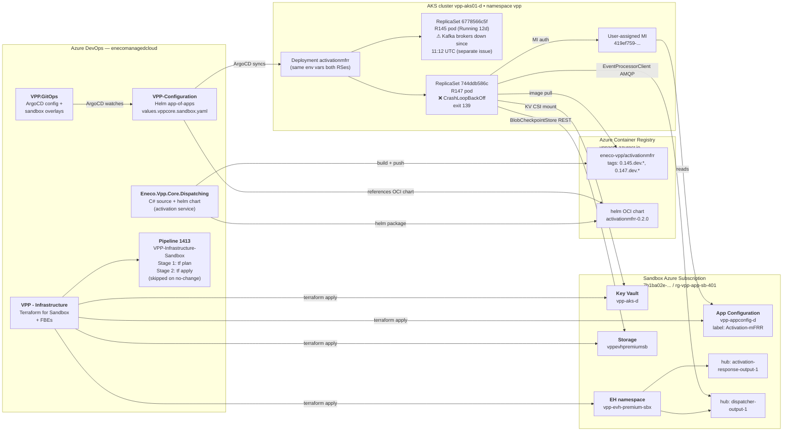
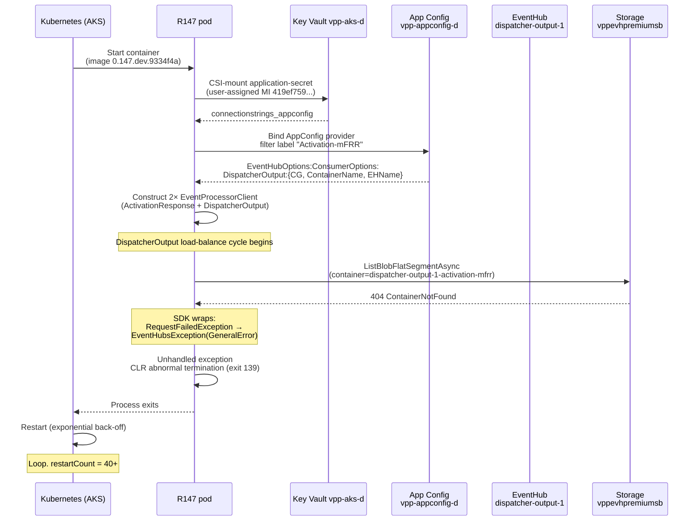
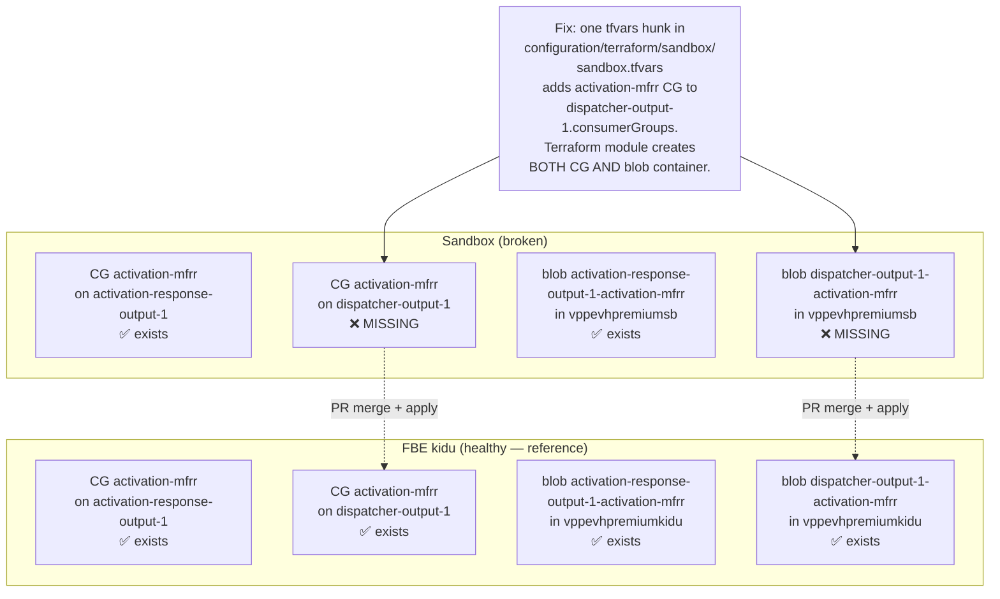
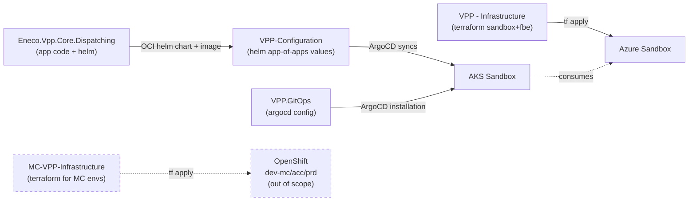

# Systemic Diagrams (Mermaid)

Renders natively in Obsidian / VS Code / GitHub. Complements the ASCII diagram in `systemic-diagram-and-verified-diagnosis.md` §1.

## Diagram 1 — Build + deploy pipeline (how code gets to a pod)

## Diagram 2 — Runtime sequence (why the R147 pod crashes)

## Diagram 3 — Resource parity (where Sandbox differs from FBE-kidu)

## Diagram 4 — Five-repo dependency graph

## How to read these

- Start with **Diagram 4** to see the five repos that compose the VPP Sandbox picture.
- **Diagram 1** shows how code from each repo flows into runtime resources.
- **Diagram 2** shows exactly where and why the R147 pod dies (left-to-right in time).
- **Diagram 3** shows the one-shot diff between Sandbox (broken) and FBE-kidu (healthy reference) — which is what the PR closes.
