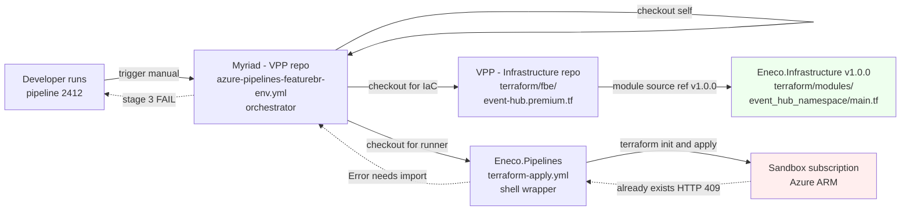
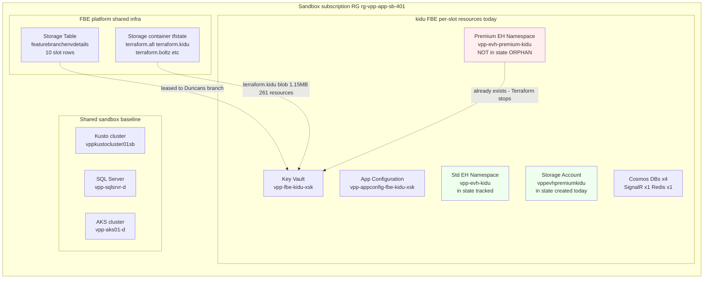
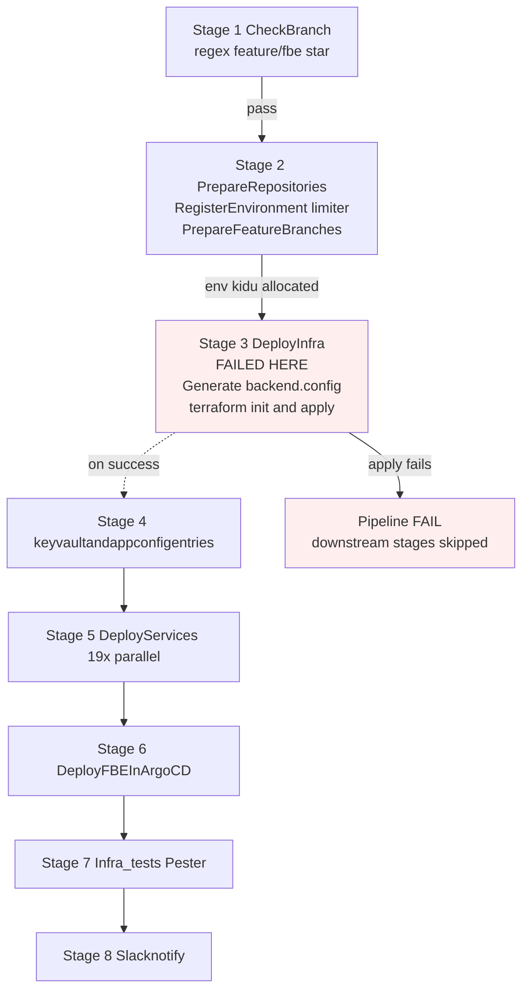

# Holistic RCA — FBE-create failure on `kidu` slot (Duncan, 2026-05-11)

> One sentence: Duncan triggered the FBE-create pipeline on a recycled slot; Terraform tried to create an Azure Event Hub Premium namespace that already exists as a long-abandoned orphan from a prior tenant, and Terraform's "import or fail" safety check fires. **Fix: delete the empty orphan and re-run the pipeline. No code change.**

## Evidence labels used throughout

| Label | Meaning |
|---|---|
| **A1 FACT** | Externally-witnessable: cited file:line, command + captured output, or clickable URL. A reviewer can reproduce. |
| **A2 INFER** | Derived from one or more A1s via reasoning. The reasoning is named. |
| **A3 UNVERIFIED[blocked: <reason>]** | Could not be re-probed in this session; the blocking reason and resolving path are named. |

Local evidence keys are repeated near dense sections so a reader does not need to flip back to this legend.

## Table of contents

| Level | Question it answers | Read if you want to... |
|---|---|---|
| [Context Ledger](#context-ledger) | What does every acronym in this RCA mean? | ... not get lost in vocabulary |
| [L1 Business](#l1--business--why-fbes-exist) | Why does the FBE platform exist at all? | ... understand who is blocked and what they could not do today |
| [L2 Repo system](#l2--repo-system) | Which code repositories does this incident touch? | ... reproduce the diagnosis from cold source |
| [L3 Runtime architecture](#l3--runtime-architecture) | What is deployed and what was the path of the failure? | ... explain the failing surface to a peer |
| [L4 Application code](#l4--application-code-flow) | What does the failing terraform code actually do? | ... reason about why this resource specifically |
| [L5 IaC declarative contract](#l5--iac--state--azure-the-three-truths) | What does the spec say should exist? | ... separate "intent" from "what Azure has" |
| [L6 Pipeline / delivery](#l6--the-pipeline-and-how-it-actually-runs) | How does spec become runtime (and where it fails)? | ... understand the FBE-create lifecycle |
| [L7 Timeline](#l7--timeline) | What happened, when? | ... walk the audit trail |
| [L8 Fix](#l8--fix) | What changes, what doesn't, and why? | ... unblock Duncan or any future tenant of `kidu` |
| [L9 Verification](#l9--verification) | How do we know the fix works? | ... not declare success too early |
| [L10 Lessons](#l10--lessons) | What durable knowledge does this incident produce? | ... prevent recurrence on other slots |
| [L11 Command playbook](#l11--end-to-end-command-playbook) | Recreate this RCA from cold? | ... be the next-shift on-call who reproduces this RCA from scratch |
| [L12 On-call one-pager](#l12--one-page-on-call-playbook) | Spot this class in 5 minutes? | ... triage the next time this pattern appears |

## Context Ledger

A zero-context reader cannot follow causality across systems whose names were never installed. Read this once.

| Term | Meaning | Source | Why it matters here |
|---|---|---|---|
| **VPP** | Virtual Power Plant — Eneco's energy-trading platform that aggregates distributed energy assets (batteries, demand-response, generators) for participation in TenneT's balancing markets (mFRR, aFRR, FCR). The Trade Platform team owns the IaC + pipelines. | A1 — vault [`fbe-architecture-overview.md`](file:///Users/alextorresruiz/Documents/obsidian/2-areas/work-eneco/eneco-vpp-platform/fbe/fbe-architecture-overview.md) + Eneco internal context | The Sandbox subscription hosting Duncan's failing FBE is part of the VPP platform |
| **FBE** | Feature Branch Environment — an ephemeral pre-merge testing environment provisioned for a feature branch (~30 Azure resources + 19 microservices in the shared Sandbox AKS cluster). 10 slots in a fixed pool (`afi, boltz, enel, ionix, ishtar, jupiter, kidu, operations, veku, voltex`), allocated via an Azure Storage Table lease table. | A1 — vault `_index.md` + pipeline `azure-pipelines-featurebr-env.yml:11-21` + lifecycle deep-dive | The whole RCA is about an FBE failing to spin up |
| **Slot** | One of the 10 fixed FBE names. Each slot is leased to a feature branch; when the branch is destroyed, the slot returns to `unused` and is available for reuse. | A1 — vault `fbe-limiter-table-mechanism.md` | Duncan was assigned the `kidu` slot; the previous tenant of `kidu` left an orphan |
| **Limiter table** | Azure Storage Table `featurebranchenvdetails` in storage account `featurebranchdeployment` (RG `rg-vpp-app-sb-401`). Stores 10 rows; each row is a slot. Allocated in stage 2 of the FBE-create pipeline. | A1 — pipeline `azure-pipelines-featurebr-env.yml:178-237` | Decides which slot Duncan gets; the previous tenant's row was set to `active=unused` before Duncan |
| **Sandbox subscription** | Azure subscription `7b1ba02e-bac6-4c45-83a0-7f0d3104922e` (Eneco Cloud Foundation - Sandbox-Development-Test). Hosts all FBE resources. | A1 — `az account show` in this session | All resources in the failure path live here |
| **Pipeline 2412** | The FBE **CREATE** pipeline: `azure-pipelines-featurebr-env.yml` in ADO repo `Myriad - VPP`, project `Myriad - VPP`, org `enecomanagedcloud`. 8 stages, ~50-60 min total. Trigger = manual. | A1 — pipeline file at `myriad-vpp/Myriad%20-%20VPP/development/azure-pipelines-featurebr-env.yml` | Duncan ran this twice, build 1638601 (first) and a retry. Both failed at stage 3 |
| **Pipeline 2629** | The FBE **DESTROY** pipeline: `azure-pipeline-fbe-del.yml`. 4 stages, ~10-15 min. The unsuccessful run of this pipeline on a prior `kidu` tenant is the upstream cause of today's orphan. | A1 — vault `fbe-pipeline-yaml-dissection.md` + repo file exists | Hypothetical prior failed run; not directly observed for `kidu` (A3 below) |
| **Terraform state backend** | Azure Storage account `tfstatevpp`, container `tfstate`, RG `rg-vpp-app-sb-401`. Each FBE has its own blob: `terraform.{env}` — Duncan's slot uses `terraform.kidu`. | A1 — pipeline `azure-pipelines-featurebr-env.yml:382-390` + `az storage blob list` in this session | The state blob has 261 resources tracked, but is MISSING the Premium namespace |
| **Eneco.Pipelines** | A separate ADO repo holding shared pipeline templates referenced by `@Eneco.Pipelines` (e.g., terraform install/init/apply tasks). Pinned by tag in pipeline 2412. | A1 — pipeline `resources.repositories` block | Templates run terraform init + apply inside stage 3 DeployInfra |
| **Eneco.Infrastructure** | A separate ADO repo holding reusable Terraform modules; pinned via `?ref=v1.0.0` in `event-hub.premium.tf`. Provides `event_hub_namespace`, `event_hub`, `event_hub_consumer_group`, `kusto_eventhub_data_connection`, `storageaccount`, `keyvaultsecret` modules. | A1 — git source URLs in `terraform/fbe/event-hub.premium.tf:2-32` | The `event_hub_namespace` module produces the `azurerm_eventhub_namespace` resource that conflicts |
| **`vpp-evh-premium-kidu`** | The orphan Azure resource. An Event Hub Premium SKU namespace, created `2025-06-10T17:28:27Z`, currently EMPTY (no event hubs inside). Created by some prior FBE-create attempt on the `kidu` slot. | A1 — `az eventhubs namespace show` + `az eventhubs eventhub list` in this session | The single resource that blocks Duncan's apply |
| **F# / failure mode** | Slot identifier in the vault's failure-modes catalog (`fbe-failure-modes-catalog.md`). 20 named failure modes F1-F20. Today's incident is **F2** sub-class. | A1 — vault `fbe-failure-modes-catalog.md` | Vault is the authoritative recurrence pattern reference |
| **VPP.GitOps / ArgoCD** | Downstream of FBE-create: an ArgoCD parent Application watches a folder in the `VPP.GitOps` repo; stage 6 of pipeline 2412 writes a `{slot}.yaml` file that triggers ArgoCD to provision the K8s namespace + service workloads in `vpp-aks01-d`. | A1 — pipeline stage 6 + vault `fbe-creation-lifecycle-deep-dive.md` | Not in the failure path today, but in scope for the reader's mental model — Duncan never reached this stage |

## L1 — Business: why FBEs exist

**Anchor question**: Why does this system exist, and who is unable to do their job because it failed?

### Plain-language takeaway

The FBE platform lets a developer run their unmerged feature branch as a full, isolated, pre-production environment in Azure + AKS, so they can manually test their changes against a near-realistic VPP stack before merging. **Duncan needed an FBE this morning, could not get one, and is blocked on whatever pre-merge testing his branch required.**

### Why this matters here

Without FBEs:

- A developer with a multi-service change (e.g., a dispatcher tweak that touches AssetPlanning + ClientGateway + Kusto) cannot validate end-to-end behavior pre-merge.
- The alternative — merging to `development` and testing there — is high-risk because `development` is shared by all FBE consumers; a broken `development` cascades to F1 (stale-branch drift) on every existing FBE.
- The platform team's SLO is implicit: a developer who creates `feature/fbe-*` should receive a working FBE within ~60 minutes on the same day.

Duncan opened `#myriad-platform` at 9:59 AM Amsterdam. He is the consumer of this platform's commitment.

### First-principles pattern this level teaches

> A platform exists for the work it unblocks, not for the code it runs. When the platform itself blocks the consumer, the cost is measured in the consumer's day, not in CPU cycles.

For the reader: when investigating any platform incident, your first question is not "what failed?" — it is "who is blocked, and what cannot they do?" The L1 reader of this RCA should be able to say: "Duncan, blocked on pre-merge testing of a feature branch, on 2026-05-11."

## L2 — Repo system

**Anchor question**: Which code repositories does this incident touch, what role does each play, and where can I read each?

### Repo inventory (with clickable refs)

| Repo (ADO `enecomanagedcloud / Myriad - VPP`) | Local clone path | Role here | What lives in it |
|---|---|---|---|
| [`Myriad - VPP`](https://dev.azure.com/enecomanagedcloud/Myriad%20-%20VPP/_git/Myriad%20-%20VPP) | `myriad-vpp/Myriad%20-%20VPP/development` (HEAD `92b2a7d56`) | **Pipeline definition** | `azure-pipelines-featurebr-env.yml` (FBE create, 732L); `azure-pipeline-fbe-del.yml` (destroy, 486L); 19 service Helm charts |
| [`VPP - Infrastructure`](https://dev.azure.com/enecomanagedcloud/Myriad%20-%20VPP/_git/VPP%20-%20Infrastructure) | `myriad-vpp/VPP%20-%20Infrastructure/main` (HEAD `4dbaf72`) | **Terraform IaC for FBE infra** | `terraform/fbe/` (24 files, ~2853L) including the failing `event-hub.premium.tf` (150L) |
| [`Eneco.Infrastructure`](https://dev.azure.com/enecomanagedcloud/Myriad%20-%20VPP/_git/Eneco.Infrastructure) | `myriad-vpp/Eneco.Infrastructure` (tag `v1.0.0`) | **Reusable Terraform modules** | `terraform/modules/event_hub_namespace/main.tf` (declares `azurerm_eventhub_namespace` resource); plus storageaccount, event_hub, event_hub_consumer_group, kusto_eventhub_data_connection, keyvaultsecret modules |
| [`Eneco.Pipelines`](https://dev.azure.com/enecomanagedcloud/Myriad%20-%20VPP/_git/Eneco.Pipelines) | `myriad-vpp/Eneco.Pipelines` (tag pinned per usage) | **Shared pipeline templates** | `terraform/pipelines/tasks/terraform-apply.yml` etc. (templates that wrap `terraform init/apply` with backend config + SP creds) |
| [`VPP.GitOps`](https://dev.azure.com/enecomanagedcloud/Myriad%20-%20VPP/_git/VPP.GitOps) | not in failure path | ArgoCD app-of-apps repo | Downstream of failure — Duncan's pipeline never reached stage 6 to push to this repo |
| [`vpp-configuration`](https://dev.azure.com/enecomanagedcloud/Myriad%20-%20VPP/_git/vpp-configuration) | not in failure path | Service Helm values | Downstream of failure — same as above |
| ⚠️ STALE CLONE — `VPP - Infrastructure` (NOT THE ACTIVE PIPELINE) | `enecomanagedcloud/VPP%20-%20Infrastructure` (HEAD `2e9793a`, Sept 2025) | **OBSOLETE** — not in failure path | Contains an `azurepipelines-fbe.yaml` (208L) with a literal-string state-key bug on line 207 (`terraform.{{ parameters.environment }}` — missing `$`). **This file is NOT the pipeline that ran build 1638601.** Pipeline 2412 uses `azure-pipelines-featurebr-env.yml` in the `Myriad - VPP` repo. Flagged here so a future reader who finds this file does not confuse it with the active pipeline. |

[**Evidence labels in this section**: every Local clone path is A1 (directory listed in this session via `ls`); every ADO URL is A2 (constructed from the ADO `enecomanagedcloud / Myriad - VPP` project per known org/project naming) — A reader can verify by clicking and confirming the repo name.]

### Repo flow story (what each repo contributes to the failure path)

Reading the table without prose misses the **causal arc**:

1. Pipeline 2412 (in **`Myriad - VPP`**) is what Duncan invoked. It is the orchestrator.
2. Pipeline 2412's `DeployInfra` stage checks out **`VPP - Infrastructure`** to read `terraform/fbe/event-hub.premium.tf`.
3. That `event-hub.premium.tf` calls a module sourced from **`Eneco.Infrastructure`** at `?ref=v1.0.0`. The module declares the `azurerm_eventhub_namespace` resource — the resource Azure rejected.
4. The pipeline ALSO checks out **`Eneco.Pipelines`** for the `terraform-apply.yml` template (the shell wrapper around `terraform init/apply`). The shell wrapper is the literal executor that ran the failing command in Duncan's build log.
5. **`VPP.GitOps`** and **`vpp-configuration`** are downstream — Duncan's pipeline failed at step 3 (DeployInfra), well before stages that touch them. They are listed for the reader's whole-system mental model, but **they did not contribute to the failure**.

### Map of repo handoffs



### Plain-language takeaway

The failure crosses **three repos** (`Myriad - VPP` orchestrates; `VPP - Infrastructure` declares; `Eneco.Infrastructure` provides the module). The reader cannot understand the error path by reading any single repo.

### First-principles pattern this level teaches

> A multi-repo platform makes the failing line look local but the cause distributed. The error message names a line in `event-hub.premium.tf` — but the conflict is in Azure, the wrapper is in `Eneco.Pipelines`, and the orchestration is in `Myriad - VPP`. Resist the urge to fix the file that named the error; instead, ask which truth surface was violated.

## L3 — Runtime architecture

**Anchor question**: Which deployed pieces does the failure touch, and what was the topology Duncan's build moved through?

### The Sandbox subscription perspective



### Independence model — what is shared vs per-FBE

[**Evidence labels in this section**: every "in state, tracked" claim is A1 (verified via `jq` against the downloaded state file `proofs/outputs/probe-03-terraform-kidu-state.json`); creation timestamps are A1 (verified via `az eventhubs namespace show` and `az storage account show`).]

| Surface | Per-slot or shared? | Where it lives | Independence proof |
|---|---|---|---|
| Slot lease row | Per-slot | `featurebranchenvdetails` table | A1 — one row per env name |
| Terraform state blob | Per-slot | `tfstate/terraform.{env}` | A1 — blob list shows `terraform.kidu`, `terraform.afi`, etc., each distinct |
| Per-FBE Azure resources (KV, AppConfig, Cosmos, EH NS, etc.) | Per-slot | RG `rg-vpp-app-sb-401`, name includes `{env}` | A1 — `az resource list` filtered by `contains(name, 'kidu')` returns ~35 distinct resources, none shared with other envs |
| Sandbox AKS cluster `vpp-aks01-d` | **Shared** | Same RG | A1 — vault `fbe-architecture-overview.md` |
| Sandbox Kusto cluster `vppkustocluster01sb` | **Shared** | Same RG | A1 — Kusto DBs are per-FBE (`kidu-Monitor`, `kidu-Aggregation`, etc.) but the cluster itself is shared |
| Sandbox SQL Server `vpp-sqlsrvr-d` | **Shared** (databases are per-FBE) | Same RG | A1 — `az resource list` shows DB names `vpp-sqlsrvr-d/asset-fbe-kidu` etc. |
| ArgoCD `argocd.dev.vpp.eneco.com` | **Shared** | AKS cluster | A1 — vault `fbe-live-deployed-state.md` |

### Plain-language takeaway

The `kidu` slot has its own dedicated set of Azure resources in the same RG that hosts all FBE slots. **Duncan's failure is isolated to his slot** — it does not affect `afi`, `ionix`, or any other in-use FBE. But Duncan's slot also shares the Sandbox baseline (AKS cluster, Kusto cluster, SQL server, ArgoCD). The blast radius is **only Duncan + future tenants of `kidu` until the orphan is removed**.

### First-principles pattern this level teaches

> Per-slot resources are independent; shared baseline is not. The slot model trades shared baseline cost for per-slot blast radius isolation. F2 (cleanup residue) is a slot-local failure mode; F10 (sandbox cluster pressure) is a shared-baseline failure mode. The fix scope follows the blast radius scope.

## L4 — Application (code) flow

**Anchor question**: What does the failing terraform code actually do at the moment of failure, and how does the Azure conflict surface back as an error?

### The literal failing call

```hcl
# File: VPP - Infrastructure/terraform/fbe/event-hub.premium.tf, lines 1-19
module "eventhub_namespace_premium" {
  source = "git::https://enecomanagedcloud@dev.azure.com/enecomanagedcloud/Myriad%20-%20VPP/_git/Eneco.Infrastructure//terraform/modules/event_hub_namespace?ref=v1.0.0"

  location                = var.location
  resource_group_name     = var.resource_group_name
  eventhub_namespace_name = format("%s-evh-premium-%s", var.project-prefix, var.environment)
  sku                     = "Premium"
  network_rulesets        = [...]
}
```

[Source: A1 — file at `myriad-vpp/VPP%20-%20Infrastructure/main/terraform/fbe/event-hub.premium.tf:1-19`]

The module's interior is, at the resource layer:

```hcl
# File (inside the module): terraform/modules/event_hub_namespace/main.tf, line 2
resource "azurerm_eventhub_namespace" "eventhub_namespace" {
  ...
}
```

Full resource address in state: `module.eventhub_namespace_premium.azurerm_eventhub_namespace.eventhub_namespace`.

### The name interpolation

For Duncan, `var.environment` is `"kidu"` (passed by pipeline 2412's stage 3 as `-var environment=$(featurebranchname)` after the limiter table assigned slot `kidu`). `var.project-prefix` is `"vpp"`. So:

```
eventhub_namespace_name = format("vpp-evh-premium-%s", "kidu") = "vpp-evh-premium-kidu"
```

This is the exact name in the build error.

### The provider's "exists check" mechanism

When Terraform `apply` reaches `azurerm_eventhub_namespace.eventhub_namespace`, the `hashicorp/azurerm@4.40.0` provider does:

1. ARM `PUT /subscriptions/.../namespaces/vpp-evh-premium-kidu?api-version=...`.
2. ARM returns one of:
   - `201 Created` → success, state updated.
   - `409 Conflict / ... already exists` if the provider issues a pre-check, OR the PUT detects a name collision.

For the azurerm provider, the **pre-import safety check** is observable in the error message itself: when the provider's CreateContext detects an existing resource at the target ID with no corresponding state entry, it emits the "resource needs to be imported into the state" guard rail. The precise call-site is not source-traced in this RCA (A2 — derived from the error text shape, not from a code-trace into `hashicorp/terraform-provider-azurerm@v4.40.0`); the behavior is consistent with how the azurerm provider has worked since v2.x. The behavior is by design — silent take-over of unmanaged resources would surprise operators.

### How that surfaces in Duncan's log

```text
##[error]Terraform command 'apply' failed with exit code '1'.
##[error]╷
│ Error: A resource with the ID "/subscriptions/.../namespaces/vpp-evh-premium-kidu"
│ already exists - to be managed via Terraform this resource needs to be imported
│ into the State. Please see the resource documentation for "azurerm_eventhub_namespace"
│ for more information.
│
│   with module.eventhub_namespace_premium.azurerm_eventhub_namespace.eventhub_namespace,
│   on .terraform/modules/eventhub_namespace_premium/terraform/modules/event_hub_namespace/main.tf line 2
```

[Source: A1 — `antecedents/context.md:25-33`]

The resource address `module.eventhub_namespace_premium.azurerm_eventhub_namespace.eventhub_namespace` matches the IaC code address. The file-line points into the **cached, downloaded** module source (`.terraform/modules/eventhub_namespace_premium/...`) — that's why the path has `.terraform/modules/` in it, not the IaC repo path.

### Plain-language takeaway

The error is not a bug in `event-hub.premium.tf` — it is a deliberate safety guard inside the AzureRM provider. The provider sees `vpp-evh-premium-kidu` in Azure, sees no state record, and refuses to silently take ownership. The fix is therefore at the truth-surface level (Azure or state), not the code level.

### First-principles pattern this level teaches

> Terraform's "already exists" error is a contract: "I refuse to manage what I did not create unless you explicitly say so (via `terraform import`)." This is one of the few cases where Terraform's silent-failure-prevention bias surfaces clearly. The error names the resource address you would use for the import.

## L5 — IaC / state / Azure — the three truths

**Anchor question**: What does the spec say should exist (intent), what does the state say is being managed (record), and what does Azure say actually exists (reality)? Where do they disagree, and why does that disagreement matter?

[**Evidence labels in this section**: every reading of state contents is A1 (via `jq` against the downloaded state file). Every reading of Azure is A1 (via `az` in this session). Every reading of IaC is A1 (via `Read` against the file).]

### The three truths for the failing resource

| Surface | What it says about `vpp-evh-premium-kidu` | Source of truth |
|---|---|---|
| **IaC intent** (`event-hub.premium.tf:1-19`) | "There SHOULD be a Premium EH namespace named `vpp-evh-premium-{env}` with these network rules" | Source code |
| **Terraform state** (`tfstate/terraform.kidu`) | "I am NOT managing any resource at address `module.eventhub_namespace_premium.azurerm_eventhub_namespace.eventhub_namespace`" — i.e., the address is missing from `.resources[]` | Storage blob, 1.15 MB, modified `2026-05-11T08:04:27Z` |
| **Azure ARM** (real cloud) | "I have a Premium EH namespace named `vpp-evh-premium-kidu`, `createdAt 2025-06-10T17:28:27Z`, `provisioningState Succeeded`, 0 event hubs inside, 0 tags" | `az eventhubs namespace show` |

### The disagreement table

| Truth pair | Agreement? | Operational meaning |
|---|---|---|
| IaC vs Azure | "should exist" vs "exists" — **agree on existence** | Both want this namespace |
| IaC vs State | "should exist" vs "I don't manage one" — **disagree on management** | State has a hole |
| State vs Azure | "not managed" vs "exists" — **disagree on identity** | The orphan |

The "orphan" is the disagreement between State and Azure. Closing this gap is the fix.

### What else does state disagree with vs match?

| Comparison | Result |
|---|---|
| State has `module.eventhub_namespace_premium_storageaccount.azurerm_storage_account.storage_account` | A1 — confirmed via `jq` |
| Azure has storage account `vppevhpremiumkidu`, createdAt `2026-05-11T06:54:14` (TODAY) | A1 — `az storage account show` |
| State has 261 resources total, modified `2026-05-11T08:04:27Z` (TODAY) | A1 — state file size 1.15 MB, jq `.resources \| length` |
| State has the STANDARD EH namespace `module.eventhub_namespace.azurerm_eventhub_namespace.eventhub_namespace` with id pointing to `vpp-evh-kidu` | A1 |
| Azure has `vpp-evh-kidu` Standard EH namespace, createdAt `2025-03-05T01:52:26` | A1 |

### The "why is the storage account in state but not the namespace" insight

Both resources are siblings under the same logical module (`event-hub.premium.tf`), but they map to **different child modules**:

- `module.eventhub_namespace_premium` → declares `azurerm_eventhub_namespace`
- `module.eventhub_namespace_premium_storageaccount` → declares `azurerm_storage_account`

These are independent Terraform resources. **Three non-falsified provenance hypotheses** (all A2 — derived from the state-vs-Azure disagreement; none of them is in-session falsifiable, but the *fix path is identical regardless of which is true*):

- **Hypothesis P1 — Failed destroy + state-rm**: A prior FBE on `kidu` created the namespace (somewhere between 2025-03-05 and 2025-06-10 — the storage account was not yet in IaC at that earliest date). Later, the destroy pipeline ran. Terraform destroy attempted to delete the namespace, encountered an error (Premium SKU slow-delete, network rule, RBAC, or operator-time abandonment), and the namespace was either skipped or `terraform state rm`'d to "unblock" the destroy. The slot was released to `unused`. Today, Duncan picked up `kidu`; the state was empty of the namespace; Terraform created the storage account fresh (no conflict) and choked at the namespace (which still exists in Azure from the prior tenant).
- **Hypothesis P2 — Out-of-band creation**: An operator created the namespace manually (Azure CLI, portal, ARM template) for a one-off test in June 2025, not via pipeline 2412. Empty tags + 11-month-orphan + no state ref are consistent with this. Indistinguishable from P1 by empirical signal alone.
- **Hypothesis P3 — Terraform version-drift skip (F19-style)**: An earlier destroy attempt was triggered with terraform 1.13.1 (the destroy pipeline's pinned version per `fbe-failure-modes-catalog.md F19`). If state had been written by a newer terraform version that 1.13.1 could not parse cleanly, terraform may have silently skipped the namespace destroy while reporting success. The namespace was thus left in Azure while state was "cleaned" by the operator's expectation.

The standard EH namespace `vpp-evh-kidu` (created 2025-03-05) IS tracked in current state and is healthy; this is **consistent with P1 most cleanly** (the destroy ran after the standard NS was already migrated to a fresh re-create cycle, and the premium-NS destroy is what failed) — but P2 and P3 cannot be excluded without lease-table history + destroy-pipeline run logs both of which exceed in-session reach.

**Without lease-table history access** (probe-10 returned RBAC 403; el-demoledor's review independently verified the *current* lease via storage-key auth, but the *history* of prior tenants on `kidu` is still A3), the upstream cause story is non-falsifiable in-session. The empirical state-vs-Azure disagreement is fully verified; the upstream cause is one of P1/P2/P3 and the fix is the same regardless.

### Plain-language takeaway

Terraform's contract is: "the state is the truth about what I manage; Azure is the truth about what exists; the spec is the truth about what should exist." When all three agree, Terraform is happy. When state disagrees with Azure on a resource the spec wants, you get the "already exists" error.

### First-principles pattern this level teaches

> Every IaC failure is a disagreement among three truths: spec, state, cloud. Name which two disagree, and the fix follows: state vs cloud → `terraform import` or delete-and-recreate; spec vs cloud → write the spec or unmanage the cloud resource; spec vs state → re-apply or modify spec. Duncan's case is state-vs-cloud.

## L6 — The pipeline and how it actually runs

**Anchor question**: How does the pipeline get from Duncan's branch push to the failing `terraform apply` call, and where does the failure surface?

### Pipeline 2412 at a glance



[Source: A1 — pipeline `azure-pipelines-featurebr-env.yml` stages map verbatim. Vault `fbe-creation-lifecycle-deep-dive.md` corroborates.]

### What stage 3 actually executes

Stage 3 `DeployInfra` is 11 sub-steps; the critical ones:

| Sub-step | Behaviour | File:line |
|---|---|---|
| Generate backend config (PowerShell) | Writes `fbe.backend.config` with `key = "terraform.$(featurebranchname)"` (= `terraform.kidu`) | pipeline L378-397 |
| Install Terraform 1.14.3 | Uses CCoE template `terraform/install.yaml@templates` | pipeline L399-401 |
| Terraform init | Uses CCoE template `terraform/init.yaml@templates` with backend.config | pipeline L403-407 |
| OIDC SP creds for azurerm | Maps Build.Sp federated token to ARM env vars | pipeline L409-419 |
| `az login` for betr-io/mssql provider | Needed because mssql provider doesn't speak OIDC | pipeline L440-448 |
| **Terraform Apply** (TerraformCLI@1 task) | `terraform apply -auto-approve -var environment=kidu -var kusto_cluster_name=vppkustocluster01sb -var kafka_queue_name=com-eneco-eet-vpp-streamcopy-dev10`; `retryCountOnTaskFailure: 3` | pipeline L450-461 |

Duncan's failed log line `context.md:50` matches sub-step "Terraform Apply" exactly (the `-auto-approve -auto-approve` duplication is because TerraformCLI@1 auto-prepends the flag AND the inline `commandOptions` has it; cosmetic only).

### Why retry "errored quicker"

Pipeline `retryCountOnTaskFailure: 3` means each Terraform Apply invocation auto-retries up to 3 times within the same job. After the first apply fails ("already exists"), the retry-2 starts at terraform init + apply. terraform refreshes state (now slightly faster because some resources are now in state from the first attempt) and reaches the same conflict in less time — the same `already exists` error, faster. **Hence Duncan's "errored out even quicker".** No new failure mode; just retry feedback.

### State-key correctness verification

A common misdiagnosis here would be to suspect a typo in the state-key interpolation. There is none in this pipeline (`azure-pipelines-featurebr-env.yml:382-390`):

```powershell
$configContent = @"
container_name       = "tfstate"
key                  = "terraform.$(featurebranchname)"
resource_group_name  = "$(resourceGroupName)"
storage_account_name = "tfstatevpp"
"@
```

The `$(featurebranchname)` is a **PowerShell variable substitution** (because the script runs in PowerShell, where `$(...)` is sub-expression syntax), not ADO template syntax. `featurebranchname` is set in the `DeployInfra` variables block from the limiter output. The resulting backend.config file contains `key = "terraform.kidu"` — confirmed by the state blob list showing `terraform.kidu` is the live blob, modified today.

[**Note for future readers**: there exists a STALE obsolete file `azurepipelines-fbe.yaml` in a different repo (`VPP - Infrastructure`, last touched Sept 2025) that DID have a `{{ parameters.environment }}` literal-string typo on its Apply backendKey. **It is not the active pipeline.** Pipeline 2412 uses `azure-pipelines-featurebr-env.yml` in the `Myriad - VPP` repo. If you find yourself analyzing the wrong file, see [`context/codebase-map.md`](../context/codebase-map.md) for the repo-by-repo map.]

### Plain-language takeaway

Pipeline 2412 worked exactly as designed. It correctly allocated slot `kidu`, correctly wrote `terraform.kidu` as the state key, correctly ran `terraform apply` against Duncan's intended IaC. The conflict is upstream of pipeline logic.

### First-principles pattern this level teaches

> A pipeline that fails is not always a pipeline that misbehaves. Pipelines that correctly observe an external-state defect FAIL because that is what they were built to do (fast-fail on a destructive ambiguity). The fix is at the truth-surface that the pipeline correctly refused to silently ignore.

## L7 — Timeline

**Anchor question**: What happened, when, and in what order?

[**Evidence labels in this section**: every dated event is A1 (verified via `az` show or build log) unless tagged A2 INFER.]

| When (UTC) | Where | Event | Evidence |
|---|---|---|---|
| **`2025-03-05T01:52:26`** | Azure | Standard EH namespace `vpp-evh-kidu` was created. | A1 createdAt — `az eventhubs namespace show vpp-evh-kidu` |
| `2025-03-05` (same time, by inference) | Pipeline 2412 (or out-of-band) | Creation mechanism: most likely an FBE-create run, but could be out-of-band (P2 hypothesis above). The standard NS *is* in current state, suggesting it survived a later destroy cycle. | A3 — ADO build history > 60 days requires retention probe |
| **`2025-06-10T17:28:27`** | Azure | Premium EH namespace `vpp-evh-premium-kidu` was created. | A1 createdAt — `az eventhubs namespace show vpp-evh-premium-kidu` |
| `2025-06-10` (same time, by inference) | Pipeline 2412 (or out-of-band) | Creation mechanism: one of P1/P2/P3 (see L5). The premium NS is NOT in current state — separates its fate from the standard NS. | A3 — same blocker |
| `<unknown>` ~late 2025 / early 2026 | Pipeline 2629 (destroy) or out-of-band | A prior `kidu`-slot tenant ran (or had auto-eviction run) the destroy pipeline. The destroy partially completed; the Premium namespace was either not destroyed OR was `terraform state rm`'d. The slot row in `featurebranchenvdetails` was reset to `active=unused`. The state blob `terraform.kidu` ended up missing the Premium namespace. | A3 UNVERIFIED[blocked: lease-table history and destroy-pipeline run history both require RBAC not held in this session]; A2 INFER from empirical state-vs-Azure disagreement |
| `<unknown>` between then and 2026-05-11 | Limiter table | Other developers may have tried to reuse the `kidu` slot and hit the same failure — each one would have either escalated, abandoned the slot, or found a workaround. (Speculative; no in-session evidence.) | A3 |
| **`2026-05-11T08:00:43`** | Pipeline 2412 | Duncan triggers pipeline 2412 build `1638601` from branch `feature/fbe-821600-date-selector-flex-reservation-dashboard`. | A1 — `az pipelines runs show --id 1638601` (probe-12); requestedFor: Duncan.Teegelaar@eneco.com |
| `2026-05-11T~06:52` | Stage 2 RegisterEnvironment | Limiter table query finds Duncan's branch is NEW; finds `kidu` row with `active=unused`; assigns slot `kidu` to Duncan. | A1 — pipeline stage 2 behavior + the build ran (so allocation succeeded) |
| **`2026-05-11T06:54:14`** | Azure | Storage account `vppevhpremiumkidu` created. (Terraform apply created the premium storage account successfully.) | A1 — `az storage account show vppevhpremiumkidu` createdAt |
| **`2026-05-11T07:00:52`** | Azure | Storage account `vppevhfbekidu` (standard EH backing) created. | A1 — `az storage account show vppevhfbekidu` createdAt |
| ~`2026-05-11T07:00-08:00` | Terraform apply | The apply provisions ~260+ resources successfully (KV, AppConfig, Cosmos, SQL DBs, Kusto DBs, etc.), then reaches `module.eventhub_namespace_premium.azurerm_eventhub_namespace.eventhub_namespace`. ARM rejects: namespace already exists. Apply fails. | A2 INFER from state size (1.15 MB, 261 resources) + build log |
| **`2026-05-11T08:04:27`** | Storage container | State blob `terraform.kidu` last-modified time. State now reflects the partial success (resources created today are tracked; Premium namespace is NOT tracked because it failed before being persisted). | A1 — `az storage blob list` |
| **`2026-05-11T~09:59`** Amsterdam (~`07:59 UTC`) | `#myriad-platform` | Duncan posts the failure with the build URL, asks for a look. | A1 — `slack-intake.txt:3` |
| **`2026-05-11T~10:14`** Amsterdam | `#myriad-platform` | Duncan reports the retry failed faster (consistent with retry-feedback mechanism on a stable conflict). | A1 — `slack-intake.txt:11-12` |
| `2026-05-11` (this session) | This investigation | RCA + fix authored. | This document. |

### Plain-language takeaway

The orphan is **11 months old**. Duncan is the latest tenant of `kidu` to encounter it; he is likely not the first (though the in-between attempts are unverifiable). The orphan was unaddressed for that whole period because nobody who hit it documented or fixed the residue — they probably abandoned the slot.

### First-principles pattern this level teaches

> Stale state defects compound. Each failed re-attempt that does not address the residue leaves the next attempt with the same trap. A platform without a "drain the slot before reissue" enforcement step accumulates orphan residue proportional to slot churn.

## L8 — Fix

**Anchor question**: What changes (Azure), what doesn't (state, IaC, pipeline), and why?

### What we do

Delete the orphan namespace from Azure, then re-run pipeline 2412 from Duncan's branch (`feature/fbe-821600-date-selector-flex-reservation-dashboard`, verified via build 1638601 metadata). **See `output/fix.md` for the executable step-by-step.**

### Why delete-recreate over `terraform import`

Both routes can resolve the state-vs-cloud disagreement. The fix doc chose **delete-recreate** for three reasons:

1. **The orphan is empty** (verified across multiple probes: zero event hubs, zero consumer groups, zero auth rules beyond the auto-generated SAS, zero IP/vnet rules, `trustedServiceAccessEnabled: false`). There is no data to preserve.
2. **The orphan is 11 months stale** vs. current IaC. An `import` would attach the orphan to state, then the immediate next `terraform plan/apply` would compute drift between orphan config and IaC config (network rules, SKU sub-attributes, tags) and propose modifications. The cost of debugging that drift exceeds the cost of a fresh create.
3. **`terraform import` from an ADO pipeline is awkward**: the import call needs to happen inside the pipeline workdir with state lease held, and `azure-pipelines-featurebr-env.yml` has no import hook. An operator-level `terraform import` would require local terraform with the same backend credentials, which is a separate setup. Delete-recreate keeps the operator in `az` CLI for the destructive part and lets the pipeline drive Terraform.

### What changes vs what doesn't

| Surface | Changes? | Why |
|---|---|---|
| Azure namespace `vpp-evh-premium-kidu` | DELETED, then recreated by Terraform apply | The orphan must go; pipeline recreates it cleanly |
| `terraform.kidu` state | NOT modified by hand; Terraform apply will ADD `module.eventhub_namespace_premium.azurerm_eventhub_namespace.eventhub_namespace` after successful create | No state surgery needed |
| `event-hub.premium.tf` and any IaC | NOT modified | The IaC is correct; the bug is in cleanup |
| Pipeline 2412 YAML | NOT modified | The pipeline is correct |
| Other Azure resources for `kidu` (KV, AppConfig, Cosmos, SQL DBs, etc.) | NOT modified (already created today; will be no-op on retry) | They are correctly in state, correctly created |
| Lease-table row for Duncan's branch | NOT modified (lease still held) | Duncan keeps the slot; re-run pipeline reuses |
| `vpp-evh-premium-sbx` (sandbox plane) or any OTHER FBE's resources | NOT touched | Blast radius is strictly `kidu` |

### What this fix does NOT change

- Other slots that may have similar orphans (none observed in-session, but the lease table was not enumerable due to RBAC; **a Phase-9 task should audit all 10 slots for orphans**).
- The destroy pipeline's residual mechanism (this fix is reactive; preventing future occurrences requires a destroy-pipeline audit).
- The runbook's triage table (currently `fbe-operations-runbook.md` symptom table does not route "Pipeline 2412 fails at apply with 'already exists'" to F2 — **a Phase-9 task should patch the runbook**).

### Plain-language takeaway

The fix is small, fast, and reversible only in the limited sense that "delete plus terraform-recreate" produces the same logical namespace at the end. The orphan being empty (no event hubs, no consumer groups) is what makes deletion safe in the first place.

### First-principles pattern this level teaches

> When a defect is in cleanup, the fix is in cleanup. Resist the urge to retrofit pipeline/code "protection" against a class of defect that is structurally a janitorial problem. The pipeline-side fix is "ensure destroy is complete before slot release"; the field-side fix today is "clean what destroy left behind."

## L9 — Verification

**Anchor question**: How do we know the fix worked, and how would we falsify a premature "fixed" claim?

### Pre-fix state (what must be true before applying the fix)

| Check | Expected |
|---|---|
| `az eventhubs namespace show --name vpp-evh-premium-kidu` | returns 200 with `provisioningState: Succeeded`, `createdAt: 2025-06-10T...` |
| `az eventhubs eventhub list --namespace-name vpp-evh-premium-kidu` | returns `[]` (orphan is empty) |
| Latest pipeline 2412 run on Duncan's branch | status `failed`, stage `DeployInfra` failed |

### Post-fix verification cascade

| Check | Pass if | Falsification probe |
|---|---|---|
| Step 4 polling | `az eventhubs namespace show` returns 404 within 15 min | If still present after 15 min → fix failed at delete; escalate |
| Pipeline 2412 rerun stage 3 | green | If stage 3 still red with same error → delete didn't stick OR there's a second-order race; escalate |
| Pipeline 2412 rerun final stage | green; Slack notification posted | If pipeline succeeds but no Slack message → cosmetic only; FBE itself is fine |
| `kubectl get ns kidu` | `Active` | If `Terminating` → F2/F3 ArgoCD-finalizer; different failure mode |
| `kubectl get pods -n kidu` | all `Running` | If `CrashLoopBackOff` with `SecretNotFound` → F7 secrets_to_copy regression; different failure mode |
| `curl https://kidu.dev.vpp.eneco.com/` | 200 with `Request-Context` + `x-correlation-id` headers | If 200 SPA fallback → routing class (see `eneco-vpp-argocd-healthy-but-unreachable-troubleshooting`) |

### What I CANNOT verify in this session (the honest gap)

- (a) Whether the **rerun actually succeeds**. This RCA was authored BEFORE Duncan executes the fix. The fix doc's Steps 5/5.5/6/7 are the verification commands he runs.
- (b) Whether **other slots** (`afi`, `boltz`, ..., `voltex`) have similar orphans waiting to bite their next tenant. This requires bulk enumeration over each `terraform.{env}` state vs each `vpp-evh-premium-{env}` namespace; the fix doc's Step 8 includes a script that performs exactly this audit (recommended but not blocking for Duncan).
- (c) **The precise provenance of the orphan** (failed destroy with state-rm P1 / out-of-band create P2 / version-drift skip P3, per L5) is not in-session falsifiable. The fix is identical regardless.
- (d) The historic-rename orphan `vpp-evh-premium-mod` (created 2025-11-10; flagged by el-demoledor's adversarial review) exists for a slot name no longer in the lease table. This is out of scope for unblocking Duncan but a follow-up cleanup item.

### Plain-language takeaway

The fix is verifiable end-to-end by Duncan (or any agent) following the fix doc. The only thing that would invalidate the diagnosis is if the post-delete pipeline rerun fails at the SAME resource (in which case the orphan didn't actually go away). All other failure modes after the fix are different incidents.

### First-principles pattern this level teaches

> Verification ≠ adversarial. Verification observes the predicted post-fix state. Adversarial would ask "is there a state where the fix appears to succeed but the real defect persists?" Both are needed; this RCA addresses verification here and adversarial review in `auxiliary/adversarial-review-*.md`.

## L10 — Lessons

**Anchor question**: What durable knowledge does this incident produce that survives renaming `kidu`?

### Lesson 1 — Apply-time Azure-resource orphan on slot reuse is an empirically live pattern

**Pattern**: Azure resources can survive slot release for multiple reasons including (P1) failed destroys with `terraform state rm` workarounds, (P2) out-of-band create, (P3) terraform version drift (F19) silently skipping resources. **Regardless of the upstream cause, the slot-release path lacks a residue-zero check**, so the next tenant of the slot inherits the trap. Today's incident is a verified live instance of this class.

**Probe (cheap test that would have caught this earlier)**:

```bash
# Per slot: do we have a premium NS in Azure that is NOT tracked in the slot's state file?
# Boundary-aware match (avoid false positives like 'enel' matching unrelated resources)
for ENV in afi boltz enel ionix ishtar jupiter kidu operations veku voltex; do
  IN_AZ=$(az resource list -g rg-vpp-app-sb-401 \
    --query "[?ends_with(name, '-${ENV}') || contains(name, '-${ENV}-')] | length(@)" -o tsv)
  echo "${ENV}: ${IN_AZ} Azure resources"
done
```

If a slot row is `active=unused` (no current tenant) AND Azure shows resources matching that slot's name pattern, the slot has residue. For the most specific premium-NS check, see the audit in `output/fix.md` Step 8.

**Defense (structural change)**: The destroy pipeline (`azure-pipeline-fbe-del.yml`) should, at the end of its successful run, **verify zero residue** before releasing the slot. If residue exists, the pipeline should fail and the operator must clean it before slot release. Additionally, address F19 (destroy pipeline still on terraform 1.13.1 while create is on 1.14.3) — version mismatch can cause silent skip on state-version-mismatch errors. Both are Phase-9 follow-ups (out of scope today).

### Lesson 2 — Stale local clones are a self-inflicted RCA hazard

**Pattern**: Two clones of the same ADO repo (`enecomanagedcloud/VPP%20-%20Infrastructure` at HEAD `2e9793a` Sept 2025 vs `myriad-vpp/VPP%20-%20Infrastructure/main` at HEAD `4dbaf72` — current). Reading the stale clone led me to misidentify `azurepipelines-fbe.yaml` as the active pipeline, then to a false typo-bug hypothesis, before correcting via `find` + the actual build log's `-var kafka_queue_name=…` flag.

**Probe**: When a repo path exists in multiple Dropbox-synced directories, the `git rev-parse HEAD` output should be cross-checked against the actual remote `git ls-remote origin HEAD` (when network allows) — OR against a known-current artifact (build log, Slack reference to a recent PR number).

**Defense**: Always pair the FIRST `Read` of a repo file with `git log -1 --format='%h %s %ad'` on its containing repo so a stale clone reveals itself.

### Lesson 3 — Cross-repo failure paths require explicit topology

**Pattern**: Pipeline 2412 is in repo A; IaC is in repo B; module is in repo C. The build-log error names a path inside `.terraform/modules/...` which is REPO C cached inside REPO B's work directory inside REPO A's checkout. A reader who only reads the error path goes to the wrong file.

**Probe**: Before reading a Terraform error path verbatim, decode it: `.terraform/modules/<local-name>/<module-internal-path>` = the LOCAL NAME maps to a SOURCE URL in the calling IaC; the SOURCE URL is the canonical location of the failing line.

**Defense**: Document repo topology (this RCA's L2) is necessary for any FBE incident; the vault note `fbe-architecture-overview.md` should embed a similar repo flow diagram. Already partially there; today's investigation needed L2 to disambiguate.

### Lessons distilled

| # | Lesson | Generalizable away from this incident? | Yes/No |
|---|---|---|---|
| 1 | F2 Azure-resource sub-class is live; slots can carry forward orphans | Strip "kidu" and "Event Hub Premium" → "Any slot-recycled FBE platform can carry residue forward". General. | YES |
| 2 | Two clones of the same repo on disk hide staleness | General. | YES |
| 3 | Cross-repo error paths require topology before file-reading | General. | YES |

## L11 — End-to-end command playbook

**Anchor question**: Could a fresh next-shift on-call, with zero context on this incident, recreate the diagnosis from cold by following this playbook?

> Each command block is paired with: Question, Why this command/API, Selected fields, Expected output (text shape), Decision rule, and Reusable Principle. Run them in order. The freshness probes embedded ensure the playbook reproduces the original investigation, not a stale-mirror trap.

### Step 1 — Set Sandbox subscription

**Question**: Which subscription am I going to read against?
**Why this command**: `az account set` is the canonical subscription-context setter in `az` CLI.
**Selected fields**: subscription ID only.
**Expected output**: nothing on success; `az account show --query name -o tsv` returns `Eneco Cloud Foundation - Sandbox-Development-Test`.
**Decision rule**: any other name → STOP, re-check the subscription ID against CLAUDE.md memory or the Eneco platform docs.
**Reusable principle**: name the subscription context explicitly in every probe session; "I assumed it was already set" is the most common Azure-CLI footgun.

```bash
az account set --subscription 7b1ba02e-bac6-4c45-83a0-7f0d3104922e
az account show --query "{name:name, id:id}" -o table
```

### Step 2 — Read the failing build log (or its extract)

**Question**: What is the verbatim error?
**Why**: The error text is the most reliable starting point; it names the resource ID, the module, and the file:line of the failing call.
**Expected output**: An error block including `azurerm_eventhub_namespace`, the resource name, the resource group, the subscription, and `to be managed via Terraform this resource needs to be imported`.
**Decision rule**: if the error is different → this RCA does not apply; route to `fbe-failure-modes-catalog.md` for the matching F# entry.
**Reusable principle**: probe-by-error first. The error names the truth surface (Azure ID); follow the ID.

```bash
# In this case: read the antecedent
cat .ai/tasks/2026-05-11-001_fbe-error-duncan/antecedents/context.md
# OR the build log directly via the ADO build URL
```

### Step 3 — Confirm the orphan exists

**Question**: Is `vpp-evh-premium-kidu` actually present in Azure?
**Why this command**: `az eventhubs namespace show` is the control-plane authority. Azure ARM is the source of truth for resource existence.
**Selected fields**: name, provisioningState, sku, createdAt, modifiedAt, tags.
**Expected output**: JSON with `provisioningState: Succeeded`, `sku: Premium`, `createdAt: 2025-06-10T17:28:27Z` (or any past date), `tags: {}`.
**Decision rule**: 404 → orphan already cleaned; investigate why Duncan still sees the error. 200 → proceed.
**Reusable principle**: declared intent (IaC) and runtime existence (Azure) are separate truth surfaces; always probe runtime when the error claims a runtime fact.

```bash
az eventhubs namespace show \
  --name vpp-evh-premium-kidu \
  --resource-group rg-vpp-app-sb-401 \
  --query "{name:name, provisioningState:provisioningState, sku:sku.name, createdAt:createdAt, modifiedAt:modifiedAt, tags:tags}" \
  -o jsonc
```

### Step 4 — Confirm the namespace is empty

**Question**: Are there event hubs or consumer groups inside that we would lose by deleting?
**Why**: Hierarchical resources have child resources that depend on the parent. Deleting the parent kills children.
**Selected fields**: name and status of child event hubs.
**Expected output**: `[]` (empty array).
**Decision rule**: empty → safe to delete. Non-empty → STOP, escalate to Fabrizio.
**Reusable principle**: always list children before deleting a hierarchical resource.

```bash
az eventhubs eventhub list \
  --namespace-name vpp-evh-premium-kidu \
  --resource-group rg-vpp-app-sb-401 \
  --query "[].{name:name, status:status, partitionCount:partitionCount}" \
  -o table
```

### Step 5 — List state blobs (freshness probe)

**Question**: Does `tfstate/terraform.kidu` exist and when was it last modified?
**Why this command**: `az storage blob list` against the FBE state container is the authoritative source for state-blob locations.
**Selected fields**: name, lastModified, contentLength.
**Expected output**: A blob `terraform.kidu` of size ~1MB modified `2026-05-11T08:04:27Z` (today, during Duncan's run).
**Decision rule**: missing blob → first-ever apply on `kidu`; the orphan must predate any FBE on this slot — very strange, escalate. Present blob with recent modify → consistent with this RCA.
**Reusable principle**: state-blob freshness probe IS the staleness defense against trusting an obsolete state file.

```bash
az storage blob list \
  --account-name tfstatevpp --container-name tfstate \
  --auth-mode login \
  --query "[?contains(name, 'kidu')].{name:name, lastModified:properties.lastModified, sizeBytes:properties.contentLength}" \
  -o table
```

### Step 6 — Download state and inspect for the namespace

**Question**: Is the Premium namespace tracked in `terraform.kidu`?
**Why**: State is the truth surface for "what Terraform manages." If the namespace is not here, Terraform will try to create it on the next apply; if Azure has it, conflict.
**Selected fields**: any resource in state under `module.eventhub_namespace_premium`.
**Expected output**: empty array (the namespace is NOT in state).
**Decision rule**: present → different RCA (perhaps a refresh/drift issue, not F2). Absent → F2 confirmed.
**Reusable principle**: state-resource queries by JQ are read-only and reproducible; capture the state blob to disk so the probe survives session.

```bash
az storage blob download \
  --account-name tfstatevpp --container-name tfstate \
  --auth-mode login \
  --name terraform.kidu --file /tmp/terraform.kidu.json

jq '[.resources[] | select(.module | tostring | test("eventhub_namespace_premium")) | {module, type, name}]' /tmp/terraform.kidu.json
```

### Step 7 — Cross-check against the vault's failure-modes catalog

**Question**: Is this a known failure pattern with a documented fix?
**Why**: Internal vault is the team's accumulated knowledge; the failure-modes catalog has 20 entries indexed by mechanism class.
**Selected fields**: F# entry where the pattern matches.
**Expected output**: F2 (Cleanup Residue) sub-class match.
**Decision rule**: match → follow the catalog's fix path. No match → novel pattern, escalate.
**Reusable principle**: every incident triage starts by asking "does this already have a name in our catalog?"

```bash
# In Obsidian or any markdown reader
grep -A 20 "^## F2" "/Users/alextorresruiz/Documents/obsidian/2-areas/work-eneco/eneco-vpp-platform/fbe/fbe-failure-modes-catalog.md"
```

### Step 8 — Read pipeline 2412 stage 3 to confirm state-key correctness

**Question**: Is the state-key being computed correctly (or is the typo bug from the obsolete `azurepipelines-fbe.yaml` somehow relevant)?
**Why**: A common red herring is to suspect the pipeline of mis-computing the backend key. Direct read of the active pipeline proves or refutes it.
**Selected fields**: lines 382-397 of `azure-pipelines-featurebr-env.yml`.
**Expected output**: PowerShell variable substitution `key = "terraform.$(featurebranchname)"`.
**Decision rule**: correct → not a typo bug. (For Duncan's case, it is correct.) Incorrect → file a pipeline patch.
**Reusable principle**: pipeline YAML is the only authoritative source for what runs; do not infer from build logs alone.

```bash
sed -n '380,400p' "/Users/alextorresruiz/Dropbox/@AZUREDEVOPS/eneco-src/enecomanagedcloud/myriad-vpp/Myriad%20-%20VPP/development/azure-pipelines-featurebr-env.yml"
```

### Step 9 — Apply the fix (see `output/fix.md`)

**Question**: Delete the orphan + rerun pipeline 2412.
**Reusable principle**: the diagnosis playbook (this L11) is read-only; the fix playbook (output/fix.md) is the action. Keep them separate so the diagnosis remains replayable forever.

## L12 — One-page on-call playbook

For the next shift, in 5 minutes:

```
┌──────────────────────────────────────────────────────────────────┐
│ SYMPTOM:  FBE-create pipeline 2412 fails at stage 3 DeployInfra   │
│            with: "A resource with the ID <ARM-ID> already exists  │
│            - needs to be imported into the State"                  │
│                                                                    │
│ PATTERN:  F2-adjacent — apply-time Azure-resource orphan on slot  │
│            reuse (vault F2 catalog covers the K8s-namespace       │
│            sub-class; today's incident is the Azure-resource      │
│            variant; provenance is one of P1/P2/P3 per L5).         │
│                                                                    │
│ FIVE-MINUTE TRIAGE (read fix.md before executing):                 │
│                                                                    │
│  0.  Resolve failing branch via                                    │
│        az pipelines runs show --id <BUILD-ID> -o jsonc             │
│  1.  az account set --subscription 7b1ba02e-bac6-4c45-83a0-       │
│        7f0d3104922e                                                │
│  2.  Verify orphan: namespace show + eventhub list + network-     │
│        rule-set list (all 3 must pass: exists, [], unused).        │
│  3.  Verify YOUR RBAC + delete (name-guarded `case` block):        │
│        az eventhubs namespace delete --name <ARM-NAME> --no-wait   │
│  4.  Poll loop that discriminates ResourceNotFound from auth/      │
│        throttle (see fix.md Step 4 — do NOT use bare `until ! az`).│
│  4.5 Pre-rerun sanity probe (re-check namespace gone in <60 s).    │
│  5.0 State-lease + concurrent-run check (state blob unlocked).     │
│  5.  Re-trigger pipeline 2412 with $BRANCH from Step 0.            │
│  5.5 Wait for pipeline completion (~50-60 min).                    │
│  6.  Verify pipeline result=succeeded.                             │
│  7.  Post-success: namespace+kubectl+curl health check.            │
│  8.  Optional: all-slot orphan audit (catches the next victim).    │
│                                                                    │
│ ESCALATE TO:  Fabrizio Zavalloni (FBE owner) in #myriad-platform  │
│                                                                    │
│ DO NOT trigger pipeline 2629 as rollback — F19 risk (1.13.1 vs    │
│ 1.14.3 state version) + recursive F2 risk. Escalate first.        │
│                                                                    │
│ FOR NON-EVENT-HUB resources (KV, Cosmos, Storage, etc.) with the  │
│ same symptom: the same pattern applies — confirm child-emptiness, │
│ delete, retry. Re-run Step 8 to catch related orphans.             │
└──────────────────────────────────────────────────────────────────┘
```

## See also

- [fix.md](./fix.md) — the executable step-by-step.
- [evidence ledger](../context/evidence-ledger.md) — every claim's freshness re-probe.
- [codebase map](../context/codebase-map.md) — repo topology + the obsolete `azurepipelines-fbe.yaml` correction.
- [config map](../context/config-map.md) — pipeline parameters + state-key formula.
- [`fbe-failure-modes-catalog.md F2`](file:///Users/alextorresruiz/Documents/obsidian/2-areas/work-eneco/eneco-vpp-platform/fbe/fbe-failure-modes-catalog.md) — the vault's authoritative F2 entry.
- [`fbe-operations-runbook.md`](file:///Users/alextorresruiz/Documents/obsidian/2-areas/work-eneco/eneco-vpp-platform/fbe/fbe-operations-runbook.md) — operator runbook (note: its symptom table does not yet route apply-time "already exists" to F2; follow-up).
- [`fbe-creation-lifecycle-deep-dive.md`](file:///Users/alextorresruiz/Documents/obsidian/2-areas/work-eneco/eneco-vpp-platform/fbe/fbe-creation-lifecycle-deep-dive.md) — the full FBE create lifecycle.
