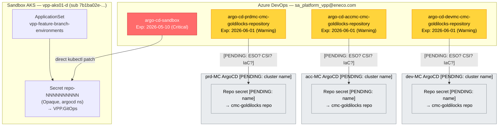
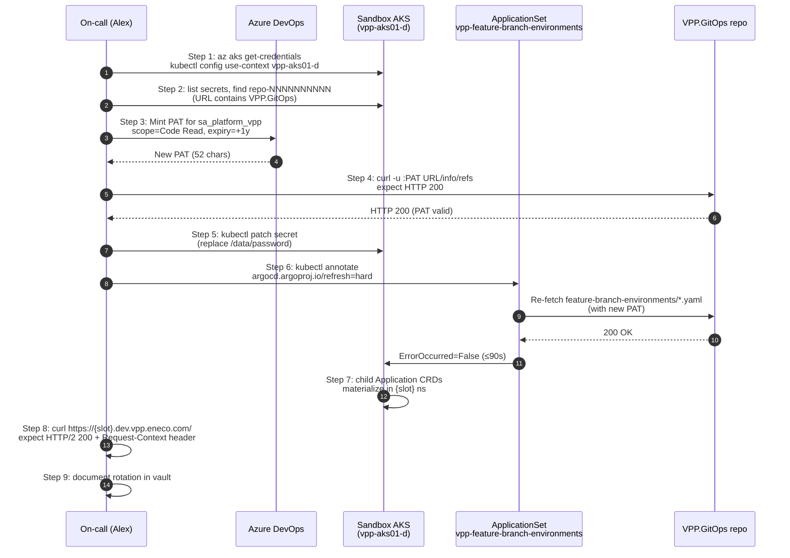
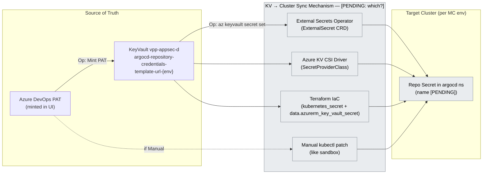
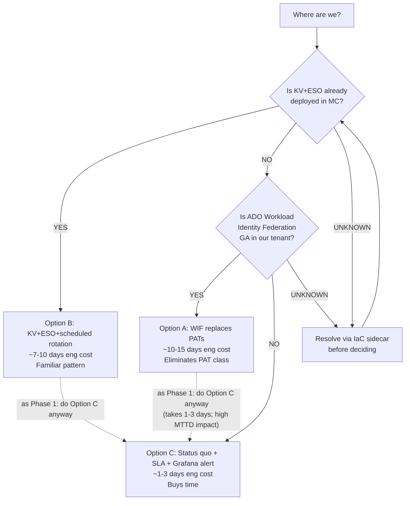

# Visuals draft for `how-to-rotate.md`

## V1 — Mermaid: 4-PAT topology (Section overview)



## V2 — Mermaid: Section A rotation flow (sandbox PAT)



## V3 — Mermaid: Section B propagation candidates (MC PATs)



## V4 — ASCII: Step-by-step decision tree (sandbox)

```
[Start]
   │
   ▼
[CONFIRM PRE-CONDITIONS]
   │  • You have ADO impersonation rights for sa_platform_vpp@eneco.com
   │  • You can kubectl edit secrets in argocd ns of vpp-aks01-d
   │  • The 5 empirical signatures from the pattern doc all match
   │
   ├── NO ────► STOP. Escalate in #myriad-platform.
   │
   ▼ YES
[STEP 1: kubectl context = vpp-aks01-d?]
   ├── NO ────► STOP. Fix context first.
   │
   ▼ YES
[STEP 2: locate repo-NNNNNNNNNN (URL contains VPP.GitOps)]
   ├── 0 matches ────► No legacy repo-* Opaque. Check argocd-cm declarative repos.
   │
   ▼ exactly 1 match
[STEP 3: mint PAT in ADO]
   │  • Name: argo-cd-sandbox-YYYY-MM-DD
   │  • Org:  enecomanagedcloud
   │  • Exp:  +1 year
   │  • Scope: Code Read only
   │  • COPY at mint time
   │
   ▼
[STEP 4: curl test ⇒ HTTP 200?]
   ├── 401/403 ────► PAT invalid or scope wrong. Re-mint. DO NOT proceed.
   │
   ▼ HTTP 200
[STEP 5: kubectl patch secret /data/password ⇒ wc -c shows 52]
   │  (AskUserQuestion BEFORE; defense-in-depth name guard on repo-*)
   │
   ▼
[STEP 6: annotate refresh=hard; watch ErrorOccurred for ≤90s]
   ├── still True after 90s ────► Re-check Step 4. Possibly second secret with stale cred.
   │
   ▼ ErrorOccurred=False with fresh lastTransitionTime
[STEP 7: child Applications materialize in slot ns (≥10 in 2 min)]
   │
   ▼
[STEP 8: curl https://{slot}.dev.vpp.eneco.com/ ⇒ HTTP/2 200 + correlation headers]
   ├── 404/503 ────► Wait 5 min. If still bad, re-check Step 7.
   │
   ▼ healthy
[STEP 9: document rotation in vault incident page]
   │  • Timestamp
   │  • New expiry date
   │  • Anything unexpected during recovery
   │
   ▼
[DONE]
```

## V5 — ASCII: Mental model (the silent-failure chain)

```
   ┌──────────────────────────────────────────────────────────┐
   │ 1. PAT lifetime: 12 months (ADO max). Expiry is silent.  │
   └──────────────────────────────────────────────────────────┘
                              │
                              ▼
   ┌──────────────────────────────────────────────────────────┐
   │ 2. PAT-expiry report posts in #myriad-alerts-devops      │
   │    (alert exists, SLA does not).                         │
   └──────────────────────────────────────────────────────────┘
                              │
                              ▼  if not actioned in time
   ┌──────────────────────────────────────────────────────────┐
   │ 3. ApplicationSet Git generator → ADO 401 every 3 min.   │
   │    Status condition records ErrorOccurred=True.          │
   │    No alert fires (this condition is INFORMATIONAL).     │
   └──────────────────────────────────────────────────────────┘
                              │
                              ▼  developer triggers FBE-create
   ┌──────────────────────────────────────────────────────────┐
   │ 4. Pipeline 2412 succeeds Stages 1-6.                    │
   │    Stage 6 commits to VPP.GitOps cleanly.                │
   │    ArgoCD CAN'T read the commit (auth dead).             │
   │    Stage 7 Pester: namespace=PASS, pods=FAIL, URL=FAIL.  │
   │    Pipeline result: partiallySucceeded.                  │
   │    Slack post: "Infra Tests: 1/4 Success".               │
   └──────────────────────────────────────────────────────────┘
                              │
                              ▼  developer thinks "FBE broken"
   ┌──────────────────────────────────────────────────────────┐
   │ 5. Surface signal points at downstream services.         │
   │    True root cause: ApplicationSet condition (NOT in     │
   │    any first-look runbook). 30-60 min to diagnose        │
   │    without the pattern; 5 min with this doc.             │
   └──────────────────────────────────────────────────────────┘
```

## V6 — Mermaid: Automation proposal options decision tree



## V7 — ASCII: gap-list-to-questions extractor

```
┌───────────────────────────────────────────────────────────┐
│ The PENDING list (extracted from how-to-rotate.md         │
│ Section B + automation proposal):                         │
├───────────────────────────────────────────────────────────┤
│ Group A: MC cluster topology                              │
│   Q1. Cluster names + AKS/OpenShift + RG + subscription   │
│   Q2. ArgoCD namespace per env                            │
│   Q3. Repo Secret naming pattern                          │
├───────────────────────────────────────────────────────────┤
│ Group B: KV → cluster sync                                │
│   Q4. Mechanism (ESO / CSI / IaC / manual)?               │
│   Q5. Sandbox PAT in vpp-appsec-d KV too, or only cluster?│
│   Q6. Per-env KVs for acc/prd, or single dev KV?          │
├───────────────────────────────────────────────────────────┤
│ Group C: Repository identity                              │
│   Q7. What is cmc-goldilocks? URL? Content?               │
│   Q8. Required PAT scopes (only Code Read?)?              │
├───────────────────────────────────────────────────────────┤
│ Group D: Operational policy                               │
│   Q9. Who has authority to mint sa_platform_vpp PATs?     │
│   Q10. Is there a written rotation SLA?                   │
├───────────────────────────────────────────────────────────┤
│ Group E: Automation                                       │
│   Q11. Who/what generates the PAT-expiry report?          │
└───────────────────────────────────────────────────────────┘

Hand to Fabrizio as one focused message in #myriad-platform.
```
