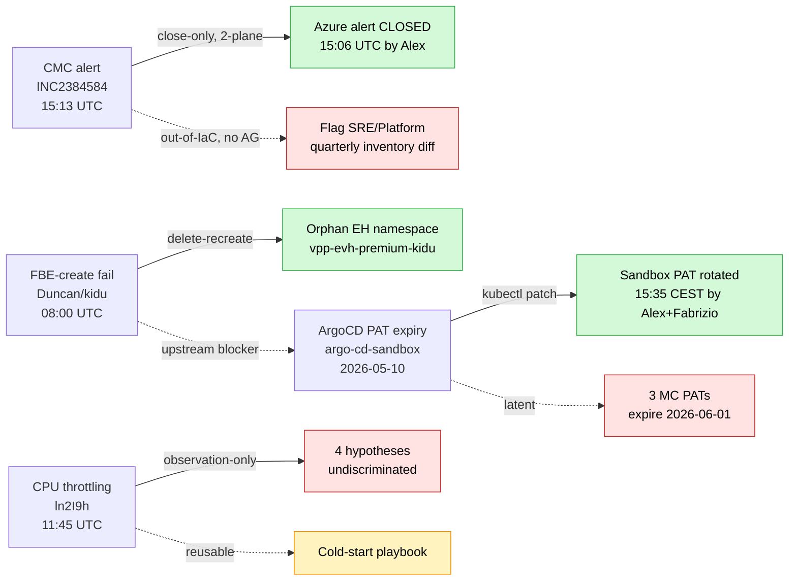

# Spec — Episode Note: 2026-05-11 On-Call Shift (Trade Platform — Quad Incident)

## Target Path

`$SECOND_BRAIN_PATH/llm-wiki/episodes/2026-05-11-oncall-shift-trade-platform-quad-incident.md`

## Frontmatter (apply verbatim)

```yaml
---
description: "Four incidents in one Trade Platform on-call shift (2026-05-11, Alex Torres business hours / Fabrizio Zavalloni off-hours): (1) CMC alert vpp-resource-unhealthy on prd cluster triggered by Microsoft Azure incident 5Z1B-6KG late-ingestion mechanism; (2) FBE-create failure for Duncan/kidu slot — azurerm_eventhub_namespace orphan in Sandbox; (3) Rootly CPU throttling alert on otc-container in opentelemetry-collector pod on dev cluster — observation-only RCA shipped pending 4-hypothesis discrimination; (4) ArgoCD PAT expiry (sandbox PAT expired 2026-05-10) blocked Duncan's FBE silently for 22h and put 3 MC PATs on the latent watchlist (expire 2026-06-01)."
type: episode
domain: work
status: active
source: agent
created: 2026-05-11
last_validated: 2026-05-11
severity: high
confidence: validated
scope: "Eneco VPP on-call (Trade Platform) — 2026-05-11 shift, 09:00–17:00 CEST (business hours) + 17:00–next-day 09:00 CEST (Fabrizio off-hours handoff)"
task_id: 2026-05-11-007
agent: claude-code
tags:
  - eneco
  - vpp
  - trade-platform
  - on-call
  - episode
  - 2026-05-11
  - fbe
  - argocd
  - pat-rotation
  - cmc-alert
  - microsoft-5z1b-6kg
  - cpu-throttling
  - otc-container
  - kidu
  - duncan-teegelaar
  - fabrizio-zavalloni
  - alex-torres
---
```

## Body (apply verbatim)

> **Scope**: One on-call shift (Alex Torres, 2026-05-11 09:00 → 17:00 CEST, business hours), four parallel incidents, four canonical RCA dirs under `log/employer/eneco/02_on_call_shift/2026_05_11_*/`. Off-hours handoff to Fabrizio Zavalloni at 17:00 CEST.

## Quad-Incident Map



## Incident 1 — CMC Alert `vpp-resource-unhealthy` (prd cluster) — false positive

### Trigger
Alexandre Freire Borges flagged ServiceNow `INC2384584` at 15:30 CEST in `#myriad-platform`. The alert (`Microsoft.Insights/scheduledQueryRules/vpp-resource-unhealthy`) fired at `2026-05-11T13:12:43.279Z` for `Eneco MCC – Production – Workload VPP` (subscription `f007df01-9295-491c-b0e9-e3981f2df0b0`).

### Mechanism (root cause, A1)
Microsoft Azure platform incident **`5Z1B-6KG`** — *"Mitigated – Log Analytics and Application Insights intermittent data latency in West Europe"* (customer-impact window `06:40–12:45 UTC`) — caused the `vpp-log-analyt-p` workspace to ingest two earlier same-incident ServiceHealth rows late. By `ingestion_time()` they landed at `13:09:10Z` and `13:09:44Z` (TimeGenerated `12:54:56Z` and `12:55:53Z`, ~14 min latency, exactly Microsoft's warned-of latency). Azure's scheduled-query engine has a built-in late-data-settling period; it evaluated window `12:52:07Z–12:57:07Z` at fire time `13:12:43Z`, saw `metricValue=2.0`, fired.

The rule itself is structurally wrong:
- Created 2024-01-24 by `eelke.hoffman@conclusion.nl` (Conclusion vendor identity)
- KQL: `AzureActivity | where CategoryValue == "ServiceHealth"` — no further filter
- `Count > 1`, sev-0, `autoMitigate=false`, `actions: null` (no Action Group)
- Out-of-IaC (not in any Eneco repo); systemData `createdAt == lastModifiedAt` byte-identical → never re-written via ARM PUT since creation
- ServiceNow received the page via an A3-UNVERIFIED separate path (4 alternatives uneliminated: ITSM connector / Alert Processing Rule / Logic App / native SN Azure plugin)

### Resolution
Two-plane close:
1. Azure alert: `az rest POST .../changestate?newState=Closed` (DONE 15:06 UTC by Alex)
2. ServiceNow ticket: MANUAL close in SN UI (do NOT assume Azure-close propagates — A3 UNVERIFIED path)

Cluster sanity-check via `oc-playbook.md` mandated pre-close (4 probes: non-Running pods / abnormal events / restart in window / Azure-side ResourceHealth). All probes clean → no Eneco workload affected.

### Adversarial review
2 typed subagents: `socrates-contrarian` + `el-demoledor`. Verdicts: PROCEED-WITH-CHANGES. 12 findings BLOCKING/HIGH absorbed in v2.0.

### Cross-links (existing vault)
- [[oncall-rca-must-close-on-every-state-plane]] — today's incident adds Azure+ServiceNow as a sibling instance to the existing Rootly+Azure example
- [[verify-own-prior-claim-via-parallel-adversarial-evaluator]] — adversarial methodology reinforced

### New durable notes spawned (apply alongside this episode)
- [[out-of-iac-alerts-decay-silently-quarterly-inventory-diff]]
- [[automitigate-false-orthogonal-to-severity-needs-manual-close-runbook]]
- [[azure-monitor-late-ingestion-fires-alerts-from-stale-data]]
- [[openshift-sanity-check-rule-out-not-diagnose]] (pattern)
- [[azure-alert-close-two-plane-azure-plus-servicenow]] (pattern)

---

## Incident 2 — FBE-create Failure (Duncan / kidu slot)

### Trigger
Duncan Teegelaar filed General Request in `#myriad-platform` at 09:56 CEST. Build `1638601` failed in ADO project `Myriad - VPP`; retry failed faster (non-transient).

### Mechanism (root cause, A1)
Terraform apply errored: `azurerm_eventhub_namespace "vpp-evh-premium-kidu" already exists in subscription 7b1ba02e-bac6-4c45-83a0-7f0d3104922e but not in state`. The Event Hub Premium namespace existed in Azure (createdAt 2025-06-10, ~11 months stale) but was not tracked by `terraform.kidu` state. Orphan was EMPTY (zero event hubs, consumer groups, auth rules beyond auto-SAS). Three uneliminated provenance paths: (P1) failed destroy with `terraform state rm` workaround, (P2) out-of-band create, (P3) Terraform version drift (1.14.3 create vs 1.13.1 destroy → silent skip). Fix identical regardless.

### Resolution
Delete orphan via `az`, re-run pipeline 2412 from Duncan's branch `feature/fbe-821600-date-selector-flex-reservation-dashboard`. Decision: **delete-recreate over `terraform import`** (3 reasons: orphan empty, 11 months stale would trigger immediate drift, awkward import from ADO pipeline).

### Convergence with Incident 4
Duncan's FBE was actually blocked by TWO problems: (a) the F2 Terraform orphan (this incident, fixable) AND (b) the ArgoCD PAT expiry (Incident 4, blocking ApplicationSet generation for new slots). Both must resolve before Duncan's FBE is functional.

### Cross-links (existing vault)
- [[2026-04-21-stefan-vpp-mfrr-activation-crashloop]] — adjacent FBE episode; this incident adds a NEW failure mode (Terraform state orphan)
- [[eneco-vpp-sandbox-is-aks-not-openshift]] — confirms sandbox is AKS

### New durable notes spawned
- [[fbe-terraform-eventhub-namespace-orphan-on-slot-recycling]] (gotcha)
- [[stale-local-clones-need-git-log-discipline]] (lesson, FBE rca L10)
- [[cross-repo-error-paths-need-topology-before-file-read]] (lesson, FBE rca L10)

---

## Incident 3 — Rootly Alert `ln2I9h` — CPUThrottlingHigh on `otc-container`

### Trigger
Rootly Low-tier page at `2026-05-11T11:45:30Z` (04:45 Pacific): `CPUThrottlingHigh — 49.76% throttling of CPU in namespace eneco-vpp for container otc-container in pod opentelemetry-collector-collector-566b6bd96-2htph`. **Dev cluster** (`eneco-vpp-dev.ceap.nl`). Acknowledged status; routed to escalation policy `1b6ee744-4aca-45ed-9d00-2d1d2b5edbfa` (trade-platform group).

### Mechanism (root cause)
**NOT YET DETERMINED.** RCA shipped as **observation-only** because 4 hypotheses are not yet discriminated:

| Hypothesis | Mechanism | Cheapest probe |
|-----------|-----------|----------------|
| H-A | Undersized CPU limit (regression vs legacy chart) | `oc get OpenTelemetryCollector opentelemetry-collector -o yaml | yq '.spec.resources'` |
| H-B | Memory pressure upstream → GC → CPU bursts → CFS throttle | `container_memory_working_set_bytes` 14d trend |
| H-C | PrometheusRule mis-calibrated for sidecar workload class (cluster-wide) | `sum by (container) ( ALERTS{alertname="CPUThrottlingHigh", alertstate="firing"} )` |
| H-D | Debug exporter `verbosity: detailed` drawing CPU | `yq '{exporters, pipelines}' on the CR` |

Hypothesis dependency: H-A is the SYMPTOM (pressure exceeded limit). H-B / H-D are CANDIDATE UPSTREAM CAUSES. H-C is orthogonal (rule itself, not this pod). **Adjudication heuristic**: run all four probes; if H-D confirms, ship debug fix first (cheapest, most reversible).

### Resolution
Status `acknowledged` only — no fix shipped. The RCA installs the next-shift on-call's mental model and the cold-start command playbook. **Pattern**: observation-only is the correct RCA shape when hypotheses are not yet discriminated; shipping a fix before discrimination ships the wrong fix and masks the real cause.

### Adversarial review
4 separate adversarial reviews captured in `antecedents/` + `auxiliary/` subdirs of the log dir. Includes cross-RCA correlation with prior incident (the `005` referenced).

### Cross-links
- New episode anchor for OpenTelemetry on dev cluster (no prior vault coverage)

### New durable notes spawned
- [[routing-label-is-not-severity-grading]] (lesson — Rootly Low tier ≠ team policy)
- [[causal-arrow-from-snapshot-can-be-falsified-by-timeline]] (lesson)
- [[name-match-is-not-deployment-proof-cluster-api-is-authoritative]] (lesson)
- [[observation-only-rca-when-multiple-hypotheses-undiscriminated]] (lesson)

---

## Incident 4 — ArgoCD PAT Rotation (4 expiring credentials, sandbox CRITICAL)

### Trigger
PAT-expiry monitor (ADO pipeline 2735 `myriad-vpp/devops/azure-pipelines.yml`, posts to `#myriad-alerts-devops` daily ~13:01 CEST) flagged 4 PATs for service account `sa_platform_vpp@eneco.com`:

| PAT name | Expiry | Status | Cluster |
|----------|--------|--------|---------|
| `argo-cd-sandbox` | 2026-05-10 | **Critical (EXPIRED)** | Sandbox AKS `vpp-aks01-d` |
| `argo-cd-devmc-cmc-goldilocks-repository` | 2026-06-01 | Warning | dev-MC OpenShift |
| `argo-cd-accmc-cmc-goldilocks-repository` | 2026-06-01 | Warning | acc-MC OpenShift |
| `argo-cd-prdmc-cmc-goldilocks-repository` | 2026-06-01 | Warning | prd-MC OpenShift |

Surfaced in #team-platform by Fabrizio Zavalloni at 12:32 CEST: *"Has anybody renewed the Pat Token used by the Argocd in Sandbox?"* ~22 hours after auth-break.

### Mechanism (silent failure chain, A1)
1. `argo-cd-sandbox` PAT expired 2026-05-10 (Critical in monitor output)
2. ApplicationSet `vpp-feature-branch-environments` first reported `ApplicationGenerationFromParamsError: authentication required` against `VPP.GitOps` at `2026-05-10T12:40:13Z` (kubectl describe applicationset). It retries every minute thereafter.
3. Existing Application CRDs in etcd PERSISTED (8 slots: afi, ionix, ishtar, jupiter, operations, thor, veku, voltex) → those FBEs survived
4. NEW slot generations FAILED silently (kidu, boltz, enel had no app-of-apps in ArgoCD)
5. Duncan triggered FBE-create at 2026-05-11T08:00Z; pipeline succeeded for Stage 6 commit to `VPP.GitOps`, but ArgoCD couldn't read the new YAML
6. Symptom signature: FBE pipeline `partiallySucceeded` + Slack `1/4 Success` — visible signals do NOT point at credential layer

### Resolution
Sandbox rotated today (Alex + Fabrizio guidance) at 15:35 CEST. ApplicationSet retries → kidu Applications materialize within 3-5 min. 3 MC PATs deferred to 2026-05-12.

### Pattern recurrence (class-level problem)
| When | Surface | Cause |
|------|---------|-------|
| 2024-11-19 (INC-75) | Multi-FBE | AAD SP secret expired |
| 2025-12-29 (F4) | All active FBEs | Same AAD SP again |
| 2026-05-07 (PXQ) | PXQ service | KV client secret expired |
| **2026-05-11 (today)** | Sandbox FBE | ArgoCD PAT expired |
| **2026-06-01 (latent)** | 3 MC clusters | 3 ArgoCD PATs scheduled |

Fabrizio quote (DM 2026-04-10): *"this is a shit job to be done and can cause outages."*

### Comprehensive runbook + proposal authored (Alex)
- `how-to-rotate.md` (1291 lines) — mastery-grade runbook covering 4 PATs across 4 clusters; reader contract = draw architecture from memory, execute Section A without re-reading, reason about anti-patterns, file CMC ticket, defend each verification step
- `proposal-rotation-automation.md` (505 lines) — three options (A: Workload Identity Federation / B: KV + ESO scheduled / C: SLA + Grafana alert + ownership); recommended phasing: C (now-30d unconditionally) → A or B (30-180d based on Fabrizio's gap answers) → extend to F4 / ESP / TF SP / BTM / Snyk classes (180d+)
- `draft-rotation-secrets.md` (307 lines) — evidence ledger with vault/Slack/wiki/IaC citations

### Goldilocks identity (UNVERIFIED — flagged for Fabrizio)
- Roel (#team-platform 2026-03-03): *"I asked him to update a PAT for me in the CMC ArgoCD instance for the Goldilocks application"*
- LIKELY: CCoE managed-cloud policy / version-pinning ArgoCD app. NOT the k8s VPA tool of same name.

### Cross-links (existing vault)
- [[argocd-app-of-apps-product-team-cannot-sync]] — **ORTHOGONAL** (Casbin RBAC denies sync at product-team boundary; today's PAT issue is auth-break to git source). Sibling failure modes; cross-link both.
- [[argocd-helm-oci-plus-appconfig-plus-kv-csi-three-layer-config-stack]] — today's PAT failure is a Layer 1 (deploy-time) failure mode. Cross-link.

### New durable notes spawned
- [[argocd-pat-expiry-silently-fails-applicationset-generation]] (gotcha)
- [[credential-expiry-is-a-class-problem-not-per-incident-firefight]] (lesson)
- [[eneco-credential-expiry-class-incident-history-2024-2026]] (context/repos)

---

## Cross-Incident Meta-Observations (Episode-Level)

### A. Adversarial discipline is operational default
Each incident invoked typed-subagent adversarial review BEFORE shipping the RCA or fix. Pattern: **draft → typed adversarial subagent → mutation log → re-verify**. NOT optional. NOT fork-based (forks inherit executor frame → confirmation bias).

### B. On-call summary cannot be reconstructed from a single intake channel
Today's 4 incidents surfaced in 4 DIFFERENT channels:
1. FBE Duncan → #myriad-platform (public, Slack Lists card)
2. CMC alert → ServiceNow (Alexandre's manual paste, in-channel URL)
3. CPU throttling → Rootly direct (no Slack mention either channel)
4. ArgoCD PAT → #team-platform (private internal)

Reading only #myriad-platform misses 50%+. Reading only Rootly misses 50%+. Future on-call summarizers must sample ALL: Slack public + Slack private + Rootly + ServiceNow + RCA dir.

### C. Credential expiry is the dominant operational pain class
4 of 5 recent recurring incidents (and the next latent on 2026-06-01) = credential expiry. Class-level remediation > per-incident firefighting. Standing directive: when authoring any new credential, declare its rotation owner and verification path in the same PR.

### D. Documentation density day
2026-05-11 produced THREE canonical documentation surfaces simultaneously:
- `how-to-rotate.md` (PAT rotation, Alex)
- `platform-documentation/pullrequest/176492` (alert routing for OpenShift, Roel) + icepanel diagram
- 4 icepanel architecture diagrams pinned to trade-platform domain home page (Roel: OTEL, Gurobi DEV, Gurobi PROD, Gurobi prod AZ-redundancy DRAFT)

The trade-platform domain home page on icepanel is now the canonical entry point for architecture references.

## On-Call Hand-Off (17:00 CEST → Fabrizio)

| Owed action | Plane | Status |
|------------|-------|--------|
| Close ServiceNow CMC ticket INC2384584 | ServiceNow | Manual; Alex owns (in progress) |
| Rotate 3 MC ArgoCD PATs (devmc / accmc / prdmc) | dev/acc/prd MC OpenShift | Deferred to 2026-05-12 (Alex's shift) |
| Re-run pipeline 2412 for Duncan after orphan delete | Sandbox | Duncan-owned action; await user execution |
| Discriminate H-A/B/C/D for CPU throttling alert | DEV cluster | Next on-call OR same-shift if recurs |
| Cluster sanity-check post-CMC-close (oc-playbook.md) | OCP prd | Pending Alex's manual cluster login (post-close gate) |

## Slack-Ready Episode Summary (for posting to #myriad-platform if needed)

> On-call shift 2026-05-11 (09:00–17:00 CEST, Alex Torres) — FOUR concurrent incidents handled. (1) CMC alert `vpp-resource-unhealthy` on prd cluster — false positive caused by Microsoft Azure incident `5Z1B-6KG` (Log Analytics latency West Europe) late-ingestion mechanism; Azure alert CLOSED at 15:06 UTC; ServiceNow ticket close manual (don't assume propagation). (2) FBE-create for Duncan/kidu blocked by `azurerm_eventhub_namespace "vpp-evh-premium-kidu"` orphan (~11 months stale, empty); fix doc authored. (3) Rootly Low-tier CPU throttling page on `otc-container` (DEV cluster) — observation-only RCA shipped (4 hypotheses undiscriminated; no fix recommended yet). (4) ArgoCD `argo-cd-sandbox` PAT expired 2026-05-10, silently broke 3 FBE slots (kidu/boltz/enel) for 22h via ApplicationSet auth-break; sandbox rotated today (Alex+Fabrizio); 3 MC PATs scheduled 2026-06-01. Full RCA + fix + lessons in `log/employer/eneco/02_on_call_shift/2026_05_11_*/`. Mastery-grade PAT rotation runbook + 3-option automation proposal in `2026_05_11_rotating_expired_argocd_secrets/`.
