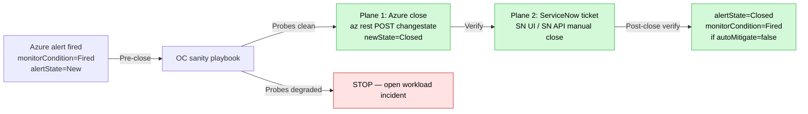

# Spec — Pattern: Close an Azure Alert in Two Planes (Azure + ServiceNow)

## Target Path

`$SECOND_BRAIN_PATH/llm-wiki/patterns/playbooks/azure-alert-close-two-plane-azure-plus-servicenow.md`

## Frontmatter (apply verbatim)

```yaml
---
description: "When an Azure alert has reached ServiceNow as a CMC ticket (or any external incident system), CLOSE BOTH PLANES MANUALLY in order: (1) Azure side via `az rest POST .../changestate?newState=Closed`, (2) ServiceNow side via the SN UI / SN API. NEVER assume Azure-close propagates to ServiceNow-close — the Azure→SN integration path is often A3 UNVERIFIED (4 alternatives: ITSM connector / Alert Processing Rule / Logic App / native SN Azure integration plugin). Pre-close: if the alert names a workload namespace, run the [[openshift-sanity-check-rule-out-not-diagnose]] playbook to rule out cluster impact. Post-close: verify alertState=Closed; expect monitorCondition=Fired to persist if autoMitigate=false."
type: pattern
domain: tech
status: active
source: agent
created: 2026-05-11
last_validated: 2026-05-11
severity: high
confidence: validated
tags: [eneco, vpp, azure-monitor, servicenow, alert-close, two-plane-close, oncall, az-rest, autoMitigate]
---
```

## Pattern



## When to use this pattern

- An Azure Monitor alert fires for an Eneco production subscription
- A ServiceNow CMC ticket exists (Alexandre Freire Borges or similar caller has flagged INC<NNN>)
- You've decided (via [[openshift-sanity-check-rule-out-not-diagnose]] OR equivalent) that this is close-only operational

## Pre-close gate

Run [[openshift-sanity-check-rule-out-not-diagnose]] (or sibling) FIRST. If any probe shows cluster degradation in the alert window, STOP — open a workload incident; do NOT close.

## Plane 1 — Azure alert close (read-then-write)

```bash
# 0. Confirm subscription context (read-only safety check)
az account show --query "{id:id, name:name}" -o tsv
# Expected for VPP prd: f007df01-9295-491c-b0e9-e3981f2df0b0   Eneco MCC - Production - Workload VPP
# If wrong: az account set --subscription <CORRECT_SUB_ID>

# 1. Re-verify the alert is still firing and matches the resource ID under audit (READ)
az rest --method GET \
  --url "https://management.azure.com/subscriptions/<SUB_ID>/providers/Microsoft.AlertsManagement/alerts/<ALERT_UUID>?api-version=2019-05-05-preview" \
  --query "properties.essentials.{state:alertState, condition:monitorCondition, rule:alertRule, fired:startDateTime, severity:severity}" -o json
# Expected: state=New, condition=Fired, rule=<expected-rule-name>
# Decision rule:
#   - state=Closed already → skip step 2
#   - rule != expected → STOP, wrong alert UUID

# 2. Close the Azure alert (WRITE — transitions alertState to Closed)
az rest --method POST \
  --url "https://management.azure.com/subscriptions/<SUB_ID>/providers/Microsoft.AlertsManagement/alerts/<ALERT_UUID>/changestate?api-version=2019-05-05-preview&newState=Closed" \
  --body '{"comment":"Closed via on-call RCA <DATE>. See <RCA_PATH>. Cluster confirmed not impacted via oc-playbook.md. Flagged for SRE/Platform follow-up if rule is structurally noisy."}'

# 3. Verify the state flipped (READ)
az rest --method GET \
  --url "https://management.azure.com/subscriptions/<SUB_ID>/providers/Microsoft.AlertsManagement/alerts/<ALERT_UUID>?api-version=2019-05-05-preview" \
  --query "properties.essentials.{state:alertState, condition:monitorCondition}" -o tsv
# Expected: Closed   Fired   (monitorCondition stays "Fired" because autoMitigate=false — this is expected; alertState is what matters for page lifecycle)
```

## Plane 2 — ServiceNow ticket close (MANUAL)

**Do NOT assume Azure-close propagates.** The Azure→ServiceNow integration path for any given alert is often **A3 UNVERIFIED** at Eneco. Four uneliminated alternatives:

1. Subscription-level Azure→ServiceNow ITSM connector
2. Alert Processing Rule that adds a webhook independent of the rule's `actions`
3. Logic App polling the Alerts Management API
4. Native ServiceNow Azure integration plugin (pull-side, no Azure-side fingerprint)

The `actions: null` observation on a rule only rules out per-rule Action Groups — not the four alternatives above.

**Action**: open the CMC ticket in ServiceNow UI → set Resolved/Closed with comment referencing the RCA. If a CLI/integration that mutates SN is available, use it; otherwise UI is authoritative.

## Post-close verification

Run the Plane 1 step 3 verify again ~5 min later to confirm no re-fire on the next 5-min evaluation cycle (this can happen if the rule's criteria still match — see [[azure-monitor-late-ingestion-fires-alerts-from-stale-data]]).

If the rule fires again, consider tactical disable via `az monitor scheduled-query update --disabled true` (requires Monitoring Contributor; out-of-scope for routine on-call routing).

## Reversibility

| Plane | Action | Reversibility |
|-------|--------|---------------|
| Azure | Close alert | Re-opens on next 5-min eval if criteria match again |
| ServiceNow | Close ticket | Manual reopen via SN UI |
| Optional: rule disable | `--disabled true` | `--disabled false` |

## Authorization

| Plane | Authorization needed |
|-------|---------------------|
| Plane 1 (Azure alert close) | Monitoring Contributor on the resource group |
| Plane 2 (ServiceNow close) | SN ITIL/agent role |
| Optional: rule disable | Monitoring Contributor or higher |

## Cross-Links

- [[2026-05-11-oncall-shift-trade-platform-quad-incident]] — episode of origin (Incident 1, Plane 1 executed by Alex at 15:06 UTC)
- [[openshift-sanity-check-rule-out-not-diagnose]] — mandatory pre-close playbook
- [[automitigate-false-orthogonal-to-severity-needs-manual-close-runbook]] — sibling lesson
- [[out-of-iac-alerts-decay-silently-quarterly-inventory-diff]] — sibling lesson
- [[azure-monitor-late-ingestion-fires-alerts-from-stale-data]] — gotcha (mechanism that fires the kind of alert this pattern closes)
- [[oncall-rca-must-close-on-every-state-plane]] — broader operational discipline
- Source RCA: `log/employer/eneco/02_on_call_shift/2026_05_11_cmc_alert_vpp_cluster_prod/rca.md` "Close commands (az)" section
