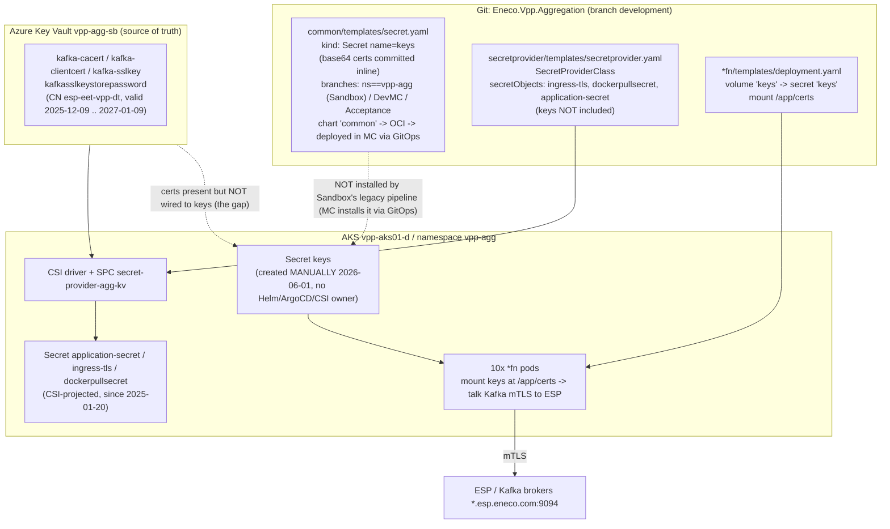

# Context — VPP Aggregation Layer Sandbox `keys` secret incident

## Audience and scope

For an engineer with **zero prior Eneco/VPP context**. After this page you should be able to read the [RCA](./rca.md) and [fix](./fix.md) without looking anything up. Scope = one Sandbox incident: `vpp-agg` pods failing because the Kubernetes Secret named `keys` was absent. Out of scope: the MC dev/acc/prd environments (touched only for comparison) and the sibling "Kafka certs for dev/test" request (cross-referenced, not solved here).

## The one-sentence situation

In Eneco's **Sandbox** Kubernetes cluster, ten aggregation-layer function pods could not start because they mount a Secret called `keys` (which holds the **Kafka mTLS certificates**), and that Secret did not exist in the `vpp-agg` namespace.

## Context Ledger (every term used in the RCA)

| Term | Plain definition | Concrete artifact (this incident) | Why it matters here |
|------|------------------|-----------------------------------|---------------------|
| **VPP** | Virtual Power Plant — Eneco's platform that aggregates batteries/assets to trade on energy-balancing markets. | — | Root business context. |
| **Aggregation Layer (VPPAL / `vpp-agg`)** | The VPP component that ingests telemetry and produces setpoints/market inputs; runs as ~10 .NET "function" services on Kubernetes. | repo `Eneco.Vpp.Aggregation`; namespace `vpp-agg` | The affected system. |
| **Sandbox** | Eneco "Cloud Foundation" dev/test Azure subscription + AKS cluster. Not VNet-integrated (publicly reachable). | sub `7b1ba02e-…`; AKS `vpp-aks01-d` in RG `rg-vpp-app-sb-401` | The environment that broke. |
| **MC (Managed Cloud)** | The "real" Azure environments: dev / acc / prd, VNet-integrated, private endpoints. | repo `…Aggregation.Infrastructure.Mc` | Comparison baseline ("sandbox is different from MC"). |
| **`keys` (the Secret)** | A Kubernetes `Secret` (`type: Opaque`) holding 4 files: `ca-cert.pem`, `client-cert.pem`, `ssl-key.pem`, `ssl-key.pfx`. | mounted at `/app/certs` by every `*fn` pod | Its absence = the incident. |
| **Kafka / ESP** | ESP = Eneco Streaming Platform, a Kafka-based message bus. The aggregation layer talks to it. | brokers `*.esp.eneco.com:9094` | The `keys` certs authenticate to it (mTLS). |
| **mTLS** | Mutual TLS: client proves its identity with a client **certificate + private key**, server is verified with a **CA cert**. | `client-cert.pem`+`ssl-key.pem`/`.pfx` (client) + `ca-cert.pem` (server CA) | Explains *what* the 4 files are. |
| **`eet-vpp` / `eet-vpp-dt`** | The ESP "application" identity the aggregation layer uses (`-dt` = dev-test). | client cert `CN=esp-eet-vpp-dt.streaming.eneco.com` | The identity the certs assert. |
| **Helm** | Kubernetes package manager; renders templated YAML ("charts") into cluster objects. | charts under `azure-pipeline/Helm/` | `keys` is defined in a Helm template. |
| **Helm conditional** | `{{- if … }} … {{- end }}` template logic; if no branch matches and there's no `{{- else }}`, that block renders **empty**. | `common/templates/secret.yaml` | The mechanism that made `keys` empty/absent outside named envs. |
| **ArgoCD** | GitOps tool that continuously reconciles cluster state to match git. | `argocd` ns; `argocd.dev.vpp.eneco.com` | Could self-heal a missing secret — but does NOT manage `keys` here. |
| **Azure Key Vault (KV)** | Azure's managed secret/cert store. | `vpp-agg-sb` (Sandbox KV) | Holds the real Kafka certs; *source of truth*. |
| **CSI Secrets Store / SecretProviderClass (SPC)** | A Kubernetes driver that pulls items from Key Vault and projects them into K8s Secrets. | `SecretProviderClass secret-provider-agg-kv` → KV `vpp-agg-sb` | The provider mechanism — but it does NOT include `keys`. |
| **External Secrets Operator (ESO)** | Alternative provider: an operator that syncs KV → K8s Secret on a poll. | **installed & syncing in Sandbox** (ArgoCD app `external-secrets-operator`); wiki documents it as the intended pattern | Documented ideal AND locally available — but no `ExternalSecret` targets `keys`. |
| **GitOps app-of-apps / OCI** | `Eneco.Vpp.Aggregation.GitOps` (ArgoCD) pulls Helm charts published to an OCI registry. | repo `Eneco.Vpp.Aggregation.GitOps`; `oci://vppacra.azurecr.io/helm-agg` | The MC deploy path that DOES deploy `common` (renders `keys`); Sandbox is not enrolled in it. |
| **`FailedMount`** | kubelet event when a pod cannot attach a volume (here: a Secret volume whose Secret is missing). | `MountVolume.SetUp failed for volume 'keys': secret 'keys' not found` | The reported symptom. |
| **ADO** | Azure DevOps — Eneco's git + CI/CD. | project "Myriad - VPP" | Where the repos + deploy pipelines live. |

## System overview (what is connected to what)

> **Visual job:** show why `keys` exists in MC but not Sandbox — the inline-Helm `common` chart (deployed in MC via GitOps+OCI, NOT by Sandbox's legacy pipeline) vs the available-but-unwired Key Vault → CSI path — and where the pod sits.

The dotted lines are the failure. The inline-Helm `common` chart **is** deployed in MC (the GitOps app-of-apps pulls the OCI-published chart with `container.env=DevMC`/`Acceptance`), so `keys` renders there. But Sandbox is served by the **legacy in-repo ADO Helm pipeline**, which deploys `*fn`+`secretprovider` and **never `common`**, and Sandbox is **not enrolled** in the GitOps app-of-apps — so the `ns==vpp-agg` branch (which targets Sandbox's own namespace) lives in a chart nobody installs in Sandbox. Separately, the Key-Vault→CSI path that *works* for three other secrets never had `keys` added to it. The pod requires `keys`, so it stayed stuck until a human created the Secret by hand.

## Evidence probes run (how we know)

| # | Probe | Surface | Result (summary) | Evidence file |
|---|-------|---------|------------------|---------------|
| 1 | Helm chart fetch + analysis | ADO `Eneco.Vpp.Aggregation` (read-only REST) | `keys` is inline-committed in the `common` chart (branches ns=vpp-agg/DevMC/Acceptance); `common` deployed in MC via GitOps+OCI, NOT by Sandbox's pipeline; SPC excludes `keys`. | `../context/lane-r1-chart.md` |
| 2 | IaC analysis | ADO `…Infrastructure` + `…Infrastructure.Mc` | Pure Terraform; neither defines `keys`/SPC; both grant a CSI identity on KV. | `../context/lane-r2-infra.md` |
| 3 | Docs/ADR | Myriad-VPP wiki + DesignDecisions | Secret/cert architecture undocumented; ESO is the *documented* intent; certs "maintained by tech lead", no auto-rotation. | `../context/lane-d1-docs.md` |
| 4 | Cert-renewal / secret-expiry / ArgoCD-Sandbox how-tos | wiki | Renewal = manual vendor email; expiry pipeline checks KV *cert objects*; CSI in use on Sandbox. | `../context/wiki-followups.txt` |
| 5 | Live Sandbox (read-only) | AKS `vpp-aks01-d` + KV `vpp-agg-sb` | `keys` exists since 2026-06-01 (manual, no owner); 4 keys present; pods Running 19h; certs in KV (CN eet-vpp-dt, valid to 2027). | `../evidence/live-sandbox-probe.md` |

Live Sandbox access used the `eneco-tools-connect-mc-environments` skill (Sandbox path — Azure-CLI identity only, no MC service-principal, no whitelist). All probes were read-only. No secret/private-key values were printed or stored — only names, metadata, and PUBLIC certificate fields (subject/issuer/validity). Cross-referenced with the sibling ticket `2026_06_02_vpp_aggregation_layer_kafka_certs_dev_test_jhonson` (same reporter; same KV; PEM-format gotcha = use `az ... -o tsv`).
