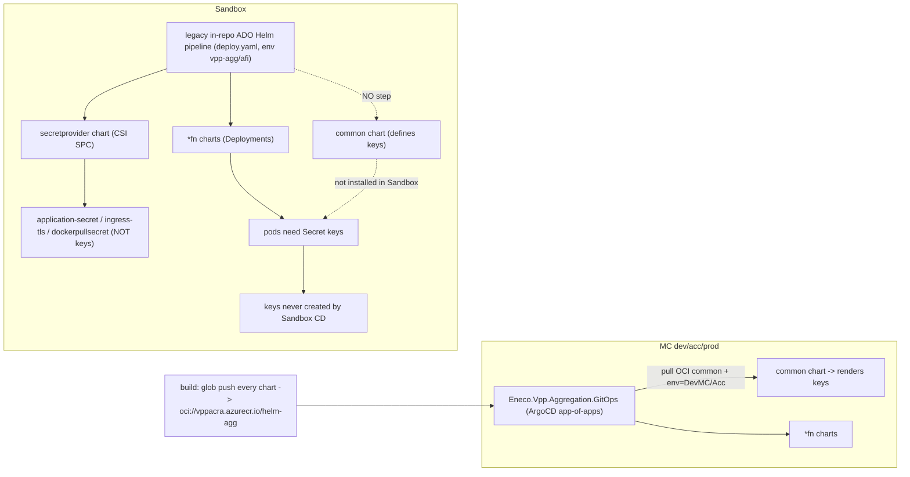

# Holistic RCA — VPP Aggregation Layer Sandbox: the missing `keys` secret

> Incident folder: `2026_06_02_vpp_aggregation_layer_sandbox_broken_jhonson`
> Reporter: Johnson Lobo · Troubleshooter (Slack): Nuno Alves Pereira · On-call: this analysis
> Severity: low (Sandbox dev/test; already mitigated by reporter). Value of this RCA: the *mechanism*, an *MC-safe* fix, and the *class*, not the firefight.
> This document was adversarially reviewed (sherlock / sre-maniac / goal-fidelity); their corrections are folded in (see `../adversarial/00-receipts.md`).

## Knowledge Contract (what you can do after reading)

After reading this RCA you will be able to:

1. **draw** the path a Kafka certificate takes to a pod's `/app/certs`, and the two *different* deploy paths MC and Sandbox use.
2. **explain why** the same Helm chart that supplies `keys` in MC (dev/acc) supplies nothing in Sandbox — without invoking "dead code."
3. **trace** the failure: `pod start → mount volume "keys" → Secret absent → FailedMount → never Ready`.
4. **diagnose** a future "`secret X not found`" in `vpp-agg` in <5 min using the L11/L12 playbooks — including the repo-search false-negative trap.
5. **reject** three plausible-but-wrong explanations (ESO outage, ArgoCD drift in Sandbox, "the chart is dead code").
6. **defend** the root cause against "that's correlation" and name what would change the conclusion (and what already corrected it).

This RCA does **not** make you able to rotate ESP certificates end-to-end (owner-gated, partly undocumented — L10) — it makes you able to *recognise and structurally fix* the provisioning gap **without regressing MC**.

## TL;DR

```text
SYMPTOM : 10 vpp-agg pods FailedMount — secret "keys" not found (Sandbox AKS vpp-aks01-d)
WHAT    : "keys" holds Kafka mTLS certs (ca-cert.pem, client-cert.pem, ssl-key.pem, ssl-key.pfx)
CAUSE   : "keys" is rendered by the inline-Helm `common` chart (certs committed in git),
          whose secret.yaml has 3 env branches and NO else:
            if  .Release.Namespace == "vpp-agg"   -> (Sandbox's namespace)
            elif .Values.container.env == "DevMC"  -> (MC dev)
            elif .Values.container.env == "Acceptance" -> (MC acc)
          In MC, the Eneco.Vpp.Aggregation.GitOps app-of-apps deploys `common`
          (pulled from OCI vppacra.azurecr.io/helm-agg, built by a glob push-loop)
          with container.env=DevMC/Acceptance -> keys renders.
          In SANDBOX, the cluster is served by the LEGACY in-repo ADO Helm pipeline
          (deploys *fn + secretprovider only, gated env vpp-agg/afi; NEVER `common`)
          and is NOT enrolled in the GitOps app-of-apps. So the "vpp-agg" branch -
          which literally targets Sandbox's namespace - lives in a chart nobody
          installs in Sandbox. -> keys absent -> pods FailedMount.
WHY 6mo : certs are static (committed in git); no rotation owner with automation;
          the KV kafka-* items are expires:null and the expiry pipeline (def 2735)
          watches KV *certificate objects*, not these *secrets*. (credential-expiry class, LL-006)
MITIGATED: Johnson created "keys" by hand on 2026-06-01 -> pods Running ~19h.
FIX     : (Sandbox-consistent) enroll Sandbox in the GitOps `common` path MC uses;
          OR (class fix) provider-manage keys via ESO (already installed) or CSI.
          DO NOT delete common/templates/secret.yaml - MC dev/acc render keys from it.
```

## First-principles ladder (the smallest true statements)

```text
Term       : A Kubernetes Secret is a named bag of base64 items in one namespace.
Primitive  : A pod can mount a Secret as a volume. The kubelet MUST find that Secret
             BEFORE the pod starts. No Secret -> volume cannot set up -> pod never runs.
Invariant  : "A volume-mounted Secret must exist when the pod is scheduled." Violate it ->
             FailedMount, indefinitely (it WAITS/retries; it does not crash).
Mechanism  : Helm renders a chart's templates ONLY when that chart is installed in that
             environment. A branch like `if .Release.Namespace == "vpp-agg"` renders only
             if (a) the chart is installed AND (b) the release namespace is vpp-agg.
Consequence: If a chart is installed in MC (via GitOps) but NOT in Sandbox (legacy pipeline),
             then a secret it defines exists in MC and is absent in Sandbox - even though the
             chart literally contains a branch for Sandbox's namespace.
Failure    : Sandbox runs the legacy pipeline that omits `common`; nobody installs the chart
             that holds `keys`; the human-made copy is the only one that ever existed there.
Defense    : Make `keys` exist the same way in every environment - either enroll Sandbox in the
             same deploy path as MC, or materialise it from a provider (KV) independent of which
             pipeline runs. Existence must not depend on which deploy path an env happens to use.
```

## L1 — Business — Why the Aggregation Layer exists

`A1` (wiki) Eneco's **VPP** aggregates distributed energy assets to trade on TenneT balancing markets (FCR/aFRR/mFRR). The **Aggregation Layer** (`vpp-agg`, repo `Eneco.Vpp.Aggregation`) ingests telemetry and produces setpoints, merit-order calculations, strike prices, and delivery reports — ~10 .NET "function" services on Kubernetes. `A2` It talks to the rest of VPP today over **ESP/Kafka** (future target Event Hubs, ADR AL011 — not yet live), so it authenticates to Kafka with mTLS certificates.

**Who was blocked:** developers using the **Sandbox** environment to test the aggregation layer. `A1` Sandbox is the dev/test Azure subscription + AKS cluster, publicly reachable (not VNet-integrated). Not customer-facing, not an MC outage — hence low severity. But the structural cause (an environment served by a different deploy path that omits the secret) is a recurring shape worth the RCA.

## L2 — Repo system

`A1` (eneco-context-repos; ADO project "Myriad - VPP")

| Repo | Role | Key fact for this incident |
|------|------|----------------------------|
| `Eneco.Vpp.Aggregation` | App code + **Helm charts** (`azure-pipeline/Helm/`), branch `development` | Defines `keys` (in `common/`) and the `*fn` deployments that consume it. Its build **publishes every chart to OCI** `vppacra.azurecr.io/helm-agg` via a glob push-loop. |
| `Eneco.Vpp.Aggregation.GitOps` | **ArgoCD app-of-apps** (branch `main`) — the MC deploy path | `Helm/common/{dev,acc,prod}` wrappers pull the OCI `common` chart and set `container.env=DevMC`/`Acceptance` → render `keys` in MC. **Sandbox is not represented here.** |
| `platform-gitops` | ArgoCD projects/destinations | `aggregation-layer` AppProject; destination namespace `eneco-vpp-agg` (MC), sanctions the OCI source. |
| `Eneco.Vpp.Aggregation.Infrastructure` | **Sandbox** Terraform (`env/sb.tfvars`) | Builds KV `vpp-agg-sb`; grants a CSI identity read; does NOT define `keys`. |
| `Eneco.Vpp.Aggregation.Infrastructure.Mc` | **MC** Terraform (3-env, private KV) | Same shape; does NOT define `keys`. |
| `DesignDecisions` | ADRs | No ADR covers the AGG secret/cert architecture (gap). |

The structural fact: **MC and Sandbox use *different deploy paths*.** MC = GitOps app-of-apps + OCI `common` chart (renders `keys`). Sandbox = legacy in-repo ADO Helm pipeline (`*fn`+`secretprovider` only, never `common`). The `keys`-defining chart is deployed by the former, not the latter.

## L3 — Runtime architecture

`A1` (live probe) Sandbox cluster **AKS `vpp-aks01-d`** (RG `rg-vpp-app-sb-401`, K8s 1.31.11), namespace **`vpp-agg`**:

- 10 `*fn` Deployments + `siteregistry` + a `postdeliveryreportjob` CronJob. Every `*fn` pod **mounts the Secret `keys` as a plain secret volume** at `/app/certs`. `A1`
- A **CSI SecretProviderClass** `secret-provider-agg-kv` (→ KV `vpp-agg-sb`) projects **`application-secret`, `ingress-tls`, `dockerpullsecret`** — **not** `keys`. `A1` Those projected secrets are anchored to pods that mount the SPC as a CSI volume (`siteregistry`, the CronJob) — **not** the `*fn` pods (which mount `secret: keys` directly). `A1` (see L8/SRE-F1)
- **ArgoCD runs on this cluster** and manages a real stack — `external-secrets-operator` (ESO), cert-manager, an `aggregation-layer` AppProject, FBE app-of-apps. `A1` (live) But **no ArgoCD Application deploys the `vpp-agg` `*fn` workloads or `keys`** — those come from the **ADO pipeline via Helm** (the `sh.helm.release.v1.*fn.*` secrets prove this). `A2` So ArgoCD is present and active, but the aggregation `*fn` deploy path is the legacy pipeline, not GitOps.
- **ESO is installed and actively syncing** in Sandbox (live `ExternalSecret`s in FBE namespaces, `SecretSynced/True`) — but **no `ExternalSecret` targets `keys`**. `A1`

```mermaid
sequenceDiagram
    participant CD as Sandbox deploy (legacy ADO Helm)
    participant K as kubelet
    participant S as Secret "keys"
    participant P as *fn pod
    participant ESP as ESP/Kafka

    CD->>K: deploy *fn Deployment (mounts plain volume "keys")
    Note over CD: deploys *fn + secretprovider; NEVER `common` (which defines keys)
    K->>S: look up Secret "keys" in vpp-agg
    alt keys exists (MC via GitOps `common`, or hand-made in Sandbox)
        S-->>K: found
        K->>P: mount /app/certs, start container
        P->>ESP: mTLS connect (client-cert + ssl-key, verify ca-cert)
    else keys absent (Sandbox, before fix)
        S-->>K: NOT FOUND
        K-->>P: MountVolume.SetUp failed — pod never Ready (retries forever)
    end
```

> **Visual job:** the failure is at *mount time*, before the app runs — so app logs are empty and Nuno's "nothing is failing in the namespace" is consistent with a hard mount failure.

## L4 — Application code flow

`A1` (chart `*fn/values.yaml`) Each function reads Kafka client config from env vars pointing at files:

```text
KafkaOptions__SslCaLocation          = /app/certs/ca-cert.pem
KafkaOptions__SslCertificateLocation = /app/certs/client-cert.pem
KafkaOptions__SslKeyLocation         = /app/certs/ssl-key.pem
KafkaOptions__SslKeystoreLocation    = /app/certs/ssl-key.pfx
```

`A2` The app expects four files at `/app/certs`, supplied by the `keys` Secret volume, then does mTLS to ESP brokers (`*.esp.eneco.com:9094`). If `keys` is absent the container never starts — the failure is purely at the Kubernetes volume layer, never the app.

## L5 — IaC / state / Azure — the three truths

```text
TRUTH 1 — GIT (what the chart says):
  common/templates/secret.yaml defines Secret "keys" with INLINE base64 certs, branches:
    if ns=="vpp-agg" / elif container.env=="DevMC" / elif =="Acceptance" / {{- end }}  (no else)   [A1]
  `common` is published to OCI vppacra.azurecr.io/helm-agg by a glob push-loop in
  azure-pipeline/pipelines/build/stages/helm-chart-push.yaml.                                        [A1, verified]
  MC: Eneco.Vpp.Aggregation.GitOps Helm/common/dev/{Chart,values}.yaml pulls that OCI chart and sets
  container.env=DevMC -> the DevMC branch renders keys in MC.                                        [A1, verified]
  Sandbox: served by the legacy in-repo ADO pipeline (deploy.yaml gated env vpp-agg/afi) which deploys
  *fn + secretprovider and NEVER `common`; Sandbox not enrolled in the GitOps app-of-apps.            [A1]

TRUTH 2 — AZURE KEY VAULT (vpp-agg-sb):
  kafka-cacert / kafka-clientcert / kafka-sslkey / kafkasslkeystorepassword  (created 2026-05-29; expires:null)
  client cert CN=esp-eet-vpp-dt.streaming.eneco.com, valid 2025-12-09 .. 2027-01-09.
  (Aside: KV certificate object "vpp-eneco-com" EXPIRED 2026-01-20 — a different ingress cert.)       [A1]

TRUTH 3 — RUNTIME (AKS vpp-aks01-d / vpp-agg):
  Secret "keys" exists, created 2026-06-01T08:56:40Z, NO ownerReferences and NO helm.sh/release or
  CSI/Argo labels -> not owned by any controller -> consistent with manual creation (corroborated by
  Johnson's "I added it manually"). [NOTE: managedFields is empty here, but that is NOT a valid
  discriminator - the CSI-projected application-secret also has empty managedFields; ownerReferences
  is the discriminator.] CSI SPC projects 3 OTHER secrets, not keys. Pods Running ~19h.              [A1]
```

The divergence: **the chart that renders `keys` is installed in MC (GitOps) and not in Sandbox (legacy pipeline); the correct certs sit in KV but are wired to no `keys`-producing controller.** That is the defect.

## L6 — The pipeline and how it actually runs

`A1` Two paths, only one of which deploys `common`:



> **Visual job:** prove `common` (hence `keys`) is alive in MC via GitOps+OCI but never installed by the Sandbox pipeline — so the Sandbox pods need a secret their own deploy path never creates. The earlier "`ado-repo-search "Helm/common" = 0 hits`" was a **false negative**: the push-loop iterates `ls azure-pipeline/Helm/` (a glob), so the literal string never appears.

## L7 — Timeline

```mermaid
timeline
    title vpp-agg keys-secret incident evolution
    2023-2025 : `common` chart authored with inline committed certs; MC deploys it via GitOps+OCI; Sandbox never enrolled
    ~late 2025 : (reporter's account) certs expire; Sandbox keys absent; pods cannot mount ("broken >6 months") [INFERRED]
    2025-12-09 : new eet-vpp-dt client cert issued (notBefore)
    2026-05-29 : kafka-cacert/clientcert/sslkey + keystorepassword (re)created in KV vpp-agg-sb
    2026-06-01 08:56 : Johnson creates Secret keys by hand in vpp-agg
    2026-06-01 ~13:48-14:36 : *fn charts redeployed (helm releases v222/v223) -> pods Running
    2026-06-02 : Nuno finds "nothing failing now" (already fixed); this RCA produced
```

`A1` timestamps from KV metadata, the live `keys` `creationTimestamp`, and Helm release secret dates. `A2`/caveat (sherlock S4): **no evidence shows a `keys` secret ever existed in Sandbox before 2026-06-01.** The "~6 months / expired" rests on Johnson's recollection ("most probably more than 6 months") + the new cert's `notBefore`. "Never-created-in-Sandbox" vs "created-by-hand-once-then-lost" **cannot be distinguished** from current evidence (the original events have aged out); the most parsimonious reading is that a human applied `keys` at some past point and it was lost on a namespace/redeploy, and "expired cert" is why fresh material was needed. Either way the structural cause (Sandbox's deploy path never creates `keys`) is unchanged.

## L8 — Fix

Full detail and commands in [`fix.md`](./fix.md). Summary:

### L8.0 — Answering Nuno's question directly

> Nuno/Johnson asked: *"Ideally those secrets needs to be installed via secret provide right? … what is the expectation here … the setup in sandbox is very different from MC envs."*

**Yes — ideally `keys` is installed automatically, not by hand.** Today it is **not** a provider-managed secret in either environment: in MC it is rendered from inline-committed certs by the `common` Helm chart (via GitOps), and in Sandbox it isn't created at all. The platform's **documented** ideal is **External Secrets Operator (ESO)** syncing Azure Key Vault → K8s Secret; ESO **is already installed and syncing in Sandbox** (just not targeting `keys`). The chart also already uses **Azure Key Vault via the CSI driver** for three *other* secrets. So a provider is both the documented intent and locally available. **This answer is scoped to Sandbox**; MC currently uses the inline-Helm path and would need the same migration (Nuno is right that "sandbox is different from MC" — see the MC-safety gate below).

### Fix options
- **Stop-gap (DONE by Johnson, 2026-06-01):** hand-create `keys` with valid certs → pods Running. `A1` Correct as an unblock; it has no owner and will drift. `A2`
- **Route A — Sandbox consistency (fastest):** enroll Sandbox in the same `Eneco.Vpp.Aggregation.GitOps` `common` path MC uses (add a Sandbox values set, namespace `vpp-agg` → the existing `if ns=="vpp-agg"` branch renders). Restores parity with MC. **Limitation:** keeps committed-in-git certs → does **not** fix the rotation/security class.
- **Route B — provider-managed `keys` (class fix, recommended strategically):** materialise `keys` from KV `vpp-agg-sb` via a provider:
  - **ESO `ExternalSecret`** (preferred): ESO is already installed; it maintains the Secret independently of any pod mount, so it avoids the CSI mount-coupling pitfall (below). Map `ca-cert.pem`/`client-cert.pem`/`ssl-key.pem` from the KV `kafka-*` items.
  - **CSI SecretProviderClass**: add the cert objects to `secret-provider-agg-kv`. **But (SRE F1, BLOCKING):** CSI `secretObjects` are only projected while a pod mounts the SPC *as a CSI volume*; the 10 `*fn` pods mount `secret: keys` *directly* (0 mount the SPC) — today the existing CSI secrets survive only because `siteregistry` anchors the SPC. So the `*fn` deployments **must** be switched to mount the SPC CSI volume directly (each consumer its own anchor), or the projection is an accidental side-effect that re-breaks on a `siteregistry` outage.
  - **pfx caveat (SRE F2):** KV holds a PEM key, not the `ssl-key.pfx` the chart expects. Either store/assemble the pfx, or switch the app to a PEM keystore — the latter only after **verifying the pinned Confluent client version supports it** and adding a **runtime mTLS smoke test** (pod-Ready ≠ Kafka-connected).
- **MC-safety gate (sherlock S5 / SRE F4 — REQUIRED):** **do NOT delete `common/templates/secret.yaml`.** MC dev/acc render `keys` from that exact template via GitOps+OCI (verified). Retire it **only after** MC is migrated to the provider too; until then it is live, not dead, code.

## L9 — Verification

**That the stop-gap worked (already true, A1):**

```bash
KUBECONFIG=<sandbox> kubectl -n vpp-agg get secret keys -o json | jq '{created:.metadata.creationTimestamp, keys:(.data|keys)}'  # exists, 4 keys
KUBECONFIG=<sandbox> kubectl -n vpp-agg get pods   # *fn pods 1/1 Running
```

**That a provider-managed fix works — gated sequence (SRE F3; do NOT delete the manual secret first):**

1. Apply the provider (ESO `ExternalSecret` or CSI SPC + `*fn` mounting the SPC volume) and sync.
2. **Pass/fail gate = controller ownership, not pod state:** `kubectl -n vpp-agg get secret keys -o json | jq '{owner:.metadata.ownerReferences, labels:.metadata.labels}'` must show an ESO/CSI owner or `secrets-store.csi.k8s.io/managed=true` label. If absent → projection not materialised → STOP (do not delete the manual secret).
3. Only after step 2 passes: delete the manual `keys`, then `kubectl -n vpp-agg rollout restart deploy` and confirm all `*fn` reach `1/1 Running` consuming the provider-supplied copy. (A Running pod does not re-read a volume Secret without a restart — that is why this step needs the explicit restart.)
4. **Rollback ready:** if step 2 fails, recreate the manual `keys` from KV (fix.md Layer 0).
5. **mTLS smoke test:** confirm a `*fn` actually connects to ESP (logs/health), not just that the pod is Ready.

## L10 — Lessons

1. **"Defined" ≠ "deployed" ≠ "provisioned", and *which deploy path an environment uses* matters.** `keys` is defined once, deployed in MC (GitOps) and not in Sandbox (legacy pipeline). The investigation must ask "what deploys this *in THIS environment*?" — and must **search the GitOps repo**, not just the app/infra repos. The first pass missed `Eneco.Vpp.Aggregation.GitOps` and concluded "dead code"; that was wrong. `A1`
2. **Beware repo-search false negatives.** `ado-repo-search "Helm/common"` returned 0 hits because the publish step iterates a glob (`ls azure-pipeline/Helm/`), never the literal path. A negative existential ("created by NO CD") must be corroborated by checking *consumers* (OCI registry, GitOps), not one string search. `A1`
3. **Use `ownerReferences`, not `managedFields`, to tell controller-made from hand-made secrets.** Empty `managedFields` is not a manual-creation signal here (the CSI secret has it too). `A1`
4. **CSI secretObjects are a mount side-effect, not a standalone object** — a consuming pod must mount the SPC, or the projection is orphaned. ESO does not have this coupling. `A2`
5. **Credential-expiry class ([LL-006]).** Static committed certs + human owner + KV `kafka-*` items `expires:null` + an expiry pipeline (def 2735) that watches KV **certificate objects** not these **secrets** → silent multi-month expiry. Prefer a KV **certificate object** (intrinsic, auto-alarmed expiry) and a named rotation **trigger**. `A1`
6. **Committing certs into git** (the inline `common/templates/secret.yaml`) leaks material into history *and* freezes it. `A1`
7. **Documentation gap:** no ADR/runbook/FAQ for the AGG secret/cert model or a missing `keys`; the AGG DR runbook is a `TODO` stub. `A1`
8. **"Borrowed certs from VPP Core" ≠ what's deployed.** The live `keys` client cert is the AGG's own identity `CN=esp-eet-vpp-dt.streaming.eneco.com`, valid to 2027-01-09 — observably *not* a VPP Core identity. `A1` (Stated as an observation; no inference about intent.)

## L11 — End-to-end command playbook (read-only, reproduce from cold)

```bash
# 0. Connect (interactive MFA refresh). Sandbox = Azure-CLI identity only (no MC SP, no whitelist).
#    Recommended: use the `eneco-tools-connect-mc-environments` skill (Sandbox path / mc-connect-sandbox.sh).
az login --tenant eca36054-49a9-4731-a42f-8400670fc022 --scope "https://management.core.windows.net//.default"
SB=7b1ba02e-bac6-4c45-83a0-7f0d3104922e

# 1. Cluster (do NOT change the global default sub — pass --subscription).
az aks list --subscription "$SB" -o table                       # -> vpp-aks01-d / rg-vpp-app-sb-401

# 2. Isolated kubeconfig (don't clobber other work's ~/.kube/config).
az aks get-credentials --subscription "$SB" -g rg-vpp-app-sb-401 -n vpp-aks01-d --file /tmp/sb.kubeconfig --overwrite-existing
export KUBECONFIG=/tmp/sb.kubeconfig

# 3. Symptom + PROVENANCE (use ownerReferences, not managedFields; metadata only).
kubectl -n vpp-agg get pods
kubectl -n vpp-agg get secret keys -o json | jq '{created:.metadata.creationTimestamp, keys:(.data|keys), owner:.metadata.ownerReferences, labels:.metadata.labels}'
kubectl -n vpp-agg get secretproviderclass -o json | jq '[.items[]|{name:.metadata.name,kv:.spec.parameters.keyvaultName,projects:[.spec.secretObjects[]?.secretName]}]'

# 4. Source of truth (names/dates; PUBLIC cert fields only; -o tsv to keep PEM well-formed).
az keyvault secret list --vault-name vpp-agg-sb --subscription "$SB" -o table | grep -i kafka
az keyvault secret show --vault-name vpp-agg-sb --name kafka-clientcert --subscription "$SB" -o tsv --query value | openssl x509 -noout -subject -issuer -enddate

# 5. WHICH deploy path serves this env? (the anti-false-negative step)
#    - legacy in-repo pipeline:  ado-repo-file Eneco.Vpp.Aggregation azure-pipeline/templates/deploy.yaml --branch development
#    - GitOps consumer (MC):     ado-repo-file Eneco.Vpp.Aggregation.GitOps Helm/common/dev/values.yaml --branch main  (container.env=DevMC)
#    - OCI publish (glob loop):  ado-repo-file Eneco.Vpp.Aggregation azure-pipeline/pipelines/build/stages/helm-chart-push.yaml --branch development
#    - Sandbox NOT in GitOps; no sh.helm.release.v1.common.* in vpp-agg; no eneco-vpp-agg ns on the Sandbox cluster.
```

**Gotcha (sibling ticket):** reading a PEM from Key Vault with `-o json` mangles newlines ("PEM not in good format"); use `-o tsv`. NEVER print `kafka-sslkey`/`ssl-key.pem`/`.pfx` values (private keys).

## L12 — One-page on-call playbook

```text
ALERT: vpp-agg pod(s) Pending/Init — "MountVolume.SetUp failed for volume 'keys': secret 'keys' not found"

30-SECOND TRIAGE
  1. kubectl -n vpp-agg get secret keys            # missing/empty? -> this incident
  2. kubectl -n vpp-agg get pods                    # how many *fn pods stuck

IS IT THIS KNOWN ISSUE?  yes if:
  - Secret "keys" absent (or empty) in vpp-agg
  - no sh.helm.release.v1.common.* secret (Sandbox legacy pipeline never deploys `common`)
  - the SecretProviderClass does NOT list "keys" in secretObjects
  (NOTE: `common` IS deployed in MC via GitOps; this is a SANDBOX deploy-path gap, not dead code.)

IMMEDIATE UNBLOCK (stop-gap; dev/test only):
  - Recreate "keys" from KV vpp-agg-sb certs (kafka-cacert/clientcert/sslkey + assemble pfx); use the AGG's
    OWN identity esp-eet-vpp-dt (valid to 2027-01-09). Do NOT borrow another team's cert. (see fix.md Layer 0)
  - Verify pods 1/1 Running.

DO NOT:
  - delete the keys secret "to test" (pods retry forever, not crash; no provider refills it yet)
  - delete common/templates/secret.yaml (MC dev/acc render keys from it via GitOps -> would regress MC)
  - assume ESO/ArgoCD self-heal keys (ESO is installed but no ExternalSecret targets keys)

DURABLE: PR to enroll Sandbox in the GitOps `common` path (parity) OR provider-manage keys (ESO/CSI). See fix.md.
OWNER: ESP cert ownership = tech lead/lead developer (no automation). Loop them for rotation.
```

## Evidence ledger

| # | Claim | Class | Source |
|---|-------|-------|--------|
| 1 | `keys` is inline base64 in `common/templates/secret.yaml`, branches ns=vpp-agg / DevMC / Acceptance, no else | A1 | `lane-r1-chart.md` (ADO file) |
| 2 | `common` is OCI-published (glob push-loop) and consumed by `Eneco.Vpp.Aggregation.GitOps` (`container.env=DevMC`) → renders `keys` in MC | A1 | first-hand `helm-chart-push.yaml`, GitOps `common/dev/{Chart,values}.yaml` (coordinator-verified) |
| 3 | Sandbox runs the legacy in-repo pipeline (`*fn`+`secretprovider`, env vpp-agg/afi), never `common`; no `eneco-vpp-agg` ns on Sandbox; no `common` Helm release | A1 | `lane-r1-chart.md` deploy.yaml + live (sherlock probe) |
| 4 | CSI SPC projects ingress-tls/dockerpullsecret/application-secret, not `keys`; `*fn` mount `secret:keys` directly (0 mount SPC) | A1 | live `kubectl` (lane-r1 + sre probe) |
| 5 | `keys` created 2026-06-01, **no ownerReferences / no helm/csi labels** → manual (corroborated by reporter). managedFields is NOT the discriminator | A1 | live `kubectl get secret keys -o json` (sherlock correction) |
| 6 | KV `vpp-agg-sb` holds kafka-cacert/clientcert/sslkey (2026-05-29; expires:null); client CN eet-vpp-dt valid to 2027-01-09 | A1 | live `az keyvault` + `openssl x509` |
| 7 | Pods 1/1 Running ~19h (resolved by manual fix) | A1 | live `kubectl get pods` |
| 8 | ESO is installed & syncing in Sandbox; no ExternalSecret targets `keys` | A1 | live `kubectl get externalsecret -A` (sherlock) |
| 9 | No ADR/runbook for AGG secret/cert; certs "maintained by tech lead", no auto-rotation | A1 | `lane-d1-docs.md` |
| 10 | "previous cert expired ~6 months ago" / a pre-existing Sandbox `keys` | A2 | reporter recollection + new cert notBefore; NOT independently witnessed (sherlock S4) |

## Challenge-defense (survive an expert review)

| Challenge | Answer |
|-----------|--------|
| "Is the `keys` secret really created by no CD?" | In **Sandbox**, yes — the legacy pipeline omits `common`, there's no `common` Helm release, and Sandbox isn't in the GitOps app-of-apps (A1). In **MC** it *is* created (GitOps+OCI `common`, A1) — the original "dead code in every env" claim was a false-negative and is corrected. |
| "Maybe it was deleted, not never-created?" | Cannot be distinguished now (events aged out). The conclusion doesn't depend on it: no Sandbox controller produces `keys` (no SPC entry, no ExternalSecret, no `common` install), so the structural gap holds either way (A1). |
| "Couldn't ESO/ArgoCD self-heal it?" | ESO is installed and syncing but **no `ExternalSecret` targets `keys`**; ArgoCD manages no `vpp-agg` `*fn`/`keys` (A1). Neither watches `keys`. |
| "So Sandbox has no secret provider?" | It has both ESO and a CSI SPC — they just don't cover `keys`. The gap is coverage, not absence (A1). |
| "What would change the conclusion?" | A Sandbox deploy step (in any repo) that installs `common` or otherwise creates `keys`. The GitOps repo (the prime suspect) was checked: it targets MC `eneco-vpp-agg`, not Sandbox (A1). |
| "Is the durable fix safe?" | Only with the MC-safety gate: **do not delete the shared `common` template** (MC renders `keys` from it) and, if using CSI, **switch `*fn` to mount the SPC volume** (else orphan projection). Both are in fix.md. |
| "What shortcut looks correct but fails?" | Deleting the manual `keys` "to test the provider" before confirming the projection exists — pods FailedMount again and wait forever. |

## Self-test (answers below)

1. The same Helm chart supplies `keys` in MC but not Sandbox. Why — without saying "dead code"?
2. Why did the first investigation's `ado-repo-search "Helm/common"` return 0 hits, and what's the lesson?
3. You see `keys` with empty `managedFields`. Why is that NOT proof it was hand-made, and what *is* the right check?
4. Why must you NOT delete `common/templates/secret.yaml` as part of the fix?
5. If you wire `keys` into the CSI SPC, what extra change do the `*fn` deployments need, and why? What provider avoids that need?

<details><summary>Answers</summary>

1. The chart is *installed* in MC (via the GitOps app-of-apps pulling the OCI `common` chart with `container.env=DevMC`) but *not* installed in Sandbox (the legacy in-repo pipeline deploys only `*fn`+`secretprovider`, and Sandbox isn't enrolled in GitOps). A template only renders where its chart is deployed.
2. The publish step iterates a glob (`ls azure-pipeline/Helm/`), so the literal string "Helm/common" never appears in code. Lesson: corroborate a negative-existential by checking consumers (OCI registry, GitOps repo), not one string search.
3. The CSI-projected `application-secret` also has empty `managedFields` on this cluster, so emptiness isn't unique to manual creation. The discriminator is `ownerReferences` (controllers set them; `keys` has none) plus the absence of helm/CSI labels — corroborated by the reporter's statement.
4. MC dev/acc render `keys` from that very template via GitOps+OCI; deleting it would remove MC's `keys` source and regress production. Retire it only after MC is migrated to a provider.
5. The `*fn` deployments must mount the SPC as a CSI volume directly (each becomes its own projection anchor); otherwise the projected `keys` lives only while an unrelated SPC-mounting pod (siteregistry) runs. ESO avoids this — it maintains the Secret independently of pod mounts.
</details>

## Durable principles

- **Define ≠ deploy ≠ provision — and deploy is per-environment.** Trace the secret to what creates it *in the failing environment*, including the GitOps repo.
- **A negative existential needs consumer-side corroboration**, not a single string search (glob/false-negative trap).
- **`ownerReferences` is the provenance discriminator**, not `managedFields`.
- **CSI `secretObjects` are a mount side-effect; ESO is mount-independent.** Pick the provider whose failure model you can live with.
- **Never retire a shared artifact while another environment still renders from it.**
- **Every credential needs an owner, a rotation trigger, and an alarm on its real storage form** — or it is a future incident with a known date.
