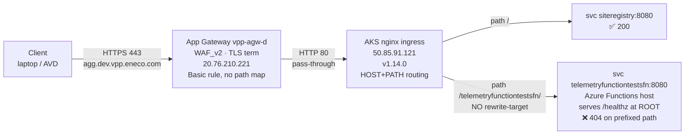

# Network topology — agg.dev.vpp.eneco.com (A1 unless noted)

## Request path (verified live, 2026-06-02)

```text
client (laptop / AVD)
   │  HTTPS 443, SNI agg.dev.vpp.eneco.com
   ▼
DNS agg.dev.vpp.eneco.com → 20.76.210.221
   │
   ▼
Azure Application Gateway  "vpp-agw-d"   (SKU WAF_v2)
   • RG rg-vpp-app-sb-401, sub 7b1ba02e… (VPP Sandbox-hosted dev)
   • public frontend IP "vpp-awg-ip-d" = 20.76.210.221
   • listeners: *.dev.vpp.eneco.com , dev.vpp.eneco.com  (TLS terminates here)
   • routing rules: BASIC (no urlPathMaps) → backend pool "aks"
   │  HTTP 80 → 50.85.91.121   (PASS-THROUGH; no path routing at AppGw)
   ▼
AKS nginx ingress controller LB  (Service type=LoadBalancer "kubernetes")
   • RG mc_rg-vpp-app-sb-401_vpp-aks01-d_westeurope, EXTERNAL-IP 50.85.91.121
   • controller image ingress-nginx v1.14.0
   │  host + PATH routing happens HERE
   ▼
Ingress (namespace vpp-agg, host agg.dev.vpp.eneco.com):
   /                          → svc siteregistry:8080              (catch-all)  ✅ 200
   /telemetryfunctiontestsfn/ → svc telemetryfunctiontestsfn:8080  (NO rewrite) ❌ 404
   /deliveryreportfn/         → svc deliveryreportfn:8080          (NO rewrite) ❌ 404
   │  ClusterIP :8080
   ▼
Pod (Azure Functions host container) — serves /healthz at ROOT (200), 404s prefixed paths
```

## Mermaid



## AVD implications (answers the user's explicit request)

- **The endpoint is PUBLIC.** The App Gateway has a public frontend IP and I reached `agg.dev.vpp.eneco.com`
  from a non-AVD laptop on the open internet (A1). Therefore **no AVD IP whitelist / VNET / Private Endpoint
  change is required** to reach `/healthz` — and adding one would not fix the 404 (the 404 is path-routing, not access).
- The WAF (`WAF_v2`) did not block the request (404, not 403) — WAF is not implicated.
- If you DO want to probe from AVD identically: just `curl -s -o /dev/null -w '%{http_code}' https://agg.dev.vpp.eneco.com/<path>`.
  No host-file or whitelist edit needed for the public name. (A host-file override pointing the name at
  `50.85.91.121` would bypass the App Gateway/WAF and hit nginx directly on :80 — useful only to isolate AppGw,
  which is already proven innocent.)
- Private/VNET path: AVD sits inside the CMC network and can also reach `50.85.91.121`/`20.76.210.221` directly;
  whether internal DNS resolves the name differently was not required to diagnose (public path already reproduces
  the symptom). [A2 — not separately probed; the public path is sufficient and authoritative for this incident.]

## What this rules OUT (so on-call doesn't chase ghosts)

- DNS failure (resolves fine), TLS failure (handshake fine), App Gateway path rule (none — pass-through),
  WAF block (404≠403), Private Endpoint/whitelist (endpoint is public + sibling path works), backend down
  (pod Running, endpoint present, /healthz=200 at root).
