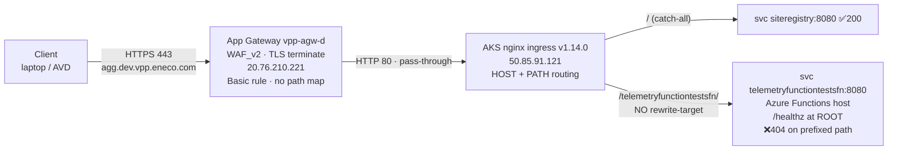

# Context — agg.dev telemetryfunctiontestsfn 404

## Domain Context Ledger

| Term | Meaning | Relevance |
|------|---------|-----------|
| VPP | Virtual Power Plant — Eneco's distributed-energy aggregation platform | parent system |
| Aggregation Layer | VPP subsystem: telemetry ingest, merit order, delivery reports | hosts the function |
| AVD | Azure Virtual Desktop — developers' restricted jump host into CMC/Azure | reporter's vantage point (not the cause) |
| CMC | (Customer) Managed Cloud — Eneco managed Azure landing zone | `agg.dev` lives in the Sandbox sub used as dev |
| `agg.dev.vpp.eneco.com` | public dev aggregation edge | host in the failing URL |
| `agg.dev-mc.vpp.eneco.com` | internal-only (OpenShift/GitOps) aggregation edge | canonical/modern; needs AVD whitelist |
| `telemetryfunctiontestsfn` | QA test-only Azure Function (mock telemetry → Kafka, validate ← CosmosDB) | the function that 404s |
| `siteregistry` | aggregation API used as the "works" example | 200 control (mounted at `/`) |
| nginx ingress | k8s ingress controller doing host+path routing | where the broken routing lives |
| `rewrite-target` | nginx annotation that strips/rewrites the path before the backend | **missing** → root cause |
| AGIC | Azure Application Gateway Ingress Controller (reads `appgw.*` annotations) | chart was written for AGIC, env now runs nginx |
| App Gateway `vpp-agw-d` | Azure App Gateway, WAF_v2, TLS front for `*.dev.vpp.eneco.com` | pass-through; not the cause |

## Verified network topology (live, 2026-06-02)



| Hop | Resource | IP / detail | Evidence |
|-----|----------|-------------|----------|
| DNS | `agg.dev.vpp.eneco.com` | → `20.76.210.221` | `nslookup` (A1) |
| Front | App Gateway `vpp-agw-d` (WAF_v2) | public IP `vpp-awg-ip-d` `20.76.210.221`, listeners `*.dev.vpp.eneco.com`, Basic rules, no urlPathMap, backend pool `aks`→`50.85.91.121` | Azure Resource Graph + `az network application-gateway show` (A1) |
| Ingress | AKS nginx controller | LB `50.85.91.121`, controller `v1.14.0`, ns `ingress-nginx` | `kubectl get svc -n ingress-nginx` (A1) |
| Route | Ingress `telemetryfunctiontestsfn-ingress` (ns `vpp-agg`) | path `/telemetryfunctiontestsfn/`, className `nginx`, no rewrite | `kubectl get ingress` (A1) |
| Backend | svc → pod (Azure Functions host) | ClusterIP `:8080` → `10.0.1.167:8080`, 1/1 Running | `kubectl get svc,pod,endpoints` (A1) |

## AVD probing (answers the explicit request)

**`agg.dev` is public — no whitelist, VNET, or Private Endpoint change is needed to probe it.** I reached it from
a non-AVD laptop on the open internet.

From AVD (or anywhere):

```bash
curl -s -o /dev/null -w '%{http_code}\n' https://agg.dev.vpp.eneco.com/telemetryfunctiontestsfn/healthz  # 404 now
curl -s -o /dev/null -w '%{http_code}\n' https://agg.dev.vpp.eneco.com/api/siteregistry                   # 200
```

If you want to **bypass the App Gateway/WAF** and hit the cluster nginx directly (only to prove the front is
innocent), override the host in your hostfile to the nginx LB and use HTTP:80:

```bash
# /etc/hosts (or AVD hostfile):  50.85.91.121  agg.dev.vpp.eneco.com
curl -s -o /dev/null -w '%{http_code}\n' -H 'Host: agg.dev.vpp.eneco.com' http://50.85.91.121/api/siteregistry  # 200
```

For the **internal** variants (`agg.dev-mc` / `agg.acc`, on `10.7.x`), which is where the *correct* OpenShift Route
lives, you DO need the AVD IP whitelisted — follow the ServiceNow whitelist runbook (Eneco wiki page **44740**).
Per the intake's reminder: **turn whitelisting OFF after you finish** to avoid config drift.

## UAC notes (intake acceptance items)

- **"Ensure the certs are downloaded first":** not applicable to THIS incident. `agg.dev` is a **public HTTPS
  endpoint with no client-certificate requirement** — reproduced from a plain laptop with no certs. The MC
  service-principal + Kafka client-cert flow (cacert/clientcert/sslkey in `vpp-agg-sb`) belongs to the **sibling**
  on-call task `vpp-aggregation-layer-kafka-certs-dev-test`, not to this routing 404. No certs were needed or used.
- **Network discovery:** done — see topology above (App Gateway → AKS nginx → pod), with explicit AVD probe steps.
- **Whitelisting-off reminder:** no whitelist was added (nothing to turn off); the host is public.
- **how-to-feynman teaching doc:** delivered as `feynman-explainer.md` (validated against the `how-to-feynman` standard).

## What the live probes ruled out (so no time is wasted)

DNS failure ✗ · TLS failure ✗ · App Gateway path rule ✗ (none) · WAF block ✗ (404≠403) ·
Private Endpoint/whitelist ✗ (host is public + sibling path 200) · backend down ✗ (pod Running, `/healthz`=200 at root).

## Evidence files

`../context/evidence-ledger.md`, `../context/http-probes.txt`, `../context/http-probes-2.txt`,
`../context/backend-portforward-probes.txt`, `../context/network-topology.md`,
`../context/lane-a-gitops-helm.md`, `../context/lane-b-slack-history.md`, `../context/lane-c-docs-intent.md`.
