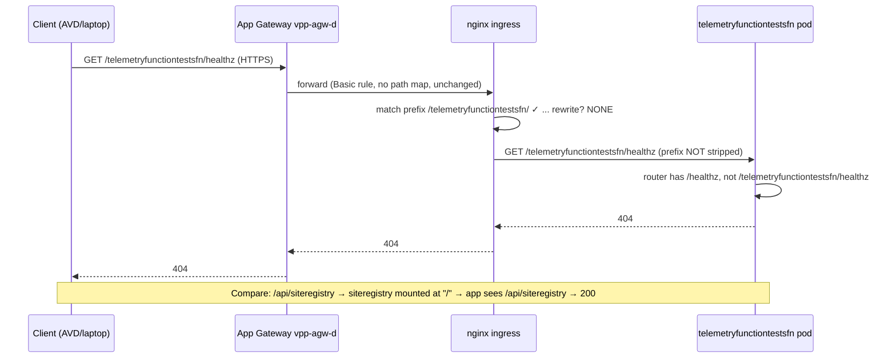

# Feynman Explainer (mastery-grade) — "Why does one URL 404 and its sibling return 200, when both apps are healthy?"

> Goal: by the end you can **diagnose this whole class of bug yourself**, from first principles, and explain it
> to a teammate at a whiteboard. We build up slowly, then collapse it into one mental model.

**Archetype:** RCA-teaching (primary) + engineering-concept (secondary: HTTP path routing through a layered edge).
**Audience:** an on-call/dev engineer with basic HTTP + kubectl literacy and zero prior context on this system.
**Scope:** the `agg.dev` `telemetryfunctiontestsfn` 404; generalises to *any* prefix-mounted service behind nginx.

## Knowledge Contract (observable — what you can DO after reading)

After reading this, you will be able to:

1. **Draw** the request path (App Gateway → AKS nginx → pod) and say which layer emits a given status code.
2. **Explain** *why* a healthy app 404s its own `/healthz` when mounted at a path prefix with no rewrite.
3. **Trace** an example request char-by-char through ingress match → (missing) rewrite → app router.
4. **Diagnose** the bug with ONE command (`port-forward`) and read its two-line output as a verdict.
5. **Reject** the false "it's an AVD/network/whitelist problem" explanation, with the evidence that kills it.
6. **Defend** the claim "the fix yields 200" without deploying it — and state precisely what it does NOT fix.
7. **Adapt** the reasoning to a near-case (a different prefix-mounted service, or a 403 instead of a 404).

**This document does NOT make you able to:** configure nginx-ingress in general, or invoke the test functions
(they are not HTTP-invocable — see §3a). It makes you able to *diagnose this failure class* and *defend the fix*.

---

## 0. The puzzle, stated plainly

Two URLs, same hostname, same cluster, both backends healthy:

```
https://agg.dev.vpp.eneco.com/api/siteregistry            → 200  ✅
https://agg.dev.vpp.eneco.com/telemetryfunctiontestsfn/healthz → 404  ❌
```

The reporter assumed "404 from AVD = network/access problem." That assumption is the trap. Let's earn the real
answer instead of guessing.

---

## 1. First principle: an HTTP status code tells you *which layer* spoke

Every HTTP response is produced by **some specific layer** in the chain. The *kind* of failure narrows down the
layer before you read a single config file:

| What you observe | What it almost always means |
|---|---|
| Connection **timeout** / refused | You never reached a server — network, firewall, NSG, Private Endpoint, wrong IP |
| **403 Forbidden** | You reached a gatekeeper that **rejected** you — WAF, auth, IP allowlist |
| **404 Not Found** (fast, after a clean connect) | You reached a server that **is up and routing**, but there is **no route/handler for that path** |
| **502/503** | You reached a proxy, but the **backend** is missing/unhealthy |
| **200** | A handler matched and answered |

Our failing call returns **404 in ~18 ms after a successful TLS handshake.** So — *before any deep dive* — we can
already say: **the edge is alive and routing; this is a path problem, not a network or access problem.** The
"AVD/whitelist" hypothesis is dead on arrival. (This single reflex saves hours.)

---

## 2. First principle: a URL path is matched **twice** — once at the edge, once in the app

A request's path is read by *two different matchers*:

1. **The ingress/edge matcher** decides *which backend* gets the request (by host + path prefix).
2. **The application router** inside the backend decides *which handler* runs (by the path it receives).

The subtle, crucial part: **the path the app sees may differ from the path the client sent**, because the edge
can *rewrite* it. So there are really two questions:

- (a) Did the edge send the request to the **right backend**? (routing)
- (b) Did the app receive a **path it has a handler for**? (rewriting)

Most "mysterious 404s" are failures of (b): right backend, wrong path.

### 2a. First-principles ladder (climb in order; each rung is the smallest true statement above the last)

| Rung | Statement |
|------|-----------|
| **Term** | "Ingress" = the rule set that maps `host + path` → a backend Service. |
| **Primitive** | A backend only answers paths *it* has handlers for; it never sees the client's URL bar, only the path bytes forwarded to it. |
| **Invariant** | The path the edge forwards must be a path the app can route. Break this and the app 404s — *while perfectly healthy*. |
| **Mechanism** | nginx matches the longest path prefix, then (optionally) **rewrites** the path, then forwards. A prefix mount with **no rewrite** forwards the prefix *intact*. |
| **Consequence** | A service mounted at `/foo/` with no rewrite makes the app receive `/foo/<x>`; if the app only knows `/<x>`, every request 404s. |
| **Failure** | Exactly our case: `/telemetryfunctiontestsfn/healthz` reaches an app that only knows `/healthz`. |
| **Defense** | Strip the prefix at the edge (`rewrite-target`) *or* teach the app a `PathBase`. Prove it by hitting the backend directly (port-forward). |

---

## 3. The request's actual journey (our case, traced)

```
GET https://agg.dev.vpp.eneco.com/telemetryfunctiontestsfn/healthz
   │
   │  [1] DNS → 20.76.210.221
   ▼
Azure Application Gateway "vpp-agw-d"  (WAF, TLS terminates here)
   │  Rule is BASIC: "send everything for *.dev.vpp.eneco.com to the AKS nginx pool."
   │  It does NOT look at the path. It does NOT rewrite. Pass-through.
   ▼
AKS nginx ingress  (50.85.91.121)
   │  Now PATH matching happens. nginx has these rules for host agg.dev.vpp.eneco.com:
   │     "/"                          → siteregistry        (catch-all)
   │     "/telemetryfunctiontestsfn/" → telemetryfunctiontestsfn   ← our path matches THIS
   │  Our path matches the telemetry rule. Routing (a) is CORRECT.
   │  BUT: there is NO rewrite-target on this rule.
   │  So nginx forwards the FULL path, unchanged: "/telemetryfunctiontestsfn/healthz"
   ▼
telemetryfunctiontestsfn pod  (an Azure Functions host)
   │  Its router knows:   "/"  → "up and running" page
   │                      "/healthz" → 200 Healthy
   │                      (no HTTP functions: "/api/*" → 404, "/admin/*" → 401)
   │  It receives:        "/telemetryfunctiontestsfn/healthz"
   │  It has NO handler for that path.
   ▼
404  ← the APP said this, faithfully relayed by nginx
       (proven by the nginx access log: upstream 10.0.1.167:8080 returned 404)
```

The same journey as a sequence (this diagram's job: make the *ordering* — match, then forward-without-rewrite,
then app-404 — impossible to misread):



**The aha:** the request reached the *right* pod. The pod is *healthy*. The pod even *has* a `/healthz` that
returns 200. It 404s only because it was handed a path with an **extra prefix glued on the front** that nobody
removed. nginx was supposed to peel off `/telemetryfunctiontestsfn` before handing the request to the app — and
it wasn't told to.

### 3a. What the reporter is *actually* trying to do (so the fix is the right one)

`telemetryfunctiontestsfn` is a **QA test function** that publishes mock telemetry to Kafka and validates results
in CosmosDB (ADR AL006). It is **timer/Kafka-triggered, not HTTP-invoked** — confirmed directly: at the backend,
`/api/*` → 404 and `/admin/*` → 401, so there are **no HTTP function endpoints to call**. The *only* meaningful
HTTP surface is **`/healthz`** — a liveness/reachability probe. So the reporter hitting `/healthz` is asking
"*is the test-function host up and reachable from AVD?*" — and that is exactly what the fix restores. We are not
"making a URL pretty"; we are restoring the one HTTP signal this host is meant to expose.

---

## 4. Why the sibling works (the control that proves the model)

`siteregistry` is mounted at path **`/`**. There is no prefix to peel. So when you ask for
`/api/siteregistry`, nginx forwards `/api/siteregistry` unchanged, and the siteregistry app *does* have routes
for that. 200.

And the clincher — `deliveryreportfn`, another function mounted at a prefix `/deliveryreportfn/` with **the same
missing rewrite**, **also 404s**. Same disease, same symptom. That is what turns a hunch into a law: *every*
prefix-mounted service here is broken; *only* the one mounted at `/` works. The mount point, not the app, decides.

---

## 5. Proving it without guessing: cut the system in half

When a request crosses N layers and fails, the fastest path to truth is **bisection** — test the backend *alone*,
with the edge removed. `kubectl port-forward` gives you a private wire straight to the pod:

```bash
kubectl -n vpp-agg port-forward svc/telemetryfunctiontestsfn 18080:8080 &
curl -s -o /dev/null -w '%{http_code}\n' http://localhost:18080/healthz                       # 200  ← app is fine
curl -s -o /dev/null -w '%{http_code}\n' http://localhost:18080/telemetryfunctiontestsfn/healthz  # 404  ← prefix is the problem
kill %1
```

Read those two lines like a verdict:
- `/healthz` = 200 → **the app is healthy and the target exists.**
- `/telemetryfunctiontestsfn/healthz` = 404 → **the app has no handler for the prefixed path.**

Therefore the *only* thing standing between the client and a 200 is **the unstripped prefix**. Nothing else.
You have now localized the bug to a single, fixable place — without reading any source code.

---

## 6. Why was the prefix-strip missing? (the history that makes it make sense)

Earlier, this environment used a *different* ingress controller: the **Azure Application Gateway Ingress
Controller (AGIC)**. AGIC strips prefixes with an annotation called
`appgw.ingress.kubernetes.io/backend-path-prefix: /`. The chart had exactly that.

Then the environment **migrated to plain nginx ingress**. Here is the quiet killer: **nginx does not understand
`appgw.*` annotations.** They are not errors — nginx just ignores them, silently. The migration switched the
class to `nginx` and even removed the dead appgw annotation, but **nobody added nginx's own equivalent**
(`nginx.ingress.kubernetes.io/rewrite-target`). The prefix-strip behaviour evaporated in the handover between two
controllers that speak different annotation dialects.

> Mental model: it's like translating a recipe from French to English but leaving out the step that was written
> in French — the dish still "compiles," it just comes out wrong.

---

## 7. The fix, and why it must work

Teach nginx to peel the prefix:

```yaml
path: /telemetryfunctiontestsfn(/|$)(.*)            # capture "everything after the prefix" into $2
annotations:
  nginx.ingress.kubernetes.io/use-regex: "true"
  nginx.ingress.kubernetes.io/rewrite-target: /$2   # forward just "/<that>"
```

Now `/telemetryfunctiontestsfn/healthz` → nginx rewrites to `/healthz` → backend returns 200 (we already proved
the backend returns 200 for `/healthz` in step 5). The fix is correct **by composition**: edge-rewrite ∘
backend-handler = 200. No deployment needed to believe it; the two halves were each measured.

---

## 8. Analogies (pick whichever sticks)

- **Mailroom.** The building (nginx) routes mail to the right office (pod) by the first line of the address
  (`/telemetryfunctiontestsfn/`). But it's supposed to *tear off* that routing slip before dropping the letter on
  the desk. It forgot. The clerk (app) reads "telemetryfunctiontestsfn/healthz", finds no such document, and
  stamps "Return to sender: 404." The clerk is fine; the mailroom skipped a step.
- **Phone extension.** You dial the right department, but the receptionist forwards your *entire* dialed string
  ("dept-telemetry, ext 0") to a phone that only knows "ext 0". It rings nowhere.

---

## 8a. Evidence ledger & challenge-defense (how we know, and how to survive an expert's questions)

| Claim | Status | Evidence / how to promote |
|-------|--------|---------------------------|
| Edge returns 404 for telemetry, 200 for siteregistry | **FACT** | `curl` from laptop (`../context/http-probes.txt`) |
| The routing layer is nginx | **FACT** | bare-prefix 301 body `<center>nginx</center>` |
| The request reaches the telemetry pod, which 404s | **FACT** | nginx access log → upstream `10.0.1.167:8080` = 404 (`../verification/sherlock-receipt.md`) |
| Backend serves `/healthz` at root; prefix 404s | **FACT** | `kubectl port-forward` (`../context/backend-portforward-probes.txt`) |
| Ingress has no `rewrite-target` | **FACT** | `kubectl get ingress` + decoded helm release v215 (chart 0.1.27, `annotations:{}`) |
| Host is non-HTTP-invocable (`/api/*`=404, `/admin/*`=401) | **FACT** | sherlock port-forward |
| Adding the rewrite yields 200 for `/healthz` | **INFER** | composition: rewrite → `/healthz` ∘ backend `/healthz`=200; **not yet executed** (PR not deployed) |
| `agg.dev` is actively maintained (not abandoned) | **FACT/INFER** | live chart 0.1.27 (FACT) + Slack PR 150758 (FACT) → "in use" (INFER) |
| `agg.dev` officially canonical vs `agg.dev-mc` | **UNVERIFIED** | ownership/wiki question; ask Aggregation owners |

| Expert challenge | Defense |
|------------------|---------|
| "How do you know it's not the WAF/App Gateway?" | AppGw rules are Basic, `urlPathMaps:[]`, single pool → nginx; WAF returns **404 not 403**; nginx-direct repro is identical (it's pass-through). |
| "How do you know the 404 is from the app, not nginx's default backend?" | The nginx **access log** shows the request routed to upstream `10.0.1.167:8080` (the pod) which returned 404 — not served by the default backend. |
| "What would falsify your fix?" | If `kubectl port-forward … /healthz` were **not** 200, the rewrite would not yield 200. It is 200. |
| "Where does the fix's claim stop?" | At `/healthz`. It does **not** create function endpoints — there are none over HTTP. |
| "Why not just whitelist the AVD?" | The host is public + a sibling path is 200 + the error is 404 (not timeout/403). Whitelisting changes *access*, not *path routing*. |

## 9. Self-tests (cover the answer; if you can't answer, re-read the linked section)

1. The call returns **404, not a timeout**. What two whole categories of cause does that *immediately* eliminate, and why? (§1)
2. `siteregistry` and `telemetryfunctiontestsfn` are *both* healthy. Why does only one answer at the edge? (§2, §4)
3. You can only run **one** command to localize the bug. Which, and how do you read its output? (§5)
4. Why did the AGIC→nginx migration break this *silently* rather than with an error? (§6)
5. State why the proposed fix is guaranteed to work *without deploying it.* (§7)
6. A teammate says "let's whitelist the AVD IP." Give the one-sentence rebuttal with evidence. (§1, §3 — it's public + 404≠403/timeout)

## 10. Replication recipe (do this yourself, end to end)

```bash
# 1. See the symptom (public; no AVD needed)
curl -s -o /dev/null -w 'telemetry=%{http_code} '  https://agg.dev.vpp.eneco.com/telemetryfunctiontestsfn/healthz
curl -s -o /dev/null -w 'siteregistry=%{http_code}\n' https://agg.dev.vpp.eneco.com/api/siteregistry

# 2. Fingerprint the router (nginx?) — bare prefix → nginx 301 trailing slash
curl -sS -D - -o /dev/null https://agg.dev.vpp.eneco.com/telemetryfunctiontestsfn | grep -iE '^HTTP|server|location'

# 3. Read the ingress rule (is there a rewrite-target?)
kubectl -n vpp-agg get ingress telemetryfunctiontestsfn-ingress -o yaml | grep -A4 -iE 'annotations|path:|rewrite'

# 4. Bisect: prove the backend is healthy and the prefix is the culprit
kubectl -n vpp-agg port-forward svc/telemetryfunctiontestsfn 18080:8080 &
curl -s -o /dev/null -w 'root=%{http_code} prefixed=' http://localhost:18080/healthz
curl -s -o /dev/null -w '%{http_code}\n' http://localhost:18080/telemetryfunctiontestsfn/healthz
kill %1

# 5. Confirm what's actually deployed (no helm CLI needed)
SEC=$(kubectl -n vpp-agg get secret -l owner=helm,name=telemetryfunctiontestsfn --sort-by=.metadata.name -o name | tail -1)
kubectl -n vpp-agg get "$SEC" -o jsonpath='{.data.release}' | base64 -d | base64 -d | gunzip \
  | jq '{chart:.chart.metadata.version, ingress:.chart.values.ingress, overrides:.config}'
```

If step 4 prints `root=200 prefixed=404`, you have independently reproduced the entire diagnosis. You now own this
bug class: *prefix-mounted service + no rewrite-target = 404, fixable at the ingress, provable by port-forward.*

---

## 11. The one model to remember

> **A 404 after a clean connect is a *path* problem. At an ingress, a path-prefix mount needs a rewrite to strip
> the prefix; without it, a healthy app 404s its own routes. Bisect with port-forward to localize; fix at the
> ingress; the service mounted at `/` is the control that proves it.**
