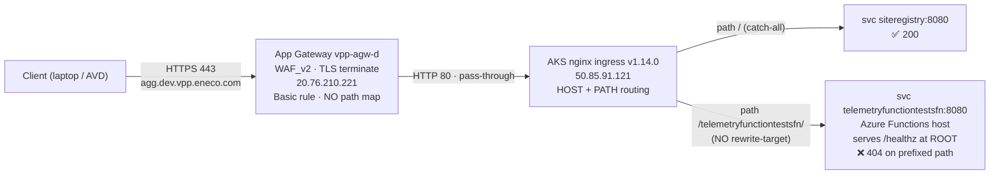

# RCA — `telemetryfunctiontestsfn/healthz` 404 on `agg.dev.vpp.eneco.com`

> Incident class: developer-tooling / aggregation test-function not reachable from AVD.
> Severity: LOW (dev-only QA test function; no production or trade impact). Recurring class: MEDIUM.
> Diagnosis status: **Verified Root Cause** (depth 3), confirmed four independent ways.

---

## Knowledge Contract (read this first — what you will be able to do after reading)

After this RCA you will be able to:

1. Explain, from first principles, **why one URL on a host returns 200 and a sibling URL on the same host returns 404**, when *both* backends are healthy.
2. Reason about **HTTP path routing through a 3-layer edge** (Azure Application Gateway → AKS nginx ingress → pod) and say *which layer* produced any given status code.
3. Reproduce the symptom and the proof yourself with `curl` and `kubectl port-forward`.
4. Choose the correct fix (ingress rewrite vs app PathBase vs environment consolidation) and know *which file* to change.
5. Recognise this failure mode in 60 seconds next time it is reported.

**Falsifiable claim of this RCA:** if you add an nginx `rewrite-target` that strips the
`/telemetryfunctiontestsfn` prefix, `https://agg.dev.vpp.eneco.com/telemetryfunctiontestsfn/healthz`
returns **200 `Healthy`**. This is proven *by composition* below (the backend already returns 200 for `/healthz`).

---

## Context Ledger (zero-context reader: read this table first)

| Term | What it is | Code/resource artifact | Relevance to THIS incident |
|------|-----------|------------------------|----------------------------|
| **VPP** | Virtual Power Plant — Eneco's platform aggregating distributed energy assets | repos under `enecomanagedcloud/Myriad - VPP` | The aggregation layer is part of VPP |
| **Aggregation Layer** | VPP subsystem that ingests telemetry, computes merit order, produces delivery reports | repo `Eneco.Vpp.Aggregation` | Hosts the function that 404s |
| **AVD** | Azure Virtual Desktop — developers' restricted jump host into the CMC/Azure network | — | The vantage point the reporter used; **not** the cause |
| **CMC** | (Customer) Managed Cloud — Eneco's managed Azure landing zone | subscriptions `*-sb/-acc/-prd` | `agg.dev` lives in the Sandbox (`sb`) subscription used as dev |
| **`agg.dev.vpp.eneco.com`** | Public hostname for the dev aggregation edge | DNS A → `20.76.210.221` | The host in the failing URL |
| **`telemetryfunctiontestsfn`** | A **QA test-only** Azure Function (publishes mock telemetry → Kafka, validates ← CosmosDB) | k8s svc/deploy `telemetryfunctiontestsfn` in ns `vpp-agg`; ADR `AL006` | The function the reporter cannot reach |
| **`siteregistry`** | Aggregation API the reporter used as a "this works" example | k8s svc/deploy `siteregistry` in ns `vpp-agg` | The 200 control; works because mounted at `/` |
| **`*fn` family** | Test/utility Azure Functions: `deliveryreportfn`, `telemetryaggregationfn`, `telemetryingestionfn`, `dataingestionfn`, etc. | deployments in ns `vpp-agg` | All mounted under a path prefix → all share the bug |
| **App Gateway (`vpp-agw-d`)** | Azure Application Gateway, WAF_v2, terminates TLS for `*.dev.vpp.eneco.com` | RG `rg-vpp-app-sb-401`, IP `20.76.210.221` | The public front; pass-through, **not** the cause |
| **nginx ingress** | Kubernetes ingress controller doing host+path routing in the AKS cluster | ns `ingress-nginx`, controller `v1.14.0`, LB IP `50.85.91.121` | Where the broken path routing lives |
| **rewrite-target** | nginx-ingress annotation that rewrites the path before forwarding to the backend | `nginx.ingress.kubernetes.io/rewrite-target` | **Missing** here → root cause |
| **AGIC** | Azure Application Gateway Ingress Controller — a *different* ingress controller that reads `appgw.*` annotations | annotation `appgw.ingress.kubernetes.io/backend-path-prefix` | The chart was written for AGIC; the env now runs nginx |
| **PathBase** | ASP.NET Core / Azure Functions host setting that makes an app serve under a URL prefix | (app config) | Not set → app serves at root, so the prefix must be stripped at the ingress |
| **GitOps / ArgoCD** | Declarative deploy: desired state in git, ArgoCD syncs it to the cluster | repo `Eneco.Vpp.Aggregation.GitOps`, ns `eneco-vpp-agg` (OpenShift) | The *canonical/modern* path (on `agg.dev-mc`), where rewrite is already correct |

**Zero-context reader test:** a new engineer who reads only this table should understand every term used below.

---

## Evidence labels

- **A1 FACT** — externally witnessed (file:line, command + captured output, or URL).
- **A2 INFER** — derived from A1s via named reasoning.
- **A3 UNVERIFIED[blocked: reason]** — not probed; blocking reason named.

All A1 cluster/HTTP facts captured 2026-06-02 from Mr. Alex's laptop + a read-only `kubectl` session
(`Alex.Torres@eneco.com`) against AKS `vpp-aks01-d`. Raw probe captures:
`../context/http-probes.txt`, `../context/http-probes-2.txt`, `../context/backend-portforward-probes.txt`,
`../context/evidence-ledger.md`, `../context/network-topology.md`, `../context/lane-a-gitops-helm.md`,
`../context/lane-b-slack-history.md`, `../context/lane-c-docs-intent.md`.

---

## The one-sentence root cause

The `telemetryfunctiontestsfn` Azure-Functions container serves `/healthz` at its **root**, but its
**nginx ingress mounts it under the path prefix `/telemetryfunctiontestsfn/` with no `rewrite-target`**, so
nginx forwards the *unstripped* path `/telemetryfunctiontestsfn/healthz` to an app that only knows `/healthz`
→ **404**. `siteregistry` works only because it is mounted at `/` (no prefix to strip).

---

## L1 — Business — Why the aggregation layer exists

The VPP Aggregation Layer turns thousands of distributed energy assets into market-actionable aggregates:
it ingests telemetry, computes merit order, prepares market input, and produces delivery reports. Developers
and QA validate this pipeline in **dev** before acceptance/production. The `*fn` **test functions**
(`telemetryfunctiontestsfn` et al.) exist purely to **drive and validate that pipeline in non-prod** — they
publish mock telemetry to Kafka and assert results in CosmosDB (A1 — ADR `AL006`, via `../context/lane-c-docs-intent.md`;
AL006 states these are *"never going to be deployed to PROD"*).

**Who was blocked:** Johnson Lobo (Slack handle `U045CMAR078`; the intake's "jhonson lobos" is a misspelling —
A1, `../context/lane-b-slack-history.md`), doing E2E/QA work from AVD, could not reach the test function's health
endpoint. **Impact: developer productivity only.** No trade, market, or customer impact (dev-only test function).

---

## L2 — Repo system

| Repo | Role in this incident |
|------|-----------------------|
| `Eneco.Vpp.Aggregation` | App code **and** the legacy Helm charts (`azure-pipeline/Helm/<svc>/`) that render the live nginx ingress (A1, lane-a §1) |
| `Eneco.Vpp.Aggregation.GitOps` | Canonical GitOps values for the **OpenShift** deployment (`agg.dev-mc`), where the Route rewrite is correct (A1, lane-a §3) |
| `Eneco.Vpp.Aggregation.Infrastructure[.Mc]` | Terraform for the aggregation infra (cluster/DNS/AppGw) — not the cause |
| OCI chart `oci://vppacra.azurecr.io/helm-agg` | The shared chart the GitOps wrapper depends on (A3 [blocked: registry not pulled]) |

Local clones: `/Users/alextorresruiz/Dropbox/@AZUREDEVOPS/eneco-src/enecomanagedcloud/myriad-vpp/`.
**Caveat (A1):** clones are ~6.5 months stale and `git pull` over SSH is **broken** (the configured SSH key
`~/.ssh/work/warnermedia/...` no longer exists → `Permission denied (publickey)`). All *current-state* claims
below come from **live cluster** probes, not the stale clones.

---

## L3 — Runtime architecture (the request's journey)



A1 facts behind the diagram:

- DNS `agg.dev.vpp.eneco.com` → `20.76.210.221` = public frontend of App Gateway **`vpp-agw-d`** (Resource Graph;
  RG `rg-vpp-app-sb-401`, Sandbox sub `7b1ba02e-…`). Listeners: `*.dev.vpp.eneco.com`, `dev.vpp.eneco.com`.
  Routing rules **Basic**, `urlPathMaps: []`, single backend pool `aks` → `50.85.91.121`. SKU `WAF_v2`.
- `50.85.91.121` = AKS nginx ingress controller LoadBalancer (`ingress-nginx`, controller image `v1.14.0`).
- Hitting the public host (443) and hitting nginx directly with `Host: agg.dev.vpp.eneco.com` (80) give
  **identical** results (siteregistry 200 / telemetry 404) → **the App Gateway + WAF are pass-through and innocent**
  (A2; the 404 originates at nginx→backend).

**This rules out, with evidence:** DNS failure, TLS failure, App Gateway path filtering (none), WAF block
(404 ≠ 403), Private Endpoint/whitelist (the host is public — I reached it from a non-AVD laptop), and
backend-down (pod Running, endpoint present, `/healthz`=200 at root).

---

## L4 — Application code flow (why the backend itself 404s the prefix)

The backend is a **stock Azure Functions host** running in a container. Proven by port-forwarding straight to
the pod (bypassing nginx entirely) — `../context/backend-portforward-probes.txt`:

| Request to backend (port-forward `svc:8080`) | Result |
|---|---|
| `GET /` | **200** — *"Your Azure Function App is up and running."* (the Functions default page) |
| `GET /healthz` | **200** — `Healthy` |
| `GET /telemetryfunctiontestsfn/healthz` | **404** |
| `GET /api/telemetry`, `/swagger`, `/api/healthz` | 404 |

**A2 reasoning:** the app serves health at **`/healthz`** (root) and has **no `PathBase`** for the
`/telemetryfunctiontestsfn` prefix (it 404s the prefixed path even when reached directly). There is no app-side
awareness of the `/telemetryfunctiontestsfn` mount. Therefore, for any edge request under
`/telemetryfunctiontestsfn/...` to succeed, **something must strip the prefix before the app sees it.** Nothing does.

Contrast `siteregistry` (same probe): `/` → 200 banner, `/healthz` → 200 JSON, `/api/siteregistry` → 200. It is
mounted at `/`, so its root routes are directly reachable from the edge.

> **Scope of what `/healthz` proves (A1, adversarial review — `../verification/sherlock-receipt.md`).** Probed
> directly at the backend, the Functions host serves **only `/healthz` (200)**; **`/api/*` → 404** and
> **`/admin/*` → 401** (master-key). So this host exposes **no HTTP-invocable functions** — consistent with ADR
> AL006: the `*fn` family are **timer/Kafka-triggered QA test functions** (publish mock data → Kafka, validate ←
> CosmosDB), not HTTP endpoints. **Implication:** `/healthz` is the *only* meaningful HTTP surface, so the
> reporter's `/healthz` request is precisely a **host-reachability/liveness check** — and that is the achievable,
> intended goal. The fix below restores `/healthz`; it does **not** (and need not) "enable function invocation,"
> because invocation does not happen over HTTP here.

> **How we know the 404 came from the backend, not nginx (A1, corrected).** The empty-body/absent-`Server`-header
> 404 is *not* a reliable discriminator (the `Server` header is absent even on the 200s). Origin is proven two
> ways instead: (1) the **nginx access log** shows the failing request routed to upstream **`10.0.1.167:8080`**
> (the telemetry pod) returning 404 (sherlock); (2) the **port-forward** reproduces the 404 at the pod itself.

---

## L5 — IaC / state / Azure — the three truths

**Truth 1 — what the live Ingress objects say** (A1, `kubectl get ingress -n vpp-agg`):

| Ingress | path | pathType | className | annotations | backend |
|---------|------|----------|-----------|-------------|---------|
| `siteregistry-ingress` | `/` | Prefix | nginx | only `meta.helm.sh/*` | `siteregistry:8080` |
| `telemetryfunctiontestsfn-ingress` | `/telemetryfunctiontestsfn/` | Prefix | nginx | only `meta.helm.sh/*` (**no rewrite-target**) | `telemetryfunctiontestsfn:8080` |
| `deliveryreportfn-ingress` | `/deliveryreportfn/` | Prefix | nginx | only `meta.helm.sh/*` | `deliveryreportfn:8080` |

**Truth 2 — what the deployed Helm release says** (A1 — decoded live release secret
`sh.helm.release.v1.telemetryfunctiontestsfn.v215`, chart **`0.1.27`**):

```yaml
# chart default ingress (chart 0.1.27, as deployed):
ingress:
  className: nginx
  annotations: {}                 # <-- EMPTY. no appgw annotation, no rewrite-target
  path: /telemetryfunctiontestsfn/
  hostname: agg.dev.vpp.eneco.com
# deployed overrides: only image.tag=adhoc-0.0.1.1457 and ingress.hostname
```

**Truth 3 — what the workloads are doing** (A1): svc/deploy/pod/endpoints for `telemetryfunctiontestsfn` are
all **healthy** — deploy 1/1, pod Running 18h, endpoint `10.0.1.167:8080` present, image
`vppacra.azurecr.io/eneco-vpp-agg/telemetryfunctiontestsfn:adhoc-0.0.1.1457`.

**The three truths agree:** the ingress mounts a prefix; nothing strips it; the app serves at root; the app is
healthy. → A clean **404 by path mismatch**, not an outage.

---

## L6 — The pipeline and how it actually runs (how this got mis-wired)

There are **two parallel deployment eras** for these workloads (A1, lane-a §3):

| | **LIVE & broken** (what the reporter hits) | **Canonical/modern** |
|---|---|---|
| Host | `agg.dev.vpp.eneco.com` (**public**) | `agg.dev-mc.vpp.eneco.com` (**internal-only**) |
| Cluster | AKS `vpp-aks01-d`, ns `vpp-agg` | OpenShift, ns `eneco-vpp-agg` |
| Routing | nginx `Ingress`, prefix, **no rewrite** | OpenShift `Route` with `haproxy.router.openshift.io/rewrite-target: /` (**correct**) |
| Deploy | ADO `HelmDeploy@0 upgrade` direct to AKS (`deploy.yaml:30-50`) | CD git-pushes image tag → GitOps repo → ArgoCD sync |
| Source | `Eneco.Vpp.Aggregation/azure-pipeline/Helm/<svc>/` | `Eneco.Vpp.Aggregation.GitOps/Helm/<svc>/dev/values.yaml` |

**How the bug was born (A2 from A1 git + live evidence):** the legacy chart was originally authored for the
**Azure Application Gateway Ingress Controller (AGIC)** — its only prefix-strip mechanism was
`appgw.ingress.kubernetes.io/backend-path-prefix: /` with class `azure/application-gateway`
(A1 — introduced PR 66664, 2023-12-13; trailing slash added PR 87440, 2024-07-10; lane-a §2). When the dev
environment was **migrated to a standalone nginx ingress** (PR 150758, Nov 2025 — A1 lane-b), the chart was
updated to `className: nginx` and the appgw annotation was dropped (live chart 0.1.27 has `annotations: {}`),
**but the nginx equivalent `rewrite-target` was never added** (`git log -S "nginx.ingress.kubernetes.io/rewrite-target"`
= 0 commits, A1 lane-a §2). AGIC stripped the prefix; nginx does not. The prefix-strip silently fell on the
floor during the migration. This is a **migration gap**, not a code regression in the function.

`agg.dev-mc` (OpenShift/GitOps) was built correctly with a Route rewrite — but it resolves **NXDOMAIN on public
DNS** (A1) i.e. it is internal-only and needs an AVD whitelist, which is why developers keep using the public
`agg.dev` that has the bug.

> **Reconciliation of conflicting "canonical" signals (sharpened after adversarial review).** A source-only
> inference labelled `agg.dev`/AKS *"abandoned"* (from stale clones: ad-hoc image tags, not-in-ArgoCD). **That is
> refuted, not merely reconciled**, by stronger evidence: (a) the **live deployed chart is `0.1.27`** (current,
> actively deployed — A1 decoded release v215); (b) Slack A1 (`../context/lane-b-slack-history.md`) shows the
> telemetry ingress actively managed (PR 150758, Nov-2025) and `agg.dev` treated as the live dev endpoint
> consumers use. **Conclusion: `agg.dev` is actively maintained and in use** — the architectural *target* is the
> OpenShift/GitOps stack on `agg.dev-mc`, but `agg.dev-mc` resolves **NXDOMAIN publicly** (internal-only) so it is
> not a drop-in replacement for AVD users today. Therefore **Option A (fix `agg.dev`) is the primary, correct
> action**; Option B (consolidate onto `agg.dev-mc`) is a *strategic* follow-up, not a co-equal fix, and only after
> AVD whitelisting is in place.

---

## L7 — Timeline

| When | Event | Evidence |
|------|-------|----------|
| 2023-12-13 | Chart gains AGIC prefix-strip (`appgw…/backend-path-prefix: /`) | A1 git PR 66664 (lane-a) |
| 2024-07-10 | Path changed to trailing-slash `/telemetryfunctiontestsfn/`, svc → ClusterIP; appgw annotation kept | A1 git PR 87440 (lane-a) |
| 2026-04-13 | Johnson Lobo reports an AVD reachability issue; Alex advises using `…/api/siteregistry`; ticket closed | A1 Slack (lane-b) |
| ~2025-11 | Aggregation dev migrated to nginx ingress (PR 150758); class→nginx, appgw annotation dropped, **rewrite-target not added** | A1 Slack + A2 from chart 0.1.27 state |
| 2026-06-02 | Johnson Lobo reports `…/telemetryfunctiontestsfn/healthz` 404 from AVD (this incident) | A1 intake `slack-intake.md` |
| 2026-06-02 | RCA: reproduced from public internet + cluster; root cause proven 4 ways | A1 this RCA |

---

## L8 — Fix

The function is healthy; only the **edge path routing** is wrong.

### Immediate unblock for the reporter (works TODAY, no PR, no infra change)

Right now there is **no working edge path** to the telemetry host (`/telemetryfunctiontestsfn/healthz` and the
documented bare prefix both 404). Until the ingress PR lands, reach the host directly with a port-forward
(requires `kubectl` access to AKS `vpp-aks01-d`, which AVD dev users have):

```bash
kubectl -n vpp-agg port-forward svc/telemetryfunctiontestsfn 8080:8080
# then in another shell / browser:
curl http://localhost:8080/healthz        # -> 200  Healthy
```

This confirms the test-function host is alive — which is exactly what `/healthz` is for. (Triggering the test
functions themselves is **not** an HTTP action here — see L4 scope note — so there is no `/api/<fn>` to call.)

Then choose the permanent fix by answering one ownership question:
*"Is `agg.dev` (public AKS) the endpoint we keep, or are we consolidating onto `agg.dev-mc` (OpenShift/GitOps)?"*

### Option A — RECOMMENDED permanent fix (keep `agg.dev`): add the nginx rewrite

Because the live chart 0.1.27 already has `className: nginx` and empty annotations, the change is purely additive.

File to change (raise a PR): `Eneco.Vpp.Aggregation/azure-pipeline/Helm/telemetryfunctiontestsfn/values.yaml`
(mirror the same change in `deliveryreportfn/values.yaml` and any other prefix-mounted `*fn`).

```yaml
ingress:
  enabled: true
  className: nginx                                   # already nginx
  hostname: agg.dev.vpp.eneco.com
  path: /telemetryfunctiontestsfn(/|$)(.*)           # was: /telemetryfunctiontestsfn/
  annotations:
    nginx.ingress.kubernetes.io/use-regex: "true"
    nginx.ingress.kubernetes.io/rewrite-target: /$2
```

Why this works — for `/healthz` (A2 inference by composition, NOT yet executed): nginx rewrites
`/telemetryfunctiontestsfn/healthz` → `/healthz`, and the backend already returns **200 `Healthy`** for `/healthz`
(A1 port-forward, L4). Net expected result at the edge: **200**. Scope (A1, sherlock): this restores the
**`/healthz` reachability** the reporter asked for; it does not create function HTTP endpoints — the host exposes
none (`/api/*`=404, `/admin/*`=401). The post-fix 200 is an expectation until the PR is deployed and re-probed.

Caveats (verify before merge):
- The chart template hard-codes `pathType: Prefix` (A1 lane-a). With `use-regex: "true"` nginx honours the regex
  regardless, but consider `pathType: ImplementationSpecific` for cleanliness — may need a one-line template tweak.
- Confirm the change does not shadow the `/` siteregistry catch-all (it will not: a more specific prefix wins).
- Render the manifest against nginx-ingress **v1.14.0** before apply.

### Option B — RECOMMENDED if the org intent is consolidation: use/onboard the canonical path

Do not patch the legacy chart. Point consumers at `agg.dev-mc.vpp.eneco.com` (OpenShift/GitOps), where the
Route already strips the prefix (`Eneco.Vpp.Aggregation.GitOps/Helm/telemetryfunctiontestsfn/dev/values.yaml`
`route.annotations.haproxy.router.openshift.io/rewrite-target: /`). Cost: `agg.dev-mc` is internal-only → the
AVD must be whitelisted (ServiceNow runbook, wiki page 44740 — A1 lane-c). This removes the two-era divergence.

### NOT a fix
- **Re-syncing the image tag** (e.g. to GitOps `3.18.1.dev`) does NOT help — the bug is the ingress, not the image.
- **AVD whitelisting / VNET / Private Endpoint changes** do NOT help `agg.dev` — it is already publicly reachable;
  the 404 is a path problem, not an access problem.

### Do I apply it? No — by design.
This is a GitOps/pipeline-managed surface. The correct action is a **PR to the chart values** (Option A) reviewed
by the Aggregation owners, then deployed via the normal pipeline. A manual `kubectl edit` on the cluster would
drift and be overwritten. (No cluster mutation was performed during this investigation — read-only throughout.)

---

## L9 — Verification

**Before the fix (current, A1):**

```bash
curl -s -o /dev/null -w '%{http_code}\n' https://agg.dev.vpp.eneco.com/telemetryfunctiontestsfn/healthz   # 404
curl -s -o /dev/null -w '%{http_code}\n' https://agg.dev.vpp.eneco.com/api/siteregistry                    # 200
```

**Proof the backend is healthy and the fix will work (A1, port-forward):**

```bash
kubectl -n vpp-agg port-forward svc/telemetryfunctiontestsfn 18080:8080 &
curl -s -o /dev/null -w '%{http_code}\n' http://localhost:18080/healthz                      # 200  (root works)
curl -s -o /dev/null -w '%{http_code}\n' http://localhost:18080/telemetryfunctiontestsfn/healthz  # 404  (prefix not served)
kill %1
```

**After the fix (acceptance criterion):**

```bash
curl -s -o /dev/null -w '%{http_code}\n' https://agg.dev.vpp.eneco.com/telemetryfunctiontestsfn/healthz   # expect 200
# and siteregistry must remain unaffected:
curl -s -o /dev/null -w '%{http_code}\n' https://agg.dev.vpp.eneco.com/api/siteregistry                    # still 200
```

**Falsifier:** if post-fix the path still 404s, check (a) `use-regex` actually applied, (b) the rewrite captured
group `/$2` matches the regex, (c) the deployed release picked up the new values (`helm -n vpp-agg get values telemetryfunctiontestsfn`).

---

## L10 — Lessons

1. **"Not visible / not accessible" from AVD ≠ a network problem.** A clean HTTP **404 over a working TCP/TLS
   connect** means the edge is up and routing — look at *path routing*, not VNET/whitelist/Private Endpoint.
   (Network blocks give timeouts or 403s.) — durable triage heuristic.
2. **Ingress-controller migrations must translate path-rewrite annotations.** `appgw.ingress.kubernetes.io/backend-path-prefix`
   (AGIC) and `nginx.ingress.kubernetes.io/rewrite-target` (nginx) are not interchangeable; dropping one without
   adding the other silently breaks every prefix-mounted service. Add a CI check / E2E healthz probe per function.
3. **A service mounted at `/` hides this class of bug** (siteregistry worked by luck of mount point), so the bug
   only shows on prefix-mounted services — easy to miss in review.
4. **Verify against the running release, not stale clones.** The local clone said "appgw annotation present";
   the decoded live release (chart 0.1.27) said "annotations: {}". The live truth changed the fix and corrected a
   "this env is abandoned" inference. Always decode `helm get values` / live objects for deploy-state claims.
5. **Recurring reporter + class.** Johnson Lobo hit an AVD-reachability issue on 2026-04-13 too; the prior
   workaround (`/api/siteregistry`) does not generalise. Capture the **general** answer in the Trade Platform FAQ:
   *"On `agg.dev`, prefix-mounted `*fn` test functions 404 until the nginx rewrite is added; reach health at the
   backend root via port-forward, or use `agg.dev-mc` (whitelisted) where the Route rewrite is correct."*
6. **Latent (DEFER): the bare-prefix `301` redirects to `http://` on a TLS edge** (A1 — `Location: http://agg.dev…`).
   On the legacy nginx ingress, a trailing-slash redirect downgrades to plaintext. Not part of this incident, but
   worth fixing when hardening (`force-ssl-redirect` / honour `X-Forwarded-Proto` from the App Gateway).

---

## L11 — End-to-end command playbook (reproduce from cold)

```bash
# 0. Reproduce the symptom from anywhere (host is public)
curl -s -o /dev/null -w '%{http_code}\n' https://agg.dev.vpp.eneco.com/telemetryfunctiontestsfn/healthz  # 404
curl -s -o /dev/null -w '%{http_code}\n' https://agg.dev.vpp.eneco.com/api/siteregistry                   # 200

# 1. Identify the routing layer (nginx?) — bare prefix gets an nginx trailing-slash 301
curl -sS -D - -o /dev/null https://agg.dev.vpp.eneco.com/telemetryfunctiontestsfn | grep -iE 'server|location|^HTTP'

# 2. Confirm the cluster serves this host + inspect the ingress (read-only)
kubectl get ingress -A -o wide | grep agg.dev
kubectl -n vpp-agg get ingress telemetryfunctiontestsfn-ingress -o yaml | grep -A3 -iE 'annotations|rewrite|path:'

# 3. Confirm the backend is healthy and serves /healthz at ROOT (this proves the fix)
kubectl -n vpp-agg get deploy,pod,endpoints -l app.kubernetes.io/name=telemetryfunctiontestsfn
kubectl -n vpp-agg port-forward svc/telemetryfunctiontestsfn 18080:8080 &
curl -s -o /dev/null -w 'root /healthz = %{http_code}\n'              http://localhost:18080/healthz
curl -s -o /dev/null -w 'prefixed     = %{http_code}\n'              http://localhost:18080/telemetryfunctiontestsfn/healthz
kill %1

# 4. Confirm what's actually deployed (chart version + values), helm CLI not required
SEC=$(kubectl -n vpp-agg get secret -l owner=helm,name=telemetryfunctiontestsfn --sort-by=.metadata.name -o name | tail -1)
kubectl -n vpp-agg get "$SEC" -o jsonpath='{.data.release}' | base64 -d | base64 -d | gunzip \
  | jq '{chart: .chart.metadata.version, ingress: .chart.values.ingress, overrides: .config}'

# 5. Identify the public front (App Gateway, pass-through)
az graph query -q "Resources | where type =~ 'microsoft.network/publicipaddresses' | where properties.ipAddress == '20.76.210.221' | project name, resourceGroup, subscriptionId"
```

---

## L12 — One-page on-call playbook (5-minute triage for the next shift)

> **Symptom:** "`agg.<env>.vpp.eneco.com/<something>fn/...` is not accessible / 404 from AVD."

1. `curl -s -o /dev/null -w '%{http_code}' https://agg.dev.vpp.eneco.com/<path>` — **404** (not timeout/403)?
   → it's **path routing**, not network. Skip VNET/whitelist for the **public** `agg.dev`. (Caveat: the internal
   `agg.dev-mc`/`agg.acc` (10.7.x) DO need an AVD whitelist — that's a *different* axis from this 404.)
2. Is a **sibling** path 200 (e.g. `/api/siteregistry`)? → edge + cluster are fine; the issue is one service's mount.
3. `kubectl -n vpp-agg get ingress <svc>-ingress -o yaml | grep -iE 'rewrite|path:'` — is there a
   `nginx.ingress.kubernetes.io/rewrite-target`? If the path is a **prefix** and there is **no rewrite-target** → that's it.
4. Confirm the backend is fine: `kubectl -n vpp-agg port-forward svc/<svc> 18080:8080` then
   `curl localhost:18080/healthz` → 200 means **the app is healthy; only the ingress prefix is wrong.**
5. **Fix:** PR the chart `values.yaml` to add `use-regex:"true"` + `rewrite-target:/$2` and path
   `/<svc>(/|$)(.*)` (see L8 Option A). Or use `agg.dev-mc` (whitelisted) where rewrite already works.
   **Do not** chase whitelisting or re-deploy a newer image — neither fixes a prefix-rewrite bug.

---

## Diagnosis classification

**Verified Root Cause** (depth 3: proximate = app 404s prefixed path; enabling = ingress prefix without
rewrite-target + no app PathBase; design = AGIC→nginx migration dropped the prefix-strip). Confirmed by four
independent observations: (1) edge 404 + sibling 200, (2) `deliveryreportfn` control 404s identically,
(3) direct-to-backend port-forward (`/healthz`=200 vs prefixed=404), (4) decoded live Helm release (no rewrite).
Residual `A3[blocked]`: official deprecation status of `agg.dev` vs `agg.dev-mc` (ownership/wiki question);
contents of OCI chart `helm-agg` (registry not pulled).
