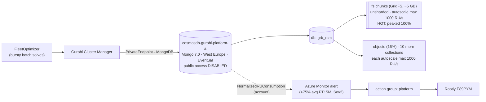

# RCA — `gurobi-cosmos-normalized-ru-consumption-a`

**Incident:** Rootly [E89PYM](https://rootly.com/account/alerts/E89PYM) — Sev2 Azure Monitor metric alert, **acceptance**.
**Resource:** `cosmosdb-gurobi-platform-a` (`rg-gurobi-platform-a`, sub `b524d084-edf5-449d-8e92-999ebbaf485e`).
**Fired:** 2026-06-15T15:44:03Z · **Auto-resolved** (`autoMitigate: true`).
**One-line cause:** Spiky FleetOptimizer/Gurobi batch I/O hit the hot **`fs.chunks` (GridFS)** collection's **1000 RU/s autoscale ceiling** in brief sub-minute spikes → **586 HTTP-429 rejections (2.82% of requests — within Microsoft's 1–5% "healthy" band)** → the PT15M average of `NormalizedRUConsumption` reached **77.67%** and tripped the team's **conservative leading >75% gauge**, which then self-resolved. **Real but minor/tolerable throttle of a chronic, mildly-under-provisioned collection — the headline issue is alert *calibration*, not urgent capacity.**

> **Evidence labels.** `A1 FACT` = externally witnessed (live `az` output captured this session, file:line, or primary-source URL). `A2 INFER` = derived from A1 by named reasoning. `A3 UNVERIFIED[blocked: …]` = could not probe; blocking reason + resolving path named. Raw `az` captures: [`../context/04-live-azure-evidence.md`](../context/04-live-azure-evidence.md) (E1–E14).

---

## Context Ledger

| Term | Definition | Artifact / Evidence | Relevance |
|------|-----------|---------------------|-----------|
| **VPP** | Virtual Power Plant — Eneco platform aggregating flexible energy assets for TenneT balancing markets. | ddd-ubiquitous-language | Why optimization runs. |
| **FleetOptimizer (FTO)** | VPP component computing optimal asset dispatch; submits the solver jobs. | ADR C015 | The bursty client. |
| **Gurobi** | Commercial mathematical-programming (MILP/LP) solver. | gurobi.com (A1) | The solver engine. |
| **Gurobi platform / Cluster Manager** | Solver cluster (token server + compute nodes + control-plane Cluster Manager) whose DB stores models, solutions, job history. | Gurobi Remote Services docs (A1) | Owns this Cosmos DB. |
| **Cosmos DB for MongoDB** | Azure Cosmos DB, MongoDB API, RU-billed. | `az cosmosdb show` → kind MongoDB, v7.0 (A1, E8) | The throttled resource. |
| **RU/s** | Request Unit/s — Cosmos throughput currency. | MS Learn (A1) | The exhausted budget. |
| **NormalizedRUConsumption** | 0–100% = **MAX** RU/s utilization **across partition key ranges**, per 1 min. | MS Learn (A1) | The metric that fired. |
| **Autoscale** | Throughput scales 10%→max automatically; metric computed vs max. | MS Learn (A1) | fs.chunks max = 1000 RU/s. |
| **GridFS / `fs.chunks`** | MongoDB large-object store; `fs.chunks` holds binary chunks (index `{files_id,n}` is the GridFS signature). | `collection show` (A1, E3) | The hot collection. |
| **429 / Mongo 16500** | Rate-limit rejection: HTTP `429` (backend) / Mongo `16500` (protocol). | live metrics (A1, E2/E13) | Direct client-impact signal. |
| **1–5% 429 = healthy** | Microsoft's action framework: 1–5% of requests as 429 with acceptable latency = healthy, no action. | MS Learn (A1) | This incident = 2.82% → healthy band. |
| **autoMitigate** | Rule auto-resolves when condition clears. | `alert show` (A1, E4) | Why it self-cleared. |
| **Action group `platform`** | Azure Monitor target → Rootly → escalation policy. | `src/alerts.tf:52` (A1) | Routing to E89PYM. |
| **`gurobi-infrastructure`** | ADO repo owning the Cosmos IaC + alerts (HEAD `c17995a`, 2026-06-05). | git (A1, E10) | Where the alert lives + where a fix lands. |
| **Nuno / #team-platform** | Escalation owner for the open Gurobi RU class. | recognition-week note (A2) | If persistent. |

---

## L1 — Business — Why the Gurobi platform exists

The VPP earns by bidding aggregated flexibility into TenneT's balancing markets; **FleetOptimizer** turns dispatch into a math model and **Gurobi** solves it. [A2 INFER from VPP domain + ADR C015.] The Gurobi platform's **Cluster Manager** uses this Cosmos DB to store *"input models and their solutions for batch optimization"* + *"history information for jobs and batches"* (30-day retention). [A1: Gurobi Remote Services architecture.]

When this DB throttles, FleetOptimizer batch model/solution I/O is rate-limited and **slows** (it does not necessarily fail — see L8). In **acceptance** this degrades pre-prod validation. A production `-p` sibling exists in the same structural class, so an unaddressed acc weakness is a **possible** early warning for prod — *with a caveat:* prod's **live** throughput was not probed this session and may already be provisioned higher. [A2 INFER; prod live throughput = A3.]

---

## L2 — Repo system

| Repo (`enecomanagedcloud / Myriad - VPP`) | Role | This incident |
|---|---|---|
| **`gurobi-infrastructure`** (HEAD `c17995a`, 2026-06-05) | IaC: Cosmos account, private endpoint, metric alerts, token-server VMs. | **Owns the alert.** Fix lands here. (A1, E10) |
| `gurobi-gitops` (`2ce81e4`, 2026-06-02) | ArgoCD/cluster config for Gurobi compute. | Compute side, not the DB. (A1) |
| `gurobi-azuredevops` (`dfb464b`, 2025-07-11) | Pipelines. | Deploys the IaC. (A1) |

> **Methodology note (load-bearing).** The local clone was stale at `3b2530b` (2026-01-27) — *before* the 2026-03-27 RCA. A first pass concluded "the alert isn't in IaC." After `git pull` to `c17995a`, that **reversed**: the alert *is* team-authored IaC (L5). Pull before trusting an IaC negative. [A1: `git log 3b2530b..c17995a`, E10.]

---

## L3 — Runtime architecture



Live account [A1, E8]: `kind MongoDB`, `v7.0`, single region **West Europe**, `Eventual`, `automaticFailover false`, `backup Periodic`, **`publicNetworkAccess Disabled`, `ipRules []`** (private-endpoint only — `src/mongodb.tf:24-39`; this is why control-plane reads needed no IP whitelist). Database `grb_rsm`, **12 collections**, each **dedicated autoscale max 1000 RU/s** [A1, E3]. Hot collection = **`fs.chunks`** (peaked 100% vs next `objects` 16% — A1, E11), **~5.1 GB → single physical partition at current size** (below the ~50 GB split threshold; it could split if it grows) [A1 size E14 + A2 inference], unsharded (`shardKey: null`, A1, E3).

---

## L4 — Application code flow (the burst path)

Gurobi batch lifecycle [A1: Gurobi Remote Services architecture]: client uploads a batch (**input model → GridFS `fs.chunks`**); a compute node retrieves it, solves, **writes the solution back** (GridFS); job/batch metadata retained ~30 days. The `{files_id, n}` index on `fs.chunks` is the literal GridFS chunk signature [A1, E3], so "`fs.chunks` is GridFS" is schema-certain; "storing **Gurobi** models/solutions" is the inferential half [A2: GridFS convention + Gurobi docs]. Solves arrive in **bursts** → short, write-heavy spikes of chunk I/O concentrated on the single `fs.chunks` partition [A2, grounded in Gurobi burst/queue design + E12 burst shape].

> **A3 UNVERIFIED[blocked: Cluster Manager app source + acc app/job logs not read].** Whether any solve **failed** (vs retried-and-completed) during the burst is not directly confirmed. The Mongo driver retries `16500` with backoff, and the burst was spiky/brief with a 2.82% 429 rate, so *slower-but-completed* is the strongly-favored outcome — but this is the one open question. Resolving path: Gurobi job history / acc app logs for 15:27–15:40Z (L8 T0).

---

## L5 — IaC / state / Azure — the three truths

**Truth 1 — Spec (IaC `gurobi-infrastructure@c17995a`):** the alert is **team-authored** in `src/locals.tf:21-41`, rendered by `src/alerts.tf:19-54` (`for_each`, scoped to the **account**, routed to the `platform` action group). [A1]

```hcl
# src/locals.tf:21-41 (A1)
gurobi-cosmos-normalized-ru-consumption = {
  description = "Trigger when normalized RU consumption is greater than 75% for more than 5 minutes, ..."
  severity = 2  enabled = true  frequency = "PT5M"  window_size = "PT15M"
  criteria = { NormalizedRUConsumption = { metric_namespace = "Microsoft.DocumentDB/DatabaseAccounts"
    operator = "GreaterThan"  aggregation = "Average"  threshold = 75 } }
}
```

The only other Cosmos alert is `gurobi-cosmos-latency` (ServerSideLatency>99ms). **No 429/throttling alert** — it was deliberately removed (L6). `src/mongodb.tf:1-51` declares the account + private endpoint + db `grb_rsm` but **no throughput/autoscale** — collections + RU ceilings are created out-of-band by the Cluster Manager app. [A1]

> **Stale-description flag (A1, demoledor C5.0.1):** the description says *"greater than 75% for more than **5 minutes**"* but `window_size = "PT15M"` (15 min). Commit `d7fc972`/PR 176135 widened the window to PT15M and **left the PT5M wording** — the implemented behaviour is a 15-min average, not a 5-min sustained check. Stale alert copy; fix in the same PR as T2.

**Truth 2 — State (Terraform):** not inspected (backend not read); deployed alert matches spec (Truth 3) so alert drift is unlikely; throughput is intentionally not in state. [A3 UNVERIFIED[blocked: tfstate not read] — non-load-bearing; live Azure is the operational truth.]

**Truth 3 — Azure (live):** the deployed rule is **semantically identical to the IaC — every criterion value matches** (Terraform `frequency`/`aggregation` serialize to ARM `evalFreq`/`timeAggregation`; values `NormalizedRUConsumption`, `GreaterThan 75`, `Average`, `PT15M`, `PT5M`, sev 2, enabled, `autoMitigate true`). **No deployment drift.** [A1, E4 — *semantic*, not byte-identical: the ARM key names differ from the HCL keys.] `fs.chunks` autoscale **max 1000 RU/s** (`throughput:100` floor, `instantMax:10000`) [A1, E3].

**Reconciliation:** IaC alert ≡ live alert (no drift) ✓. IaC has *no* throughput ≡ live throughput set out-of-band ✓ — so the **RU ceiling has no IaC review surface** (drift-prone; see L10).

---

## L6 — The pipeline and how it actually runs

`gurobi-infrastructure` is applied via its ADO pipeline; collections + RU ceilings are **not** pipeline-created — the Cluster Manager app provisions them at runtime. [A2 from "throughput not in IaC" (A1) + Cluster Manager owning its schema (A1).]

The relevant recent change is the **alert redesign** [A1, E10]: `f956e9b` *"Update … normalized RU consumption alert and **remove throttling alert**"* + `d7fc972`/PR **176135** *"Adjust window size … to 15 minutes."* The team **swapped the lagging 429 alert for a leading NormalizedRU>75%/PT15M alert** — this is why the page "looks new."

> **Steelman of the team's choice (socrates A1).** This was **not** a blunder. The removed 429 alert's own in-repo comment read *"We see 429 responses regularly when tasks run on Gurobi … 1 or 2 … set the threshold to 20 to prevent the alert from being triggered by normal behavior"* (`src/locals.tf:29-30` historic). Moving from a chronically-noisy 429-**count** alarm to a **leading saturation gauge** is exactly the org's own durable rule (*"watch NormalizedRUConsumption, not just 429 counts"*). The residual gap (L8) is not that they did this — it is that they kept **no tuned client-impact (429-rate) signal at all**, and left the leading gauge at Sev2.

---

## L7 — Timeline

| Time (UTC) | Event | Evidence |
|------------|-------|----------|
| Ongoing (≥7 d) | `fs.chunks` per-minute Max hits 100% multiple times daily (Jun 8–15, ~16 spike-hours). Chronic. | A1, E7 |
| 2026-03-27 | **Prior incident**: the *429* alert fired (24 throttles); real fix (autoscale/right-size) recommended. | A2, precedent |
| ~Apr–Jun (`f956e9b`, PR 176135) | Team **removes 429 alert**, **adds** NormalizedRU>75%/PT15M/Sev2. | A1, E10 |
| **15:27–15:40** | Spiky burst: per-minute Max NormalizedRU = 100% in ~9 min, but `TotalRequestUnits` peak only **~3,292 RU/min ≈ 55 RU/s avg** → brief sub-minute spikes, **not** sustained saturation. | A1, E1/E12 |
| 15:28–15:38 | **Throttling**: 586 HTTP-429 + 16,555 Mongo-16500 events. Of **20,792** total requests, 429 = **2.82%** (within MS 1–5% healthy band). 16500 count is retry-inflated (≤9× per op). | A1, E2/E13 |
| 15:41 | Burst ends; RU → ~8%. | A1, E1 |
| 15:44:03 | **Alert fires** — PT15M avg = 77.67% > 75. | A1, E4 |
| ~15:59 | **Auto-resolves** (`autoMitigate`). No 429/latency alert fired (no 429 rule exists). | A1, E5 |

> **The 586-vs-16,555 gap is driver-retry amplification** (A1 MS Learn: SDKs retry 16500 up to ~9×), not an unexplained "metric-layer difference." The **HTTP-429 rate (2.82%)** is the figure Microsoft's action framework uses; the **34.5%** (16,555 ÷ 47,953 MongoRequests) is the protocol-layer, retry-inflated count and must **not** be read as "1/3 of distinct ops failed."

> **The removed 429 alert *would* have fired by its own rule** (A1, `git show f956e9b`): its threshold was `≥20` 429s/PT5M; this window had **586** (peak 181/min) ≈ **29×** that. So *by count* it fires hard — yet *by Microsoft's rate framework* 2.82% is healthy. **That tension is the core alert-design problem** (L8 T2): a raw count alarm over-fires on spiky workloads; a rate alarm does not.

---

## L8 — Fix

**Diagnosis class: `Verified Root Cause`** for the saturation mechanism (depth 2–3, A1-grounded); the specific saturator (`fs.chunks`) is now **A1** (per-collection split, E11). One residual is A3 (solve-success, L4).

- **Depth 1 (proximate):** spiky Gurobi batch I/O hit `fs.chunks`'s 1000 RU/s autoscale ceiling in brief sub-minute spikes → 586 HTTP-429 (2.82%) → per-minute Max 100% for ~9 min → PT15M avg 77.67% > 75 → alert. [A1: E1/E2/E11/E12/E13]
- **Depth 2 (enabling):** the hot collection is a **single-partition (~5 GB) GridFS store at only 1000 RU/s**; large-object chunk I/O in bursts spikes past the ceiling. Same ceiling class as March. [A1 + A2]
- **Depth 3 (design/governance):** (a) the alert is a **leading gauge with no tuned client-impact (429-rate) signal**, at Sev2 — so it pages on micro-bursts that are *within Microsoft's healthy band*; (b) **throughput is out of IaC** (no review surface, drift-prone); (c) **GridFS-in-Cosmos** couples large-object volume to a small RU budget. [A1 + A2]

**Is it "broken"? Minor/degraded, not down — and within Microsoft's tolerated band.** 429 rate 2.82% (healthy 1–5%), spiky and brief, self-resolved; Mongo driver retries `16500` with backoff. *Slower-but-completed* solves are strongly favored. **Not closeable as "fine" until T0 confirms solve success** (A3). Not a *configuration* regression (activity log empty since 05-15, A1 E9); a *workload-growth* regression is **not excluded** — June PT15M avg 77.67% vs March ≈39% is consistent with hotter bursts (A2, unresolved — L10).

**Tiered remediation (full spec in [`fix.md`](./fix.md); two provider-validated, agent-implementable PR specs in [`spec-pr1-gurobi-infrastructure-alert-calibration.md`](./spec-pr1-gurobi-infrastructure-alert-calibration.md) and [`spec-pr2-platform-infrastructure-rootly-routing.md`](./spec-pr2-platform-infrastructure-rootly-routing.md)) — note the priority order changed after the 2.82% finding. Implementation note: the 429 *rate* (2.82%) is the **triage** figure; the **alert** is a dynamic-threshold on the backend HTTP-429 count, because a true metric ratio is not directly expressible in an Azure metric alert (validated against azurerm v4 + Microsoft Learn).**

| Tier | Action | Why | Priority |
|------|--------|-----|----------|
| **T0 — now** | Confirm Gurobi **job success** for 15:27–15:40 + check for batch resubmission. Don't close as "fine" until done. | The only A3 gap. | Gate |
| **T2 — alert calibration (PRIMARY)** | Re-add a **429-RATE** page (`429/TotalRequests > ~5%`, per-env backtested — today's 2.82% would *not* fire); demote the RU>75% gauge to **Sev3** + fix its stale "5 minutes" description. | The leading gauge pages on healthy-band micro-bursts; pages should track real client impact. | **High** |
| **T1 — capacity (secondary)** | Raise `fs.chunks` autoscale **max 1000 → 4000** (single partition serves up to 10k, so no shard needed; size from measured demand). Bring throughput into IaC. | Reduces spike-throttling + alert noise. Not urgent (2.82% is healthy). | Medium |
| **T3 — durable candidate (feasibility-blocked A3)** | Offload GridFS large objects to **Blob Storage** (keep metadata in Cosmos), or shard `fs.chunks`. | Decouples large-object I/O from RU. | Candidate — depends on whether the third-party Gurobi Cluster Manager supports it (unverified). |

---

## L9 — Verification

| Fix | Acceptance (externally witnessable) | Probe |
|-----|------------------------------------|-------|
| T0 | Job history shows solves in the window completed (or names failures) + no resubmission storm. | Gurobi Cluster Manager job history / acc app logs, 15:27–15:40. |
| T2 | Backtest both rules vs the 7-day history: the **Sev2 429-rate** rule does **not** fire on 2.82% bursts but **does** fire >5%; the **Sev3** RU gauge fires informationally. Tune per-env. | `TotalRequests` 429 ÷ total over historical bursts. |
| T1 | After raising the ceiling, a comparable burst keeps NormalizedRU Max <100% and 429 count → 0; chosen max > measured peak demand. | `NormalizedRUConsumption` Max + `TotalRequestUnits` on fs.chunks. |
| T3 | If pursued: `fs.chunks` RU/s + `DataUsage` drop; NormalizedRU bursts no longer reach 100%; solve latency unchanged. | metrics before/after. |

---

## L10 — Lessons

1. **`NormalizedRUConsumption` is a per-partition MAX, and a utilization gauge — not an impact metric.** Always confirm with the **HTTP-429 rate** (`TotalRequests StatusCode=429 ÷ TotalRequests`). Here 77.67% RU-average looked alarming but the real impact was **2.82% 429 — within Microsoft's healthy band**. [A1]
2. **Average hides shape.** A PT15M average of per-minute maxes can be brief micro-bursts (`TotalRequestUnits` was ~55 RU/s avg) — pull the per-minute series *and* the RU-served series before calling it "sustained."
3. **Count alarms over-fire on spiky workloads; rate alarms don't.** The removed 429-count alert (≥20) would have fired (586) while the 429-rate (2.82%) says healthy — pick the rate. Extends LL-007/008/012.
4. **Don't read a deliberate redesign as a mistake.** The team *chose* the leading gauge (their 429s were noise); the gap is the missing tuned client-impact signal, not the gauge itself.
5. **Pull before trusting an IaC negative** — a stale clone reversed the alert-provenance conclusion.
6. **"Not broken before" can mean the *sensor* changed** (429→RU alert), not the system; check activity-log + alert git history.
7. **GridFS in Cosmos couples large-object I/O to the RU budget**; a single unsharded chunk collection saturates first.
8. **Throughput outside IaC has no review surface** — bring the ceiling into code.

---

## L11 — End-to-end command playbook (reproduce from cold)

```bash
sshwork                      # adds the Eneco ADO ssh key (for repo pulls)
enecotfvppmcloginacc         # acc SP via 1Password; clear with: enecotflogout
SUB=b524d084-edf5-449d-8e92-999ebbaf485e; RG=rg-gurobi-platform-a; ACC=cosmosdb-gurobi-platform-a
RID="/subscriptions/$SUB/resourceGroups/$RG/providers/Microsoft.DocumentDB/databaseAccounts/$ACC"

# 1. The metric that fired (Max+Avg per minute).
az monitor metrics list --resource "$RID" --metric NormalizedRUConsumption --aggregation Maximum Average \
  --interval PT1M --start-time 2026-06-15T15:10:00Z --end-time 2026-06-15T16:10:00Z -o table
# 2. THE decision pivot — true HTTP-429 RATE (not the retry-inflated 16500 count).
az monitor metrics list --resource "$RID" --metric TotalRequests --aggregation Total \
  --start-time 2026-06-15T15:26:00Z --end-time 2026-06-15T15:41:00Z --interval PT15M --query "value[0].timeseries[0].data[0].total"  # = denominator
az monitor metrics list --resource "$RID" --metric TotalRequests --aggregation Total --filter "StatusCode eq '429'" \
  --start-time 2026-06-15T15:26:00Z --end-time 2026-06-15T15:41:00Z --interval PT15M --query "value[0].timeseries[0].data[0].total"  # = 429s; rate = 429/total
# 3. Which collection (per-CollectionName split, PT1M Max).
az monitor metrics list --resource "$RID" --metric NormalizedRUConsumption --aggregation Maximum \
  --filter "CollectionName eq '*'" --interval PT1M --start-time 2026-06-15T15:26:00Z --end-time 2026-06-15T15:41:00Z \
  --query "reverse(sort_by(value[0].timeseries[].{c:metadatavalues[0].value,p:max(data[].maximum)}, &p))" -o table
# 4. Burst shape (RU served/min) + ceiling + size.
az monitor metrics list --resource "$RID" --metric TotalRequestUnits --aggregation Total --filter "CollectionName eq 'fs.chunks'" --interval PT1M --start-time 2026-06-15T15:26:00Z --end-time 2026-06-15T15:41:00Z -o table
az cosmosdb mongodb collection throughput show --account-name "$ACC" -g "$RG" --database-name grb_rsm --name fs.chunks --subscription "$SUB" --query "resource.{ru:throughput,autoscaleMax:autoscaleSettings.maxThroughput,instantMax:instantMaximumThroughput}"
# 5. Alert def + what else fired + what changed.
az monitor metrics alert show -n gurobi-cosmos-normalized-ru-consumption-a -g "$RG" --subscription "$SUB"
az monitor activity-log list --resource-id "$RID" --start-time 2026-05-15T00:00:00Z -o table   # empty => no config change
git -C .../gurobi-infrastructure log --oneline -- '*locals*' '*alert*'
enecotflogout
```

---

## L12 — One-page on-call playbook (5-minute triage)

**Alert: `gurobi-cosmos-normalized-ru-consumption-a` (acc/prd) — Cosmos RU micro-burst, Gurobi platform.**

1. **Self-resolved?** `autoMitigate: true` → usually clears in ~15 min. A single resolved fire = low urgency.
2. **THE decision: real client impact?** Compute the **HTTP-429 RATE** = `TotalRequests StatusCode=429 ÷ TotalRequests` for the window (cmd #2).
   - **429 rate ≤ ~5% and self-resolved** → within Microsoft's healthy band → **ack, link this RCA**. (2026-06-15 was 2.82% → this case.)
   - **429 rate > 5%, or sustained across windows, or solves failing** → escalate to **Nuno (fallback #team-platform)**.
   - ⚠️ Do **not** use the Mongo-16500 count or the NormalizedRU% as the impact figure — they over-state it (retry-inflated / leading gauge).
3. **Which collection?** cmd #3 — expect `fs.chunks`. If different, partition design changed → dig.
4. **Did solves actually fail?** Gurobi job history for the window (the metric can't tell you).
5. **Standing fixes** ([`fix.md`](./fix.md)): re-calibrate the alert (429-rate page + Sev3 gauge) is primary; raising the `fs.chunks` ceiling is secondary; Blob-offload is a candidate.

---

## Evidence index

`A1` live probes captured 2026-06-15 via `az` (acc SP, control-plane), recorded verbatim in [`../context/04-live-azure-evidence.md`](../context/04-live-azure-evidence.md) (E1–E14). IaC `A1` from `gurobi-infrastructure@c17995a`. External `A1` from Microsoft Learn / Gurobi docs ([`../context/03-external-docs.md`](../context/03-external-docs.md)). Precedent `A2` from [`../context/02-precedent-and-canon.md`](../context/02-precedent-and-canon.md). Residual `A3`: solve-success during the burst (L4/L9 T0); prod live throughput (L1). This RCA was revised after a four-reviewer adversarial pass (sherlock-holmes, sre-maniac, el-demoledor, socrates-contrarian) — receipts in [`../adversarial/`](../adversarial/).
