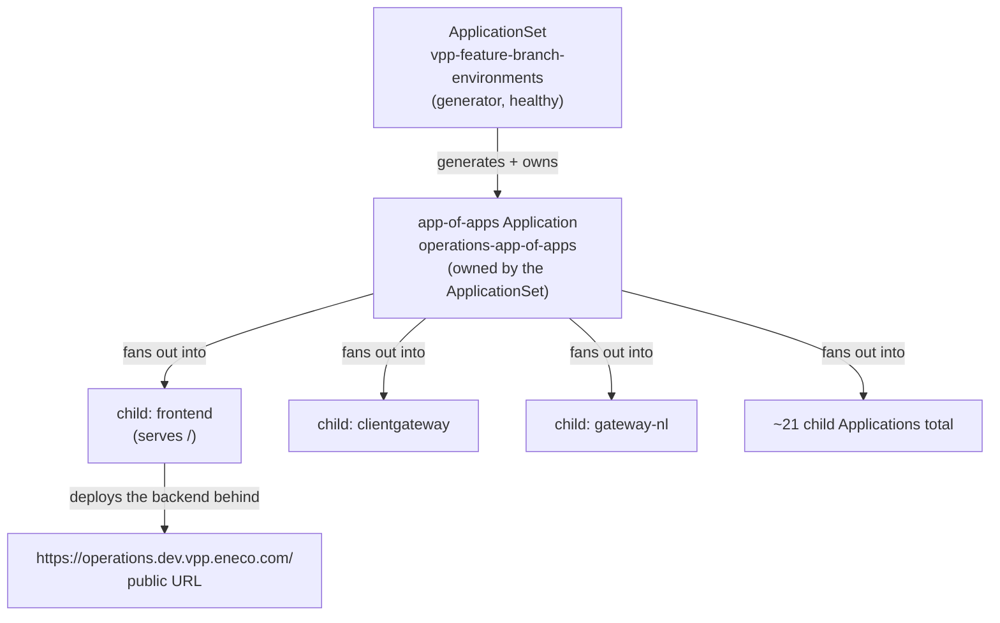
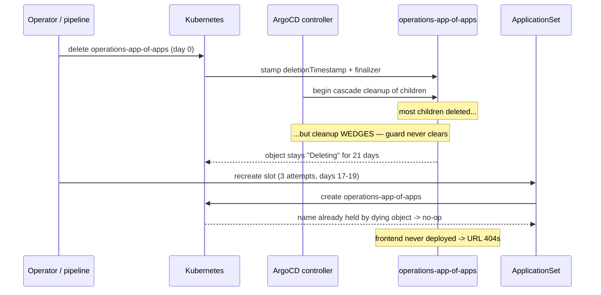

# Fixing an FBE Slot That 404s Because Its App-of-Apps Is Stuck Mid-Deletion — Mastery-Grade How-To

> **For**: an on-call engineer or agent who finds a Feature Branch Environment
> (FBE) slot returning HTTP 404 on its public URL, has never seen this failure
> before, and must both fix it and be able to defend the fix.
>
> **Knowledge Contract**: after reading this document, you will be able to:
>
> 1. draw the chain from ApplicationSet to app-of-apps to child apps to the
>    public URL, and point to exactly where the failure sits;
> 2. explain from first principles why a Kubernetes object carrying a
>    deletion mark is never reconciled, and why that starves the slot;
> 3. trace the causal path from "a delete was started but never finished" to
>    "the URL serves 404";
> 4. diagnose this failure class with read-only probes and repair it by clearing
>    the wedged guard so the ApplicationSet self-heals the slot;
> 5. reject three look-alike causes — expired access token, per-app credential
>    gap, and routing misalignment — and reject the dangerous "just run the
>    destroy pipeline" shortcut;
> 6. defend the fix against the challenge "removing a finalizer is reckless" by
>    proving the workloads were already gone.
>
> **Rejection condition**: this document does not make you able to identify *who
> or what triggered the original deletion* — that remains an open question in the
> incident it is built from, and the fix deliberately does not depend on knowing
> it.
>
> **Evidence base**: the standalone repair spec `how-to-fix.md`, the live
> read-only diagnosis `probe-results.md`, and the applied-fix verification
> `fix-result.md`, all from the 2026-06-22 `operations` FBE-404 incident on the
> Sandbox cluster `vpp-aks01-d`. Claims are separated into observed fact,
> inference, and unverified in the Evidence Ledger near the end.

## TL;DR — The One Picture

Before the diagram: this is the whole delivery chain for one FBE slot, top to
bottom. The question it answers is "what owns what, and where does the public URL
get its content?" Read it as ownership flowing downward and HTTP traffic arriving
at the bottom.



After the diagram: one ApplicationSet generates and *owns* a single parent
Application called the **app-of-apps**. That parent does not run any workload
itself; its only job is to fan out into roughly 21 child Applications — one of
which, `frontend`, deploys the web backend that answers `/`. Traffic enters at
the bottom. If the `frontend` child is never deployed, the edge proxy has nothing
behind `/`, so the URL returns 404. The pressure point in this whole picture is
the single box in the middle — `operations-app-of-apps`. Everything below it
depends on that one object being healthy and reconcilable. Key takeaway: **the
URL is 404 because the middle of this chain is frozen, not because the edge or
the routing is broken.** The next picture explains what "frozen" physically means.

## First-Principles Ladder

This ASCII ladder is the memory model. If you can redraw these six rungs, you can
reconstruct the entire failure and its fix without this document.

```text
deletionTimestamp -> "not reconciled" invariant -> finalizer guard ->
   wedge -> name still held -> recreate is a no-op -> 404
```

Walk it in words. **A deletion mark** (`deletionTimestamp`) is a field Kubernetes
stamps on an object the moment a delete is requested; it means "this object is
being torn down." **The invariant** that follows is the load-bearing fact of this
whole document: *an object carrying a deletion mark is never reconciled toward
live desired state.* The controller's entire attention shifts to tearing it down,
not to making it match what you want. **A finalizer** is a named guard
(`resources-finalizer.argocd.argoproj.io`) that blocks the actual removal until
ArgoCD has finished cascade-deleting the object's managed resources — only then
does the controller clear the guard and let the object vanish. **A wedge** is when
that cleanup never completes, so the guard is never cleared and the object sits in
"Deleting" forever. **Because it still exists, it still holds its name.** Anything
that tries to recreate `operations-app-of-apps` finds the name already taken by
the dying object, so the create is a silent no-op. **No fresh app-of-apps means no
`frontend`, which means 404.** The failure follows necessarily from the invariant
the moment the deletion wedges.

## Vocabulary That Matters

These terms are defined by what they *do* in this mechanism, not by their
dictionary meaning. Learn the mechanism role, not the label.

| Term | First-principles meaning | Why it matters here |
|---|---|---|
| Application (ArgoCD) | A custom resource telling ArgoCD to keep one set of cluster objects matching one Git source | The app-of-apps and each child are Applications |
| app-of-apps | A parent Application whose managed resources are *other Applications* | The single frozen object that starves the slot |
| ApplicationSet | A generator that templates and owns many Applications from a set of inputs | The healthy thing that self-heals the slot once unblocked |
| deletionTimestamp | The field marking an object as being torn down | Its presence is the decisive proof of this failure class |
| finalizer | A guard blocking final removal until cleanup completes | Its presence is normal; the wedge is the bug |
| reconcile | The controller loop driving live state toward desired state | Suspended for any object carrying a deletion mark |
| ownerReference (controller:true) | The link making the ApplicationSet the owner that regenerates the app-of-apps | Why no pipeline re-run is needed to recover |
| FBE slot | One feature-branch environment, deployed as one app-of-apps + its children | The unit that is 404ing |

## The System Model — Who Owns What

Three layers matter, and the source of truth lives at the top. The
**ApplicationSet** `vpp-feature-branch-environments` is the generator and the
*owner*: it templates each slot's app-of-apps and stamps an `ownerReference` with
`controller:true` on it. This ownership is the reason recovery is automatic — the
owner is contractually responsible for regenerating a child that disappears. The
**app-of-apps** is purely structural plumbing: it holds the list of ~21 child
Applications but runs nothing itself. The **children** are where real workloads
live; `frontend` is the one that serves `/`, so it is the child whose absence the
public URL exposes. The cluster is the Sandbox AKS context `vpp-aks01-d`, reached
by direct `kubectl` (no jump host). Note one trap baked into the design: the
namespace `operations` stays `Active` and unmarked even while the app-of-apps is
frozen, because a sibling object keeps syncing into it. So `get ns` will *not*
reveal the wedge — only reading the Application resource does.

## Mechanism Over Time — How a Frozen Object Produces a 404

Before the diagram: the topology above shows *what exists*; this sequence shows
*what happened in what order*, because the bug is invisible unless you see the
timing. The question it answers is "why did three separate 'recreate' attempts all
look successful yet deploy nothing?"



After the diagram: the delete starts, Kubernetes stamps the deletion mark and the
finalizer, and the controller begins tearing down children. Most go, but the
parent's cleanup wedges and the guard is never cleared — so the object lingers in
"Deleting." Now the critical part: every later recreate attempt hits Kubernetes,
which sees the name is still held by the dying object and quietly does nothing.
The pipeline reports "build succeeded" because the pipeline *did* run — but
running a pipeline only proves the pipeline ran, not that ArgoCD materialized the
slot. Because `frontend` is never (re)deployed, the URL 404s. The edge from the
first picture this animates is the `ApplicationSet --> app-of-apps` generate edge:
it is firing, but its output collides with a corpse and produces nothing. Takeaway
to keep: **a green build next to a 404 is the signature of this class** — the
control plane lied by omission.

## The Decisive Distinction — Finalizer Presence Is Not the Bug

This is the single most important thing to internalize, because getting it wrong
leads you to rip finalizers off healthy objects and cause real damage. The
finalizer `resources-finalizer.argocd.argoproj.io` is the *normal* cascade-delete
guard that **every** ArgoCD Application carries — the fresh, healthy app-of-apps
the ApplicationSet regenerates after the fix carries it too. The bug is never "a
finalizer exists." The bug is *a finalizer paired with a deletion mark whose
cleanup never completes.* You are not removing finalizers from healthy objects;
you are clearing one stuck guard on one object that is already dying. This ASCII
decision surface is the rule to memorize before touching anything.

```text
finalizer present?  ---no--->  not this class; look elsewhere
        | yes
        v
deletionTimestamp present?  ---no--->  STOP. Healthy object.
        |                              NEVER remove its finalizer.
        | yes
        v
workloads already gone?  ---no--->  STOP. Live workload behind a
        |                           serving frontend = not this class.
        | yes
        v
  SAFE to clear the wedged guard
```

After the ladder: the gate is two-key. The deletion mark proves the object is
dying (so completing its death harms nothing it was keeping alive), and the
absent workloads prove the finalizer's cleanup target is already gone (so clearing
the guard destroys nothing live). Only when both keys turn do you proceed. If the
object has a finalizer but **no** deletion mark, it is a perfectly healthy
Application and removing its finalizer would be sabotage. That single branch is
what separates a correct fix from an outage you caused.

## Telling This Class Apart From Its Look-Alikes

Three other failures also make an FBE slot 404, and each has a different fix. The
whole skill of this incident class is refusing to apply the finalizer fix to a
problem it does not solve. Read this as a routing table: the probe in the middle
column sends you to the right runbook.

| Suspected cause | Discriminating probe and what you see | If it matches, the fix is |
|---|---|---|
| App-of-apps wedged mid-deletion (this class) | The app-of-apps Application shows a non-empty `deletionTimestamp` and the finalizer | Clear the wedged finalizer (this document) |
| Expired access token (PAT) on the generator | The ApplicationSet shows `ErrorOccurred=True` with "authentication required"; here it showed `ErrorOccurred=False` | Rotate the PAT — do NOT touch finalizers |
| Per-application credential gap | A specific app reports `ComparisonError … source N of M … authentication required`; the operations apps showed none | Fix that app's repo credential |
| Routing / path misalignment | The 404 response carries an `x-correlation-id` header (a real backend pod stamped it); here the 404 had no such header | Fix the ingress path — objects exist, routing is wrong |

After the table: the cleanest single tell is the 404 itself. A real VPP backend
pod stamps every response with `x-correlation-id`. A 404 *without* that header
came from the edge proxy with nothing behind it — an undeployed backend, which is
this class. A 404 *with* that header means the pods exist and the path is
misaligned — a different runbook entirely. The deletion mark on the app-of-apps is
the positive confirmation; the missing correlation header is the corroborating
sign. The generator being healthy (`ErrorOccurred=False`) is what rules out the
token-expiry look-alike and, critically, is what guarantees the self-heal will
actually fire once you clear the wedge.

## The Fix — Clear the Wedge, Let the Owner Self-Heal

The repair is two merge-patches that set `finalizers` to an empty list and change
nothing else on the objects. Run them only after the read-only preconditions pass
and with explicit authorization, because **finalizer removal is a one-way door**:
it completes a deletion that cannot be undone. The first patch clears the wedged
guard on the slot's app-of-apps; the second clears a child that was wedged the
same way (`assetmonitor`, itself carrying a deletion mark).

```bash
# 1. Clear the wedged finalizer on the slot's app-of-apps (namespace argocd).
kubectl --context vpp-aks01-d -n argocd \
  patch application operations-app-of-apps --type=merge \
  -p '{"metadata":{"finalizers":[]}}'

# 2. Clear the wedged finalizer on the co-wedged child (namespace operations).
kubectl --context vpp-aks01-d -n operations \
  patch application assetmonitor --type=merge \
  -p '{"metadata":{"finalizers":[]}}'
```

After the commands: clearing the guards lets the 21-day-pending deletions finally
complete, and the moment the dying app-of-apps vanishes, its name is free. Now the
ownership from the system model pays off: the ApplicationSet still owns the slot
(`ownerReference controller:true`) and still lists `operations` as a target, so it
immediately regenerates a fresh, reconcilable `operations-app-of-apps` with no
pipeline run and no cloud login needed. The fresh parent fans out into the full
child set, `frontend` deploys, and the URL transitions from 404 to 200. The reason
you do *not* run a recreate pipeline is that you never needed one — the owner does
the recreation for free once the corpse is cleared. Always pass `--context
vpp-aks01-d`: the FBE pattern reuses the `<slot>-app-of-apps` name across slots
and clusters, so a context-less command is a silent wrong-cluster operation.

## Verifying the Fix Worked

A fix you cannot prove is a hope. Four checks confirm convergence, and in the
incident this document is built from they passed in this order: the URL served
200 within about a minute, while full child health settled a few minutes later.

| Check | Expected converged result |
|---|---|
| Scan all Applications for a `deletionTimestamp` | None remain — both wedged objects are gone |
| Read the new `operations-app-of-apps` | A *new* creationTimestamp, `Synced/Healthy`, no deletion mark |
| List `frontend`, `gateway-nl`, `clientgateway` | All present, `Synced/Healthy` (briefly `Progressing` while settling) |
| `curl` the public URL | HTTP 200 (was 404) |

After the table: the order matters for your nerves. The public URL flips to 200
quickly because `frontend` is one of the first children to land; the full set of
21 children reaching Healthy lags by a few minutes as they settle. So a 200 with a
couple of children still `Progressing` is convergence in flight, not a failure.
The decisive check is the first one: if any object still carries a deletion mark,
the deletion has not completed — re-probe the generator's health rather than
patching again blindly.

## Failure Modes And Anti-Patterns

Each of these looks plausible under pressure and fails for a concrete mechanical
reason. Knowing the mechanism is what lets you refuse the shortcut at 2 a.m.

| Anti-pattern | Why it fails (mechanism) | How to detect / avoid |
|---|---|---|
| Run the destroy pipeline to "reset" the slot | It is not a rollback — it wipes 260+ resources and its own failures *create* these orphans; it also runs an older Terraform against newer state | Never invoke it for recovery; recovery is forward via the ApplicationSet |
| Remove a finalizer because one is "stuck" | A finalizer with no deletion mark is on a *healthy* object; clearing it sabotages a live app | Require a non-empty `deletionTimestamp` before clearing |
| Re-run the create pipeline and trust "build succeeded" | The wedged object holds the name, so create is a no-op; green proves the pipeline ran, not that ArgoCD deployed | Resolve the wedge first; verify via ArgoCD state, not pipeline status |
| Sync the slot while it carries a deletion mark | A sync into a finalizer-wedged Application reports green and renders nothing | Clear the deletion first, then let the owner reconcile |
| Trust the default `kubectl` context | The `<slot>-app-of-apps` name is reused across clusters; a wrong-context patch hits the wrong slot | Always pass `--context vpp-aks01-d` |

## Evidence Ledger And Uncertainty

This is the one place audit codes live. The narrative above carried the same
status in plain words; the codes stay here for a reader who wants to verify.

```text
FACT (A1, live read-only probes on vpp-aks01-d, 2026-06-22):
  - operations-app-of-apps carried deletionTimestamp 2026-06-01T10:50:12Z plus
    the resources-finalizer; it and assetmonitor were the only two Applications
    cluster-wide with a deletion mark.
  - The 404 response carried no x-correlation-id header -> undeployed backend.
  - The ApplicationSet showed ErrorOccurred=False, ParametersGenerated=True ->
    PAT-expiry ruled out; no operations app showed a source-N auth error ->
    credential-gap ruled out.
  - After the two patches: no object retained a deletion mark; a fresh
    operations-app-of-apps appeared (creationTimestamp 2026-06-22T11:32:48Z,
    Synced/Healthy); the URL returned 200 within ~1 min and stayed 200.

INFER (A2, reasoned from the facts above):
  - The slot 404'd because frontend was never deployed, because the wedged
    object held the app-of-apps name so every recreate was a no-op.
  - The fix is safe because the managed workloads were already gone, so clearing
    the guard completed a death rather than destroying anything live.

UNVERIFIED (A3, blocked — does NOT change the fix):
  - WHAT triggered the original 2026-06-01 deletion is unknown. Azure CLI was not
    logged in, so the Logic App and pipeline run histories could not be read. The
    12:50 local timing did NOT match the 14:30 auto-evict schedule, so the
    auto-evict is unlikely but unconfirmed. Resolving probe: az login, then read
    the vpp-fbe-autodelete-trigger run history and the destroy-pipeline runs near
    2026-06-01.
  - WHY the finalizer wedged for 21 days (a controller restart ~06-16 did not
    clear it) is not explained by this fix.
```

The discipline here is the point: the fix is fully proven, and the *cause of the
original deletion is honestly marked unknown.* Do not let a plausible-sounding
story ("the auto-evict did it") harden into a claim the evidence does not support.

## Challenge Defense

A reviewer will push on the fix. Here is how each challenge is answered and what
would have changed the answer.

| Challenge | Answer | What would falsify it |
|---|---|---|
| "Removing a finalizer is reckless." | The object was already dying (deletion mark present) and its managed workloads were already gone, so the patch completed a death, not a deletion of live state | A `frontend` Service/Pod found Running and serving while the app-of-apps had no deletion mark |
| "How do you know it was undeployed, not mis-routed?" | The 404 carried no `x-correlation-id`; a real backend stamps that header, so nothing was behind `/` | A 404 that *did* carry `x-correlation-id` |
| "Why not just rerun the pipeline?" | The wedged object holds the name, so create is a no-op; three prior recreates already proved this | A recreate that produced a fresh, reconciling app-of-apps |
| "What if the self-heal doesn't fire?" | The generator was healthy (`ErrorOccurred=False`), which is the precondition for regeneration | An ApplicationSet showing `ErrorOccurred=True` |
| "Did the auto-evict cause this?" | Unverified — the timing did not match the schedule and the run history could not be read; it is left open | Logic App run history showing a 06-01 trigger |

## Durable Principles

1. An object carrying a deletion mark is never reconciled to desired state — so a
   stuck deletion silently starves everything that depends on that object.
2. The *presence* of a guard (finalizer) is normal; the bug is a guard plus an
   uncompleted deletion. Always check both before acting.
3. A green build next to a broken endpoint means the control plane did nothing —
   verify the target system's state, never the pipeline's exit code.
4. When an owner (ApplicationSet) still targets a child, recovery is forward and
   automatic: remove the blocker and let the owner recreate. Destroying and
   rebuilding is a wider blast radius, not a rollback.
5. Fix what you can prove; mark what you cannot. A restored slot and an unknown
   trigger can — and should — coexist honestly in the same report.

## Reusable Mental Model

Carry this to any GitOps slot that 404s: **if a generated, owned object is frozen
mid-deletion, its name is held hostage, so its owner's recreate is a silent no-op
and everything downstream goes dark. Free the name by clearing the stuck guard —
but only after proving the object is genuinely dying and its workloads are already
gone — and the owner heals the rest for free.**

## Self-Test

If you can answer these unaided, you can rebuild the reasoning, not just recall it.

1. Draw the chain from the ApplicationSet to the public URL and mark the single
   box whose freeze causes the 404.
2. Explain *why* a recreate pipeline reports success yet deploys nothing while the
   app-of-apps carries a deletion mark.
3. You find an ArgoCD Application with the `resources-finalizer` but no
   `deletionTimestamp`. Should you clear its finalizer? Why or why not?
4. A different slot 404s and its 404 response carries an `x-correlation-id`
   header. Is this the finalizer-wedge class? What do you check next?
5. A reviewer says "you should have run the destroy pipeline to reset the slot."
   Give the mechanical reason that is wrong.

## Answers

1. ApplicationSet → app-of-apps → ~21 children → `frontend` → URL; the frozen box
   is `operations-app-of-apps` in the middle. Its freeze blocks every child below
   it, and the absent `frontend` is what the URL exposes as 404.
2. Because the wedged object still holds the `operations-app-of-apps` name. The
   create finds the name taken by the dying object and quietly no-ops; the
   pipeline's "success" only proves it ran, not that ArgoCD materialized anything.
3. No. A finalizer with no deletion mark is on a *healthy* object — every ArgoCD
   Application carries this guard normally. Clearing it would force-complete a
   deletion that was never requested. The two-key gate (deletion mark present AND
   workloads gone) is not satisfied.
4. Probably not. The `x-correlation-id` header means a real backend pod answered,
   so objects exist and the path is misaligned — a routing problem, not an
   undeployed slot. Next, check the ingress path configuration, not the app-of-apps
   deletion mark.
5. The destroy pipeline is not a rollback: it wipes the slot's 260+ resources
   (widening the blast radius), runs an older Terraform against newer state, and
   its own failures are what create these orphaned wedges in the first place.
   Recovery is forward — clear the wedge and let the ApplicationSet recreate the
   slot.
