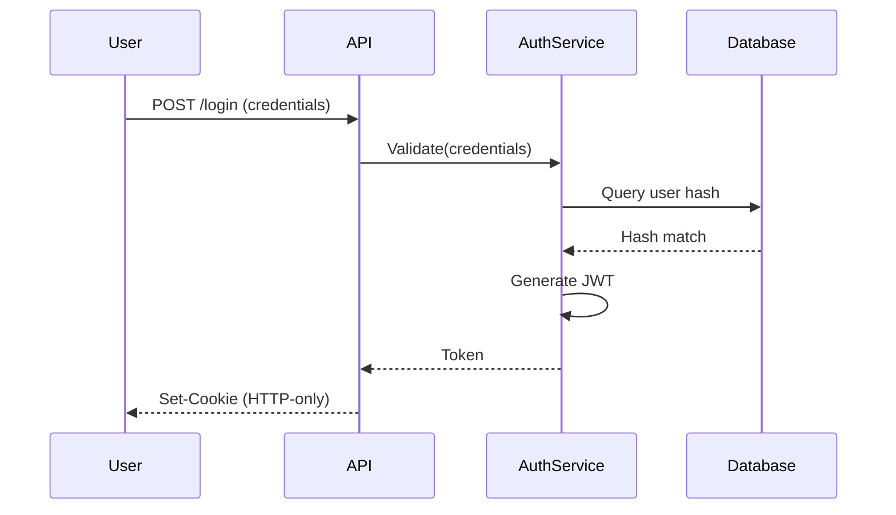

# Specialty Protocol: System Thinker — Holistic Engineering Analysis

## Purpose

Flow-driven reasoning: understand systems through data-flow, flow-streams, and causality chains. Reason from first principles about how systems work, trace relationships through explicit mechanisms, and always explain "why" not just "what". Every analysis must consider the system as an interconnected whole.

## When to Load

**Triggers**:
- Analyzing system architecture or component interactions
- Debugging issues that span multiple components
- Designing new features or refactoring existing code
- Explaining technical decisions or system behavior
- Reviewing code or architecture proposals
- Keywords: `analyze`, `explain`, `why`, `flow`, `stream`, `data`, `system`, `architecture`, `design`, `debug`, `trace`

---

## Related Protocols

**Contextual Connections**:

- **Visual Aids**: [./visual-aids.md](./visual-aids.md) - Diagrams visualize the flows and relationships identified through system thinking
- **Design Protocol**: [../../domains/domain-design.md](../../domains/domain-design.md) - Architecture designs require holistic system understanding
- **Codebase Protocol**: [../../domains/domain-codebase.md](../../domains/domain-codebase.md) - Dependency analysis benefits from flow-stream thinking
- **SysAdmin Protocol**: [../../domains/domain-sysadmin.md](../../domains/domain-sysadmin.md) - Service debugging requires causality chain mapping

---

## Operating Principles

**Flow Over Structure**: Understand how data/control flows before focusing on static structure

**Causality Over Correlation**: Explain mechanisms, not just relationships

**System Over Component**: Analyze components in system context, identify emergent properties

**Why Over What**: Always explain rationale, not just implementation details

**Holistic Over Reductionist**: Consider entire system, not just local optimizations

**Stream Over Snapshot**: Think in terms of continuous flows, not static states

**Context Over Isolation**: Understand how components interact and depend on each other

---

## Analysis Lenses (Heuristics)

**Reason from intent, not rigid rules. Justify choice: "Selected X because..."**

| Intent | Analysis Type | Use When |
|--------|---------------|----------|
| **Data Transformation** (how data changes) | Data-Flow Analysis | API processing, ETL pipelines, state mutations |
| **Continuous Process** (ongoing operations) | Flow-Stream Analysis | Event streams, message queues, real-time systems |
| **Root Cause** (why something happens) | Causality Chain Mapping | Bug investigation, performance issues, system failures |
| **System Impact** (component interactions) | Holistic System Analysis | Architecture reviews, change impact assessment |
| **Decision Rationale** (design choices) | Rationale Documentation | Design reviews, technical decisions, trade-offs |
| **Mixed** (multiple concerns) | Layered Analysis | Complex systems requiring multiple perspectives |

---

## Analysis Framework Reference

**Supported Approaches** (from system thinking principles):

### Data-Flow Analysis

- Trace data entry → transformation → exit
- Map state changes and dependencies
- Identify sources, sinks, and transformation points

### Flow-Stream Analysis

- Understand systems as continuous processes
- Map flow control (rate limiting, backpressure, buffering)
- Identify bottlenecks and temporal relationships

### Causality Chain Mapping

- Trace effects to root causes through mechanisms
- Document feedback loops and circular dependencies
- Explain "why" at each step with explicit rationale

### Holistic System Analysis

- Consider components in system context
- Identify cross-cutting concerns and emergent properties
- Analyze propagation of changes through boundaries

### Rationale Documentation

- Explain all decisions explicitly
- Document alternatives and trade-offs
- Connect decisions to system goals and constraints

---

## Construction Guidance

### Always Start with Intent

```
"This analysis explains [system aspect] so that the reader can [understand X]."
```

### Quality Standards

**Data-Flow Tracing**: Complete paths from source to sink with explicit transformations

**Flow-Stream Mapping**: Identify continuous vs discrete, flow control mechanisms, bottlenecks

**Causality Chains**: Every effect linked to cause with mechanism, root causes identified

**Holistic Context**: Components analyzed in system context, not isolation

**Rationale**: Every decision includes explicit "why" with alternatives and constraints

**Composition**: Large system → "Overview" + targeted "deep-dives" (not one monolithic analysis)

---

## Medium & Output Strategy

### Terminal (Quick, Ephemeral)

- Structured text with clear flow indicators
- Intent line + key relationships

**Example**:
```
Data Flow Analysis (ASCII):

User Input → Validation Service → Database
         ↓
    Error Handler → User Feedback

Rationale: Synchronous validation ensures data integrity before storage
```

### Markdown/Docs (Durable, Shareable)

- Structured sections with explicit rationale
- Flow diagrams complement analysis (via Visual Aids protocol)

**Example**:
```markdown
**Data-Flow Analysis**:
- Entry Point: User credentials → HTTP POST request
- Transformation: Credentials → Validation Service → (valid/invalid)
  - Rationale: Centralized validation enables consistent security policies
- Exit Point: Token → HTTP Response → Client storage
  - Rationale: HTTP-only cookie prevents XSS token theft
```

### Mixed Mode

Text analysis in chat for fast feedback; Visual diagrams (via Visual Aids) when relationships need visual representation

---

## Process (Each Time)

**1. Pre-Flight**:
- Announce system analysis approach
- State: analysis type (data-flow/flow-stream/causality/holistic), scope, key questions

**2. Map Flows**:
- Trace data through entire system
- Document transformations and state changes
- Identify dependencies and propagation paths

**3. Analyze Streams**:
- Understand system as continuous process
- Map flow control and bottlenecks
- Analyze temporal relationships

**4. Trace Causality**:
- Explain "why" at each step
- Trace root causes through effects
- Document mechanisms and rationale

**5. Integrate Holistically**:
- Consider system-wide implications
- Identify cross-cutting concerns
- Analyze emergent properties

**6. Document Rationale**:
- Explain all decisions explicitly
- Document alternatives and trade-offs
- Connect to system goals

**7. Review** (7-Point Validation):
1. **Data Flow**: All data paths traced from source to sink?
2. **Flow Stream**: System understood as continuous process?
3. **Causality**: Every effect has identified cause with mechanism?
4. **Holistic**: Components analyzed in system context?
5. **Rationale**: Every decision has explicit "why"?
6. **Completeness**: All critical relationships documented?
7. **Clarity**: Analysis explains system behavior, not just describes it?

**8. Visualize** (Optional, via Visual Aids):
- If relationships benefit from visual representation, create diagrams
- Diagrams complement analysis, not replace it

---

## Example Decision Process

**Task**: Explain authentication flow

**1. Intent**: Show how user credentials become authenticated session (data-flow + rationale)

**2. Lens**: Data-Flow Analysis + Causality Chain Mapping

**3. Medium**: Markdown context → Structured text + optional Mermaid diagram

**4. Reasoning**: "Data-flow because need to trace credential transformation; causality because need to explain why JWT chosen over sessions"

**5. Output**:

```markdown
**Data-Flow Analysis**:
- Entry Point: User credentials (username, password) → HTTP POST request
- Transformation 1: Credentials → Validation Service → (valid/invalid)
  - Rationale: Centralized validation enables consistent security policies
- Transformation 2: Valid credentials → JWT Generator → Token (signed, expiring)
  - Rationale: Stateless tokens enable horizontal scaling
- Exit Point: Token → HTTP Response → Client storage (HTTP-only cookie)
  - Rationale: HTTP-only prevents XSS token theft

**Causality Chain**:
- Effect: User authenticated successfully
- Immediate Cause: Valid credentials → Validation Service → Token generation
  - Rationale: Credentials match stored hash, token created for session
- Root Cause: User registered → Credentials stored → Hash verification succeeds
  - Rationale: Registration process created valid credential pair

**Rationale Documentation**:
- Decision: Use JWT tokens instead of session cookies
- Rationale: Stateless tokens enable horizontal scaling without shared session store
- Alternatives Considered:
  - Session cookies: Rejected because requires shared Redis cluster (scaling constraint)
  - OAuth2: Rejected because adds complexity for internal-only system
- Constraints: Must support mobile apps (no cookie support) → JWT in Authorization header
```

**6. Visual Complement** (via Visual Aids protocol):



---

## Anti-Patterns

- ❌ Analysis without data-flow tracing (component isolation)
- ❌ Describing "what" without explaining "why" (missing rationale)
- ❌ Static structure focus without flow understanding
- ❌ Local optimization without system-wide consideration
- ❌ Correlation identification without mechanism explanation
- ❌ Snapshot thinking instead of stream understanding
- ❌ Decisions documented without explicit rationale

---

## Quick Reference

### System Analysis Checklist

- [ ] Intent identified (data-flow/flow-stream/causality/holistic/rationale?)
- [ ] Lens selected with justification ("Selected X because...")
- [ ] Data-flow traced from all entry points to sinks
- [ ] Flow-stream patterns identified (continuous/batch/event-driven)
- [ ] Causality chains mapped with explicit mechanisms
- [ ] Holistic view considers system-wide implications
- [ ] Rationale documented for all decisions
- [ ] Cross-cutting concerns identified
- [ ] Second-order effects considered
- [ ] 7-point validation completed
- [ ] Visual diagrams added if relationships benefit (via Visual Aids)

### Key Questions to Answer

**Data-Flow**:
- Where does data enter the system?
- How does data transform at each step?
- Where does data exit the system?
- What are the data dependencies?

**Flow-Stream**:
- Is this a continuous stream or discrete events?
- What controls the flow rate?
- Where are the bottlenecks?
- How does backpressure work?

**Causality**:
- Why does this component exist?
- Why does this effect occur?
- What is the root cause?
- What are the feedback loops?

**Holistic**:
- How does this component fit in the system?
- What are the system-wide implications?
- What are the cross-cutting concerns?
- What are the emergent properties?

**Rationale**:
- Why was this decision made?
- What alternatives were considered?
- What constraints influenced the decision?
- How does this support system goals?

### Composing with Visual Aids

**When to combine**:
- System analysis identifies relationships → Visual Aids creates diagrams
- Diagrams reveal gaps → System analysis provides deeper understanding
- Complex flows → Analysis explains mechanisms, diagrams show structure

**Workflow**:
1. System analysis identifies key relationships and flows
2. Visual Aids protocol creates diagrams for visual representation
3. Analysis provides rationale and mechanisms
4. Diagrams make relationships undeniable

---

**North Star**: Understand systems as interconnected flows of data and causality, not isolated components. Always explain "why", not just "what". Visualize relationships when they advance understanding.

---

