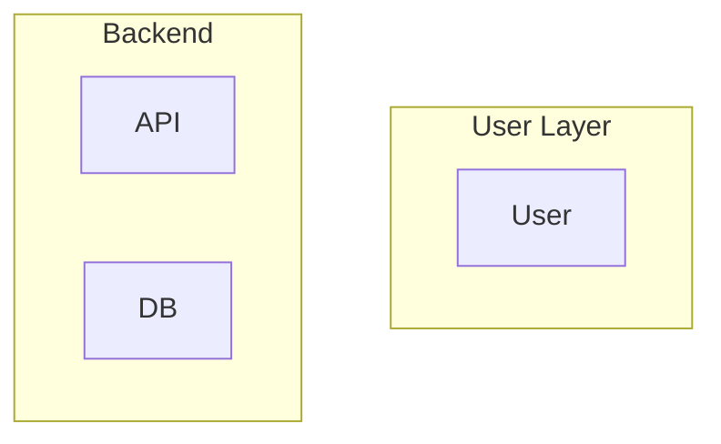
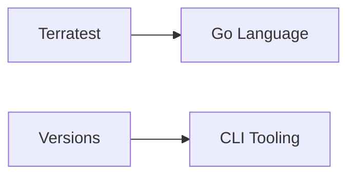
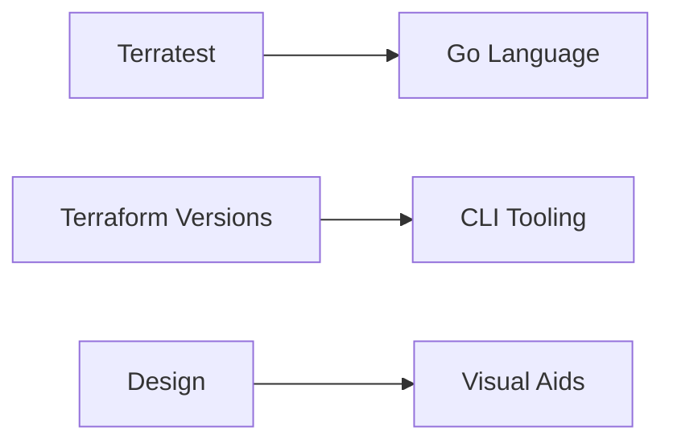

# Specialty Protocol: Visual Aids

## Purpose

Intent-driven visual reasoning: select diagram form that makes target relationships undeniable. Reason from first principles about what must be understood, pick the clearest representation.

## When to Load

**Triggers**:
- Explaining system architecture or component dependencies
- Describing workflows, decision trees, or process flows
- Illustrating relationships (≥3 interconnected components)
- User requests diagrams ("show diagram", "visualize", "draw this")
- Keywords: `architecture`, `diagram`, `flow`, `dependencies`, `visualize`

---

## Related Protocols

**Contextual Connections**:

- **Design Protocol**: [../../domains/domain-design.md](../../domains/domain-design.md) - Architecture designs benefit from visual compression
- **Codebase Protocol**: [../../domains/domain-codebase.md](../../domains/domain-codebase.md) - Dependency graphs visualize code relationships
- **CLI Tooling**: [../../standards/standard-tooling-cli.md](../../standards/standard-tooling-cli.md) - Tool relationship diagrams

---

## Operating Principles

**Intent Over Artifact**: Start from "what must be understood?" (structure, flow, behavior, state, data, dependencies, timeline), then select form

**Medium Awareness**: Terminal → compact ASCII; Markdown → Mermaid when fidelity helps

**Minimum Sufficient Fidelity**: Include only detail that advances understanding

**Orthogonality**: Visuals are aids, not dumps. Every diagram has 1-sentence intent line

**Adaptability**: Mid-task, refine or switch type if comprehension gaps remain

**Style Coherence**: Follow house conventions (consistent naming, directional cues)

**Token Efficiency**: Smallest diagram that fully explains; prefer slices over monoliths

---

## Diagram Selection Lenses (Heuristics)

**Reason from intent, not rigid rules. Justify choice: "Selected X because..."**

| Intent | Diagram Type | Mermaid Engine | Use When |
|--------|--------------|----------------|----------|
| **Structure** (what exists, boundaries) | Component graph | `graph TB` or `flowchart TB` | Service topology, module architecture |
| **Interaction** (who talks to whom, when) | Sequence | `sequenceDiagram` | API flows, authentication handshake |
| **Lifecycle** (how it evolves) | State machine | `stateDiagram-v2` | Deployment pipeline, PR workflow |
| **Data model** (entities, relationships) | ER diagram | `erDiagram` | Database schema, domain model |
| **Dependencies** (compile/runtime) | Dependency graph | `graph LR` or `classDiagram` | Build deps, protocol knowledge graph |
| **Workflow** (decision flow) | Flowchart | `flowchart TB` | Decision tree, process steps |
| **Timeline** (when things happen) | Gantt | `gantt` | Rollout plan, project schedule |
| **Concepts** (taxonomy, hierarchy) | Mindmap | `mindmap` | Concept organization, design space |
| **Git flow** (branching, merging) | Git graph | `gitGraph` | Development workflow, release strategy |
| **Mixed** (structure + behavior) | Paired diagrams | Multiple focused diagrams | System overview + interaction detail |

---

## Mermaid Diagram Types Reference

**Supported Engines** (from house conventions):

### Structural Diagrams

- `graph TB` / `graph LR` / `flowchart` - Component relationships, dependencies
- `classDiagram` - Class hierarchies, object relationships

### Behavioral Diagrams

- `sequenceDiagram` - Interactions over time, message flows
- `stateDiagram-v2` - State transitions, lifecycles

### Data Diagrams

- `erDiagram` - Entity relationships, database schema

### Planning Diagrams

- `gantt` - Project timelines, scheduling
- `journey` - User/process workflows with satisfaction scores

### Conceptual Diagrams

- `mindmap` - Hierarchical concept organization
- `pie` - Proportional distribution

### Specialized

- `gitGraph` - Git branching/merging visualization
- `requirementDiagram` - Requirements and validation

**All types support light/dark themes** (auto-adapt)

---

## Construction Guidance

### Always Start with Intent

```
"This diagram shows [relationships] so that the reader can [understand X]."
```

### Quality Standards

**Naming**: Precise, domain-specific (not "service1", use actual names)

**Layers**: Use subgraphs for boundaries


**Edge Labels**: Verbs or payloads ("HTTP POST", "Event Bus", "JSON")

**Feedback Loops**: Explicit notation
```
A -->|Forward| B
B -.->|Feedback| A
```

**Direction**: Top-to-bottom for flows, left-to-right for dependencies (state reason if deviating)

**Micro-Notes**: Non-obvious constraints (timeouts, eventual consistency)

**Composition**: Large idea → "Overview" + targeted "zoom-ins" (not one dense figure)

---

## Medium & Output Strategy

### Terminal (Quick, Ephemeral)

- ASCII with tight layout
- Intent line + legend if symbols used

**Example**:
```
DRD Knowledge Graph (ASCII):

Terratest ────→ Go Language
Versions ────→ CLI Tooling
Design ────→ Visual Aids
```

### Markdown/Docs (Durable, Shareable)

- Mermaid with house conventions
- Caption + brief reading guide

**Example**:
```markdown
Protocol dependencies showing asymmetric relationships:



**Reading guide**: Arrows show directional dependencies (X→Y, non-reciprocal)
```

### Mixed Mode

ASCII in chat for fast feedback; Mermaid file artifact when complexity warrants

---

## Process (Each Time)

**1. Pre-Flight**:
- Announce visual aid addition
- State: intent, candidate lens, medium choice, why minimal-sufficient

**2. Compose**:
- Draft diagram per conventions
- Keep small, legible

**3. Review** (7-Point Validation):
1. **Clarity**: Diagram + intent obvious in 5 sec?
2. **Completeness**: All critical elements? Nothing superfluous?
3. **Consistency**: Names, directions match style guides?
4. **Causality**: Causes/effects unambiguous? Feedback visible?
5. **Token Budget**: Smallest that fully explains?
6. **Medium Fit**: ASCII enough or promote to Mermaid?
7. **Adaptation**: Add complementary view vs expand same?

**4. Deliver**:
- Include diagram + intent line
- If file artifact, mention path

**5. Iterate**:
- If user asks different angle, add/swap lens (not enlarge)

---

## Example Decision Process

**Task**: Explain DRD knowledge graph

**1. Intent**: Show directional dependencies (asymmetric)

**2. Lens**: Dependency graph (structural composition)

**3. Medium**: Markdown context → Mermaid preferred

**4. Reasoning**: "Mermaid graph because asymmetric edges clearer than ASCII arrows; markdown supports rich rendering"

**5. Output**:

```markdown
Intent: This diagram shows directional protocol dependencies (X→Y, non-reciprocal).



ASCII fallback:
```
Terratest ────→ Go Language
Versions ────→ CLI Tooling
Design ────→ Visual Aids
```
```

---

## Anti-Patterns

- ❌ Diagrams without intent line (context-free visuals)
- ❌ Rigid "if terminal then ASCII" (reason from intent + medium)
- ❌ One monolithic diagram for broad scope (use slices)
- ❌ Generic naming (service1, component2)
- ❌ Missing fallback (Mermaid-only breaks in some contexts)
- ❌ Ornamental complexity (detail not advancing understanding)

---

## Quick Reference

### Diagram Selection Checklist

- [ ] Intent identified (structure/flow/behavior/state/data/deps/timeline?)
- [ ] Lens selected with justification ("Selected X because...")
- [ ] Medium considered (terminal/markdown/artifact?)
- [ ] Minimum fidelity applied (only essential details)
- [ ] Intent line written (1 sentence framing the diagram)
- [ ] Naming precise (domain-specific, not generic)
- [ ] Fallback provided (ASCII with Mermaid)
- [ ] 7-point validation completed

### Mermaid CLI Commands (mmdc)

**Basic Syntax Validation & Rendering**:
```bash
# Validate and render to SVG (default)
mmdc -i diagram.mmd -o diagram.svg

# Render to PNG
mmdc -i diagram.mmd -o diagram.png

# Render to PDF
mmdc -i diagram.mmd -o diagram.pdf

# Render with specific format flag
mmdc -i diagram.mmd -o output -e png
```

**Theme Selection**:

```bash
# Default theme (blue/standard)
mmdc -i diagram.mmd -o output.svg -t default

# Forest theme (green tones)
mmdc -i diagram.mmd -o output.svg -t forest

# Dark theme (dark background)
mmdc -i diagram.mmd -o output.svg -t dark

# Neutral theme (grayscale)
mmdc -i diagram.mmd -o output.svg -t neutral
```

**Extract Mermaid from Markdown**:

```bash
# Extract all ```mermaid blocks from markdown file
mmdc -i document.md -o diagrams/

# Artefacts will be saved to diagrams/ directory
# Each diagram numbered sequentially: document-1.svg, document-2.svg
```

**Advanced Options**:

```bash
# Custom background color (PNG/SVG only)
mmdc -i diagram.mmd -o output.png -b transparent
mmdc -i diagram.mmd -o output.svg -b '#F0F0F0'

# Custom dimensions
mmdc -i diagram.mmd -o output.png -w 1200 -H 800

# Scale factor for high-DPI displays
mmdc -i diagram.mmd -o output.png -s 2

# PDF with auto-fit scaling
mmdc -i diagram.mmd -o output.pdf -f

# Use custom mermaid configuration
mmdc -i diagram.mmd -o output.svg -c mermaid-config.json

# Quiet mode (suppress log output)
mmdc -i diagram.mmd -o output.svg -q
```

**Stdin/Stdout Support**:

```bash
# Read from stdin, output to stdout
cat diagram.mmd | mmdc -i - -o - -e svg > output.svg

# Pipeline integration
echo 'graph TD; A-->B' | mmdc -i - -o - -e png > diagram.png
```

**Batch Processing**:

```bash
# Process multiple diagrams
for file in diagrams/*.mmd; do
  mmdc -i "$file" -o "${file%.mmd}.svg" -t dark -q
done
```

**Configuration File Example** (`mermaid-config.json`):

```json
{
  "theme": "dark",
  "themeVariables": {
    "primaryColor": "#1a1a1a",
    "primaryTextColor": "#ffffff",
    "lineColor": "#646464"
  },
  "flowchart": {
    "curve": "basis"
  }
}
```

---

**North Star**: Pick the simplest visual that makes the right relationships undeniable.

---
