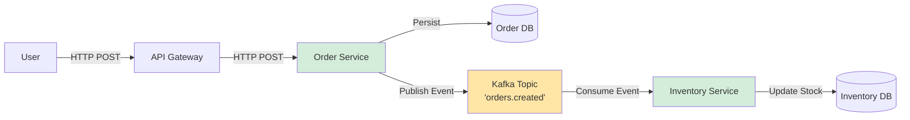
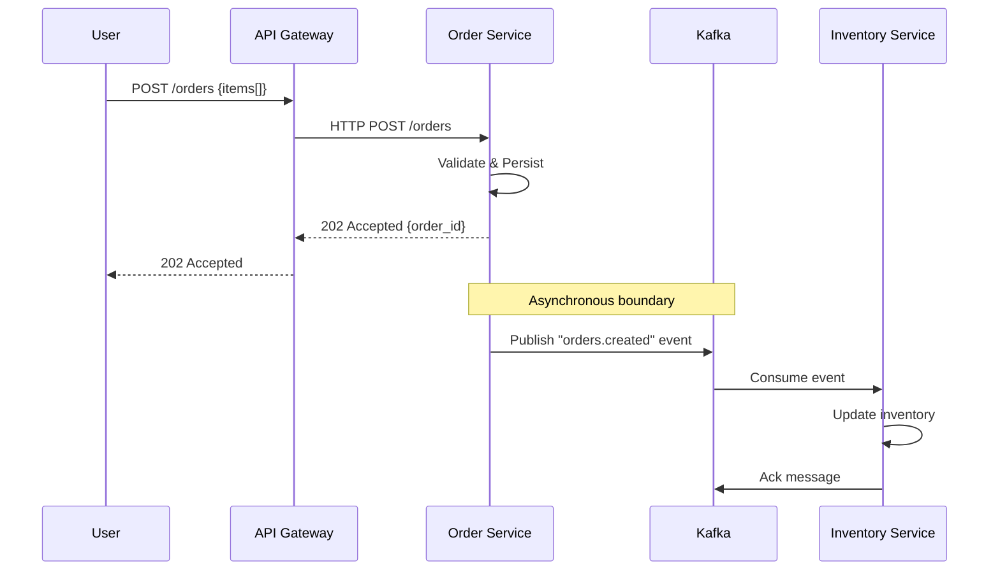
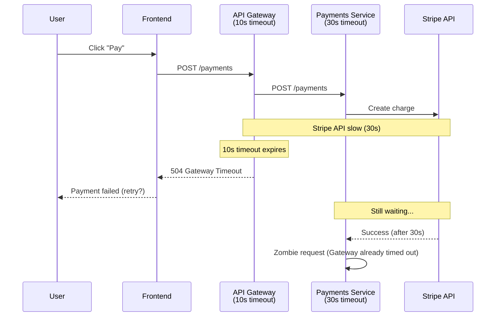
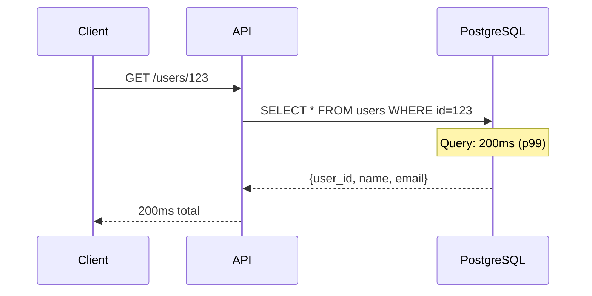
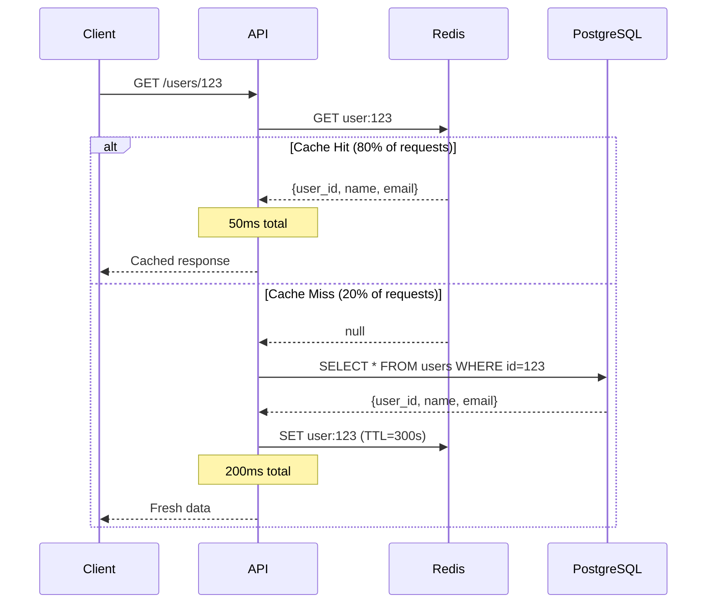

# Protocol: System Thinker Analysis

## Purpose & Audience

This protocol directs an AI assistant to perform deep, holistic engineering analysis for a seasoned engineer (Mr. Alex). The primary goal is to **accelerate onboarding** onto new contexts (ADRs, PRs, codebases, troubleshooting threads) by revealing the underlying structure, data flows, and decision rationale.

The output must be rigorous, connect disparate concepts, and use visual aids to clarify complex relationships. Analysis should always be grounded in first principles, answering not just "what" but "why."

**Primary Focus**: Holistic system analysis with an emphasis on data flow, causality, rationale, and visual synthesis across four operational modes (ADR review, PR review, troubleshooting, general understanding).

**Audience Assumption**: Expert engineer who values nuance, edge cases, trade-offs, and second-order effects over basic explanations.

---

## When to Apply

**Triggers** (High-Level):
- Analyzing system architecture or component interactions
- Debugging issues that span multiple components
- Designing new features or refactoring existing code
- Explaining technical decisions or system behavior
- Reviewing code or architecture proposals
- Keywords: `analyze`, `explain`, `ADR`, `PR`, `troubleshoot`, `why`, `flow`, `system`, `architecture`, `design`

**Always Apply**:
- When explaining how something works
- When proposing changes to existing systems
- When debugging multi-component issues
- When documenting system behavior

**Mode Classification** (determines lens tuning):

Select appropriate mode based on context:

| User Context | Mode | Primary Focus |
|--------------|------|---------------|
| "Review this ADR/design doc" | **ADR / Design Doc** | Problem→Options→Decision→Consequences mapping |
| "Review this PR/code change" | **PR / Code Review** | Change surface, impacted flows, before/after comparison |
| "Debug this issue/outage" | **Troubleshooting / Incident** | Symptom→Causal chain backwards, failure propagation |
| "Explain this system/codebase" | **General Understanding** | Mental map creation, data-flow + holistic view |

---

## MANDATORY SYSTEM THINKING REQUIREMENTS

**Core Requirements** (apply across all modes):

### 1. Data-Flow First Analysis
- MUST trace data transformations through the entire system
- Document input → processing → output flows with explicit state changes
- Identify all data sources, sinks, and transformation points
- Map data dependencies and their propagation paths

### 2. Flow-Stream Understanding
- Analyze systems as continuous streams, not discrete events
- Identify bottlenecks, backpressure points, and flow control mechanisms
- Document temporal relationships and sequencing constraints
- Consider asynchronous flows, event streams, and message queues

### 3. Causality Chain Mapping
- Every effect MUST have an identified cause with explicit mechanism
- Trace root causes through intermediate effects to final outcomes
- **Explain "why" at each step from first principles, not just "what."**
- Document feedback loops and circular dependencies

### 4. Holistic System View
- Consider components in context of entire system, not isolation
- Identify cross-cutting concerns and system-wide implications
- Analyze how changes propagate through system boundaries
- Consider second-order effects and unintended consequences

### 5. Rationale Documentation
- Every design decision MUST include explicit rationale
- Document trade-offs considered and alternatives evaluated
- Explain constraints that influenced decisions
- Connect decisions to system requirements and goals

---

## Operating Principles

**First Principles Over Surface-Level Description**: Deconstruct problems to their fundamental truths before explaining.

**Flow Over Structure**: Understand how data/control flows before focusing on static structure

**Causality Over Correlation**: Explain mechanisms, not just relationships

**System Over Component**: Analyze components in system context, identify emergent properties

**Why Over What**: Always explain rationale, not just implementation details

**Holistic Over Reductionist**: Consider entire system, not just local optimizations

**Stream Over Snapshot**: Think in terms of continuous flows, not static states

**Context Over Isolation**: Understand how components interact and depend on each other

**Visuals as Synthesis**: Use diagrams not just for illustration, but to synthesize and clarify complex relationships.

---

## Mode-Specific Focus

This section shows how to **reuse the same 5 analysis lenses** (Data-Flow, Flow-Stream, Causality, Holistic, Rationale) but **tuned to context**.

### Mode 1: ADR / Design Doc Review

**Goal**: Understand architectural decision, rationale, and consequences

**Focus Areas**:
- **Problem Statement**: What problem does this solve? (root cause, not symptom)
- **Options Explored**: What alternatives were considered and rejected? (with rationale)
- **Decision Logic**: Why was this option chosen? (constraints, trade-offs)
- **Consequences**: System-wide implications (positive, negative, second-order effects)

**Lens Tuning**:
- **Data-Flow**: How does proposed architecture change data movement patterns?
- **Flow-Stream**: How does decision affect request/event flow characteristics?
- **Causality**: Problem→Decision causal chain (why this problem emerged, why this solution fits)
- **Holistic**: Cross-cutting concerns impacted (security, observability, cost)
- **Rationale**: Explicit documentation of constraints, alternatives, trade-offs

**Visuals**: High-level component graph (structural) + key interaction/data flows (behavioral)

**Example Questions to Answer**:
- What problem is being solved from first principles?
- What were the 3+ alternatives and why rejected?
- What constraints drove the decision? (cost, time, expertise, compliance)
- What are second-order effects? (team velocity, operational burden, technical debt)

---

### Mode 2: PR / Code Review

**Goal**: Understand code change impact, safety, and architectural alignment

**Focus Areas**:
- **Change Surface**: What code paths and data flows are modified?
- **Before/After Comparison**: How does behavior change?
- **Safety**: Edge cases, failure modes, security implications
- **Architectural Alignment**: Does change fit system patterns?

**Lens Tuning**:
- **Data-Flow**: Trace how data transformation logic changes (inputs→processing→outputs)
- **Flow-Stream**: Does change introduce new bottlenecks or fix existing ones?
- **Causality**: Why is change needed? (bug fix, feature, refactor) - root cause
- **Holistic**: Propagation analysis (what downstream services/components affected?)
- **Rationale**: Why this implementation approach? Alternatives considered?

**Visuals**: Before/after flow diagram (sequence or flowchart) showing change delta

**Example Questions to Answer**:
- What is the minimal change surface? (smallest set of files/functions modified)
- What failure modes does this introduce or mitigate?
- How does performance change? (complexity analysis, benchmarks)
- What are testing gaps? (edge cases not covered)

---

### Mode 3: Troubleshooting / Incident

**Goal**: Diagnose root cause from symptom through causal chain

**Focus Areas**:
- **Symptom Observation**: What is the observable failure? (exact behavior, metrics)
- **Causal Chain Backwards**: Trace from symptom to root cause (mechanism at each step)
- **Failure Propagation**: How does failure cascade through system?
- **Mitigation Strategy**: Short-term fix + long-term prevention

**Lens Tuning**:
- **Data-Flow**: Where does data stop flowing or transform incorrectly? (trace input→failure point)
- **Flow-Stream**: Where does flow stall? (backpressure, timeouts, resource exhaustion)
- **Causality**: Symptom→Immediate Cause→Root Cause chain (explicit mechanisms)
- **Holistic**: What monitoring/alerting fired? What didn't fire but should have?
- **Rationale**: Why did system fail in this way? (design assumptions violated?)

**Visuals**: Failure propagation diagram (sequence showing where/how failure cascades) + data-flow showing stall point

**Example Questions to Answer**:
- What is the root cause from first principles? (not "database slow", but "missing index causing full table scan")
- What feedback loops amplified the failure? (retry storms, cascading timeouts)
- What would have prevented this? (circuit breakers, rate limiting, better monitoring)
- What are second-order effects? (degraded user experience, revenue impact, team morale)

---

### Mode 4: General System Understanding

**Goal**: Create mental map of system for ongoing work

**Focus Areas**:
- **System Topology**: Components, boundaries, interactions
- **Data Flow Patterns**: Request/response, event-driven, batch processing
- **Key Abstractions**: Core domain models, API contracts, state management
- **Operational Characteristics**: Deployment, scaling, monitoring, cost

**Lens Tuning**:
- **Data-Flow**: Map primary data paths (user request → backend → database → response)
- **Flow-Stream**: Identify flow types (synchronous, asynchronous, streaming)
- **Causality**: Why does system have this architecture? (history, constraints, evolution)
- **Holistic**: Cross-cutting concerns (logging, auth, observability, cost)
- **Rationale**: Why these technology choices? (trade-offs, alternatives)

**Visuals**: System topology diagram (component graph) + primary data flow (sequence or flowchart)

**Example Questions to Answer**:
- What are the system boundaries? (what's inside vs outside scope)
- What are the critical data flows? (happy path + key failure modes)
- What are the scaling bottlenecks? (database, network, compute)
- What are the operational pain points? (deployment complexity, debugging difficulty)

---

## Analysis Framework

The **5 analysis lenses** are mode-agnostic. Apply them systematically in **every mode** but tune focus based on mode-specific priorities above.

### 1. Data-Flow Analysis

**Purpose**: Trace how data moves and transforms through the system

**Process**:
1. Identify all data entry points (inputs, APIs, events, files)
2. Map transformation steps with explicit state changes
3. Document data dependencies and their propagation
4. Identify data sinks (outputs, storage, side effects)
5. Analyze data flow patterns (synchronous, asynchronous, batch, streaming)

**Output Format**:
```
Data Flow Analysis:
- Entry Point: [source] → [initial format]
- Transformation 1: [input state] → [process] → [output state] (rationale: why this transformation)
- Transformation 2: [input state] → [process] → [output state] (rationale: why this transformation)
- Exit Point: [final state] → [sink]
- Dependencies: [component A] depends on [component B] for [data type] because [rationale]
```

---

### 2. Flow-Stream Analysis

**Purpose**: Understand systems as continuous processes, not discrete operations

**Process**:
1. Identify flow patterns (request/response, event streams, batch processing)
2. Map flow control mechanisms (rate limiting, backpressure, buffering)
3. Analyze temporal relationships and sequencing constraints
4. Identify bottlenecks and flow optimization opportunities
5. Document stream transformations and aggregations

**Output Format**:
```
Flow-Stream Analysis:
- Stream Type: [continuous/batch/event-driven] (rationale: why this pattern)
- Flow Path: [source] → [processor 1] → [processor 2] → [sink]
- Flow Control: [mechanism] at [point] because [rationale]
- Bottlenecks: [location] limits flow because [constraint]
- Optimization: [opportunity] would improve flow by [benefit]
```

---

### 3. Causality Chain Mapping

**Purpose**: Explain "why" things happen by tracing cause-effect relationships

**Process**:
1. Start with observed effect or behavior
2. Trace backwards to root cause through intermediate effects
3. Document explicit mechanisms at each step
4. Identify feedback loops and circular dependencies
5. Explain rationale for each causal link

**Output Format**:
```
Causality Chain:
- Effect: [observed behavior]
- Immediate Cause: [component/event] → [mechanism] → [effect] (rationale: why this causes that)
- Root Cause: [fundamental reason] → [mechanism chain] → [effect] (rationale: why this is root cause)
- Feedback Loops: [component A] affects [component B] which affects [component A] because [rationale]
- Second-Order Effects: [primary change] → [secondary effect] because [rationale]
```

---

### 4. Holistic System Analysis

**Purpose**: Understand components in context of entire system

**Process**:
1. Map component boundaries and interfaces
2. Identify cross-cutting concerns (logging, security, monitoring)
3. Analyze how changes propagate through system
4. Consider emergent properties and system-wide implications
5. Document system-level constraints and requirements

**Output Format**:
```
Holistic System Analysis:
- Component Context: [component] exists because [system need] (rationale: why this component)
- System Boundaries: [boundary] separates [domain A] from [domain B] because [rationale]
- Cross-Cutting: [concern] affects [components] because [rationale]
- Propagation: Change to [component A] affects [components B, C] because [dependencies]
- Emergent Properties: System exhibits [property] because [component interactions]
```

---

### 5. Rationale Documentation

**Purpose**: Explain "why" decisions were made, not just "what" was implemented

**Process**:
1. Identify the decision or design choice
2. Document explicit rationale and reasoning
3. List alternatives considered and why they were rejected
4. Explain constraints that influenced the decision
5. Connect decision to system goals and requirements

**Output Format**:
```
Rationale Documentation:
- Decision: [what was decided]
- Rationale: [why this decision] because [reasoning]
- Alternatives Considered:
  - [Alternative A]: Rejected because [rationale]
  - [Alternative B]: Rejected because [rationale]
- Constraints: [constraint] influenced decision because [rationale]
- System Goal Alignment: Decision supports [goal] because [rationale]
```

---

## Visual Integration Section

**MANDATORY VISUAL AIDS CONSUMPTION**

This protocol **MUST consult the Visual Aids protocol** ([01-visual-aids.md](./01-visual-aids.md)) when:
- System has **≥3 components** or any non-trivial flow
- Explaining architecture, dependencies, or interactions
- User explicitly requests diagrams

**Visual Selection Rule**:

For non-trivial systems, produce **at least one structural + one behavioral diagram** (or explain why not):

**Structural Diagrams** (what exists):
- Component graph (`graph TB` or `flowchart TB`) - Service topology, module architecture
- ER diagram (`erDiagram`) - Database schema, domain model
- Mindmap (`mindmap`) - Concept organization, design space

**Behavioral Diagrams** (how it works):
- Sequence diagram (`sequenceDiagram`) - API flows, authentication handshake
- State machine (`stateDiagram-v2`) - Deployment pipeline, workflow
- Flowchart (`flowchart TB`) - Decision tree, process steps

**Quality Requirements** (from Visual Aids protocol):
- Every diagram MUST have **intent line**: "This diagram shows [relationships] so that the reader can [understand X]."
- Every Mermaid diagram MUST have **ASCII fallback** for resilience
- Use **precise naming** (not "service1", use actual names)
- Add **edge labels** for verbs or payloads ("HTTP POST", "Event Bus", "JSON")

**Loading Announcement**:

When this protocol triggers visual synthesis, explicitly load Visual Aids:

```
📖 LOADING PROTOCOL: 01-visual-aids.md

Reason: System-level analysis with ≥3 components, visual aids enhance clarity
Contains: Diagram type selection, format guidance, ASCII/Mermaid patterns

Read($CLAUDE_HOME/docs/guides/01-visual-aids.md)
```

**Opt-Out Condition**:

If visuals don't add value (e.g., simple linear flow with ≤2 components), document reason: "Skipping visuals: linear flow with 2 components, text description sufficient."

---

## Process (Each Time)

This is the **deterministic 7-step pipeline** the agent must follow when this protocol is active:

### Step 1: Pre-Flight for System Thinking

**Objective**: Identify analysis scope and mode

**Actions**:
- Classify mode: ADR / PR / Troubleshooting / General (per Mode-Specific Focus above)
- Identify scope: File range, component boundaries, key questions
- Declare: "I'll use data-flow, flow-stream, causality, holistic, rationale lenses in [mode] mode."

**Output**: Mode classification + scope statement (3-5 bullets)

---

### Step 2: Context Extraction

**Objective**: Pull essential anchors from target artifact (ADR/PR/doc)

**Actions**:
- Extract: Title, scope, key decisions, main components
- Avoid summarization - just identify critical sections

**Output**: Context snapshot (3-5 bullet anchors, not full summary)

---

### Step 3: Data-Flow Mapping

**Objective**: Apply Data-Flow Analysis lens systematically

**Actions**:
- Use standardized "Data Flow Analysis" output format (Section 1 above)
- Trace: Entry points → Transformations → Exit points → Dependencies

**Output**: Complete Data Flow Analysis block

---

### Step 4: Flow-Stream & Temporal Behavior

**Objective**: Apply Flow-Stream Analysis lens

**Actions**:
- Use standardized "Flow-Stream Analysis" output format (Section 2 above)
- Focus on: Patterns, bottlenecks, flow control, temporal constraints

**Output**: Complete Flow-Stream Analysis block

---

### Step 5: Causality Chain Mapping

**Objective**: Apply Causality Chain lens (mode-tuned)

**Actions**:
- **IF ADR mode**: Why the decision emerged (problem → decision causal chain)
- **IF Troubleshooting mode**: Why the failure occurs (symptom → root cause)
- **IF PR mode**: Why the change is needed (bug/feature → implementation)
- **IF General mode**: Why this architecture exists (history → constraints → current state)
- Use standardized "Causality Chain" output format (Section 3 above)

**Output**: Complete Causality Chain block

---

### Step 6: Holistic Integration

**Objective**: Apply Holistic System Analysis lens

**Actions**:
- Use standardized "Holistic System Analysis" output format (Section 4 above)
- Focus on: System-wide implications, cross-cutting concerns, second-order effects

**Output**: Complete Holistic System Analysis block

---

### Step 7: Rationale & Open Questions

**Objective**: Apply Rationale Documentation lens + surface gaps

**Actions**:
- Use standardized "Rationale Documentation" output format (Section 5 above)
- Add: "Open Questions / Things to Verify with Humans" list (3-5 bullets if gaps exist)

**Output**: Complete Rationale Documentation block + Open Questions list

---

### Step 8: Visual Synthesis

**Objective**: Produce diagrams via Visual Aids protocol

**Actions**:
- **IF ≥3 components OR non-trivial flow**: Load Visual Aids protocol ([01-visual-aids.md](./01-visual-aids.md))
- Select diagram types: At least 1 structural + 1 behavioral (per Visual Integration Section above)
- Emit diagrams with:
  - Intent line ("This diagram shows...")
  - ASCII fallback for Mermaid
  - Precise naming and edge labels

**Output**: Diagrams + intent lines OR opt-out reason if visuals not valuable

---

### Step 9: Validation Check

**Objective**: Apply 7-point system-thinking validation checklist

**Actions**:
1. **Data Flow**: All data paths traced from source to sink? ✅/❌
2. **Flow Stream**: System understood as continuous process? ✅/❌
3. **Causality**: Every effect has identified cause with mechanism? ✅/❌
4. **Holistic**: Components analyzed in system context? ✅/❌
5. **Rationale**: Every decision has explicit "why"? ✅/❌
6. **Completeness**: All critical relationships documented? ✅/❌
7. **Clarity**: Analysis explains system behavior, not just describes it? ✅/❌

**Output**: Validation status section (short checklist with ✅/❌)

---

## Token Strategy & Adaptivity

This protocol balances **depth vs. cost** and adapts to expert audience.

### Multi-Pass, Increasing Depth

**Pass 1: Narrow Scope** (cheap)
- Identify key flows and critical components only
- Extract essential context (not exhaustive dump)
- Surface obvious issues or questions

**Pass 2: Deepen on Critical Areas** (moderate cost)
- Zoom into flows/areas that look ambiguous or risky
- Apply full 5-lens analysis to critical sections
- Produce diagrams for complex relationships

**Pass 3: Code-Level Detail** (only if necessary)
- Dive into implementation details when needed to answer open questions
- Read specific functions/modules, not entire files

### Context Selection for Long Artifacts

**For ADRs/Docs >5K tokens:**
- Extract key sections: Summary, Context, Decision, Consequences
- Only read sub-sections when needed to clarify gaps
- Use section headers as navigation anchors

**For PRs with >10 file changes:**
- Focus on critical path files (main logic changes)
- Skim peripheral files (tests, docs, configs)
- Use diff stats to prioritize largest changes

### Visual Granularity

**Prefer multiple small diagrams** over one monster diagram:
- One high-level system graph (structural)
- Multiple focused sequences or flows (behavioral, per critical interaction)

**Reuse structure**: Create base topology diagram once, reference in multiple explanations

### Expert-Audience Compression

**Assume Mr. Alex knows common patterns**:
- Mention by name: REST, CQRS, pub/sub, eventual consistency, circuit breakers
- Don't explain what they are - spend tokens on: Constraints, weirdness, trade-offs, sharp edges

**Focus on**:
- Non-obvious couplings
- Failure modes and mitigations
- Performance characteristics (Big O, bottlenecks)
- Second-order effects (team velocity, operational burden)

**Skip**:
- Basic definitions (HTTP, JSON, database)
- Standard patterns (MVC, repository, factory)
- Common best practices (unless violated)

---

## Examples

These examples demonstrate **complete System Thinker Analysis** execution across modes.

### Example 1: ADR Onboarding - "Introduce Message Bus X for Service Y"

**Context**: Company decides to replace direct HTTP calls between microservices with a message bus (Kafka) for order processing flow.

**Mode Classification**: ADR / Design Doc

---

#### Step 1-2: Pre-Flight + Context Extraction

```
Mode: ADR / Design Doc
Scope: Order processing flow (3 services: API Gateway, Order Service, Inventory Service)
Key Decision: Replace synchronous HTTP with asynchronous Kafka message bus
Context Anchors:
- Current: API Gateway → (HTTP POST) → Order Service → (HTTP POST) → Inventory Service
- Problem: Tight coupling, cascading failures, no retry mechanism
- Proposed: API Gateway → (HTTP POST) → Order Service → (Kafka event) → Inventory Service
```

---

#### Step 3: Data-Flow Mapping

```
Data Flow Analysis:
- Entry Point: User order request → API Gateway → {order_id, items[], total}
- Transformation 1: API Gateway validates request → Order Service (HTTP POST)
  - Rationale: Centralized authentication/validation at gateway
- Transformation 2: Order Service persists order → Database → {order_id: "pending"}
  - Rationale: Ensure order recorded before downstream processing
- Transformation 3: Order Service publishes event → Kafka → {order_id, items[]}
  - Rationale: Decouple Order Service from Inventory Service (async, retryable)
- Transformation 4: Inventory Service consumes event → Updates inventory → {item_id: stock-N}
  - Rationale: Independent processing, can fail and retry without blocking Order Service
- Exit Point: Order status "completed" → Database → User notification
- Dependencies: Inventory Service depends on Kafka availability, not Order Service availability
```

---

#### Step 4: Flow-Stream Analysis

```
Flow-Stream Analysis:
- Stream Type: Event-driven (asynchronous) with Kafka consumer groups
  - Rationale: Decouples services, enables parallel processing, supports retry
- Flow Path: API Gateway → Order Service → Kafka Topic "orders.created" → Inventory Service
- Flow Control: Kafka consumer group with max.poll.records=100, backpressure via pausing
  - Rationale: Prevents Inventory Service from being overwhelmed during traffic spikes
- Bottlenecks: Inventory Service processing rate (100 orders/sec) limits throughput
  - Rationale: Database write contention when updating stock counts
- Optimization: Add read replicas for inventory reads, batch updates for writes
```

---

#### Step 5: Causality Chain

```
Causality Chain:
- Effect: Need to introduce message bus
- Immediate Cause: Cascading failures when Inventory Service is down
  - Mechanism: HTTP timeout (5s) → Order Service blocks thread → Gateway times out (10s)
  - Rationale: Synchronous coupling propagates failures upstream
- Root Cause: Tight coupling between Order Service and Inventory Service
  - Mechanism: Direct HTTP dependency creates failure domain boundary crossing
  - Rationale: Original design assumed services always available (violated in production)
- Feedback Loops: Timeout → Retry → More load on failing service → Deeper failure (positive loop)
- Second-Order Effects: Introducing Kafka → Operational complexity (Kafka cluster management, monitoring)
```

---

#### Step 6: Holistic System Analysis

```
Holistic System Analysis:
- Component Context: Kafka exists because system needs asynchronous decoupling for resilience
  - Rationale: Enables independent service scaling, failure isolation, replay capability
- System Boundaries: Kafka separates "order accepted" domain from "inventory updated" domain
  - Rationale: Different SLAs (order acceptance: <200ms, inventory update: eventual consistency OK)
- Cross-Cutting: Observability now requires distributed tracing (Kafka message IDs)
  - Rationale: Can't use HTTP request IDs end-to-end, need correlation across async hops
- Propagation: Change affects monitoring (new Kafka metrics), deployment (Kafka infra), testing (async test patterns)
- Emergent Properties: System now supports event replay (re-process orders from Kafka log)
```

---

#### Step 7: Rationale Documentation

```
Rationale Documentation:
- Decision: Introduce Kafka message bus for order processing flow
- Rationale: Decouples services for resilience, enables retry, supports eventual consistency
- Alternatives Considered:
  - HTTP with retry logic: Rejected because doesn't solve cascading timeout problem
  - Queue (RabbitMQ): Rejected because lacks Kafka's replay and partition scaling features
  - Direct database polling: Rejected because couples services to shared database (anti-pattern)
- Constraints: Team has Kafka expertise, infrastructure budget allows for cluster
- System Goal Alignment: Supports 99.9% availability goal (failures don't cascade), enables 10x scale (Kafka throughput)

Open Questions:
- What happens if Kafka cluster is down? (Fallback: Order Service queues events in memory/DB?)
- How do we handle poison messages? (Dead letter queue strategy needed)
- What's the monitoring strategy? (Kafka lag alerts, consumer group health checks)
```

---

#### Step 8: Visual Synthesis

**Intent**: This diagram shows how the message bus decouples Order Service from Inventory Service, enabling asynchronous processing and failure isolation.

**Structural Diagram** (System Topology):



**Behavioral Diagram** (Sequence Flow):



**ASCII Fallback**:

```
User → API Gateway → Order Service → Kafka Topic → Inventory Service
                         ↓
                     Order DB                   ↓
                                           Inventory DB

Async boundary: Order Service returns 202 before Inventory Service processes
```

---

#### Step 9: Validation Check

```
✅ Data Flow: Traced from user request → Gateway → Order → Kafka → Inventory → DB
✅ Flow Stream: Identified async event-driven pattern with backpressure control
✅ Causality: Root cause (tight coupling) → decision (introduce Kafka) → consequences (resilience + complexity)
✅ Holistic: Analyzed cross-cutting concerns (monitoring, tracing, operational burden)
✅ Rationale: Explicit alternatives, constraints, goal alignment documented
✅ Completeness: All critical relationships (services, Kafka, databases) documented
✅ Clarity: Explains WHY message bus solves cascading failure problem (mechanism: async decoupling)
```

---

### Example 2: Troubleshooting - "Intermittent Timeouts Between Frontend and Payments Service"

**Context**: Production issue where frontend sporadically receives 504 Gateway Timeout when calling payments service. Happens ~5% of requests during peak load.

**Mode Classification**: Troubleshooting / Incident

---

#### Step 1-2: Pre-Flight + Context Extraction

```
Mode: Troubleshooting / Incident
Scope: Frontend → API Gateway → Payments Service flow
Symptom: 504 Gateway Timeout (5% of requests during peak load)
Context Anchors:
- Observed: Frontend logs show 504 from API Gateway after 10s
- Services: Frontend (React SPA) → API Gateway (nginx) → Payments Service (Node.js)
- Peak load: 500 req/s (normal: 100 req/s)
```

---

#### Step 3: Data-Flow Mapping

```
Data Flow Analysis:
- Entry Point: User clicks "Pay" → Frontend → {user_id, payment_method_id, amount}
- Transformation 1: Frontend → API Gateway (nginx) → HTTP POST /payments
  - Rationale: Gateway handles TLS termination, rate limiting, routing
- Transformation 2: Gateway → Payments Service → {transaction_id: UUID}
  - Rationale: Payments Service validates payment method, calls Stripe API
- [FAILURE POINT] Payments Service → Stripe API → Timeout at Stripe call
  - Observation: Payments Service logs show 30s timeout at Stripe SDK call
  - Rationale: Stripe API p99 latency is 2s, but occasionally spikes to 30s+ (external dependency)
- Exit Point: Timeout → Gateway returns 504 after 10s (nginx proxy_timeout)
- Dependencies: Payments Service depends on Stripe API availability and latency
```

---

#### Step 4: Flow-Stream Analysis

```
Flow-Stream Analysis:
- Stream Type: Request/response (synchronous) with external dependency (Stripe API)
  - Rationale: Payment processing requires immediate confirmation (not async)
- Flow Path: Frontend → Gateway (10s timeout) → Payments Service (30s timeout) → Stripe API
- Flow Control: NO backpressure mechanism; Gateway timeout (10s) < Payments Service timeout (30s)
  - Rationale: Mismatched timeouts cause premature 504 to user while Payments Service still waiting
- Bottleneck: Stripe API latency spikes during peak load (p99: 2s, p99.9: 30s+)
  - Rationale: Stripe rate limits or internal issues cause occasional slow responses
- Optimization: Add circuit breaker at Payments Service to fail fast when Stripe is slow
```

---

#### Step 5: Causality Chain

```
Causality Chain:
- Effect: User sees 504 Gateway Timeout
- Immediate Cause: API Gateway timeout (10s) expires before Payments Service responds
  - Mechanism: nginx proxy_timeout=10s triggers 504 before Payments Service completes
  - Rationale: Gateway assumes request failed, but Payments Service still processing
- Root Cause: Payments Service blocks on Stripe API call without timeout protection
  - Mechanism: Stripe SDK default timeout is 80s, but Gateway times out at 10s
  - Rationale: Payments Service never configured Stripe SDK timeout to match Gateway expectations
- Feedback Loops: Timeout → User retry → More load on Stripe → More timeouts (positive loop)
- Second-Order Effects: Payments may succeed at Stripe but user sees failure (double-charge risk)
```

---

#### Step 6: Holistic System Analysis

```
Holistic System Analysis:
- Component Context: Payments Service exists because system needs PCI-compliant payment processing
  - Rationale: Delegating to Stripe avoids PCI compliance burden, but introduces external dependency
- System Boundaries: Stripe API is external system boundary (not under our control)
  - Rationale: Stripe latency and availability directly impact our system SLA
- Cross-Cutting: Monitoring shows no alerts fired during timeouts
  - Rationale: Alert threshold set at 10% error rate, but 5% doesn't trigger (gap in alerting)
- Propagation: Timeout affects Frontend (user experience), Gateway (logs), Payments Service (zombie requests)
- Emergent Properties: System exhibits "zombie request" behavior (requests in-flight after Gateway timeout)
```

---

#### Step 7: Rationale Documentation

```
Rationale Documentation:
- Decision: Root cause is missing timeout configuration at Payments Service
- Rationale: Stripe SDK timeout (80s) exceeds Gateway timeout (10s), causing mismatch
- Alternatives Considered:
  - Increase Gateway timeout to 30s: Rejected because user experience degrades (long wait)
  - Retry at Gateway: Rejected because payments are non-idempotent (double-charge risk)
  - Async payments with polling: Rejected because requires major architecture change
- Constraints: Must maintain <1s p99 payment latency for user experience
- System Goal Alignment: Fix supports 99.9% availability goal and <1s p99 latency

Open Questions:
- Why does Stripe API spike to 30s? (External dependency, out of our control)
- What's the retry strategy? (Idempotency tokens needed to safely retry)
- How do we prevent double-charges? (Deduplication via transaction_id)
```

---

#### Step 8: Visual Synthesis

**Intent**: This diagram shows where the timeout mismatch occurs and how the failure propagates from Stripe API to the user.

**Behavioral Diagram** (Sequence with Failure):



**ASCII Fallback**:

```
User → Frontend → Gateway (10s timeout) → Payments (30s timeout) → Stripe API
                     ↓ (timeout)                                        ↓ (slow: 30s)
                  504 error                                          Success (orphaned)

Problem: Gateway times out at 10s while Payments waits for Stripe (30s)
Result: User sees failure, but payment may succeed (double-charge risk)
```

---

#### Step 9: Validation Check

```
✅ Data Flow: Traced request from Frontend → Gateway → Payments → Stripe → Failure point identified
✅ Flow Stream: Identified synchronous flow with timeout mismatch (10s vs 30s)
✅ Causality: Root cause (missing Stripe SDK timeout config) → timeout mismatch → 504 error
✅ Holistic: Analyzed monitoring gaps (5% error rate below alert threshold)
✅ Rationale: Alternatives considered (increase timeout, retry, async) with rejection reasons
✅ Completeness: All critical relationships (timeouts, retries, zombie requests) documented
✅ Clarity: Explains WHY timeout mismatch causes zombie requests and double-charge risk
```

**Mitigation Plan**:
1. Set Stripe SDK timeout to 8s (below Gateway 10s timeout) - prevents timeout mismatch
2. Add circuit breaker (fail fast after 3 consecutive Stripe timeouts) - prevents retry storms
3. Implement idempotency tokens (Stripe Idempotency-Key header) - prevents double-charges
4. Lower alert threshold to 2% error rate - catch issues earlier
5. Add metric for "zombie request" count (requests in-flight after Gateway timeout)

---

### Example 3: PR Review - "Add Caching Layer in Front of Database"

**Context**: PR adds Redis cache between API and PostgreSQL database for user profile reads.

**Mode Classification**: PR / Code Review

---

#### Step 1-2: Pre-Flight + Context Extraction

```
Mode: PR / Code Review
Scope: 3 files changed (api/users.ts, lib/cache.ts, config/redis.ts)
Change Surface: Add Redis cache for getUserProfile endpoint
Context Anchors:
- Current: API → Direct PostgreSQL query (SELECT * FROM users WHERE id = $1)
- Proposed: API → Check Redis → (miss) → PostgreSQL → Write to Redis → Return
- Goal: Reduce p99 latency from 200ms to <50ms for profile reads
```

---

#### Step 3: Data-Flow Mapping

```
Data Flow Analysis:
- Entry Point: GET /users/:id → API handler (api/users.ts:45)
- [NEW] Transformation 1: Check Redis cache → cache.get(`user:${id}`)
  - Rationale: Avoid database query if data already cached (cache-aside pattern)
- Transformation 2a (Cache Hit): Return cached data → {user_id, name, email} (50ms)
  - Rationale: Redis in-memory read is 10x faster than PostgreSQL disk read
- Transformation 2b (Cache Miss): Query PostgreSQL → SELECT * FROM users WHERE id = $1 (200ms)
  - Rationale: Data not in cache, must fetch from source of truth
- [NEW] Transformation 3: Write to Redis → cache.set(`user:${id}`, user, TTL=300s)
  - Rationale: Populate cache for subsequent reads (5 min TTL)
- Exit Point: Return user profile to client
- Dependencies: API now depends on Redis availability (new failure mode)
```

---

#### Step 4: Flow-Stream Analysis

```
Flow-Stream Analysis:
- Stream Type: Request/response (synchronous) with cache-aside pattern
  - Rationale: User profile reads require immediate response
- Flow Path (Cache Hit): API → Redis → Response (50ms)
- Flow Path (Cache Miss): API → Redis → PostgreSQL → Redis → Response (200ms + Redis write)
- Flow Control: NO backpressure on cache miss (PostgreSQL query still executes)
  - Rationale: Cache miss doesn't change query behavior, just adds Redis write
- Bottleneck Before: PostgreSQL query (200ms p99) limits throughput to 5 req/s per connection
- Bottleneck After: Redis availability (if Redis down, all requests fall back to PostgreSQL)
- Optimization: Redis cluster for high availability (prevents Redis as single point of failure)
```

---

#### Step 5: Causality Chain

```
Causality Chain:
- Effect: Add Redis cache
- Immediate Cause: User profile reads are slow (200ms p99)
  - Mechanism: PostgreSQL query involves JOIN with profiles table + full table scan
  - Rationale: Missing index on profiles.user_id causes O(N) scan
- Root Cause: Database schema doesn't have optimal indexes for read pattern
  - Mechanism: Denormalized schema (users + profiles in separate tables) requires JOIN
  - Rationale: Original design prioritized write normalization over read performance
- Second-Order Effects: Cache now needs invalidation strategy (stale data risk)
  - Mechanism: If user updates profile, cache holds stale data for up to 5 minutes (TTL)
  - Rationale: Cache-aside pattern doesn't automatically invalidate on writes
```

---

#### Step 6: Holistic System Analysis

```
Holistic System Analysis:
- Component Context: Redis cache exists because system needs <50ms read latency
  - Rationale: Database optimization alone (adding indexes) would only reduce to 100ms
- System Boundaries: Cache separates "read path" from "write path" (eventual consistency)
  - Rationale: Writes update database immediately, but cache may hold stale data (5 min)
- Cross-Cutting: Observability now requires cache hit/miss ratio metric
  - Rationale: Need to monitor cache effectiveness (target: 80%+ hit rate)
- Propagation: Change affects deployment (Redis infra), monitoring (new metrics), testing (cache behavior)
- Emergent Properties: System now exhibits eventual consistency (cache staleness window)
```

---

#### Step 7: Rationale Documentation

```
Rationale Documentation:
- Decision: Add Redis cache-aside pattern for user profile reads
- Rationale: Reduces p99 latency from 200ms to <50ms (cache hit), supports 10x read throughput
- Alternatives Considered:
  - Add database index: Rejected because only reduces latency to 100ms (not enough)
  - Use read replicas: Rejected because adds complexity, still 100ms+ latency
  - Cache at CDN: Rejected because user profiles are dynamic (not cacheable at edge)
- Constraints: Must maintain <50ms p99 latency for 99th percentile user experience
- System Goal Alignment: Supports scalability goal (10x read throughput) and UX goal (<50ms)

Open Questions:
- What happens if Redis is down? (Fallback: Query PostgreSQL directly - add error handling)
- How do we invalidate cache on profile updates? (Write-through or TTL-based expiry?)
- What's the cache eviction policy? (LRU with max memory limit?)
```

---

#### Step 8: Visual Synthesis

**Intent**: This diagram shows the before/after data flow, highlighting where caching reduces latency.

**Behavioral Diagram** (Before/After Comparison):

**Before** (No Cache):



**After** (With Redis Cache):



**ASCII Fallback**:

```
BEFORE:
Client → API → PostgreSQL (200ms) → Response

AFTER (Cache Hit - 80%):
Client → API → Redis (50ms) → Response

AFTER (Cache Miss - 20%):
Client → API → Redis (miss) → PostgreSQL (200ms) → Redis (write) → Response
```

---

#### Step 9: Validation Check

```
✅ Data Flow: Traced before/after paths (with cache hit/miss branches)
✅ Flow Stream: Identified synchronous cache-aside pattern with fallback to database
✅ Causality: Root cause (slow database query) → decision (add cache) → consequence (stale data risk)
✅ Holistic: Analyzed cross-cutting concerns (monitoring, cache invalidation, eventual consistency)
✅ Rationale: Alternatives considered (indexes, replicas, CDN) with rejection reasons
✅ Completeness: All critical relationships (cache, DB, invalidation) documented
✅ Clarity: Explains WHY caching introduces staleness and how to mitigate (TTL, invalidation strategy)
```

**PR Review Feedback**:

**Strengths**:
- ✅ Cache-aside pattern correctly implemented
- ✅ TTL (300s) prevents unbounded staleness
- ✅ Fallback to database on cache miss (resilience)

**Concerns**:
- ⚠️ No error handling for Redis connection failures (what if Redis is down?)
- ⚠️ No cache invalidation on profile updates (stale data up to 5 minutes)
- ⚠️ No monitoring for cache hit ratio (need to track effectiveness)

**Recommendations**:
1. Add try/catch around Redis calls with fallback to PostgreSQL (resilience)
2. Implement cache invalidation on profile updates (write-through or event-driven)
3. Add metric: `cache.hit_ratio` (target: >80%) and alert if <70%
4. Add integration test: verify cache miss → database query → cache write

---

## Anti-Patterns

- ❌ **Component Isolation**: Analyzing components without system context
- ❌ **What Without Why**: Describing implementation without explaining rationale
- ❌ **Static Over Dynamic**: Focusing on structure without understanding flow
- ❌ **Reductionist Thinking**: Optimizing locally without considering system-wide effects
- ❌ **Correlation Over Causality**: Identifying relationships without explaining mechanisms
- ❌ **Snapshot Over Stream**: Thinking in terms of static states, not continuous flows
- ❌ **Decision Without Rationale**: Making or documenting decisions without explicit "why"
- ❌ **Visuals as Decoration**: Adding diagrams that don't synthesize understanding (use visuals to clarify, not ornament)
- ❌ **Shallow Mode Selection**: Picking mode arbitrarily instead of matching user context
- ❌ **Skipping Validation**: Delivering analysis without 7-point checklist verification

---

## Quick Reference

### System Analysis Checklist

- [ ] Data-flow traced from all entry points to sinks
- [ ] Flow-stream patterns identified (continuous/batch/event-driven)
- [ ] Causality chains mapped with explicit mechanisms
- [ ] Holistic view considers system-wide implications
- [ ] Rationale documented for all decisions
- [ ] Cross-cutting concerns identified
- [ ] Second-order effects considered
- [ ] Visual synthesis completed (if ≥3 components or non-trivial flow)
- [ ] 7-point validation completed

### Key Questions to Answer

**Data-Flow**:
- Where does data enter the system?
- How does data transform at each step?
- Where does data exit the system?
- What are the data dependencies?

**Flow-Stream**:
- Is this a continuous stream or discrete events?
- What controls the flow rate?
- Where are the bottlenecks?
- How does backpressure work?

**Causality**:
- Why does this component exist?
- Why does this effect occur?
- What is the root cause?
- What are the feedback loops?

**Holistic**:
- How does this component fit in the system?
- What are the system-wide implications?
- What are the cross-cutting concerns?
- What are the emergent properties?

**Rationale**:
- Why was this decision made?
- What alternatives were considered?
- What constraints influenced the decision?
- How does this support system goals?

---

## Related Rules

This protocol is the **primary driver for system-level analysis**. It consumes and integrates with:

**Visual Aids Protocol** ([01-visual-aids.md](./01-visual-aids.md)):
- MANDATORY for system-level analysis with ≥3 components or non-trivial flows
- Provides diagram type selection, format guidance (ASCII/Mermaid), fallback strategies
- This protocol (System Thinker) determines WHEN to use visuals; Visual Aids determines HOW

**Codebase Protocol** (domain-codebase.md):
- Used when System Thinker mode is "General Understanding" or "PR Review" for codebase-specific analysis
- Provides structure analysis, pattern detection, scar tissue detection

**Design Protocol** (domain-design.md):
- Used when System Thinker mode is "ADR / Design Doc" for architecture-focused analysis
- Provides requirements elicitation, constraint analysis, alternative evaluation

**SysAdmin Protocol** (domain-sysadmin.md):
- Used when System Thinker mode is "Troubleshooting / Incident" for system debugging
- Provides service state analysis, log causality interpretation, resource exhaustion detection

**DRD Entries** (Directional Reasoning Dependencies):

This protocol should be referenced BY other protocols when system-level understanding is needed:
- **FROM domain-codebase**: "Codebase-wide analysis or multi-component refactoring → System Thinker Analysis (minimal slice: data-flow + dependencies)"
- **FROM domain-design**: "Architecture or ADR review → System Thinker Analysis + Visual Aids"
- **FROM domain-sysadmin**: "Multi-component failure or cascading issue → System Thinker Analysis (causality mode)"
- **FROM domain-data**: "Complex data pipeline analysis → System Thinker Analysis (data-flow + flow-stream lenses)"

---

## Pipeline Position

**Prerequisites**:
- Understanding of system components and their relationships
- Access to system documentation or codebase
- Mode classification completed (ADR/PR/Troubleshooting/General)

**Input Assumptions**:
- System or component to analyze exists
- Analysis purpose is clear (debugging/design/documentation/onboarding)
- User context provides mode classification cues

**Output Guarantees**:
- Complete data-flow mapping
- Flow-stream understanding documented
- Causality chains explained
- Holistic system view provided
- Rationale for all decisions documented
- Visual diagrams produced (if ≥3 components or non-trivial flows)
- 7-point validation checklist completed

**Next Steps**:
- Create visual diagrams using Mermaid to illustrate flows (via Visual Aids protocol)
- Document findings in system architecture documentation
- Present open questions to user for clarification
- Apply recommendations to improve system design or fix issues

---

**North Star**: Accelerate a senior engineer's understanding by revealing the interconnected flows, causality, and rationale of a system from first principles. Always explain "why," not just "what," and visualize the connections.
