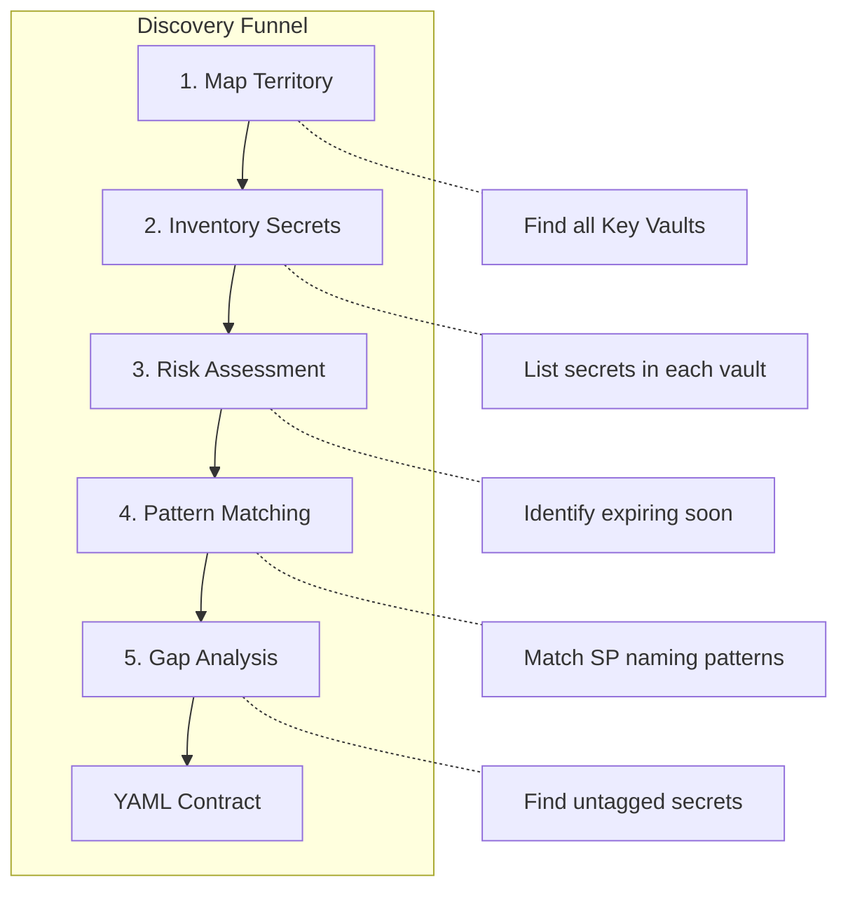
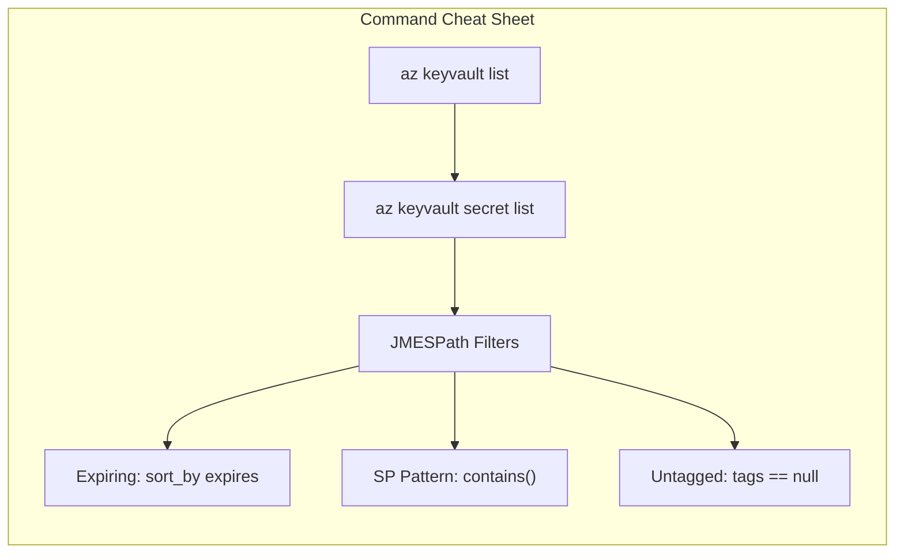

## Purpose

Audit Azure Key Vaults using `az` CLI, identify rotation candidates, and populate the `secrets-to-rotate.yml` contract.

## Prerequisites

- Authenticated session (`az login`)
- Permissions: `Key Vault Reader` or `Key Vault Secrets User`

---

## 1. Discovery Strategy: Inventory, Classify, Prioritize

We use a funnel approach to fill the YAML contract:



| Phase | Goal |
|-------|------|
| Map Territory | Find all Key Vaults |
| Inventory | List secrets in each vault |
| Risk Assessment | Identify secrets expiring soon |
| Pattern Matching | Find Service Principal candidates |
| Gap Analysis | Identify untagged/unowned secrets |

---

## 2. Discovery Commands

### 2.1 Phase 0: Map the Territory (List Key Vaults)

**Goal**: Identify all Key Vaults in your current subscription. You cannot audit what you cannot find.

Use the `Name` from this output for `<kv-name>` in subsequent steps.

```bash
# List all Key Vaults with Resource Group and Location
az keyvault list \
  --query "[].{Name:name, ResourceGroup:resourceGroup, Location:location, Tags:tags}" \
  -o table
```

---

### 2.2 Bird's Eye View Inventory

**Goal**: Get a raw list of all secrets in a specific vault, their expiry status, and current tags.

```bash
# Replace <kv-name> with a name found in Phase 0
az keyvault secret list --vault-name <kv-name> \
  --query "[].{Name:name, Enabled:attributes.enabled, Expires:attributes.expires, Owner:tags.owner, Type:tags.type}" \
  -o table
```

---

### 2.3 The Danger Zone (Expiring Soon)

**Goal**: Identify secrets that must be added to the YAML immediately to prevent outages.

Sorted by nearest expiry date (top rows = highest priority).

```bash
az keyvault secret list --vault-name <kv-name> \
  --query "[?attributes.expires != null] | sort_by(@, &attributes.expires) | [].{Name:name, Expires:attributes.expires, DaysRemaining: 'Check Manually'}" \
  -o table
```

> **Note**: JMESPath in CLI cannot perform date math (`Today - Expiry`). You get sorted dates; top rows are highest priority.

---

### 2.4 Finding Service Principal Candidates

**Goal**: Find secrets following common naming conventions for automated credentials.

These are prime candidates for `type: servicePrincipal` in the YAML.

```bash
az keyvault secret list --vault-name <kv-name> \
  --query "[?contains(name, 'client-secret') || contains(name, 'sp-') || contains(name, 'app-id')].{Name:name, Tags:tags}" \
  -o table
```

---

### 2.5 The Unknowns (Untagged Secrets)

**Goal**: Find secrets lacking metadata (tags). These represent technical debt requiring investigation.

```bash
# Find secrets with NO tags at all
az keyvault secret list --vault-name <kv-name> \
  --query "[?tags == null].{Name:name, Enabled:attributes.enabled}" \
  -o table
```

---

## 3. Rotation Readiness Dashboard

This advanced command generates a consolidated view to help classify secrets in the YAML (Manual vs. Automated).

**Logic**:

- Shows the `Name`
- Extracts `ContentType` (often contains hints like "password" or "connection-string")
- Checks if `Managed` (has a `managed-by` tag)

```bash
az keyvault secret list --vault-name <kv-name> \
  --query "[].{
    Name: name,
    ContentType: contentType,
    Expires: attributes.expires,
    IsManaged: contains(keys(tags || {}), 'managed-by'),
    Owner: tags.owner
  } | sort_by(@, &Name)" \
  -o table
```

---

## 4. Mapping Findings to YAML

Once you have the output from the commands above, map them to the `secrets-to-rotate.yml` fields:

| Discovery Finding | YAML Field | Action |
|-------------------|------------|--------|
| `Name: billing-sp-secret` | `keyVaultSecretName` | Copy exactly |
| `Tag: owner: finance` | `owner` | Copy to assign responsibility |
| Pattern: `*-client-secret` | `type` | Set to `servicePrincipal`. Find `appId` next |
| Pattern: `sendgrid-api-key` | `type` | Set to `manual`. Cannot automate via MS Graph |
| `Expiry: < 30 days` | `validityDays` | Set reasonable policy (e.g., `180`). Tool rotates on next run |

---

### 4.1 How to Find the appId for the YAML

If you identified a secret like `billing-sp-secret` and confirmed it belongs to an App Registration, you need its Client ID (`appId`) for the config.

**If you know the Display Name of the App**:

```bash
az ad app list --display-name "billing-service" \
  --query "[].{Name:displayName, AppId:appId, ObjectId:id}" \
  -o table
```

Use `AppId` in the YAML `appId` field.

> **Note**: The Go tool handles the conversion to Object ID internally.

---

## Quick Reference



| Task | Command Pattern |
|------|-----------------|
| List vaults | `az keyvault list --query "[].{Name:name}"` |
| List secrets | `az keyvault secret list --vault-name <kv>` |
| Find expiring | `--query "[?attributes.expires != null] \| sort_by(@, &attributes.expires)"` |
| Find SP candidates | `--query "[?contains(name, 'client-secret')]"` |
| Find untagged | `--query "[?tags == null]"` |
| Find app ID | `az ad app list --display-name "<name>"` |
