## 1. System Overview & Philosophy

### 1.1 The Directive

The `secret-rotator` is a specialized, single-purpose CLI tool designed to automate the rotation of Azure Service Principal credentials. It enforces a declarative contract defined in YAML, decoupled from the execution logic.

### 1.2 Core Philosophy

| Principle | Description |
|-----------|-------------|
| **Declarative over Imperative** | We do not script rotations; we declare the desired state of secret validity |
| **Fail-Safe by Default** | "Create-New, Then-Switch" strategy. Never delete old credential immediately |
| **Unix Philosophy** | Do one thing (rotate secrets) and do it well. Structured logs for downstream consumption |

### 1.3 Scope Boundaries

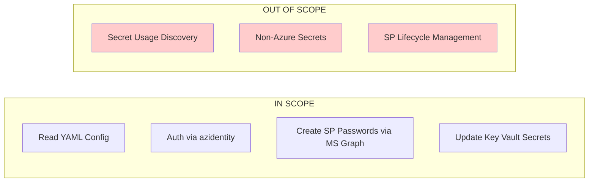

**In Scope**:

- Reading YAML config
- Authenticating via `azidentity`
- Creating Service Principal passwords via MS Graph
- Updating Azure Key Vault secrets

**Out of Scope**:

- Secret usage discovery (operational prerequisite)
- Interacting with non-Azure secrets
- Managing the service principal lifecycle (creation/deletion)

---

## 2. C4 Architecture Model

This section follows the [C4 model](https://c4model.com/) for visualizing software architecture, providing a hierarchical view from system context down to component-level details.

### 2.1 Level 1: System Context Diagram

The System Context diagram shows the `secret-rotator` system as a **black box** and its relationships to users and external systems. At this level, we don't show internal details—just WHO uses the system and WHAT external systems it interacts with.

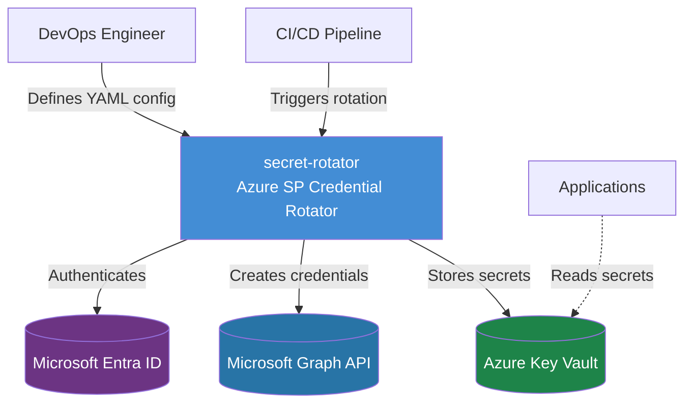

**Key Relationships**:

| Source | Destination | Relationship | Technology |
|--------|-------------|--------------|------------|
| DevOps Engineer | secret-rotator | Configures and triggers | CLI execution, YAML editing |
| CI/CD Pipeline | secret-rotator | Automated scheduled runs | GitHub Actions / Azure Pipelines |
| secret-rotator | Microsoft Entra ID | Authenticates | DefaultAzureCredential (OAuth 2.0) |
| secret-rotator | MS Graph API | Creates credentials | REST API (HTTPS) |
| secret-rotator | Azure Key Vault | Stores secrets | Azure SDK (HTTPS) |
| Applications | Azure Key Vault | Reads secrets | Managed Identity / SDK |

---

### 2.2 Level 2: Container Diagram

The Container diagram **zooms into** the secret-rotator system boundary, revealing the high-level technical building blocks. A "container" in C4 terms is a separately runnable/deployable unit. Here we show the **two containers** that comprise the system and how they interact with external systems.

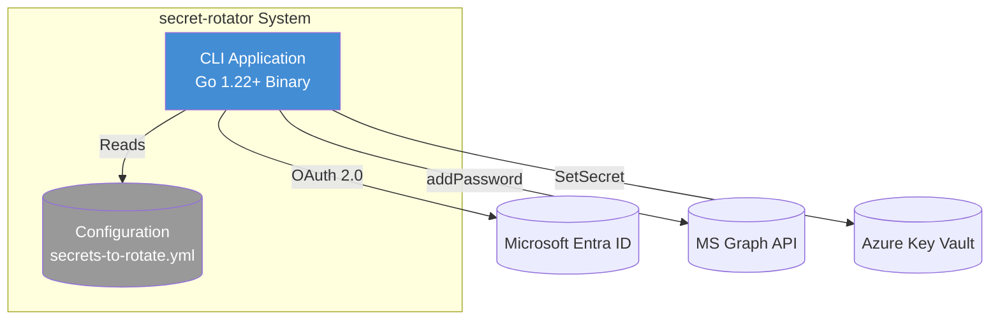

**Container Descriptions**:

| Container | Technology | Purpose |
|-----------|------------|---------|
| **CLI Application** | Go 1.22+, single binary | Entry point; parses config, orchestrates rotation, handles errors, produces structured logs |
| **Configuration File** | YAML (`secrets-to-rotate.yml`) | Declarative contract defining which secrets to rotate, validity periods, target vaults, and ownership |

**Container Interactions**:

| From | To | Description | Protocol |
|------|-----|-------------|----------|
| CLI Application | Configuration | Reads and validates at startup | File I/O |
| CLI Application | Entra ID | Obtains access tokens | OAuth 2.0 / HTTPS |
| CLI Application | MS Graph API | Creates password credentials | REST / HTTPS |
| CLI Application | Key Vault | Stores rotated secrets | Azure SDK / HTTPS |

---

### 2.3 Level 3: Component Diagram

The Component diagram **zooms into the CLI Application container**, showing its internal structure. This reveals the Go packages, their responsibilities, and how they collaborate. The interfaces enable testing and provider swapping.

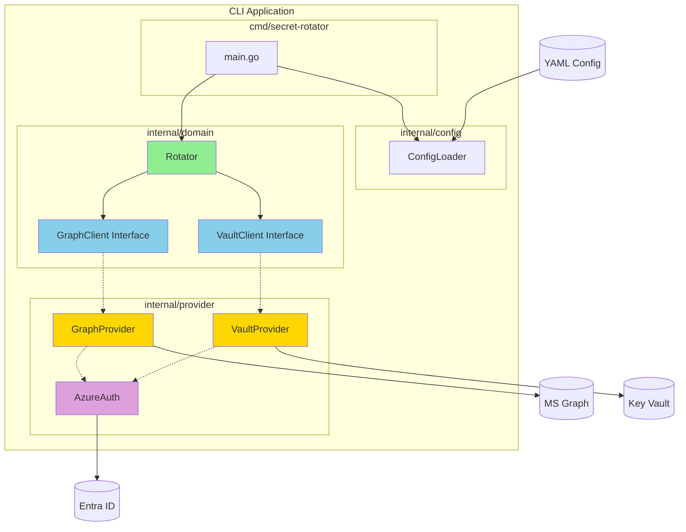

**Component Responsibilities**:

| Component | Package | Responsibility |
|-----------|---------|----------------|
| **main.go** | `cmd/secret-rotator` | Entry point, CLI parsing, dependency injection, exit codes |
| **Config Loader** | `internal/config` | Parse YAML, validate schema, apply defaults, type coercion |
| **Rotator** | `internal/domain` | Core business logic: iterate secrets, call providers, handle errors |
| **GraphClient Interface** | `internal/domain` | Abstract contract for MS Graph operations (enables testing) |
| **VaultClient Interface** | `internal/domain` | Abstract contract for Key Vault operations (enables testing) |
| **Azure Auth** | `internal/provider/azure` | Shared authentication using `DefaultAzureCredential` |
| **Graph Provider** | `internal/provider/graph` | Concrete MS Graph implementation (Client ID → Object ID → addPassword) |
| **Vault Provider** | `internal/provider/keyvault` | Concrete Key Vault implementation (SetSecret with tags) |

**Interface Segregation** (Key Design Decision):

The `Rotator` depends ONLY on interfaces (`GraphClient`, `VaultClient`), never on concrete providers. This enables:

- Unit testing with mock implementations
- Swapping providers without touching business logic
- Clear separation of concerns

---

### 2.4 Dynamic Diagram: Rotation Workflow

The Dynamic diagram shows how elements in the static model collaborate at runtime for a specific use case. This complements the static structure with behavioral detail.

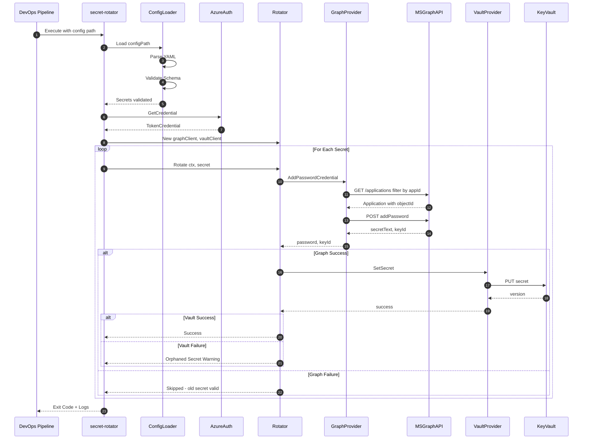

---

### 2.5 Deployment Diagram

The Deployment diagram shows how the software system maps to infrastructure. This shows the physical/virtual deployment topology.

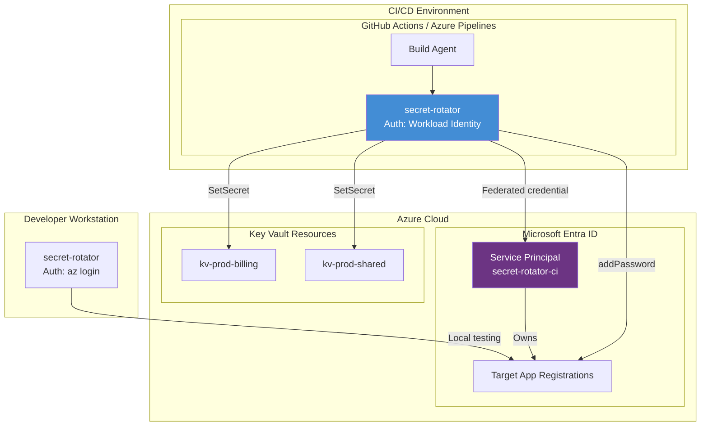

**Deployment Environments**:

| Environment | Execution Context | Authentication Method |
|-------------|-------------------|----------------------|
| **Local Development** | Developer workstation | `az login` (User identity via browser) |
| **CI/CD (GitHub)** | GitHub Actions runner | Workload Identity Federation (OIDC) |
| **CI/CD (Azure)** | Azure Pipelines agent | Managed Identity or Service Principal |

---

### 2.6 Failure Mode Analysis (System Dynamics)

| Failure Point | Consequence | Mitigation / Behavior |
|---------------|-------------|----------------------|
| **Config Load** | App crashes immediately | Fail Fast. Validate YAML schema before any API calls |
| **Auth** | App crashes | Fail Fast. Verify identity before loop starts |
| **Graph (Add Pwd)** | Rotation skipped for specific ID | Skip & Log. Old secret remains valid. System state unchanged |
| **Key Vault (Set)** | Orphaned Secret | Log Warning. App continues using old secret (still in KV). New secret in SP is harmless but unused. Pipeline warns user to cleanup |

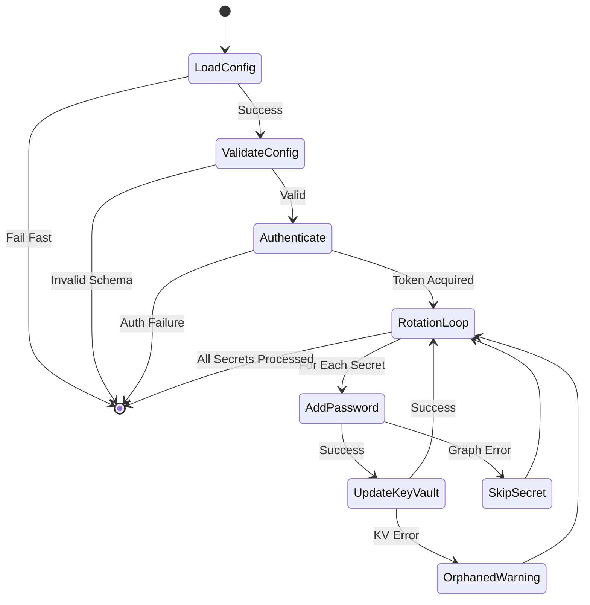

---

## 3. Data Contract (YAML)

The configuration file is the source of truth. It must be strictly typed.

**Path**: `.platform/secrets-to-rotate.yml`

```yaml
# Schema Versioning for future compatibility
apiVersion: v1

defaults:
  # Default validity if not specified per secret
  validityDays: 180

secrets:
  # Case: Service Principal Rotation
  - id: "sp-billing-service"
    type: "servicePrincipal"
    # The Application ID (Client ID) - constant across tenants
    appId: "a0a0a0a0-bbbb-cccc-dddd-e1e1e1e1e1e1"
    keyVault: "kv-prod-billing"
    keyVaultSecretName: "billing-service-client-secret"
    validityDays: 90
    description: "Used by the billing container for SQL access"
    owner: "team-finance"

  # Case: Manual/Documentation only
  - id: "ext-sendgrid-api"
    type: "manual"
    keyVault: "kv-prod-shared"
    keyVaultSecretName: "sendgrid-api-key"
    owner: "team-core"
    description: "Rotated manually via SendGrid portal"
```

---

## 4. Go Implementation Specification

### 4.1 Project Structure

We adhere to standard Go project layout standards (`cmd` for binaries, `internal` for private library code).

```text
secret-rotator/
├── cmd/
│   └── secret-rotator/
│       └── main.go           # Entry point, dependency wiring
├── internal/
│   ├── config/               # YAML parsing and validation
│   ├── domain/               # Core business logic (Rotation loop)
│   └── provider/             # Concrete implementations
│       ├── azure/            # Auth and Common Azure helpers
│       ├── graph/            # MS Graph Client wrapper
│       └── keyvault/         # Key Vault Client wrapper
├── go.mod
└── go.sum
```

### 4.2 Module: internal/config

**Responsibilities**:

- Load YAML
- Validate required fields (e.g., `appId` must be a UUID if type is `servicePrincipal`)
- Apply defaults

```go
type Config struct {
    ApiVersion string   `yaml:"apiVersion"`
    Defaults   Defaults `yaml:"defaults"`
    Secrets    []Secret `yaml:"secrets"`
}

type Secret struct {
    ID                 string `yaml:"id"`
    Type               string `yaml:"type"` // "servicePrincipal" | "manual"
    AppID              string `yaml:"appId"`
    KeyVault           string `yaml:"keyVault"`
    KeyVaultSecretName string `yaml:"keyVaultSecretName"`
    ValidityDays       int    `yaml:"validityDays"`
    Owner              string `yaml:"owner"`
}
```

### 4.3 Module: internal/domain (The Interfaces)

This is the most critical section. We define interfaces to decouple the logic from the Azure SDKs. This allows unit testing without mocking HTTP calls.

```go
package domain

import "context"

// GraphClient defines the capability to manage app credentials.
type GraphClient interface {
    // AddPasswordCredential adds a new password to the given App ID.
    // Returns the plain-text password and its Key ID, or an error.
    AddPasswordCredential(ctx context.Context, appId string, displayName string, validityDays int) (password string, keyId string, err error)
}

// VaultClient defines the capability to store secrets.
type VaultClient interface {
    // SetSecret updates the specified secret in the given Key Vault.
    SetSecret(ctx context.Context, vaultName string, secretName string, value string) error
}

// Rotator orchestrates the rotation.
type Rotator struct {
    Graph GraphClient
    Vault VaultClient
}

func (r *Rotator) Rotate(ctx context.Context, secret ConfigSecret) error {
    // Implementation of the "Create-Then-Switch" logic
}
```

### 4.4 Module: internal/provider/graph

**Library**: `github.com/microsoftgraph/msgraph-sdk-go` (v1.0+) or direct REST if SDK overhead is unjustified.

**Decision**: Given the simplicity of `addPassword`, a focused REST client using `azcore` is cleaner and lighter than the full Graph SDK, but we wrap the logic for future-proofing.

**Implementation Logic**:

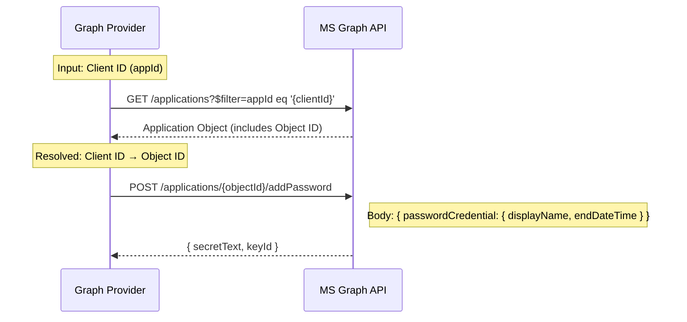

**Critical Detail**: The YAML asks for `appId` (Client ID). The code **MUST** first resolve `Client ID → Object ID` using:

```text
GET /applications?$filter=appId eq '{clientId}'
```

Then call `addPassword` on the Object ID:

```text
POST https://graph.microsoft.com/v1.0/applications/{objectId}/addPassword
```

**Request Body**:

```json
{
  "passwordCredential": {
    "displayName": "secret-rotator-auto-{timestamp}",
    "endDateTime": "2025-12-31T23:59:59Z"
  }
}
```

### 4.5 Module: internal/provider/keyvault

**Library**: `github.com/Azure/azure-sdk-for-go/sdk/keyvault/azsecrets`

**Logic**:

1. Construct Vault URL: `https://{vaultName}.vault.azure.net/`
2. Call `SetSecret`
3. Add tags to the KV Secret (recommended):
   - `managed-by: secret-rotator`
   - `owner: {owner_from_yaml}`

---

## 5. Operational Workflow (Discovery Phase)

Before running the tool, the operator must populate the YAML. This is done via `az` CLI scripts (see companion guide).

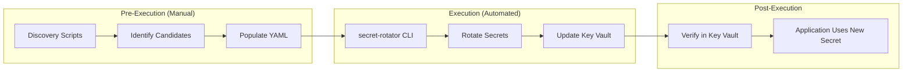

**Discovery Script** (`scripts/discover_candidates.sh`):

This script helps the human operator fill the YAML. It is **not** called by the Go tool.

```bash
#!/bin/bash
# Find secrets in a KV that look like SP credentials
VAULT_NAME=$1
az keyvault secret list --vault-name $VAULT_NAME \
  --query "[?contains(name, 'client-secret')].{Name:name, Expires:attributes.expires}" \
  -o table
```

---

## 6. Security & Identity Specifications

### 6.1 Identity

The tool runs as a Service Principal (in CI) or User (locally).

### 6.2 Required Permissions

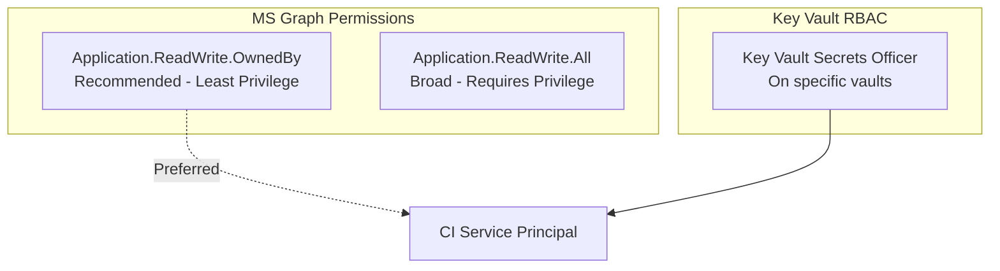

| Resource | Permission | Notes |
|----------|------------|-------|
| **Microsoft Graph** | `Application.ReadWrite.OwnedBy` | Best practice: allows rotation of apps it owns |
| **Microsoft Graph** | `Application.ReadWrite.All` | Broad, requires privilege. Avoid if possible |
| **Azure Key Vault** | `Key Vault Secrets Officer` | RBAC role on specific vaults |

> **Recommendation**: Use `Application.ReadWrite.OwnedBy` and ensure the CI Service Principal is set as an **Owner** of the target Applications. This adheres to **Least Privilege**.

---

## 7. Execution & Logging Standard

**Output Format**: JSON Logs (structured) for machine parsing in CI, or human-readable text if TTY is detected.

**Example Log Output**:

```json
{"level":"info", "ts":"2025-11-26T12:00:00Z", "msg":"starting rotation", "secret_id":"sp-billing", "vault":"kv-prod-billing"}
{"level":"info", "ts":"2025-11-26T12:00:01Z", "msg":"password credential added", "app_obj_id":"...", "key_id":"..."}
{"level":"info", "ts":"2025-11-26T12:00:02Z", "msg":"keyvault updated", "secret_version":"..."}
```

---

## 8. Implementation Steps (Next Actions)

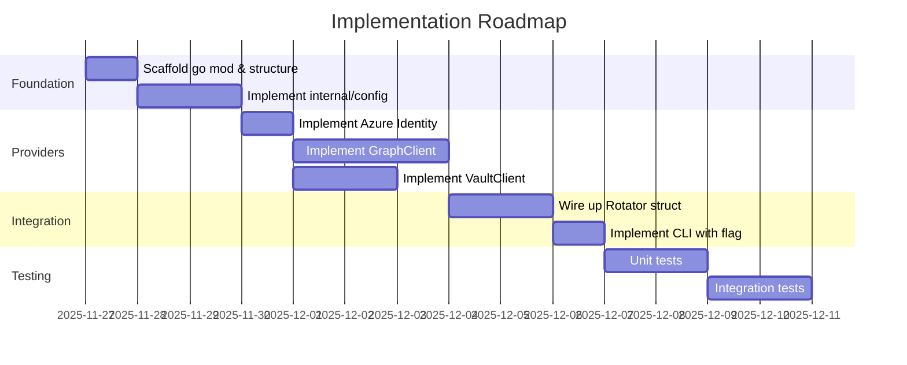

| Step | Action | Notes |
|------|--------|-------|
| 1 | Scaffold | `go mod init secret-rotator` & create folder structure |
| 2 | Config | Implement `internal/config` with `gopkg.in/yaml.v3` |
| 3 | Providers | Implement Azure Identity wrapper |
| 4 | Providers | Implement GraphClient (with Client ID → Object ID resolution) |
| 5 | Providers | Implement VaultClient |
| 6 | Logic | Wire up the `Rotator` struct |
| 7 | CLI | Use `flag` stdlib (keep it simple). Use `cobra` if future subcommands expected |

---

## Appendix: ASCII Diagrams (Fallback)

### Component Flow

```text
┌─────────────────┐     ┌──────────────────┐     ┌─────────────────┐
│   Operator      │     │  secret-rotator  │     │  Azure Services │
│  (DevOps/CI)    │     │      CLI         │     │                 │
└────────┬────────┘     └────────┬─────────┘     └────────┬────────┘
         │                       │                        │
         │  exec config.yaml     │                        │
         │──────────────────────>│                        │
         │                       │                        │
         │                       │  Get Token             │
         │                       │───────────────────────>│ Azure Identity
         │                       │<───────────────────────│
         │                       │                        │
         │                       │  AddPassword (Graph)   │
         │                       │───────────────────────>│ MS Graph
         │                       │<───────────────────────│
         │                       │                        │
         │                       │  SetSecret (KV)        │
         │                       │───────────────────────>│ Key Vault
         │                       │<───────────────────────│
         │                       │                        │
         │  Logs + Exit Code     │                        │
         │<──────────────────────│                        │
```

### Rotation Strategy

```text
                    ┌─────────────────────────────────────┐
                    │     "Create-New, Then-Switch"       │
                    └─────────────────────────────────────┘
                                      │
            ┌─────────────────────────┼─────────────────────────┐
            ▼                         ▼                         ▼
    ┌───────────────┐       ┌─────────────────┐       ┌─────────────────┐
    │ 1. Create new │       │ 2. Update KV    │       │ 3. Old remains  │
    │    credential │  ───► │    with new     │  ───► │    valid until  │
    │    in Graph   │       │    secret       │       │    app restarts │
    └───────────────┘       └─────────────────┘       └─────────────────┘
            │                         │
            │  If KV fails:           │
            ▼                         │
    ┌───────────────────────────────────────────────────────────────┐
    │  Old secret still in KV ✓   New secret orphaned in SP (safe) │
    │  Application continues working. Manual cleanup needed.        │
    └───────────────────────────────────────────────────────────────┘
```
