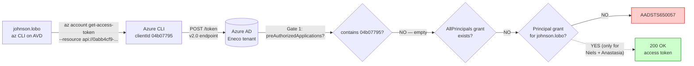
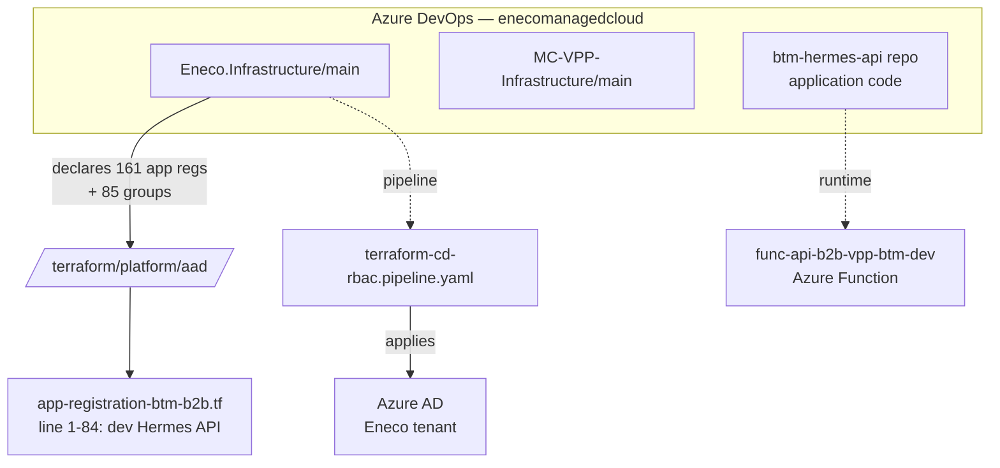
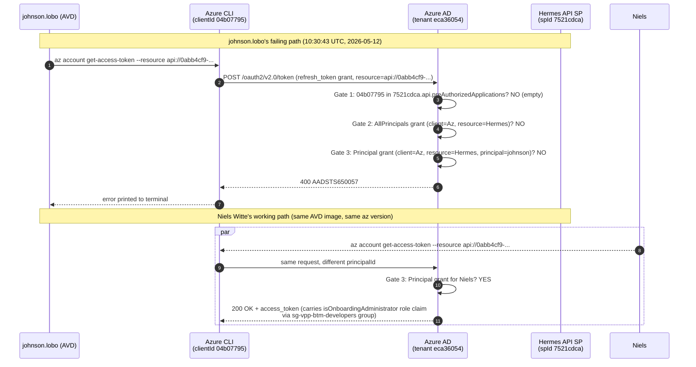

# RCA — AADSTS650057 on AVD E2E tests for johnson.lobo

## Audience and scope

- **Audience**: an Eneco on-call engineer with general SRE knowledge but **no prior context** on BTM, the Hermes API, or Eneco's AAD conventions. By the end you should be able to teach this incident to a teammate.
- **Scope**: BTM Hermes API (dev environment), AAD identity plane only. Out of scope: Azure RBAC at subscription level, AVD image internals, downstream Hermes API code.

## Knowledge Contract

After reading this document, you will be able to:

1. **Draw** the three-gate AAD authorization path that Azure CLI must traverse to issue a token for a custom Eneco API, and label each gate with the AAD object that controls it.
2. **Explain** why johnson.lobo's `az` call returns `AADSTS650057` while Niels Witte's and Anastasia Zenchik's identical calls succeed — without using the word "permission" in your answer.
3. **Trace** from the error string to the exact AAD object whose absence is responsible (it is NOT the one the error string mentions).
4. **Diagnose** a future `AADSTS650057` in the Eneco tenant in under 5 minutes using a 3-command probe sequence.
5. **Reject** the natural-but-wrong fix "add johnson to another group" and explain why group membership is orthogonal to the failure mode.
6. **Defend** the recommended immediate fix against the challenge "why not just add Azure CLI to `preAuthorizedApplications` once and for all?" — naming at least one concrete tradeoff.

What this document **does not** make you able to do: write production-grade Terraform for the `preAuthorizedApplications` block (cite the BTM platform owner for sign-off), or fix Azure CLI token-cache pathologies on AVD (orthogonal layer).

## First-principles ladder

Climb these rungs in order before reading TL;DR. Each rung names the smallest true statement from which the rest follows; do not skip.

| Rung | Primitive | What must already be true | What breaks if it isn't |
|------|-----------|---------------------------|-------------------------|
| 1. Term | An **OAuth access token** is a signed bearer string AAD issues to a CLIENT, scoped to a RESOURCE, on behalf of (optionally) a PRINCIPAL. | Client and resource are both registered identities in the same tenant. | The CLIENT must already be a registered application in the same tenant where the RESOURCE lives. |
| 2. Primitive | AAD has **two delegated-consent shortcuts**: `preAuthorizedApplications` (set on the resource API; admin-time) and `oauth2PermissionGrant` (per-user or tenant-wide; runtime). | Each shortcut is a separate AAD object queryable on its own. | Treating them as one entity hides which one is missing in any given failure. |
| 3. Invariant | For AAD to issue a delegated token, **at least one** of these must be true: client is in resource's `preAuthorizedApplications`, OR an `AllPrincipals` grant exists, OR a `Principal` grant exists for the requesting user. App-role/group membership do NOT participate in this decision. | At least one path must produce TRUE. | If zero paths produce TRUE and the flow is silent (no UI), AAD denies. With at least one TRUE, the token is minted and the role claim is computed from `appRoleAssignedTo`. |
| 4. Mechanism | A **silent token request** (`az account get-access-token --resource ...`) cannot prompt the user for consent. It uses cached refresh tokens and a synchronous AAD call. If no consent path exists, AAD returns an error code; AAD picks `AADSTS650057` when the client is a Microsoft public client like Azure CLI. | The flow is non-interactive. | An interactive flow (`az login --scope ...`) WOULD prompt; that is the canonical mechanism for creating the missing `Principal` grant. |
| 5. Consequence | Two BTM developers (Niels, Anastasia) once ran `az login --scope api://.../Device.Write` interactively and accepted. AAD wrote a `Principal` `oauth2PermissionGrant`. Their subsequent silent calls succeed. | Their grants persist until revoked. | Without the grant the same call would fail with the same error. The grant is the difference. |
| 6. Failure | johnson.lobo has never run the interactive consent step. Her silent call has zero passing paths. AAD returns `AADSTS650057`. | The error code reflects "no consent path for this delegated request", regardless of where the missing piece literally lives. | Reading the error literally ("client app registration lacks ...") leads to the wrong fix. The literal client manifest cannot be edited (Microsoft owns Azure CLI). |
| 7. Defense | Probe in this order: `api.preAuthorizedApplications`, `oauth2PermissionGrants (AllPrincipals)`, `oauth2PermissionGrants (Principal=user)`. The first non-empty answer is the fix surface. If all are empty, `az login --scope ...` is the canonical patch. | Probes are cheap (one Graph call each). | If you probe `appRoleAssignmentRequired` first you waste a step on an orthogonal gate. |

## TL;DR



**One-sentence diagnosis**: johnson.lobo lacks the per-user `oauth2PermissionGrant` (delegated consent record) that AAD needs to silently issue a `Device.Write` token for Azure CLI against the Hermes API; her two consented teammates have one, she does not, and the BTM Hermes API has neither admin pre-authorization nor a tenant-wide grant to shortcut the consent step.

**One-sentence fix**: have johnson run `az login --scope api://0abb4cf9-70e9-4acf-9ad9-b0a75af7ace3/Device.Write` once to complete the consent prompt; the resulting grant is durable.

## Context Ledger

Every term used in this RCA, with the precise AAD object or code artifact it refers to.

| Term | Definition | AAD object / code artifact | Why it matters here |
|------|------------|---------------------------|---------------------|
| **AAD / Entra ID** | Microsoft's directory/identity service. | Eneco tenant `eca36054-49a9-4731-a42f-8400670fc022`. | All three failure gates live in here. |
| **App registration (App)** | Manifest describing an application's identity, scopes, roles, redirects. | Hermes API: `appreg-mcdta-vpp-btm-hermesapi-id-d` (appId `0abb4cf9-...`). | The resource being requested. |
| **Service Principal (SP)** | Per-tenant instance of an App used for runtime checks (assignments, grants). | Hermes API SP object id `7521cdca-...`. | `appRoleAssignmentRequired`, `appRoleAssignedTo`, `oauth2PermissionGrants` are all keyed on SP id. |
| **Azure CLI public client** | Microsoft-published OAuth public client used by `az` CLI. Cannot be edited by Eneco. | App id `04b07795-8ddb-461a-bbee-02f9e1bf7b46`; SP in Eneco tenant `e92e13b0-...`. | The client making the request. The error string names this app. |
| **Delegated scope (OAuth2 permission scope)** | An app's published delegated permission, e.g. `Device.Write`. Subject to per-user consent. | `0abb4cf9.api.oauth2PermissionScopes[Device.Write]`, scope id `b1959a02-...`, `type: User`. | What johnson is requesting. `type: User` means a user is permitted to self-consent. |
| **App role** | An app-defined role usable as either an Application permission (M2M) or User assignment (claim in user token). | `0abb4cf9.appRoles[isOnboardingAdministrator]`, role id `2ba76c52-...`. | Grants the role claim once the token is issued. Does NOT participate in deciding whether AAD issues the token at all. |
| **`appRoleAssignmentRequired`** | SP-level boolean — when `true`, Enterprise App enforces explicit assignment of user/group to the SP for sign-in. | Hermes SP: `false`. | Often confused with token issuance; here it does NOT gate. |
| **`preAuthorizedApplications`** | App-level list on the resource API that pre-consents specific clients tenant-wide. | `0abb4cf9.api.preAuthorizedApplications: []`. | Gate 1 of token issuance. Empty here. |
| **`knownClientApplications`** | App-level list for combined consent (rare). | `0abb4cf9.api.knownClientApplications: []`. | Adjacent to Gate 1; irrelevant here. |
| **`oauth2PermissionGrant`** | Runtime directory object representing a granted delegated consent. `consentType: Principal` is per-user; `AllPrincipals` is tenant-wide. | Two `Principal` grants exist (Niels, Anastasia); zero `AllPrincipals`; zero for johnson. | Gates 2 and 3 of token issuance. THIS is the load-bearing gap for johnson. |
| **Bruno** | An open-source REST client (Postman alternative) used by BTM developers for OAuth interactive flows. | Configured in IaC via `0abb4cf9.publicClient.redirectUris=["http://localhost/bruno/callback"]`. | Works by using the **Hermes API's own appId** as the OAuth client — collapsing client and resource so no Gate 1/2/3 matters. |
| **E2E test SP** | A separate Eneco-owned app reg whose service principal is granted the `isOnboardingAdministrator` Application role on the Hermes API. | `appreg-mcdta-vpp-btm-b2b-e2e-d` (appId `8c81ac05-...`, SP `58d11a6e-...`). | Used by CI / machine identities via `client_credentials` grant; bypasses delegated-consent gates entirely. |
| **`Device.Write`** | The Hermes API's only delegated scope; `user_consent_description: "Allow this app to write device data on your behalf"`. | `0abb4cf9.api.oauth2PermissionScopes[0]`. | The scope johnson's request asks for. |
| **AVD (Azure Virtual Desktop)** | Cloud-hosted Windows desktops; Eneco engineers run dev tools inside them. | — | Confound to rule out (it is not the cause). |
| **AADSTS650057** | AAD error: "Invalid resource. The client has requested access to a resource which is not listed in the requested permissions in the client's application registration." | — | The observed failure. Misleadingly worded for this case (see L3 mechanism). |
| **FoCI (Family of Client IDs)** | Microsoft-internal scheme allowing Azure CLI and other Microsoft clients to share refresh tokens. | — | Background only; mentioned here to forestall the wrong intuition that "Azure CLI is special so it bypasses normal gates." |

**Zero-context reader test**: if the next on-call engineer needs to disambiguate "app role" from "scope" from "grant" from "assignment" later in the document, they re-read this table.

## L1 — Business — Why Hermes API exists

The **BTM Hermes API** is the device-management plane for Eneco's Behind-The-Meter program — the residential battery + smart-meter integration that participates in TenneT's balancing markets via VPP. New customer devices are onboarded via the Hermes API by either (a) a service that calls Hermes machine-to-machine, or (b) a developer manually probing/seeding device state during integration work. Failure mode here blocks **integration validation**, not customer traffic — but each blocked engineer-day delays a feature merge.

The team is the BTM unit inside Trade Platform (Eneco's VPP organization). Devices and onboarding affect the FBE (Flex Budget Engine) downstream, which contracts flexibility to TenneT.

## L2 — Repo system



Three repos touch this incident, all in `enecomanagedcloud` ADO project, project `Myriad - VPP`:

| Repo | Relevance | File of interest |
|------|-----------|------------------|
| **Eneco.Infrastructure** | Declares the Hermes API app registration. Manages app reg lifecycle via Terraform. **The fix happens here.** | `terraform/platform/aad/app-registration-btm-b2b.tf:1-84` |
| **MC-VPP-Infrastructure** | Sister IaC repo for VPP product infra (Azure resources). **Not involved** in this incident — included here so the reader does not chase it. | — |
| btm-hermes-api (application code) | The runtime API. **Not involved** — token issuance fails before the API is reached. | — |

## L3 — Runtime architecture



Two facts that surprise newcomers:

- **The error message blames the wrong side.** "List of valid resources from app registration: ." reads like the *resource* API has not enumerated valid clients. The exact opposite is happening: AAD is reporting that **Azure CLI's own manifest** lists no valid resources matching `0abb4cf9` (which is correct — Microsoft cannot list Eneco's custom APIs in Azure CLI's manifest), and there is no consent record that would have made up for it. The phrasing "app registration" in the error refers to the CLIENT's app registration.
- **Group membership and the role claim are downstream of token issuance.** If Gate 3 had passed, johnson's token would carry `isOnboardingAdministrator` because she is in `sg-vpp-btm-developers` and that group has the role on Hermes. The role determines what the API does once it sees the token — not whether AAD hands the token over.

## L4 — Application code flow

This incident does not reach the Hermes API application code. Token acquisition fails at AAD; no HTTP request is sent to the API itself.

For completeness: Hermes is a .NET Azure Function (`func-api-b2b-vpp-btm-dev.azurewebsites.net`). It validates inbound bearer tokens for the `Device.Write` scope OR the `isOnboardingAdministrator` role claim. Both branches require AAD to have issued a token in the first place, which is the failed step here.

## L5 — IaC / state / Azure — the three truths

### IaC truth (`Eneco.Infrastructure/main/terraform/platform/aad/app-registration-btm-b2b.tf:1-84`)

| Field | Value | Note |
|-------|-------|------|
| `name` | `appreg-mcdta-vpp-btm-hermesapi-id-d` | Dev environment Hermes API. |
| `group_membership_claims` | `[]` | Tokens will NOT include group claims (role claims yes via `appRoles`). |
| `public_client.redirect_uris` | `["http://localhost/bruno/callback"]` | Added by PR 172140 (`e5d3282`) to make Bruno work. |
| `single_page_application.redirect_uris` | swagger/oauth2-redirect.html, local + deployed | Swagger UI auth. |
| `app_roles[0]` | `isOnboardingAdministrator` (User+Application), assigned to `sg-vpp-btm-developers`, `sb-onboarding-orchestrator-api-sb`, `d-onboarding-orchestrator-api-d` | The role claim that flows into tokens. |
| `api.known_client_applications` | `[]` | No combined-consent path. |
| `api.oauth2_permission_scope` | `Device.Write` (`type: User`) | The single delegated scope; user-consent allowed. |
| `api_permissions` | only `local.default_ms_graph_user_read_api_permission` | Hermes consumes nothing else. |
| **MISSING**: `api.preAuthorizedApplications` | not declared (resolves to `[]`) | **This is the load-bearing absence on the resource side.** |

The CCoE module `terraform-azure-aad-application@v2.0.0` supports `pre_authorized_applications` but the BTM team's convention does not use it (probe: across BTM apps queried, zero had populated `preAuthorizedApplications`).

### Live AAD truth (probed 2026-05-12)

Matches IaC exactly:

```text
api.preAuthorizedApplications  : []
api.knownClientApplications    : []
api.oauth2PermissionScopes     : [Device.Write (type: User, isEnabled: true)]
appRoles                       : [isOnboardingAdministrator]
publicClient.redirectUris      : ["http://localhost/bruno/callback"]
appRoleAssignmentRequired (SP) : false
signInAudience                 : AzureADMyOrg
```

### Runtime truth (`oauth2PermissionGrants` directory objects)

These are the entities the IaC does NOT declare and that drift over time as users complete consent prompts.

| Client | Resource | consentType | principal | scope |
|--------|----------|-------------|-----------|-------|
| Azure CLI SP (`e92e13b0-...`) | Hermes API SP (`7521cdca-...`) | Principal | Niels.Witte@eneco.com (`754f018b-...`) | ` Device.Write` |
| Azure CLI SP (`e92e13b0-...`) | Hermes API SP (`7521cdca-...`) | Principal | Anastasia.Zenchik@eneco.com (`4a715c47-...`) | ` Device.Write` |

Zero records for `johnson.lobo`. Zero records with `consentType: AllPrincipals`.

**The three truths agree on the resource side.** They diverge on the runtime consent side — and that divergence is the entire incident.

## L6 — The pipeline and how it actually runs

`terraform-cd-rbac.pipeline.yaml` applies the AAD module from `main`. It manages app registrations and groups; it does NOT manage runtime `oauth2PermissionGrants` (those are created by user consent flow or by `az ad app permission grant`). This is a structural property of the AAD provider, not a pipeline bug.

Consequence: even if a previous PR had created a tenant-wide grant via `az ad app permission grant`, that grant would be **invisible to Terraform** and would persist or drift independently of `main`.

## L7 — Timeline

| When (UTC) | What | Evidence |
|------------|------|----------|
| 2026-04-23 14:02 | PR 172140 (commit `e5d3282`) merged: added `publicClient.redirectUris=["http://localhost/bruno/callback"]` to BTM Hermes API (dev/acc/prd) so Bruno could perform interactive OAuth. | `git show e5d3282 -- terraform/platform/aad/` |
| pre-incident | Niels Witte and Anastasia Zenchik each completed an interactive AAD consent prompt for Azure CLI → Hermes API `Device.Write`, creating per-user `oauth2PermissionGrant` records. Exact dates not captured in directory metadata. | Graph `/oauth2PermissionGrants` filter for `clientId=Az SP, resourceId=Hermes SP` returns these two records. |
| 2026-05-12 10:30:43 | johnson.lobo's `az` CLI request for `api://0abb4cf9-...` returns `AADSTS650057`. Trace `76cd12d5-f2b2-4da5-bb03-d7ebdb564800`. | Slack intake (`slack-intake.txt`). |
| 2026-05-12 ~13:30 | Triage begins. IaC inspection localizes resource as Hermes API dev (BTM B2B). | This investigation. |
| 2026-05-12 ~13:35 | First live probe: `preAuthorizedApplications=[]`, `appRoleAssignmentRequired=false`, johnson IS in `sg-vpp-btm-developers`. | `.ai/tasks/.../context/p4-live-aad-probes.md` |
| 2026-05-12 ~13:45 | Adversarial review surfaces H9 (`oauth2PermissionGrant` user-consent record). Discriminating probe runs. | `.ai/tasks/.../verification/adversarial-synthesis.md` |
| 2026-05-12 ~13:50 | Two consented users identified; johnson confirmed without grant. Diagnosis locked. | This document. |

## L8 — Fix

There are **four** clean fixes, each appropriate to a different blast radius. They are NOT mutually exclusive.

```text
                  blast radius
                 (and approval)
   per-user      ┌──────────────┐
   (no IaC)      │ FIX 1        │   Immediate unblock for johnson only.
                 │ az login     │   Creates one Principal-scoped grant.
                 │ --scope ...  │   Self-service; no PR.
                 └──────────────┘
                       │
   tenant-wide   ┌──────────────┐
   operational   │ FIX 2        │   Admin grants AllPrincipals consent
   (no IaC)      │ az ad app    │   for Azure CLI → Hermes Device.Write.
                 │ permission   │   Every Eneco user can az-CLI to Hermes.
                 │ grant ...    │   Audit log only; not in Terraform.
                 └──────────────┘
                       │
   tenant-wide   ┌──────────────┐
   declarative   │ FIX 3        │   IaC: add api.preAuthorizedApplications
   (PR)          │ HCL change   │   on Hermes module. Reviewed via PR.
                 │ to btm-b2b   │   Departs from current BTM convention.
                 │ module       │
                 └──────────────┘
                       │
   client-swap   ┌──────────────┐
                 │ FIX 4        │   Tell johnson to stop using az CLI.
                 │ Use Bruno OR │   Bruno: clientId=0abb4cf9 (API itself);
                 │ E2E SP       │   E2E SP: client_credentials grant.
                 │ creds        │   No grant/preAuth gates apply.
                 └──────────────┘
```

### Fix 1 — Immediate, per-user (RECOMMENDED FOR THIS INCIDENT)

johnson runs once on her AVD session:

```bash
az account clear
az login --scope api://0abb4cf9-70e9-4acf-9ad9-b0a75af7ace3/Device.Write
```

A browser opens; she accepts the consent prompt ("Microsoft Azure CLI requests permission to write device data on your behalf"). After accepting, AAD creates a `Principal` `oauth2PermissionGrant` for her object id. The original test script (`az account get-access-token --resource api://0abb4cf9-...`) then succeeds silently.

**Why it is correct**: this is exactly the path Niels and Anastasia traversed.
**What stays the same**: IaC, groups, role assignments, all other users' behavior.
**What changes**: one new directory object (a per-user grant). Reversible by `az ad app permission delete --id 04b07795-... --api 0abb4cf9-...` or the user revoking consent in My Apps.

### Fix 2 — Tenant-wide, operational

Admin (someone with sufficient AAD privilege, typically platform-AAD owner) runs:

```bash
az ad app permission grant \
  --id 04b07795-8ddb-461a-bbee-02f9e1bf7b46 \
  --api 0abb4cf9-70e9-4acf-9ad9-b0a75af7ace3 \
  --scope Device.Write
```

This creates a single `AllPrincipals` `oauth2PermissionGrant`. Every Eneco user can use Azure CLI against Hermes without per-user consent.

**Tradeoff**: widens the access surface from "two opted-in developers" to "anyone in the tenant who can run `az`." The role check (`isOnboardingAdministrator`) still gates whether the token is *useful*, but token issuance becomes universal. **Discuss with platform-AAD owner before applying.** Drift surface: the grant is invisible to Terraform.

### Fix 3 — Tenant-wide, declarative (IaC PR)

In `terraform/platform/aad/app-registration-btm-b2b.tf`, add a `pre_authorized_applications` block to the `api = { ... }` clause of the `appreg-mcdta-vpp-btm-hermesapi-id-d` module:

```hcl
api = {
  known_client_applications      = []
  mapped_claims_enabled          = false
  requested_access_token_version = 2

  oauth2_permission_scope = [
    {
      # existing Device.Write scope unchanged
      id    = "b1959a02-82ed-4349-9ca6-fabf0909f978"
      value = "Device.Write"
      type  = "User"
      # ... (unchanged)
    }
  ]

  # NEW — pre-authorize Azure CLI for Device.Write so no per-user consent is needed.
  pre_authorized_applications = [
    {
      application_id           = "04b07795-8ddb-461a-bbee-02f9e1bf7b46" # Microsoft Azure CLI
      delegated_permission_ids = ["b1959a02-82ed-4349-9ca6-fabf0909f978"] # Device.Write scope id
    },
  ]
}
```

This grants Azure CLI tenant-wide pre-authorization, declared in IaC and reviewed via PR.

**Tradeoff**: same security widening as Fix 2, but in a reviewable artifact. Departs from BTM convention (no other BTM app uses `preAuthorizedApplications`). The platform-AAD module syntax (`pre_authorized_applications` field on the CCoE `terraform-azure-aad-application@v2.0.0` module) needs verification against the module source before drafting the PR — this RCA does not include that verification (A3 UNVERIFIED[blocked: external module source not in this repo]).

### Fix 4 — Use a different client

Two pre-existing paths:

- **Bruno**: configure with `clientId=0abb4cf9-70e9-4acf-9ad9-b0a75af7ace3` (the Hermes API itself as a public client), `redirect_uri=http://localhost/bruno/callback`, `scope=api://0abb4cf9-.../Device.Write`. Bypasses Gates 1-3 because the client IS the resource. PR 172140 set this up.
- **E2E SP client credentials**: in CI, use `appId=8c81ac05-70f6-4afd-9dd8-4763070dc4da` (`appreg-mcdta-vpp-btm-b2b-e2e-d`) with a client secret. `grant_type=client_credentials`, `scope=api://0abb4cf9-.../.default`. Bypasses delegated-consent gates because it is an Application-permission flow.

## L9 — Verification

### Verifying Fix 1 for johnson

After johnson runs the `az login --scope ...` command and accepts:

```bash
# Step 1: confirm grant exists
az rest --method GET \
  --uri "https://graph.microsoft.com/v1.0/oauth2PermissionGrants?\$filter=clientId eq 'e92e13b0-03a1-465f-82cf-2a9bf5732a72' and resourceId eq '7521cdca-8b98-4e3f-b77b-7ff11d8b8b8c' and principalId eq 'cefb3484-9ef6-40f3-829e-5a4f9717c94c'" \
  --query "value[].{scope:scope, consentType:consentType}"
# Expected: [{"scope": " Device.Write", "consentType": "Principal"}]

# Step 2: token acquisition works silently
az account get-access-token --resource api://0abb4cf9-70e9-4acf-9ad9-b0a75af7ace3 \
  --query "expiresOn" -o tsv
# Expected: an ISO timestamp ~1h in future; no AADSTS error.

# Step 3 (optional): decode the token and prove the role claim is present
TOKEN=$(az account get-access-token --resource api://0abb4cf9-70e9-4acf-9ad9-b0a75af7ace3 --query accessToken -o tsv)
echo "$TOKEN" | cut -d. -f2 | base64 -d 2>/dev/null | jq '{aud, roles, scp}'
# Expected: aud="api://0abb4cf9-...", roles=["isOnboardingAdministrator"] (from group membership), scp="Device.Write"
```

### Falsifiers

The diagnosis is wrong if ANY of the following:

- Step 1 returns `[]` after `az login --scope ...` accepted: AAD did not create the grant. Possible cause: `az` CLI version too old; AVD policy blocking consent; Conditional Access policy preventing consent. Re-investigate.
- Step 2 still fails with `AADSTS650057`: indicates a deeper auth-broker issue on AVD; escalate to Microsoft support.
- Step 2 fails with `AADSTS65001` ("consent required") instead of `650057`: consent UI was dismissed without accepting; re-run Step 1.

## L10 — Lessons

### Durable principles

1. **Membership in a group that has a role on an API is necessary but not sufficient for `az` CLI to acquire a token for that API.** Token issuance is gated separately from role-claim assignment.
2. **AAD's `AADSTS650057` error string mis-attributes the failure to the client's app registration manifest.** The actual missing entity is typically on the resource side (`preAuthorizedApplications`) or in a separate directory object (`oauth2PermissionGrants`). Read the error as a TRIGGER for investigation, not as a diagnosis.
3. **Runtime AAD consent state drifts independently of IaC.** Two BTM developers have personal consent grants for Azure CLI → Hermes that Terraform never touched and Terraform cannot see. New joiners do not inherit these grants; they look like a bug.
4. **PR 172140's "fix for public clients (bruno)" addressed Path 4 (Bruno), not Path 1 (Azure CLI).** Anyone reading the commit message and assuming `az` CLI now works tenant-wide is misled. The PR added a redirect URI for Bruno; it did NOT add Azure CLI to `preAuthorizedApplications`.
5. **The Eneco BTM convention to NOT use `preAuthorizedApplications`** has a known structural cost: every new joiner needs a one-time interactive consent OR the platform-AAD owner needs to grant `AllPrincipals` consent operationally. Document this in the BTM developer onboarding guide.
6. **Cross-reference with LL-002 (ArgoCD three-plane RBAC)**: the same shape recurs here — "the user is in the right group" is a partial truth that can mask a missing plane (here: consent record; in ArgoCD: AppProject role binding or Enterprise App assignment). Always enumerate planes before concluding "user has the right permissions."

### Durable lesson to add

Add to `.ai/memory/lessons-learned.json`:

```text
LL-014 — Azure AD AADSTS650057 misdirection: the error blames the client's app registration manifest,
but the load-bearing missing entity is typically (a) preAuthorizedApplications on the resource API,
(b) an AllPrincipals oauth2PermissionGrant, or (c) a Principal-scoped oauth2PermissionGrant for the
failing user. Probe sequence: az ad app show --query api.preAuthorizedApplications +
az rest GET /v1.0/oauth2PermissionGrants filtered by clientId+resourceId+principalId.
Group membership and appRoleAssignmentRequired are different gates and frequently red-herrings.
```

## L11 — End-to-end command playbook

Run these from any logged-in `az` session in the Eneco tenant (`eca36054-49a9-4731-a42f-8400670fc022`). The order reproduces the investigation cold.

```bash
# === Constants ===
HERMES_APP_ID="0abb4cf9-70e9-4acf-9ad9-b0a75af7ace3"     # appreg-mcdta-vpp-btm-hermesapi-id-d
HERMES_SP_ID="7521cdca-8b98-4e3f-b77b-7ff11d8b8b8c"     # its service principal
AZ_CLI_APP_ID="04b07795-8ddb-461a-bbee-02f9e1bf7b46"   # Microsoft Azure CLI (public client)
AZ_CLI_SP_ID="e92e13b0-03a1-465f-82cf-2a9bf5732a72"     # Azure CLI SP in Eneco tenant
USER_UPN="johnson.lobo@eneco.com"
USER_OID="cefb3484-9ef6-40f3-829e-5a4f9717c94c"
BTM_DEVS_GROUP_ID="06419929-4eb0-49fb-add5-e0ff850e5ac8"  # sg-vpp-btm-developers

# === 1. Confirm IaC truth (resource side) ===
az ad app show --id "$HERMES_APP_ID" --query "{preAuth:api.preAuthorizedApplications, knownClients:api.knownClientApplications, scopes:api.oauth2PermissionScopes[].value, roles:appRoles[].value, publicRedirect:publicClient.redirectUris}" -o json
# Expect: preAuth=[], knownClients=[], scopes=["Device.Write"], roles=["isOnboardingAdministrator"], publicRedirect=["http://localhost/bruno/callback"]

az ad sp show --id "$HERMES_APP_ID" --query "{appRoleAssignmentRequired:appRoleAssignmentRequired, accountEnabled:accountEnabled}" -o json
# Expect: appRoleAssignmentRequired=false

# === 2. Confirm user identity and group membership (rule out H1, H2, H4) ===
az ad user show --id "$USER_UPN" --query "{id:id, externalUserState:externalUserState, userType:userType}" -o json
# Expect: id matches USER_OID, externalUserState=null, userType=null

az ad group member check --group "$BTM_DEVS_GROUP_ID" --member-id "$USER_OID" -o json
# Expect: {"value": true}

# === 3. THE DISCRIMINATING PROBE — consent records ===
az rest --method GET \
  --uri "https://graph.microsoft.com/v1.0/oauth2PermissionGrants?\$filter=clientId eq '$AZ_CLI_SP_ID' and resourceId eq '$HERMES_SP_ID'" \
  --query "value[].{principalId:principalId, consentType:consentType, scope:scope}" -o json
# Expect: two Principal-scoped entries (Niels, Anastasia). Zero AllPrincipals. Zero for USER_OID.

az rest --method GET \
  --uri "https://graph.microsoft.com/v1.0/oauth2PermissionGrants?\$filter=clientId eq '$AZ_CLI_SP_ID' and resourceId eq '$HERMES_SP_ID' and principalId eq '$USER_OID'" \
  --query "value" -o json
# Expect: [] — the load-bearing absence.

# === 4. Apply Fix 1 (johnson runs this on her AVD session) ===
az account clear
az login --scope "api://$HERMES_APP_ID/Device.Write"
# Accept the consent prompt in the browser.

# === 5. Verify the fix ===
az rest --method GET \
  --uri "https://graph.microsoft.com/v1.0/oauth2PermissionGrants?\$filter=clientId eq '$AZ_CLI_SP_ID' and resourceId eq '$HERMES_SP_ID' and principalId eq '$USER_OID'" \
  --query "value[].{scope:scope, consentType:consentType}" -o json
# Expect: [{"scope": " Device.Write", "consentType": "Principal"}]

az account get-access-token --resource "api://$HERMES_APP_ID" --query expiresOn -o tsv
# Expect: an ISO timestamp; no error.
```

## L12 — One-page on-call playbook

```
═════════════════════════════════════════════════════════════════════
AADSTS650057 — 5-minute triage card
═════════════════════════════════════════════════════════════════════

SYMPTOM
  User's az CLI call to a custom Eneco API returns AADSTS650057.
  Error names two GUIDs: Client app (likely 04b07795 = Azure CLI) and
  Resource app (the Eneco API).

DO NOT
  ◦ Add the user to another group — group membership is orthogonal.
  ◦ Change appRoleAssignmentRequired — different gate.
  ◦ Trust the error string at face value. It blames the wrong side.

DO  — three commands, in order

  1) Get the user object id and the resource SP id.
       az ad user show --id "<user-upn>" --query id -o tsv
       az ad sp show --id "<resource-app-guid>" --query id -o tsv

  2) Check whether the user has a per-user consent grant
     (this is gate 3 of token issuance).
       az rest --method GET \
         --uri "https://graph.microsoft.com/v1.0/oauth2PermissionGrants?\$filter=resourceId eq '<resource-sp-id>' and principalId eq '<user-oid>'" \
         --query value
       Empty []  → likely cause; go to Fix.
       Non-empty → different gate; check preAuthorizedApplications
                   and conditional access.

  3) Apply Fix 1 (user runs):
       az account clear
       az login --scope "api://<resource-app-guid>/<scope-name>"

VERIFY
  az account get-access-token --resource "api://<resource-app-guid>" \
    --query expiresOn -o tsv
  Should print an ISO timestamp.

ESCALATE IF
  ◦ Step 2 already showed a grant → see L8/Fix 4 (use Bruno or SP creds)
    or check Conditional Access policies on the user.
  ◦ Step 3 returns AADSTS65001 → consent dismissed; retry.
  ◦ Step 3 returns 650057 again after grant created → AVD/WAM broker
    pathology; escalate to Microsoft support.

WHO TO LOOP IN
  Platform-AAD owner (managing terraform/platform/aad/) if a durable
  fix (preAuthorizedApplications or AllPrincipals consent) is appropriate.
  BTM lead if the request is from a new joiner — onboarding guide needs
  to document the one-time consent step.

WHERE THE CODE LIVES
  Eneco.Infrastructure/main/terraform/platform/aad/app-registration-btm-b2b.tf
  (and similarly for other BTM/VPP custom APIs.)
═════════════════════════════════════════════════════════════════════
```

## Evidence Ledger

| # | Claim | Label | Evidence |
|---|-------|-------|----------|
| E1 | Resource `0abb4cf9-...` = Hermes API dev | A1 FACT | `git grep '0abb4cf9' terraform/platform/aad/` → `app-registration-btm-b2b.tf:270` (consumer reference annotated `# Identifier of appreg-mcdta-vpp-btm-hermesapi-id-d`); confirmed by `az ad app show --id 0abb4cf9-... --query displayName` → `appreg-mcdta-vpp-btm-hermesapi-id-d` |
| E2 | `preAuthorizedApplications=[]` on Hermes API | A1 FACT | `az ad app show ... --query api.preAuthorizedApplications` (2026-05-12, captured in `p4-live-aad-probes.md`) |
| E3 | `appRoleAssignmentRequired=false` on Hermes SP | A1 FACT | `az ad sp show ... --query appRoleAssignmentRequired` |
| E4 | johnson.lobo is in `sg-vpp-btm-developers` | A1 FACT | `az ad group member check --group 06419929-... --member-id cefb3484-...` → `{value:true}` |
| E5 | `sg-vpp-btm-developers` has `isOnboardingAdministrator` on Hermes | A1 FACT | Graph `/servicePrincipals/7521cdca-.../appRoleAssignedTo` enumeration |
| E6 | Niels.Witte and Anastasia.Zenchik have Principal-scoped consent grants for Azure CLI → Hermes `Device.Write` | A1 FACT | Graph `/oauth2PermissionGrants?$filter=clientId eq '<AzCli SP>' and resourceId eq '<Hermes SP>'` |
| E7 | johnson.lobo has ZERO `oauth2PermissionGrants` on Hermes | A1 FACT | Graph filter `principalId eq '<johnson>' and resourceId eq '<Hermes SP>'` returns `[]` |
| E8 | No tenant-wide (`AllPrincipals`) grant exists | A1 FACT | Same filter with `consentType eq 'AllPrincipals'` returns `[]` |
| E9 | `Device.Write` is `type: User` (user-consent allowed) | A1 FACT | `az ad app show ... --query api.oauth2PermissionScopes[].type` |
| E10 | PR 172140 added Bruno redirect URI but did NOT add Azure CLI to preAuthorizedApplications | A1 FACT | `git show e5d3282 -- terraform/platform/aad/app-registration-btm-b2b.tf` |
| E11 | BTM convention does not use `preAuthorizedApplications` on any of its apps | A1 FACT | `az rest /v1.0/applications?$filter=startswith(displayName,'appreg-mcdta-vpp')` filtered for non-empty preAuth returns `[]` |
| E12 | Causal chain: missing consent grant produces AADSTS650057 in silent flow | A2 INFER | From E2, E7, E8, E9, and Microsoft AAD documented behavior for silent token requests when no admin pre-auth and no user grant exists |
| E13 | The recommended `az login --scope ...` fix produces a `Principal` grant | A2 INFER | Standard MSAL/AAD behavior; verified by E6 (Niels/Anastasia have the same shape grant from the same flow) |
| E14 | johnson's exact failing command | A3 UNVERIFIED[blocked: not captured in slack-intake] | Inferred to be `az account get-access-token --resource api://0abb4cf9-...` or equivalent; AADSTS650057 + `Client app ID: 04b07795` together prove the client identity regardless of which wrapper invoked it. |
| E15 | The CCoE module `terraform-azure-aad-application@v2.0.0` accepts a `pre_authorized_applications` input | A3 UNVERIFIED[blocked: module source not in this repo] | Inferred from the underlying `azuread` provider supporting it; needs verification before drafting Fix 3 PR. |
| E16 | AAD activity log entry for trace `76cd12d5-...` | A3 UNVERIFIED[blocked: did not pull activity log] | Probe path: `az rest --method GET --uri "https://graph.microsoft.com/beta/auditLogs/signIns?\$filter=correlationId eq '80bb596e-2d7b-4f88-b4ee-8406415a4bd3'"`; not load-bearing for the diagnosis. |

## Challenge defense

### "Why isn't this fixed by just adding her to another group?"
Group membership controls **what role claim appears in the token**, not **whether AAD issues a token**. AAD's token endpoint checks three gates before group/role evaluation: (1) is the client pre-authorized for the resource; (2) is there a tenant-wide consent grant; (3) is there a per-user consent grant. johnson fails all three. Any group change happens downstream of these gates.

### "What if I just bump `appRoleAssignmentRequired=true` and assign her properly?"
That parameter controls whether the Enterprise App allows SSO/sign-in for non-assigned users. It does not gate API-only flows (`/oauth2/v2.0/token` with `resource=` for a non-interactive client). Flipping it to `true` would change Hermes' Enterprise App sign-in semantics, would NOT fix the consent-grant absence, and might break the existing E2E SP client-credentials path.

### "Why not just always add Azure CLI to `preAuthorizedApplications`?"
Three reasons. (1) **Security surface**: today only two opted-in users can use `az` to mint Hermes tokens; this list is an implicit audit trail. Tenant-wide pre-auth removes it. (2) **Convention drift**: no BTM app currently uses `preAuthorizedApplications`. Adopting it for Hermes only creates an inconsistency; adopting it for all BTM apps is a policy change that needs SRE/security sign-off. (3) **Hidden coupling**: `preAuthorizedApplications` is on the resource API and silently pre-consents specific clients; downstream auditors looking at "who can access Hermes" need to learn to read this field too, and currently nobody does.

### "Could this be a Conditional Access policy on johnson?"
Conditional Access usually returns AAD errors in the `AADSTS50xxx` or `AADSTS53xxx` family (e.g., `50158` interaction required, `53003` blocked by CA). `AADSTS650057` belongs to the resource-authorization class, distinct from CA. If a CA policy were the cause, the error code would change. We cannot rule CA out entirely (A3), but it is structurally inconsistent with the observed code.

### "Niels and Anastasia have grants — couldn't AAD just propagate them?"
`oauth2PermissionGrant` with `consentType: Principal` is by design scoped to one principal. AAD never propagates such grants. Only `consentType: AllPrincipals` (created by admin consent) is tenant-wide. The current state has zero `AllPrincipals` grants for Azure CLI on Hermes.

### "What if johnson is hitting a v1 vs v2 token endpoint mismatch?"
Possible secondary confound. The `--resource` form uses v1 token endpoint semantics; `--scope` uses v2. Both ultimately consult the same consent state. The deterministic fix is `az login --scope ...` which canonicalizes on v2 and triggers the consent prompt. If after Fix 1 her test script still fails, look at the script's exact token request shape.

### "Could the fix accidentally break someone else?"
- Fix 1 creates a new directory object for johnson only. Other users unaffected.
- Fix 2/3 (tenant-wide) make `az` work for everyone but does not revoke any existing path; nobody breaks.
- Fix 4 (Bruno / E2E SP) changes only the failing user's tooling; no system-wide effect.

## Self-test (5 questions)

1. **Without rereading**, sketch on paper: a developer's `az` CLI request for an Eneco custom API, and the three AAD gates that must pass before a token is issued. Label which AAD object controls each gate.
2. **Apply**: a different developer reports `AADSTS650057` on a different Eneco custom API (say, `appreg-mcdta-vpp-fo-...`). Write the three `az`/Graph commands you'd run to localize the cause in under 5 minutes.
3. **Defend**: a colleague proposes "just add Azure CLI's client id `04b07795` to every Eneco custom API's `preAuthorizedApplications` block; it'll save everyone time." State at least two costs of this proposal in terms a security reviewer would accept.
4. **Reject**: someone says "the error message says it's the client's app registration that's broken — file a ticket with Microsoft to fix Azure CLI's manifest." Explain in one sentence why this is wrong.
5. **Transfer**: imagine the API in question were configured with `appRoleAssignmentRequired=true` AND used Application-only roles (no `oauth2_permission_scope`). Which fixes from L8 still apply, which become invalid, and what new gate appears?

### Self-test answers (sanity check)

1. The three gates: (a) `resource.api.preAuthorizedApplications` includes client appId; (b) `oauth2PermissionGrant` with `clientId=ClientSP, resourceId=ResourceSP, consentType=AllPrincipals` exists; (c) same but `consentType=Principal, principalId=user`. Any ONE pass → token issued (subject to role/scope check that goes in the token, not whether to issue).
2. `az ad app show --id <api-guid> --query api.preAuthorizedApplications` + `az ad sp show --id <api-guid> --query id` (capture as $RES) + `az ad user show --id <upn> --query id` (capture as $USR) + `az rest --uri "https://graph.microsoft.com/v1.0/oauth2PermissionGrants?\$filter=resourceId eq '$RES' and principalId eq '$USR'"`.
3. (a) Permanently expands the access surface from "opted-in users with audit trail in per-user grants" to "anyone in the tenant who can run `az`". (b) Microsoft updates Azure CLI's appId or scope semantics occasionally; coupling every Eneco API to a Microsoft-owned client id is a drift risk. (c) Adds tenant-wide implicit trust to a CLI commonly used during local dev — broadens insider-threat surface.
4. Microsoft cannot list Eneco custom APIs in Azure CLI's manifest; the gate that fails is on the Eneco resource side or in the runtime consent records, not in Azure CLI's manifest.
5. Fix 1 (per-user consent) becomes INVALID — there are no delegated scopes to consent to. Fix 4 (E2E SP client credentials) becomes the canonical path. Fix 2/3 do not apply (preAuthorizedApplications/AllPrincipals grants are about delegated consent). A new gate appears: `appRoleAssignedTo` on the resource SP must contain the Application principal (which is already how the E2E SP works today on Hermes).

## Durable principles (carry these to other AAD incidents)

- **AAD denies in three planes; an error tells you only one symptom**. Always enumerate: (a) resource-side preAuth, (b) tenant-wide grants, (c) per-user grants. (d) Enterprise App assignment if `appRoleAssignmentRequired=true`. (e) Conditional Access. Missing any can produce a misleading code.
- **The error string's "client app registration" wording is recurring lawyer-speak**; the load-bearing missing entity is rarely in the literal client manifest. Don't take it at face value.
- **Runtime grants drift outside IaC**. Whenever a fix is "user does an interactive consent once," document who has the grant — the grant is your audit trail, but it isn't in Terraform.
- **The right fix scales with the consumer set**: one user → per-user grant. All users → admin grant or IaC `preAuthorizedApplications`. Machine → SP with App role + client_credentials.
- **The "user is in the group" reflex is a structural trap.** Group membership is a token-content question, not a token-issuance question.
