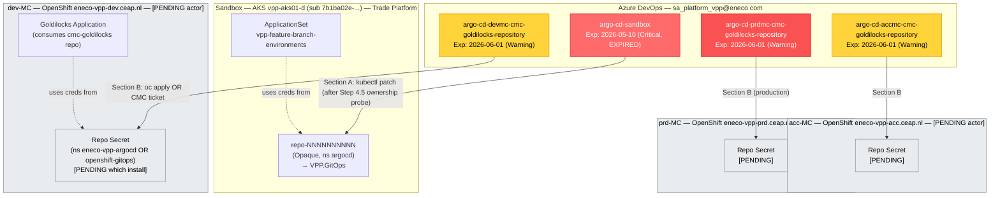

# How To Rotate the 4 Expiring ArgoCD PATs — Mastery-Grade Runbook

> **For**: Eneco on-call engineer who has to rotate one or more ArgoCD repository PATs (Personal Access Tokens) for the `sa_platform_vpp@eneco.com` service account. Today's blocker is `argo-cd-sandbox` (expired 2026-05-10, blocking Duncan + every new FBE creation on sandbox). The three MC PATs (`argo-cd-{devmc,accmc,prdmc}-cmc-goldilocks-repository`) expire 2026-06-01 and must be rotated proactively.
>
> **Bar**: after reading this doc once and executing Section A once, you should be able to (a) draw the system on a whiteboard, (b) explain why each step exists, (c) refuse the anti-patterns in real time. This is mastery, not procedure.
>
> **Evidence base**: see the companion [`draft-rotation-secrets.md`](./draft-rotation-secrets.md). Every load-bearing claim in this runbook is cited there with a vault/Slack/wiki/IaC source.
>
> **Authoring context**: this is the first canonical written procedure for rotating these PATs at Eneco. Fabrizio Zavalloni (FBE owner, Trade Platform) confirmed verbatim at 2026-05-11T12:47:35Z: *"Nope. There is no documentation for this. It is a good opportunity to create one. You can give me a call and I explain you the process."* This doc is informed by his prior oral knowledge (via vault recipe + pattern + incident notes I authored earlier today) but is INFER until he reviews it.

---

## TL;DR — the picture



There are 4 PATs to rotate, across 4 ArgoCD installations on 4 clusters. The 4 PATs all belong to the same service account `sa_platform_vpp@eneco.com`. Section A covers the **expired sandbox PAT** (must rotate today). Section B covers the **3 latent MC PATs** (must rotate before 2026-06-01); Section B has explicit `[PENDING]` blocks because the MC topology has key unknowns that only Fabrizio or CMC can resolve.

---

## Reader contract

After reading this once and running Section A once, you should:

1. **Draw the architecture from memory** — 4 PATs, 4 clusters, where they live, what consumes them, what the silent-failure chain looks like
2. **Execute Section A without re-reading the vault** — copy-paste with confidence; understand each command's purpose
3. **Reason about anti-patterns** — refuse "delete the FBE" / "restart the controller" / "just update the KV on MC" without hesitation
4. **File the right CMC ticket** (if Section B branch B-1B applies) with all required fields
5. **Defend each verification step** to a security reviewer or Fabrizio — explain what assumption it falsifies

Every step in this doc follows the **WHAT / WHY / WHY-THIS-COMMAND / WHAT-TO-EXPECT** template. AI executors MUST `AskUserQuestion` before Steps 3 (mint) and 5 (patch) — the gates are marked. Humans operating from this doc should still pause at those gates and re-read.

---

## The 60-second mental model

### What is a PAT?

A **Personal Access Token** in Azure DevOps is a long string (typically 52 characters) that authenticates ANY action as a specific user account (here: `sa_platform_vpp@eneco.com`). It is a bearer credential — possession = authority. PATs are minted in the ADO UI, have a maximum lifetime of 12 months (ADO ceiling), and can be scoped (Code Read / Build Read / etc.). The Eneco PAT-expiry monitor (ADO pipeline `myriad-vpp/devops/azure-pipelines.yml`) only watches PATs **owned by** `sa_platform_vpp@eneco.com` — PATs minted under any other identity are invisible to it.

### What is ArgoCD?

A **GitOps controller** running inside Kubernetes (or OpenShift). It continuously reconciles the cluster's state to match what's declared in a Git repository. To do that, it must be able to **read** the Git repository — and that's where the PAT comes in. ArgoCD stores repository credentials as Kubernetes `Secret` resources with a specific label `argocd.argoproj.io/secret-type: repository`. When the controller needs to fetch from a Git repo, it looks up the Secret whose `.data.url` matches the repo URL, reads `.data.username` and `.data.password` (base64-decoded), and sends them as HTTP Basic auth to Azure DevOps.

### What is an ApplicationSet?

A higher-order ArgoCD resource that **generates** `Application` resources dynamically. The `vpp-feature-branch-environments` ApplicationSet on the sandbox cluster scans a directory in the `VPP.GitOps` repo (`feature-branch-environments/*.yaml`) and generates one app-of-apps per file (one per FBE slot). Generation happens on a ~3-minute reconcile cycle. If the Git fetch fails — e.g., because the PAT expired — generation stops. **Existing apps survive** (their CRDs persist in etcd), but **newly-recycled slots never get their apps generated** → empty namespace → 404 → silent-fail.

### Why are there 4 separate PATs?

Each ArgoCD installation has its own repo credential, by ArgoCD design (per-cluster isolation). Eneco has 4 distinct ArgoCD installs:

1. **Sandbox ArgoCD** (AKS `vpp-aks01-d`) — points at `VPP.GitOps` — uses `argo-cd-sandbox` PAT
2. **dev-MC ArgoCD** (OpenShift) — points at `cmc-goldilocks` (repo `[PENDING]` C12 in draft) — uses `argo-cd-devmc-cmc-goldilocks-repository` PAT
3. **acc-MC ArgoCD** (OpenShift) — same, in acc env
4. **prd-MC ArgoCD** (OpenShift, production) — same, in prd env

Splitting per cluster is good — a compromised PAT on sandbox doesn't break prd. The tradeoff is rotation overhead (4× the work).

### What is `sa_platform_vpp@eneco.com`?

A **shared service account** managed by Trade Platform. The login credentials (password + MFA) are stored in the Trade Platform Team password vault (1Password-style, per Roel's 2026-01-23 Slack message: *"I've put the sa_platform_vpp account credentials in our Trade Platform Team vault. This is way cooler than sharing through a stupid KeyVault"*). The PATs themselves are minted **after signing in as the SA** — they are derived tokens. The vault holds the *login*, not the derivative *PATs* (per Socrates S3 attack on this exact conflation — see draft section 7 Group A).

### What is "goldilocks"?

An ArgoCD application name referenced by Roel in `#team-platform` on 2026-03-03: *"I asked him to update a PAT for me in the CMC ArgoCD instance for the Goldilocks application."* The repo content + identity is **`[PENDING: ask Fabrizio]` Group C of the draft**. Note: it is NOT the k8s VPA tool of the same name; that's an unrelated Goldilocks. Eneco's Goldilocks is likely a CCoE managed-cloud policy / version-pinning ArgoCD app, but this is unverified.

---

## The system architecture

### Where the PAT lives — the data flow

```
            ┌──────────────────────────────────────────────────────┐
            │ 1. ADO UI — sa_platform_vpp@eneco.com mints PAT      │
            │    Storage: ADO internal store + your clipboard      │
            │    Lifetime: minted → cluster apply (seconds-minutes)│
            └──────────────────────────────────────────────────────┘
                                  │
                                  ▼
            ┌──────────────────────────────────────────────────────┐
            │ 2. Trade Platform Team password vault (1Password)    │
            │    Stores: SA LOGIN (always) + new PAT (convention)  │
            │    For: future operators + recovery if cluster lost  │
            └──────────────────────────────────────────────────────┘
                                  │
                                  ▼
            ┌──────────────────────────────────────────────────────┐
            │ 3. Cluster Secret (the working copy)                 │
            │                                                      │
            │    SANDBOX (vpp-aks01-d):                            │
            │      ns argocd, Opaque Secret repo-NNNNNNNNNN        │
            │      label: argocd.argoproj.io/secret-type=repository│
            │      .data.url = base64(VPP.GitOps URL)              │
            │      .data.username = base64(sa_platform_vpp@...)    │
            │      .data.password = base64(PAT) ← ROTATION TARGET  │
            │      [PENDING B1 — ownership: who reconciles this?]  │
            │                                                      │
            │    MC clusters (eneco-vpp-{dev,acc,prd}.ceap.nl):    │
            │      ns eneco-vpp-argocd OR openshift-gitops         │
            │      [PENDING A1 — which instance]                   │
            │      [PENDING B2 — ownership]                        │
            └──────────────────────────────────────────────────────┘
                                  │
                                  ▼
            ┌──────────────────────────────────────────────────────┐
            │ 4. ArgoCD repo-server caches credentials in-memory   │
            │    Refreshed on: Secret change + reconcile cycle     │
            │    Reconcile cadence: ~3 min default for ApplicationSet│
            │    Force-refresh: argocd.argoproj.io/refresh=hard    │
            └──────────────────────────────────────────────────────┘
                                  │
                                  ▼
            ┌──────────────────────────────────────────────────────┐
            │ 5. ApplicationSet / Application reconciliation       │
            │    SANDBOX: vpp-feature-branch-environments (Git gen)│
            │    MC: goldilocks Application                        │
            └──────────────────────────────────────────────────────┘
```

### The silent-failure mechanism — why expiry is invisible until you create an FBE

```
   ┌──────────────────────────────────────────────────────────┐
   │ 1. PAT lifetime: 12 months max (ADO ceiling).            │
   │    Expiry is silent. ADO doesn't fail loudly — it just   │
   │    starts returning 401 to every reconcile.              │
   └──────────────────────────────────────────────────────────┘
                              │
                              ▼
   ┌──────────────────────────────────────────────────────────┐
   │ 2. PAT-expiry report posts in #myriad-alerts-devops      │
   │    on a schedule (ADO pipeline 2735, ~13:01 CEST daily). │
   │    Warning at 30d; Critical at 5d. The alert exists.     │
   │    The SLA does NOT. Someone has to ACT on the alert.    │
   └──────────────────────────────────────────────────────────┘
                              │
                              ▼  if not actioned in time
   ┌──────────────────────────────────────────────────────────┐
   │ 3. ApplicationSet Git generator → ADO 401 every ~3 min.  │
   │    Status condition records ErrorOccurred=True with the  │
   │    message "authentication required".                    │
   │    NO ALERT fires. This condition is INFORMATIONAL.      │
   │    The only visible surface: kubectl describe applicationset.│
   └──────────────────────────────────────────────────────────┘
                              │
                              ▼  developer triggers FBE-create
   ┌──────────────────────────────────────────────────────────┐
   │ 4. Pipeline 2412 succeeds Stages 1-6 cleanly.            │
   │    Stage 6 git-pushes feature-branch-environments/X.yaml │
   │    to VPP.GitOps. ArgoCD CAN'T read the commit (401).    │
   │    Stage 7 Pester: ns=PASS, pods=FAIL, URL=FAIL → 1/4.   │
   │    Pipeline result: partiallySucceeded (NOT failed).     │
   │    Slack posts "Infra Tests: 1/4 Success" looking like   │
   │    a downstream service problem.                         │
   └──────────────────────────────────────────────────────────┘
                              │
                              ▼  developer thinks "FBE broken"
   ┌──────────────────────────────────────────────────────────┐
   │ 5. The true root cause is 5 layers down (in ArgoCD       │
   │    controller status). Without this doc + the vault     │
   │    pattern note, diagnosis is 30-60 minutes of probing.  │
   │    With them, ~5 minutes.                                │
   └──────────────────────────────────────────────────────────┘
```

### The 3 ArgoCD installs and their secret patterns — why this matters for rotation

This is the most consequential thing to understand before rotating. The 3 installs use 3 different mechanisms to hold their repository credentials:

| Cluster | Install method | Secret apply path | Implication for rotation |
|---|---|---|---|
| **Sandbox (vpp-aks01-d)** | Kustomize + upstream `argo-cd/v2.10.5/manifests/install.yaml`; namespace `argocd` | `[PENDING B1: ownership]` — likely manual `kubectl apply` of an Opaque Secret; **but** a Helm chart at `myriad-vpp/ArgoCD-Config/Helm/repositories/templates/deployment.yaml` exists for the *same pattern* targeting MC; if a parallel Helm chart manages sandbox, `kubectl patch` will be reverted | **MUST probe ownership labels in Step 4.5** before patching |
| **MC (3× dev/acc/prd)** | OpenShift GitOps Operator CR `apiVersion: argoproj.io/v1beta1 kind: ArgoCD` at `mcc-landing-zone/gitops-vpp/gitops-vpp/main/argocd/{env}/team-vpp/eneco-vpp-argocd.yaml`; namespace `eneco-vpp-argocd`. **Coexists with a `openshift-gitops` install at namespace `openshift-gitops`** — must disambiguate | `[PENDING B2: ownership]` — likely Helm chart at the path above OR manual `oc apply`. Operator-managed Secrets may revert on reconcile | **MC rotation cannot use the sandbox kubectl-patch path blindly**; either oc-apply to upstream-source-of-truth OR file CMC ticket |
| **Asset-Scheduling** (out of scope for this task) | Bitnami SealedSecret committed at `vpp-assetoptimisation/asset-scheduling-gitops/argocd-apps/overlays/dev/assets/reposecret-assetscheduling.yaml`. Reference: shown to illustrate Eneco has 3 distinct patterns | — | — |

**Why this asymmetry exists** (mechanism, not just description): the sandbox cluster predates the MC-VPP managed-cloud migration; the team had operational freedom to install ArgoCD via Kustomize. The MC clusters are CMC-provisioned OpenShift with the Red Hat OpenShift GitOps Operator pre-installed; Trade Platform added its own `eneco-vpp-argocd` instance for team-managed apps but lives alongside the platform-managed `openshift-gitops` instance. The two installs are **independent control planes** — same cluster, different reconcilers.

The asset-scheduling cluster (out of scope here) shows a third pattern: SealedSecret. Same problem (provide a credential to ArgoCD), three different solutions, three different rotation paths.

### The ArgoCD auth-flow diagram (the part rotation actually changes)

```mermaid
sequenceDiagram
    autonumber
    participant Repo as VPP.GitOps (ADO)
    participant Server as argocd-repo-server pod
    participant Cache as in-memory cred cache
    participant Sec as Kubernetes Secret repo-NNNN
    participant Ctrl as argocd-application-controller
    participant AppSet as ApplicationSet generator

    AppSet->>Ctrl: every ~3min: "fetch feature-branch-environments/*.yaml"
    Ctrl->>Server: gRPC: fetch repo with creds
    Server->>Cache: lookup creds for URL=VPP.GitOps
    alt Cache miss OR Secret resourceVersion changed
        Server->>Sec: read /data/url + /data/password
        Sec-->>Server: (base64-decoded) PAT
        Server->>Cache: store
    end
    Server->>Repo: HTTPS GET /info/refs (Basic auth: sa_platform_vpp@:PAT)
    alt PAT expired/invalid
        Repo-->>Server: 401 Unauthorized
        Server-->>Ctrl: error "authentication required"
        Ctrl->>AppSet: condition[ErrorOccurred]=True
        AppSet-->>AppSet: skip generation; existing apps survive in etcd
    else PAT valid
        Repo-->>Server: 200 OK + git refs
        Server-->>Ctrl: refs returned
        Ctrl->>AppSet: condition[ErrorOccurred]=False; generate apps
    end
```

This is what your rotation changes: **the value in `Sec` (the Kubernetes Secret) on disk** — followed by **a cache invalidation in `Cache` (the in-memory cred cache)** — followed by **a successful 200 from `Repo`** — followed by **a successful condition flip on `AppSet`**.

**Each of these is a separate clock**, and each can fail independently. That's why the runbook has SEPARATE verification probes (Step 4 = PAT-itself is valid; Step 6 = AppSet condition flipped; Step 6.5 = controller cache picked up new value; Step 7 = downstream Applications materialized; Step 8 = end-user URL serves the app). Trusting only one probe is the failure mode Socrates S4 and el-demoledor V6+V8 attacked.

---

## When to use this runbook

Apply this runbook when ALL FIVE empirical signatures from the vault pattern doc are present (in this order — first FAIL means you're in a different failure class):

1. **FBE-create pipeline 2412 (or 2412-equivalent on MC) ended `partiallySucceeded`** (NOT `failed`).
   - *Why this signature*: if the pipeline `failed` outright, the root cause is at the IaC layer (Terraform apply error, evident in Stage 3 logs) — NOT the PAT. PAT-expiry only manifests after Stage 6 succeeds.

2. **Slack `#myriad-env-fbe` notification shows Pester `Total: 4, Success: 1, Failures: 3`**.
   - *Why this signature*: 1 success = "namespace exists"; 3 failures = "pods + URL + health". This specific 1/3 split is the fingerprint of empty namespace + missing service pods, which is downstream of "ArgoCD never generated the apps" — which is downstream of "auth broke." Other splits (2/2, 0/4, 3/1) are different failure classes.

3. **`kubectl get applications.argoproj.io -A | grep {slot}` returns nothing AND at least one other slot has child Applications.**
   - *Why this signature*: confirms the failure is per-slot generation (not cluster-wide cache wipe / etcd corruption / namespace selector issue). If ALL slots were missing, the cluster has a different problem.

4. **`kubectl get all -n {slot}` shows ONLY `docker-pull-secret` cron/job/pods.**
   - *Why this signature*: the docker-pull-secret cron is cluster-wide (separately reconciled by a platform controller); its presence + absence of everything else proves no Application has applied service manifests to the namespace. If service Deployments / Ingresses are present but unhealthy, you're in a different class (service-build failure, CVE block, etc.).

5. **`kubectl describe applicationset vpp-feature-branch-environments -n argocd | grep -A2 'ErrorOccurred'` returns a recent `lastTransitionTime` with `ApplicationGenerationFromParamsError: ... authentication required`.**
   - *Why this signature*: THIS is the smoking gun. The literal error string `authentication required` from the ArgoCD generator confirms the auth-break diagnosis. Without this probe, the diagnosis is inference.

If signatures 1-5 match → proceed with this runbook. If signature 5 is `ErrorOccurred=False` or any DIFFERENT error message → STOP. You're in a different failure class. See `[[fbe-failure-modes-catalog]]` in the vault.

For **proactive rotation of the 3 MC PATs** (06-01-2026 expiry), signatures 1-5 won't fire yet — those PATs haven't expired. Skip the signatures and proceed to Section B directly.

---

## Pre-execution gates G1-G7

ALL gates must pass before you touch a cluster. Each gate is short — read all 7 before opening any terminal.

### G1 — You have ADO authority to mint a PAT under `sa_platform_vpp@eneco.com`

- **Why**: PATs are user-scoped; only someone signed in as the SA (or with admin-mint authority) can create a PAT under that identity. Step 3 of Section A requires this.
- **How to check**: open <https://dev.azure.com/enecomanagedcloud/_usersSettings/tokens> in a private browser window; sign in as `sa_platform_vpp@eneco.com` using the credentials from the Trade Platform Team password vault. If the page loads and you can see existing PATs for that account → you have authority. If you get redirected / blocked → escalate to Fabrizio.
- **If you fail this gate** → STOP. Escalate in `#myriad-platform` with: "I need to rotate the expired `argo-cd-sandbox` PAT but I can't sign in as `sa_platform_vpp` — can someone with vault access mint it and apply Step 5 with me?"

### G2 — You have `kubectl edit/patch secrets` rights in the `argocd` namespace of the sandbox cluster

- **Why**: Step 5 of Section A patches a Kubernetes Secret. If you lack `secrets/patch` permission, the command fails with `forbidden`.
- **How to check**: `kubectl auth can-i patch secrets -n argocd --as=$(kubectl config view -o jsonpath='{.users[0].name}')` should return `yes`.
- **If you fail this gate** → STOP. Your AAD group membership likely doesn't include `sg-vpp-platform`. Escalate to Fabrizio.

### G3 — You can switch your kubectl context to `vpp-aks01-d`

- **Why**: Step 1 establishes context. If you can't get credentials, you can't probe Step 2 or patch Step 5.
- **How to check**: `az account show` returns your active subscription; `az aks list --query "[?name=='vpp-aks01-d']"` returns the cluster.
- **If you fail this gate** → STOP. Your Azure login may need refreshing (`az login`) or you may lack RBAC on the sandbox subscription (`7b1ba02e-bac6-4c45-83a0-7f0d3104922e`).

### G4 — All 5 empirical signatures (Section "When to use this runbook") are confirmed (for the reactive sandbox rotation)

- **Why**: applying this runbook to a different failure class produces silent harm.
- **How to check**: run the 5 probes from the section above.
- **If you fail this gate** → STOP. Different class; consult `[[fbe-failure-modes-catalog]]`.

### G5 — If you are an AI executor: you have committed to issuing `AskUserQuestion` before Steps 3 and 5

- **Why**: Both steps are irreversibly state-changing in a way that affects shared credential infrastructure. AskUserQuestion is the externalized gate that prevents a "shape-matching" auto-execution.
- **How**: just commit. The instruction is binding.
- **If you can't**: you should not be executing this runbook.

### G6 — Two-question Fabrizio DM has been sent and answered (per Socrates S2 + S3)

This gate exists because the runbook's premise rests on Fabrizio's verbatim "no documentation" — which is bounded by search scope. Before publishing the rotated state to the team, ask:

> *"Quick check before I rotate the sandbox PAT — is there anything in `Platform-team-internal` wiki, a canvas in #team-platform, or in the Trade Platform Team vault NOTES (not just the SA credential), that documents the rotation? Want to make sure I extend rather than duplicate. Also: when you renew, do you sign in as `sa_platform_vpp` interactively, or is there an automated mint flow? And for the MC PATs — do you mint and hand to CMC, or does CMC mint them via their own SA?"*

- **Why**: (a) avoid duplicating an existing doc; (b) confirm mint authority model; (c) confirm Section B branching.
- **If Fabrizio's answer changes the route**: revise this runbook before executing. Specifically: if a Platform-team-internal page exists with a different procedure, this doc becomes a corroborating note, not the source-of-truth.
- **If you cannot reach Fabrizio AND the rotation is blocking Duncan NOW** → proceed with Section A (sandbox-only) but mark this gate as `[DEFERRED: Fabrizio unreachable]` in the post-rotation documentation. Do NOT execute Section B without G6.

### G7 — Ownership of the live sandbox Secret has been probed (per Socrates S1 + el-demoledor V5)

You will do this formally at Step 4.5, but you should ALSO mentally accept that **the recipe's `kubectl patch` is conditional on the Secret being unmanaged**. If at Step 4.5 you discover Helm/Operator/SealedSecret ownership, you will STOP and switch to a different rotation path. Commit to that branch now.

---

## SECTION A — Rotating `argo-cd-sandbox` (the expired one, blocking Duncan)

> **Total expected wall-time**: 15-25 minutes for the rotation itself; +5-10 minutes for verification. Time budget for service pods to come up: 2-10 minutes depending on whether the CVE-blocked service builds resolve.
>
> **Worked example**: 2026-05-11 kidu incident — see [`[[2026-05-11-pat-expiry-argocd-auth-break]]`](../../../../../Documents/obsidian/2-areas/work-eneco/eneco-vpp-platform/fbe-errors/2026-05-11-pat-expiry-argocd-auth-break.md).

### Step 1 — Establish the right cluster context

**WHAT this step does**: Switches your local `kubectl` to point at the sandbox AKS cluster `vpp-aks01-d`, and verifies the switch worked. It also verifies the API server endpoint to defend against a stale cached endpoint (el-demoledor V1).

**WHY this step is here**: every subsequent kubectl command depends on the active context. If your kubectl points at a different cluster (e.g., an MC cluster, a personal lab cluster, a previously-decommissioned cluster with a re-used name), you will patch the wrong Secret in Step 5 and never realize it — until ApplicationSet on the real sandbox cluster keeps failing. Verifying the API server FQDN catches the cache-staleness case where the context name is right but the endpoint is wrong.

**Command**:

```bash
# 1.1 Set subscription
az account set --subscription 7b1ba02e-bac6-4c45-83a0-7f0d3104922e

# 1.2 Resolve the cluster's resource group (avoids hard-coding)
AKS_RG=$(az aks list --query "[?name=='vpp-aks01-d'].resourceGroup | [0]" -o tsv)
echo "AKS_RG=$AKS_RG"

# 1.3 Fetch fresh credentials (--overwrite-existing defeats stale-cache)
az aks get-credentials --resource-group "$AKS_RG" --name vpp-aks01-d --overwrite-existing

# 1.4 Verify context
kubectl config current-context
# Expected: vpp-aks01-d

# 1.5 Verify the cached API server endpoint matches the live AKS FQDN
LIVE_FQDN=$(az aks show -n vpp-aks01-d -g "$AKS_RG" --query fqdn -o tsv)
CACHED_SERVER=$(kubectl config view --minify -o jsonpath='{.clusters[0].cluster.server}')
echo "LIVE FQDN:    $LIVE_FQDN"
echo "CACHED:       $CACHED_SERVER"
# CACHED_SERVER should contain LIVE_FQDN as substring
```

**WHY these specific commands**:

- `az account set` — Eneco engineers often have multiple subscriptions; explicit is better than implicit. The subscription ID is the immutable identifier; the display name can change.
- `az aks list --query`(JMESPath) — avoids hard-coding the RG. The same script works if the RG is ever renamed.
- `--overwrite-existing` — defeats the "cached endpoint" failure mode el-demoledor V1 surfaced: if you previously had access to a decommissioned `vpp-aks01-d` in a different RG/sub, your kubeconfig may still hold its server URL and AAD token.
- `kubectl config current-context` ALONE is insufficient because context name matching is a string match, not an endpoint match — hence steps 1.5 (live FQDN vs cached server).

**WHAT to expect**:

- `AKS_RG` resolves to `rg-vpp-app-sb-401`
- `az aks get-credentials` outputs: `Merged "vpp-aks01-d" as current context in /Users/.../.kube/config`
- `kubectl config current-context` returns: `vpp-aks01-d`
- `LIVE FQDN` and `CACHED` BOTH show the same `*.hcp.westeurope.azmk8s.io` FQDN (or whichever region)
- Time budget: 5-10 seconds total

**Decision rule**:

- All probes match → **continue to Step 2**
- `AKS_RG` is empty → STOP. Either your subscription is wrong or the cluster name has changed. Re-check `az account show` then ask Fabrizio
- Context name matches but `LIVE FQDN` ≠ `CACHED` substring → STOP. Re-run `az aks get-credentials` with `--overwrite-existing` (which step 1.3 already did — if still mismatched, your AKS instance may have been recreated; ask Fabrizio about the cluster's history)

### Step 2 — Identify the right repository Secret

**WHAT this step does**: Lists all Secrets in the `argocd` namespace that carry the `argocd.argoproj.io/secret-type=repository` label, decodes their URLs, and locates the one whose URL matches the ApplicationSet's `repoURL` field byte-for-byte.

**WHY this step is here**: there can be multiple repository Secrets in the namespace (per el-demoledor V2, the Helm chart pattern proves multiple coexist). The vault recipe's substring-match (`URL contains VPP.GitOps`) can produce false positives if a developer ever added a forked-repo Secret. We anchor on the ApplicationSet's *exact* `repoURL` because that's the literal URL the ArgoCD generator looks up — there is no ambiguity.

**Command**:

```bash
# 2.1 Get the exact repoURL the ApplicationSet looks up
EXPECTED_URL=$(kubectl get applicationset vpp-feature-branch-environments -n argocd \
  -o jsonpath='{.spec.generators[*].git.repoURL}')
echo "EXPECTED_URL=$EXPECTED_URL"

# 2.2 Enumerate all repository-typed Secrets in the argocd namespace
echo "--- repository-typed Secrets in argocd namespace ---"
for s in $(kubectl get secret -n argocd -l argocd.argoproj.io/secret-type=repository -o name); do
  URL=$(kubectl get $s -n argocd -o jsonpath='{.data.url}' | base64 -d 2>/dev/null)
  USER=$(kubectl get $s -n argocd -o jsonpath='{.data.username}' | base64 -d 2>/dev/null)
  printf "%-40s URL=%s  USER=%s\n" "$s" "$URL" "$USER"
done

# 2.3 Find the Secret whose .data.url byte-equals EXPECTED_URL
MATCH=$(for s in $(kubectl get secret -n argocd -l argocd.argoproj.io/secret-type=repository -o name); do
  URL=$(kubectl get $s -n argocd -o jsonpath='{.data.url}' | base64 -d 2>/dev/null)
  [ "$URL" = "$EXPECTED_URL" ] && echo "$s"
done)
echo "MATCH=$MATCH (must be exactly 1 line)"

# 2.4 Save the match into a variable for later steps
ARGOCD_REPO_SECRET=$(echo "$MATCH" | sed 's|secret/||')
echo "Will rotate PAT inside: $ARGOCD_REPO_SECRET"
```

**WHY these specific commands**:

- `jsonpath='{.spec.generators[*].git.repoURL}'` — ApplicationSet's spec is the authoritative source for "which repo URL ArgoCD expects." This is the same field the controller reads; using it eliminates any divergence between operator memory and runtime state.
- Equality `[ "$URL" = "$EXPECTED_URL" ]` — defeats el-demoledor V2's substring-match attack. Two URLs containing `VPP.GitOps` (e.g., `VPP.GitOps` and `VPP.GitOps.OldFork`) will both match a substring; only one byte-equals `EXPECTED_URL`.
- `sed 's|secret/||'` — `kubectl get -o name` prefixes with `secret/`; we strip it for clean variable usage in later kubectl patch calls.

**WHAT to expect**:

- `EXPECTED_URL` is a URL like `https://dev.azure.com/enecomanagedcloud/Myriad%20-%20VPP/_git/VPP.GitOps` (with URL-encoded `%20` for spaces)
- The Secret listing shows 1 or more rows; the matching row likely has `USER=sa_platform_vpp@eneco.com`
- `MATCH` is exactly one line (e.g., `secret/repo-1234567890`)
- `ARGOCD_REPO_SECRET` is the name without the `secret/` prefix
- Time budget: 5-10 seconds

**Decision rule**:

- Exactly 1 line in `MATCH` → **continue to Step 3**
- 0 lines in `MATCH` → STOP. Two possibilities: (a) the ApplicationSet's `repoURL` field is empty (configuration drift; check `kubectl get applicationset vpp-feature-branch-environments -n argocd -o yaml`); (b) ArgoCD is using declarative repo registration via `argocd-cm` ConfigMap — different mechanism, different rotation path. Check `kubectl get configmap argocd-cm -n argocd -o yaml | grep -A5 vpp.gitops`.
- 2+ lines in `MATCH` → STOP. Multiple Secrets claim the same URL — data integrity issue. Investigate which is the "live" one before patching either. This case is rare but possible after configuration drift.

### Step 3 — Mint a new PAT in Azure DevOps

**WHAT this step does**: Opens the Azure DevOps PAT creation UI, signs in as `sa_platform_vpp@eneco.com`, mints a new PAT with `Code Read` scope and 1-year expiry, copies the value into a transient shell variable, and immediately probes the new PAT to confirm it was minted under the right identity.

**WHY this step is here**: this is the ONLY step that creates the new credential. The PAT can't be generated via API in a way that returns the value (ADO security model) — it must be minted in the UI and the secret value captured at mint time. Once you close the page, the value is gone. The post-mint identity probe defends against el-demoledor V3: the modal failure for SA PAT minting is "you forgot to switch users in the ADO UI and minted a PAT under your personal account."

**AskUserQuestion gate (AI executors)**: before this step, AI executors MUST issue:

> *"About to mint a new PAT under sa_platform_vpp@eneco.com in Azure DevOps. Confirm: (a) you have authority to do this; (b) you are NOT signed into ADO as your personal account (or you have switched to the SA's session); (c) the Trade Platform Team password vault has the SA's MFA available. Proceed?"*

**Manual UI steps (cannot be safely automated)**:

1. Open <https://dev.azure.com/enecomanagedcloud/_usersSettings/tokens> in a **private/incognito browser window**.
2. Sign in as `sa_platform_vpp@eneco.com` using the password from the Trade Platform Team password vault. Complete MFA if prompted.
3. **VERIFY** the user picker (top-right of ADO UI) shows `sa_platform_vpp@eneco.com`. If it shows your personal email — STOP. Close the window and start over in a different private window.
4. Click **New Token**.
   - **Name**: `argo-cd-sandbox` (NOTE: keep the EXACT existing name; el-demoledor V10 — the monitoring pipeline filters by name; a date-suffix breaks the filter).
   - **Organization**: `enecomanagedcloud`.
   - **Expiration**: 1 year (the maximum ADO permits; today + 364 days).
   - **Scopes**: **Code → Read** ONLY. Do NOT grant write, admin, or any other scopes.
5. Click **Create**. **Copy the PAT value immediately** (it appears once).

**Command (capture + identity probe)**:

```bash
# 3.1 Save the new PAT in a transient variable (input hidden)
read -s -p "Paste the new PAT (input is hidden): " NEW_PAT
echo
echo "PAT length: ${#NEW_PAT}"
# Expected: 52

# 3.2 IDENTITY PROBE — per el-demoledor V3 — confirm the PAT was minted under sa_platform_vpp
MINTED_AS=$(curl -sH "Authorization: Basic $(echo -n :$NEW_PAT | base64)" \
  "https://dev.azure.com/enecomanagedcloud/_apis/connectionData?connectOptions=includeServices&api-version=7.1" \
  | jq -r '.authenticatedUser.providerDisplayName' 2>/dev/null)
echo "MINTED_AS=$MINTED_AS"
# Expected: sa_platform_vpp@eneco.com (or the SA's display name)
```

**WHY these specific commands**:

- `read -s` — hides PAT from terminal history; pastes into a shell variable instead of being written to a file or echoed.
- The `connectionData` API probe — this is the cheapest way to confirm "whose token is this?" The endpoint returns the `authenticatedUser` field reflecting the actual mint identity. If it says your personal email, you minted the wrong PAT — and a personal-PAT-in-the-cluster has the long-tail offboarding failure el-demoledor V3 (3) described.
- `Code Read` scope — minimum-privilege principle. Wider scopes increase blast radius if the PAT leaks. Note: per V3 (4), Code Read in ADO is **organization-wide** (covers every repo `sa_platform_vpp` has access to); there's no per-repo scoping. That's an ADO limitation; flag for the proposal.
- 1-year expiry — ADO ceiling. Pick maximum because rotation friction is the problem; shorter expiry compounds it.

**WHAT to expect**:

- ADO PAT creation page returns a new token; you copy it
- `${#NEW_PAT}` returns `52`. If different → re-mint; you may have copied with trailing whitespace
- `MINTED_AS` shows `sa_platform_vpp@eneco.com` (the SA's email or display name in ADO)
- Time budget: 2-5 minutes for the manual UI step

**Decision rule**:

- `${#NEW_PAT} == 52` AND `MINTED_AS == sa_platform_vpp@eneco.com` → **continue to Step 4**
- Length wrong → re-mint; check for whitespace, trailing newline, double-pasted token
- `MINTED_AS` is YOUR email → STOP. You minted a personal PAT. Revoke it immediately (back in the same ADO UI: find the token, click Revoke). Re-do Step 3 in a different private window with correct SA sign-in.
- `MINTED_AS` is empty or curl returned error → ADO API may be unreachable from your egress (per el-demoledor V4 — IP-restricted PAT policy). Proceed to Step 4 anyway; if Step 4 also fails, file `[PENDING D2: IP-restricted-PAT policy?]` to Fabrizio.

### Step 4 — Validate the new PAT against the actual repo

**WHAT this step does**: Uses the new PAT to fetch the git refs from the VPP.GitOps repository via HTTPS. This is a read-only operation — it doesn't change anything in the cluster or the repo. It proves the PAT has the right scope and the right identity for the specific repo we care about.

**WHY this step is here**: this is the cheapest pre-flight that catches a bad PAT BEFORE it goes into the cluster. If we skipped it and went straight to Step 5 (patch the cluster Secret), a bad PAT would silently break ArgoCD again and you'd be 30 minutes into diagnosis before realizing the new PAT was as bad as the old.

**Command**:

```bash
# 4.1 Read the URL the Secret currently points at
URL=$(kubectl get secret "$ARGOCD_REPO_SECRET" -n argocd -o jsonpath='{.data.url}' | base64 -d)
echo "URL: $URL"

# 4.2 Test fetching the git refs (read-only)
curl -sI -u ":${NEW_PAT}" "${URL}/info/refs?service=git-upload-pack" | head -5
```

**WHY these specific commands**:

- We re-read the URL from the Secret rather than re-constructing it because the Secret is the source-of-truth for "what the cluster will look up." If a stale URL is in the Secret, we want to know now, not later.
- `curl -sI` — head-only request; we just need the HTTP status, not the full git protocol response.
- `-u ":${NEW_PAT}"` — ADO accepts HTTP Basic with empty username + PAT as password. This is the same auth shape ArgoCD's repo-server uses.
- `/info/refs?service=git-upload-pack` — the standard "smart HTTP" git endpoint for fetching refs without cloning. It's the lightest read that exercises auth.

**WHAT to expect**:

- The first line of output is `HTTP/2 200` (or `HTTP/1.1 200 OK` depending on negotiation).
- Subsequent lines include git protocol headers like `Content-Type: application/x-git-upload-pack-advertisement`.
- Time budget: <2 seconds.

**Decision rule**:

- `HTTP/2 200` → **the PAT works** → continue to Step 4.5
- `HTTP/2 401` or `HTTP/1.1 401 Unauthorized` → the PAT is invalid OR `sa_platform_vpp` lacks `Code Read` on this specific repo. Re-check Step 3 scopes (you might have created the token without ticking the Code Read box). Do NOT proceed.
- `HTTP/2 403 Forbidden` → the PAT authenticated but doesn't have read permission. Re-check the SA's repo permissions in ADO (might be missing from a project team).
- Connection error / timeout → your network can't reach `dev.azure.com`. Try from a different network OR check for IP-restricted-PAT policy (per `[PENDING D2]`).

### Step 4.5 — Probe the Secret's ownership labels (the el-demoledor V5 + Socrates S1 mandatory gate)

**WHAT this step does**: Reads the metadata labels, annotations, and ownerReferences on the target Secret. We're checking whether any reconciler (Helm, Kustomize, OpenShift GitOps Operator, SealedSecret controller, an ArgoCD Application managing it as a child resource) considers this Secret "its own." If yes, our `kubectl patch` in Step 5 will be silently reverted on the next sync cycle — minutes to hours later — and the rotation will appear successful for a window before failing again.

**WHY this step is here**: this is the single most-important defense against the "rotation works for 30 minutes then breaks at 3 AM" failure mode. The smoking gun is the Helm chart at `myriad-vpp/ArgoCD-Config/Helm/repositories/templates/deployment.yaml` (IaC sidecar lines 36-51) which renders Secrets with the same `argocd.argoproj.io/secret-type=repository` label that we're patching. We don't *know* for sure that this Helm chart manages the sandbox Secret (vault recipe assumes not) — but el-demoledor V5 is EXPLOIT-VERIFIED in the sense that the chart definitely exists and the cost of NOT probing is catastrophic silent failure. Probing is free.

**Command**:

```bash
# 4.5.1 Inspect ownership metadata
kubectl get secret "$ARGOCD_REPO_SECRET" -n argocd -o json | \
  jq '{
    name: .metadata.name,
    managedBy: (.metadata.labels["app.kubernetes.io/managed-by"] // "none"),
    helmReleaseName: (.metadata.annotations["meta.helm.sh/release-name"] // "none"),
    helmReleaseNamespace: (.metadata.annotations["meta.helm.sh/release-namespace"] // "none"),
    argocdTrackingId: (.metadata.annotations["argocd.argoproj.io/tracking-id"] // "none"),
    argocdInstance: (.metadata.labels["argocd.argoproj.io/instance"] // "none"),
    ownerReferences: (.metadata.ownerReferences // [] | length)
  }'

# 4.5.2 Check if any Application manages this Secret as a tracked resource
kubectl get applications.argoproj.io -A -o json | \
  jq -r --arg secname "$ARGOCD_REPO_SECRET" \
  '.items[] | select(.status.resources[]?.name == $secname) | "\(.metadata.namespace)/\(.metadata.name) tracks \($secname)"'
```

**WHY these specific commands**:

- `app.kubernetes.io/managed-by` label — Kubernetes standard for "this resource is managed by tool X". Helm always sets `Helm`; Kustomize doesn't always set it but often does.
- `meta.helm.sh/release-name` / `release-namespace` annotations — Helm 3+ always sets these on objects it owns.
- `argocd.argoproj.io/tracking-id` annotation — set by ArgoCD on resources tracked by an Application. If set, an ArgoCD Application will revert any out-of-band change.
- `argocd.argoproj.io/instance` label — older ArgoCD versions use this for tracking; modern uses `tracking-id` annotation.
- `ownerReferences` — Kubernetes-native parent-child reference. If non-empty, a controller (CRD-defined) owns this Secret.
- The Applications cross-check (4.5.2) — captures the case where the Secret has no ownership labels but is REFERENCED in an Application's `status.resources` (managed indirectly).

**WHAT to expect (the success case)**:

```json
{
  "name": "repo-1234567890",
  "managedBy": "none",
  "helmReleaseName": "none",
  "helmReleaseNamespace": "none",
  "argocdTrackingId": "none",
  "argocdInstance": "none",
  "ownerReferences": 0
}
```

And the second command returns ZERO lines.

Time budget: <5 seconds.

**Decision rule**:

- **ALL ownership fields are `"none"` AND the second command returns nothing** → the Secret is unmanaged → **continue to Step 5 (your patch will stick)**.
- **ANY ownership field is non-`"none"`** OR **second command returns ≥1 line** → STOP. The Secret is reconciled by another controller. Your `kubectl patch` will be reverted. Take the alternative path:
  - If `managedBy: Helm` AND `helmReleaseName != "none"` → find the Helm release (`helm list -A | grep <release-name>`), find its values source (likely a pipeline secrets store or a separate Git repo), update there, then `helm upgrade` (or wait for the next pipeline run to re-render).
  - If `argocdTrackingId != "none"` → find the Application (the tracking-id encodes the Application's name + namespace), update the Secret in its source repo, let ArgoCD sync.
  - If `ownerReferences` is non-empty → look at the owner kind (it's in the `ownerReferences` array, which we counted but didn't list — re-run `kubectl get secret $ARGOCD_REPO_SECRET -n argocd -o yaml | grep -A5 ownerReferences`) and follow that controller's rotation path.
  - If SealedSecret — there will be a `bitnami.com/sealed-secrets-*` annotation; the rotation is "create new SealedSecret, commit to git, let controller re-decrypt."
  - In any of these cases — **document the discovery and ESCALATE** (`#myriad-platform`) before proceeding. This is the moment to fall back to "call Fabrizio per his offer."

### Step 5 — Patch the Kubernetes Secret with the new PAT

> **TL;DR — the single rotation command** (after Step 4 + Step 4.5 pass):
> ```bash
> kubectl patch secret "$ARGOCD_REPO_SECRET" -n argocd --type=json \
>   -p="[{\"op\":\"replace\",\"path\":\"/data/password\",\"value\":\"$(printf '%s' "$NEW_PAT" | base64 | tr -d '\n')\"}]"
> ```
> The full step below adds: label-guard, resourceVersion capture (for Step 6.5), round-trip verify. Read the full step before running — the TL;DR is for re-runs, not first-time.

> **DESTRUCTIVE — updates a credential in the cluster. AskUserQuestion gate REQUIRED for AI executors.**

**WHAT this step does**: Replaces the `data.password` field of the target Secret with the base64-encoded new PAT. Leaves `url` and `username` intact. Then verifies the new value round-trips correctly.

**WHY this step is here**: this is the rotation itself. After Step 5 succeeds and the controller picks up the change, ArgoCD will start using the new PAT for repo auth.

**AskUserQuestion gate (AI executors)**:

> *"About to patch the Secret `$ARGOCD_REPO_SECRET` in namespace `argocd` with the new PAT. Confirm: (a) Step 4 returned HTTP 200; (b) Step 4.5 returned all-`none` ownership (no Helm/Operator/Application/SealedSecret reverter); (c) `$ARGOCD_REPO_SECRET` matches `argocd.argoproj.io/secret-type=repository` label (not just name). Proceed?"*

**Command**:

```bash
# 5.1 Label guard (defense-in-depth; better than name guard per el-demoledor V2)
LABEL=$(kubectl get secret "$ARGOCD_REPO_SECRET" -n argocd \
  -o jsonpath='{.metadata.labels.argocd\.argoproj\.io/secret-type}')
case "$LABEL" in
  repository) echo "Label guard PASS: secret-type=repository" ;;
  *)
    echo "ABORT: secret does not carry argocd.argoproj.io/secret-type=repository (got: $LABEL)"
    return 1 2>/dev/null || exit 1
    ;;
esac

# 5.2 Capture pre-patch resourceVersion (for Step 6.5 delta check)
PRE_RV=$(kubectl get secret "$ARGOCD_REPO_SECRET" -n argocd -o jsonpath='{.metadata.resourceVersion}')
echo "PRE_RV=$PRE_RV"

# 5.3 Base64-encode the PAT (no trailing newline)
NEW_PAT_B64=$(printf '%s' "$NEW_PAT" | base64 | tr -d '\n')

# 5.4 Patch only the password field
kubectl patch secret "$ARGOCD_REPO_SECRET" -n argocd \
  --type=json \
  -p="[{\"op\":\"replace\",\"path\":\"/data/password\",\"value\":\"${NEW_PAT_B64}\"}]"

# 5.5 Round-trip check: new value decodes to 52 chars
ACTUAL_LEN=$(kubectl get secret "$ARGOCD_REPO_SECRET" -n argocd \
  -o jsonpath='{.data.password}' | base64 -d | wc -c)
echo "ACTUAL_LEN=$ACTUAL_LEN (expected 52)"

# 5.6 Capture post-patch resourceVersion (must be greater)
POST_RV=$(kubectl get secret "$ARGOCD_REPO_SECRET" -n argocd -o jsonpath='{.metadata.resourceVersion}')
echo "POST_RV=$POST_RV (must be > PRE_RV=$PRE_RV)"
```

**WHY these specific commands**:

- **Label guard** (5.1) instead of name guard — el-demoledor V2: the name pattern `repo-*` is ArgoCD convention but not enforcement. A Helm chart might name the Secret `acr-helm` or anything else; what makes it "an ArgoCD repository Secret" is the `argocd.argoproj.io/secret-type=repository` label. Guard on the label, not the name.
- **resourceVersion capture** (5.2, 5.6) — Step 6.5 will check that the patch actually changed the Secret's `resourceVersion` (it should, but if the value was identical somehow or RBAC silently dropped the patch, the version wouldn't move).
- `--type=json` with a JSON Patch op — surgical replacement of one field. The alternative (`--type=merge` with a YAML patch) is less explicit and can introduce drift. JSON Patch makes the intent crystal-clear.
- `printf '%s'` instead of `echo` — `echo` appends a trailing newline; we explicitly do NOT want that in the base64 input.
- `tr -d '\n'` — strips line wrapping that some `base64` implementations add for human readability.

**WHAT to expect**:

- Label guard prints `PASS`
- `PRE_RV` is some integer (e.g., `12345678`)
- `kubectl patch` returns: `secret/repo-1234567890 patched`
- `ACTUAL_LEN` prints `52`
- `POST_RV` is greater than `PRE_RV` (typically by 1)
- Time budget: <5 seconds

**Decision rule**:

- Label guard PASS + patch succeeds + `ACTUAL_LEN == 52` + `POST_RV > PRE_RV` → **continue to Step 6**
- Label guard ABORTS → re-do Step 2 (you likely have the wrong Secret name)
- Patch errors (RBAC, conflicts) → STOP. Re-check G2 gate; if RBAC is right, may be a Kubernetes API server issue
- `ACTUAL_LEN != 52` → STOP. The patch silently corrupted the value (maybe `NEW_PAT` had whitespace). Re-run Step 5.3 and 5.4
- `POST_RV == PRE_RV` → the patch had no effect (maybe the value was unchanged because you're re-running with the SAME PAT). Investigate

**Clean up the in-memory PAT**:

```bash
unset NEW_PAT NEW_PAT_B64
```

Do this NOW. The PAT no longer needs to live in your shell — it's safely in the cluster Secret. Per current convention (see Step 9), do NOT also store the PAT value in the team password vault; only the rotation metadata is stored there.

### Step 6 — Force-refresh the ApplicationSet and watch the condition flip

**WHAT this step does**: Annotates the `vpp-feature-branch-environments` ApplicationSet with `argocd.argoproj.io/refresh=hard` to trigger an immediate reconcile, then polls the `ErrorOccurred` condition for up to ~3 minutes waiting for it to flip to `False` with a fresh `lastTransitionTime`.

**WHY this step is here**: without the annotation, the next reconcile happens at the natural ~3-minute cadence — we don't want to wait. The condition flip is one signal (not the only one — see Step 6.5) that ArgoCD has re-attempted auth and succeeded.

**Command**:

```bash
# 6.1 Annotate ApplicationSet to trigger immediate reconcile
kubectl annotate applicationset vpp-feature-branch-environments -n argocd \
  argocd.argoproj.io/refresh=hard --overwrite

# 6.2 Poll for up to 12×15s = 3 min (extended from vault recipe's 90s per el-demoledor V6)
echo "Polling ApplicationSet condition (timeout ~3min)..."
for i in $(seq 1 12); do
  sleep 15
  STATUS=$(kubectl get applicationset vpp-feature-branch-environments -n argocd \
    -o jsonpath='{.status.conditions[?(@.type=="ErrorOccurred")].status}')
  TIME=$(kubectl get applicationset vpp-feature-branch-environments -n argocd \
    -o jsonpath='{.status.conditions[?(@.type=="ErrorOccurred")].lastTransitionTime}')
  echo "$(date -u +%H:%M:%S) iter=$i ErrorOccurred=$STATUS (lastTransition=$TIME)"
  [ "$STATUS" = "False" ] && echo "OK: AppSet ErrorOccurred=False" && break
done

# 6.3 Generator-output probe (additional signal per el-demoledor V6)
echo "--- ApplicationSet generator status ---"
kubectl get applicationset vpp-feature-branch-environments -n argocd \
  -o jsonpath='{.status.resources[*]}{"\n"}' | tr ' ' '\n' | head -20
```

**WHY these specific commands**:

- `argocd.argoproj.io/refresh=hard` (not `=normal`) — forces a re-fetch from Git even if the controller thinks the cached commit is current. Necessary because the controller's failure mode was AUTH (it couldn't fetch at all); the hard refresh forces the auth-retry path.
- `--overwrite` — annotations are key-value; if the key already exists, the patch is a no-op without `--overwrite`. We need each rotation to force a fresh transition.
- 12×15s polling vs vault recipe's 6×15s (90s ceiling) — el-demoledor V6 attack: 90s is insufficient if the Argo reconcile cycle's worst case is 3 minutes and you happened to annotate just after the most recent cycle. We extend to MAX(180s, ~6× reconcile interval).
- Generator-output probe (6.3) — single condition flip is not enough; also check that the generator is producing resources. If ErrorOccurred=False but `status.resources` is empty, something else is wrong.

**WHAT to expect**:

- Annotate command returns: `applicationset.argoproj.io/vpp-feature-branch-environments annotate`
- Polling iteration prints lines like: `12:50:15 iter=1 ErrorOccurred=True (lastTransition=2026-05-10T12:40:13Z)` initially
- After 1-3 iterations: `ErrorOccurred=False (lastTransition=2026-05-11T12:51:00Z)` — note the timestamp is post-patch and recent
- Generator-output probe returns `name=kidu-app-of-apps`, `name=afi-app-of-apps`, etc. — one per slot the ApplicationSet generates
- Time budget: 15s-3min

**Decision rule**:

- `ErrorOccurred=False` AND `lastTransitionTime` is within the last 3 minutes (post-patch) AND generator-output is non-empty → **continue to Step 6.5**
- Status stays `True` for the full 3min → STOP. Either the patch didn't take effect at the controller level (proceed to Step 6.5 to investigate), or the PAT is bad despite Step 4 success (e.g., cluster egress IP is restricted; revisit `[PENDING D2]`), or there's a SECOND repository Secret somewhere with a different stale credential ArgoCD also tries
- `ErrorOccurred=False` but with `lastTransitionTime` BEFORE you started rotating → false positive (stale-cache flicker per el-demoledor V6/Socrates S4 two-clock). Wait one more reconcile cycle and re-check, OR proceed to Step 6.5 which catches this

### Step 6.5 — Two-clock verification (the Socrates S4 mandatory gate)

**WHAT this step does**: Verifies that the ArgoCD repo-server has actually picked up the new credential and is using it — not just that the ApplicationSet's status condition flipped. We probe ArgoCD's view of the repository connection state and check the controller's logs for evidence it re-read the Secret.

**WHY this step is here**: the ApplicationSet condition (Step 6) is one clock. ArgoCD's in-memory credential cache (read by `argocd-repo-server`) is a *different* clock. A condition can flip to `False` due to a transient retry on stale cache, while the controller continues to use the OLD PAT for subsequent reconciles. Trusting only Step 6's signal can produce false-success that breaks 30 minutes later. This step closes that gap.

**Command**:

```bash
# 6.5.1 Probe the repo connection state via ArgoCD CLI (if available)
# This is the most direct probe — it asks ArgoCD itself "is this repo reachable?"
if command -v argocd >/dev/null; then
  # Make sure you're logged into argocd CLI first (e.g., argocd login argocd.dev.vpp.eneco.com)
  argocd repo get "$URL" --grpc-web -o json 2>/dev/null | \
    jq '{repoURL: .repo, connectionState: .connectionState}'
else
  echo "argocd CLI not available; falling back to in-cluster probe"
  kubectl exec -n argocd deploy/argocd-repo-server -- \
    sh -c "git ls-remote $URL 2>&1 | head -5"
fi

# 6.5.2 Controller log evidence — did it actually read the Secret?
echo "--- argocd-application-controller recent logs mentioning the Secret ---"
kubectl logs -n argocd deploy/argocd-application-controller --since=2m 2>/dev/null | \
  grep -E "secret.*$ARGOCD_REPO_SECRET|reconciled.*$ARGOCD_REPO_SECRET" | head -5

echo "--- argocd-repo-server recent logs ---"
kubectl logs -n argocd deploy/argocd-repo-server --since=2m 2>/dev/null | \
  grep -E "fetched|refs|authentication|401" | tail -10

# 6.5.3 resourceVersion delta confirmation (we already have PRE_RV from Step 5.2)
NOW_RV=$(kubectl get secret "$ARGOCD_REPO_SECRET" -n argocd -o jsonpath='{.metadata.resourceVersion}')
echo "PRE_RV=$PRE_RV POST_RV=$POST_RV NOW_RV=$NOW_RV"
# If NOW_RV != POST_RV, something else has modified the Secret since you patched
# (could be a Helm/Operator/Application reverting — see Step 4.5)
```

**WHY these specific commands**:

- `argocd repo get ... connectionState` — this is the ArgoCD-native question "is this repo reachable RIGHT NOW with current cached credentials?" The `connectionState.status` value is `Successful` when ArgoCD has just verified the connection works, `Failed` otherwise. `connectionState.attemptedAt` shows when the last test ran.
- Fallback to `kubectl exec ... git ls-remote` — if you don't have argocd CLI installed locally, exec into the repo-server pod and run a git fetch with the credentials *as the server reads them from its watcher*. This bypasses any local CLI shenanigans.
- Controller + repo-server logs — direct evidence that the controllers re-read the Secret. The repo-server log will show new `fetched` lines with no `authentication` failures after the rotation.
- `NOW_RV` check — defense against the case where, AFTER your patch (Step 5.6 recorded `POST_RV`), a reconciler (Helm, Operator, Application) has reverted the Secret. If `NOW_RV != POST_RV`, something else modified it — possibly bringing back the OLD PAT.

**WHAT to expect**:

- `connectionState.status: Successful` with `connectionState.attemptedAt` within the last 1-2 minutes
- Controller logs show entries like `Reconciliation completed` for the AppSet without auth errors
- repo-server logs show `fetched refs` with no 401s
- `NOW_RV == POST_RV` (the Secret hasn't been changed since your patch)
- Time budget: 5-15 seconds

**Decision rule**:

- `connectionState.status: Successful` AND `attemptedAt` is post-patch AND repo-server logs show no 401s AND `NOW_RV == POST_RV` → **continue to Step 7**
- `connectionState.status: Failed` AND `connectionState.message` contains `authentication required` → the controller still has the OLD PAT cached (rare, but possible). Force a repo-server pod restart: `kubectl rollout restart deploy/argocd-repo-server -n argocd`, then re-run 6.5 after ~30s. Note: this is the ONE legitimate restart in this runbook; it does not contradict the "do not restart controllers" anti-pattern because here we have a specific cache-clear purpose.
- `NOW_RV != POST_RV` → STOP. Something has modified the Secret since you patched it. Re-run Step 4.5 — there is a reconciler. Your rotation will not stick.

### Step 7 — Verify the child Applications materialize with the right health

**WHAT this step does**: For each affected slot, polls for the child `Application` CRDs to appear AND reach `Sync: Synced` + `Health: Healthy` status. Goes beyond "did Apps appear" (the vault recipe's check) to "are they actually working."

**WHY this step is here**: el-demoledor V7 — counting Application CRDs alone doesn't tell you they're functional. An Application can be present-but-Degraded (e.g., a pre-sync hook failed). For mastery, you must check sync + health, not just count.

**Command**:

```bash
SLOT=kidu   # change to the slot you're rotating for (or loop for multiple)

echo "Watching $SLOT app-of-apps + child Applications (up to 5 min)..."
for i in $(seq 1 20); do
  # Parent app-of-apps in argocd namespace
  PARENT=$(kubectl get applications.argoproj.io -n argocd 2>/dev/null | grep -c "^${SLOT}-app-of-apps" || echo 0)

  # Children in the slot namespace
  CHILDREN=$(kubectl get applications.argoproj.io -n "$SLOT" --no-headers 2>/dev/null | wc -l | tr -d ' ')

  # Children that are BOTH Synced AND Healthy
  HEALTHY=$(kubectl get applications.argoproj.io -n "$SLOT" -o jsonpath='{range .items[*]}{.metadata.name}:{.status.sync.status}:{.status.health.status}{"\n"}{end}' 2>/dev/null \
    | awk -F: '$2=="Synced" && $3=="Healthy"' | wc -l | tr -d ' ')

  echo "$(date -u +%H:%M:%S) iter=$i parent=$PARENT children=$CHILDREN healthy=$HEALTHY"

  # Exit when we have ≥10 children AND ≥80% are Healthy
  if [ "$CHILDREN" -ge 10 ] && [ "$HEALTHY" -ge "$((CHILDREN * 8 / 10))" ]; then
    echo "OK: $SLOT has $CHILDREN apps, $HEALTHY Synced+Healthy"
    break
  fi
  sleep 15
done

# Final state
echo "--- Final per-app state ---"
kubectl get applications.argoproj.io -n "$SLOT" -o custom-columns=NAME:.metadata.name,SYNC:.status.sync.status,HEALTH:.status.health.status
```

**WHY these specific commands**:

- Count + health threshold (not just count) — addresses V7's case where Apps appear but are `Degraded` (manual sync policy + failed pre-sync hook). 80% Healthy threshold is a sane balance; full 100% is unrealistic because some service builds may genuinely fail for orthogonal reasons (CVE blocks, image-pull-issues) — those are NOT PAT-related and shouldn't make us declare the rotation a failure.
- Per-app final state — gives you the names of any non-Healthy apps so you can investigate them individually.

**WHAT to expect**:

- t=0-30s: parent app-of-apps appears in `argocd` ns
- t=30-60s: child Applications appear in `${SLOT}` ns (~22 apps per slot)
- t=60-120s: most child Applications reach `Synced`
- t=2-10min: `Health` reaches `Healthy` for most apps (slowed if some service images are missing in ACR per [`pattern-fbe-service-build-blocked-by-transitive-cve`](../../../../../Documents/obsidian/2-areas/work-eneco/eneco-vpp-platform/fbe-errors/pattern-fbe-service-build-blocked-by-transitive-cve.md))
- Time budget: 2-10 min

**Decision rule**:

- `parent ≥ 1` AND `children ≥ 10` AND `healthy ≥ 80% of children` → **continue to Step 8**
- `parent = 0` even after 5 min → the ApplicationSet generation didn't produce the parent. Go back to Step 6 (the auth recovery may have rolled back; check `NOW_RV` via Step 6.5)
- `children ≥ 10` but `healthy << 80%` → list the non-Healthy apps and investigate per-app. Common cases: missing Docker images (`ImagePullBackOff`) → see CVE pattern; secret-decrypt failures → different rotation class; etc. Note which apps are Healthy vs not in the rotation documentation (Step 9)

### Step 8 — Verify URL recovery with body-content + pod-readiness probes

**WHAT this step does**: Verifies the FBE URL serves the correct app — not by trusting HTTP status + response headers (which can be NGINX-injected or SPA-fallback-returned), but by matching slot-specific content in the response body AND confirming pod readiness in the slot namespace.

**WHY this step is here**: el-demoledor V8 attacked the vault recipe's reliance on `Request-Context` + `x-correlation-id` headers as proof of health. Both can be injected by NGINX ingress at the cluster boundary, returned by APIM, or come from a CDN cache. They are NECESSARY but not SUFFICIENT. The real truth surface is "does the response body contain something that came from the slot's actual pod" + "are there actually pods in the slot namespace."

**Command**:

```bash
SLOT=kidu   # change for other slots

# 8.1 Pod readiness probe (the foundational signal — run FIRST)
echo "--- Pods in $SLOT namespace ---"
kubectl get pods -n "$SLOT" -o jsonpath='{range .items[*]}{.metadata.name}{" "}{.status.phase}{" ready="}{.status.containerStatuses[0].ready}{"\n"}{end}' 2>/dev/null
READY=$(kubectl get pods -n "$SLOT" -o jsonpath='{range .items[*]}{.status.containerStatuses[0].ready}{"\n"}{end}' 2>/dev/null | grep -c true)
echo "Total ready pods: $READY"

# 8.2 Body-content probe — slot-specific API endpoint (PRIMARY signal — run BEFORE headers)
echo "--- API version endpoint (slot-identifying body content) ---"
curl -svk --max-time 15 "https://${SLOT}.dev.vpp.eneco.com/api/version" 2>&1 | tail -20
# Look for: environment/slot identifier in the body, application/json content-type
# Decision: body MUST contain "$SLOT" (or "environment: $SLOT") — else SPA catch-all suspected

# 8.3 Swagger probe — confirms a .NET API (not SPA fallback)
echo "--- Swagger JSON size + content-type ---"
curl -sIk --max-time 15 "https://${SLOT}.dev.vpp.eneco.com/api/<choose a service>/swagger/v1/swagger.json" 2>&1 | head -5
# Expect: Content-Type: application/json; charset=utf-8 + Content-Length > 5000
# Decision: Content-Length > 5000 → real Swagger; ~1893 → SPA catch-all (different class)

# 8.4 Header probe — SECONDARY signal (headers can be NGINX-injected per anti-pattern #10; never rely on alone)
echo "--- URL response headers (secondary check) ---"
curl -svk --max-time 15 "https://${SLOT}.dev.vpp.eneco.com/" 2>&1 | grep -iE "HTTP/|Request-Context|x-correlation-id|x-swagger-ui-version|Content-Type" | head -10
```

**WHY these specific commands**:

- Pod readiness FIRST — the URL probe is meaningless if there are no ready pods. This gives the absolute floor: at least 1 pod must be Ready.
- Headers + body — headers alone is V8's failure mode; body content is the truth surface.
- `/api/version` endpoint — most VPP .NET services expose `/api/version` returning `{"environment": "kidu", ...}` or similar. Match slot in the body.
- Swagger probe — the SPA catch-all returns an HTML body of ~1893 bytes for ANY path. A real Swagger response is `application/json` with `Content-Length > 5000`. If you get the SPA, you're hitting the catch-all, not a service. See [`eneco-vpp-argocd-healthy-but-unreachable-troubleshooting`](../../../../../Documents/obsidian/2-areas/work-eneco/eneco-vpp-platform/eneco-vpp-argocd-healthy-but-unreachable-troubleshooting.md) for the full mechanism.

**WHAT to expect (success)**:

- `READY` is non-zero (typically 7-22 depending on which services built)
- HTTP/2 200 from the root URL
- `Content-Type: text/html` (SPA) — that's fine for the root
- `/api/version` returns JSON containing the slot name
- Swagger probe returns `Content-Type: application/json; charset=utf-8` + size > 5000
- Time budget: 10-30 seconds

**Decision rule**:

- Pods ready + URL serves + body identifies slot + Swagger is JSON → **rotation is verified working → continue to Step 9**
- Pods ready but URL 404s → ingress misconfiguration or DNS issue (NOT a rotation problem); rotation is done; document separately
- Pods ready, URL returns HTTP 200 but body is HTML with no slot identifier → SPA catch-all (different class; see `[[eneco-vpp-argocd-healthy-but-unreachable-troubleshooting]]`)
- No pods ready after 10 min → upstream Application CRDs are present but failing to roll out. Check Application's `status.operationState.message` for image pull errors / volume mount failures / etc.

### Step 9 — Document the rotation

**WHAT this step does**: Records the rotation in the team's authoritative places: (a) a metadata note in the Trade Platform Team password vault (rotation timestamp + expiry + identifiers — NOT the PAT value itself per current convention), (b) the vault incident page (`[[2026-05-11-pat-expiry-argocd-auth-break]]`) update, (c) a brief `#myriad-platform` message.

**WHY this step is here**: per the vault recipe's Step 9 — this is the single most-important step for the catalogue's value. Without it, the next operator repeats the same diagnosis from scratch. With it, the next rotation is a 5-minute exercise.

**PAT-storage convention note** (per `draft-rotation-secrets.md` C10 + Socrates S3 receipt — `auxiliary/adversarial-receipts.md`): the Trade Platform Team password vault stores the SA **LOGIN** credentials only, NOT derived PATs. PATs live in the cluster Secret + ADO mint store. If you lose the cluster Secret, the recovery path is re-mint, not vault-recovery. **DO NOT** paste the PAT value into the team vault. **[PENDING: confirm with Fabrizio whether convention is changing — Group D1 / E1 in gap list]**.

**Steps**:

1. **In the Trade Platform Team password vault** (1Password / Bitwarden), create or update a METADATA-ONLY note titled `argo-cd-sandbox PAT — last rotated YYYY-MM-DD`. Body: rotation timestamp, new expiry date (mint date + 364 days), cluster + namespace + Secret name, operator's name. **Do NOT include the PAT value** (convention; see note above). The note exists only so the next operator can answer "when was this last rotated?" without re-running the audit.

2. **Update the vault incident page** `[[2026-05-11-pat-expiry-argocd-auth-break]]` — set `resolution_status: resolved`, add a `## Rotation Log` section with:
   - Timestamp of patch (`$(date -u +%Y-%m-%dT%H:%M:%SZ)`)
   - Pre/Post resourceVersion (`$PRE_RV` → `$POST_RV`)
   - Step 4.5 ownership result (all-`none`)
   - Step 6.5 connection state (`Successful`)
   - Step 7 final per-app health table
   - Anything unexpected during recovery
   - The two-Fabrizio-questions answers (Group A2 mint mechanism + Group E1 private-doc check)

3. **Post brief message in `#myriad-platform`** (no PAT value, no secrets):

   ```
   ✅ Rotated argo-cd-sandbox PAT.
   - Expiry: 2026-05-10 (Critical) → 2027-05-11
   - Sandbox FBE ApplicationSet ErrorOccurred=False; kidu materialised within ~3 min.
   - Followed (and created) /Users/.../how-to-rotate.md as the canonical runbook.
   - Pending Fabrizio: G6 two-question DM answers (see runbook), and Section B (MC PATs, 06-01 expiry).
   ```

**WHY these specific actions**:

- Password-vault note — defense against "Alex leaves Eneco; no one knows the PAT value" (per V3.3 long-tail attack)
- Vault incident page update — the doc that future operators will find via search; updating it closes the loop
- Slack message — informs the team. Brief because the runbook captures detail

**WHAT to expect**: ~5 min of writing. No surprises.

### Step 10 — Revoke the OLD PAT (el-demoledor V9)

**WHAT this step does**: Returns to the ADO PAT UI, locates the PRIOR `argo-cd-sandbox` PAT (the one that expired 2026-05-10), and explicitly revokes it. Confirms revocation by curling with the old PAT and verifying 401.

**WHY this step is here**: even though the old PAT already expired, explicit revocation provides defense-in-depth: (a) eliminates the residual entry from the PAT UI (visual hygiene), (b) ensures any process that may still hold a cached reference to the old PAT will fail loudly rather than silently. For the THREE MC PATs (in Section B), this step is much more important: those PATs expire 2026-06-01 — leaving them alive 21 days post-rotation is a real exposure window.

**Command + manual steps**:

1. Open <https://dev.azure.com/enecomanagedcloud/_usersSettings/tokens> in a private browser, signed in as `sa_platform_vpp@eneco.com`.
2. Locate the OLD `argo-cd-sandbox` PAT (the one with `Expires 05/10/2026` and `Status: Expired`).
3. Click **Revoke** on that entry.

For MC PATs (Section B), capture the OLD PAT value temporarily (you don't have it — it's already deployed; you'd need to pull from cluster Secret BEFORE patching it). For sandbox, the old PAT is already expired; the confirmation probe is moot but harmless.

```bash
# Optional confirmation that an arbitrary "old" PAT no longer works
# (skip if you don't have the old value; the UI revocation is the source-of-truth)
# OLD_PAT="<paste old PAT value here>"
# curl -sI -u ":${OLD_PAT}" "${URL}/info/refs?service=git-upload-pack" | head -3
# Expected: HTTP/2 401
```

**WHAT to expect**: ADO removes the PAT from the listing. ~1 min.

**Decision rule**:

- ADO shows the PAT as Revoked → **rotation fully complete**
- The PAT can't be revoked (e.g., already auto-removed by ADO post-expiry) → fine; it's already invalid

---

## SECTION B — Rotating the 3 MC PATs (DRAFT — DO NOT EXECUTE)

> ⚠️ **DRAFT — DO NOT EXECUTE without resolving the gates below**.
>
> The 3 MC PATs expire 2026-06-01 (21 days away as of 2026-05-11). They are NOT yet blocking anything. Rotation procedure has structural unknowns that affect correctness — running this section without resolving the gates can cause silent regressions in production.
>
> The right call **today** is to:
> 1. Complete Section A (sandbox) to unblock Duncan.
> 2. Send the G6 two-question DM to Fabrizio + the Section B mint-authority question.
> 3. Schedule Section B after Fabrizio's answers (target: before 2026-05-25 to leave buffer for the 06-01 expiry).

### Step B-0 — Resolve the four pre-execution gates

| # | Gate | How to resolve |
|---|---|---|
| **B-G1** | Which ArgoCD instance per MC cluster holds the PAT? | Ask Fabrizio (Group A1 question in `draft-rotation-secrets.md` §7). OR probe each cluster's `eneco-vpp-argocd` AND `openshift-gitops` namespaces for `argocd.argoproj.io/secret-type=repository` Secrets and see which one's `.data.url` references `cmc-goldilocks` |
| **B-G2** | Who has authority to mint MC PATs — Trade Platform or CMC? | Ask Fabrizio (Group A2). Roel's 2026-03-03 hint suggests CMC, but it's unverified |
| **B-G3** | Who applies the PAT to the MC clusters — Trade Platform or CMC? | Ask Fabrizio (Group A2 + Group A4). If Trade Platform can't `oc` into MC, applying is CMC's job |
| **B-G4** | Is the in-cluster Secret managed by Helm, Operator, manual apply, or SealedSecret? | Ask Fabrizio (Group B2) OR probe the Secret's ownership labels once you have `oc` access |

### Step B-1 — Three branches based on resolved gates

Depending on B-G2 + B-G3 answers, follow ONE of three branches:

#### Branch B-1A — Trade Platform mints + Trade Platform applies

(applicable if Fabrizio confirms Trade Platform has full ownership of MC ArgoCD PATs)

Procedure analog to Section A, adapted for OpenShift:

1. Mint PAT in ADO UI (same as Section A Step 3) — **keep the EXACT existing name** (`argo-cd-{env}mc-cmc-goldilocks-repository`, no date suffix; per el-demoledor V10, the monitoring pipeline filters by name).
2. `oc login` to the MC cluster (e.g., `oc login --server=api.eneco-vpp-dev.ceap.nl`).
3. `oc project eneco-vpp-argocd` (or `openshift-gitops` depending on B-G1).
4. Run Section A Step 4.5 (ownership probe) — **CRITICAL**. The OpenShift GitOps Operator may own this Secret via the `ArgoCD` CR's `spec.repo.repositories` (per el-demoledor V13). If yes, you cannot `oc patch` it — you must update the CR's source-of-truth.
5. Run Section A Steps 4 (curl test) and 5 (patch via `oc patch secret ... --type=json`) IF AND ONLY IF Step 4.5 returned all-`none`.
6. Force-refresh the Goldilocks Application (NOT ApplicationSet — on MC, the consumer is a single Application): `oc annotate application goldilocks -n eneco-vpp-argocd argocd.argoproj.io/refresh=hard --overwrite`.
7. Verify health: `oc get application goldilocks -n eneco-vpp-argocd -o jsonpath='{.status.sync.status} {.status.health.status} {.status.operationState.phase}'` → expect `Synced Healthy Succeeded`. If `sync.status: OutOfSync` + `syncPolicy` is manual, trigger sync: `oc patch application goldilocks --type merge -p '{"operation":{"sync":{}}}'`.
8. Revoke the OLD MC PAT (Section A Step 10) — this is the 21-day-exposure step; do not skip.

Repeat for each of `devmc`, `accmc`, `prdmc`.

#### Branch B-1B — Trade Platform mints + CMC applies

(applicable if Fabrizio confirms Trade Platform has minting authority but CMC has cluster apply authority)

1. Mint PAT in ADO UI as in Section A Step 3.
2. **Save new PAT to Trade Platform Team password vault** with a "1Password Secure Share" link (single-view, 1-hour expiry).
3. **File a CMC service request** with the following template:

   ```
   Title: Rotate ArgoCD repo PAT — sa_platform_vpp@eneco.com — {env}mc — goldilocks application

   Priority: Medium (or High if approaching expiry)

   Background:
   The PAT `argo-cd-{env}mc-cmc-goldilocks-repository` (owner: sa_platform_vpp@eneco.com)
   expires 2026-06-01. We have minted a replacement; please apply it to the cluster.

   Target ArgoCD instance: eneco-vpp-argocd (custom — NOT openshift-gitops)
   Target cluster: api.eneco-vpp-{env}.ceap.nl
   Target namespace: eneco-vpp-argocd
   Target Secret: <name from B-G1 probe; e.g., repo-NNNN>

   New PAT delivery channel: 1Password Secure Share — link below (expires in 1 hour):
   <single-view link>

   Post-application verification probe (please run):
     oc get application goldilocks -n eneco-vpp-argocd -o jsonpath='{.status.sync.status} {.status.health.status} {.status.operationState.phase}'
   Expected: "Synced Healthy Succeeded"

   When complete, please confirm in this ticket so we can revoke the OLD PAT in ADO.

   SLA expectation: please action within 5 business days (Critical expiry 2026-06-01).
   ```

4. Wait for CMC confirmation.
5. **Verify yourself** that the rotation succeeded: ask Fabrizio (or whoever has `oc` to MC) to run the probe; OR if you have read access yourself, run it.
6. After CMC confirms, revoke the OLD MC PAT in ADO.

**Anti-pattern reminders**:
- Do NOT paste the PAT into the ticket cleartext (only as a 1Password share link).
- Do NOT send the PAT via Slack DM or email (per Socrates S3 + el-demoledor V12).

#### Branch B-1C — CMC mints + CMC applies

(applicable if Fabrizio confirms MC ArgoCD PATs are fully CMC-owned, regardless of the `sa_platform_vpp` ownership in the ADO report)

1. File a CMC service request describing the upcoming expiry and asking CMC to rotate. No PAT value to transmit because CMC mints.
2. **CRITICAL**: confirm with Fabrizio that this is the path before filing. If unsure, default to Branch B-1B.

### Anti-pattern call-out: the "just update the KV" path is theatre

> ⚠️ **DO NOT** rotate MC PATs by running `az keyvault secret set --vault-name vpp-appsec-d --name argocd-repository-credentials-template-url-{env}` and assuming it propagates.
>
> **Why**: per the IaC harvest (`context/iac-secret-templates.md` lines 55-92), there is NO sync mechanism reading those KV entries into the MC clusters' Secrets:
> - External Secrets Operator is NOT deployed
> - The CSI driver pattern for MC covers OCI Helm repos only, NOT ADO Git repos
> - The KV entries are NOT Terraform-managed (likely created manually for an abandoned sync attempt)
> - The vault keyvault-secrets note's mention of these entries is partial/stale
>
> Updating the KV is at BEST a redundant write to a documentation artifact. At WORST it gives false-confidence: you think rotation is complete; the cluster Secret is unchanged; the OLD PAT is what ArgoCD continues to use; you discover this at the 2026-06-01 expiry surprise outage.

---

## Anti-patterns (extended, with mechanism)

| # | Don't | Mechanism (why it fails) |
|---|---|---|
| 1 | Delete and recreate the affected FBE | The Azure resources + namespace are fine; the credential is broken. Recreating lands in the same broken state because ArgoCD still can't fetch the repo |
| 2 | Restart `argocd-application-controller` | Controller restart doesn't refresh the Secret's cached credential; the controller reads the Secret fresh on each reconcile anyway. Restart adds 1-3 minutes of pod restart time and changes nothing |
| 3 | Manually create the Application CRDs in the {slot} namespace | Symptomatic; the ApplicationSet would later prune them. Also introduces drift from the GitOps source of truth |
| 4 | Disable the ApplicationSet sync policy | Silences the symptom; breaks the GitOps contract; doesn't fix the auth break |
| 5 | Echo PAT to stdout / paste in chat / commit to repo | Bearer credential — possession = authority. A PAT in a log file is a long-lived secret in the wrong place |
| 6 | Widen PAT scopes beyond Code Read | Increases blast radius if the PAT leaks. Code Read is the minimum the cluster needs |
| 7 | Use personal PAT in cluster | Couples cluster auth to YOUR AAD account; the cluster breaks when you offboard. Also, the monitoring pipeline doesn't watch personal PATs — invisible to alerts |
| 8 | Skip Step 4 (curl test) | Patching a bad PAT into the Secret means another reconcile cycle of broken auth before noticing. Curl test catches it in 5 seconds |
| 9 | **Skip Step 4.5 (ownership probe)** — el-demoledor V5 | If the Secret is Helm/Operator/Application-managed, your `kubectl patch` is reverted on the next sync (minutes to hours). Rotation appears successful at t=90s, fails at t=30min. Silent regression — by far the most dangerous attack |
| 10 | **Trust HTTP 200 + headers as proof of FBE health** — el-demoledor V8 | NGINX/APIM can inject correlation-id headers; SPA catch-all returns 200 + HTML for any path. Body content + pod readiness are the truth surface |
| 11 | **Update KV and assume sync (on MC)** — el-demoledor V11 | No KV→cluster sync mechanism exists for MC ADO Git repo PATs. KV update is theatre. The cluster Secret stays stale; OLD PAT continues until expiry |
| 12 | **Mint MC PAT without confirming actor model** — el-demoledor V10 + Socrates S3 | If CMC mints (per Roel's hint), your mint may be ignored. If CMC applies, your `oc patch` is invalid. Without confirmation, you might silently no-op an entire production rotation |
| 13 | **Transmit new PAT to CMC via Slack DM or email** — Socrates S3 + el-demoledor V12 | Both have retention; both are indexed; both are visible to support/IT staff. Use 1Password secure share OR a CMC-readable KV with proper ACL |
| 14 | **Leave OLD PAT alive post-rotation** — el-demoledor V9 | Old PAT remains valid until natural expiry. For MC PATs, that's 21 days post-rotation. Explicit revocation is the security hygiene |
| 15 | **Promote "no documentation exists" to FACT without checking Platform-team-internal wiki / Slack canvases / 1Password notes** — Socrates S2 | Search is bounded by tool scope. Fabrizio's "no doc" quote is reliable but bounded. The G6 two-question DM closes the gap |
| 16 | Restart `argocd-repo-server` as a knee-jerk recovery | Same mechanism as Anti-pattern 2 for the application controller. **EXCEPTION**: the legitimate restart at Step 6.5's failure branch IS allowed because it has a specific cache-clear purpose. Restart without specific purpose = anti-pattern |
| 17 | Use a date-suffixed PAT name (e.g., `argo-cd-sandbox-2026-05-11`) | el-demoledor V10: the monitoring pipeline filters by exact PAT name. A date-suffixed name is invisible to the monitor; you'll be surprised when the next expiry alert mentions the OLD name |

---

## Escalation template

If anything in this runbook fails AND you can't resolve it via the decision rules, escalate. Template:

```
Channel: #myriad-platform
Severity: Medium (sandbox) | High (acc-MC) | Critical (prd-MC)

Hi @platform, applying /how-to-rotate.md Section A (or B) for ArgoCD PAT rotation; need help.

Context:
- PAT being rotated: <argo-cd-sandbox | argo-cd-{env}mc-cmc-goldilocks-repository>
- Cluster: <vpp-aks01-d | eneco-vpp-{env}.ceap.nl>
- ApplicationSet/Application: <vpp-feature-branch-environments | goldilocks>
- Step where I stopped: <Step N>
- Decision rule that triggered escalation: <which branch>

What I tried:
<concise list>

What I observe:
<exact probe output, no secrets>

Pending question to Fabrizio: <which Group from draft-rotation-secrets.md §7, if any>
```

---

## Gap list — questions to ask Fabrizio (the questionnaire output)

```
┌───────────────────────────────────────────────────────────────────────┐
│ The PENDING list (extracted from how-to-rotate.md Section B           │
│ + automation proposal + draft-rotation-secrets.md §7):                │
├───────────────────────────────────────────────────────────────────────┤
│ Group A — MC cluster topology + rotation actor                        │
│   A1. Which ArgoCD instance holds the MC PAT?                         │
│       (eneco-vpp-argocd vs openshift-gitops)                          │
│   A2. Who mints MC PATs — Trade Platform or CMC?                      │
│   A3. If split: what's the secure-transmission channel for the PAT?   │
│   A4. Does Trade Platform have `oc` access to MC eneco-vpp-argocd?    │
├───────────────────────────────────────────────────────────────────────┤
│ Group B — Cluster Secret ownership (blocks Step 4.5 + Step 5)         │
│   B1. Sandbox `repo-*` Secret: who manages it?                        │
│       (Helm / Operator / Application / manual / sealed-secret)        │
│   B2. MC `eneco-vpp-argocd` ns repo Secret: who manages it?           │
├───────────────────────────────────────────────────────────────────────┤
│ Group C — Repository identity                                         │
│   C1. What is the `cmc-goldilocks` repository?                        │
│       (Concrete: ADO project + repo URL + content + consumer)         │
│   C2. PAT scopes required for MC PATs (Code Read only?)               │
├───────────────────────────────────────────────────────────────────────┤
│ Group D — Operational policy                                          │
│   D1. Who is authorised to mint sa_platform_vpp PATs?                 │
│   D2. Are sa_platform_vpp PATs IP-restricted?                         │
│   D3. Is there a written rotation SLA?                                │
├───────────────────────────────────────────────────────────────────────┤
│ Group E — Documentation surface                                       │
│   E1. Anything in Platform-team-internal wiki / #team-platform        │
│       Slack canvas / 1Password notes that documents rotation?         │
│   E2. Where should this runbook live post-publication?                │
├───────────────────────────────────────────────────────────────────────┤
│ Group F — Automation (for proposal)                                   │
│   F1. PAT-expiry monitor (pipeline 2735 / PR 140615) ownership +      │
│       extensibility for: Grafana alert / SLA enforcement / WIF auto   │
├───────────────────────────────────────────────────────────────────────┤
```

**Send in two phases** (avoid overwhelming Fabrizio with 13 questions at once):

- **Phase 1 — MC-blocking surgical set (send FIRST, ≤4 questions)**: **Group A only** (A1-A4). These are the route-flipping questions that unblock Section B execution for the 3 MC PATs (06-01 expiry). Each is answerable in 1-2 sentences. Send as a single focused Slack DM. Title: "MC ArgoCD PAT rotation — 4 unblocking questions before 2026-06-01."
- **Phase 2 — research/automation set (send AFTER Phase 1 answered, or after sandbox rotation completes)**: Groups B-F (9 questions). These shape the runbook's edge cases + the automation proposal's option choice. Lower urgency; can wait for a Fabrizio 1:1 or async DM.

Rationale: Fabrizio's verbatim offer was "give me a call and I explain you the process" — a time-bounded oral handoff, not a 13-item written interrogation. Group A is the synchronous critical-path. Groups B-F are the asynchronous research.

---

## Glossary

- **PAT** — Personal Access Token. ADO bearer credential with optional scopes; max 12-month lifetime.
- **`sa_platform_vpp@eneco.com`** — shared service account managed by Trade Platform; login credentials in Trade Platform Team password vault.
- **ApplicationSet** — ArgoCD CRD that generates Application resources from a generator (here: Git). Reconciles on ~3-min cycle.
- **Application (in ArgoCD)** — a single deployable unit; reconciled against a Git source.
- **App-of-apps** — pattern: one ArgoCD Application whose source is a repository of Application manifests. Used by VPP FBE: one app-of-apps per slot.
- **repo Secret** — Kubernetes Secret with `argocd.argoproj.io/secret-type=repository` label, carrying url/username/password for ArgoCD to authenticate to a Git repo.
- **FBE** — Feature Branch Environment. One of the fixed slots (afi/boltz/enel/ionix/ishtar/jupiter/kidu/operations/thor/veku/voltex) where developers deploy a branch for testing. The current sandbox cluster (per 2026-05-11 evidence) has 11 slots; the pipeline declaration in `azurepipelines-fbe.yaml:11-21` lists 10 — `thor` is present at runtime per `[[2026-05-11-pat-expiry-argocd-auth-break]]` line 70 + `pattern-argocd-pat-expiry-blocks-new-fbe-apps.md` blast-radius table; reconcile this in a follow-up if you find pipeline drift.
- **goldilocks** — ArgoCD application name in MC clusters; repo + content `[PENDING C1]`.
- **`vpp-aks01-d`** — sandbox AKS cluster, RG `rg-vpp-app-sb-401`, subscription `7b1ba02e-bac6-4c45-83a0-7f0d3104922e`.
- **`eneco-vpp-{dev,acc,prd}.ceap.nl`** — 3 MC OpenShift clusters (CMC-managed).
- **eneco-vpp-argocd** (namespace + ArgoCD install) — Trade Platform's custom ArgoCD install on MC, alongside `openshift-gitops`.
- **openshift-gitops** — Red Hat OpenShift GitOps Operator install, present on every MC cluster.
- **CMC** — Eneco's Customer Managed Cloud team; operates the MC OpenShift environments.
- **OpenShift GitOps Operator** — Red Hat's operator that manages ArgoCD CR resources of kind `argoproj.io/v1beta1`.
- **ESO (External Secrets Operator)** — CNCF project for syncing external secret stores → Kubernetes Secrets. NOT deployed at Eneco (confirmed by IaC sidecar).
- **CSI driver (here: Azure KV CSI)** — Kubernetes feature for mounting external secrets as files/Secrets. Used at Eneco for some surfaces (ArgoCD TLS cert, OCI Helm repos) but NOT for ADO Git repo PATs.
- **SealedSecret** (Bitnami) — pattern where encrypted Secret manifests are committed to Git; a controller decrypts them in-cluster. Used at Eneco for asset-scheduling.
- **Trade Platform Team password vault** — 1Password/Bitwarden-style team vault; holds `sa_platform_vpp` LOGIN credentials (not derived PATs by convention).
- **PAT-expiry monitor** — ADO pipeline `myriad-vpp/devops/azure-pipelines.yml` running PowerShell script `azure-devops-pat-token-monitor.ps1`; posts daily to `#myriad-alerts-devops` with 30d Warning / 5d Critical thresholds. Only watches `sa_platform_vpp@eneco.com`-owned PATs.

---

## Cross-references + evidence ledger

| Source | Path | Used for |
|---|---|---|
| Slack intake | `log/employer/eneco/02_on_call_shift/2026_05_11_rotating_expired_argocd_secrets/slack-intake.txt` | The 4 PATs + auth-break timeline |
| Companion harvest doc | [`./draft-rotation-secrets.md`](./draft-rotation-secrets.md) | Full citation chain per claim |
| Vault — recipe | `eneco-vpp-platform/fbe-errors/recipe-rotate-argocd-sandbox-pat.md` | Section A 9-step base (revised per adversarial) |
| Vault — pattern | `eneco-vpp-platform/fbe-errors/pattern-argocd-pat-expiry-blocks-new-fbe-apps.md` | Mental model + empirical signatures |
| Vault — incident | `eneco-vpp-platform/fbe-errors/2026-05-11-pat-expiry-argocd-auth-break.md` | Timeline + cause chain |
| Vault — KV inventory | `eneco-vpp-platform/eneco-vpp-keyvault-secrets.md` | KV entry list (partial) |
| Vault — ArgoCD healthy-but-unreachable | `eneco-vpp-platform/eneco-vpp-argocd-healthy-but-unreachable-troubleshooting.md` | Step 8 SPA-catch-all warning |
| Vault — VPPAL cert rotation | `eneco-vpp-vppal/vppal-cert-rotation-runbook.md` | Adjacent class (ESP cert) |
| Vault — F4 | `eneco-vpp-platform/fbe/fbe-failure-modes-catalog.md` (lines 171-208) | Adjacent class (AAD SP) |
| Wiki — Platform FAQ | <https://dev.azure.com/enecomanagedcloud/Myriad%20-%20VPP/_wiki/wikis/Platform-documentation/68127> | Ownership statement |
| Wiki — Aggregation cert rotation | id 50903 | Structural template |
| Wiki — BTM Secret Rotation | id 68382 | Pattern template |
| Wiki — MC cluster URLs | `Operations & Support / Runbooks / PROD-MIGRATION` | MC topology table |
| IaC — Helm chart | `myriad-vpp/ArgoCD-Config/Helm/repositories/templates/deployment.yaml` (lines 1-12) | Step 4.5 mandatory probe (smoking gun) |
| IaC — MC ArgoCD CR | `mcc-landing-zone/gitops-vpp/gitops-vpp/main/argocd/{env}/team-vpp/eneco-vpp-argocd.yaml` | MC install pattern |
| IaC — PAT-expiry pipeline | `myriad-vpp/devops/azure-pipelines.yml` + `scripts/azure-devops-pat-token-monitor.ps1` | Automation proposal reference |
| Slack — Fabrizio "no doc" | <https://eneco-online.slack.com/archives/C063YNAD5QA/p1778495545088229> | This runbook's authoring premise |
| Slack — Roel "Goldilocks CMC" | <https://eneco-online.slack.com/archives/C063YNAD5QA/p1772543407795229> | C11 / Section B branching evidence |
| Slack — Roel vault | <https://eneco-online.slack.com/archives/C063YNAD5QA/p1769180210695469> | SA login storage in 1Password |
| Slack — INC-75 | <https://eneco-online.slack.com/archives/C081GTVSZFD/p1732022060724869> | Automation backing |
| Slack — Fabrizio DM | <https://eneco-online.slack.com/archives/D09K5LQSW0G/p1775834268694299> | Automation backing |
| Adversarial — Socrates | `.ai/tasks/2026-05-11-002_rotating-expired-argocd-secrets/auxiliary/socrates-attack-on-procedure.md` | Step 4.5 + Step 6.5 + Section B actor split |
| Adversarial — El-Demoledor | `.ai/tasks/2026-05-11-002_rotating-expired-argocd-secrets/auxiliary/eldemoledor-attack.md` | All HARDEN + REWRITE revisions |
| Adversarial — Receipts | `.ai/tasks/2026-05-11-002_rotating-expired-argocd-secrets/auxiliary/adversarial-receipts.md` | Acceptance audit |

---

## Closing — durable principles

Five invariants to internalize. They survive specific tool versions, specific Eneco infra evolution, and specific PAT names. If you remember nothing else from this doc:

1. **Absence of IaC ≠ absence of reconciler.** Always probe ownership labels on a Secret before patching. If anything reconciles it, your patch is temporary.

2. **ApplicationSet `ErrorOccurred=False` ≠ credentials are in use.** Two clocks tick; the status condition is one of them. Always close the second clock with a direct connection-state probe (`argocd repo get` or in-pod `git ls-remote`).

3. **Response headers can be injected by ingress / APIM / CDN.** They are necessary but not sufficient. Always check body content + pod readiness as the truth surface.

4. **Single-source claim ≠ FACT.** A single Slack message, a single vault note, a single wiki page — each is INFER until corroborated. Promote to FACT only after at least 2 independent sources converge.

5. **Old PAT remains valid until revoked.** Expiry alone leaves a window where a stale credential could still be leveraged. Always explicitly revoke after rotation.

These are not Eneco-specific. They are durable epistemic invariants for any GitOps-controlled credential rotation. Apply them next time too.

---

## Self-test (pedagogical bar)

Answer these from memory without scrolling. If you can, you've internalized the doc:

1. *"ApplicationSet shows ErrorOccurred=False but `kubectl get applications.argoproj.io -n kidu` returns nothing. What now?"*
   - Run Step 6.5 (two-clock verification) — the AppSet status condition may be a stale-cache flicker. If `connectionState` is `Failed`, the controller still has the old PAT. If `connectionState` is `Successful` but children are missing, the generator output may be empty — re-check `status.resources` per Step 6 line 6.3.

2. *"You curled the URL, got HTTP 200 + Request-Context. Is the FBE healthy?"*
   - No. Headers alone are necessary but not sufficient (NGINX can inject them; SPA catch-all returns 200). Run Step 8's body-content probe + pod-readiness probe to confirm.

3. *"You ran `kubectl patch secret repo-XXXX -n argocd` and the wc -c shows 52. Are you done with Step 5?"*
   - No. You still need to capture POST_RV (line 5.6) and proceed to Step 6/6.5/7/8 verification. Also: did you run Step 4.5 BEFORE the patch? If not, the patch may be reverted.

4. *"Fabrizio says 'I'll handle the MC rotations.' What do you do next?"*
   - Confirm in writing (Slack) so it's documented. Mark Section B as deferred-to-Fabrizio. Send him this runbook for review + the Group A (Phase-1) gap list. Complete Section A for sandbox today. **CRITICAL**: the 3 MC PATs expire 2026-06-01 — confirm with Fabrizio a target completion date BEFORE 2026-05-25 (7-day buffer) so a recovery window exists if his rotation hits any unknowns. Add the deadline to your calendar.

5. *"You rotated the PAT but the OLD PAT is still listed in ADO. What's the security exposure?"*
   - For sandbox: minimal (the old PAT is already expired). For MC PATs: 21 days until natural expiry — that's the window. Run Step 10 explicitly.

If all 5 answers match, you're mastery-grade. If any didn't, re-read the relevant section.
