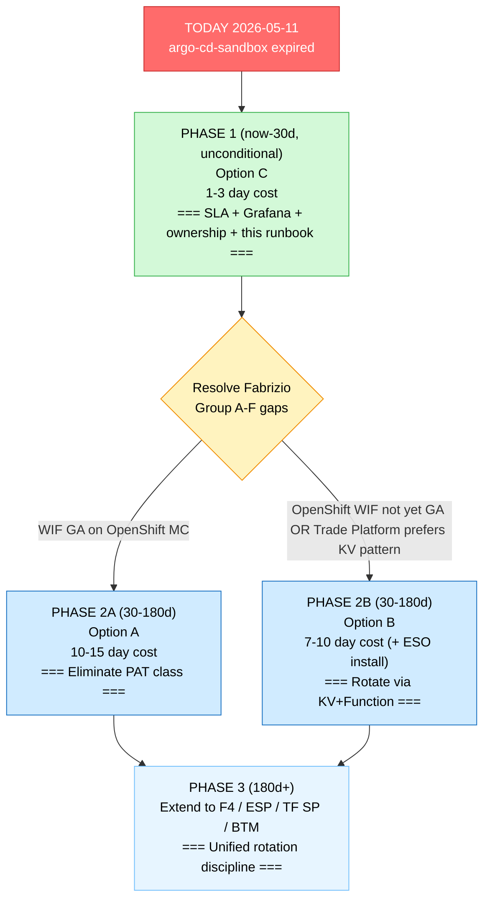

# Proposal — Automating ArgoCD PAT Rotation (and Adjacent Credential Classes)

> **Audience**: Fabrizio Zavalloni (FBE owner), Trade Platform leadership, CCoE/CMC liaison.
>
> **Outcome sought**: a decision on which option to pursue for the next quarter — with explicit tradeoffs, sequencing, and named dependencies. NOT a project plan.
>
> **Evidence base**: companion [`draft-rotation-secrets.md`](./draft-rotation-secrets.md). The Slack quotes and IaC references in this proposal are all source-cited there.
>
> **Author**: Alex Torres, Trade Platform on-call, 2026-05-11.

---

## TL;DR

- **Problem**: rotating `sa_platform_vpp@eneco.com` PATs is undocumented, manual, oral, one-person SPOF (Fabrizio). Today's incident (`argo-cd-sandbox` expired 2026-05-10, blocked Duncan's FBE for ~22h before surfacing) is a SYMPTOM. Same class fired 4 days ago (PXQ 2026-05-07), and 18 months ago (INC-75, 2024-11-19). Fabrizio's own quote (DM 2026-04-10): *"this is a shit job to be done and can cause outages."*
- **Three options** (this proposal): **A — Workload Identity Federation** (eliminate PATs entirely; ~10-15d eng); **B — KeyVault + ESO + scheduled rotation** (extend existing patterns; ~7-10d but ESO must be installed first); **C — Status quo + SLA + Grafana alert + ownership** (~1-3d; buys time, doesn't fix the class).
- **Recommended sequence**: **Phase 1 (now-30d) = Option C unconditionally** (low cost, high MTTD impact, documents the rotation). **Phase 2 (30-180d) = choose A or B based on Fabrizio's answers to Group A/B in `how-to-rotate.md` gap list.** **Phase 3 (180d+) = extend chosen option to F4 / ESP / TF SP / BTM / Snyk classes.**
- **Decision needed from Fabrizio/Trade Platform**: (a) sponsorship for Phase 1 (cheap), (b) preferred direction for Phase 2 (depends on Fabrizio's answers to the gap list).

---

## Problem statement

### Today's surfacing incident

| Dimension | Value | Source |
|---|---|---|
| Expired PAT | `argo-cd-sandbox`, expiry 2026-05-10 (Critical) | `slack-intake.txt:6` |
| Auth-break timestamp | 2026-05-10T12:40:13Z | Vault incident page |
| Time to surface | ~22 hours (expiry → Fabrizio asking in Slack) | Vault incident page |
| Blast radius | 3 broken FBE slots (kidu/boltz/enel); 8 surviving (etcd-cached) | Vault pattern doc |
| MTTD via existing alerts | ~22h (the alert exists in `#myriad-alerts-devops`; the SLA does not) | Vault + Slack harvest |
| MTTR via existing tooling | ~22h (no canonical procedure; Fabrizio carries it orally) | Slack harvest |

### The recurring pattern (not just today)

This is the **THIRD** recent recurrence of "expired credential → silent outage" at Eneco:

| When | Surface | Cause | Resolution |
|---|---|---|---|
| 2024-11-19 (INC-75) | Multi-FBE | AAD SP secret expired | Fabrizio rotated per-FBE; post-incident note: *"This manual process is error-prone and must be automated to prevent such issues in the future."* |
| 2025-12-29 (F4) | All active FBEs simultaneously | Same AAD SP (`6db398ec-...`) expired again | Fabrizio rotated per-FBE manually over ~1h+ |
| 2026-05-07 (PXQ) | PXQ service | Keyvault client secret expired | Same class — rotation discussion in `#pxq` |
| 2026-05-11 (today) | Sandbox FBE | ArgoCD PAT expired | THIS task |
| **2026-06-01** | dev-MC / acc-MC / prd-MC | 3 ArgoCD PATs scheduled to expire | LATENT — proactive rotation needed |

### The structural problem (per `how-to-rotate.md` §3-5)

1. **Tribal knowledge SPOF**: no canonical procedure existed before today (`how-to-rotate.md` is the first). Fabrizio carries it orally.
2. **No rotation SLA**: the alert pipeline `#myriad-alerts-devops` exists (ADO pipeline 2735 / PR 140615) but no team-wide policy says "rotate within 7d Warning / 24h Critical."
3. **No designated owner per rotation cycle**: the alert posts to a channel; no one auto-claims it.
4. **Silent failure mode**: per the vault pattern doc, FBE pipeline reports `partiallySucceeded` + Slack "1/4 Success" — the visible signals don't point at the credential layer. The only diagnostic surface is `kubectl describe applicationset`, which is in no first-look runbook.
5. **Asymmetric mechanisms across clusters**: sandbox uses one pattern (manual `kubectl patch`); MC clusters likely use a different pattern (per `iac-secret-templates.md`, no ESO, no Terraform-managed KV entries, but Helm chart exists at `myriad-vpp/ArgoCD-Config/Helm/repositories/templates/deployment.yaml` targeting `eneco-vpp-argocd` namespace).
6. **No alarming on the actual cause-surface**: the ApplicationSet condition `ErrorOccurred=True` is a CRD field that argocd-metrics exposes; a Grafana alert on `argocd_appset_status{condition_type="ErrorOccurred"} > 0` would have caught the 2026-05-10T12:40Z auth-break in real time.

### Quantification

If the 3 MC PATs (06-01-2026 Warning) follow the same fate as `argo-cd-sandbox`, expect:
- ~22h time-to-surface for the FIRST MC environment to break (dev-MC most likely, as it gets the most experimentation)
- 60-90 min per environment for human rotation (today's vault-recipe time + ticket overhead for MC)
- Total potential outage cost: 60-90 min × 3 environments × developers affected per environment + the production-impact risk on prd-MC

The mitigation is one of the three options below.

---

## Current state diagram

```mermaid
flowchart LR
    subgraph Sensor["1. SENSOR (good)"]
        Pipeline["ADO Pipeline 2735<br/>(myriad-vpp/devops)<br/>azure-devops-pat-token-monitor.ps1"]
        Slack["#myriad-alerts-devops<br/>(daily ~13:01 CEST)"]
    end

    subgraph Actuator["2. ACTUATOR (broken)"]
        Notice["Human notices alert<br/>(no SLA, no owner)"]
        Mint["Mint PAT in ADO UI<br/>(manual, only sa_platform_vpp authority)"]
        Apply["Apply to cluster<br/>(sandbox=kubectl patch; MC=?)"]
    end

    subgraph Verify["3. VERIFICATION (missing)"]
        AppSet["ApplicationSet condition<br/>(no Grafana alert; INFORMATIONAL)"]
        Down["Downstream impact<br/>(surfaces in #myriad-platform days later)"]
    end

    Pipeline --> Slack
    Slack -.->|"Best case ~7d"| Notice
    Slack -.->|"Worst case ~30d+"| Notice
    Notice --> Mint --> Apply
    Apply -.->|"Silent fail invisible"| AppSet
    AppSet -.->|"Until human-driven FBE-create"| Down

    classDef good fill:#d3f9d8,stroke:#37b24d,color:#000
    classDef broken fill:#ffe3e3,stroke:#c92a2a,color:#000
    classDef missing fill:#fff3bf,stroke:#f08c00,color:#000

    class Sensor,Pipeline,Slack good
    class Actuator,Notice,Mint,Apply broken
    class Verify,AppSet,Down missing
```

The SENSOR layer is well-built (ADO pipeline 2735 exists and works daily). The ACTUATOR layer is fragile (manual, no SLA). The VERIFICATION layer is mostly missing (the symptom surfaces via downstream developer impact, not via direct alerting).

---

## Target-state options

Each option below names: **mechanism**, **ROI**, **blast radius**, **mitigations**, **ownership**, **verifiability**, **rollback**, **drawbacks**.

### Option A — Workload Identity Federation (eliminate PATs)

#### Mechanism

Replace `sa_platform_vpp@eneco.com`-based PAT authentication with **Azure DevOps Workload Identity Federation**:

1. Each ArgoCD installation (sandbox + 3 MC) registers as a federated identity in AAD.
2. ArgoCD's repo-server pod runs as a workload identity (mapped to the AAD federated credential via OIDC issuer trust).
3. When repo-server fetches from ADO, it presents an OIDC token (signed by AKS/OpenShift OIDC issuer) → ADO accepts (Azure DevOps Workload Identity Federation, GA per Microsoft Learn 2024).
4. PATs are **deleted** — there's nothing to rotate; OIDC tokens are ephemeral (typically 1h lifetime, auto-refreshed by the workload identity controller).

#### Cited basis

- Microsoft Learn: "Use Workload Identity Federation with Azure DevOps" (GA Q3 2024).
- ArgoCD: repo-credential supports OAuth / workload identity since v2.10+ (matches sandbox's installed version per `iac-secret-templates.md:17`).
- Vault recipe note (`recipe-rotate-argocd-sandbox-pat.md:245`): *"If ArgoCD switches from PAT-based authentication to OIDC/managed-identity (the modern approach), Step 3-5 are obsolete; the rotation becomes 'rotate the federated credential' rather than a manual PAT mint."* — the recipe ANTICIPATES this option.

#### ROI

| Dimension | Value |
|---|---|
| Eliminates PAT-expiry incidents | YES (entirely; OIDC tokens have no calendar expiry) |
| Manual toil per rotation cycle | ZERO (no more rotation events) |
| Cross-cluster consistency | YES (each cluster has its own federated identity; uniform rotation = nothing to rotate) |
| Cross-class applicability | PARTIAL (only where ADO is the target; doesn't help F4 AAD SP / ESP cert) |

#### Blast radius

- **Rollout**: HIGH — changes the auth model for all 4 ArgoCD installs. Must be phased.
- **Steady state**: LOW — no credentials to leak.

#### Mitigations

- Phased rollout: sandbox first (lowest blast radius, can rehearse), then dev-MC, acc-MC, prd-MC LAST.
- Dual-auth window: ArgoCD repo Secrets can be configured with both PAT and OIDC for a transition window — verify federated auth works before deleting the PAT.
- Pre-rollout test against a non-critical repo (e.g., a single Application's source repo) before VPP.GitOps or cmc-goldilocks.

#### Ownership

- **Lead**: Trade Platform team (owns ArgoCD installs).
- **Required coordination**: CCoE/IT (federation trust config in AAD), Identity team (AAD app registrations for workload identity).
- **CMC dependency**: yes — MC clusters' OpenShift GitOps Operator must support Workload Identity (likely yes for recent operator versions, but **`[PENDING: confirm OpenShift GitOps Operator version on MC]`**).

#### Verifiability

- Each repo-server pod's bound workload identity is auditable via `kubectl get serviceaccount -n argocd argocd-repo-server -o yaml` (annotation `azure.workload.identity/client-id`).
- ADO audit logs show OAuth bearer tokens with federated assertions (no more PAT entries for `sa_platform_vpp` for repo access).
- PAT-expiry alert pipeline (2735) reports zero entries for `argo-cd-*` PATs.

#### Rollback

- Re-add the PAT to the repo Secret (`kubectl patch`); ArgoCD accepts either auth mode.
- Reset ApplicationSet refresh.
- One-step revert.

#### Drawbacks

- **Requires Workload Identity GA across ADO + AKS + OpenShift** — confirmed for ADO (2024); confirmed for AKS (Workload Identity v1 GA 2023); **`[PENDING: OpenShift GitOps Operator version + Workload Identity support on MC]`**.
- **Requires AAD app registration + federated credential PER ArgoCD install** — 4 new identities to create + maintain.
- **One-time engineering cost** (estimate): 2-5 days for design + 1 day per cluster cutover + 1 day buffer = **10-15 days total**.
- **Doesn't help with non-ADO credentials** (F4 AAD SP rotation for AssetPlanning is a different class; ESP/Axual mTLS is a different class; TF SP credentials live in different KVs).
- **Skill-level shift**: the team's mental model moves from "rotate PATs every year" to "manage federated credentials" — different ops vocabulary.

#### Risk profile

Risk of cutover: **HIGH**. Risk steady-state: **LOW**. Reversibility: **MEDIUM-HARD** (rolling back to PAT is technically possible but visible — the org will see the regression).

---

### Option B — KeyVault + External Secrets Operator (ESO) + scheduled rotation

#### Mechanism

1. **Source of truth**: Azure KeyVault. Each PAT is a KV secret (e.g., `argocd-repository-credentials-{sandbox,devmc,accmc,prdmc}` in `vpp-appsec-d` per `draft-rotation-secrets.md` C14 — 4-source-verified — or a new dedicated `vpp-argocd-secrets-{env}` KV). NOTE: a wiki page references `vpp-aks-devops` for appreg secrets (different secret class); do NOT conflate. The ArgoCD PAT KV entries observed in `vpp-appsec-d` are `argocd-repository-credentials-template-url-{acc,devmc}` (2 of 4; the missing 2 are gaps per draft §7 Group B).
2. **Sync**: ExternalSecrets Operator (ESO) reads KV, writes Kubernetes Secret. SecretStore points at KV via Workload Identity (no SP needed for the sync layer — partially overlaps with Option A's identity work).
3. **Rotation**: An Azure Function (or extension of ADO pipeline 2735) runs monthly (or N days before expiry), mints a new PAT via ADO REST API, writes it to KV, and updates the PAT-expiry watchlist. ESO syncs to cluster within minutes. ArgoCD picks up on next reconcile.

#### Cited basis

- IaC harvest confirms: ESO is NOT deployed at Eneco (`iac-secret-templates.md:55-56`). KV entries for ArgoCD PATs EXIST (acc + devmc per `eneco-vpp-keyvault-secrets.md:28-29`) but are NOT Terraform-managed and have no sync mechanism (`iac-secret-templates.md:88-93`). This option REQUIRES installing ESO + provisioning the KV entries properly.
- VPPAL cert rotation runbook (`vppal-cert-rotation-runbook.md:34-36`) shows the team is comfortable with the GitOps-managed-secret-in-KV pattern (for ESP cert PFX). Same pattern would apply.
- ESO is a CNCF graduated project — stable, widely adopted, supported on both AKS and OpenShift.

#### ROI

| Dimension | Value |
|---|---|
| Eliminates PAT-expiry incidents | NO (PAT still expires; automation rotates before expiry) |
| Manual toil per rotation cycle | ZERO (automation rotates) |
| Cross-cluster consistency | YES (one KV per env; ESO syncs to all clusters in env) |
| Cross-class applicability | YES — ESO can sync ANY KV secret, so this extends naturally to F4 / ESP / TF SP / BTM / Snyk classes |

#### Blast radius

- **Rollout**: MEDIUM — ESO must be deployed in all 4 clusters; existing repo Secrets must be migrated; the Function/rotator's own credentials become a new SPOF (must itself be a federated identity to avoid recursing into PAT territory).
- **Steady state**: LOW — KV access logs + ESO sync events are auditable.

#### Mitigations

- Phased ESO deployment (sandbox first to validate end-to-end).
- Keep manual rotation as fallback (vault recipe + `how-to-rotate.md` stay valid).
- The rotator Function's identity is a federated workload identity (no recursive PAT).
- Pre-rotation verification gate: the new PAT is curl-tested against `dev.azure.com` BEFORE being written to KV (i.e., automation includes Step 4 of `how-to-rotate.md`).

#### Ownership

- **Lead**: Trade Platform team (owns ArgoCD + sync layer).
- **Required coordination**: CCoE/IT (KV access policies), whoever owns ADO pipeline 2735 (extend or replace with the rotator Function).
- **CMC dependency**: yes — ESO must be installable on MC OpenShift clusters; **`[PENDING: CMC approval for ESO install on MC]`**.

#### Verifiability

- KV access logs show automation activity (rotation Function reads + writes).
- ESO sync events in cluster: `kubectl get externalsecret -n argocd -o yaml`.
- ArgoCD condition flips to `ErrorOccurred=False` within minutes of KV update.
- PAT-expiry alert (pipeline 2735) never reports `Critical` again for ArgoCD PATs.

#### Rollback

- Disable the Azure Function schedule.
- Manual rotation per `how-to-rotate.md` still works (ESO doesn't prevent kubectl patch; next ESO sync would overwrite — disable ESO for the affected secret if you want manual to stick).

#### Drawbacks

- **Doesn't eliminate PAT as a credential class** — still bearer tokens; still potentially leakable; still subject to ADO's 12-month max lifetime.
- **ESO is greenfield** — adds CRDs, sync intervals, secret-mapping config, monitoring, IaC declaration. Non-trivial install cost.
- **Rotator Function's own credentials** — must be federated; OR you've recreated the SPOF.
- **12-month PAT max in ADO** — rotation must happen at least annually; the Function must be reliable for years.
- **Doesn't help if MC PATs are CMC-operated** — the wiki + Slack evidence suggests Trade Platform may not have authority to mint MC PATs.

#### Risk profile

Risk of cutover: **MEDIUM**. Risk steady-state: **LOW**. Reversibility: **MEDIUM** (disable Function, ESO stays).

---

### Option C — Status quo + SLA + ownership + observability (minimal-change)

#### Mechanism

No new auth layer. Existing PAT-expiry alert pipeline (2735) stays. ADD:

1. **Written SLA** (Trade Platform decision):
   - `Warning` status → rotate within 7 calendar days
   - `Critical` status → rotate within 24 hours
2. **Designated owner per rotation event** — on-call engineer auto-claims via Slack workflow (`#myriad-alerts-devops` reacts to a thumbs-up emoji = "I'll handle this"), OR Trade Platform creates a rotation roster.
3. **Grafana alert on the actual cause-surface**: `argocd_appset_status{condition_type="ErrorOccurred"} > 0` against each cluster's metrics endpoint; page on-call. AND `argocd_app_info{health_status!="Healthy"}` aggregated.
4. **Vault runbook is canonical** — link from the `#myriad-alerts-devops` PAT-report bot AND from the Platform-team-internal wiki landing page.
5. **Mandatory "renewal date" reminder** — when a new PAT is minted with +1y expiry, automatically open a calendar reminder for T-30d.

#### Cited basis

- Vault pattern doc `pattern-argocd-pat-expiry-blocks-new-fbe-apps.md:194`: *"The right alarm is missing. The ApplicationSet condition (`type: ErrorOccurred, status: True`) is a metric that argocd-metrics exposes."*
- Class-level lesson 2 (same doc): *"Credential-rotation cadence is a control surface. When the team's PAT-expiration alert exists but no rotation SLA is enforced, the alert becomes a write-only log. SLA candidate: rotate within 7 days of Warning, within 24 hours of Critical."*

#### ROI

| Dimension | Value |
|---|---|
| Eliminates PAT-expiry incidents | NO |
| Manual toil per rotation cycle | UNCHANGED (humans still do all the work) |
| MTTD improvement | ~95% (Grafana alert fires within minutes of auth break instead of ~22h) |
| Cross-cluster consistency | NO (each cluster manually rotated; same procedure though) |
| Cross-class applicability | YES — SLA framework applies to F4 / ESP / TF SP equally |

#### Blast radius

- **Rollout**: ZERO — only policy + an alert + a documentation link.
- **Steady state**: ZERO.

#### Mitigations

- Validate Grafana alert in sandbox first; tune threshold to minimize false-positive (real auth breaks vs transient flicker).
- Run a tabletop exercise on the SLA with Trade Platform (does everyone agree on the timing? on the auto-claim mechanism?).
- Phase 1 IS this option regardless of Phase 2 choice — see sequencing below.

#### Ownership

- **Lead**: Trade Platform team (owns alerting + SLA enforcement + this runbook).
- **Required coordination**: none external.

#### Verifiability

- PAT-expiry alert (2735) fires on schedule (already does — no change).
- New Grafana alert fires on auth-break (new — must be wired up).
- Vault incident page is updated after each rotation (audit by checking the catalogue periodically).
- SLA compliance reportable: time between alert and rotation < SLA threshold.

#### Rollback

- Trivial. It's just policy + an alert.

#### Drawbacks

- **Doesn't reduce rotation toil** — humans still execute all 10 steps of Section A (or B-1A/B-1B).
- **Doesn't reduce SPOF risk** — single SA (`sa_platform_vpp@eneco.com`) with 4 PATs; still tribal-knowledge-dependent.
- **Doesn't address F4 / ESP / TF SP classes** at the mechanism level — only at the SLA framework level.
- **Relies on humans not getting distracted** — the very failure mode that caused 2026-05-11 (the alert posted 2026-05-08; no one claimed; PAT expired 2026-05-10).

#### Risk profile

Risk of cutover: **ZERO**. Risk steady-state: **LOW** (residual = human distraction).

---

## Comparison matrix

| Dimension | Option A (Workload Identity Federation) | Option B (KV+ESO+Function) | Option C (SLA+Grafana+ownership) |
|---|---|---|---|
| Engineering cost | 10-15 days | 7-10 days (+ ESO install) | 1-3 days |
| Eliminates PAT credential class | YES | NO | NO |
| Eliminates manual rotation toil | YES (zero rotations) | YES (auto-rotation) | NO |
| MTTD improvement | 100% (no incidents) | ~99% (KV alert pre-expiry) | ~95% (Grafana alert at break) |
| Cross-cluster consistency | YES | YES | NO |
| F4 / ESP / TF SP applicability | PARTIAL (only ADO-target classes) | YES (any KV-backed secret) | YES (SLA framework only) |
| Risk of cutover | HIGH | MEDIUM | ZERO |
| Reversibility | MEDIUM-HARD | MEDIUM | TRIVIAL |
| CMC dependency | YES (OpenShift WIF support) | YES (ESO install on MC) | NO |
| Workable IF MC PATs are CMC-operated | YES (each cluster has its own federation) | UNCERTAIN (ESO sync still requires cluster access) | YES (SLA + alert work cross-cluster without `oc` access) |
| Skill-level shift | HIGH (new vocabulary) | MEDIUM (CRDs + ESO operations) | LOW (just policy) |

---

## Adjacent classes — how each option extends

The 4 ArgoCD PATs are one credential class among many at Eneco. The proposal should consider downstream applicability:

| Class | Surface | Option A | Option B | Option C |
|---|---|---|---|---|
| F4 — AAD shared SP `6db398ec-...` (AssetPlanning et al.) | client secret on shared AAD app | NO (different surface; F4 needs Workload Identity for AssetPlanning pods, not just ArgoCD) | YES (rotate the AAD client secret via KV+Function; ESO syncs) | YES (SLA + Grafana alert on AADSTS errors) |
| ESP / Axual mTLS cert | mTLS for Kafka producer/consumer | NO (mTLS, not OAuth) | YES (cert in KV; rotate via Function) | YES (SLA only) |
| TF SP credentials | KV `mcc-kv-vppdeploy{dta,prd}-*` | YES (TF SP can be federated identity for ADO Terraform tasks) | YES (Terraform secret rotation via KV/Function) | YES (SLA framework) |
| BTM app-reg client secrets | KV-stored client secrets | YES (federation if BTM apps run on Azure compute) | YES (the BTM Secret Rotation wiki runbook id 68382 already follows this pattern) | YES (SLA) |
| Snyk credentials in ADO | CI credential | NO (not ADO PAT but Snyk API key) | YES (Snyk key in KV; rotate via Function) | YES |
| ADO build-agent PATs | private build agents | YES (build agents → workload identity) | YES (rotate via Function) | YES |

**Option B has the widest adjacent-class applicability**. Option A is the cleanest for the ADO-target classes but doesn't generalize beyond. Option C is universal in scope but doesn't fix any class structurally.

---

## Sequencing recommendation

### Phase 1 (now-30d) — Option C unconditionally

**Why unconditionally**: Phase 1 deliverables are zero-risk + high-MTTD-impact + Phase-2-agnostic. Doing them doesn't preclude either Phase 2 choice; not doing them leaves a 21-day window (until 2026-06-01) where the 3 MC PATs could replay today's incident in production.

**Deliverables**:

1. **This runbook (`how-to-rotate.md`)** — DONE today; ready for Fabrizio review.
2. **Grafana alert** on `argocd_appset_status{condition_type="ErrorOccurred"} > 0` and `argocd_app_info{health_status!="Healthy"}` for each cluster's metrics endpoint. Pages on-call via Rootly. Estimated effort: 0.5 day.
3. **SLA decision document** — Trade Platform decides:
   - Warning = rotate within 7 days
   - Critical = rotate within 24 hours
   - Auto-claim mechanism: thumbs-up reaction in `#myriad-alerts-devops` = "I'll handle this"
   - Fallback: on-call rotation owns it after 24h with no claim
4. **Renewal reminder** — when a new PAT is minted with +1y expiry, the runbook's Step 9 instructs the operator to create a calendar reminder at T-30d. Trivial habit change; document it.
5. **Vault incident catalogue update** — add this runbook to the master entry hub (`fbe-errors/_index.md`).
6. **🔴 Hard deadline: 2026-05-25** — complete MC PAT rotation (Section B of `how-to-rotate.md`, all 3 PATs `argo-cd-{devmc,accmc,prdmc}-cmc-goldilocks-repository`). 7-day buffer before 2026-06-01 natural expiry. Whoever owns Section B execution (Alex if Trade Platform-authorized, CMC if their domain) must complete the rotation **before** 2026-05-25 so a recovery window exists if a rotation hits an unknown. Set calendar reminder.

**Cost**: ~1-3 engineering days total. **Owner**: Alex (initially) + Trade Platform team for SLA decision.

### Phase 2 (30-180d) — Option A or B depending on Fabrizio's answers

**Decision input** (from `how-to-rotate.md` gap list Groups A-F): Fabrizio's answers determine the choice.

- If **A2** = "Trade Platform mints and applies" + **A4** = "Trade Platform has `oc` to MC `eneco-vpp-argocd`" → both options viable. Choose Option A if OpenShift GitOps Operator supports Workload Identity Federation (probe needed). Otherwise Option B.
- If **A2** = "CMC mints MC PATs" → Option A is structurally less appealing (each cluster needs CMC-side federation; cross-org coordination). Option B is better.
- If **A2** = "Mixed (Trade Platform mints; CMC applies)" → Option C continues to be the operating model with a stretch goal of Option B for the Trade Platform side.

**Concrete deliverables (Option A path)**:
1. Confirm OpenShift GitOps Operator version + WIF support on MC clusters (probe + CMC consultation): 1 day
2. Design federation trust setup (AAD app reg + federated credential per ArgoCD install): 2 days
3. Sandbox cutover: provision federated identity for `argocd-repo-server` pod; test with non-critical repo; cut over VPP.GitOps: 1-2 days
4. dev-MC cutover: 1 day
5. acc-MC cutover: 1 day
6. prd-MC cutover: 1 day (most cautious; staged within day)
7. Delete old PATs in ADO: 0.5 day
8. Update this runbook (Section A 9-step path becomes "verify federated identity" instead of "mint PAT"): 0.5 day

**Total Option A path**: ~10-15 days, plus buffer for CMC coordination.

**Concrete deliverables (Option B path)**:
1. Install ESO + SecretStore + RBAC across 4 clusters (sandbox first): 2-3 days
2. Migrate the 4 PATs to KV (provision KV entries; secret-set; configure ExternalSecret): 1-2 days
3. Author rotation Function (TypeScript or PowerShell; reuses logic from `azure-devops-pat-token-monitor.ps1`): 2-3 days
4. Wire Function into rotation cycle (schedule + alerting): 1 day
5. Validation rollout (mint test PAT; verify Function detects + rotates correctly): 1 day
6. Update this runbook (Section A becomes "Function rotated automatically; verify"): 0.5 day

**Total Option B path**: ~7-10 days, plus ESO install setup.

### Phase 3 (180d+) — extend chosen option to adjacent classes

Once Option A or B is stable for the 4 ArgoCD PATs, extend the same mechanism to:
- F4 (AAD shared SP `6db398ec-...`) — if Option A: federate `AssetPlanning` etc. workload identity. If Option B: KV-managed rotation for the AAD client secret.
- ESP / Axual mTLS cert
- TF SP credentials in `mcc-kv-vppdeploy*`
- BTM app-reg secrets (already has a manual runbook per wiki id 68382; automate)
- Snyk credentials
- Build-agent PATs

**Cost**: 3-6 months of incremental work, dwarfed by the rotation toil it eliminates.

---

## Open dependencies on Fabrizio / Trade Platform decisions

| # | Dependency | Question | Affects |
|---|---|---|---|
| D1 | Sponsorship for Phase 1 (1-3 day investment) | Approve to start? | Phase 1 start date |
| D2 | SLA values (Warning=7d / Critical=24h or different?) | Trade Platform team agree on the SLA timing | Phase 1 SLA design |
| D3 | Auto-claim mechanism | Thumbs-up reaction OR roster OR something else | Phase 1 ownership flow |
| D4 | Mint authority + apply authority answers | Groups A/B in `how-to-rotate.md` gap list | Phase 2 choice (A vs B) |
| D5 | OpenShift GitOps Operator WIF support on MC | Probe per Phase 2 step 1 | Phase 2 A feasibility |
| D6 | CMC approval for ESO install on MC | CCoE/CMC review | Phase 2 B feasibility |
| D7 | Budget for Phase 2 (engineering days) | 7-15 days approval | Phase 2 timeline |
| D8 | Phase 3 priority ordering | Which adjacent class first | Phase 3 backlog |

---

## Anti-patterns this proposal does NOT recommend

For clarity and to prevent the proposal from being mis-implemented:

1. **DO NOT propose manual KV + manual cluster patch in parallel for MC** — the current asymmetry between sandbox (manual patch) and MC (likely manual + maybe KV) leads to two-source-of-truth confusion. Pick one model (A or B) and migrate cleanly.

2. **DO NOT propose a single PAT shared across all 4 clusters** — would consolidate the SPOF and increase blast radius if leaked.

3. **DO NOT propose PAT-in-commit (any repo, ever)** — bearer credential leak surface.

4. **DO NOT propose auto-rotation without a verification gate** — if the new PAT is invalid (wrong scope, wrong identity), all 4 clusters could lose auth simultaneously when the rotator pushes a bad value. Phase 2 design MUST include a curl-test gate (Section A Step 4 of `how-to-rotate.md`) before promotion to cluster.

5. **DO NOT propose disabling the existing PAT-expiry alert pipeline (2735)** — keep the sensor; improve the actuator + verifier. The pipeline is good infrastructure already; replacing it would be wasteful.

6. **DO NOT propose ignoring the runtime ApplicationSet condition** — Grafana alert on `ErrorOccurred=True` (Phase 1 Deliverable 2) is independent of the upstream PAT-expiry alert and catches the case where the PAT was rotated to a bad value or a different controller has a stale cache. Keep BOTH signals.

7. **DO NOT propose Option A without confirming OpenShift WIF support** — `[PENDING D5]`. Without confirmation, Option A may not be feasible for MC and would force a heterogeneous solution (sandbox = WIF; MC = something else), which is worse than uniform PATs.

8. **DO NOT propose Option B without considering the rotator Function's own credential** — if the Function itself authenticates via a PAT or AAD secret, you've recreated the SPOF. The Function MUST use a federated workload identity OR a managed identity (i.e., partial Option A applied to the rotator).

---

## References

| Citation | Use |
|---|---|
| `slack-intake.txt` (this task) | 4-PAT inventory |
| `[[2026-05-11-pat-expiry-argocd-auth-break]]` (vault) | Today's incident timeline |
| `[[pattern-argocd-pat-expiry-blocks-new-fbe-apps]]` (vault) | Silent-fail mechanism + class-level lessons |
| INC-75 post-mortem (Fabrizio, 2024-11-19): *"This manual process is error-prone and must be automated."* | <https://eneco-online.slack.com/archives/C081GTVSZFD/p1732022060724869> |
| Fabrizio DM 2026-04-10: *"this is a shit job to be done and can cause outages."* | <https://eneco-online.slack.com/archives/D09K5LQSW0G/p1775834268694299> |
| F4 thread 2025-12-29 (Fabrizio rotated SP `6db398ec-...`) | <https://eneco-online.slack.com/archives/C063SNM8PK5/p1767014621744099> |
| PXQ incident 2026-05-07 (same class) | <https://eneco-online.slack.com/archives/C0B239D1FRR/p1778164253499109> |
| ADO PR 140615 (PAT-expiry monitor pipeline) | <https://dev.azure.com/enecomanagedcloud/Myriad%20-%20VPP/_git/devops/pullrequest/140615> |
| ADO pipeline 2735 (PAT-expiry monitor) | `myriad-vpp/devops/azure-pipelines.yml` |
| ADO script (expiry monitor) | `myriad-vpp/devops/scripts/azure-devops-pat-token-monitor.ps1` |
| Helm chart (the ownership smoking gun) | `myriad-vpp/ArgoCD-Config/Helm/repositories/templates/deployment.yaml` |
| Wiki — Platform-team-internal | `[UNVERIFIED]` — flagged by wiki sidecar as unindexed in primary registry; may contain prior rotation notes |
| Wiki — Aggregation Layer cert rotation runbook (structural template) | dev.azure.com page id 50903 |
| Wiki — BTM Secret Rotation runbook (pattern template) | dev.azure.com page id 68382 |
| MS Learn — Azure DevOps Workload Identity Federation | (GA 2024) — search "Azure DevOps service connections workload identity federation" |
| Vault — ESP cert rotation runbook | `[[vppal-cert-rotation-runbook]]` |
| Vault — KV inventory | `[[eneco-vpp-keyvault-secrets]]` (partial; canonical at `06-azure-deep-state §6.2.1`) |
| External Secrets Operator | <https://external-secrets.io/> (CNCF graduated) |

---

## Closing — the proposal in one sentence

**Phase 1 unconditionally**: define an SLA, wire a Grafana alert, publish this runbook — buys 30 days of MTTD improvement at 1-3 day cost. **Phase 2 conditional on Fabrizio's answers**: eliminate PATs via Workload Identity Federation (Option A, 10-15d) OR automate rotation via KeyVault + ESO + Function (Option B, 7-10d + ESO install). **Phase 3 extension**: roll out the chosen pattern to F4 / ESP / TF SP / BTM / Snyk over 6 months.

The thing this proposal does NOT do: defer further. Today's incident is the third recurrence in 18 months; the next one is scheduled for 2026-06-01.
