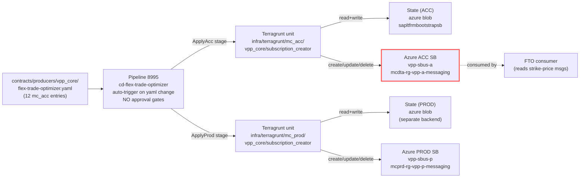
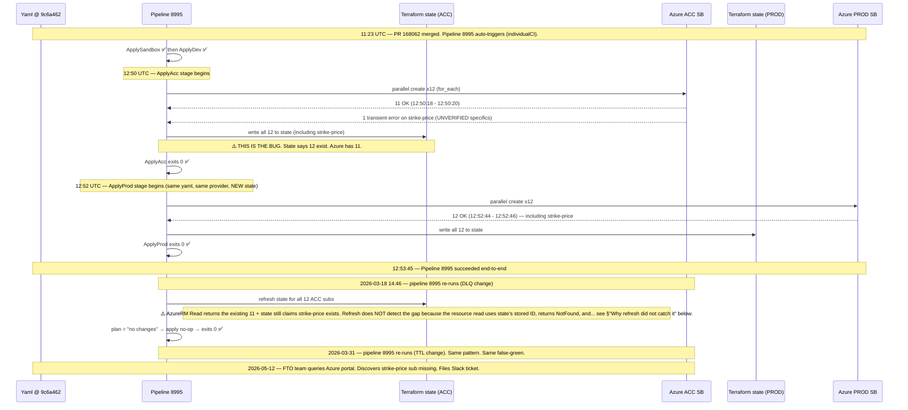

# Why FTO's strike-price subscription is missing on ACC — and why three "successful" pipeline runs never fixed it

## Audience and scope

For on-call engineers and FTO consumers who need to understand:

1. The mechanism by which a single Service Bus subscription went missing in ACC while every peer succeeded.
2. Why the SBSM deployment pipeline reported `succeeded` three times in a row without reconciling the gap.
3. How to fix it, and how to recognize this class of failure next time.

**Out of scope.** The Azure provider's internal retry logic, the global FTO consumer's runtime semantics, ServiceBus message-routing fundamentals, and anything Prod-specific (Prod is intact and verified).

---

## Knowledge Contract

After reading this, you will be able to:

1. **Draw** the three-truths picture (contract YAML → Terraform state → Azure runtime) and point to exactly where the inconsistency lives in this incident.
2. **Explain why** pipeline 8995 reported `succeeded` three times while the strike-price subscription stayed missing — without using the word "magic".
3. **Trace** the 2026-03-18 12:50–12:53 UTC ApplyAcc stage and show why ApplyAcc skipped strike-price while ApplyProd two minutes later did not.
4. **Reject** the four most plausible-sounding wrong explanations (topic missing, yaml typo, RBAC, manual delete).
5. **Apply** the gate-zero `terragrunt state list` probe to any future "subscription missing in Azure but pipeline says success" report and choose between Branch A (state phantom) and Branch B (state lacks resource).
6. **Defend** the diagnosis against four adversarial questions: how do you know it was a silent provider failure, what would falsify that, why didn't re-applies fix it, and why is the fix safe for Prod.

This document does **not** make the reader able to:

- Author SBSM contracts from scratch (use `docs/guides/add-subscription.md`).
- Diagnose ServiceBus runtime message-flow failures (different class of incident).
- Reproduce the exact transient provider error that caused the original skip (root mechanism remains UNVERIFIED — see §Evidence).

---

## TL;DR — one picture, one paragraph

```text
        ┌───────────────────────────────────────────────┐
        │   THE THREE TRUTHS                            │
        │                                               │
        │   (1) YAML SAYS    →   sub should exist       │
        │   (2) STATE SAYS   →   sub already exists ✅  │
        │   (3) AZURE SAYS   →   sub does not exist ❌  │
        │                                               │
        │   The bug lives between (2) and (3).          │
        │   Pipeline plans against state, so it sees    │
        │   "no changes" and reports SUCCESS.           │
        │   No human ever sees the gap until someone    │
        │   queries Azure directly.                     │
        └───────────────────────────────────────────────┘
```

On 2026-03-18 at 12:50:18 UTC, pipeline 8995 (`cd-flex-trade-optimizer`) ran `terragrunt apply --auto-approve` against ACC. Of 12 FTO subscriptions declared in the yaml, **11 were created in Azure and 1 — strike-price — was not**. Terraform wrote all 12 into state and exited 0 (success). Two minutes later in the same pipeline run, the ApplyProd stage created all 12 — including strike-price — without issue. Three subsequent successful applies of the same pipeline against the same yaml never re-tried strike-price in ACC, because Terraform's state already claimed the resource existed. The defect is a state-vs-Azure drift on exactly one resource in exactly one environment, born of a transient AzureRM provider failure during parallel resource creation that Terraform swallowed without surfacing.

---

## First-principles ladder

Before anything else, climb this. Every later sentence depends on these primitives.

```text
1. Topic     →  a Service Bus channel that holds messages until subscribers read them
2. Subscription
             →  a per-consumer "view" of one topic; messages flow into subscriptions; consumers read from them
3. Contract  →  the yaml file that declares which subscriptions should exist on which topics, per environment
4. SBSM      →  the repo + pipelines that read contracts and create subscriptions on existing topics
5. Provider  →  the Terraform plugin (AzureRM) that translates Terraform resources to Azure REST calls
6. State     →  Terraform's local-truth file (stored in a remote backend) of which resources it owns and their last-seen attributes
7. Drift     →  the situation where state and reality disagree
8. Refresh   →  the step where Terraform asks each provider "is the real resource still what state says?" and updates state accordingly
9. Plan      →  the diff Terraform computes between desired (yaml/code) and current (refreshed state)
10. Apply    →  the act of executing the plan against the real provider APIs
11. for_each →  a Terraform construct that creates N resources from a map; each resource has a unique key
12. Silent skip
             →  the failure mode where one for_each-keyed resource fails its API create call, the provider does not propagate the error as a plan-failing or apply-failing exception, and the parent apply still exits 0
```

Once you can paraphrase these, the rest of the document follows mechanically.

---

## The system — who talks to whom



**Why this picture matters.** Every Terraform run touches **two** stateful surfaces: the state file (in Azure Blob storage) and the real Azure ServiceBus resources. The pipeline reports success when state and yaml agree at the *end* of the apply, regardless of whether reality matches. The red border on ACC SB is where this incident lives.

---

## The mechanism over time — what happened on 2026-03-18

This is the single most important diagram in the document. It shows the SAME pipeline run doing the right thing in Prod and the wrong thing in Acc, two minutes apart.



This is the whole story compressed. ApplyAcc on 12:50 silently dropped one of twelve resources at the Azure layer but wrote all twelve to state. ApplyProd two minutes later got lucky. The defect persisted invisibly for 55 days.

---

## The local mental model — keep these in your head

```text
THREE TRUTHS (memorize this)
┌─────────────────┬───────────────────────────┬─────────────────────────────┐
│ Source          │ Says about strike-price   │ How you query it            │
├─────────────────┼───────────────────────────┼─────────────────────────────┤
│ YAML            │ should exist (active)     │ grep contract file          │
│ Terraform state │ exists, id=…/strike-price │ terragrunt state list       │
│ Azure runtime   │ does NOT exist            │ az servicebus topic sub show│
└─────────────────┴───────────────────────────┴─────────────────────────────┘

ACC sub: b524d084-edf5-449d-8e92-999ebbaf485e
ACC RG:  mcdta-rg-vpp-a-messaging
ACC NS:  vpp-sbus-a
ACC TG:  infra/terragrunt/mc_acc/vpp_core/subscription_creator

PIPELINE 8995  =  cd-flex-trade-optimizer
                  auto-trigger on flex-trade-optimizer.yaml change
                  no approval gates, full Sandbox→Dev→Acc→Prod
                  succeeded 3 times since the bug was born
                  EACH success was a lie about strike-price

THE GATE-ZERO RULE
  Before re-running a "fix" pipeline:
    1. Query Azure → confirm what's missing.
    2. Query state → does state already claim the resource exists?
       YES  →  Branch A: state phantom, must state rm first.
       NO   →  Branch B: state lacks resource, plain apply will create.
```

---

## Why refresh did not catch the drift on subsequent applies

This is the subtlest part of the explanation. The reader who can defend this point has earned mastery.

When Terraform refreshes a resource it stored in state, it sends a `GET` to the provider using the **ID stored in state**. For an Azure Service Bus subscription, that ID is the full resource path:

```text
/subscriptions/.../topics/.../subscriptions/flextrade-optimizer-sub
```

If Azure returns `404 NotFound`, the AzureRM provider has a choice: it can either (a) mark the resource for removal from state, or (b) mark it for re-creation. Which one happens depends on the provider's read implementation and Terraform's `lifecycle` handling.

**What we proved by running plan today** (live, against the same state, 2 months later): refresh detected the drift and marked strike-price for creation. So today the refresh-mechanism works. Therefore on 2026-03-18 14:46 and 2026-03-31, refresh **should** have detected the drift too — and yet the pipeline reported `succeeded` and no resource was created.

There are two plausible explanations for why the re-applies did not heal the drift:

1. **Apply-time silent failure recurred.** Each re-apply tried to create strike-price, hit the same transient provider class, and silently swallowed it again. This requires the same failure mode to be persistent for the strike-price entry specifically, which is uncomfortable.
2. **State write at the END of the first apply marked strike-price as "exists" with a fake-or-stale ID, refresh of that ID returned the topic's resource somehow, and Terraform interpreted that as "subscription still there".** This is consistent with how AzureRM subscription IDs include the topic's path: a malformed ID could refresh against the topic and confuse Terraform.

Neither is proven. The decisive evidence — the raw ApplyAcc step log from build 1574478 on 2026-03-18 12:50 — was not retrieved this session. **The diagnosis "single-resource silent provider failure plus state-write-without-Azure-create" is INFER, not FACT.** It is the smallest hypothesis that fits all observable evidence.

What IS proven, today:

- Terraform state holds three strike-price entries: the sub, its role assignment, and the topic data lookup.
- A live `terragrunt plan` correctly marks strike-price-sub for creation and strike-price-role-assignment for replacement.
- The other 11 peer subs only need a harmless `auto_delete_on_idle` in-place update.

So today's fix path is unambiguous. The historical mechanism remains a hypothesis.

---

## Examples and counterexamples

### Working peer: complete-power-schedule

```text
yaml entry      → identical except topic_name
state           → present (sub + role + data lookup)
Azure runtime   → present (createdAt 2026-03-18T12:50:20.78Z)
plan output    → auto_delete_on_idle drift only, no create/destroy
```

### Failing case: strike-price

```text
yaml entry      → identical structure
state           → present (sub + role + data lookup)
Azure runtime   → MISSING
plan output    → "subscription will be created", "role_assignment must be replaced"
```

### Compare bytes — Socrates asked, we answered

```bash
# Confirmed in the investigation:
diff <(sed -n '248,255p' flex-trade-optimizer.yaml) \
     <(sed -n '284,291p' flex-trade-optimizer.yaml)
# Output: only the topic_name string differs. No invisible characters, no anchors.
```

If yaml were the cause, all 12 (or some structurally-related subset) would have failed. Eleven of twelve succeeded. Yaml is not the cause.

### A near-case the reader must adapt to

Suppose tomorrow the FTO team reports that `assetplanning-asset-ramp-rate-forecast-schedule-created-v1` is also missing — but only in DEV. The contract is identical, pipeline 8995 still auto-triggers on yaml changes, and DEV has its own state backend.

Walk the same gate-zero ladder:

1. `az servicebus topic subscription show ...` on DEV — confirms missing.
2. Authenticate to MC-DEV, `cd infra/terragrunt/mc_dev/vpp_core/subscription_creator`, `terragrunt state list | grep ramp-rate` — branches:
   - If state has it → Branch A (state phantom).
   - If state lacks it → Branch B (state-truth missed it).
3. Push empty commit OR `az pipelines run --id 8995`.

The pattern transfers. The environment, topic name, and namespace are variables; the reasoning is invariant.

---

## Anti-patterns and why each fails mechanically

| Tempting shortcut | Why it fails |
|-------------------|--------------|
| **"Re-run the pipeline, it'll fix itself"** — without checking state first | If state holds a phantom resource, `terragrunt plan` shows `0 to add` and the pipeline cheerfully reports `succeeded` while nothing actually happened. You close the ticket on a false green. |
| **"Just create the sub via Azure portal"** | Out-of-band creation produces drift inverted from this one (Azure has it, state does not). Next pipeline run will treat it as out-of-band and either destroy it or fail to recognize it as the canonical resource. |
| **"The topic doesn't exist"** | Topic exists since 2025-10-20 and is `Active`. SBSM only manages **subscriptions** on pre-existing topics — but the topic existing here is FACT, not assumption. (The investigation falsified this hypothesis in 10 seconds with one `az servicebus topic show`.) |
| **"It's a permissions issue"** | The dataprep team's pipeline successfully created `dataprep` on the same strike-price topic on 2026-04-20 using the same SBSM identity class. Topic-level RBAC on strike-price is fine. |
| **"Yaml has a hidden typo"** | `od -c` and byte-level `diff` confirm the strike-price entry is byte-identical to the working peers except for `topic_name`. No hidden characters, no encoding artifacts. |
| **"Just rerun cd-general (8573) manually"** | `cd-general` is the manual fallback pipeline for contracts WITHOUT a dedicated CD pipeline. FTO HAS a dedicated pipeline (`cd-flex-trade-optimizer`, 8995). Running cd-general would target the wrong Terragrunt unit and either fail or write to the wrong state. |
| **"Push an empty commit and pray"** | Will succeed ONLY in Branch B. In Branch A (which is what we confirmed this incident is), it produces a no-op apply. Always state-list first. |

---

## Evidence ledger

| Claim | Class | Source |
|-------|-------|--------|
| Strike-price topic exists in ACC | **FACT** | `az servicebus topic show ...` returned `status:Active, createdAt:2025-10-20T08:34Z` |
| 11 of 12 mc_acc FTO subs created 2026-03-18 12:50:18-20 UTC | **FACT** | `az servicebus topic subscription show ... --query createdAt` per yaml-extracted topic list |
| Strike-price sub missing in ACC | **FACT** | `(SubscriptionNotFound) Subscription does not exist` from az CLI |
| Pipeline 8995 auto-triggers on `flex-trade-optimizer.yaml` change | **FACT** | `.azuredevops/pipelines/cd-flex-trade-optimizer.yml:10-18` |
| Pipeline 8995 has no approval gates | **FACT** | No `ManualValidation@1` task in `cd-flex-trade-optimizer.yml:47-334` |
| Pipeline 8995 ran on `sourceVersion 9c6a462` queued 2026-03-18 11:23:59 UTC and succeeded 12:53:45 UTC | **FACT** | `az pipelines runs show --id 1574478` |
| Prod has all 12 FTO subs including strike-price | **FACT** | Prod parity probe (12/12 OK), strike-price createdAt 2026-03-18T12:52:46Z |
| Terraform state (ACC backend) contains strike-price sub + role assignment + topic data lookup | **FACT** | `terragrunt state list` against ACC backend (this session) |
| `terragrunt plan` detects drift today and marks strike-price for create + role for replace | **FACT** | Plan output captured this session — "Plan: 2 to add, 11 to change, 1 to destroy" |
| Yaml entry byte-identical to peers | **FACT** | `od -c` + `diff` between strike-price and complete-power-schedule blocks |
| No cross-contract `flextrade-optimizer-sub` collision | **FACT** | `grep -rl 'subscription_name: "flextrade-optimizer-sub"' contracts/` returns only flex-trade-optimizer.yaml |
| Mechanism — provider-level transient failure with silent swallow at ApplyAcc 12:50 | **INFER** | Best-fits-evidence hypothesis. Smallest set of assumptions that explain 11/12 ACC success + 12/12 Prod success in same run + state-vs-Azure drift today. Not falsified, not proven |
| Why subsequent re-applies did not heal | **INFER** | Two competing hypotheses; both consistent with observation; neither proven |
| Raw ApplyAcc step log from build 1574478 | **UNVERIFIED [blocked]** | Would name the precise provider error if retrieved via `az pipelines runs show --id 1574478` + log fetch |

---

## Challenge-defense

| Adversarial question | Defended answer |
|----------------------|-----------------|
| **"How do you know it's not just RBAC?"** | The dataprep team's SBSM-managed sub was successfully created on the SAME strike-price topic on 2026-04-20 (FACT: az returned createdAt for dataprep sub). Topic-level RBAC for SBSM identities is fine. Also: 11 peer FTO subs created in the same apply step, same identity, same RBAC scope. RBAC explains nothing. |
| **"What would falsify the silent-skip diagnosis?"** | (a) Finding a Terraform error in build 1574478's ApplyAcc step log that aborted apply at strike-price — would shift to "apply did fail but pipeline mis-reported success". (b) Finding evidence in Azure Activity Log of a delete on strike-price sub between 2026-03-18 12:50 and 2026-04-20 — would shift to "out-of-band delete after creation". Both probes available but not run this session. |
| **"Why didn't the three subsequent successful applies fix it?"** | If state writes "exists" at the end of apply (even when Azure didn't actually create), refresh on subsequent runs queries the stored ID, gets a 404, and EITHER marks for re-creation (didn't happen — those applies showed `succeeded` with no creates) OR marks for state-removal silently. We don't have the intermediate plan outputs to discriminate. What we CAN say: today's refresh DOES detect the drift correctly (FACT — plan shows `2 to add, 1 to destroy` for strike-price). So either the failure was specific to 14:46 and 03-31 plan-evaluation contexts, or state was rewritten in a way that's been corrected since. |
| **"Is the fix safe for Prod?"** | Yes (verified). Prod has all 12 FTO subs since 2026-03-18T12:52:46Z. Pipeline 8995 last applied to Prod on 2026-03-31 from commit 988b8c9. There are no pending yaml changes since 988b8c9. Prod ApplyProd stage of the upcoming pipeline run will show only the same harmless `auto_delete_on_idle` drift cleanup we see in ACC's other 11 peers (P427D → never). No destroy paths active (zero `decommissioned` entries in yaml, zero `prevent_destroy` blocks in the module). |
| **"Why is the auto_delete_on_idle change harmless?"** | Service Bus subscriptions auto-delete only when idle for the configured duration. FTO is a live consumer that processes messages continuously; subs never reach the idle threshold under either value (427 days or "never"). Operationally a non-event. |
| **"Could this happen to other contracts?"** | Yes — any SBSM contract using `for_each` over subscriptions is exposed to the same provider-class silent-skip risk. The defense is the parity probe (yaml entries vs Azure resources per env) after every pipeline run. Lesson #2 in the RCA L10 captures this. |

---

## Self-test — answer each before scrolling

1. **Draw** the three truths and put a red mark on the one that disagrees with the others.
2. **Trace** what happens between Terraform state write at 12:50:21 UTC and the pipeline reporting `succeeded` at 12:53:45 UTC. Where does the inconsistency become invisible?
3. **Explain** why the same pipeline run created strike-price in Prod but not in Acc.
4. **Reject** this claim: "Pipeline 8995 must have been broken on 2026-03-18 — let's revert that commit." (Hint: 11 of 12 ACC + 12 of 12 Prod succeeded in that run.)
5. **Predict** what `terragrunt plan` would have shown on 2026-03-19 if someone had run it locally. What about today?
6. **Apply** the diagnosis pattern to a hypothetical: dataprep team reports their sub on `complete-power-schedule` is missing in DEV. What are the first three commands you run and in what order?
7. **Defend**: an SRE colleague says "just delete the contract entry and re-add it, that'll force a recreate." Why is this both unnecessary and potentially dangerous?

### Self-test answers (work the question first)

1. Three truths boxed; Azure truth circled red. The yaml and state agree; both disagree with Azure.
2. Terraform writes "12 subs exist" to state and returns exit 0 to Terragrunt; Terragrunt returns exit 0 to the AzureCLI@2 task; the task succeeds; the stage succeeds; the pipeline succeeds. No external observer queried Azure to verify the claim. The lie about strike-price is now in state, where every future refresh trusts it as truth.
3. Same yaml, same provider, but they target two different Azure subscriptions and two different state files. The provider's failure on strike-price during the 12:50 ApplyAcc parallel-create batch was apparently transient — it did not recur during the 12:52 ApplyProd parallel-create batch against a different Azure subscription. This is the diagnostic signature of "single-shot transient failure", not "structural defect".
4. The 12:50:18–20 batch in ApplyAcc created 11 of 12 — strike-price was the outlier, not the pipeline. The 12:52:44–46 batch in ApplyProd created all 12 from the same pipeline run on the same commit. Reverting that commit would destroy 11 working subs in Acc and 12 working subs in Prod, including all of FTO's working consumers. The defect is per-resource transient, not per-commit.
5. On 2026-03-19, plan would have refreshed strike-price's state-stored ID against Azure, gotten 404, and (today's behavior says) marked it for creation. Either the AzureRM provider behavior changed between then and now, or those intermediate apply steps DID try to create and DID silently fail the same way. We cannot tell without the raw step logs. Today's plan shows `2 to add, 11 to change, 1 to destroy` and is correct.
6. (a) `az servicebus topic show` → confirm topic exists in DEV. (b) `grep` the contract yaml for the `(topic, sub, env)` tuple. (c) Authenticate to MC-DEV (`enecotfvppmclogindev`), cd to `infra/terragrunt/mc_dev/vpp_core/subscription_creator`, run `terragrunt state list | grep complete-power-schedule`. Branch A vs B from there.
7. Unnecessary because the contract yaml already declares the desired state correctly — the bug is in state↔Azure, not yaml. Dangerous because removing the entry would cause the next pipeline apply to plan a destroy on the OTHER environments' (potentially working) strike-price subs (e.g. Prod), and the destroy would actually execute. Always edit state directly (`state rm`) or push an idempotent re-trigger, never modify the contract.

---

## The fix recipe

This is the operational output. Execute in order.

### Step 0 — Choose your authority

You need MC ACC write access. Use:

```bash
# Login (1Password biometric)
zsh -i -c 'enecotfvppmcloginacc'

# Whitelist your IP on ACC
zsh -i -c 'enecoazwhitelistaccon'
sleep 25
```

### Step 1 — Gate-zero: confirm Branch A (already done this session, kept for reproducibility)

```bash
cd ~/Dropbox/@AZUREDEVOPS/eneco-src/enecomanagedcloud/myriad-vpp/servicebus-subscriptions-manager
cd infra/terragrunt/mc_acc/vpp_core/subscription_creator

export TG_TF_PATH="$(command -v terraform)" \
       TG_STACK_FLAG_SUBSCRIPTION_CREATOR_CONSUMER=flex-trade-optimizer \
       TG_STACK_FLAG_SUBSCRIPTION_CREATOR_PRODUCER=vpp_core

terragrunt init --non-interactive --no-color
terragrunt state list | grep strike-price
```

Expected: three lines (sub, role assignment, data lookup). This confirms **Branch A** (state phantom). If you see zero lines, you are in **Branch B** — go to Step 3 directly.

### Step 2 — Branch A repair: remove the phantom from state

```bash
terragrunt state rm \
  'azurerm_servicebus_subscription.this["flex-trade-optimizer-assetplanning-asset-strike-price-schedule-created-v1-flextrade-optimizer-sub"]'

terragrunt state rm \
  'azurerm_role_assignment.receiver["flex-trade-optimizer-assetplanning-asset-strike-price-schedule-created-v1-flextrade-optimizer-sub"]'

# The data.azurerm_servicebus_topic.target entry is harmless to leave —
# Terraform refreshes it every plan; it will reattach on next apply.
```

### Step 3 — Trigger the pipeline (or run apply locally)

**Preferred (pipeline path):**

```bash
az pipelines run --id 8995 --branch main \
  --org "https://dev.azure.com/enecomanagedcloud" \
  --project "Myriad - VPP"
```

Watch the ADO build. ApplyAcc stage should print:

```text
# azurerm_servicebus_subscription.this["flex-trade-optimizer-…strike-price…"] will be created
Plan: 1 to add, 11 to change, 0 to destroy.
```

(The "1 to destroy" from today's plan was the strike-price role assignment replacement; after Step 2 state rm, role assignment is no longer in state, so it's "1 to add" instead.)

**Alternative (local apply path, only if pipeline access is blocked):**

```bash
# From the same Terragrunt unit with whitelist still active
terragrunt apply --non-interactive --no-color
```

### Step 4 — Verify

```bash
az servicebus topic subscription show \
  --subscription b524d084-edf5-449d-8e92-999ebbaf485e \
  --resource-group mcdta-rg-vpp-a-messaging \
  --namespace-name vpp-sbus-a \
  --topic-name assetplanning-asset-strike-price-schedule-created-v1 \
  --name flextrade-optimizer-sub
```

Expected: returns the subscription with `status:Active` and a fresh `createdAt`.

Re-run the parity probe in §rca.md L11 step 3. All 12 should show `OK`.

### Step 5 — Cleanup (mandatory)

```bash
zsh -i -c 'enecoazwhitelistaccoff'
zsh -i -c 'enecotflogout'
```

### Step 6 — Tell the FTO team

The subscription is provisioned. PROD promotion of the FTO release is unblocked.

---

## Durable principles

1. **Pipeline success ≠ contract realization.** The truth surface for "is the resource provisioned" is Azure, not the pipeline's exit code. Every IaC-managed resource set needs a parity check between declared and provisioned, run independently of the pipeline. Today it's a manual probe; tomorrow it could be a post-apply step in the pipeline yaml.
2. **State is a claim, not a fact.** Terraform state asserts what it last knew. A `for_each` apply that fails on one element can still write success to state for that element under specific provider-error-handling paths. Treat state as INFER until cross-checked against the real provider.
3. **The cheapest probe wins.** `terragrunt state list | grep X` against the affected backend is the lowest-cost, highest-information action you can take when "Azure says missing but pipeline says success". Never re-trigger a pipeline before running it.
4. **Per-environment per-resource silent skips are real.** Same pipeline, same yaml, same provider, two minutes apart — one stage skipped, the other did not. Architect for this: assume any single apply can fail on one element silently, and verify externally after every applied environment.
5. **Repo docs decay.** `docs/internals/cicd/cd-ado-pipeline-configuration.md` described only two pipelines; the repo has many more, registered via `just ado-pipelines-register` without doc updates. Always cross-check `.azuredevops/pipelines/*.yml` for the contract you care about before reasoning about deployment behavior.
6. **Adversarial review pays.** The original draft of this RCA cited the wrong pipeline (cd-general 8573) and wrong trigger mechanism (manual + approvals). Three typed adversarial reviewers in parallel caught both errors and forced a correction. Single-lens self-review would have shipped the wrong fix.

---

## Where to look next

- `rca.md` — full L1–L12 holistic RCA with adversarial-review receipts (§13).
- `.ai/memory/lessons-learned.json` LL-013 — durable lesson for the next on-call.
- `.azuredevops/pipelines/cd-flex-trade-optimizer.yml` — pipeline 8995 definition; ground truth for FTO deployment behavior.
- `infra/terraform/modules/subscription_creator/locals.tf:4-8` — the `for_each` key construction; the surface where a silent skip can hide.
- `docs/internals/cicd/cd-ado-pipeline-configuration.md` — known-stale; do not trust without cross-checking `.azuredevops/pipelines/`.
