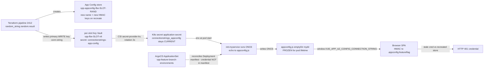

# RCA — VPP frontend FBE feature-flags 401 after creation

| Field | Value |
|-------|-------|
| Incident | `2026_07_18_001_vpp_frontend_fbe_feature_flags_401` |
| Filed / picked up | 2026-07-16 (Duncan Teegelaar) / 2026-07-18 |
| Investigated | 2026-07-19 (live Sandbox AKS + Azure + source) |
| Origin / surface | Slack-Lists (Platform Help Requests) / GitOps-ArgoCD → **FBE** (per-slot App Configuration, browser-HMAC) |
| Status | **Verified Root Cause (depth 3)** — frozen-snapshot drift demonstrated live across 5 of 6 active FBE frontend slots |
| Severity | Low urgency (operator toil), but **fleet-wide and currently active** |
| Definition of done (filer) | New/recreated FBE → open frontend → feature flags load **without a manual pod delete**; "Tennet NL" indicator visible |

---

## Context Ledger (zero-context reader first)

| Term | Definition | Code / resource artifact | Relevance here |
|------|------------|--------------------------|----------------|
| **VPP** | Virtual Power Plant — Eneco Trade Platform product | repos under ADO `Myriad - VPP` | The frontend under investigation is the VPP SPA |
| **FBE** | Feature Branch Environment — an ephemeral, per-branch full-stack slot running as a namespace in Sandbox AKS | ArgoCD ApplicationSet `vpp-feature-branch-environments` | The incident only affects FBEs |
| **Slot** | One FBE instance, named after a planet/deity (`jupiter`, `thor`, `boltz`, `ishtar`, `kidu`, `veku`, …) | K8s namespace `<slot>` | Each slot has its own App Config store + Key Vault |
| **Sandbox AKS** | The dev-test cluster hosting all FBEs | context `vpp-aks01-d`, authinfo `clusterUser_rg-vpp-app-sb-401` | Directly reachable (not AVD-gated) |
| **App Configuration (App Config)** | Azure service that stores feature flags + key-values; has an HTTP **data plane** | `vpp-appconfig-fbe-<slot>-<rand>.azconfig.io` in RG `rg-vpp-app-sb-401` | The browser reads flags from here |
| **Feature flag** | A togglable UI capability; the VPP quick check is the **Dutch flag + "Tennet NL"** label top-left | `.appconfig.featureflag/*` keys | Missing indicator = flags failed to load |
| **HMAC connection string** | An App Config access-key credential (`Endpoint=…;Id=…;Secret=…`) used to sign data-plane requests | KV secret `connectionstrings-app-config` | The browser authenticates with this; **401 = bad/rotated credential** |
| **`appconfig.js`** | A browser-served JS file that sets `window.VUE_APP_AZ_CONFIG_CONNECTION_STRING` | `/etc/nginx/html/appconfig/appconfig.js` in the frontend pod | The single point where the credential enters the browser |
| **init container `init-myservice`** | Runs once at pod start; writes `appconfig.js` from an env var | frontend Helm chart `frontend-0.4.2` | Bakes the credential **once**, into an emptyDir |
| **CSI secrets-store** | Driver that syncs Azure Key Vault secrets into a Kubernetes Secret | `SecretProviderClass secret-provider-kv` → `application-secret` | Keeps the K8s secret current; drives the env var |
| **ArgoCD** | GitOps engine reconciling desired K8s manifests | ApplicationSet `vpp-feature-branch-environments` | Deploys the frontend; **does not see** the out-of-band credential |
| **Pipeline 2412 / 2629** | FBE **create** / **delete** ADO pipelines | `azure-pipelines-featurebr-env.yml` / `azure-pipeline-fbe-del.yml` | Create/recreate provisions a fresh store; delete runs `terraform destroy` |

**Evidence labels:** `A1 FACT` = live command output / file:line / URL. `A2 INFER` = derived from A1 by named reasoning. `A3 UNVERIFIED[blocked: reason]` = not probed; blocking reason named.

---

## Summary (one paragraph)

The VPP frontend delivers its Azure App Configuration **HMAC connection string to the browser through a build-time-once `appconfig.js`** that the init container `init-myservice` writes into an **emptyDir** at pod start. The per-slot App Config store name embeds a Terraform `random_string` suffix, so when a slot's infrastructure is torn down and rebuilt (delete `2629` → create `2412`), the store is **recreated with a new name and new HMAC keys**. Terraform updates the per-slot Key Vault secret and the CSI driver (rotation on, 2 s) updates the Kubernetes `application-secret` — but **nothing restarts the frontend pod**, because the credential travels out-of-band and is invisible to the Deployment manifest ArgoCD reconciles, there is no Stakater Reloader controller, no config-checksum annotation, and the readiness probe only checks nginx `/healthz`. The running pod therefore keeps serving a **stale credential frozen in `appconfig.js`**, and only a manual pod delete (which re-runs the init container) restores it. The **frozen-snapshot drift was demonstrated live on 2026-07-19 across 5 of 6 active FBE frontend slots**, each serving a connection string for an App Config store that no longer exists in Azure — a live proof of the mechanism and its recurrence.

**Precise surface note (do not over-read):** the 5 drifted slots bake a *deleted* store, so their flag call currently fails to connect (`HTTP=000`), not with a 401. Duncan's exact **HTTP 401** is the *same root cause* in the narrower window where the baked store still resolves but presents a rejected/rotated HMAC key. Both are the one mechanism — a frozen snapshot of a mutable credential — and both are fixed by a pod restart; the RCA does not claim the aged fleet slots currently emit Duncan's exact 401.

**Create vs recreate:** FBE slots are a **finite, reused pool** of planet/deity names (`jupiter`, `thor`, `boltz`, …). "Creating an FBE" for a developer usually means **claiming a slot name that previously existed** — i.e. a destroy→recreate of that slot's Terraform state — which is exactly what regenerates the store (see L5/L6). That is why Duncan sees it "when creating an FBE".

---

## L1 — Business — Why the VPP frontend + FBE feature flags exist

The VPP frontend is the operator UI for Eneco's Virtual Power Plant (asset dispatch, portfolio, market interaction). **Feature Branch Environments** let a developer spin up a full, isolated copy of the stack per branch to validate changes before merge. Feature flags gate which UI capabilities render per slot; the operator's quick "did flags load?" check is the **Dutch flag + "Tennet NL"** indicator top-left `A1` (filer brief). When the browser cannot authenticate to App Config, the indicator is absent and the developer cannot trust the environment — a recurring **toil** ("a couple of requests over the past weeks", per Duncan `A1`). Who is blocked: any VPP developer creating/recreating an FBE. Impact class: low urgency, high recurrence, fleet-wide.

## L2 — Repo system

FBE machinery spans four ADO repos in project `enecomanagedcloud/Myriad - VPP` `A1` (local checkouts pulled to latest 2026-07-19):

| Repo | Role | Key path |
|------|------|----------|
| `Myriad - VPP` | Frontend Helm chart + FBE pipelines | `azure-pipeline/Helm/frontend/` (chart `frontend-0.4.2`), `.../azure-pipelines-featurebr-env.yml` |
| `VPP-Configuration` | Per-environment frontend Helm values | `Helm/frontend/sandbox/values.yaml` |
| `VPP - Infrastructure` | Per-slot FBE Terraform (App Config + Key Vault) | `terraform/fbe/app-config.tf`, `terraform/fbe/common.tf` |
| `VPP.GitOps` | ArgoCD ApplicationSet + per-slot manifests | `argocd-configuration/applicationsets/vpp-feature-branch-environments.yaml` |

The appconfig Terraform module is remote-sourced: `Eneco.Infrastructure//terraform/modules/appconfig?ref=v0.1.0` `A1`.

## L3 — Runtime architecture (the failure path)



The credential path (Terraform → KV → CSI → `application-secret` → init → emptyDir → browser) is **entirely out-of-band** from the ArgoCD-reconciled Deployment spec `A1`. A store recreate changes the credential but produces **no manifest diff**, so ArgoCD reports Synced and **never rolls the pod** `A2`.

## L4 — Application code flow (where the credential freezes)

Frontend Helm chart `frontend-0.4.2`, `templates/deployment.yaml` `A1`:

```sh
# init container init-myservice, args:
echo window.VUE_APP_AZ_CONFIG_CONNECTION_STRING = \"${connectionstrings_appconfig}\" > /etc/nginx/html/appconfig/appconfig.js
```

- `connectionstrings_appconfig` env ← `secretKeyRef{name: application-secret, key: connectionstrings_appconfig}` (both init and main container) `A1`.
- `appconfig.js` is written into volume **`mydir` (`emptyDir: {}`)** mounted at `/etc/nginx/html/appconfig` `A1` (`VPP-Configuration/Helm/frontend/sandbox/values.yaml`). An emptyDir is per-pod and ephemeral → the file exists only for that pod's life and is regenerated **only** on pod (re)start.
- Live-read of the healthy `jupiter` pod `A1`:
  `window.VUE_APP_AZ_CONFIG_CONNECTION_STRING = "Endpoint=https://vpp-appconfig-fbe-jupiter-vlt.azconfig.io;Id=[REDACTED];Secret=[REDACTED]"`.
- The browser reads that global and calls the App Config **data plane** over HMAC; **401 = credential failure** (Microsoft Learn App Configuration REST; live-confirmed `WWW-Authenticate: HMAC-SHA256`) `A1`.
- **No refresh path exists** `A1`: `podAnnotations: {}`; no `reloader.stakater.com/*` annotation; no config-checksum annotation; no Stakater Reloader controller in the cluster; readiness/liveness probes are `httpGet /healthz` only, so a pod serving a dead credential still reports **Ready**.

## L5 — IaC / state / Azure — the three truths

**Truth 1 — what the spec says (`VPP - Infrastructure/terraform/fbe/`):**

```hcl
# app-config.tf
app_configuration_name = format("%s-appconfig-fbe-%s-%s",
                                 var.project-prefix, var.environment, random_string.random.result)   # A1
key_vault_secret_name  = "connectionstrings-app-config"
key_vault_secret_value = module.appconfig.app_configuration_primary_write_key_connection_string        # A1 (WRITE key → browser)

# common.tf
resource "random_string" "random" {
  length = 3
  keepers = { id = format("%s-random-fbe-%s", var.project-prefix, var.environment) }                   # A1 (stable per slot)
}
```

- The store **name embeds a random suffix**; the keeper is stable per slot, so the suffix is stable **within a Terraform state** but **regenerates when the state is destroyed and rebuilt** (delete `2629` `terraform destroy` → create `2412`) → **new store name + new HMAC keys** (name change on `azurerm_app_configuration` is ForceNew) `A2`.
- The browser is handed the **primary _write_ key** connection string `A1` — a security smell (read/write key exposed to the client; orthogonal to the 401 but worth fixing alongside).
- Module output currently exposes only `app_configuration_primary_write_key_connection_string` (`Eneco.Infrastructure/terraform/modules/appconfig/output.tf`) `A1` — a read-only-key hardening needs a new module output.

**Truth 2 — what Azure actually holds (live 2026-07-19, sub `7b1ba02e-…`, RG `rg-vpp-app-sb-401`):**
Stores that EXIST: `vpp-appconfig-fbe-{boltz-tec, ishtar-xql, jupiter-vlt, kidu-gqk, thor-ubn, veku-xsy}` `A1`.

**Truth 3 — what the running pods serve (live 2026-07-19):** see L7 drift table. 5 of 6 FBE frontend pods serve connection strings for stores that are **GONE** from Azure `A1`.

## L6 — The pipeline and how it actually runs

Create pipeline `azure-pipelines-featurebr-env.yml` stage order `A1` (from source): `DeployInfra` (Terraform writes the KV secret) → `keyvaultandappconfigentries` → `DeployServices` → `DeployFBEInArgoCD` (commits `feature-branch-environments/{slot}.yaml`, triggers ArgoCD, then a **blind 180 s sleep**). **First-create ordering is correct** — the ArgoCD trigger transitively depends on the KV write, so a brand-new slot's first pod bakes the correct credential `A2`. The delete pipeline `azure-pipeline-fbe-del.yml` runs `isTerraformDestroy: true` `A1`. The gap is **recurrence**: on a slot **re-create** (or any operation that recreates the store), the store gets a new name+keys, `application-secret` is updated by CSI, but the **already-running frontend pod is never rolled** (no manifest diff, no Reloader, blind sleep ≠ restart) `A2`. ApplicationSet uses a git generator with automated prune+selfHeal and **no sync-wave** `A1`.

## L7 — Timeline (live drift snapshot, 2026-07-19)

Frozen-snapshot drift test — running pod's BAKED `appconfig.js` store vs current `application-secret` store (SHA-256 compared; secrets never printed) `A1`:

| slot | pod started | restarts | BAKED store (in pod) | CURRENT store (secret/Azure) | drift | baked store exists in Azure? |
|------|-------------|----------|----------------------|------------------------------|-------|------------------------------|
| boltz  | 2026-07-08 | 0 | `…-boltz-qzz`  | `…-boltz-tec`  | **DRIFT** | **GONE** |
| ishtar | 2026-07-13 | 0 | `…-ishtar-oyn` | `…-ishtar-xql` | **DRIFT** | **GONE** |
| kidu   | 2026-07-16 | 0 | `…-kidu-dfm`   | `…-kidu-gqk`   | **DRIFT** | **GONE** |
| thor   | 2026-07-16 | 0 | `…-thor-dyf`   | `…-thor-ubn`   | **DRIFT** | **GONE** |
| veku   | 2026-07-17 | 0 | `…-veku-ckg`   | `…-veku-xsy`   | **DRIFT** | **GONE** |
| jupiter| 2026-07-07 | 0 | `…-jupiter-vlt`| `…-jupiter-vlt`| match | exists (healthy) |

All drifted pods have `restarts=0` → they have **never re-baked `appconfig.js`** since start, and their baked store is **deleted** while the live `application-secret` points at a different, existing store `A1`. HTTP discriminator (unauth `GET /kv`) `A1`: a **live** store returns `HTTP 401 www-authenticate: HMAC-SHA256`; a **deleted** store does not resolve (`HTTP=000`). So these 5 slots, opened today, would fail the flag call with a **connection error** (deleted baked store), not a 401 — the same missing-flags outcome by a different network status; Duncan's exact 401 is the store-still-resolves variant.

**Timeline honesty `A3` [blocked: only current-store `systemData.createdAt` readable; store + KV-secret version history not retained].** The current stores' `createdAt` (e.g. `boltz-tec` 2026-07-08 13:24) *predates* several pods (`boltz` frontend 14:48) that nonetheless bake an *older, now-deleted* store. This falsifies any clean "pod baked the current store at birth, store recreated afterwards" story and shows the KV secret / `application-secret` can itself **lag** the live store across recreations. The robust, defensible facts are only: (i) each drifted pod's baked store is deleted, (ii) it differs from the live store, (iii) the pod never restarted — all `A1`. The exact per-slot recreation ordering is **not reconstructable** from available data and is not asserted. This lag is also why the fix must verify against the **live Azure store**, not merely against `application-secret` (see how-to-fix P1).

## L8 — Fix

See **[how-to-fix.md](./how-to-fix.md)** for exact edits, commands, and risks. In brief, ranked:

1. **Immediate mitigation (no code):** `kubectl -n <slot> rollout restart deploy/frontend` re-bakes `appconfig.js` from the now-current secret → 200. Applies to the 5 currently-drifted slots. *This is the manual step Duncan wants removed — used here only as the interim mitigation.*
2. **Primary permanent fix (recommended, no new cluster dependency):** in the FBE create/recreate pipeline, after ArgoCD converges, replace the blind 180 s sleep with `kubectl -n <slot> rollout status deploy/frontend` **+ `kubectl -n <slot> rollout restart deploy/frontend`** so a reused slot's surviving pod is rolled after the final store is in place.
3. **Robustness (trigger-agnostic):** install Stakater Reloader in the Sandbox cluster and annotate the frontend Deployment `secret.reloader.stakater.com/reload: "application-secret"`. Because CSI rotation keeps `application-secret` current (**proven live**: drifted pods' secret already holds the new store), Reloader will roll the frontend automatically on any store/key change.
4. **Strategic root fix:** make `appconfig.js` dynamic — serve the credential from the CSI-mounted `/mnt/secrets-store/connectionstrings-app-config` at request/container-start time instead of a one-shot emptyDir snapshot, eliminating the frozen-snapshot class.
5. **Security hardening (orthogonal, recommended):** hand the browser a **read-only** App Config key instead of the primary **write** key (add a `primary_read_key` output to the appconfig module and reference it in `app-config.tf`).

## L9 — Verification

Close on the **observed effect**, never a return code (H-EFFECT-1). After any fix:

- `kubectl -n <slot> exec deploy/frontend -c frontend -- cat /etc/nginx/html/appconfig/appconfig.js` → the `Endpoint=` host **matches** the live store in `application-secret` and in Azure `A1`.
- Browser DevTools on `https://<slot>.dev.vpp.eneco.com/`: `.appconfig.featureflag/*` returns **200** and the **"Tennet NL"** indicator renders `A1` (filer's DoD).
- Regression: recreate a throwaway slot end-to-end and confirm the frontend serves the correct credential **without** a manual pod delete.

## L10 — Lessons

- **A build-time-once artifact must not carry a mutable credential without a refresh trigger.** `appconfig.js` snapshots a value that rotates on infra recreate; the emptyDir + init-once + no-Reloader + healthz-only probe together guarantee the pod cannot self-correct.
- **Out-of-band credentials are invisible to GitOps.** ArgoCD reconciles the manifest, not the CSI-injected secret, so a store recreate leaves the pod "Synced" yet broken. CSI rotation refreshes the *secret* but never the *consumer* that read it once.
- **Green pipeline ≠ runtime health.** A green FBE-create and a `Ready` pod both coexist with a 401.
- The Jun-2026 RCA framed this as a *transient, self-resolving* provisioning window and shipped **no permanent fix**; this incident is the **permanent variant** (store recreate on slot reuse) that recurs until the refresh gap is closed.
- **Fleet check is cheap and high-signal:** comparing each pod's baked `appconfig.js` endpoint to its `application-secret` endpoint surfaces every stale slot in seconds.

## L11 — End-to-end command playbook (from cold)

```bash
# 0. Reach the FBE cluster (Sandbox AKS — directly reachable, not AVD-gated)
kubectl config use-context vpp-aks01-d

# 1. Which slots exist
kubectl get ns | grep -Ev 'kube-|monitoring|system|default|argocd|csi|cert-|mongo|rabbit'

# 2. Frozen-snapshot drift test (baked appconfig.js vs current application-secret)
for ns in $(kubectl get deploy -A -l app.kubernetes.io/name=frontend \
      -o jsonpath='{range .items[*]}{.metadata.namespace}{"\n"}{end}' | sort -u); do
  pod=$(kubectl -n "$ns" get pod -l app.kubernetes.io/name=frontend -o jsonpath='{.items[0].metadata.name}')
  baked=$(kubectl -n "$ns" exec "$pod" -c frontend -- cat /etc/nginx/html/appconfig/appconfig.js \
          | grep -oE 'Endpoint=https://[^;\"]+')
  sec=$(kubectl -n "$ns" get secret application-secret -o jsonpath='{.data.connectionstrings_appconfig}' \
          | base64 -d | grep -oE 'Endpoint=https://[^;\"]+')
  [ "$baked" = "$sec" ] && echo "$ns match" || echo "$ns DRIFT baked=$baked current=$sec"
done

# 3. Confirm the baked store is gone in Azure (Sandbox sub, read-only)
az resource list -g rg-vpp-app-sb-401 \
  --resource-type Microsoft.AppConfiguration/configurationStores \
  --subscription 7b1ba02e-bac6-4c45-83a0-7f0d3104922e --query "[].name" -o tsv

# 4. Interim mitigation (re-bakes appconfig.js) — restores 200
kubectl -n <slot> rollout restart deploy/frontend
kubectl -n <slot> rollout status  deploy/frontend

# 5. Verify EFFECT (not exit code)
kubectl -n <slot> exec deploy/frontend -c frontend -- cat /etc/nginx/html/appconfig/appconfig.js   # endpoint == live store
# then browser DevTools: .appconfig.featureflag/* == 200 and "Tennet NL" visible
```

## L12 — One-page on-call playbook (5-minute triage)

- **Symptom:** new/recreated FBE → frontend feature-flag calls 401; **no** Dutch flag / "Tennet NL"; a pod delete fixes it.
- **Confirm in 60 s:** `kubectl -n <slot> exec deploy/frontend -c frontend -- cat /etc/nginx/html/appconfig/appconfig.js` and compare its `Endpoint=` host to `kubectl -n <slot> get secret application-secret -o jsonpath='{.data.connectionstrings_appconfig}' | base64 -d`. **Mismatch = this bug.**
- **Immediate fix:** `kubectl -n <slot> rollout restart deploy/frontend` → re-check the endpoint matches → browser 200.
- **Do NOT:** rotate App Config keys, re-run App Config Terraform, grant Data roles, or touch dev-mc `vpp-applicationconfig-d` — the store/key are fine; the **pod** is stale.
- **Permanent fix owner:** see how-to-fix.md (pipeline rollout-restart ± Reloader ± read-only key).

---

## Claim classification (highest-stakes)

| # | Claim | Class | Falsifier |
|---|-------|-------|-----------|
| 1 | The 401 is a stale HMAC credential in a frozen `appconfig.js`, not RBAC/network | **A1** | Live: baked endpoint ≠ current secret endpoint on 5 slots; live store returns 401 `WWW-Authenticate: HMAC-SHA256`; deleted store fails to connect |
| 2 | The pod cannot self-refresh (no Reloader/checksum, healthz-only probe, init-once emptyDir) | **A1** | Cluster/repo greps returned no Reloader; probe config is `/healthz`; emptyDir confirmed in values |
| 3 | Store identity/keys change on slot recreate (random suffix regenerates on state rebuild) | **A2** | `random_string` keeper stable per slot; suffix changes only across destroy→create; 5 slots show new suffixes with deleted old stores |
| 4 | A pipeline rollout-restart after ArgoCD sync fixes the create/recreate case | **A2** | `application-secret` is current at that point → re-baked pod serves the live store; must be effect-verified in a regression slot |
| 5 | Reloader on `application-secret` fixes the trigger-agnostic case | **A2** | CSI rotation keeps the secret current (proven live) → Reloader would roll frontend on change; requires the controller to be installed |
