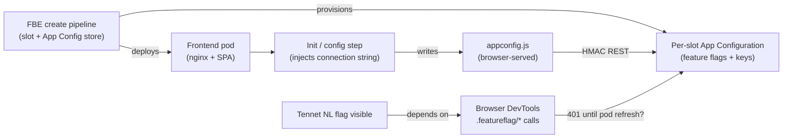

# VPP frontend — FBE feature flags 401 after creation — Slack intake

## Derivation header

| Field | Value |
|-------|-------|
| `template_id` | `slack-intake.template.md` |
| `template_version` | `2.0.0` |
| `template_path` | `std/skills/10_employer/eneco/eneco-oncall-intake-slack/assets/slack-intake.template.md` |
| `instance_id` | `2026_07_18_001_vpp_frontend_fbe_feature_flags_401` |
| `filed_date` | `2026-07-16` |
| `picked_up_date` | `2026-07-18` |
| `produced_by` | `eneco-oncall-intake-slack` |
| `consumed_by` | `eneco-sre` — assembles `sre-intake.md` beside this file |

**Staleness note:** Filed ~2026-07-16, picked up 2026-07-18. Re-verify FBE slot, pipeline build, and frontend pod age before acting on any runtime claim.

## Instance manifest

| Key | Value | Provenance |
|-----|-------|------------|
| `INCIDENT_TITLE` | VPP frontend — FBE feature flags 401 after creation | — |
| `INSTANCE_ID` | `2026_07_18_001_vpp_frontend_fbe_feature_flags_401` | — |
| `ORIGIN` | Slack-Lists (Platform Help Requests) | Known |
| `ORIGIN_URL` | https://grid-eneco.enterprise.slack.com/lists/T039G7V20/F0ACUPDV7HU?record_id=Rec0BHT5U6LF3 | Known |
| `RECORD_ID` | `Rec0BHT5U6LF3` | Known |
| `LIST_ID` | `F0ACUPDV7HU` (workspace `T039G7V20`) | Known — prior harvest [`slack-harvest.md`](../../../../../../.ai/tasks/2026-06-22-006_fbe-duncan-rca-deliverables/context/slack-harvest.md) |
| `INTAKE_CHANNEL` | `#myriad-platform` / `C063SNM8PK5` | Known — prior harvest |
| `TRACKER_CHANNEL` | `#FC:F0ACUPDV7HU:Help requests tracker Platform` / `C0ACUPDV7HU` | Known — prior harvest |
| `DISCUSSION_THREAD` | No companion thread linked; 0 of 0 replies read | Known — user brief + tracker-only source |
| `FILER` | Duncan Teegelaar (`duncan.teegelaar@eneco.com`, Slack `U07PELC2C30`) | Known — screenshot + prior harvest |
| `ON_CALL` | Alex Torres (`alex.torres@eneco.com`) | Inferred — assignee pattern on sibling Duncan tickets |
| `SURFACE` (proposed) | FBE Sandbox frontend + per-slot Azure App Configuration (browser-direct feature-flag fetch) | proposed — `eneco-sre` confirms/overrides |
| `ENVIRONMENTS` | FBE Sandbox (`*.dev.vpp.eneco.com`), viewed via AVD or VPN | Inferred — Duncan's FBE/FF context; exact slot Unknown |
| `FBE_SLOT` | Unknown[blocked] | Unknown — probe: ask Duncan or read latest FBE-create pipeline (2412) branch/slot from ADO |
| `AZ_SUBSCRIPTION` (FBE Sandbox) | `7b1ba02e-bac6-4c45-83a0-7f0d3104922e` | Known — prior FBE incidents in engineering-log |
| `RESOURCE_GROUP` (FBE Sandbox) | `rg-vpp-app-sb-401` | Known — prior FBE incidents |
| `AKS_CONTEXT` | `vpp-aks01-d` | Known — prior FBE incidents |
| `ADO_ORG` / `ADO_PROJECT` | `enecomanagedcloud` / `Myriad - VPP` | Known — prior intakes |
| `FBE_CREATE_PIPELINE` | `2412` ("Feature Branch Environment - Create") | Inferred — standard FBE create pipeline id from prior cases |

## Input

### Problem explanation

After a **successful FBE create pipeline**, Duncan opens the VPP **frontend** for that slot and every **feature-flag network call returns HTTP 401**. The UI symptom is the missing **Dutch flag + "Tennet NL"** label in the top-left — the team's quick visual check that feature flags loaded for the tenant. **Deleting the frontend pod** (Kubernetes restart) fixes the same URL with no FBE or App Configuration changes; feature-flag calls then succeed.

The likely failure is not "FBE creation failed" but **stale or wrong client-side configuration on a long-lived frontend pod** after a new FBE (and its per-slot App Configuration store / connection string) was provisioned. A prior, resolved Duncan ticket (Jupiter FBE, Jun 2026) established that the browser SPA reads flags **directly from Azure App Configuration** using an **HMAC connection string** injected into a served `appconfig.js` file — not via a VPP backend proxy. That makes **pod restart = rebuild/re-serve `appconfig.js`** a plausible mechanism for this ticket too, but **this record has not been live-probed yet**; treat that chain as hypothesis until browser traces and pod mounts are captured for Rec0BHT5U6LF3.



### Original request (verbatim harvest)

**Source:** Platform Help Requests tracker (`Rec0BHT5U6LF3`). Slack Lists record body is not API-readable; **no dedicated companion thread** was linked. Text from tracker description (user-provided brief, 2026-07-18). **0 of 0 thread replies read.**

```text
Not the highest of priority, just an annoyance:
So the past couple of weeks I had a couple of requests regarding FBEs and feature flags not loading in. At first it was said it should only work from an AVD but this felt odd as I had worked with FBEs before when connected to VPN and it loaded in the feature flags perfectly. But that somehow changed.

So the problem is:
When creating an FBE and all is green in creation pipeline. Navigate to the frontend and you see all feature flag calls failing in the network tab with a 401. Easy way to check on the UI if the FFs are loaded in, is because you should see the dutch flag in the top left with "Tennet NL" next to it. If you don't see this, they're not loaded in correctly.

We noticed that if we drop the frontend pod and it's recreated, the problem is fixed. The FFs can be retrieved properly.

Could you look into how this can be correct from the FBE creation without needing to manually drop the frontend pod? Thanks 😁
```

**Tracker metadata (screenshot, 2026-07-18):** Request title **VPP frontend**; submitted by **Duncan Teegelaar**; status **Not started**; priority/assignee/due date empty.

### Known state from evidence

| Observation | Meaning | Tag |
|-------------|---------|-----|
| FBE create pipeline green; frontend FF calls 401 immediately after | Runtime auth/config path broken despite successful infra provisioning | Known — filer |
| UI missing Dutch flag + "Tennet NL" | Observable proxy for failed feature-flag load | Known — filer |
| Manual frontend pod delete → recreate → FF calls succeed | Restart clears stale browser-facing config and/or credential material | Known — filer |
| Priority "not the highest … just an annoyance" | Low urgency; operator UX / repeat toil | Known — filer |
| Workaround acceptable short-term but not scalable | Engineering fix expected; no emergency sev | Known — filer brief |

## Recurrence / related requests

**Filer:** Duncan Teegelaar — **resolved** (same person as Jun 2026 feature-flag tickets).

| Date | Record | Title / theme | Relation to this ticket |
|------|--------|---------------|-------------------------|
| 2026-06-18 | `Rec0BBGJ9DMFU` | VPP frontend — VPN vs AVD for dev-mc flags | Network boundary; resolved Done (use AVD for private App Config) |
| 2026-06-22 | `Rec0BC1FTLV35` | Asset Optimization — Jupiter FBE 401 on App Config on AVD | **Same filer, same 401 symptom**; live-probed + resolved — browser HMAC to per-slot store; self-fixed after frontend rebuild |
| 2026-07-16 | `Rec0BHT5U6LF3` | VPP frontend — 401 after FBE create until pod restart | **This intake** — generalises Jupiter case to "any new FBE + stale frontend pod" |

**engineering-log precedent:** [`2026_06_22_003_feature_flags_fbe_duncan/rca.md`](../../2026_june/2026_06_22_003_feature_flags_fbe_duncan/rca.md) (RESOLVED 2026-06-26; mechanism: `appconfig.js` + per-slot `vpp-appconfig-fbe-*` store + provisioning-window freshness).

## Mandatory context

### Environmental context

| Field | Value | Tag |
|-------|-------|-----|
| Platform | VPP Feature Branch Environment (FBE) Sandbox | Inferred |
| Public URL pattern | `https://{slot}.dev.vpp.eneco.com/` | Known — prior FBE intakes |
| Azure subscription (Sandbox) | `7b1ba02e-bac6-4c45-83a0-7f0d3104922e` | Known |
| Resource group | `rg-vpp-app-sb-401` | Known |
| AKS | `vpp-aks01-d` | Known |
| Client access | AVD and/or VPN (filer reports both historically) | Inferred |
| Feature-flag store (per FBE) | `vpp-appconfig-fbe-{slot}-{suffix}.azconfig.io` | Inferred — prior Jupiter probe; **slot for this report Unknown** |

**Repos to read** — via `eneco-context-repos`:

| Repo (git URL) | Role | Question it answers |
|----------------|------|---------------------|
| https://dev.azure.com/enecomanagedcloud/Myriad%20-%20VPP/_git/Eneco.Vpp.GitOps | GitOps / Helm for FBE workloads | How frontend init injects `appconfig.js` and when it re-runs |
| https://dev.azure.com/enecomanagedcloud/Myriad%20-%20VPP/_git/Eneco.Vpp.FeatureBranchEnvironment | FBE create/delete pipelines + Terraform | What App Config store/key is created per slot and in which pipeline stage |
| https://dev.azure.com/enecomanagedcloud/Myriad%20-%20VPP/_git/Eneco.Vpp.Frontend | Frontend SPA (if split repo) | Browser feature-flag client, refresh/renewal logic |

> Repo list is **Inferred** from prior FBE/App-Config investigations — confirm exact repo names with `eneco-context-repos` before clone.

### Context to fetch — six sources

| # | Source | Skill (proven) | Why required (this issue) | Status |
|---|--------|----------------|---------------------------|--------|
| ① | Myriad Platform Slack (filing + Duncan history) | `eneco-context-slack` | Confirm bot card ts, zero-reply state, assignee | ⬜ Unknown[blocked] — MCP/Slack not run this intake; prior harvest covers sibling records |
| ② | Trade Platform team channel | `eneco-context-slack` | Undocumented FF / frontend pod lore | ⬜ Unknown[blocked] |
| ③ | ADO repos / git URLs | `eneco-context-repos` | Frontend init + FBE pipeline timing vs App Config key creation | ⬜ Unknown[blocked] |
| ④ | Obsidian work-eneco | `2ndbrain-obsidian` | Prior App Config / FBE credential notes | ⬜ Unknown[blocked] |
| ⑤ | engineering-log | filesystem `rg` | Jun 2026 Duncan 401 RCA + probe commands | ✅ cited — `2026_06_22_003_feature_flags_fbe_duncan` |
| ⑥ | Wiki / Microsoft Learn | `eneco-context-docs` + MS Learn | App Configuration feature flags, client refresh, 401 vs 403 semantics | ✅ cited — URLs in mechanism section |

**Obsidian links (source ④):** Unknown[blocked] — search vault for `feature flag`, `appconfig`, `FBE` after `2ndbrain-obsidian` run.

**engineering-log precedent (source ⑤):**

- [`2026_06_22_003_feature_flags_fbe_duncan/rca.md`](../../2026_june/2026_06_22_003_feature_flags_fbe_duncan/rca.md)
- [`.ai/tasks/2026-06-26-004_enrich-jupiter-fbe-appconfig-probe/findings.md`](../../../../../../.ai/tasks/2026-06-26-004_enrich-jupiter-fbe-appconfig-probe/findings.md) — live Jupiter probe

### Environments — connection routing

| Environment | How to connect (via the skill) | Note |
|-------------|-------------------------------|------|
| FBE Sandbox AKS | `eneco-tools-connect-mc-environments` → sandbox / `vpp-aks01-d` | Whitelist off when done; kubectl to `{slot}` namespace |
| FBE Sandbox Azure | Same skill → subscription `7b1ba02e-bac6-4c45-83a0-7f0d3104922e` | App Config store per slot in `rg-vpp-app-sb-401` |

This intake **identifies** environments only — it does **not** connect.

### Skills to use

| Skill (proven) | Phase | Why |
|----------------|-------|-----|
| `eneco-oncall-intake-slack` | Intake | Produced this file |
| `eneco-sre` | Troubleshoot | Assembles `sre-intake.md`, runs probes, classifies surface |
| `eneco-fbe-troubleshoot` | Investigation | FBE three-surface (pipeline · GitOps · runtime) discipline |
| `eneco-context-slack` | Prefetch | Verbatim thread + team context |
| `eneco-context-repos` | Prefetch | Frontend / FBE repo map |
| `eneco-context-docs` | Prefetch | Platform wiki + MS Learn alignment |
| `eneco-tools-connect-mc-environments` | Investigation | Sandbox AKS + Azure access |

### Tools / CLI(s)

| Tool | Version (probed 2026-07-18) or status | Fallback | Use |
|------|---------------------------------------|----------|-----|
| `kubectl` | Unknown — probe at investigation | — | Frontend pod age, `appconfig.js` mount, init containers |
| `az` | Unknown — probe at investigation | — | App Configuration store, keys, `disableLocalAuth` |
| Browser DevTools | N/A | — | Capture failing `.appconfig.featureflag/*` URL, status, response body |
| `curl` / `openssl s_client` | Unknown — probe at investigation | — | Optional direct HMAC probe with store connection string from KV (careful: secret) |

## Mechanism (cited)

**Working hypothesis (Inferred — not probed for Rec0BHT5U6LF3):**

1. FBE create provisions a **dedicated App Configuration store** (and access key) for the slot. *(Inferred from Jupiter live probe, Jun 2026.)*
2. Frontend deployment uses an **init step** to write a browser-served **`appconfig.js`** containing the App Configuration connection string. *(Inferred — [`findings.md`](../../../../../../.ai/tasks/2026-06-26-004_enrich-jupiter-fbe-appconfig-probe/findings.md).)*
3. The SPA calls Azure App Configuration **data plane** directly (`/.appconfig.featureflag/*`) with **HMAC**; **401 = invalid credential**, per [Microsoft Learn — App Configuration REST](https://learn.microsoft.com/en-us/azure/azure-app-configuration/manage-feature-flags). *(Known — MS docs; caller path Inferred for this ticket.)*
4. If the **frontend pod predates** the new store/key or serves a **stale `appconfig.js`**, the browser keeps using bad credentials until the pod is recreated — matching Duncan's workaround. *(Inferred — aligns with Jupiter resolution; **falsifier:** pod created *after* FBE create still 401 → different cause.)*

**Alternative hypotheses to collapse early:**

| Id | Hypothesis | Falsifier |
|----|------------|-----------|
| H-A | Stale/wrong connection string in served `appconfig.js` | Compare pod file to current KV secret / store endpoint after reproduce |
| H-B | App Config key not yet valid at first browser load (race) | Time-series: 401 clears without pod restart if user waits N minutes |
| H-C | Flags served from internal VPP API, not App Configuration | Network trace shows non-`.azconfig.io` host |

## Claims to verify

| # | Claim | Tag | Falsifier / probe (resolved ids) |
|---|-------|-----|----------------------------------|
| 1 | Feature-flag calls hit Azure App Configuration data plane (not internal API) | Assumed | Browser Network tab: host ends in `.azconfig.io` on repro |
| 2 | 401 is HMAC/auth failure, not RBAC 403 or network timeout | Inferred | Capture response body / `WWW-Authenticate` on failing request |
| 3 | Frontend pod restart fixes by refreshing `appconfig.js` | Known — filer | `kubectl -n {slot} get pod -l app=frontend -o wide` before/after delete; diff mounted/served config |
| 4 | Per-slot store name follows `vpp-appconfig-fbe-{slot}-*` in `rg-vpp-app-sb-401` | Inferred | `az appconfig list -g rg-vpp-app-sb-401 --subscription 7b1ba02e-bac6-4c45-83a0-7f0d3104922e` after slot known |
| 5 | Issue affects every new FBE vs one slot | Unknown | Reproduce on second slot; ask Duncan frequency |
| 6 | FBE slot for this report | Unknown | ADO pipeline 2412 latest Duncan build → branch/slot name |

## Confidence assessment

- **Ledger:** 8 Known · 9 Inferred · 3 Assumed · 3 Unknown
- **Route-changing unknown:** Exact failing URL + whether `appconfig.js` on the running frontend pod matches the newly provisioned App Configuration credential
- **Resolved by:** Reproduce one FBE create → browser trace + `kubectl` read of frontend pod / served config (requires known `{slot}` namespace)
- **Confidence:** **Moderate** — filer symptoms and workaround are clear; mechanism chain is strongly suggested by Jun 2026 Jupiter probe but **not re-validated** for this record; no logs, 401 bodies, or slot id yet

## Human-decision gates

| Gate | Detail |
|------|--------|
| Severity | Low annoyance per filer — not live outage; schedule investigation accordingly |
| Scope of fix | Prefer pipeline/GitOps or frontend refresh — avoid ad-hoc per-tenant hacks |
| Definition of done (filer) | New FBE → open frontend → feature flags load **without manual pod delete**; "Tennet NL" indicator visible |
| Prod touch | **None expected** — FBE Sandbox only unless probe proves otherwise |
| Engineering deliverables (from brief) | Reproduce + instrument 401; identify stale state; design no-restart refresh; diagnostics; regression tests |
| Out of scope (this intake) | Slack reply to Duncan; infra changes; long-term FF architecture decision |

## Handoff self-check (four-predicate)

| Predicate | State | Note |
|-----------|-------|------|
| P1 Identity ledger (resolved ids) | ✓ | Record, filer, list, Sandbox sub/RG/AKS Known; **FBE slot Unknown** |
| P2 Mechanism + authoritative citation | PARTIAL | MS Learn 401 semantics Known; browser→App Config path **Inferred** from Jupiter precedent — needs live repro |
| P3 Probe candidates (resolved ids) | PARTIAL | Probes written; `{slot}` namespace blocks execution |
| P4 Human-decision gates | ✓ | DoD, priority, scope stated |

**Verdict:** **Ready for `eneco-sre` at PARTIAL** — resolve **FBE slot** and run one **repro trace** (browser + `kubectl`) before committing to root cause.
