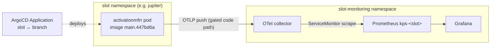
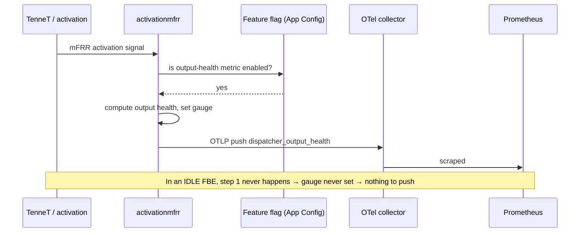

# The FBE metric pipeline — why `dispatcher_output_health` never shows in an idle Feature Branch Environment

A developer needs to see one metric — `dispatcher_output_health` — in Grafana so they can prove a new
alert fires and clears. They deploy, they open Grafana, and the metric isn't there. The natural
conclusion is "something is broken." It isn't. This document builds the actual metric pipeline inside a
Feature Branch Environment (FBE) from first principles, so that by the end you can look at "a metric is
missing" and *immediately* tell whether it's a broken pipeline, a wrong query, a not-deployed branch, or
— the answer here — a metric that an **idle** environment was never going to produce.

## Audience & scope

For an on-call or platform engineer who can run `kubectl` but has never traced how a VPP dispatcher's
metrics reach a per-slot Prometheus. Scope: OTLP-push vs scrape, the OTel collector, the `exported_job`
relabel, auto-instrumented vs domain metrics, and how ArgoCD binds a slot to a branch. Out of scope:
the dispatcher's business logic and the App Configuration feature-flag internals (named, not dissected).

## Knowledge Contract

After reading this you can:

1. **draw** the path a dispatcher metric takes: app → OTel collector → per-slot Prometheus → Grafana;
2. **explain** why every dispatcher series carries an `exported_job` label (and what that reveals);
3. **distinguish** an auto-instrumented metric (always present) from a domain metric (earned by doing
   work) by looking at what a job emits;
4. **diagnose** a "missing metric" into one of four causes with one `kubectl`/`promtool` probe each;
5. **reject** the conclusion "the PR is broken" when the real cause is an idle test environment;
6. **adapt** the reasoning to any traffic-gated metric on an ephemeral environment.

This does **not** teach how to author OTel collector configs or the FBE provisioning pipeline.

## TL;DR picture

Read this as a left-to-right pipeline with a two-tier legend: the top row is the path, the bottom two
lines say which metrics ride it for free versus which must be earned.

```text
   activationmfrr pod ──OTLP push──► OTel collector ──scrape──► Prometheus ──► Grafana
   (exported_job=Activation mFRR)     (slot-monitoring)         (kps-<slot>)     (<slot>.dev...)

   Emits FOR FREE (always):   messaging_kafka_*, messaging_eventhub_*, target_info
   Emits ONLY WHEN WORKING:   dispatcher_output_health   ← needs an activation + a feature flag
                                      ▲
                              idle FBE = no activation = never produced
```

The pipeline is fully intact. The metric is missing because an idle dispatcher never runs the code that
computes it.

## First principles (climb these in order)

- **Scrape vs push.** Classic Prometheus *pulls* `/metrics` from a target. These dispatchers instead
  *push* via **OTLP** (OpenTelemetry's protocol) to a collector. So there is no `/metrics` on the app to
  curl — the collector is the middleman.
- **OTel collector.** Receives OTLP from many services and *re-exposes* their metrics on a single
  Prometheus endpoint, which the slot's Prometheus then scrapes (via a `ServiceMonitor`).
- **`exported_job`.** When the collector re-exposes metrics, each carries its own `job` label. To avoid
  colliding with the *collector's* `job`, Prometheus renames the original to **`exported_job`**. So a
  label named `exported_job="Activation mFRR"` is a fingerprint: *this metric came through the OTel
  push path, not a direct scrape.*
- **Auto-instrumented vs domain metric.** OTel client libraries emit *plumbing* metrics for free — every
  Kafka consume, every Event Hub publish — the moment the process starts. **Domain** metrics
  (`dispatcher_output_health`) are emitted by *application code that runs only when the app does its
  job*. Idle app → plumbing yes, domain no.
- **FBE = namespace + branch.** A Feature Branch Environment is a namespace in the Sandbox cluster
  `vpp-aks01-d`, plus a companion `<slot>-monitoring` namespace with its own Grafana + OTel + Prometheus.
  **ArgoCD binds exactly one git branch to each slot.** So "which slot runs my branch?" has a definite,
  queryable answer — and it's often "none."
- **`PrometheusRule`.** The CRD that holds alert expressions. A Prometheus only evaluates rules that are
  actually *loaded into it* — deploying a values file elsewhere does nothing here.

## The system: one dispatcher metric's journey

The question this answers: *if the pipeline is healthy, where exactly could a single metric fall out?*



**Reading it:** the solid arrows are the metric path; the dotted arrow is *deployment*, a separate
control plane. I confirmed every solid box is `Running` in every slot and that the collector→Prometheus
scrape works (`count(up)` returns data, and 114 `exported_job="Activation mFRR"` series flow through).
So a missing metric cannot be a dead collector or a dead Prometheus — those are ruled out by evidence.
The only place `dispatcher_output_health` can be lost is the very first hop: **the app never pushed it.**
**Keep:** in a push pipeline, "metric missing but job present" points at the application, not the
monitoring stack.

## Mechanism over time: when would the metric appear?

A different angle — not the static topology but the *ordering* that has to happen for the metric to
exist at all:



**Reading it:** the metric's existence is *downstream* of an activation and a feature flag. Remove the
first message — which is exactly what an idle Sandbox FBE with no real TenneT traffic does — and the
whole chain never starts. The metric isn't "late" or "broken"; it was never asked to exist. **Keep:**
a domain metric has preconditions; if you don't reproduce the preconditions, absence is the *correct*
behavior, not a bug.

## The three walls between the developer and a green test

This is the diagnostic surface — what to actually check, in order, when "I can't see my metric on an
FBE." Each wall is independent and each has a one-line probe.

```text
Wall 1 — Is my branch even deployed?
         kubectl get applications -n argocd  → is any slot on my branch?   (often: NO)
              │ (branch deployed)
              ▼
Wall 2 — Is the metric being emitted at all?
         promtool ... 'dispatcher_output_health'      → empty
         promtool ... 'group by(__name__)({exported_job="Activation mFRR"})' → messaging-only
              → metric is gated (needs activation + FF), not broken
              │ (metric emitting)
              ▼
Wall 3 — Does this FBE's Prometheus even load the alert rule?
         kubectl get prometheusrules -A  → only monitoring-stack has rules; no slot has the dispatcher rule
              → even a perfect metric wouldn't make the ALERT fire here
```

**Reading it:** the developer hit all three walls at once, which is why it felt like "everything is
broken." But each wall is a different plane — deployment (ArgoCD), emission (app + FF + traffic), and
rule-loading (monitoring values) — and none of them is a defect in the alert PR. **Keep:** "missing
metric" is never one question; it's three planes, checked in order.

## Why the tempting explanations are wrong — with the mechanism

- **"The PR is broken."** The PR only adds an alert *rule*; the *metric* comes from an already-merged
  change in a different service. The rule can't summon a metric the running code doesn't emit. Blaming
  the PR misroutes the fix to the wrong repo.
- **"Sandbox Grafana is broken / has no metrics."** Grafana and Prometheus are up and full of series —
  just not this one. The absence is specific, not systemic. (This is why Roel split "sandbox no metrics"
  into a *separate* ticket: it's an environmental precondition problem, not a PR blocker.)
- **"Redeploy / recreate the FBE."** Recreating the environment doesn't create TenneT activations or
  flip a feature flag, so the gated metric still won't appear — and destroying an FBE has its own
  hazards. The mechanism (no activation → no metric) is untouched by a redeploy.

## Evidence & uncertainty

| Claim | Status | Source |
|-------|--------|--------|
| Pipeline is healthy: collector/Prometheus/Grafana Running; `count(up)` returns data | FACT | live `kubectl get pods` + `promtool` |
| `exported_job="Activation mFRR"` emits 114 series, all messaging/plumbing; no `dispatcher_output_health` | FACT | live `promtool group by(__name__)` |
| No slot runs Julian's branch; slots bind to other branches | FACT | live `kubectl get applications -n argocd` |
| No `<slot>-monitoring` loads the dispatcher alert rule | FACT | live `kubectl get prometheusrules -A` |
| The metric is activation-traffic/feature-flag-gated | INFER | healthy pipeline + gauge absent across all builds + team thread (FF, traffic) |
| The exact feature-flag name that enables the metric | UNVERIFIED | App Config is private-endpoint; probe: ask Core/Hein or read App Config from AVD |

*Visual coverage: topology → the app→OTel→Prom→Grafana flowchart (where a metric can fall out); data-flow
over time → the activation sequence (why the metric needs a precondition); decision/epistemic → the
three-walls ladder (how to diagnose "missing metric").*
*Angles excluded: state-lifecycle — the pipeline is a straight-through path with no interesting mode
machine; failure-threshold — nothing crosses a limit here, the metric is simply never produced, so
there is no threshold curve to draw.*

## Go deeper

- [OpenTelemetry Collector (OTLP receiver, Prometheus exporter)](https://opentelemetry.io/docs/collector/)
- [Prometheus `honor_labels` / the `exported_` prefix mechanism](https://prometheus.io/docs/prometheus/latest/configuration/configuration/#scrape_config)
- [kube-prometheus-stack `ServiceMonitor` / `PrometheusRule`](https://prometheus-operator.dev/docs/developer/getting-started/)
- [ArgoCD Applications & ApplicationSets](https://argo-cd.readthedocs.io/en/stable/operator-manual/applicationset/)

## Challenge-defense

- **"How do you know the pipeline isn't the problem?"** The same job that would carry
  `dispatcher_output_health` carries 114 other live series, and `count(up)` returns data — the transport
  demonstrably works for everything except this gated metric.
- **"Could the metric just have a different name?"** I listed *every* metric name under
  `exported_job="Activation mFRR"` — they are all `messaging_*` / `target_info`. Nothing health- or
  output-shaped exists under that job, so it isn't a rename; it's non-emission.
- **"What would change your mind that it's traffic/FF-gated?"** If `count(dispatcher_output_health{...})`
  returns > 0 in a healthy, *idle* env, then the metric is continuous and its absence would signal a real
  emission bug. That single probe flips the conclusion.
- **"Where does this model break?"** If a future dispatcher build emits the health gauge at startup
  (not gated), the "idle env proves nothing" advice would be too conservative — re-verify emission per
  build.

## Self-test (rebuild the reasoning)

1. Draw the metric path and mark the one hop where `dispatcher_output_health` is lost. Why that hop?
2. You see `exported_job="X"` on a series. What does that label tell you about how it arrived?
3. A metric is missing on an FBE. Give the three probes, in order, and what each rules out.
4. Transfer: a colleague can't see `orders_processed_total` on their ephemeral env. Walk them through
   the same diagnosis without assuming anything is broken.

**Success condition:** you reach "gated domain metric on an idle env" for the right reasons, and you can
name the three planes (deploy / emit / rule-load) unprompted.

## Durable principle (strip the nouns)

*Plumbing is free; domain signal is earned.* On any push-based telemetry pipeline, an idle service emits
its auto-instrumentation and nothing else. When a specific metric is missing while its job is present,
the transport is exonerated and the cause is upstream — a code path that didn't run, a flag that's off,
or traffic that never came. An empty test environment is not a validation of a metric; it's the absence
of the work that would produce it.
