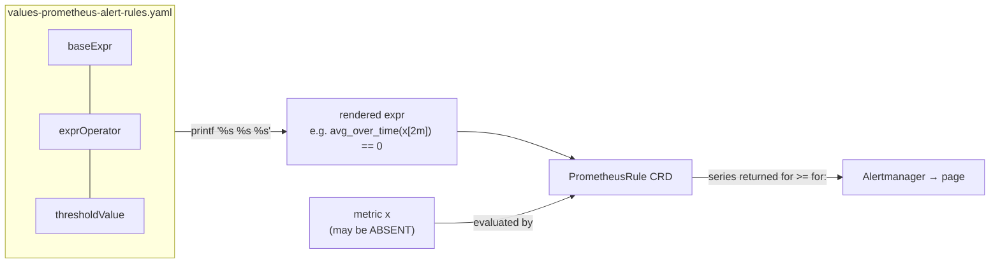

# Absent-aware PromQL alerting — why `avg_over_time(x) == 0` goes silent, and the form that doesn't

Someone wrote a Prometheus alert to catch a dispatcher going unhealthy. It reads
`avg_over_time(dispatcher_output_health{...}[2m]) == 0`. It looks obviously correct — "fire when the
average health is zero." It is, in fact, **silent during the worst outage**: when the dispatcher is
completely down and emitting nothing at all, this alert says nothing. This document explains exactly why
that happens, why the "obvious" fix (`or absent_over_time(...) == 1`) is right in spirit but fragile in
production, and what the most solid form actually is — down to the level where you can defend every
character to a skeptical reviewer.

## Audience & scope

For an on-call engineer or reviewer who can read PromQL but has never had to reason about what an
expression does when the metric **isn't there**. Scope: the semantics of range-vector aggregation,
comparison-as-filter, `absent`/`absent_over_time`, the `or` set-union, and how those compose into a
*deadman* health alert. Out of scope: Alertmanager routing internals and recording rules.

## Knowledge Contract

After reading this you can:

1. **draw** what a PromQL comparison does to an empty result, and why "no series" is different from "a
   series equal to zero";
2. **explain** why `avg_over_time(x) == 0` cannot fire when `x` is absent;
3. **trace** the fire/no-fire outcome of three candidate expressions across the four cases
   {healthy, unhealthy, absent, partially-absent};
4. **reject** the naive `absent_over_time(...) * 0` and even the correct-looking
   `... == 0 or absent_over_time(...) == 1` — and say *why* each fails or is fragile;
5. **defend**, against a reviewer, the claim "never ship an `absent()` arm before the metric is
   confirmed emitting";
6. **adapt** the reasoning to a different deadman alert (a heartbeat counter, a queue-depth gauge).

This document does **not** teach Alertmanager grouping/silencing configuration beyond how label sets
affect alert identity.

## TL;DR picture

The whole bug lives in one column of this diagram — read what each half of the expression returns when
the metric is present versus absent:

```text
                 metric PRESENT                         metric ABSENT (dispatcher down)
                 ┌───────────────┐                       ┌───────────────┐
avg_over_time →  │ returns a num │                       │ returns NOTHING│  ← empty vector
     == 0     →  │ filter: keep  │                       │ filter has     │
                 │ if ==0 else   │                       │ nothing to keep│
                 │ drop          │                       │ → still empty  │
                 └───────┬───────┘                       └───────┬───────┘
                    fires if 0                              NEVER fires   ← the bug
```

The whole bug is in the right-hand column: **a filter over an empty set is still empty.** "Down" looks
identical to "fine" to this expression.

## First principles (climb these in order)

- **Instant vector**: the set of time series that match a selector *right now*, each with one value.
  If nothing matches, the instant vector is **empty** — not zero, *empty*.
- **Range vector**: `x[2m]` — for each matching series, the samples in the last 2 minutes. A series with
  *no* samples in that window contributes **no element** to the range vector.
- **`avg_over_time(x[2m])`**: averages each series' samples and returns an instant vector of per-series
  averages. A series with no samples in the window produces **no output** — the function does not invent
  a placeholder (it does **not** return NaN for "no samples"; NaN only appears if the present samples
  are themselves NaN). This is the load-bearing primitive.
- **Comparison without `bool` is a *filter*.** `V == 0` keeps the elements of `V` whose value is 0 and
  **drops the rest**. It does not turn `V` into 0/1. Crucially: *filtering an empty vector yields an
  empty vector.* There is nothing to test.
- **`absent_over_time(x[2m])`**: the mirror image — it returns **empty** if the range has any samples,
  and a **single series valued `1`** if the range is empty. The returned series is labelled only from
  the selector's *equality* matchers (so `{exported_job="Activation mFRR"}`, not the pod/instance
  labels). `absent(x)` is the instant version.
- **`or` is a set union**: `A or B` = every element of `A`, plus every element of `B` whose label set
  isn't already present in `A`. `or` has the *lowest* precedence; `==` binds tighter. So
  `A == 0 or B == 1` parses as `(A == 0) or (B == 1)`.
- **`for:`** makes an alert wait: the expression must return a series *continuously* for the `for:`
  duration before the alert fires. The wait is tracked **per output series identity** — its full label
  set. Change the labels and the clock restarts.

Everything below is just these seven facts interacting.

## The system: how a values file becomes a firing alert

Here is where the expression actually comes from and where it runs. The question this answers: *which
knobs in the YAML control the final expression, and where does absence enter the picture?*



**Reading it:** the reviewer sees three innocent-looking knobs — a base expression, an operator, a
threshold — that a Helm template glues into one string. The metric enters only at evaluation time,
*inside the cluster*, which is why you cannot judge the alert from the YAML alone: the same string is
"correct" or "permanently broken" depending on whether `x` is a live series. **Keep:** the alert's
truth depends on a fact (does `x` exist?) that lives outside the file you are reviewing.

## Mechanism over time: three expressions, four cases

This is the heart of it — a different angle from the topology above: not *where the expression comes
from* but *what it decides* in each world-state. The four cases are the entire input space for a
single-series health gauge.

| Case | `avg_over_time(x[2m])` | Committed: `avg==0` | Alex's: `avg==0 or absent==1` | Recommended: `max by(...)<1 or absent()` |
|------|------------------------|---------------------|-------------------------------|------------------------------------------|
| Healthy (x ≥ 1) | a number ≥1 | drop → **no fire** ✓ | no fire ✓ | no fire ✓ |
| Unhealthy (sustained 0) | 0 | keep → **fire** ✓ | fire ✓ | fire ✓ |
| **Absent (down 2m)** | empty | **empty → NO FIRE ✗** | absent arm → **fire** ✓ | absent arm → **fire** ✓ |
| Partial absence (>1 series, one vanishes) | per present series | vanished series silent ✗ | still silent ✗ (absent needs *all* gone) | still silent ✗ (add a count alert) |

**Reading it:** every expression agrees on the two easy columns. The whole argument is the third row —
the **absent** case — where the committed alert fails and both fixes succeed. The fourth row is the
subtle one nobody's expression catches for free: `absent` is all-or-nothing over the *whole* selector,
so if there are several series and only one dies, no arm fires. **Keep:** the debate is entirely about
the absent and partial-absent rows; the healthy/unhealthy rows are a distraction.

Why are the two arms safe to `or` together? Because they are **mutually exclusive**: if `avg_over_time`
returned something, the window had samples, so `absent_over_time` is empty — and vice versa. They can
never both fire, so the `or` never has to resolve a label collision. That is the one structural gift
that makes the pattern work at all.

## The local mental model (redraw this from memory)

This small ladder is the decision surface a reviewer should carry — a third angle: not what the
expression computes, but what you should *do*, and where the trap is:

```text
  present?  ── yes ──►  is it 0 / < 1 ?  ── yes ──►  FIRE (health arm)
     │                        └─ no ─────────────►  quiet
     └── no (absent) ─────────────────────────────►  FIRE (absent arm)
                                                       ▲
                        DANGER: "absent" also fires when the
                        metric NEVER EXISTED (typo, wrong label,
                        not-yet-shipped). Absence ≠ unhealthy.
```

This ASCII ladder is the decision surface — a third angle: not what the expression computes, but *what
you should do*. The dangerous branch is the bottom one: `absent()` cannot tell "was here, now gone"
(real outage) from "never here" (misconfiguration or a metric that isn't emitting yet). Both produce an
identical critical page.

## Why the naive fixes fail — with the mechanism

**`avg_over_time(...) or absent_over_time(...) * 0`** (the first draft in the thread): broken two ways.
Syntactically the label matchers and brackets don't line up. Semantically, `* 0` collapses the
"absent" signal to the value 0, then relies on a downstream `== 0` — but multiplying by zero destroys
the very information (the `1` that means "absent") you needed. It doesn't *compare* anything; it fakes a
value. Reject it because it confuses "produce a 0-valued series" with "test a condition."

**`avg_over_time(...) == 0 or absent_over_time(...) == 1`** (the corrected proposal): logically correct
across the easy cases, but it carries four production hazards, each with a concrete mechanism:

1. **Ships a permanent false page if the metric isn't emitting yet.** `absent_over_time` returns `1`
   *whenever the selector matches nothing* — including "this metric has never existed." On the target
   cluster today, `dispatcher_output_health` matches **zero** series, so this arm would fire a CRITICAL
   after 2 minutes and never stop. On-call silences the alertname to survive — and now it's dead even
   after the metric ships. This is the single most important failure mode.
2. **The `for:` clock resets on a flip.** The health arm fires with the *full* label set
   (`{exported_job, instance, pod, …}`); the absent arm fires with only `{exported_job}`. When a
   dispatcher goes present-but-0 → absent, the alert's label set *changes*, Prometheus sees a **new**
   series, and the `for: 2m` timer restarts — so a dispatcher crash-looping faster than 2m may **never**
   satisfy `for:`. You lose the page during exactly the worst outage.
3. **Double dwell.** `avg_over_time[2m]` needs the window to fill, *then* `for: 2m` needs it to persist
   → ~4 minutes to page on a minute-critical service.
4. **`== 0` is a brittle exact match** on a value that could be fractional; `< 1` ("never reached
   healthy") is robust.

## The most solid form

Split into two alerts with **unified label sets**, use an instant gauge with a robust threshold, and
give the absent alert a longer `for:`:

```yaml
DispatcherOutputHealthZero:            # present but unhealthy
  for: 2m
  severity: { critical: { thresholdValue: "1" } }
  baseExpr: 'max by (exported_job) (dispatcher_output_health{exported_job="Activation mFRR"})'
  exprOperator: "<"                    # → max by(exported_job)(...) < 1

DispatcherOutputHealthAbsent:          # not reporting
  for: 5m
  severity: { critical: { thresholdValue: "1" } }
  baseExpr: 'absent(dispatcher_output_health{exported_job="Activation mFRR"})'
  exprOperator: "=="                   # → absent(...) == 1  (the "== 1" is forced by the template)
```

`max by (exported_job)` collapses both arms to the *same* label `{exported_job="Activation mFRR"}`, so
there is no label flip and no `for:` reset. `< 1` says "never healthy" without exact-match brittleness.
The instant gauge drops the double dwell. The longer absent `for:` tolerates rolling deploys. And
critically — **you do not merge the absent arm until the metric is confirmed emitting.**

## Evidence & uncertainty

| Claim | Status | Source |
|-------|--------|--------|
| `avg_over_time` over an empty window yields no series (not NaN); `==` without `bool` filters | FACT | Prometheus functions & operators docs (see Go deeper) |
| `absent_over_time` returns a 1-valued series labelled from equality matchers when the range is empty | FACT | Prometheus functions docs |
| `or` = LHS ∪ (RHS without matching labels); `==` binds tighter than `or` | FACT | Prometheus operators / precedence docs |
| The metric matches 0 series on the target cluster today | FACT | live `promtool query instant` on FBE Prometheus |
| The metric is traffic/feature-flag-gated (so absence is expected in an idle env) | INFER | pipeline healthy yet gauge absent across all builds + team thread |

*Visual coverage: data-shape → the system flowchart (which knobs make the expr, and — read alongside the
present-vs-absent picture above — why absence is silent); decision → the ASCII ladder (what to do, and
the absence trap). The four-case truth table carries the filter-mechanism as content, not a separate diagram.*
*Angles excluded: feedback-loop — the alert is open-loop (a page does not change the dispatcher's
health, so there is no loop to draw); blast-radius — a single alert on one service, no cascade.*

## Go deeper

- [Range-vector aggregation (`avg_over_time`, `max_over_time`)](https://prometheus.io/docs/prometheus/latest/querying/functions/#aggregation_over_time)
- [`absent` / `absent_over_time`](https://prometheus.io/docs/prometheus/latest/querying/functions/#absent_over_time)
- [Comparison (filter vs `bool`), `or` set semantics & precedence](https://prometheus.io/docs/prometheus/latest/querying/operators/)
- [Alerting rules & `for:`](https://prometheus.io/docs/prometheus/latest/configuration/alerting_rules/)

## Challenge-defense

- **"How do you know `== 0` is silent on absence, not just untested?"** Because comparison without
  `bool` filters, and there is nothing to filter: `avg_over_time` emits no series when the window is
  empty, and filtering an empty vector is empty. Two documented facts compose to a guaranteed no-fire.
- **"What else could explain the metric not showing — maybe the query's wrong?"** The pipeline is
  provably alive: the *same* selector's job (`exported_job="Activation mFRR"`) publishes 114 other
  series, and `count(up)` returns data. So the query mechanism works; the specific metric isn't emitted.
- **"What would falsify 'don't ship absent before the metric emits'?"** If `dispatcher_output_health`
  were emitted continuously (not activity-gated) in a healthy env, then its absence would reliably mean
  "down," and the absent arm would be safe. The falsifier is a single probe:
  `count(dispatcher_output_health{exported_job="Activation mFRR"}) > 0` in a healthy env.
- **"Where does the recommended form still fail?"** Partial absence: if there are several series and one
  vanishes, neither arm fires — add `count(...) < <expected>` if replicas > 1.

## Self-test (rebuild the reasoning, don't recall)

1. Draw what `avg_over_time(x[2m]) == 0` returns when `x` has been absent for 5 minutes, and say why.
2. A colleague proposes `min_over_time(x[5m]) == 0` for the same deadman. Does it fire on total absence?
   (Answer: no — same trap; `min_over_time` of an empty range is empty.)
3. Why does splitting into two alerts fix the `for:`-reset that the single `or` expression suffers?
4. You inherit an alert `absent(kafka_lag{topic="t"})`. Under what condition does it page falsely, and
   what one probe clears the doubt?

**Success condition:** you can explain each answer from the seven primitives without re-reading, and you
can state the merge precondition unprompted.

## Durable principle (strip the nouns)

*A comparison in a query language is a filter, and a filter over nothing is nothing.* Any "value equals
bad" alert is silent on absence; any "absent means bad" alert is a false alarm until the thing it
watches is proven to normally exist. A deadman needs **both** halves, with the same identity, and the
"absent" half must never be armed before its subject is real.
