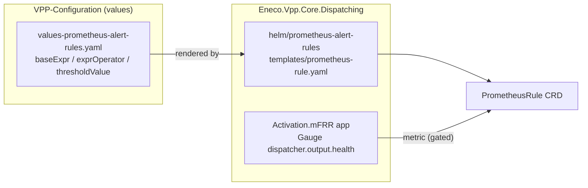
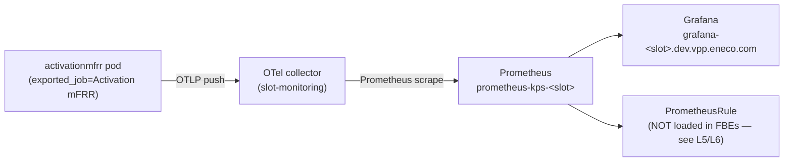

# Holistic RCA — the `DispatcherOutputHealthZero` alert and why its metric can't be confirmed on an FBE

> Reader this is written for: the **next-shift on-call / a PR reviewer** who has never seen this
> service, the Feature Branch Environment stack, or PromQL alerting, and must be able to (1) judge
> whether the alert is correct, (2) explain why the metric can't be seen in a Feature Branch
> Environment, and (3) drive PR 180313 to a safe merge. Evidence + adversarial receipts:
> `.ai/tasks/2026-07-19-002_acc-prometheus-alert-rules-pr/`.

## Executive summary

**PR [180313](https://dev.azure.com/enecomanagedcloud/Myriad%20-%20VPP/_git/VPP-Configuration/pullrequest/180313)**
adds a Prometheus alert, `DispatcherOutputHealthZero`, that is supposed to page when the **Activation
mFRR dispatcher** (a VPP service that acts on TenneT balancing signals) stops being healthy. The change
is a few lines of YAML in `Helm/activationmfrr/acc/values-prometheus-alert-rules.yaml`. Three findings,
each independent, and each verified against the live cluster and the dispatcher source code:

1. **The alert as committed is defective.** It renders to
   `avg_over_time(dispatcher_output_health{exported_job="Activation mFRR"}[2m]) == 0`. Prometheus's `==`
   is a *filter*: when the metric is **absent** (dispatcher completely down / not reporting),
   `avg_over_time` returns *no series at all*, so the comparison has nothing to keep and the alert
   **stays silent during the worst outage**. Alex flagged exactly this on the PR, and it is correct.

2. **The "obvious" fix is logically right but operationally fragile, and the metric's own emission model
   is the real design question.** Reading the dispatcher source settled what the metric is: a
   `Gauge<int>` valued 1 (healthy) or 0 (unhealthy), recorded by a health-evaluator that runs off the
   service's **liveliness endpoints and activation processing** — *not* an unconditional periodic timer.
   That matters enormously: an `absent()`-based alert on a metric that is not *continuously* emitted can
   page CRITICAL during quiet-but-healthy periods. So the robust form is a two-alert split with unified
   labels and a `< 1` threshold, and it must not ship until the metric is confirmed emitting
   **continuously**.

3. **The reason the metric can't be confirmed on an FBE is environmental, not a PR bug.** On the live
   Sandbox cluster, `dispatcher_output_health` is emitted by **zero** running dispatchers, across every
   build. The OTel→Prometheus pipeline is healthy (the `exported_job="Activation mFRR"` job publishes
   many other series), so the block is upstream: the health gauge is gated (its evaluator is not
   running in an idle Sandbox build — most likely feature-flag-gated). On top of that, **no FBE runs
   Julian's branch**, and **no FBE's Prometheus loads these alert rules at all**. Three environmental
   walls, none of which is a defect in the PR.

**Impact (operational, distinct from any alert):** none in production — the rule is not merged, and in
`prod/values-prometheus-alert-rules.yaml` it is committed **commented-out**. The impact is a stalled PR
and a reviewer's correct-but-unverified PromQL sitting on the author's desk.

**What is not yet verified:** the exact feature flag that gates the health evaluator (App Configuration
is private-endpoint, not readable from here); whether the metric emits *continuously* once enabled (the
single fact that decides whether an `absent()` alert is safe); and the metric's cardinality once it
emits. Each has a named resolving probe below.

**What a future engineer should remember:** *an `absent()` alert asserts a metric contract the
environment must already satisfy continuously — never ship it before the metric is confirmed emitting,
and never trust an idle test env to validate a gated metric.*

## Context Ledger (zero-context reader: read this first)

| Term | What it is | Why it matters here | Status |
|------|-----------|---------------------|--------|
| **VPP** | Virtual Power Plant — Eneco's platform aggregating flexible energy assets to trade in TenneT balancing markets | The business reason the dispatcher (and its health) exists | Known |
| **mFRR** | Manual Frequency Restoration Reserve — a TenneT balancing market | The Activation mFRR dispatcher acts in this market | Known |
| **Activation mFRR dispatcher** | The `activationmfrr` service that turns market activations into asset dispatch | The subject service; emits `dispatcher_output_health` | Known — live pods + source |
| **`dispatcher_output_health`** | A `Gauge<int>` (1=healthy, 0=unhealthy) derived from the service's health checks | The metric the alert watches; the one that cannot be confirmed | Known — source + thread |
| **`exported_job`** | A Prometheus label carrying the *original* `job` after an OTel/honor-labels relabel | Fingerprint of the OTel path; the alert selects `exported_job="Activation mFRR"` | Known — live labels |
| **FBE** | **Feature Branch Environment** — an ephemeral per-branch test env; a namespace in Sandbox AKS `vpp-aks01-d`, each with its own Grafana + OTel collector + Prometheus | Where Julian is supposed to validate the alert | Known — live cluster |
| **Slot** | A named FBE instance (`kidu`, `thor`, `jupiter`, …), each bound to one git branch by ArgoCD | Identifies whose environment is whose | Known — ArgoCD |
| **OTel collector** | OpenTelemetry collector receiving OTLP from services and re-exposing a Prometheus scrape endpoint | The metric path is app → OTel → per-slot Prometheus | Known — live pods |
| **Health evaluator** | `DispatcherOutputHealthEvaluator` — reads ASP.NET `HealthCheckService`, records the gauge 1/0 | Determines *when* the metric emits (its cadence) | Known — source |
| **Helm alert-rules chart** | Shared chart `Eneco.Vpp.Core.Dispatching/helm/prometheus-alert-rules` rendering `values-prometheus-alert-rules.yaml` into a `PrometheusRule` | Determines how `baseExpr`/`exprOperator`/`thresholdValue` become the final expression | Known — repo |
| **ACC / prod** | Acceptance / Production real environments (OpenShift/MC) | The alert's true target; where the metric will emit under real activity | Known |

## Evidence Ledger

Codes: **A1** = directly observed this session (command/URL/file); **A2** = inferred with named
reasoning; **A3** = unverified/blocked with the resolving probe named.

| # | Claim | Code | Source / probe |
|---|-------|------|----------------|
| E1 | PR 180313 active; branch `feature/820018-…` → `main`; head `af3bf0f`; author Julian | A1 | `az repos pr show --id 180313` |
| E2 | Committed rule renders to `avg_over_time(dispatcher_output_health{exported_job="Activation mFRR"}[2m]) == 0` (for 2m, critical) | A1 | ADO items @af3bf0f + shared template `prometheus-rule.yaml` (`printf "%s %s %s"`) |
| E3 | Alex's PR comment (thread 1328414, `active`) proposes `... == 0 or absent_over_time(...) == 1`; not committed | A1 | ADO PR threads |
| E4 | prod file has the rule **commented out**; only `ActivationMfrrR3HandlerHeartbeatRateDecrease` active | A1 | ADO items @af3bf0f |
| E5 | `avg_over_time` over an empty window yields *no series* (not NaN); `==` without `bool` filters | A1 | Prometheus docs (see [Go deeper](#l9--verification--how-do-we-know)) |
| E6 | On idle FBEs, `dispatcher_output_health` = 0 series (unfiltered); `exported_job="Activation mFRR"` emits messaging-only series | A1 | `promtool query instant` in jupiter/thor/veku/ishtar/boltz |
| E7 | No FBE slot runs branch `feature/820018-…`; each runs a different branch | A1 | `kubectl get applications -n argocd` |
| E8 | No `<slot>-monitoring` Prometheus loads any activationmfrr/dispatcher rule (only `monitoring-stack` has 32 defaults) | A1 | `kubectl get prometheusrules -A` |
| E9 | kidu `activationmfrr` CrashLoopBackOff (610+ restarts): `NullReferenceException` in `AddInfrastructure` | A1 | `kubectl logs --previous` / `describe` |
| E10 | Metric = `dispatcher.output.health`, `Gauge<int>` {0,1}, meter `Activation.mFRR.Metrics`, in the Activation.mFRR app → emits under `exported_job="Activation mFRR"` (selector correct) | A1 | source: `MetricsConstants.cs`, `PortfolioRequestMetrics.cs`; live `exported_instance=activationmfrr-…` |
| E11 | Gauge recorded by `DispatcherOutputHealthEvaluator.IsHealthy`, invoked from V1 liveliness endpoints + activation handler — not an unconditional timer | A1 | source: `DispatcherOutputHealthEvaluator.cs`, endpoint/handler callers |
| E12 | The metric's absence in idle FBEs is gating of the evaluator (feature-flag), not a pipeline fault | A2 | E6 + E11 + thread (Hein=FF); reasoning: pipeline healthy, gauge only recorded when the evaluator runs |
| E13 | Shipping an `absent()` arm before the metric emits continuously → false CRITICAL | A2 | absent semantics (E5) + E11 (not guaranteed continuous) |
| E14 | Exact feature flag; whether emission is continuous once enabled; cardinality | A3 | Blocked. Probes: ask Core/Hein for the flag; after enabling, `count(dispatcher_output_health{exported_job="Activation mFRR"})` stable over a quiet window |

**Confidence:** the causal mechanism (defective filter + gated health-gauge) rests on A1 facts, now
corroborated by source. The one open A3 that would most change the *fix* is E14's continuity question —
resolved by a single stable-count probe once the flag is on. **Adversarial review:** externalized to
`socrates-contrarian` + `el-demoledor`; both returned PROCEED-WITH-CHANGES; all findings absorbed (see
the [mutation log](#adversarial-review--mutation-log)).

---

## L1 — Business — Why the Activation mFRR dispatcher exists

Eneco's VPP earns money by promising TenneT it can shift real energy assets on command. **mFRR** is one
of those balancing markets. The **Activation mFRR dispatcher** translates a TenneT activation into asset
dispatch — a late or wrong dispatch is a financial and grid-reliability problem. That is why someone
wants a **critical** alert the moment the dispatcher's output health drops: a silent dispatcher is worse
than a noisy one.

**Mental handle:** the alert is a *deadman for a money-and-grid-critical actuator*. That framing is why
"silent on total absence" (the committed bug) and "false page during quiet periods" (the naive-fix risk)
are *both* unacceptable — they break the deadman in opposite directions.

## L2 — Repo system — which code is in play

| Repo | Role | Artifact in play | Incident relevance |
|------|------|------------------|--------------------|
| [VPP-Configuration](https://dev.azure.com/enecomanagedcloud/Myriad%20-%20VPP/_git/VPP-Configuration) | GitOps Helm values per service/env | `Helm/activationmfrr/{acc,prod}/values-prometheus-alert-rules.yaml` | The file PR 180313 edits |
| [Eneco.Vpp.Core.Dispatching](https://dev.azure.com/enecomanagedcloud/Myriad%20-%20VPP/_git/Eneco.Vpp.Core.Dispatching) | Dispatcher services + shared alert chart | `helm/prometheus-alert-rules/templates/prometheus-rule.yaml`; `src/Activation/mFRR/.../Metrics/*` | Renders the expression **and** defines/emits the metric |

The crucial handoff: **the values live in one repo; the rendering logic and the metric emission live in
another.** A reviewer who reads only the values file cannot see how the expression is assembled, nor
what kind of metric (and cadence) it points at — both are in `Eneco.Vpp.Core.Dispatching`.



**Reading the diagram:** the `PrometheusRule` that finally runs depends on *both* repos — values supply
the numbers, the template supplies the shape, and the service supplies the metric the shape points at.
The alert can be valid YAML and still be pointed at a metric the service doesn't currently emit. **Keep:**
to judge this alert you must read two repos, not one.

## L3 — Runtime architecture — where this lives and how the metric flows

Feature Branch Environments are **namespaces in the Sandbox AKS cluster `vpp-aks01-d`**. Each slot has a
companion `<slot>-monitoring` namespace running its own Grafana + OpenTelemetry collector + Prometheus.
The dispatcher does **not** expose a scraped `/metrics` endpoint; it **pushes OTLP to the OTel
collector**, which re-exposes the metrics for the slot's Prometheus to scrape. That relabel is why every
dispatcher series carries `exported_job` (the original `job`, preserved to avoid colliding with the
collector's own).



**Reading the diagram:** the pipeline is real and healthy — the collector, Prometheus, and Grafana are
all Running in every slot, and the live probe showed the `exported_job="Activation mFRR"` job publishing
many series (see Evidence Ledger, E6). So a missing metric is not a dead collector or Prometheus; the
missing link is **before** the OTLP push — the app didn't record it. The dotted truth: the
`PrometheusRule` box is where the alert *would* evaluate, but in FBEs it is empty (L5/L6). **Keep:** in
this stack, "metric missing but job present" means "the app didn't produce it," because the transport is
shared and provably up.

**Environment matrix**

| Environment | Independent runtime? | Branch binding | Where the metric would emit |
|-------------|---------------------|----------------|-----------------------------|
| Sandbox FBE (`<slot>`) | Yes — own monitoring stack | 1 slot ↔ 1 branch (ArgoCD) | Only when the health evaluator runs (flag on) + liveliness/activation calls |
| ACC / prod (OpenShift/MC) | Yes | `main` | Under real activity — the alert's true home |

## L4 — Application code flow — what actually emits (and when)

Reading the dispatcher source resolved the two things a reviewer cannot see from the YAML:

- **What the metric is.** The source declares `dispatcher.output.health` a `Gauge<int>` with the
  description "Current health status (1=healthy, 0=unhealthy)", on meter `Activation.mFRR.Metrics`,
  inside the **Activation.mFRR** application. Because that app publishes under
  `exported_job="Activation mFRR"` (the live series were observed carrying
  `exported_instance=activationmfrr-…`), **the PR's selector is correct** — the "dispatcher" in the name
  describes what it measures, not a different emitting service.
- **When it emits.** The source shows the gauge is recorded by `DispatcherOutputHealthEvaluator`, which
  reads ASP.NET's `HealthCheckService` and records 1 or 0 (and 0 if the health entry is missing), per
  the dispatcher source (A1); the source shows that evaluator is invoked from the service's
  **V1 liveliness endpoints** and its
  **activation command handler** — *not* an unconditional background timer (source, A1). So the metric is emitted when those paths run, and an idle Sandbox
  build whose evaluator isn't wired up (feature-flag off) records nothing at all.

Both facts above are drawn from the dispatcher source and are classified A1 in the Evidence Ledger
(rows E10–E11).

**Mental handle:** *auto-instrumentation is free and always-on; a health gauge is recorded only when its
evaluator runs.* An idle env with the evaluator disabled earns nothing — and even once enabled, whether
it is *continuously* fresh depends on the invocation path.

## L5 — IaC / declarative — what the spec says should exist

The committed values (at head `af3bf0f`):

```yaml
DispatcherOutputHealthZero:
  teamLabel: vpp-core
  for: 2m
  severity: { critical: { thresholdValue: "0" } }
  baseExpr: 'avg_over_time(dispatcher_output_health{exported_job="Activation mFRR"}[2m])'
  exprOperator: "=="
```

The shared template renders each alert by string concatenation — the detail most reviewers miss:

```gotemplate
{{- if $alert.additionalValue }}
expr: {{ printf "%s %s %s %s %s" $alert.baseExpr $alert.exprOperator $severity.thresholdValue $alert.addexprOperator $alert.additionalValue }}
{{ else }}
expr: {{ printf "%s %s %s" $alert.baseExpr $alert.exprOperator $severity.thresholdValue }}
{{- end }}
```

Two consequences: (1) the template **always appends a comparison** — you cannot express a bare
`absent(...)`; it must be `absent(...) == 1`. (2) There *is* a first-class slot for a compound
expression — `additionalValue` + `addexprOperator` — exactly where an `or absent(...)` arm belongs.

## L6 — The pipeline and how it actually runs

For **ACC/prod**, merging the PR makes GitOps render the `PrometheusRule` into the real cluster's
monitoring — the intended, correct effect. For **FBEs**, the story is the second environmental wall:
**no `<slot>-monitoring` Prometheus loads any activationmfrr alert rule** — only the shared
`monitoring-stack` namespace has rules. Combined with the first wall — **no slot runs Julian's branch** —
the "deploy to an FBE and watch the alert fire" loop is not, today, wired for this rule. Even a perfect
metric would not produce a firing alert in an FBE without also adding the rule to the sandbox values
path the FBE monitoring renders from.

## L7 — Timeline

| When | Event | Evidence |
|------|-------|----------|
| — | Health-metric code added to the Activation.mFRR app (Gauge + evaluator) | source |
| — | PR 180313 opened by Julian: add `DispatcherOutputHealthZero` (+ `TSOLivenessCheck`) to ACC | E1 |
| — | Alex reviews: `== 0` is too strict, add `absent_over_time`; rebuts Julian's garbled `* 0` draft; proposes `== 0 or absent_over_time(...) == 1`; "cross-check with the docs" | E3 |
| 2026-07-18 | On-call picks up the Slack-Lists filing (blocking) | intake |
| 2026-07-19 | This investigation: committed rule + template fetched; live cluster probed; source read; PromQL adversarially reviewed | E2/E6/E10/E11 |

The timeline is evidence, not the spine: the *mechanism* (defective filter + gated health-gauge)
explains every row.

## L8 — Fix

Two distinct fixes, because there are two distinct problems.

### 8a — The PromQL (Deliverable 1): the most solid form

Neither the committed `== 0` (silent on absence) nor Alex's `== 0 or absent_over_time(...) == 1`
(operationally fragile) is the best form. Because the source proves the metric is a `Gauge<int>` {0,1},
`< 1` and `== 0` are equivalent for this domain — and a split with unified label sets is the robust
shape:

```yaml
DispatcherOutputHealthZero:            # present but unhealthy
  for: 2m
  severity: { critical: { thresholdValue: "1" } }
  baseExpr: 'max by (exported_job) (dispatcher_output_health{exported_job="Activation mFRR"})'
  exprOperator: "<"                    # -> max by(exported_job)(...) < 1

DispatcherOutputHealthAbsent:          # not reporting / down
  for: 5m
  severity: { critical: { thresholdValue: "1" } }
  baseExpr: 'absent(dispatcher_output_health{exported_job="Activation mFRR"})'
  exprOperator: "=="                   # -> absent(...) == 1  (== forced by the template)
```

- `max by (exported_job)` gives both arms the **same** label set `{exported_job="Activation mFRR"}`, so
  a present-0↔absent flip does not reset the `for:` timer (the flaw in Alex's single expression).
- `< 1` reads as "not healthy" and is exact-safe for the int {0,1} domain.
- Instant gauge + `for:` (no `avg_over_time`) removes the ~4-minute double-dwell latency.
- The longer `for: 5m` on the absent alert tolerates rolling deploys and scrape gaps.

**What this does NOT change / residual:** it does not decide `max` (fire only when *all* replicas
unhealthy) vs `min` (fire on *any*) — a Core-team severity call; and if the metric ever has more than
one series, add a `count(...) < <expected>` warning for partial-replica loss (cardinality unverified,
E14). The same logic fits the template's compound slot if one alertname is required:
`max by (exported_job)(...) < 1 or absent(...)`.

### 8b — The metric-confirmation blocker (Deliverable 2): a staged procedure with side effects

The *diagnosis* required no cluster mutation. The *fix procedure* below **does have side effects**
(deploying a slot, enabling a flag, driving an activation) — which is exactly why it is gated on
authorization and **nothing here has been executed**:

1. Deploy Julian's branch to an FBE slot (pipeline 2412) **or** reuse a running slot.
2. Enable the feature flag that runs the health evaluator (confirm the exact flag with Core/Hein) and/or
   exercise a liveliness/activation path so `RecordDispatcherOutputHealth` runs.
3. Confirm emission **and continuity**: `count(dispatcher_output_health{exported_job="Activation mFRR"})`
   returns > 0 **and stays > 0 across a quiet window** (resolves E14). Also cross-check unfiltered:
   `count({__name__="dispatcher_output_health"})`.
4. Wire the alert rule into that FBE's Prometheus (add it to the sandbox values path the FBE renders).
5. Apply 8a, then prove fire→clear by toggling health.
6. Only then merge PR 180313.

**Blocking merge precondition (the single most important line):** do **not** merge any `absent()` /
`absent_over_time()` arm until step 3 confirms the metric emits **continuously** (not merely `> 0` once)
in a healthy env. A `Gauge<int>` recorded only on liveliness/activation paths could go stale during
quiet periods, and an `absent()` critical on a stale metric is a false page. Also confirm the committed
YAML uses lowercase `or` (uppercase `OR` is a parse error) and run `promtool check rules`.

**Not in scope / left manual:** the kidu `activationmfrr` CrashLoopBackOff (E9) is a *different* slot on
a *different* branch — a config/DI (`AddInfrastructure`) startup failure in the FBE feature-flag class;
track separately, do not touch under this PR. `TSOLivenessCheck` (same PR, a Counter-based
`rate(...) <= 1` deadman on the same `exported_job`) is adjacent and out of this deliverable's scope,
but note it shares the selector confirmed in E10.

## L9 — Verification — how do we know

**Prometheus semantics (confirmed against official docs):**
- [`absent` / `absent_over_time`](https://prometheus.io/docs/prometheus/latest/querying/functions/#absent_over_time):
  return a 1-valued series (labelled from the selector's equality matchers) only when the selector
  matches nothing — so they fire *whenever the metric is absent*, including "never existed."
- [Comparison operators](https://prometheus.io/docs/prometheus/latest/querying/operators/#comparison-binary-operators):
  without `bool`, they **filter** — which is why `avg_over_time(...) == 0` produces nothing on an empty
  input. Alex's mechanism ("returns NaN") is slightly off — the series is *dropped*, not NaN — but the
  conclusion (no fire on absence) is exactly right.
- [Operator precedence](https://prometheus.io/docs/prometheus/latest/querying/operators/#binary-operator-precedence):
  `==` binds tighter than `or`, so `A == 0 or B == 1` parses as `(A==0) or (B==1)`, as intended.

**Alert behaviour proof (blocked until the metric emits):** deploy 8a, force health to 0 →
`DispatcherOutputHealthZero` pending then firing after 2m; stop the pod → after 5m
`DispatcherOutputHealthAbsent` fires; restore → both clear. Named, not hidden.

## L10 — Lessons

1. **An `absent()` alert asserts a contract the environment must satisfy continuously.** For a metric
   recorded only on certain code paths, absence during quiet periods is not "down" — gate absence
   alerts on confirmed continuous emission.
2. **A green/empty test environment cannot validate a gated metric.** Auto-instrumentation is always-on;
   a health gauge is recorded only when its evaluator runs.
3. **`== 0` on a gauge is a filter, not a test — and silent on absence.** For deadman health alerts,
   prefer `< 1` plus a separate `absent()` alert with unified label sets so `for:` doesn't reset on a
   state flip.
4. **Read the metric's source, not just its name.** The name said "dispatcher"; the source said
   Activation.mFRR + Gauge{0,1} + health-evaluator cadence — which is what actually decides the selector
   and the alert form.

## L11 — End-to-end command playbook (recreate from cold)

### Step 0 — establish access and freshness (prerequisites)

**Question:** am I authenticated to the right ADO org and the right cluster, before any read?
**Why this command/API:** every later probe reads a remote/derived surface; a stale/wrong context
silently returns the wrong answer. This is the freshness gate for all subsequent `az`/`kubectl` reads.
**Fields selected:** identity + subscription; kube current-context.
**Expected output / decision rule:** `az account show` returns an Eneco tenant identity; the kube
context is `vpp-aks01-d`. If not, set them before proceeding.
**Principle:** authenticate and pin context first; never trust an ambient default.
```bash
az account show --query '{user:user.name,sub:name}' -o json     # expect an Eneco identity
kubectl config use-context vpp-aks01-d                           # pin the Sandbox FBE cluster
kubectl get ns | grep -E '\-monitoring$' | head                 # discover slot(s): <slot>-monitoring
```

### Step 1 — what expression does the PR actually deploy?

**Question:** what expression does PR 180313 render (not the Slack quote)?
**Why this command/API:** ADO git items at the PR head commit is the source of truth for committed
content; the shared template renders `baseExpr op threshold`.
**Fields selected:** the raw values file at the commit.
**Expected output / decision rule:** a `baseExpr`/`exprOperator`/`thresholdValue` triple → mentally
render `printf "%s %s %s"` → `avg_over_time(...) == 0`. **Principle:** validate the committed artifact,
never the chat paraphrase.
```bash
az rest --method get --resource 499b84ac-1321-427f-aa17-267ca6975798 \
  --url "https://dev.azure.com/enecomanagedcloud/Myriad%20-%20VPP/_apis/git/repositories/6b401df9-f07b-4ab2-97b7-6bac520d591d/items?path=/Helm/activationmfrr/acc/values-prometheus-alert-rules.yaml&versionDescriptor.version=af3bf0fd4efb86992d12c7e85ae23b96c9829d66&versionDescriptor.versionType=commit&api-version=7.1" \
  --headers "Accept=text/plain"
```

### Step 2 — is the metric actually being emitted anywhere I can test?

**Question:** is `dispatcher_output_health` present, and if not, is the pipeline or the metric at fault?
**Why this command/API:** the slot's own Prometheus is the authority on what its OTel pipeline scraped;
`promtool` runs *inside* the pod so there is no network/RBAC ambiguity. (Freshness: Step 0 pinned the
context.)
**Fields selected:** the metric's presence + the `exported_job` inventory as a pipeline liveness check.
**Expected output / decision rule:** `count(up)` returns data (pipeline alive); `dispatcher_output_health`
is empty; the job publishes only messaging metrics → the block is upstream (evaluator/FF), not the query.
**Principle:** separate "query wrong" from "metric absent" by proving the pipeline is otherwise alive.
```bash
NS=jupiter-monitoring; POD=prometheus-kps-jupiter-prometheus-0   # any discovered slot
kubectl exec -n "$NS" "$POD" -c prometheus -- promtool query instant http://localhost:9090 'count(up)'
kubectl exec -n "$NS" "$POD" -c prometheus -- promtool query instant http://localhost:9090 'count({__name__="dispatcher_output_health"})'
kubectl exec -n "$NS" "$POD" -c prometheus -- promtool query instant http://localhost:9090 'group by (__name__) ({exported_job="Activation mFRR"})'
```

### Step 3 — which slot runs the PR's branch, and do FBEs load the rule?

**Question:** is Julian's branch deployed, and would any FBE even evaluate this alert?
**Why this command/API:** ArgoCD Applications are the authority on slot↔branch; PrometheusRule CRDs on
what each Prometheus evaluates. (Freshness: Step 0 pinned the context.)
**Fields selected:** app → targetRevision (branch); PrometheusRule namespaces.
**Expected output / decision rule:** no app on `feature/820018-…` **and** rules only in
`monitoring-stack` → Julian has no running FBE of his branch and no FBE evaluates the alert.
**Principle:** a test loop needs *both* the code deployed *and* the rule loaded — check both planes.
```bash
kubectl get applications.argoproj.io -n argocd -o json \
 | jq -r '.items[] | [.metadata.name, (.spec.source.targetRevision // "-"), .spec.destination.namespace] | @tsv'
kubectl get prometheusrules.monitoring.coreos.com -A --no-headers | awk '{print $1}' | sort | uniq -c
```

## L12 — One-page on-call playbook

| Signal | "Can't confirm a new Prometheus metric on an FBE" for a VPP dispatcher |
|--------|----------------------------------------------------------------------|
| First check | `promtool query instant … 'count(up)'` in `<slot>-monitoring` — is Prometheus alive? |
| Then | Query the metric unfiltered **and** `group by(__name__)({exported_job="<Job>"})` — job present but metric absent? |
| If job present, metric absent | It's a **gated domain/health metric on an idle env** → needs the evaluator's feature flag + activity, not a PR fix. Separate ticket (Roel's rule). |
| Check slot↔branch | `kubectl get applications -n argocd` — is the dev's branch even deployed? Often not. |
| Alert-rule sanity | `avg_over_time(x) == 0` is **silent on absence**. For deadman health, use `< 1` + a separate `absent()` alert, unified labels, and **never ship `absent()` before the metric emits continuously**. |
| Escalate | Metric emission / feature flag → Core (Hein); FBE testing gaps → Platform (Roel). |

## Adversarial review & mutation log

Externalized per the RCA gate to two typed adversaries; full dispositions in
[`rca-receipts.md`](../../../../.ai/tasks/2026-07-19-002_acc-prometheus-alert-rules-pr/adversarial/rca-receipts.md).

| Adversary | Verdict | Load-bearing finding → change absorbed |
|-----------|---------|----------------------------------------|
| `socrates-contrarian` | PROCEED-WITH-CHANGES | "Selector may be wrong (siblings use `Dispatcher mFRR`)" → **read the source**: metric is in the Activation.mFRR app → selector confirmed correct (E10). |
| `el-demoledor` | PROCEED-WITH-CHANGES | "`absent()` can page-storm a traffic-gated metric" → confirmed the gauge's cadence is evaluator-driven, not continuous → **merge precondition strengthened** to require continuous emission (E11/E13/8b). Value-domain resolved (Gauge{0,1}); "nothing to roll back" corrected (fix procedure has side effects). |

---

*Sibling docs: [`fix.md`](./fix.md) (staged remediation), [`how-to-feynman-promql-absent-aware-alerting.md`](./how-to-feynman-promql-absent-aware-alerting.md),
[`how-to-feynman-fbe-metric-pipeline.md`](./how-to-feynman-fbe-metric-pipeline.md). Evidence + adversarial receipts:
`.ai/tasks/2026-07-19-002_acc-prometheus-alert-rules-pr/`.*
