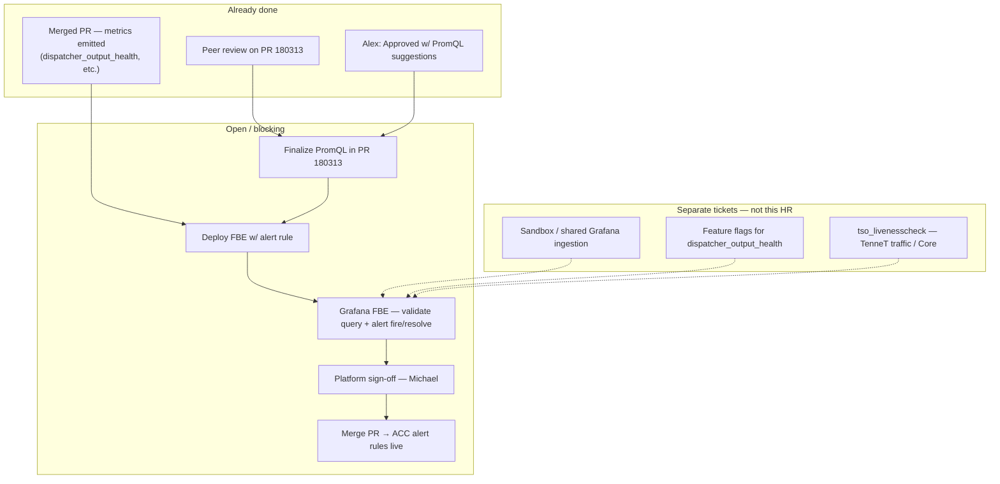

# ACC Prometheus alert rules PR — Slack intake

## Derivation header

| Field | Value |
|-------|-------|
| `template_id` | `slack-intake.template.md` |
| `template_version` | `2.0.0` |
| `template_path` | `std/skills/10_employer/eneco/eneco-oncall-intake-slack/assets/slack-intake.template.md` |
| `instance_id` | `2026_07_18_002_acc_prometheus_alert_rules_pr` |
| `filed_date` | `Unknown[blocked]` — probe Slack Lists CSV / `#myriad-platform` bot card for `Rec0B9CQF415E` |
| `picked_up_date` | `2026-07-18` |
| `produced_by` | `eneco-oncall-intake-slack` |
| `consumed_by` | `eneco-sre` — assembles `sre-intake.md` beside this file |

## Instance manifest

| Key | Value | Provenance |
|-----|-------|------------|
| `INCIDENT_TITLE` | ACC Prometheus alert rules PR (blocking) | — |
| `INSTANCE_ID` | `2026_07_18_002_acc_prometheus_alert_rules_pr` | — |
| `ORIGIN` | Slack-Lists (Platform Help Requests) + `#team-platform` thread | Known |
| `ORIGIN_URL` | https://grid-eneco.enterprise.slack.com/lists/T039G7V20/F0ACUPDV7HU?record_id=Rec0B9CQF415E | Known |
| `RECORD_ID` | `Rec0B9CQF415E` | Known |
| `LIST_ID` | `F0ACUPDV7HU` (workspace `T039G7V20`) | Known — prior intakes |
| `INTAKE_CHANNEL` | `#myriad-platform` / `C063SNM8PK5` | Known — prior harvest |
| `TRACKER_CHANNEL` | `#FC:F0ACUPDV7HU:Help requests tracker Platform` / `C0ACUPDV7HU` | Known — prior harvest |
| `DISCUSSION_THREAD` | `#team-platform` (partial harvest via user brief) — full reply count Unknown | Known — partial |
| `FILER` | Julian Bueno Castillo | Known — tracker + thread |
| `ASSIGNEE` | Michael Ströh | Known — tracker |
| `ON_CALL` / platform reviewers | Alex Torres (PR approve w/ suggestions); Roel van de Grint (FBE test workflow) | Known — thread |
| `SURFACE` (proposed) | ACC Helm alert rules + FBE Prometheus/Grafana validation path | proposed — `eneco-sre` confirms |
| `ENVIRONMENTS` | ACC (target of PR file); FBE Sandbox (preferred test bed) | Known — thread + file path |
| `ADO_ORG` / `ADO_PROJECT` | `enecomanagedcloud` / `Myriad - VPP` | Known — prior intakes |
| `ADO_REPO` (proposed) | `VPP-Configuration` | Inferred — path `Helm/activationmfrr/acc/` matches repo layout in prior tasks |
| `PR_ID` | `180313` | Known — tracker |
| `PR_URL` | https://dev.azure.com/enecomanagedcloud/Myriad%20-%20VPP/_git/VPP-Configuration/pullrequest/180313?_a=files&path=/Helm/activationmfrr/acc/values-prometheus-alert-rules.yaml | Known — user brief (repo name Inferred) |
| `CHANGED_FILE` | `Helm/activationmfrr/acc/values-prometheus-alert-rules.yaml` | Known |
| `METRIC_PRIMARY` | `dispatcher_output_health{exported_job="Activation mFRR"}` | Known — thread |
| `METRIC_SECONDARY` | `tso_livenesscheck_received_count` | Known — thread (separate Core/TenneT issue) |
| `TRACKER_STATUS` | Waiting for input | Known — user brief |
| `TRACKER_PRIORITY` | Blocking filer (`😭 This is blocking me`) | Known — tracker |

## Input

### Problem explanation

Julian opened a **Platform Help Request** for **owner-level review and test path** of **ADO PR 180313**, which adds **ACC-specific Prometheus alert rules** for the **Activation mFRR** dispatcher (`Helm/activationmfrr/acc/values-prometheus-alert-rules.yaml`). Peer review is largely done (PR marked rich in context; peers reviewed). Alex Torres **approved with suggestions** — mainly a more robust PromQL base expression using `avg_over_time` plus `absent_over_time` so missing series behave predictably. **Michael Ströh** is assignee and has been following up for those comments to be applied and the alert **validated before merge**.

The **remaining blocker** is not “no one looked at the PR” but **no confident end-to-end test yet**: Julian needs an environment where `dispatcher_output_health` is visible in Grafana/Prometheus, then must prove the alert **fires and clears** correctly. Roel documented the intended loop: deploy to an **FBE**, use **`grafana-{fbe-name}.dev.vpp.eneco.com`**, iterate PromQL, then merge so ACC picks up the rule. Julian reported difficulty because **sandbox Grafana lacked metrics at times**, and even on **dev-mc** the new metrics did not show until feature flags / traffic preconditions were satisfied — issues Roel said should be **split into separate Platform tickets**, not hold this PR review forever.

**Scope boundary (explicit):** this ticket is the **alert PR** only. A **separate, already-merged PR** introduced the underlying metrics; metric-ingestion / TenneT liveness gaps are **adjacent**, not the definition of done for this Help Request.



### Original request (verbatim harvest)

**Tracker (`Rec0B9CQF415E`) — Known from user brief:**

```text
Specific thing to review on this PR: prometheusAlertRules added in ACC.

PR URL: .../pullrequest/180313?_a=files&path=/Helm/activationmfrr/acc/values-prometheus-alert-rules.yaml

Was reviewed by their peers? Yes 🙌
Is the Pull Request rich, and with context?: ✅ Of course
The priority is: 😭 This is blocking me

Assignee: Michael Ströh
Submitted by: Julian Bueno Castillo
Status: Waiting for input
```

**`#team-platform` thread excerpts — Known from user brief (partial harvest; full thread not re-read via Slack MCP this intake):**

| Who | Verbatim / paraphrase anchored to brief |
|-----|----------------------------------------|
| Alex Torres | “Hola Julian, I left a comment. Not a blocker one, but worth to check. I’ve approved with suggestions.” To Michael: Julian needs to address the comment; important to ensure the PromQL works. |
| Julian | Proposed `baseExpr: 'avg_over_time(dispatcher_output_health{exported_job="Activation mFRR"}[2m]) or absent_over_time(dispatcher_output_health{exported_job="Activation mFRR"}[2m]) * 0'`; deploying metric to test PromQL; later: testing not started yet, will resume post-lunch / after Tiago back. |
| Michael Ströh | Follow-ups: saw Alex’s PR comment; can’t add much value; ask is to address code suggestions; nothing new pushed/changed. |
| Roel van de Grint | FBE workflow: deploy FBE with rule → each FBE has Prometheus + Grafana + Otel → `grafana-<fbe-name>.dev.vpp.eneco.com` → SSO → test PromQL → plug into Helm → auto-deploy → see alert in Prometheus. Split sandbox “no metrics” into separate Platform tickets; close this HR once alert PR reviewed and tested. |
| Stefan | Sandbox lacked metrics; dev-mc shows regular metrics but not the new ones; unaware of FF prerequisites. Two PRs: metrics merged vs alert still open — test metrics before alert to avoid false pages. |
| Hein Leslie | `dispatcher_output_health` should work if correct FFs enabled; `tso_livenesscheck_received_count` needs Core — TenneT liveness no longer hitting, unknown why. |

### Known state from evidence

| Observation | Meaning | Tag |
|-------------|---------|-----|
| PR 180313 adds ACC `prometheusAlertRules` | Production-intent alerting change for Activation mFRR in ACC | Known |
| Peers reviewed; PR context-rich | Not a greenfield design review | Known |
| Alex approved with non-blocking PromQL suggestions | Merge gated on addressing suggestions + validation, not new peer review | Known |
| Julian blocked until PromQL tested where metric exists | “Blocking” is operational readiness, not rhetorical | Known |
| Roel: validate on FBE Grafana before ACC reliance | Canonical Platform test path for this class of change | Known |
| Sandbox Grafana had no metrics (at Stefan’s attempt) | Environment issue — separate ticket per Roel | Known |
| `dispatcher_output_health` may need feature flags | Hein — config prerequisite before metric visible | Known |
| `tso_livenesscheck_received_count` / TenneT liveness | Core/domain issue — out of scope for alert-only HR | Known |

## Recurrence / related requests

**Filer:** Julian Bueno Castillo — **resolved**.

| Theme | Relation |
|-------|----------|
| Merged metrics PR (activationmfrr) | **Prerequisite done** — this HR is alert-only |
| Sandbox Grafana no metrics | **Separate Platform ticket** — Roel explicit split |
| TenneT liveness / `tso_livenesscheck_received_count` | **Core team** — Hein; not blocking alert PR sign-off if primary metric testable |

No filer-specific recurrence table beyond this thread cluster — **team-wide** observability/FBE testing pattern matches prior Platform HRs (PR review + FBE validation).

## Mandatory context

### Environmental context

| Field | Value | Tag |
|-------|-------|-----|
| Target env (PR file) | ACC — `Helm/activationmfrr/acc/values-prometheus-alert-rules.yaml` | Known |
| Preferred test env | FBE Sandbox — `grafana-{fbe}.dev.vpp.eneco.com` | Known — Roel |
| Shared observability stack (FBE) | Per-FBE Prometheus + Grafana + Otel collector | Known — Roel |
| ACC / dev-mc | Stefan tested dev-mc metrics visibility; sandbox empty at one point | Known — thread |
| Azure subscription (FBE Sandbox) | `7b1ba02e-bac6-4c45-83a0-7f0d3104922e` | Known — prior FBE intakes |
| FBE slot for Julian’s test | Unknown[blocked] — probe: ask Julian or ADO pipeline 2412 latest build |

**Repos to read** — via `eneco-context-repos`:

| Repo (git URL) | Role | Question it answers |
|----------------|------|---------------------|
| https://dev.azure.com/enecomanagedcloud/Myriad%20-%20VPP/_git/VPP-Configuration | Helm values + ACC alert rules | Final `values-prometheus-alert-rules.yaml`, PromQL, labels/severity |
| https://dev.azure.com/enecomanagedcloud/Myriad%20-%20VPP/_git/Eneco.Vpp.Core.Dispatching | Dispatching services / metrics | Where `dispatcher_output_health` is emitted; FF dependencies |

> Confirm repo names with `eneco-context-repos` before clone.

### Context to fetch — six sources

| # | Source | Skill (proven) | Why required (this issue) | Status |
|---|--------|----------------|---------------------------|--------|
| ① | Myriad Platform Slack | `eneco-context-slack` | Full `#team-platform` thread + Lists filing ts | ⬜ Unknown[blocked] — partial via user brief only |
| ② | Trade Platform team channel | `eneco-context-slack` | Alert naming / routing conventions | ⬜ Unknown[blocked] |
| ③ | ADO repos + PR 180313 | `eneco-context-repos` + `gh`/`az repos pr` | Diff, Alex’s comment, Julian’s PromQL commit state | ⬜ Unknown[blocked] |
| ④ | Obsidian work-eneco | `2ndbrain-obsidian` | Prior mFRR / Prometheus alert patterns | ⬜ Unknown[blocked] |
| ⑤ | engineering-log | filesystem `rg` | `activationmfrr`, FBE Grafana, alert precedents | ✅ partial — [`2026_05_12_fbe_jupiter_argocd_image_auth_error`](../../2026_may/2026_05_12_fbe_jupiter_argocd_image_auth_error/rca.md) mentions `activationmfrr` in FBE |
| ⑥ | Wiki / runbooks | `eneco-context-docs` | Platform alerting conventions, FBE observability | ⬜ Unknown[blocked] |

**engineering-log precedent (source ⑤):** FBE + `activationmfrr` operational history in sandbox/dev contexts; no direct precedent for PR 180313.

### Environments — connection routing

| Environment | How to connect (via the skill) | Note |
|-------------|-------------------------------|------|
| FBE Sandbox AKS + Grafana | `eneco-tools-connect-mc-environments` | Test PromQL at `grafana-{fbe}.dev.vpp.eneco.com` |
| ADO PR review | Browser / `az devops` | PR `180313` — no cluster access required for code review |

This intake **identifies** environments only — it does **not** connect or merge PRs.

### Skills to use

| Skill (proven) | Phase | Why |
|----------------|-------|-----|
| `eneco-oncall-intake-slack` | Intake | Produced this file |
| `eneco-sre` | Coordination | Platform sign-off path, tracker closure |
| `eneco-context-repos` | Prefetch | PR diff + Helm chart context |
| `eneco-context-slack` | Prefetch | Complete thread harvest |
| `eneco-fbe-troubleshoot` | Validation | FBE deploy + Grafana/Prometheus checks |
| `eneco-tools-connect-mc-environments` | Validation | FBE cluster/Grafana access |

### Tools / CLI(s)

| Tool | Version (probed 2026-07-18) or status | Fallback | Use |
|------|---------------------------------------|----------|-----|
| Browser (ADO PR) | N/A | — | Review PR 180313, comments, latest push |
| Grafana (FBE) | N/A | — | Explore → run PromQL; alert UI |
| `kubectl` | Unknown — probe at investigation | — | Confirm FBE PrometheusRule / pod metrics |
| `az devops` | Unknown — probe at investigation | ADO web UI | PR status, reviewers |

## Mechanism (cited)

**Alert semantics (Inferred — needs FBE validation):**

1. **Metric** `dispatcher_output_health` for job **`Activation mFRR`** reflects dispatcher health (merged metrics PR). *(Known — thread.)*
2. **Suggested PromQL** combines `avg_over_time(...[2m])` with `absent_over_time(...) * 0` so absent series evaluate as zero rather than breaking the rule. *(Known — Julian/Alex thread; validate in Grafana.)*
3. **ACC deployment** applies via Helm values in `activationmfrr/acc/` once PR merges and ACC GitOps/pipeline promotes. *(Inferred — standard VPP-Configuration pattern.)*
4. **False-page avoidance:** team intent is to **confirm metric presence and shape** before relying on the alert (Stefan/Roel). *(Known — thread.)*

Prometheus `absent_over_time` / composite expressions: validate against [Prometheus query documentation](https://prometheus.io/docs/prometheus/latest/querying/functions/) in FBE Grafana — not re-derived here.

## Claims to verify

| # | Claim | Tag | Falsifier / probe |
|---|-------|-----|-------------------|
| 1 | Alex’s PromQL suggestion is applied in PR 180313 latest commit | Unknown | Open PR diff / commit history on ADO |
| 2 | `dispatcher_output_health` visible in FBE Grafana with correct FFs | Unknown | FBE deploy + Hein’s FF checklist + Grafana Explore |
| 3 | Alert fires and resolves on simulated healthy/degraded window | Unknown | FBE Prometheus/Grafana alert test |
| 4 | ACC file path only affects ACC (no sandbox/prod bleed) | Inferred | Review Helm values structure + pipeline promotion |
| 5 | Sandbox “no metrics” is environmental, not this PR | Known — Roel | Separate ticket; sandbox Grafana datasource targets |
| 6 | Julian’s FBE name / build | Unknown | Ask Julian or `az pipelines runs list` for user + pipeline 2412 |

## Confidence assessment

- **Ledger:** 14 Known · 5 Inferred · 0 Assumed · 6 Unknown
- **Route-changing unknown:** Whether Julian has pushed PromQL fixes and completed **any** FBE Grafana test since thread (“haven’t started yet” / post-lunch)
- **Resolved by:** Read PR 180313 current diff + confirm Julian/Stefan FBE test outcome in Slack or ADO
- **Confidence:** **Moderate** — rich social/process context; **technical closure unverified** (PR head, PromQL run, alert fire)

## Human-decision gates

| Gate | Detail |
|------|--------|
| Assignee / owner sign-off | **Michael Ströh** (or delegate) — platform naming, severity, routing, noise expectations |
| Definition of done (Roel + brief) | PromQL finalized → tested on FBE (or working env with metric) → platform approve → **merge PR 180313** → Help Request **Completed** with comment: env used, what was tested, follow-ups ticketed |
| Explicitly out of scope for this HR | Sandbox cluster-wide ingestion; TenneT liveness / `tso_livenesscheck_received_count` root cause |
| Julian’s blocker | Cannot merge until test path succeeds — coordinate FF + FBE, not indefinite wait on unrelated ingestion |
| Prod / ACC apply | Merge to ACC values is intentional; no prod change from this file path alone |
| Out of scope (this intake) | Merging PR, posting Slack reply, fixing sandbox metrics |

## Handoff self-check (four-predicate)

| Predicate | State | Note |
|-----------|-------|------|
| P1 Identity ledger (resolved ids) | ✓ | Record, PR, file path, filer, assignee, reviewers Known |
| P2 Mechanism + authoritative citation | PARTIAL | Workflow + PromQL intent Known; **alert behaviour unvalidated** in Grafana |
| P3 Probe candidates (resolved ids) | ✓ | PR review + FBE Grafana steps; FBE name Unknown |
| P4 Human-decision gates | ✓ | DoD, scope split, Michael ownership clear |

**Verdict:** **Ready for `eneco-sre` at PARTIAL** — coordinate **Julian test on FBE** + **Michael platform sign-off**; track ingestion/TSO issues separately; close HR when PR merges.
