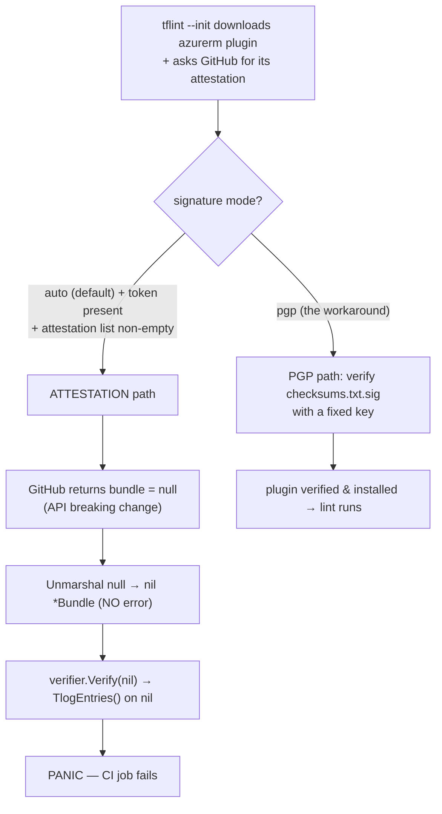
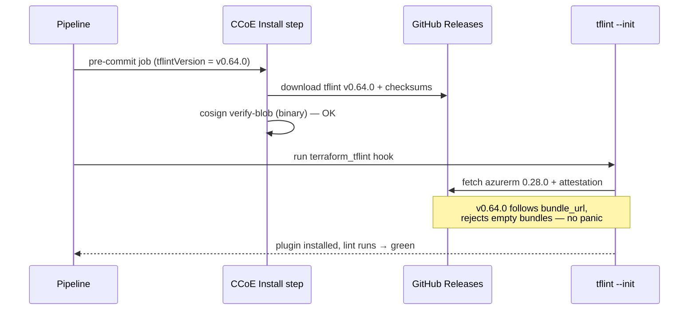

# How to fix the TFLint attestation crash — and submit the right PR

## What this is (plain language first)

Your Terraform CI started failing at `tflint --init` — the step that downloads TFLint's Azure rule plugin and checks its signature *before* any linting runs. It didn't report a lint problem; it **crashed** with a Go nil-pointer panic inside signature verification. Nothing in your Terraform is wrong. An **upstream** change to GitHub's signature (attestation) API fed TFLint a malformed response, and TFLint versions up to **v0.63.1** crashed on it instead of erroring gracefully.

There are two things to do, and this guide gives you both, verified against the exact binaries:

1. **Right now (already done in your repo):** `signature = "pgp"` in `.tflint.hcl` makes TFLint verify the plugin the classic way and skips the crashing code. Still fully secure.
2. **The PR you should submit (the durable fix):** **pin TFLint to `v0.64.0`** (the upstream release that fixes the bug) in the pipeline, and **remove the `signature = "pgp"` workaround** so you return to the modern, recommended verification. This is the change this guide walks you through and proves is safe.

"Extended further" (later, cross-team): stop the shared CCoE template from installing TFLint as `latest`, and bump the azurerm ruleset off the pre-attestation `0.28.0`.

> Full mechanism and evidence: see **[`rca.md`](./rca.md)**. This document is the repair, and it teaches enough of the mechanism that you can defend the PR in review.

## Audience & scope

For the engineer submitting the fix PR to `Eneco.Vpp.Core.Dispatching.Infrastructure`. In scope: the exact `.tflint.hcl` + pipeline changes, why each is correct, and how to prove it. Out of scope: authoring the CCoE template change (named as the extension) and a full org-wide repo inventory.

## Knowledge Contract

After reading this, you will be able to:

1. **explain** why `tflint --init` crashed, in one sentence, without hand-waving ("upstream attestation API returned a null bundle; TFLint ≤ v0.63.1 dereferenced it");
2. **draw** the two verification paths (attestation vs PGP) and point to the one that crashes;
3. **apply** the exact, minimal PR change and know which files it touches;
4. **predict** what happens in CI after the change (and why it's safe) before you push;
5. **reject** the two tempting-but-wrong "fixes" (`signature = "none"`, or "just rerun it") and say why;
6. **defend** the change under review, including "why pin, why not stay on `pgp` forever, why not `none`";
7. **verify** convergence with a command that returns exit 0 against the exact CI TFLint version.

This document does **not** make you able to author the CCoE shared-template change — that's flagged as a follow-up with the owning team.

## TL;DR — the fix in one screen

**Immediate mitigation (already committed on `main` as of 2026-07-17):**

```hcl
# .tflint.hcl — makes TFLint verify via PGP, skipping the crashing attestation code
plugin "azurerm" {
  enabled   = true
  version   = "0.28.0"
  source    = "github.com/terraform-linters/tflint-ruleset-azurerm"
  signature = "pgp"
}
```

**The PR to submit (durable fix — pin the tool, drop the workaround):**

```yaml
# .azuredevops/infra-ci.pipeline.yaml  AND  .azuredevops/azure-devops-ci-pipeline.yaml
- template: jobs/test/terraform/pre-commit.yaml@templates
  parameters:
    terraformVersion: "$(terraformVersion)"
    tflintVersion: "v0.64.0"          # <-- ADD: pin TFLint to the fixed release
```

```hcl
# .tflint.hcl — REMOVE the signature line to return to `auto` (attestation-preferred)
plugin "azurerm" {
  enabled = true
  version = "0.28.0"
  source  = "github.com/terraform-linters/tflint-ruleset-azurerm"
}
```

Both halves are verified below. If you want to be extra conservative, do them in two PRs (pin first, remove `pgp` second) — but I confirmed `v0.64.0` works in *both* modes, so a single PR is safe.

---

## First principles: what actually broke

Before the fix, understand the machinery — three primitives make the whole thing obvious.

**Primitive 1 — TFLint verifies its plugins before trusting them.** `tflint --init` downloads the `azurerm` rule plugin from GitHub Releases and checks a cryptographic signature so a tampered plugin can't run. There are two independent ways it can do that check, and that choice is the whole story.

**Primitive 2 — "Attestation" is keyless build-provenance, and it leans on a transparency log.** A GitHub **Artifact Attestation** is a signed statement that "this file was built by that workflow." It uses **Sigstore**, which signs **without a long-lived key**: at build time a short-lived certificate is issued and the signing event is recorded in a public **transparency log ("tlog")**. Because the certificate expires fast, the tlog entry is the *only* durable proof the signature was valid — so the verifier reads it eagerly. That read is the exact line that crashed: `bundle.TlogEntries()`.

**Primitive 3 — "PGP" is the classic path, and it needs none of that.** With `signature = "pgp"`, TFLint verifies a `checksums.txt` file against a detached `checksums.txt.sig` using a **fixed public key**. No short-lived cert, no transparency log, **no dependency on GitHub's attestation API**. That independence is why it dodges the bug.

Now the failure, as a mechanism (not a label): GitHub changed its attestation API so the response's `bundle` field became `null` (the data moved to a new `bundle_url`). TFLint ≤ v0.63.1, when it got a **non-empty** attestation list with a `null` bundle, unmarshalled that `null` into a **nil pointer without any error**, then handed the nil to the verifier, which dereferenced it reading the tlog entries → **panic → the whole `tflint` process died → CI red.** It only takes this path when a **token is present** (CI always has one), which is why CI failed but a casual local run might not.

### Visual 1 — the fork that decides crash vs. success

This is the one picture to keep. It shows *where* TFLint chooses a path and *which* branch died; it answers "why does one config line fix a crash?"



Reading it: the diamond is the whole incident. On the left branch, `auto` mode with a CI token walks into the attestation code, meets GitHub's `null` bundle, and dies. On the right branch, `pgp` verifies a signature file with a fixed key and never touches the attestation API. The fix — either line — moves you onto the right branch (or upgrades TFLint so the left branch handles `null` correctly). **Takeaway: the crash is confined to one branch; you win by not taking it, or by taking a version that survives it.**

Why this matters for the fix: it tells you *why* `signature = "none"` is the wrong instinct (it would also avoid the crash — by turning verification **off**, throwing away supply-chain safety) and why `pgp` is right (it avoids the crash while **keeping** verification on).

---

## The fix, step by step (verified)

### Decision ladder — which fix, when

Use this to choose; it encodes the tradeoffs so you can defend the choice.

```text
Is CI red RIGHT NOW and you must unblock a merge?
   └─ YES → add  signature = "pgp"  to .tflint.hcl   (already on main here)  → merge
   └─ NO / cleaning up → submit the DURABLE PR:
            pin  tflintVersion: "v0.64.0"  in the pipeline
            AND remove  signature = "pgp"  from .tflint.hcl   (return to auto/attestation)

Tempting but WRONG:
   ✗ signature = "none"   → avoids the crash by disabling verification (supply-chain risk)
   ✗ "just rerun it"      → works only by luck (upstream API is intermittent); not a fix
   ✗ downgrade TFLint     → you're already on 'latest'; the real cause is BEING on 'latest'
```

Reading the ladder: the top branch is the incident-time reflex — one line (`signature = "pgp"`) to unblock a merge, and it's already on `main` here. The bottom branch is the cleanup you actually submit as a PR: pin the tool so the cause can't recur, then drop the workaround. The three crossed-out rows are the traps a reviewer will test you on — each "works" superficially but either disables verification, relies on luck, or misreads the cause. Takeaway: pick the durable branch, and be ready to say why each rejected option is wrong.

### Step 1 — Pin TFLint to the fixed release (the core of the PR)

**What changes:** your CI pipeline passes an explicit `tflintVersion` to the shared CCoE job instead of letting it default to `'latest'`. **Why it's the real fix:** it guarantees the binary contains upstream fix PR #2600 (first shipped in `v0.64.0`) *and* stops your CI from silently inheriting the next upstream regression at runtime. **What it does not change:** the CCoE template itself, or other repos.

Edit **both** CI pipeline files (`.azuredevops/infra-ci.pipeline.yaml` and `.azuredevops/azure-devops-ci-pipeline.yaml`). In each, find the `pre-commit.yaml@templates` job and add one parameter:

```yaml
      - template: jobs/test/terraform/pre-commit.yaml@templates
        parameters:
          terraformVersion: "$(terraformVersion)"
          tflintVersion: "v0.64.0"
```

The CCoE install step already accepts this parameter (its default is the problematic `'latest'`), so passing the literal `tflintVersion: "v0.64.0"` is a supported, minimal change. **Use the literal, not a variable.** This repo has **two separate** variable files — `variables.yaml` (used by `infra-ci.pipeline.yaml`) and `azure-devops-variables.yaml` (used by `azure-devops-ci-pipeline.yaml`). If you promote the value to a `$(tflintVersion)` variable and add it to only *one* of them (easy — they are different files for different pipelines), the other pipeline's macro is undefined and the install step dies under `set -euo pipefail` with a cryptic `tflintVersion: command not found` — a fresh CI red that looks unrelated to versioning. The inline literal in the job call (shown above) avoids this entirely. If you *do* want a variable for one-place bumping, add it to **both** files.

Use the exact tag with the leading `v` — the release tag is `v0.64.0`; `0.64.0` (no `v`) 404s because the install step builds `releases/download/${tflintVersion}/…`.

### Step 2 — Remove the `signature = "pgp"` workaround

**What changes:** `.tflint.hcl` drops the `signature` line, returning to `auto` (attestation-preferred). **Why it's safe now:** on `v0.64.0` the attestation path handles the API correctly, and `auto` is the modern, recommended verification. **Why you want to:** on `0.28.0` the PGP path prints "The plugin was signed using a legacy PGP signing key. Please update the plugin" — a deprecation nudge you remove by returning to attestation. **What it does not change:** the ruleset version (still `0.28.0`; see the extension for bumping it).

```hcl
plugin "azurerm" {
  enabled = true
  version = "0.28.0"
  source  = "github.com/terraform-linters/tflint-ruleset-azurerm"
}
```

### Visual 2 — the fix sequence (a different angle: *order*, not *choice*)

Visual 1 showed the branch that crashes; this shows the **order of operations** the fixed pipeline runs, so you can predict the green run before you push.



Reading it: the pinned version flows into the install step, TFLint v0.64.0 is fetched and its *binary* is cosign-verified (unchanged, still works), then the `terraform_tflint` hook runs `tflint --init`, which now handles GitHub's attestation response correctly and installs the plugin. **Takeaway: with the version pinned to v0.64.0, the exact step that used to panic completes — verification stays on, the job goes green.** Different angle from Visual 1: that one was "which branch kills you"; this one is "what happens, in order, once you've fixed it."

---

## Verify it worked (convergence proof)

Do not trust exit codes of a rerun alone — prove the mechanism. These are the checks I ran; the outputs live in `../proofs/outputs/`.

**Local proof against the exact CI version (v0.63.1) that the workaround unblocks it:**

```bash
OS=$(uname -s | tr '[:upper:]' '[:lower:]')                         # derive OS + arch — do NOT hardcode
case "$(uname -m)" in x86_64|amd64) A=amd64;; arm64|aarch64) A=arm64;; esac
BIN=$(mktemp -d); curl -fsSL -o "$BIN/t.zip" \
  "https://github.com/terraform-linters/tflint/releases/download/v0.63.1/tflint_${OS}_${A}.zip"
unzip -oq "$BIN/t.zip" -d "$BIN"
D=$(mktemp -d); printf 'plugin "azurerm" {\n enabled=true\n version="0.28.0"\n source="github.com/terraform-linters/tflint-ruleset-azurerm"\n signature="pgp"\n}\n' > "$D/.tflint.hcl"
TFLINT_PLUGIN_DIR="$D/p" bash -c "cd $D && $BIN/tflint --init"; echo "exit=$?"
# Expect: Installed "azurerm" (... 0.28.0)  +  exit=0   (a legacy-PGP-key warning is normal)
# NOTE: derive the arch (uname -m). A hardcoded arm64 URL on a linux/amd64 box downloads a real but
# wrong-arch binary (HTTP 200) that fails with "Exec format error" — looks like the fix broke; it didn't.
```

**Local proof that the durable end-state (v0.64.0, no workaround) also installs cleanly:**

```bash
OS=$(uname -s | tr '[:upper:]' '[:lower:]')
case "$(uname -m)" in x86_64|amd64) A=amd64;; arm64|aarch64) A=arm64;; esac
BIN=$(mktemp -d); curl -fsSL -o "$BIN/t.zip" \
  "https://github.com/terraform-linters/tflint/releases/download/v0.64.0/tflint_${OS}_${A}.zip"
unzip -oq "$BIN/t.zip" -d "$BIN"
D=$(mktemp -d); printf 'plugin "azurerm" {\n enabled=true\n version="0.28.0"\n source="github.com/terraform-linters/tflint-ruleset-azurerm"\n}\n' > "$D/.tflint.hcl"
TFLINT_PLUGIN_DIR="$D/p" bash -c "cd $D && $BIN/tflint --init"; echo "exit=$?"
# Expect: Installed "azurerm" (... 0.28.0)  +  exit=0   (no warning; attestation path healthy)
```

**In CI:** after the PR, open the "Install TFLint" step log and confirm it prints `Downloading TFLint v0.64.0` (not `latest`→something else), and the `terraform_tflint` hook passes. **Decision rule:** version line says `v0.64.0` *and* the pre-commit step is green ⇒ converged. If the install log still shows a different version, the `tflintVersion` parameter isn't being threaded — recheck both pipeline files.

---

## Extend it further (the follow-ups, named honestly)

The PR above fixes *this* repo durably. Two systemic improvements remain, each owned elsewhere:

1. **Stop the CCoE template defaulting to `'latest'` (owner: CCoE).** `CCoE/azure-devops-templates` → `steps/test/tflint/install.yaml` defaults `tflintVersion: 'latest'`, so *every* consumer inherits upstream regressions at runtime. Ask CCoE to default to a pinned, periodically-bumped version (or a renovate-managed bump). This is the real org-wide fix — see [`sre-toil-removal-proposal.md`](./sre-toil-removal-proposal.md).
2. **Bump the azurerm ruleset off `0.28.0` (owner: VPP/Platform).** `0.28.0` predates GitHub attestations (it has none — its PGP key is the "legacy" one TFLint warns about). Moving to a current ruleset (attestation-signed, `≥ 0.29.0`) modernizes verification and removes the legacy-key warning. Do this **after** TFLint is pinned to `≥ v0.64.0`, and treat it as a normal ruleset upgrade (new rules may surface new findings).

---

## Evidence ledger

Codes live here, not in the prose above. `FACT` = reproduced this session (command/URL); `INFER` = reasoned from facts; `UNVERIFIED` = named gap.

| # | Claim | Status | How we know |
|---|---|---|---|
| F1 | `signature = "pgp"` installs azurerm 0.28.0 on the exact CI TFLint (v0.63.1), exit 0 | FACT | `../proofs/outputs/tflint-0631-matrix.out.txt` |
| F2 | v0.64.0 installs azurerm 0.28.0 in **both** `auto` (default) and `pgp`, exit 0 | FACT | v0.64.0 `tflint --init` runs, this session |
| F3 | Valid `signature` values: `auto, attestation, pgp, none` (so `none` = verification OFF) | FACT | v0.63.1 config error on `signature = "keyless"`; `tflint-0631-matrix.out.txt` |
| F4 | The fix ships first in TFLint **v0.64.0** (2026-07-17T15:37Z); no v0.63.2 exists | FACT | `api.github.com/.../tflint/releases/latest` |
| F5 | CI installs TFLint via CCoE template with `tflintVersion` defaulting to `'latest'`; this repo passes no override | FACT | CCoE `steps/test/tflint/install.yaml`; repo `.azuredevops/*.pipeline.yaml` |
| F6 | The CCoE install step accepts a `tflintVersion` parameter (so the pin is a supported change) | FACT | `jobs/test/terraform/pre-commit.yaml` + `steps/test/tflint/install.yaml` param block |
| F7 | azurerm 0.28.0 **is** attested — its `checksums.txt` digest (the digest tflint queries) returns HTTP 200, 1 attestation, signed 2025-03-21; the `pgp` path instead verifies `checksums.txt.sig` and never touches the attestation API | FACT | `../proofs/outputs/azurerm-attestation-CHECKSUMS-digest.out.txt` |
| I1 | A single PR (pin + remove `pgp`) is safe: v0.64.0 works in both modes, and the `tflintVersion` param threads through all three template hops (CI file → `pre-commit.yaml` → `install.yaml`, tag used with the leading `v`); confirm on the first CI run | INFER | from F2 + F4 + F6 (threading traced in the real CCoE template) |
| U1 | The full set of VPP repos still on `'latest'`/`auto` and thus still exposed | UNVERIFIED | resolve with an org-wide `.tflint.hcl` + pipeline grep (see rca.md L11) |

Visual coverage: decision/choice angle → Visual 1 flowchart (which branch crashes, why one line fixes it); mechanism-over-time angle → Visual 2 sequence (order of the fixed run, predict the green build); decision-ladder angle → ASCII ladder (choose the right fix, reject the wrong ones).

Angles excluded: topology/ownership map — the RCA (L2/L3) already carries the repo + two-layer topology and this doc is the repair, not the system map; failure-tree — the single linear cause chain (one API change → one nil deref) has no branching to draw; feedback-loop — the pipeline is open-loop, a red build does not change the workload.

## Go deeper (official docs)

- [TFLint plugin config & the `signature` attribute](https://github.com/terraform-linters/tflint/blob/master/docs/user-guide/plugins.md)
- The upstream bug & fix: [issue #2591](https://github.com/terraform-linters/tflint/issues/2591), [PR #2600](https://github.com/terraform-linters/tflint/pull/2600), [release v0.64.0](https://github.com/terraform-linters/tflint/releases/tag/v0.64.0)
- [GitHub Artifact Attestations](https://docs.github.com/en/actions/security-for-github-actions/using-artifact-attestations/using-artifact-attestations-to-establish-provenance-for-builds)
- [The API breaking change (`bundle` → `bundle_url`)](https://docs.github.com/en/rest/about-the-rest-api/breaking-changes)
- [Sigstore bundle & transparency log](https://docs.sigstore.dev/about/bundle)

## Defend it under review

| Challenge | Answer |
|---|---|
| "Why not just keep `signature = "pgp"` and move on?" | It works, but it forces the deprecated legacy-PGP path (0.28.0's key), and it leaves TFLint on `'latest'` — the next upstream regression still hits you. Pinning fixes the *cause*. |
| "Why not `signature = "none"`?" | `none` disables verification entirely (F3) — you'd trade a crash for a supply-chain hole. `pgp`/`auto` keep verification on. |
| "Why pin instead of trusting `latest` now that it's fixed?" | `latest` is a live subscription to upstream `main`; it *caused* this by auto-adopting a regression. Pinning makes tool upgrades a reviewed, deliberate act. |
| "How do you know v0.64.0 is the fix and it's safe here?" | Its release notes cite the fix PRs (#2593/#2600), and I ran v0.64.0 `tflint --init` against your exact plugin (0.28.0) in both modes — both exit 0 (F2, F4). |
| "What would falsify 'this is fixed'?" | A CI run whose install log shows `v0.64.0` but still panics in `VerifyAttestations`. Not observed; the code follows `bundle_url` now. |
| "Where does this fix stop?" | It fixes this repo. Other repos on `'latest'` remain exposed until the CCoE template default changes (U1 + extension). |

## Self-test (rebuild the reasoning, don't recall trivia)

1. In your own words, why did a *token being present* in CI matter for whether the crash happened? (Answer: with a token, `auto` prefers the attestation path; that's the branch that dereferenced the null bundle.)
2. Your colleague proposes `signature = "none"` to "make it go away." Give the one-sentence rejection. (Answer: it removes the crash by removing verification — a supply-chain regression, not a fix.)
3. After the PR, the CI install log shows `Downloading TFLint v0.63.1`. Is the fix live? What's wrong? (Answer: no — the `tflintVersion` parameter isn't threaded through both pipeline files; the job is still resolving `latest`.)
4. **Transfer:** a *different* tool in CI installs via `curl .../releases/latest`. Without any incident yet, what's the latent risk and the one-line hardening? (Answer: it will adopt upstream regressions at runtime; pin the version and bump deliberately.)

Success condition: you can answer all four without re-reading — then you can defend the PR.

## Durable principle (carry this to the next incident)

Strip the TFLint nouns and the rule that remains is: **a toolchain that installs `latest` at runtime is an unpinned dependency on someone else's `main` — it will hand you their regressions on their schedule.** The fast fix for a supply-chain-verification crash is a second, independent verification path (here, PGP); the durable fix is to **pin the tool and adopt upstream deliberately**. Fix the symptom with the escape hatch; fix the cause with the pin.
