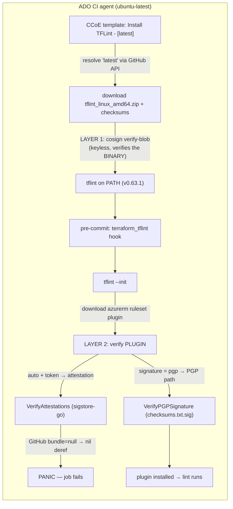
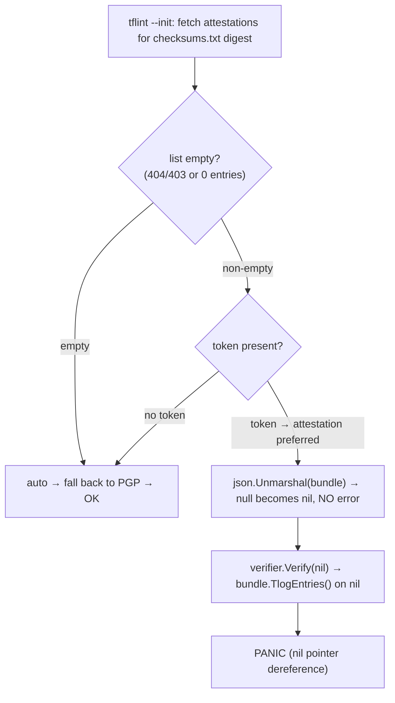
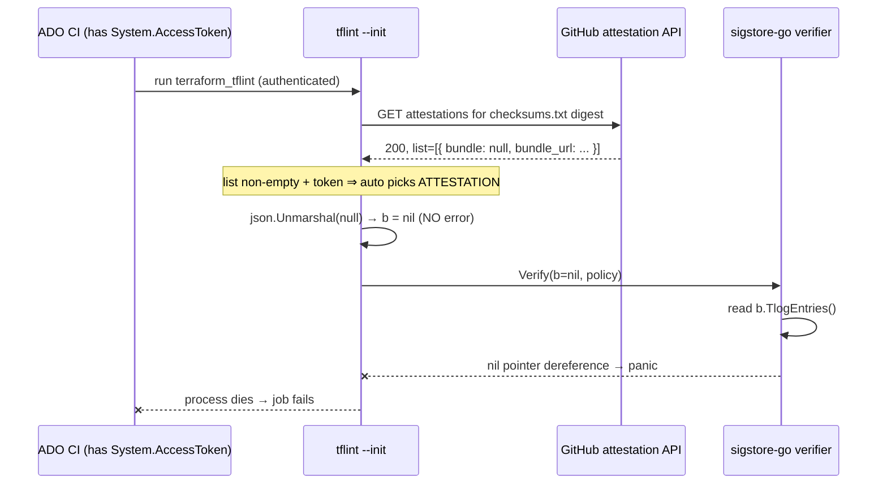

# TFLint attestation crash & the `signature = "pgp"` workaround

## Table of Contents

- [Executive summary](#executive-summary)
- [RCA Knowledge Contract](#rca-knowledge-contract) · [Backward derivation](#backward-derivation-from-the-contract)
- [Context Ledger](#context-ledger-zero-context-reader-first) · [Knowledge domain map](#knowledge-domain-map) · [Evidence Ledger](#evidence-ledger)
- L1 [Business](#l1--business--why-this-system-exists) · L2 [Repo system](#l2--repo-system) · L3 [Runtime architecture](#l3--runtime-architecture) · L4 [Application code flow](#l4--application-code-flow)
- L5 [Config contract](#l5--config--declarative-contract--the-three-truths) · L6 [Pipeline](#l6--the-pipeline-and-how-it-actually-runs) · L7 [Timeline](#l7--timeline) · L8 [Fix](#l8--fix)
- L9 [Verification](#l9--verification) · L10 [Lessons](#l10--lessons) · L11 [Command playbook](#l11--end-to-end-command-playbook) · L12 [On-call one-pager](#l12--one-page-on-call-playbook)

## How to read this RCA

Read top to bottom the first time: the Executive summary gives you the whole story in plain words; the Knowledge Contract and domain map tell you what you'll be able to do and which worlds you'll learn; the Context Ledger defines every term. The twelve levels then climb from "why this system exists" to "spot it in 5 minutes next shift". If you only need to *act*, jump to [L8 Fix](#l8--fix) and the sibling [`fix.md`](./fix.md); if you need to *reproduce*, jump to [L11](#l11--end-to-end-command-playbook). Evidence codes (A1/A2/A3) live only in the [Evidence Ledger](#evidence-ledger) — the prose states certainty in plain words.

## Executive summary

On **2026-07-17**, Terraform CI pipelines in the Myriad VPP org started failing **before any linting happened**. The failing step was `tflint --init` — the phase where TFLint downloads its Azure ruleset plugin and cryptographically verifies it. TFLint did not report a lint error; it **crashed with a Go nil-pointer panic** deep inside signature verification.

The system involved is small but has three moving parts worth naming up front. **TFLint** is a Terraform linter; it runs as a **pre-commit hook** in CI, and on start-up it fetches a ruleset plugin (`tflint-ruleset-azurerm`) from GitHub Releases. Before trusting that plugin, modern TFLint verifies it using **GitHub Artifact Attestations** — a supply-chain signature scheme built on **Sigstore**. That verification is the part that broke.

The visible symptom was a stack trace ending in `bundle.(*Bundle).TlogEntries ... nil pointer dereference`, inside `SignatureChecker.VerifyAttestations`, while "Installing azurerm plugin". The actual cause was **not** in Eneco code or in TFLint's logic proper. **GitHub shipped a breaking change to its attestation API**: the API response's `bundle` field became `null` (the real data moved to a new `bundle_url`). TFLint versions up to and including **v0.63.1** unmarshalled that `null` into a nil pointer and then dereferenced it — a crash instead of a graceful error. The upstream fix is TFLint **v0.64.0**, published the same afternoon (2026-07-17T15:37Z), which fetches the bundle from `bundle_url` and rejects empty bundles instead of crashing.

The impact was **CI availability, not production**: pull-request validation went red intermittently (the team reported it "more often than not" during the window), blocking merges. No deployed infrastructure was affected. The alert here was a **failed ADO build**, not an Azure Monitor alert.

The workaround the team applied — and the thing this RCA validates — is a one-line change to each repo's `.tflint.hcl`:

```hcl
plugin "azurerm" {
  enabled   = true
  version   = "0.28.0"
  source    = "github.com/terraform-linters/tflint-ruleset-azurerm"
  signature = "pgp"          # <-- added
}
```

`signature = "pgp"` tells TFLint to verify the plugin with the **classic PGP detached-signature** path instead of the attestation path. Because the crash lives entirely inside the attestation code, switching verification methods **side-steps the bug while keeping cryptographic verification on** (it is emphatically *not* `signature = "none"`). I confirmed this against the exact CI binary: with `signature = "pgp"`, TFLint v0.63.1 installs the plugin cleanly.

Two things make this RCA more than a copy of the intake, and a careful reader should hold both:

1. **The canonical failing build (1721100) was in the `Eneco.Infrastructure` monorepo's "Platform - RBAC" pipeline — not in `Eneco.Vpp.Core.Dispatching.Infrastructure`.** The intake conflated the *failure site* with the *repo where the fix was showcased*. Both repos pin the same ruleset version and both received the same one-line workaround; the fix is correct for both.
2. **The CI installs TFLint with `tflintVersion: 'latest'` (unpinned).** That is the deeper enabling cause: an upstream regression became "latest" and every VPP Terraform pipeline inherited it at runtime. The same mechanism is why CI **self-healed** the moment v0.64.0 became "latest" at 15:37Z that day.

What a future engineer should remember: **a green-to-red flip in `tflint --init` with a `sigstore`/`attestation` stack trace is an upstream supply-chain-tooling failure, not your Terraform.** The fast mitigation is `signature = "pgp"`; the durable fix is to **pin TFLint to a known-good version (≥ v0.64.0)** so "latest" can never inject the next upstream regression, and then to remove the workaround.

---

## RCA Knowledge Contract

After reading this package, a zero-context reader can:

1. **draw** the affected system boundaries — the two consumer repos, the shared CCoE installer, and the two independent verification layers (binary vs plugin);
2. **trace** the causal mechanism from trigger to symptom: authenticated client → attestation preferred → GitHub returns `bundle: null` → nil `*Bundle` unmarshalled without error → `verifier.Verify(nil)` → `TlogEntries` dereference → panic;
3. **reproduce** the investigation from cold using the L11 probes (identify the failing repo, read the build log, trace the version to `'latest'`, confirm the fix release, reproduce the workaround);
4. **reject** the false explanations: "our Terraform is wrong", "it's the cosign binary step", "`signature = "none"` is the fix", "just rerun it";
5. **repair or roll back** safely — apply `signature = "pgp"` to unblock, pin TFLint ≥ v0.64.0 to fix the cause, remove the workaround as the exit — each with a verification probe;
6. **decide** which toil to remove: stop the CCoE template defaulting to `'latest'`.

## Backward derivation from the contract

Each promised capability maps to the domain, primitive, visual angle, probe, and section that makes it true.

| Contract capability | Domain / primitive | Visual (angle + cognitive job) | Probe | Section |
|---|---|---|---|---|
| Draw the boundaries | Repo system + runtime topology | L3 flowchart (topology — *where* the two verification layers run) | clone repos + read pipelines | L2, L3 |
| Trace the mechanism | Application code flow + Sigstore keyless trust | L4 decision flowchart (*which* branch crashes) + L4 sequence (*when*, the temporal order) | read `install.go`/`signature.go`; read the build log | L4 |
| Reproduce from cold | Reproduction path | L11 six-part probe blocks (evidence surface) | the L11 commands | L11 |
| Reject false explanations | Evidence discrimination | Evidence Ledger (fact vs inference vs unverified) | re-run each probe | Evidence Ledger, L10 |
| Repair / roll back | Fix mechanism + exit criterion | L8 layered-fix table + decision ladder | `tflint --init` exit-0 proofs | L8, L9, `fix.md` |
| Decide the toil | SRE toil removal | `'latest'`-trap explained in L5/L6 | grep the CCoE default | L5, L6, `sre-toil-removal-proposal.md` |

Visual coverage: topology angle → L3 flowchart (where the two verification layers live); decision/choice angle → L4 flowchart (which branch crashes and why one line fixes it); mechanism-over-time angle → L4 sequence (the token→null→panic ordering); timeline angle → L7 table (onset, intermittency, self-heal); fix-sequence angle → L8 layered-fix table.

Angles excluded: state-machine/lifecycle — the tool is a one-shot `--init`, not a long-lived stateful process, so there are no modes to diagram; feedback-loop — the CI path is open-loop (a red build does not change the workload or the upstream API), so there is no loop to draw; blast-radius diagram — the blast radius is "every repo on `'latest'`", already stated in prose and needing no spatial view.

---

## Context Ledger (zero-context reader first)

Every term used below, with what it is and why it matters to this incident.

| Term | What it is | Relevance to this incident |
|---|---|---|
| **TFLint** | A linter for Terraform (`tflint`), distributed as a Go binary via GitHub Releases | The tool that crashed. CI installs it fresh each run. |
| **`tflint --init`** | The sub-command that downloads and installs the ruleset **plugins** declared in `.tflint.hcl` before linting | The exact step that panicked. It runs *before* any lint rule executes. |
| **Ruleset plugin** | A separately-distributed TFLint plugin adding provider-specific rules | `azurerm` rules ship as a plugin, not bundled. It must be downloaded + verified. |
| **`tflint-ruleset-azurerm`** | The official Azure ruleset plugin repo (`terraform-linters/tflint-ruleset-azurerm`) | Pinned at `0.28.0` in the failing configs. Its verification path is what broke. |
| **`.tflint.hcl`** | TFLint's config file; declares plugins, versions, and the `signature` mode | Where the one-line workaround lives. |
| **`signature` attribute** | `.tflint.hcl` plugin-block field controlling *how* a plugin is verified. Values: `auto` (default), `attestation`, `pgp`, `none` | The knob the workaround turns. `auto` prefers attestation when authenticated. |
| **PGP signature verification** | Classic path: verify `checksums.txt` against a detached `checksums.txt.sig` using a fixed long-lived public key | The workaround's path. No dependency on GitHub's attestation API. |
| **GitHub Artifact Attestation** | A supply-chain record proving *where and how* an artifact was built (build provenance), delivered as a Sigstore bundle | The default (broken) verification path. |
| **Sigstore** | Keyless code-signing ecosystem (Fulcio + Rekor + bundles) | The library and data format TFLint uses for attestation verification. |
| **Fulcio** | Sigstore's CA that issues short-lived signing certificates bound to a workflow identity (OIDC) | Part of *why* the transparency log matters (see L4). |
| **Rekor / transparency log ("tlog")** | An append-only public log recording signing events | `bundle.TlogEntries` — the exact nil dereference — reads these entries. |
| **Sigstore bundle** | The self-contained blob holding the cert, signature, and tlog entries needed to verify | When GitHub returned `bundle: null`, TFLint held a nil bundle and crashed reading its tlog entries. |
| **`bundle_url`** | New field GitHub added; the bundle must now be fetched from this URL instead of being inline | The root of the breaking change; the fix (#2600) follows this URL. |
| **cosign** | Sigstore's CLI for signing/verifying blobs | Used by the CCoE template to verify the **TFLint binary** (a *different* verification layer from the plugin one; see L3). |
| **pre-commit** | A hook framework; runs `terraform_fmt`, `terraform_tflint`, etc. | The `terraform_tflint` hook is what invokes `tflint --init`. |
| **`terraform_tflint` hook** | The `antonbabenko/pre-commit-terraform` hook that runs TFLint | It shells out to whatever `tflint` is on `PATH`. |
| **ADO** | Azure DevOps — the CI/CD platform | Where the pipelines run and where build 1721100 lives. |
| **CCoE** | Eneco's Cloud Center of Excellence | Owns the shared `azure-devops-templates` repo that installs TFLint. |
| **`azure-devops-templates`** | Shared ADO YAML templates repo (`CCoE/azure-devops-templates`), consumed at tag `2.6.9` | Contains the `Install TFLint` step that resolves `latest`. The systemic lever. |
| **`tflintVersion: 'latest'`** | The default parameter of the CCoE install step | The unpinned setting that let an upstream regression enter CI. |
| **`Eneco.Infrastructure`** | The Platform monorepo (AAD/RBAC, Grafana, shared modules) | The repo whose "Platform - RBAC" pipeline produced the canonical failing build 1721100. |
| **`Eneco.Vpp.Core.Dispatching.Infrastructure`** | The VPP Core Dispatching infra repo | The repo the user is fixing / submitting a PR against; got the same workaround. |
| **`GITHUB_TOKEN` / `System.AccessToken`** | An auth token present in CI | Its presence makes TFLint *prefer* attestation verification — the trigger condition. |
| **Myriad / VPP** | Eneco's Virtual Power Plant platform (Trade Platform domain) | The business system whose Terraform CI was blocked. |

---

## Knowledge domain map

The worlds this RCA installs, and the reader capability each supports.

| Domain | Level | Capability it gives the reader |
|---|---|---|
| Business / functional role | L1 | Explain who is blocked when VPP Terraform CI goes red. |
| Repo / artifact system | L2 | Name the three repos (two consumers + one shared template) that own the outcome. |
| Runtime architecture | L3 | Draw the two independent verification layers (binary vs plugin) and where each runs. |
| Application / code flow | L4 | Trace token → attestation-preferred → null bundle → nil deref → panic. |
| Declarative config (IaC-adjacent) | L5 | Read the `.tflint.hcl` + CCoE template contract and see the `latest` trap. |
| Delivery pipeline | L6 | Explain how `latest` turns an upstream release into a CI outcome at runtime. |
| Timeline / latency | L7 | Use the 2026-07-16/17 window to explain onset, intermittency, and self-heal. |
| Fix mechanism | L8 | Connect `signature = "pgp"` and the version pin to the exact violated invariant. |
| Verification / falsifiers | L9 | Re-run the probes that prove the fix and prove the panic is transient. |
| Reproduction | L11 | Recreate the entire investigation from cold. |
| On-call recognition | L12 | Spot this class in 5 minutes next time. |

---

## Evidence Ledger

This is where the audit codes live. The narrative above and below states status in plain words; every load-bearing claim traces to a row here. `A1` = independently reproducible (command/URL/log). `A2` = inference from A1s. `A3` = could not verify / not recoverable.

| # | Claim | Label | Evidence (probe / source) |
|---|---|---|---|
| E1 | Build 1721100 is in `Eneco.Infrastructure`, pipeline "Platform - RBAC", on `refs/pull/188066/merge`, result **failed**, finished 2026-07-17T10:41:44Z | A1 | `az pipelines build show --id 1721100 --org …/enecomanagedcloud --project "Myriad - VPP"` |
| E2 | The failure is `tflint --init` panicking in `VerifyAttestations`; the installed TFLint was **v0.63.1** ("Downloading TFLint v0.63.1"); plugin being installed was **azurerm** | A1 | Build 1721100 "Run pre-commit" log (logId 60/63) via `az devops invoke --area build --resource logs`; saved to `proofs/outputs/build-1721100-precommit-log.txt` |
| E3 | tflint queries attestations by the **`checksums.txt` content digest**, not the plugin zip. azurerm **0.28.0's `checksums.txt` digest** (`b48c684c…`) returns **HTTP 200 with 1 attestation**, signed **2025-03-21** (its own release day — original, not backfilled: `bundle_url` path `/2025/03/21/…`, tlog `integratedTime` = 2025-03-21T15:02:22Z). **So azurerm 0.28.0 *is* attested.** | A1 | `curl …/releases/download/v0.28.0/checksums.txt` → `shasum -a 256` → `GET /attestations/sha256:<that digest>`; `proofs/outputs/azurerm-attestation-CHECKSUMS-digest.out.txt` |
| E3-note | An earlier probe hashed the **zip** (`efb96365…`) and got 404, which briefly (and wrongly) read as "0.28.0 has no attestations." tflint's `fetchArtifactAttestations` hashes the `checksums.txt` bytes (`install.go` `hash.Write(artifact)` where `artifact` = checksums.txt), so the zip 404 is the wrong digest. | A1 | `install.go` v0.63.1 (raw); superseded proof `proofs/outputs/azurerm-attestation-presence.out.txt` (zip digest — kept as the corrected-mistake record) |
| E4 | Valid `signature` values are exactly `auto, attestation, pgp, none` | A1 | `signature = "keyless"` → TFLint v0.63.1 config error listing allowed values; `proofs/outputs/tflint-0631-matrix.out.txt` |
| E5 | `signature = "pgp"` installs azurerm 0.28.0 cleanly on v0.63.1 (with a "legacy PGP signing key" deprecation warning) | A1 | `tflint --init` with the exact CI binary; `proofs/outputs/tflint-0631-matrix.out.txt` |
| E6 | The attestation path installs cleanly **today** on v0.61.0/v0.63.1/v0.64.0 — because GitHub's attestation response now carries a **non-null `bundle`** again for 0.28.0's checksums digest, so the null-deref condition is simply absent now (not because 0.28.0 lacks attestations) | A1 | `proofs/outputs/tflint-init-repro.out.txt`, `tflint-0631-attestation.out.txt`, the v0.64.0 run, + E3 (bundle non-null today) |
| E7 | The fix first ships in TFLint **v0.64.0**, published 2026-07-17T15:37:19Z; release notes cite #2593 & #2600; **no v0.63.2 exists**; v0.64.0 is `latest` | A1 | `curl api.github.com/repos/terraform-linters/tflint/releases[/latest]` |
| E8 | TFLint's `auto` mode verifies attestations **iff the fetched list is non-empty** (`shouldVerifyAttestations` returns `len(attestations) > 0`); a 404/403 is ignorable; a non-empty list with a `null` bundle unmarshals to a nil `*Bundle` (no error) and `verifier.Verify(nil,…)` derefs it | A1 | `install.go` L221-259 + `signature.go` L69-136 at tag v0.63.1 (raw.githubusercontent.com) |
| E9 | `Dispatching.Infrastructure` `.tflint.hcl` has pinned azurerm **0.28.0 since 2026-04-24**; `signature = "pgp"` was added **2026-07-17** (commit `78d56f2`, PR 188112); the version never changed | A1 | `git log --follow -p -- .tflint.hcl` on the fresh clone |
| E10 | `Eneco.Infrastructure` root `.tflint.hcl` is azurerm 0.28.0 + `signature = "pgp"`; the `pgp` line was added in **PR 188066** (HEAD `0945808`, 2026-07-17 10:58) — the same PR whose merge-preview build (1721100) failed | A1 | Sparse clone + `git log -- .tflint.hcl` |
| E11 | CI installs TFLint via `CCoE/azure-devops-templates@2.6.9` `steps/test/tflint/install.yaml`, whose `tflintVersion` defaults to `'latest'`; the Dispatching CI calls the job **without** passing `tflintVersion` | A1 | Cloned templates repo + `.azuredevops/*.pipeline.yaml`; grep shows no `tflintVersion` passed |
| E12 | Upstream: issue #2591 (repro on `tflint-ruleset-aws 0.48.0`), PR #2593 **closed unmerged**, PR #2600 **merged** (`9b811b1`, 2026-07-17T15:14:36Z, "Fixes #2591"); GitHub breaking change "Version 2026-03-10" removed `bundle` from attestation list responses | A1 | Live `gh`/WebFetch of the issue/PRs/release notes/GitHub REST breaking-changes doc; recorded in `.ai/tasks/2026-07-19-001…/context/upstream-tflint-facts.md` |
| E13 | The panic requires a token: TFLint prefers attestation only for an **authenticated** client; without a token (or with `pgp`) install succeeds | A1 | Issue #2591 body ("only happens when `GITHUB_TOKEN` is set"), corroborated by `install.go` client construction |
| M1 | The full mechanism for azurerm 0.28.0: its `checksums.txt` digest has returned a non-empty attestation since release day; during the 2026-07-16/17 window GitHub's breaking change made that entry's `bundle` **null**; with a CI token, `auto` chose the attestation path; tflint ≤0.63.1 unmarshalled `null`→nil (no error) and dereferenced it. Today `bundle` is repopulated, so it verifies cleanly | A1 + A2 | E2 (0.28.0 panicked), E3 (0.28.0 attested, bundle non-null now), E8 (non-empty + null ⇒ panic), E12 (PR #2593 captured the `bundle: null` response) |

**Confidence:** the mechanism, the fix release, the workaround behavior, the config semantics, and the two-repo disambiguation are all directly reproducible — **including** why azurerm 0.28.0 crashed, which is now a fully verified chain rather than a gap. An earlier draft of this RCA invented a "transient, unrecoverable" explanation because it had probed the wrong digest (the zip, which 404s) instead of the `checksums.txt` digest that tflint actually queries (which is attested); an adversarial review caught the contradiction — the build log said 0.28.0 crashed, the wrong-digest probe said 0.28.0 had no attestations — and re-probing the correct digest resolved it. No unresolved assumption sits on the root cause or the fix path. The only genuinely open item is the org-wide inventory of other repos still on `'latest'` (see L11).

---

## L1 — Business — Why this system exists

**Anchor question: who is blocked when `tflint --init` crashes?**

Myriad VPP is Eneco's Virtual Power Plant platform. Its infrastructure is managed as Terraform, and every change flows through pull requests whose CI runs static checks — formatting, and **TFLint** linting — before a plan/apply is even attempted. TFLint catches Azure-specific mistakes (deprecated arguments, naming, unpinned modules) early, so bad IaC never reaches a plan.

When `tflint --init` crashes, the **entire validation stage fails before a single rule runs**. The concrete business effect: platform and VPP engineers cannot merge Terraform PRs. In the failing build (1721100), the blocked change was an AAD/RBAC update ("Add sg-vpp-apollo-developers group to Grafana Production App registration") — a routine access change stuck behind a linter that couldn't start. No production system was down; the cost was **developer throughput and merge latency**, multiplied across every VPP Terraform repo that runs this hook.

**Mental model to keep:** this is a *CI-availability* incident. The failing signal is a red build gate, and the "user" harmed is the engineer waiting to merge — not an end customer.

---

## L2 — Repo system

**Anchor question: which code/config components can change the outcome?**

Three repositories matter, and separating them is the single most important correction to the original intake.

| Repo | Role | Key artifact | Incident relevance |
|---|---|---|---|
| [`Eneco.Infrastructure`](https://dev.azure.com/enecomanagedcloud/Myriad%20-%20VPP/_git/Eneco.Infrastructure) | Platform monorepo (AAD/RBAC, Grafana, shared modules) | root `.tflint.hcl` (azurerm 0.28.0) | **The actual failure site.** Build 1721100 ("Platform - RBAC") ran here and panicked. |
| [`Eneco.Vpp.Core.Dispatching.Infrastructure`](https://dev.azure.com/enecomanagedcloud/Myriad%20-%20VPP/_git/Eneco.Vpp.Core.Dispatching.Infrastructure) | VPP Core Dispatching infra | `.tflint.hcl`, `.pre-commit-config.yaml`, `.azuredevops/*.pipeline.yaml` | **The repo being fixed / PR'd.** Same ruleset pin, same workaround. |
| [`CCoE/azure-devops-templates`](https://dev.azure.com/enecomanagedcloud/CCoE/_git/azure-devops-templates) @ `2.6.9` | Shared ADO YAML templates | `steps/test/tflint/install.yaml`, `jobs/test/terraform/pre-commit.yaml` | **The systemic lever.** Installs TFLint as `latest`; a fix here fixes all consumers. |

The two "consumer" repos are near-identical from TFLint's point of view: each pins `tflint-ruleset-azurerm 0.28.0`, each runs the `terraform_tflint` pre-commit hook, and each delegates TFLint *installation* to the shared CCoE template. The failure was not repo-specific logic — it was the shared tooling path they all share.

The reason the intake read as "azurerm 0.28.0 in Dispatching.Infrastructure panicked" is that the handover mixed the build ID from `Eneco.Infrastructure` with the `.tflint.hcl` link from `Dispatching.Infrastructure`. The build metadata (below, L7) settles it: build 1721100's repository is `Eneco.Infrastructure`.

**Mental model to keep:** two consumer repos wear the same tooling; one shared CCoE template supplies it. When "all our Terraform CI broke at once," look at the *shared* installer, not each repo.

---

## L3 — Runtime architecture

**Anchor question: what actually runs in CI, and where are the verification points?**

There are **two independent supply-chain verification layers** in this pipeline, and conflating them is the classic trap. The diagram shows both; the prose after it reads the failure path.



What you are looking at: a single CI job with **two** places that check a cryptographic signature. **Layer 1** is the CCoE template using **cosign** to verify the TFLint *binary* it just downloaded (keyless/sigstore, but of the tool itself). Layer 1 **succeeded** in build 1721100 — the binary was fine. **Layer 2** is TFLint verifying the *plugin* it downloads during `tflint --init`. Layer 2 is where the crash happened. The two layers use similar cryptography (both Sigstore-family) but are completely separate code, run by different programs (`cosign` vs `tflint`), on different artifacts (the tflint binary vs the azurerm plugin). The workaround only touches **Layer 2** (the plugin path), by choosing the PGP branch instead of the attestation branch.

If Layer 2's attestation branch behaved differently — for example, if TFLint had gotten an empty attestation list instead of a null-bundle one — it would have fallen back to PGP and never crashed. The crash is specifically a *non-empty-but-malformed* response colliding with code that assumed the bundle was always present.

**Mental model to keep:** "sigstore/attestation" appears twice in this pipeline. The one that broke is TFLint verifying its **plugin**, not cosign verifying the **binary**. Don't chase the cosign step.

---

## L4 — Application code flow

**Anchor question: what does the failing code actually do, line by line?**

This is the first-principles core, and it is worth slowing down because the mechanism is elegant and transferable.

**First, what an attestation *is* (so the crash makes sense).** A GitHub Artifact Attestation is a signed statement of **build provenance** — proof that "this exact file was produced by that exact GitHub Actions workflow." It is delivered as a **Sigstore bundle**. Because Sigstore signing is **keyless**, there is no long-lived key to trust; instead, at build time Fulcio issues a **short-lived certificate** bound to the workflow's OIDC identity, and the signing event is written to the **Rekor transparency log**. Since the certificate expires quickly, the *only* durable proof that the signature was made while the certificate was valid is a **transparency-log entry with a signed timestamp**. That is why a verifier reaches for the tlog entries eagerly — they are load-bearing for keyless trust. The exact accessor is `bundle.TlogEntries()`.

**Now the code path** (TFLint v0.63.1, from `plugin/install.go` and `plugin/signature.go`):

1. `tflint --init` downloads the plugin's `checksums.txt` and asks GitHub for **attestations of that checksum's digest** (`fetchArtifactAttestations`).
2. If that request returns 403/404, TFLint treats it as *ignorable* — no attestations — and, under the default `auto` mode, **falls back to PGP**. No crash.
3. But `auto` chooses the attestation path whenever the fetched list is **non-empty** (`shouldVerifyAttestations` returns `len(attestations) > 0`) **and** the client is **authenticated** (a token makes attestation "preferred").
4. In the attestation path, TFLint loops the list and runs `json.Unmarshal(attestation.Bundle, &b)` where `b` is a `*bundle.Bundle`. **Here is the trap:** JSON `null` unmarshals into a pointer as `nil` *without returning an error*. So the guard on line 132 passes cleanly with `b == nil`.
5. It then calls `verifier.Verify(b, policy)` with `b == nil`. Inside sigstore-go, verification reads `b.TlogEntries()` → **nil pointer dereference → SIGSEGV → the whole `tflint` process dies.**

The diagram makes the fork explicit:



Reading the fork: the process only crashes when **all three** conditions hold — a **non-empty** attestation list, a **null** bundle inside it, and an **authenticated** client. CI satisfies the token condition automatically (`System.AccessToken`). GitHub's breaking change supplied the null bundle. And the list had to come back non-empty. The three conditions together are why it was intermittent, why it hit CI (tokened) but not a casual local run (tokenless), and why `signature = "pgp"` — which never enters this branch — is a reliable escape.

The flowchart above showed *which* branch kills you; the next diagram is a different angle — *when*, the order of calls that produces the crash — so you can see why the token is load-bearing and where the null enters.



Reading the sequence: time flows downward. The token on the very first call is what makes GitHub's response *preferred* over PGP; the malformed `200` (a non-empty list carrying a `null` bundle) is what turns "prefer attestation" into a crash; and the fatal step is the unmarshal that produces a nil pointer *without* an error, so nothing stops the verifier from dereferencing it. **Takeaway: the crash is a three-actor collision in time — an authenticated request, a malformed-but-successful response, and a nil-tolerant unmarshal — and removing any one of them (drop the token, fix the API, or pin the fixed TFLint) prevents it.** This connects back to the fork: the fork named the branch, the sequence shows the exact call that dies on it.

**The GitHub change itself:** in the "Version 2026-03-10" REST breaking change, GitHub **removed the `bundle` field from attestation list responses** and told clients to fetch it from a new `bundle_url`. The regression that hit VPP was this change unexpectedly reaching the *default* API version around 2026-07-16. The upstream fix (PR #2600, in v0.64.0) does exactly what the API now demands: **follow `bundle_url`, download the bundle, and reject empty bundles instead of dereferencing them.**

**Mental model to keep:** `json.Unmarshal("null", &ptr)` sets the pointer to `nil` and returns **no error** — a nil-check on the *error* does not protect you from a nil *value*. A verifier that assumes "no error means I have an object" is one API change away from a crash. That pattern transfers to any Go code that unmarshals optional/pointer fields from an external API.

---

## L5 — Config / declarative contract — the three truths

**Anchor question: what do the configs say should happen, and where is the trap?**

There is no Azure IaC state at fault here; the "declarative contract" that matters is the **TFLint + pipeline configuration**. Three files define the runtime behavior.

**Truth 1 — the plugin contract (`.tflint.hcl`, identical shape in both consumer repos):**

```hcl
plugin "azurerm" {
  enabled   = true
  version   = "0.28.0"
  source    = "github.com/terraform-linters/tflint-ruleset-azurerm"
  signature = "pgp"     # added 2026-07-17; version 0.28.0 unchanged since 2026-04-24
}
```

**Truth 2 — the hook contract (`.pre-commit-config.yaml`):** the `terraform_tflint` hook comes from `antonbabenko/pre-commit-terraform@v1.98.0`. Crucially, this hook **does not install or pin TFLint** — it runs whatever `tflint` is on `PATH`. So the TFLint *version* is decided elsewhere.

**Truth 3 — the installer contract (CCoE template, consumed at `@2.6.9`):** the pipeline calls `jobs/test/terraform/pre-commit.yaml@templates`, which calls `steps/test/tflint/install.yaml`. That step's parameter is:

```yaml
parameters:
  - name: tflintVersion
    type: string
    default: 'latest'      # <-- the trap
```

and the consumer pipelines call it **without** passing `tflintVersion`:

```yaml
- template: jobs/test/terraform/pre-commit.yaml@templates
  parameters:
    terraformVersion: "$(terraformVersion)"   # note: no tflintVersion
```

So the three truths compose to: *"install whatever TFLint is newest on GitHub right now, then verify the azurerm plugin with whatever method `auto` picks."* On 2026-07-17 morning, "newest" was the affected v0.63.1, and `auto` picked attestation because a token was present.

**Mental model to keep:** the version that runs your linter is not in your repo — it is a `'latest'` default three templates away. `'latest'` is a contract that says "inherit every upstream change, including regressions, at runtime."

---

## L6 — The pipeline and how it actually runs

**Anchor question: how does an upstream release become a CI outcome?**

The install step resolves `latest` at **runtime**, on every build:

```bash
# steps/test/tflint/install.yaml (abridged)
LATEST_VERSION_URI="https://api.github.com/repos/terraform-linters/tflint/releases/latest"
TFLINT_VERSION=$(curl -s "$LATEST_VERSION_URI" | grep tag_name | cut -d '"' -f 4)
# download tflint_linux_amd64.zip + checksums.txt + .pem + .keyless.sig
cosign verify-blob ... checksums.txt      # Layer 1: verify the binary
sha256sum -c checksums.txt                 # integrity
sudo mv tflint /usr/local/bin/             # install on PATH
```

This is the amplifier. Because the version is resolved live against `releases/latest`:

- **Before ~15:37Z on 2026-07-17**, `latest` = v0.63.1 (affected) → builds in the GitHub-API window panicked.
- **After 15:37Z**, `latest` = v0.64.0 (fixed) → builds installed the fixed binary and passed, **with no repo change at all**.

So the pipeline both **imported** the regression and **auto-healed** from it, purely through `latest`. The `signature = "pgp"` commits were the team taking control of their own recovery inside the window, rather than waiting on GitHub's release + CDN propagation.

**Mental model to keep:** an unpinned toolchain makes your CI a live subscriber to an upstream project's `main`. You inherit their good releases and their regressions on their schedule, not yours.

---

## L7 — Timeline

**Anchor question: what happened, when — and what does the timing prove?**

| Time (UTC) | Event | What it proves |
|---|---|---|
| 2026-03-10 | GitHub documents the attestation-API breaking change (`bundle` → `bundle_url`) for newer API versions | The change was pre-announced but for opt-in versions. |
| ~2026-07-16 | The change begins hitting the **default** API version; issue #2591 filed (repro on `tflint-ruleset-aws 0.48.0`) | Onset of the window; the trigger is server-side, not a client upgrade. |
| 2026-07-17 **10:40:53Z** | Build 1721100 starts (`Eneco.Infrastructure`, "Platform - RBAC", PR 188066 merge) | The canonical failing run. |
| 2026-07-17 **10:41:00Z** | Install step logs "Downloading TFLint **v0.63.1**" (`latest` at that moment) | Confirms the affected version was installed via `latest`. |
| 2026-07-17 **10:41:39Z** | `terraform_tflint` fails: "Installing azurerm plugin… Panic … TlogEntries … nil pointer" | The panic, in the plugin attestation path. |
| 2026-07-17 **10:41:44Z** | Build 1721100 finishes: **failed** | ~51s from start to failure — it dies at init, before linting. |
| 2026-07-17 **10:58:14Z** | PR 188066 merges into `Eneco.Infrastructure` **with `signature = "pgp"` added** | The workaround that unblocked the RBAC change. |
| 2026-07-17 **15:14:36Z** | Upstream PR #2600 merges ("Fixes #2591") | The real fix lands in `master`. |
| 2026-07-17 **15:37:19Z** | TFLint **v0.64.0** published — becomes `latest` | From here, unpinned CI installs the fixed binary automatically. |
| 2026-07-17 (later) | `Dispatching.Infrastructure` commits the same workaround (commit `78d56f2`, PR 188112) | The showcased repo the user is fixing. |
| 2026-07-19 | Re-probes: azurerm 0.28.0's **checksums.txt** digest → HTTP 200 with a **non-null** bundle again; default `tflint --init` succeeds on v0.61.0/0.63.1/0.64.0 | The window is closed (bundle repopulated); the panic is not reproducible now. |

One inference worth making explicit: build 1721100 ran on the pre-merge commit of PR 188066, and that PR is where `signature = "pgp"` was added. The panic frame itself proves the workaround was *not yet* applied on the failing commit — the stack terminates in `VerifyAttestations`, which the PGP path never enters, so `auto` (attestation) mode was necessarily active. The team then added `pgp` to the same PR to turn the build green before merging.

The timeline is evidence, not the spine: it proves the failure was bounded to a server-side window, that `latest` both caused and cured it, and that the workaround was a deliberate in-window recovery.

**Mental model to keep:** a failure that starts and stops without any deploy on your side is a signature of an **upstream/server-side** cause. Timestamp the onset against upstream events, not your own commits.

---

## L8 — Fix

**Anchor question: what changes, what doesn't, and why?**

There are three layers of fix, in increasing durability. The reader should understand all three; the PR the user is submitting is layers 1 (+ ideally 2).

**Layer 1 — Immediate mitigation (per repo, already applied): `signature = "pgp"`.**
- *What changes:* TFLint verifies the azurerm plugin via the PGP detached-signature path (`checksums.txt.sig` against the ruleset's signing key) instead of attestations.
- *Why it closes the failure:* the crash lives entirely in `VerifyAttestations`; the PGP branch never enters that code. Verification stays **on** — this is not `none`.
- *What it does NOT change:* the TFLint version (still `latest`), and it emits a "legacy PGP signing key — please update the plugin" warning because 0.28.0's PGP key is deprecated. It is a mitigation, not the end state.
- *Proof it works:* re-running `tflint --init` with the exact CI binary (v0.63.1) installs the plugin cleanly (see L9).

**Layer 2 — Durable fix (per repo, VPP-owned): pin TFLint to ≥ v0.64.0.**
- *What changes:* the consumer pipeline passes an explicit `tflintVersion` to the CCoE job, e.g. `tflintVersion: "v0.64.0"`, instead of inheriting `'latest'`.
- *Why it is the real fix:* it removes the `'latest'` roulette *and* guarantees the binary contains the #2600 fix, so the attestation path works correctly again.
- *What it does NOT change:* the CCoE template itself (that is Layer 3); other repos still on `'latest'`.
- *Exit criterion for Layer 1:* once TFLint ≥ v0.64.0 is guaranteed, **remove `signature = "pgp"`** to return to `auto` (attestation-preferred), which is the modern, recommended verification and avoids the legacy-PGP-key deprecation.

**Layer 3 — Systemic fix (CCoE-owned): stop defaulting to `'latest'`.**
- *What changes:* the shared `steps/test/tflint/install.yaml` default moves from `'latest'` to a pinned, periodically-bumped version (or the org adopts a renovate-style controlled bump).
- *Why it matters:* it protects **every** consumer from the next upstream regression, not just VPP. This is the toil-removal recommendation (see `sre-toil-removal-proposal.md`).
- *What it does NOT change:* individual `.tflint.hcl` files.

**What this fix set does NOT cover (named residuals):** other Myriad VPP Terraform repos still pinned to `'latest'` and still on `auto` remain exposed to the *next* upstream tooling regression until Layer 3 lands; a full org-wide `.tflint.hcl` / pipeline inventory is out of scope for this RCA (resolving probe named in L11).

---

## L9 — Verification

**Anchor question: how do we know the fix works and the panic is upstream/transient?**

Every claim below was re-run in this session against real TFLint binaries; outputs are in `proofs/outputs/`.

| Question | Probe | Observed result | Verdict |
|---|---|---|---|
| Does `signature = "pgp"` fix init on the CI version? | `tflint --init` with v0.63.1, azurerm 0.28.0, `signature = "pgp"` | "Installed azurerm 0.28.0" (exit 0), with legacy-key warning | Workaround works |
| Is `signature` a real knob and what are its values? | `signature = "keyless"` on v0.63.1 | Config error: *allowed values are auto, attestation, pgp, none* | Semantics confirmed |
| Is the panic still reproducible? | `tflint --init` default + forced `attestation` on v0.61.0/v0.63.1 | Installs cleanly (exit 0) — no panic | Panic is transient/server-side |
| Does the fixed version work in both modes? | `tflint --init` with **v0.64.0**, default and `pgp` | Both install cleanly (exit 0) | Durable end-state confirmed |
| Does azurerm 0.28.0 have an attestation? | `curl` its **`checksums.txt`** → `shasum -a 256` → `GET /attestations/sha256:<that digest>` | **HTTP 200, 1 attestation**, signed 2025-03-21 (hashing the *zip* gives 404 — the wrong digest) | 0.28.0 **is** attested |
| What is the fix release? | `curl api.github.com/…/releases/latest` | `v0.64.0`, 2026-07-17T15:37Z, notes cite #2593/#2600 | Exit criterion = ≥ v0.64.0 |

A subtle point worth getting exactly right, because it is where an earlier draft of this RCA went wrong: TFLint asks GitHub for the attestation of the **`checksums.txt` content digest**, not the plugin zip. Hashing the *zip* returns 404, which naively reads as "0.28.0 has no attestations" — and that false reading forced an invented "transient anomaly." Hashing the digest TFLint actually queries returns a real attestation (HTTP 200, signed on 0.28.0's own release day). So the crash needs no anomaly: during the July window GitHub returned that attestation with a `null` bundle (the documented breaking change), which is exactly the nil-deref condition; today the bundle is repopulated, so it verifies cleanly. The lesson — hash the artifact the verifier actually hashes — is captured in L10.

---

## L10 — Lessons

**Anchor question: what durable knowledge does this incident produce?**

1. **`tflint --init` crashing with a `sigstore`/`attestation`/`TlogEntries` stack trace is an upstream supply-chain-tooling failure, not your Terraform.** Recognize it by the panic (not a lint error) and the `plugin.VerifyAttestations` frame. *Transfer:* any `--init`/plugin-fetch step that verifies signatures can fail this way; check the tool's issue tracker before touching your code.
2. **`'latest'` in a toolchain installer is a standing subscription to upstream regressions.** *Transfer:* audit CI for `latest`/`main`/unpinned tool installs; pin and bump deliberately.
3. **In Go, `json.Unmarshal("null", &ptr)` yields a nil pointer with no error.** A nil-error check is not a nil-value check. *Transfer:* when consuming optional/pointer fields from any evolving external API, guard the *value*, not just the error.
4. **Verification-method diversity is a resilience feature.** Because TFLint supports both attestation and PGP, a one-line `signature = "pgp"` bought an immediate, still-secure escape hatch. *Transfer:* prefer tools that offer a second, independent verification path.
5. **Read the build's *repository*, not the handover's prose.** The intake said "Dispatching.Infrastructure"; the failing build was `Eneco.Infrastructure`. One `az pipelines build show` corrected a load-bearing attribution. *Transfer:* confirm the failing artifact's identity from the build metadata before writing the story.
6. **Hash the artifact the verifier actually hashes.** An earlier draft of this RCA probed the plugin *zip* digest, got a 404, and nearly concluded "0.28.0 has no attestations" — inventing a "transient anomaly" to explain the crash. TFLint attests the **`checksums.txt`**; reading the verifier's source (`fetchArtifactAttestations` hashes the checksums bytes) and re-probing the right digest returned a real attestation and dissolved the anomaly. *Transfer:* before drawing a conclusion from a signature/attestation 404, confirm *which bytes* are the signed subject — a 404 on the wrong digest is not evidence of "unsigned."

---

## L11 — End-to-end command playbook

**Anchor question: can a fresh on-call recreate this whole investigation from cold?**

Each probe carries the question it answers, why the source is authoritative, the exact command, the expected shape, and the decision rule. Run them in order.

### Probe 1 — Identify the failing build's real repo

**Question:** which repo/pipeline actually failed? **Why this command/API:** ADO build metadata is the authority for a build's repository and result — prose handovers are not. **Fields selected:** definition name, repository, result, finish time.

```bash
az pipelines build show --id 1721100 \
  --org https://dev.azure.com/enecomanagedcloud --project "Myriad - VPP" \
  --query '{def:definition.name, repo:repository.name, result:result, finish:finishTime}' -o json
```

**Expected output shape:** `{"def":"Platform - RBAC","repo":"Eneco.Infrastructure","result":"failed","finish":"2026-07-17T10:41:44…"}`. **Decision rule:** if `repo` ≠ the repo named in the handover, trust the build — investigate that repo's `.tflint.hcl`. **Principle:** anchor the incident to the build's own identity, not the narrative.

### Probe 2 — Read the actual failure from the build log

**Question:** what installed, and where did it crash? **Why this command/API:** the pipeline log is the primary record of the resolved tool version and the panic. **Fields selected:** the TFLint install line and the panic frames.

```bash
az devops invoke --org https://dev.azure.com/enecomanagedcloud \
  --area build --resource logs \
  --route-parameters project="Myriad - VPP" buildId=1721100 logId=63 --api-version 7.1 \
  --query 'value' -o tsv | grep -iE 'Downloading TFLint|Installing|Panic|TlogEntries|VerifyAttestations'
```

**Expected output shape:** `Downloading TFLint v0.63.1 …` then `Installing "azurerm" plugin…` then the `TlogEntries … nil pointer` frames. **Decision rule:** a `VerifyAttestations`/`TlogEntries` frame ⇒ attestation path, not your Terraform. **Principle:** the resolved version + the top panic frame localize the fault to a tool layer.

### Probe 3 — Find where the TFLint version is decided

**Question:** is TFLint pinned, or `latest`? **Why this command/API:** the version isn't in the repo — trace the pipeline → CCoE template. **Fields selected:** whether `tflintVersion` is passed; the template default.

```bash
# in the consumer repo
grep -rn 'tflintVersion\|pre-commit.yaml@templates' .azuredevops/
# in the CCoE templates repo @ the consumed tag
grep -n "default: 'latest'" steps/test/tflint/install.yaml
```

**Expected output shape:** consumer passes no `tflintVersion`; template shows `default: 'latest'`. **Decision rule:** unpinned + upstream regression ⇒ the version pin (Layer 2/3) is the durable fix. **Principle:** follow the toolchain to its source of truth, not the nearest config.

### Probe 4 — Confirm the fix release (exit criterion)

**Question:** which TFLint version contains the fix? **Why this command/API:** GitHub releases are authoritative for tags and dates. **Fields selected:** the latest tag, its date, and whether notes cite #2600.

```bash
curl -fsSL -H "Accept: application/vnd.github+json" \
  https://api.github.com/repos/terraform-linters/tflint/releases/latest \
  | python3 -c 'import sys,json;d=json.load(sys.stdin);print(d["tag_name"], d["published_at"])'
```

**Expected output shape:** `v0.64.0 2026-07-17T15:37:19Z`. **Decision rule:** pin TFLint ≥ this tag; then the `signature = "pgp"` workaround can be removed. **Principle:** the exit criterion for a workaround is a concrete, verifiable upstream version.

### Probe 5 — Prove the workaround works on the exact CI version

**Question:** does `signature = "pgp"` actually unblock init on v0.63.1? **Why this command/API:** running the same binary + same config is the only true proof. **Fields selected:** the "Installed" line and exit code. **Freshness note:** download the pinned binary fresh; do not trust a locally-cached different version.

```bash
OS=$(uname -s | tr '[:upper:]' '[:lower:]')                       # derive OS + arch — never hardcode
case "$(uname -m)" in x86_64|amd64) A=amd64;; arm64|aarch64) A=arm64;; esac
BIN=$(mktemp -d); curl -fsSL -o "$BIN/t.zip" \
  "https://github.com/terraform-linters/tflint/releases/download/v0.63.1/tflint_${OS}_${A}.zip"
unzip -oq "$BIN/t.zip" -d "$BIN"
D=$(mktemp -d); printf 'plugin "azurerm" {\n enabled=true\n version="0.28.0"\n source="github.com/terraform-linters/tflint-ruleset-azurerm"\n signature="pgp"\n}\n' > "$D/.tflint.hcl"
TFLINT_PLUGIN_DIR="$D/p" bash -c "cd $D && $BIN/tflint --init"; echo "exit=$?"
```

**Expected output shape:** `Installed "azurerm" (… version: 0.28.0)` and `exit=0` (a "legacy PGP signing key" warning is expected and harmless). **Decision rule:** exit 0 ⇒ the workaround is safe to roll out. **Principle:** verify a mitigation against the *exact* failing version *and platform* — a hardcoded `arm64`/`darwin` URL silently fetches the wrong-arch binary on a Linux/amd64 runner and fails with `Exec format error`, which looks like the fix broke when it did not.

### Probe 6 — Show why the panic is not reproducible now (and query the RIGHT digest)

**Question:** does azurerm 0.28.0 have an attestation, and is its bundle null today? **Why this command/API:** GitHub's attestation API is the authority — but you must hash the bytes TFLint hashes, which is the **`checksums.txt`** content, **not** the plugin zip (hashing the zip returns a misleading 404). **Fields selected:** HTTP status + attestation count + whether `bundle` is null.

```bash
V=0.28.0
curl -fsSL -o /tmp/ck.txt "https://github.com/terraform-linters/tflint-ruleset-azurerm/releases/download/v$V/checksums.txt"
DIG=$(shasum -a 256 /tmp/ck.txt | cut -d' ' -f1)     # the digest tflint queries (checksums.txt, NOT the zip)
curl -s -H "Accept: application/vnd.github+json" ${GITHUB_TOKEN:+-H "Authorization: Bearer $GITHUB_TOKEN"} \
  "https://api.github.com/repos/terraform-linters/tflint-ruleset-azurerm/attestations/sha256:$DIG" \
  | python3 -c 'import sys,json;a=json.load(sys.stdin,strict=False).get("attestations",[]);print("n=",len(a),"bundle_null=", (a and a[0].get("bundle") is None))'
```

**Expected output shape:** `n= 1 bundle_null= False` (the attestation exists; its bundle is non-null *today*). **Decision rule:** attestation present + bundle non-null now, plus a `bundle.TlogEntries` panic in the July log ⇒ the crash was GitHub returning that same entry with `bundle: null` during the window; it self-resolved when the bundle was repopulated. **Principle:** query the digest the verifier actually uses (`checksums.txt`) — a 404 on the wrong digest (the zip) is not evidence the artifact is unsigned.

---

## L12 — One-page on-call playbook

**Anchor question: how do I recognize and resolve this class in 5 minutes next time?**

| Step | Action |
|---|---|
| **Recognize** | Terraform CI fails at `tflint --init` with `Panic … sigstore … bundle.TlogEntries … VerifyAttestations`. It is **not** a lint error and **not** your Terraform. |
| **Confirm scope** | Multiple repos red at once ⇒ shared tooling. Check the failing build's `repo` with `az pipelines build show --id <id>`. |
| **Mitigate now** | Add `signature = "pgp"` to the `azurerm` plugin block in the failing repo's `.tflint.hcl`. Re-run. (Never `signature = "none"`.) |
| **Confirm fix release** | `curl …/tflint/releases/latest` — is `latest` ≥ v0.64.0? If yes, prefer pinning to it. |
| **Durable** | Pass `tflintVersion: "v0.64.0"` (or newer known-good) to the CCoE `pre-commit.yaml@templates` job; escalate to CCoE to stop defaulting to `'latest'`. |
| **Exit** | Once TFLint ≥ v0.64.0 is guaranteed in CI, remove `signature = "pgp"` to return to `auto` (attestation) and drop the legacy-PGP-key warning. |
| **Escalate to** | `#team-platform` for the org-wide `.tflint.hcl` rollout; CCoE for the shared-template pin. |

---

## Sibling documents

- **[how to fix — `fix.md`](./fix.md)** — the Feynman-grade repair guide with the verified PR change for `Eneco.Vpp.Core.Dispatching.Infrastructure`.
- **[how to recreate this RCA — `how-to-recreate-this-rca.md`](./how-to-recreate-this-rca.md)** — cold-start replay contract.
- **[toil removal — `sre-toil-removal-proposal.md`](./sre-toil-removal-proposal.md)** — the "stop defaulting to `latest`" systemic proposal.

## Source & proof index

- Upstream fact verification: `.ai/tasks/2026-07-19-001_tflint-attestation-pgp-rca-fix/context/upstream-tflint-facts.md`
- Reproduction outputs: `proofs/outputs/` (`tflint-0631-matrix.out.txt`, `tflint-init-repro.out.txt`, `tflint-0631-attestation.out.txt`, `azurerm-attestation-presence.out.txt`, `build-1721100-precommit-log.txt`)
- Reproduction scripts: `proofs/scripts/`
- Upstream: [issue #2591](https://github.com/terraform-linters/tflint/issues/2591) · [PR #2600](https://github.com/terraform-linters/tflint/pull/2600) · [TFLint v0.64.0](https://github.com/terraform-linters/tflint/releases/tag/v0.64.0) · [GitHub REST breaking changes](https://docs.github.com/en/rest/about-the-rest-api/breaking-changes) · [Sigstore bundle](https://docs.sigstore.dev/about/bundle) · [GitHub Artifact Attestations](https://docs.github.com/en/actions/security-for-github-actions/using-artifact-attestations/using-artifact-attestations-to-establish-provenance-for-builds) · [TFLint plugin config docs](https://github.com/terraform-linters/tflint/blob/master/docs/user-guide/plugins.md)
