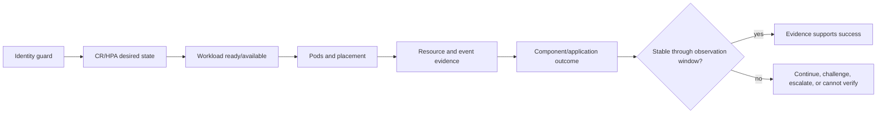

# Proven OpenShift probes for the DEV Argo CD replica maintenance

> **Folder route.** Start with [`argocd_replica_increase_explained.md`](argocd_replica_increase_explained.md) → execute Wednesday with [`argocd-replica-increase-acceptance-runbook.md`](argocd-replica-increase-acceptance-runbook.md) → record ACC evidence in [`maintenance-july-22-records-findings.md`](maintenance-july-22-records-findings.md). This command guide is pinned to DEV and is reference material only for ACC; never record Wednesday evidence in the July 20 DEV ledger.

Target: `https://api.eneco-vpp-dev.ceap.nl:6443` → namespace `eneco-vpp-argocd` → `ArgoCD/eneco-vpp`.

For the completed DEV window, the [minimal operator sequence](#minimal-operator-sequence) was the live path; the sections before it teach and prove each step. Wednesday's operator must use the ACC runbook instead.

Proof vocabulary:

- `EXECUTES`: exact command ran in Ubuntu/WSL with the installed client.
- `TARGET DATA`: it returned non-empty target-bound data or an explicit absence.
- `SEMANTICS`: it participates in CR → workload → pod → node → service reconciliation.
- `MONITOR-READY`: it has a healthy pattern, false-green test, and next action.
- `START-GATED`: do not repeat until the user explicitly announces maintenance start.

These labels answer different questions:

| Label | In plain language | What it does **not** prove |
|---|---|---|
| `EXECUTES` | The exact command works in this WSL terminal. | That it selected the intended object. |
| `TARGET DATA` | The output names or is bound to DEV, the namespace, and the intended object. | That desired state became healthy runtime state. |
| `SEMANTICS` | We know which layer the command observes and how to reconcile it with adjacent layers. | That the whole maintenance succeeded. |
| `MONITOR-READY` | The command has a healthy pattern, a false-green pattern, and a next action. | That the future CMC change has already been observed. |

Execution labels tell you **when** a safe command belongs:

| Label | When to run | Why |
|---|---|---|
| `PREP-ONCE` | Once during preparation. | Proves access, discovers names, and creates a starting baseline without beginning the live watch. |
| `T0` | Once again immediately after your start signal and immediately before CMC acts. | Makes the before/after comparison fresh and fair. |
| `START-GATED-REPEAT` | Repeatedly only after the maintenance-start signal is recorded. | Captured the DEV transition; any reuse must follow the ACC runbook and ACC ledger. |
| `FAILURE-ONLY` | Only when a primary probe shows a discrepancy. | Avoids noisy, expensive log/describe collection during a healthy path. |

## Concepts behind the commands

- The **ArgoCD CR** is the desired configuration CMC/operator works from.
- The **operator** converts that desire into Kubernetes **Deployments/StatefulSets**.
- A Deployment/StatefulSet count is controller reality; a **pod** is runtime reality; a **node** is capacity reality.
- `ha.enabled: false` says the prepackaged HA topology is disabled. It does not prohibit explicitly increasing one component.
- `server.autoscale.enabled: false` plus `get hpa` returning none meant an HPA was not deciding the replica count in the captured DEV state. If that changes at a fresh T0, HPA becomes the control surface.
- `phase: Available` is the operator's high-level status. It can coexist with a transient or component-specific problem, so it never replaces workload, pod, node, and application probes.
- An absent replica field means “no explicit override in this CR,” not zero. The operator default is revealed by the managed workload's desired count.
- **Requests** reserve schedulable capacity, **limits** are configured ceilings, and `oc adm top` is sampled actual use. They answer different questions.

Installed proof environment: `oc` client `4.8.11`, OpenShift server `4.20.16`, Kubernetes `1.33.8`. The skew is real; every command explicitly labeled `EXECUTES` below was executed in the actual WSL session instead of assumed from documentation. Parameterized failure-only templates remain `NOT YET RUN` until a real discrepancy supplies the pod/object name.

## Knowledge contract

After using this guide, a new SRE must be able to **explain** why identity comes first, **trace** a replica change from declared intent to useful service, **compare** reserved capacity with measured use, **diagnose** a desired-versus-ready gap, and **defend** a success or escalation decision with timestamped evidence. Reject the guide if command exit codes are the only justification.

## First principles: every command owns one link

A replica increase crosses several independent boundaries. A probe is useful only when the reader knows which boundary it observes and which next probe explains a disagreement.

```text
identity -> desired control -> workload -> pod -> scheduler/node -> component -> applications
  P01         P03/P04          P04      P05       P07/P08          P10          P09
```

The strip is the quick command map. The flowchart below turns it into the decision rule used during maintenance.



Read the flow from left to right. If one box disagrees with the previous box, stop advancing the success claim and use the next probe to explain the gap.

## 1. Identity guard — PREP-ONCE and T0

```bash
oc whoami
oc whoami --show-server
oc project -q
oc config current-context
oc version --short
```

Proof: `EXECUTES + TARGET DATA + MONITOR-READY`. The server was DEV and the context contained `api-eneco-vpp-dev-ceap-nl:6443`. Do not persist the username or token in the runbook.

Why this must precede every accepted block: terminal tabs can share kubeconfig. During close-out, a tab labelled DEV returned ACC topology after an ACC login. A healthy result from the wrong API is a false green, so reject the whole block unless `--show-server` equals the expected environment.

Healthy: server exactly equals `https://api.eneco-vpp-dev.ceap.nl:6443`.

Stop condition: any other server, expired authentication, or an unexpected identity/context.

## 2. Discover the exact Argo CD instance — PREP-ONCE

```bash
oc get argocds.argoproj.io --all-namespaces --request-timeout=15s
```

Proof: `EXECUTES + TARGET DATA + SEMANTICS`. It found three instances; the VPP target is `eneco-vpp-argocd/eneco-vpp`. The broad discovery took about 29 seconds, so use it once; use direct target commands during maintenance.

False green prevented: monitoring the healthy `openshift-gitops` or `cmc-sre-gitops` instance while CMC changes VPP Argo CD.

## 3. Capture declared configuration — PREP-ONCE and T0

```bash
oc -n eneco-vpp-argocd get argocd eneco-vpp -o yaml
```

Proof: `EXECUTES + TARGET DATA + SEMANTICS`. Live YAML showed `ha.enabled: false`, `server.autoscale.enabled: false`, component requests/limits, and phase `Available`. Replica fields were absent; do not render absence as zero.

Read the command from left to right:

| Part | Meaning |
|---|---|
| `oc` | Ask the OpenShift API through the authenticated CLI. |
| `-n eneco-vpp-argocd` | Restrict the lookup to the Argo CD control-plane namespace. This prevents reading a similarly named resource elsewhere. |
| `get argocd eneco-vpp` | Read the single `ArgoCD` custom resource named `eneco-vpp`: the operator's desired configuration. |
| `-o yaml` | Show the complete structured object so absent fields, autoscaling, HA, resources, and status can be distinguished. |

How the observed fields connect to your job:

- `ha.enabled: false`: the installation is not using the operator's bundled HA layout. A CMC replica increase can still add copies to selected components, so you must identify which component changes.
- `server.autoscale.enabled: false`: the server is not presently being scaled automatically. If CMC adds a fixed server replica value, the operator should make the Deployment desire that number.
- component `requests`/`limits`: these let you calculate the schedulable reservation and configured ceiling of each added replica before looking at actual `top` deltas.
- `status.phase: Available`: the operator considered the instance available at baseline. This is only the outer green light; the workload tables below prove the effective counts.
- replica fields absent: there was no explicit CR override at capture time. The operator default materialized as one replica per active workload, proven by probe 4.

Use the workload tables below for the effective replica count. Re-run this command at T0 and after the change; compare only the relevant replica/autoscale/resource fields, never secrets or raw kubeconfig.

## 4. Prove effective desired and ready replicas — PREP-ONCE, T0, START-GATED-REPEAT

```bash
oc -n eneco-vpp-argocd get deployments
oc -n eneco-vpp-argocd get statefulsets
oc -n eneco-vpp-argocd get hpa
```

Proof: all three are `EXECUTES + TARGET DATA + SEMANTICS + MONITOR-READY`.

Why three commands are needed:

- Deployments answer for server, repo server, Redis, and Dex.
- The StatefulSet answers for the application controller, whose stable identity differs from interchangeable Deployment pods.
- HPA answers whether another controller can overwrite a fixed desired server count. “No resources found” is therefore meaningful control evidence, not a failed command.

How to read the columns: `READY 1/1` means one ready out of one desired; `UP-TO-DATE 1` means one pod uses the latest workload template; `AVAILABLE 1` means one has satisfied the controller's availability rule. During the increase, those numbers may temporarily differ. Success requires them to converge to CMC's authorized new count.

Preparation baseline at `10:12:57 CEST`:

```text
Deployment eneco-vpp-dex-server   READY 1/1  UP-TO-DATE 1  AVAILABLE 1
Deployment eneco-vpp-redis        READY 1/1  UP-TO-DATE 1  AVAILABLE 1
Deployment eneco-vpp-repo-server  READY 1/1  UP-TO-DATE 1  AVAILABLE 1
Deployment eneco-vpp-server       READY 1/1  UP-TO-DATE 1  AVAILABLE 1
StatefulSet eneco-vpp-application-controller  READY 1/1
HPA: No resources found
```

Healthy change: the intended component's desired/current/updated/ready/available counts converge to the authorized new count.

False green: desired or up-to-date rises while ready/available remains lower. Next: pods, events, rollout/describe, then failure-only logs.

## 5. Bind replicas to pods and nodes — PREP-ONCE, T0, START-GATED-REPEAT

```bash
oc -n eneco-vpp-argocd get pods -o wide
```

Proof: `EXECUTES + TARGET DATA + SEMANTICS + MONITOR-READY`.

Preparation baseline: five pods, all `1/1 Running`, zero restarts. Controller and repo server were on `...westeurope2-vp8fs`; server, Redis, and Dex were on `...westeurope3-jpw2d`.

Use it to follow every new pod to the actual destination node. Do not monitor only the old nodes: a new replica may schedule elsewhere or remain Pending.

Unhealthy: `Pending`, non-Ready, restart growth, unexpected replacement, or a destination node missing from the node-health view.

## 6. Measure pod/container use — PREP-ONCE, T0, START-GATED-REPEAT every 60s

```bash
oc adm top pods -n eneco-vpp-argocd --containers
```

Proof: `EXECUTES + TARGET DATA + SEMANTICS + MONITOR-READY`.

Preparation baseline at `10:13:44 CEST`:

```text
application-controller  24m CPU  1543Mi memory
dex                      2m CPU   171Mi memory
redis                    2m CPU    26Mi memory
repo-server              1m CPU   139Mi memory
server                  10m CPU   100Mi memory
```

Meaning: sampled actual use—not reservation and not a guaranteed peak. If the command fails or returns no metrics, record utilization/spike detection as `UNKNOWN`; do not substitute requests or absence of pressure.

## 7. KIV node control — PREP-ONCE, T0, START-GATED-REPEAT

```bash
oc adm top nodes
oc get nodes
oc -n eneco-vpp-argocd get pods -o wide
```

Proof: `EXECUTES + TARGET DATA + SEMANTICS + MONITOR-READY`.

Preparation baseline at `10:14:31 CEST`:

```text
...westeurope2-vp8fs  CPU 884m / 25%  memory 19107Mi / 62%
...westeurope3-jpw2d  CPU 445m / 12%  memory 15617Mi / 50%
all cluster nodes: Ready
```

Interpret in three panes:

1. `top`: actual sampled use.
2. Argo CD requests/limits: reservation and ceiling; see the start-here document.
3. wide pods + events: actual placement and scheduler failure.

No Eneco/CMC CPU, memory, or delta threshold was supplied, so this guide does not invent one. Compare every fresh sample with T0 and record material movement. Hard failure regardless of percentage: `NotReady`, pressure, eviction/OOM, Pending, `FailedScheduling`, or an explicit CMC/Eneco limit breach. A percentage without an authorized threshold is evidence for investigation, not a go/no-go decision.

Current proof ceiling: sampled utilization, readiness, and actual placement are proven. Pre-change `allocatable − requested` headroom on every eligible node is **UNVERIFIED** because the node-reservation describe attempt did not produce valid evidence. Do not turn the percentages above into a capacity-approval claim; use the actual scheduling result/events during the change, or add a successfully executed requested/allocatable probe.

## 8. Failure and attribution evidence — PREP-ONCE, T0, START-GATED-REPEAT

```bash
oc -n eneco-vpp-argocd get events --sort-by=.lastTimestamp
```

Proof: `EXECUTES + TARGET DATA + MONITOR-READY`; it returned `No resources found` at `10:16:57 CEST`. That means no current namespace event rows—not proof that no earlier event ever occurred.

Look for `FailedScheduling`, probe failures, unhealthy mounts/images, evictions, kills, and repeated back-off. Record first/last observed time and the involved object. Timing alone does not prove CMC caused it.

## 9. Check Argo CD application outcome — PREP-ONCE, T0, START-GATED-REPEAT

```bash
oc -n eneco-vpp-argocd get applications.argoproj.io
```

Proof: `EXECUTES + TARGET DATA + SEMANTICS`; the visible full-table tail was predominantly `Synced Healthy`, with at least two pre-existing `OutOfSync Healthy` rows: `opstools-eneco-vpp-agg` and `platform`.

Do not claim “all applications healthy/synced” from a screenful. At T0, preserve the complete exception set; during/after, flag only new or worsened exceptions and note that stored Argo status does not prove end-user functionality.

For ACC, the runbook adds a deterministic full-fleet aggregation over JSON: total count, grouped sync/health distribution, every exception, and every `reconciledAt` row. That form is **STATICALLY VERIFIED, NOT YET RUN IN THE AVD**. Until a human paste or isolated kubeconfig runs it successfully, the ACC fleet baseline remains `APPLICATION FLEET STATUS INCOMPLETE`.

## 10. Component usefulness — FAILURE-ONLY or discrepancy drill-down

The legacy endpoint membership command was activated during the DEV change to prove the newly scaled serving layer:

```bash
oc -n eneco-vpp-argocd get endpoints
```

Status: `EXECUTES + TARGET DATA + SEMANTICS`. At `10:36:45 CEST`, the server exposed three service/metrics endpoint IPs, repo server exposed its two pod IPs across service ports, and Redis HA endpoints were present. The returned membership remains valid DEV evidence.

For ACC and later runs, prefer the API that Kubernetes 1.33 has not deprecated:

```bash
oc -n eneco-vpp-argocd get endpointslices.discovery.k8s.io -o wide
```

An **EndpointSlice** is the current Kubernetes object that lists the network backends behind Services. A Ready pod count says containers passed readiness; an EndpointSlice shows whether Services can actually select those ready backends. The exact command was live-executed in ACC at `11:26:32 CEST` and returned the single-backend preparation shape for Dex, standalone Redis, repo server, and server, plus metrics slices. It therefore has `EXECUTES + TARGET DATA + SEMANTICS` for the ACC baseline. Healthy on Wednesday means the server, repo, and Redis/HAProxy Services have the expected ready backend addresses; missing or unready addresses keep the service-usefulness gate open.

The wide form proves addresses, not the documented Pod-UID join. The ACC runbook therefore also emits Pod name/UID/IP/readiness plus EndpointSlice Service label, address, `conditions.ready`, `targetRef.name`, and `targetRef.uid`. For each applicable Service, the selected Ready Pod UID set must equal the ready EndpointSlice target UID set. That structured form is **STATICALLY VERIFIED, NOT YET RUN IN THE AVD**; wide output alone cannot promote the serving invariant.

Run the parameterized commands below only when replica layers diverge or the service outcome regresses:

```bash
oc -n eneco-vpp-argocd describe pod POD_NAME
oc -n eneco-vpp-argocd logs POD_NAME --all-containers --since=10m
```

Status: the exact parameterized pod forms are `NOT YET RUN`; they are failure-only templates. Replace `POD_NAME` with an evidenced pod. Never stream every log by default.

## Hard start gate

> **Historical DEV gate:** the July 20 run started repeated monitoring only after the user start signal was written in `maintenance-july-20-records-findings.md`. For Wednesday ACC, do not follow this DEV gate; use `argocd-replica-increase-acceptance-runbook.md` and write the start signal in `maintenance-july-22-records-findings.md`.

At start, capture a fresh T0 with probes 1, 3–9. Preserve the preparation baseline. During the change, repeat replicas/pods/events/applications about every 15 seconds and metrics about every 60 seconds. A single green sample is not closure. Continue through the observation window declared in the signed CMC/Eneco intent, requiring no new restarts, failure events, component regression, or application-health regression. If no duration is supplied, report `STABLE AS OBSERVED — DURATION CONTRACT NOT SUPPLIED` and obtain an explicit human handoff rather than inventing a timer.

## Minimal operator sequence

This final strip is the copy-side mental checklist; it summarizes the proven commands without hiding their decision order.

```text
Identity correct?
  -> intended component and old→new count known?
    -> CR/HPA intent changed?
      -> workload desired/current/ready/available converged?
        -> pods Ready, zero new restarts, actual nodes known?
          -> no scheduling/pressure/OOM events and node delta acceptable?
            -> component/application outcome stable through observation window?
```

If any arrow fails: do not declare success; capture the evidence and use `continue`, `challenge CMC`, `escalate`, or `cannot verify`. This document authorizes no apply/edit/patch/scale/delete/restart/sync action.

## Self-test

Scenario: the selected workload shows desired `3`, current `3`, ready `2`; node use has not breached any supplied limit, and one pod is `Pending`.

1. Is the change successful?
2. Which two confirmed probes come next?
3. What would change your conclusion?

Answer: no. Run probe 5 to bind the Pending pod to placement/state and probe 8 to find `FailedScheduling` or another event cause. Stable node utilization does not prove the pod can satisfy requests and placement constraints. The conclusion changes only after the pod becomes Ready/Available, failure evidence stops, the actual destination node is healthy, and service/application outcome stabilizes.

## Evidence ledger and go deeper

The command outcomes and capture times above are live DEV evidence. Public documentation explains the mechanism but does not prove this installed cluster: [Red Hat OpenShift GitOps Argo CD instance configuration](https://docs.redhat.com/en/documentation/red_hat_openshift_gitops/1.19/html-single/argo_cd_instance/index), [OpenShift `oc adm top`](https://docs.redhat.com/en/documentation/openshift_container_platform/4.15/html/cli_tools/openshift-cli-oc), and [OpenShift GitOps monitoring](https://docs.redhat.com/en/documentation/red_hat_openshift_gitops/1.19/html/observability/monitoring).

Visual coverage: probe ownership and causal order → ASCII strips; convergence and escalation decision → Mermaid flowchart.

Angles excluded: none — identity, desired control, rollout realization, placement, capacity, events, service outcome, time, and attribution all affect whether the operator may defend success.
