# Acceptance Argo CD replica increase runbook

> **Folder route.** Start with [`argocd_replica_increase_explained.md`](argocd_replica_increase_explained.md) → use this file for Wednesday's ACC execution → record evidence in [`maintenance-july-22-records-findings.md`](maintenance-july-22-records-findings.md). The DEV command guide and July 20 ledger are historical reference only.

Use this during Wednesday's CMC maintenance. It is read-only: it observes the cluster, records evidence, and tells you when the evidence is insufficient. It does not authorize you to scale, patch, restart, sync, or delete anything.

## One-page cockpit

### Mission in one sentence

CMC changes the desired Argo CD control-plane topology; our job is to prove that the OpenShift GitOps operator realizes that intent, Kubernetes makes every intended replica ready and serving, Argo CD applications avoid sustained regression, and the result remains stable long enough to expose delayed failures.

### Immutable target

| Input | Required value |
|---|---|
| API | `https://api.eneco-vpp-acc.ceap.nl:6443` |
| Namespace | `eneco-vpp-argocd` |
| `ArgoCD` CR | `eneco-vpp` |
| Baseline record | `maintenance-july-22-records-findings.md` |
| DEV learning record | `maintenance-july-20-records-findings.md` |
| Cluster changes allowed by this runbook | none |

### Hard stops

Stop accepting evidence and use `CANNOT VERIFY` if any of these is true:

- the pinned context does not return the ACC API;
- the namespace or `ArgoCD` object UID changes unexpectedly;
- CMC's intended component/count/topology is absent—observe, but do not say “completed as intended”;
- desired, observed generation, revision, updated, ready, and available state disagree;
- a replacement Pod erases the predecessor from the record;
- Redis HA is partial, a serving Pod is missing from EndpointSlice, or a new warning/restart/readiness failure appears;
- metrics, Application fleet coverage, or reconciliation freshness is missing and the conclusion depends on it;
- one green snapshot is the only stabilization evidence.

### The six-word proof ladder

The following memory aid compresses the ordered evidence path used by every Wednesday decision:

```text
identity -> intent -> realized -> serving -> outcome -> time
  API       CR/HPA    workloads     EndpointSlice   Applications   stable interval
```

Read left to right. Never skip a word because the next one is green. `3/3 Ready` does not prove the intended revision, Service backend membership, fresh reconciliation, or late stability.

### Decision codes

| Code | Use it when | Meaning |
|---|---|---|
| `CONTINUE` | a transition is expected and no invariant is broken | keep sampling; do not close |
| `CHALLENGE CMC` | observed change differs from the signed intent or remains incomplete | ask CMC to explain/correct; this runbook still performs no mutation |
| `ESCALATE` | hard failure or worsening impact appears | involve the on-call/escalation path with evidence |
| `CANNOT VERIFY` | a required evidence layer is stale, incomplete, permission-blocked, or wrong-context | do not replace it with a different green signal |
| `RECOVERED` | a transient returned to baseline/healthy and stayed stable | preserve the event; recovery does not mean it never happened |
| `STABLE AS OBSERVED` | all available gates converge through the evidence floor | bounded technical closure; state residuals |
| `COMPLETE AS INTENDED` | `STABLE AS OBSERVED` plus authoritative CMC intent matches the result | strongest runbook verdict; still not an end-user transaction test |

## Knowledge contract

After using this runbook, a new SRE must be able to **bind** every sample to ACC, **capture** a fair T0, **trace** the CMC intent through workload revision and serving backends, **preserve** Pod replacements and transient events, **compare** measured use with scheduler reservation, **interpret** `Synced`, `Healthy`, and `Progressing`, and **defend** `continue`, `challenge`, `escalate`, `cannot verify`, `recovered`, or closure. Reject the runbook if a green exit code or Pod count is the final argument.

## First principles: two loops, one maintenance

This runbook observes two different control loops:

1. The **OpenShift GitOps operator loop** watches the `ArgoCD` CR and creates/updates Argo CD's Deployments, StatefulSets, Services, and Pods. This is the loop CMC changes.
2. The **Argo CD application loop** compares each `Application`'s Git-desired manifests with live application resources. This is where `solver`, `Synced`, `Healthy`, and `Progressing` live.

The maintenance can make loop 1 green while loop 2 is stale or regressing. That is why both appear in the cockpit.

## Phase 0 — bind every command to ACC

A terminal tab title is presentation, not identity. DEV and ACC tabs share kubeconfig state. Capture the ACC context only after proving its API, then pin every command to that context.

```bash
ACC_API='https://api.eneco-vpp-acc.ceap.nl:6443'
ACC_NS='eneco-vpp-argocd'
ACC_ARGOCD='eneco-vpp'

acc_bind() {
  ACC_CONTEXT="$(oc config current-context)" || return 1
  ACC_ACTUAL_API="$(oc --context "$ACC_CONTEXT" whoami --show-server)" || return 1
  if [ "$ACC_ACTUAL_API" != "$ACC_API" ]; then
    echo "STOP: expected ACC API $ACC_API but got $ACC_ACTUAL_API" >&2
    return 1
  fi
  export ACC_CONTEXT ACC_API ACC_NS ACC_ARGOCD
}

acc_oc() {
  oc --context "$ACC_CONTEXT" "$@"
}

acc_guard() {
  [ "$(acc_oc whoami --show-server)" = "$ACC_API" ] || {
    echo 'STOP: pinned context no longer resolves to ACC' >&2
    return 1
  }
}

acc_bind && acc_guard
```

Expected: no `STOP` line and `ACC_CONTEXT` is set. The function is safer than relying on the active context because every later query passes `--context "$ACC_CONTEXT"`.

Immediately record immutable identities:

```bash
acc_guard && acc_oc get namespace "$ACC_NS" \
  -o custom-columns='NAME:.metadata.name,UID:.metadata.uid,CREATED:.metadata.creationTimestamp'

acc_guard && acc_oc -n "$ACC_NS" get argocd "$ACC_ARGOCD" \
  -o custom-columns='NAME:.metadata.name,UID:.metadata.uid,GENERATION:.metadata.generation,PHASE:.status.phase'
```

If a guard or identity command fails, discard the entire capture block; do not copy the partial output into the ledger.

Proof state: the individual unpinned ACC commands and the preferred EndpointSlice query were live-executed during preparation. Automated AVD typing corrupted complex punctuation in harmless wrapper attempts, so the pinned wrapper remains `STRUCTURALLY VERIFIED, AVD BEHAVIORAL PROOF BLOCKED`. A human paste or isolated-kubeconfig execution is required before `status` can become `monitor-ready`.

## Phase 1 — obtain the CMC intent contract

Do not infer authorization from a DEV-shaped live delta. Ask CMC for, and record, the following before issuing `COMPLETE AS INTENDED`:

| Field | Required answer |
|---|---|
| Environment/API | ACC and exact API |
| Namespace and `ArgoCD` UID | target identity |
| Component(s) | server, repo, Redis HA, controller, Dex, or other |
| Old → intended new | exact count per component |
| HA mode | before and intended after |
| Controller recreation | allowed/expected? |
| Maintenance window | start, expected end, observation/handoff |
| Evidence source | change ID/message/contact |
| Source timestamp | when intent was confirmed |

DEV suggests—without authorizing—server `1→3`, repo `1→2`, and standalone Redis → three HAProxy plus three Redis/Sentinel Pods, with controller/Dex remaining one. A different signed ACC plan replaces this hypothesis.

## Phase 2 — capture fresh T0

T0 means the last snapshot immediately before CMC acts. Today's preparation baseline saves time, but it expires at Wednesday T0.

### T0 pre-existing application-risk gate

DEV exposed a separate delivery defect after its maintenance: the One-For-All `20260720.1` pipeline generated empty image tags, Helm fell back to `latest`, and the registry had no matching `latest` manifests. Repository evidence shows that the ACC `marketinteraction` override was also blanked; it does **not** prove ACC consumed that revision or is unhealthy.

Before CMC starts, explicitly capture this application so a pre-existing delivery fault cannot be blamed on the replica increase:

```bash
acc_guard && acc_oc -n "$ACC_NS" get application marketinteraction-eneco-vpp \
  -o custom-columns='NAME:.metadata.name,SYNC:.status.sync.status,HEALTH:.status.health.status,REVISION:.status.sync.revision,RECONCILED:.status.reconciledAt'
acc_guard && acc_oc -n eneco-vpp get deployment marketinteraction-eneco-vpp \
  -o custom-columns='NAME:.metadata.name,IMAGE:.spec.template.spec.containers[*].image,DES:.spec.replicas,RDY:.status.readyReplicas,AVL:.status.availableReplicas'
acc_guard && acc_oc -n eneco-vpp get replicaset \
  -o custom-columns='NAME:.metadata.name,DES:.spec.replicas,RDY:.status.readyReplicas,IMAGE:.spec.template.spec.containers[*].image' | grep marketinteraction
acc_guard && acc_oc -n eneco-vpp get pods \
  -o custom-columns='NAME:.metadata.name,READY:.status.containerStatuses[*].ready,WAITING:.status.containerStatuses[*].state.waiting.reason,IMAGE:.spec.containers[*].image' | grep marketinteraction
```

Expected healthy baseline: the Application is not Degraded, the active image tag is explicit rather than `latest`, and desired replicas have Ready/Available Pods. False result: `latest`, `ImagePullBackOff`, a missing manifest event, or a Degraded Application. In that false case, write `PRE-EXISTING APPLICATION-DELIVERY CONDITION`, preserve the exact revision/image/event, inform the maintenance participants, and keep the condition separate from CMC attribution unless the replica change demonstrably alters it.

### T0-A: declared configuration

```bash
acc_guard && acc_oc -n "$ACC_NS" get argocd "$ACC_ARGOCD" -o yaml
acc_guard && acc_oc -n "$ACC_NS" get hpa
```

Record only the relevant replica, HA, autoscale, resource, condition, and phase fields. Never paste secrets or raw kubeconfig. An absent replica field means “no explicit override,” not zero; effective counts come from the managed workloads below.

### T0-B: revision-aware workloads

```bash
acc_guard && acc_oc -n "$ACC_NS" get deployment \
  -o custom-columns='NAME:.metadata.name,GEN:.metadata.generation,OBS:.status.observedGeneration,DES:.spec.replicas,CUR:.status.replicas,UPD:.status.updatedReplicas,RDY:.status.readyReplicas,AVL:.status.availableReplicas,UNAVL:.status.unavailableReplicas'

acc_guard && acc_oc -n "$ACC_NS" get statefulset \
  -o custom-columns='NAME:.metadata.name,GEN:.metadata.generation,OBS:.status.observedGeneration,DES:.spec.replicas,CUR:.status.currentReplicas,UPD:.status.updatedReplicas,RDY:.status.readyReplicas,CREV:.status.currentRevision,UREV:.status.updateRevision'
```

Why the extra fields matter: `RDY=3` can still be old Pods. For a Deployment, `GEN=OBS` and `DES=CUR=UPD=RDY=AVL` with `UNAVL` empty/zero supports convergence. For a changed StatefulSet, `GEN=OBS`, `DES=CUR=UPD=RDY`, and `CREV=UREV` support convergence.

### T0-C: identity-aware Pod history

```bash
acc_guard && acc_oc -n "$ACC_NS" get pods -o custom-columns='NAME:.metadata.name,UID:.metadata.uid,CREATED:.metadata.creationTimestamp,READY:.status.containerStatuses[*].ready,RESTARTS:.status.containerStatuses[*].restartCount,LAST_REASON:.status.containerStatuses[*].lastState.terminated.reason,NODE:.spec.nodeName,HASH:.metadata.labels.pod-template-hash,REV:.metadata.labels.controller-revision-hash'
```

Restart counts belong to a Pod/container identity. If a Pod disappears and a new UID appears—even with the same role or StatefulSet name—record `REPLACED`, preserve the predecessor's last row, and start a new row. Never treat the new zero as the old Pod recovering.

### T0-D: serving, applications, events, and resources

```bash
acc_guard && acc_oc -n "$ACC_NS" get service -o wide
acc_guard && acc_oc -n "$ACC_NS" get endpointslices.discovery.k8s.io -o wide
acc_guard && acc_oc -n "$ACC_NS" get applications.argoproj.io \
  -o custom-columns='NAME:.metadata.name,SYNC:.status.sync.status,HEALTH:.status.health.status,RECONCILED:.status.reconciledAt'
acc_guard && acc_oc -n "$ACC_NS" get events --sort-by=.lastTimestamp
acc_guard && acc_oc adm top pods -n "$ACC_NS" --containers
acc_guard && acc_oc adm top nodes
```

The wide EndpointSlice row is easy to scan, but it cannot prove the Service-selector → Ready-Pod → ready-backend join. Human-paste this one function. Every API response is captured and checked before `jq`, so a failed guard or failed `oc` source cannot be hidden by a later successful parser:

```bash
acc_structured_sample() {
  local service_json pod_json endpoint_json application_json serving_rows application_rows

  command -v jq >/dev/null 2>&1 || {
    echo 'STRUCTURED_SAMPLE_FAILED: jq is unavailable' >&2
    return 1
  }
  acc_guard || {
    echo 'STRUCTURED_SAMPLE_FAILED: ACC identity guard' >&2
    return 1
  }

  service_json="$(acc_oc -n "$ACC_NS" get service -o json)" || {
    echo 'STRUCTURED_SAMPLE_FAILED: Service read' >&2
    return 1
  }
  pod_json="$(acc_oc -n "$ACC_NS" get pods -o json)" || {
    echo 'STRUCTURED_SAMPLE_FAILED: Pod read' >&2
    return 1
  }
  endpoint_json="$(acc_oc -n "$ACC_NS" get endpointslices.discovery.k8s.io -o json)" || {
    echo 'STRUCTURED_SAMPLE_FAILED: EndpointSlice read' >&2
    return 1
  }
  application_json="$(acc_oc -n "$ACC_NS" get applications.argoproj.io -o json)" || {
    echo 'STRUCTURED_SAMPLE_FAILED: Application read' >&2
    return 1
  }

  printf '%s\n' "$service_json" | jq -e '.items | type == "array" and length > 0' >/dev/null || return 1
  printf '%s\n' "$pod_json" | jq -e '.items | type == "array" and length > 0' >/dev/null || return 1
  printf '%s\n' "$endpoint_json" | jq -e '.items | type == "array" and length > 0' >/dev/null || return 1
  printf '%s\n' "$application_json" | jq -e '.items | type == "array" and length > 0' >/dev/null || return 1
  printf '%s\n' "$application_json" | jq -e \
    'all(.items[]; ((.status.reconciledAt // "") | type == "string" and length > 0))' >/dev/null || {
    echo 'STRUCTURED_SAMPLE_FAILED: missing Application reconciledAt' >&2
    return 1
  }

  serving_rows="$(printf '%s\n%s\n%s\n' "$service_json" "$pod_json" "$endpoint_json" | jq -rs '
    .[0] as $services | .[1] as $pods | .[2] as $slices
    | [
        $services.items[]
        | select((.spec.selector // {}) | length > 0) as $service
        | ($service.spec.selector | to_entries) as $requirements
        | $pods.items[] as $pod
        | select(all($requirements[]; ($pod.metadata.labels[.key] // null) == .value))
        | {
            service: $service.metadata.name,
            selector: ($requirements | map("\(.key)=\(.value)") | join(",")),
            pod: $pod.metadata.name,
            uid: ($pod.metadata.uid // "missing-uid"),
            ip: ($pod.status.podIP // "missing-ip"),
            ready: any($pod.status.conditions[]?; .type == "Ready" and .status == "True")
          }
      ] as $selected
    | [
        $slices.items[] as $slice
        | $slice.endpoints[]?
        | {
            slice: $slice.metadata.name,
            service: ($slice.metadata.labels["kubernetes.io/service-name"] // "missing-service"),
            address: ((.addresses // []) | join(",")),
            ready: (.conditions.ready // false),
            pod: (.targetRef.name // "missing-target"),
            uid: (.targetRef.uid // "missing-uid"),
            ports: ($slice.ports | map("\(.name // "unnamed"):\(.port // 0)/\(.protocol // "unknown")") | join(","))
          }
      ] as $endpoints
    | ($selected[] | ["SELECTED_POD", .service, .selector, .pod, .uid, .ip, .ready] | @tsv),
      ($endpoints[] | ["ENDPOINT", .service, .slice, .address, .pod, .uid, .ready, .ports] | @tsv),
      ($services.items[]
        | select((.spec.selector // {}) | length > 0)
        | .metadata.name as $service_name
        | ([$selected[] | select(.service == $service_name and .ready == true) | .uid] | unique | sort) as $selected_uids
        | ([$endpoints[] | select(.service == $service_name and .ready == true) | .uid] | unique | sort) as $endpoint_uids
        | [
            "SERVING_CHECK",
            $service_name,
            ($selected_uids | join(",")),
            ($endpoint_uids | join(",")),
            (if (($selected_uids | length) > 0 and $selected_uids == $endpoint_uids) then "MATCH" else "MISMATCH" end)
          ]
        | @tsv)
  ')" || {
    echo 'STRUCTURED_SAMPLE_FAILED: serving parser' >&2
    return 1
  }
  [ -n "$serving_rows" ] || {
    echo 'STRUCTURED_SAMPLE_FAILED: empty serving result' >&2
    return 1
  }

  application_rows="$(printf '%s\n' "$application_json" | jq -r '
    "TOTAL\t\(.items | length)",
    (.items
      | group_by([(.status.sync.status // "Unknown"), (.status.health.status // "Unknown")])[]
      | "DISTRIBUTION\t\(.[0].status.sync.status // "Unknown")\t\(.[0].status.health.status // "Unknown")\t\(length)"),
    (.items[]
      | select((.status.sync.status // "Unknown") != "Synced" or (.status.health.status // "Unknown") != "Healthy")
      | "EXCEPTION\t\(.metadata.name)\t\(.status.sync.status // "Unknown")\t\(.status.health.status // "Unknown")\t\(.status.reconciledAt // "missing")"),
    (.items[] | "FRESHNESS\t\(.metadata.name)\t\(.status.reconciledAt // "missing")")
  ')" || {
    echo 'STRUCTURED_SAMPLE_FAILED: Application parser' >&2
    return 1
  }
  [ -n "$application_rows" ] || {
    echo 'STRUCTURED_SAMPLE_FAILED: empty Application result' >&2
    return 1
  }

  printf '%s\n%s\n' "$serving_rows" "$application_rows"
}

acc_structured_sample
```

Proof state: the raw ACC resources and wide EndpointSlice form were live-executed during preparation. These structured join/aggregation forms are **STATICALLY VERIFIED, NOT YET RUN IN THE AVD** because the remote typing path corrupted complex punctuation. A human paste or isolated kubeconfig must execute them before their evidence is accepted.

Say “no events returned by this query at this timestamp,” never “no event occurred.” Events are retention-bounded and may be aggregated; preserve any intermediate Warning even if it disappears later.

## Phase 3 — record the start gate

Do not run a repeated watch until the user explicitly says CMC has started. In `maintenance-july-22-records-findings.md`, record:

- user start signal and CEST timestamp;
- CMC intent source;
- T0 capture ID;
- pinned context, API, namespace UID, and `ArgoCD` UID;
- actual start of the first sample.

Use capture IDs such as `ACC-T0-20260722-102950` and `ACC-LIVE-001`.

## Phase 4 — run one bounded fast sample at a time

The sample below performs no loop and no mutation. It prints start/end/duration so cadence is observed rather than claimed. Repeat it only after the start gate; do not overlap invocations.

```bash
acc_fast_sample() {
  ACC_CAPTURE_ID="ACC-LIVE-$(date +%Y%m%d-%H%M%S)"
  ACC_SAMPLE_START="$(date +%s)"
  echo "CAPTURE=$ACC_CAPTURE_ID START=$(date -Iseconds)"

  acc_guard || { echo 'SAMPLE_FAILED identity'; return 1; }

  acc_oc -n "$ACC_NS" get deployment --request-timeout=10s \
    -o custom-columns='NAME:.metadata.name,GEN:.metadata.generation,OBS:.status.observedGeneration,DES:.spec.replicas,CUR:.status.replicas,UPD:.status.updatedReplicas,RDY:.status.readyReplicas,AVL:.status.availableReplicas,UNAVL:.status.unavailableReplicas' || return 1

  acc_oc -n "$ACC_NS" get statefulset --request-timeout=10s \
    -o custom-columns='NAME:.metadata.name,GEN:.metadata.generation,OBS:.status.observedGeneration,DES:.spec.replicas,CUR:.status.currentReplicas,UPD:.status.updatedReplicas,RDY:.status.readyReplicas,CREV:.status.currentRevision,UREV:.status.updateRevision' || return 1

  acc_oc -n "$ACC_NS" get pods --request-timeout=10s \
    -o custom-columns='NAME:.metadata.name,UID:.metadata.uid,CREATED:.metadata.creationTimestamp,READY:.status.containerStatuses[*].ready,RESTARTS:.status.containerStatuses[*].restartCount,NODE:.spec.nodeName,HASH:.metadata.labels.pod-template-hash,REV:.metadata.labels.controller-revision-hash' || return 1

  acc_oc -n "$ACC_NS" get endpointslices.discovery.k8s.io --request-timeout=10s -o wide || return 1
  acc_oc -n "$ACC_NS" get applications.argoproj.io --request-timeout=10s \
    -o custom-columns='NAME:.metadata.name,SYNC:.status.sync.status,HEALTH:.status.health.status,RECONCILED:.status.reconciledAt' || return 1
  acc_oc -n "$ACC_NS" get events --request-timeout=10s --sort-by=.lastTimestamp || return 1

  ACC_SAMPLE_END="$(date +%s)"
  echo "CAPTURE=$ACC_CAPTURE_ID END=$(date -Iseconds) DURATION_SECONDS=$((ACC_SAMPLE_END-ACC_SAMPLE_START))"
}
```

If any command returns nonzero, write `SAMPLE_FAILED`; the uncovered interval is not green. If duration exceeds the intended cadence, record the actual duration and adopt a sustainable non-overlapping cadence. Do not describe it as 15 seconds unless the completed samples demonstrate that.

## Phase 5 — run the slower resource sample

Run no faster than the Metrics API can refresh; about 60 seconds is an observer starting point, not a guarantee of freshness.

```bash
acc_slow_sample() {
  echo "SLOW_SAMPLE_START=$(date -Iseconds)"
  acc_guard || return 1
  acc_oc adm top pods -n "$ACC_NS" --containers || return 1
  acc_oc adm top nodes || return 1
  echo "SLOW_SAMPLE_END=$(date -Iseconds)"
}
```

`oc adm top` command time is not the underlying measurement time. When permitted, inspect the Metrics API timestamps:

```bash
acc_guard && acc_oc get --raw "/apis/metrics.k8s.io/v1beta1/namespaces/$ACC_NS/pods"
```

Only call two samples fresh if timestamps/windows advance and every expected new Pod appears. If raw metrics are forbidden, timestamps repeat, or new Pods are missing, write `METRICS STALE/INCOMPLETE — UTILIZATION UNKNOWN`. Requests/limits can still explain schedulability and ceilings; they cannot replace measured consumption.

## Phase 6 — prove each topology invariant

### Deployment invariant

For every changed Deployment: generation observed, intended desired count, current/updated/ready/available equal, no unavailable replicas, and Pods belong to the new template revision.

### StatefulSet invariant

For every changed StatefulSet: generation observed, desired/current/updated/ready equal, currentRevision equals updateRevision, every expected ordinal exists, and Pod UIDs/restarts/nodes are recorded.

### Redis HA invariant

If CMC enables HA, do not summarize this as “Redis `1→3`.” Prove the whole transition:

| Layer | Required observation | Non-success example |
|---|---|---|
| CR intent | `ha.enabled` matches signed intent | intent absent or mismatched |
| Old standalone path | presence/absence matches intent | stale standalone Service/workload still selected |
| HAProxy Deployment | intended generation and replicas converge | `3/3` proxy with incomplete Redis does not pass |
| Redis/Sentinel StatefulSet | intended ordinals/revision/ready converge; observed Pods are `2/2` | `2/3`, Pending, old revision, restart loop |
| Services/selectors | select intended HA workloads | selector targets stale/incorrect labels |
| EndpointSlices | expected ready backend UIDs and ports appear | fewer ready backends than ready Pods |
| Events | no new unresolved warning evidence | FailedScheduling/probe/backoff evidence |

Readiness/topology does not necessarily expose Sentinel quorum or elected Redis role. If the allowed read-only surfaces cannot prove it, write `REDIS DATA-PLANE QUORUM UNVERIFIED`; do not claim functional quorum.

### Serving invariant

A Service is a stable address. An EndpointSlice is the current list of network backends behind it. For server, repo, Redis, and HAProxy as applicable:

1. compare the Service selector with the intended Pods;
2. compare Ready Pod UIDs with EndpointSlice `targetRef` UIDs/ready conditions;
3. compare ports;
4. require consistent membership throughout every completed post-readiness sample in the signed observation interval.

Three Ready Pods with two ready backends means the serving layer is incomplete.

Use the structured Pod/EndpointSlice output above. For each Service being assessed, resolve its selector, form the set of selected Ready Pod UIDs, and compare it with the set of EndpointSlice `targetRef.uid` values whose `conditions.ready` is true. The sets must match for the applicable backends; a missing UID, `missing-uid`, false readiness, wrong port, or extra stale backend keeps the gate open.

## Phase 7 — follow resources to the actual nodes

The scheduler uses requests and eligibility, not cluster-average `top` percentages.

For every new Pod, take its actual `NODE` from the Pod table, then run:

```bash
acc_guard && acc_oc describe node NODE_NAME
acc_guard && acc_oc get pods -A --field-selector spec.nodeName=NODE_NAME \
  -o custom-columns='NS:.metadata.namespace,NAME:.metadata.name,CPU_REQ:.spec.containers[*].resources.requests.cpu,MEM_REQ:.spec.containers[*].resources.requests.memory'
```

Replace `NODE_NAME` only with an evidenced destination. Compare:

- node allocatable CPU/memory;
- aggregate scheduled requests from `describe node`/per-Pod evidence;
- new Argo CD request delta;
- node conditions, taints/labels, and the workload's selectors/affinity/tolerations;
- measured node/pod use as a separate pane.

No contractual Eneco percentage was supplied. Pragmatic attention can use baseline deltas or a repeated high percentage, but hard failures override percentages: `NotReady`, pressure, eviction/OOM, Pending, or `FailedScheduling`.

If permission prevents reservation or eligibility proof, say `SCHEDULABLE HEADROOM UNVERIFIED`; low `top` is not a substitute.

## Phase 8 — interpret `solver` and the Application fleet

`solver` is an Argo CD `Application`, not the Argo CD server, repo server, Redis, Dex, or application controller.

| Axis | Question | Examples |
|---|---|---|
| Sync | Does live Kubernetes configuration match Git-desired manifests? | `Synced`, `OutOfSync`, `Unknown` |
| Health | Are the tracked resources operational by Argo CD's health rules? | `Healthy`, `Progressing`, `Degraded`, `Unknown` |

`Synced Progressing` is valid: desired manifests and live configuration can match while a Deployment is still rolling out. `OutOfSync Healthy` can mean the live workload runs but differs from Git. `Synced Degraded` can mean desired configuration is applied but runtime health is bad.

For every sample, record the total Application count and complete sync/health distribution plus every non-`Synced` or non-`Healthy` row. If the query is incomplete, write `APPLICATION FLEET STATUS INCOMPLETE`; do not say “all Applications healthy.”

Use the structured Application aggregation above, not a screenful. `TOTAL`, every `DISTRIBUTION`, every `EXCEPTION`, and every `FRESHNESS` row belong to one timestamped capture. An empty output, `jq` failure, permission error, missing `reconciledAt`, or truncated capture is `APPLICATION FLEET STATUS INCOMPLETE`, never an all-green fleet.

If the controller Pod is recreated, stored green Application rows may be stale. Compare `status.reconciledAt` or another available freshness signal with the replacement time. If nothing advances, use `RECONCILIATION FRESHNESS UNVERIFIED`, even when the controller is Ready.

Argo CD health is not an end-user transaction test. It is a control-plane outcome proxy.

## Phase 9 — stabilize, then close or hand off

The following state machine shows why recovery returns to observation and why the first green state is not closure:

```mermaid
stateDiagram-v2
    [*] --> T0
    T0 --> IntentObserved
    IntentObserved --> Converging
    Converging --> Failure: Pending, revision lag, restart, warning
    Converging --> Serving: revision and Ready converge
    Serving --> Failure: EndpointSlice incomplete
    Serving --> OutcomeObserved
    OutcomeObserved --> Failure: new Degraded or stale reconciliation
    OutcomeObserved --> EvidenceFloor
    EvidenceFloor --> Failure: late regression
    EvidenceFloor --> StableAsObserved: all available gates and late checkpoint pass
    Failure --> Converging: condition recovers; preserve finding
    StableAsObserved --> CompleteAsIntended: signed intent also matches
```



The evidence floor is the maximum of:

- revision-aware workload convergence;
- stable EndpointSlice membership after readiness;
- fresh, complete metrics for every metrics sample used; a change/trend claim needs a before and an after because a delta mathematically requires two observations, not because two samples are a closure threshold;
- at least one post-change reconciliation freshness advance when controller recreation makes it relevant and the signal is available;
- the declared minimum observation interval;
- a late-regression checkpoint, or a named handoff owner/time if observation must stop.

The signed maintenance intent must declare the observation duration. If it does not, the strongest honest result is `STABLE AS OBSERVED — DURATION CONTRACT NOT SUPPLIED`, followed by an explicit human handoff. CMC's window coordinates people; it cannot turn missing evidence green, and a locally invented timer cannot authorize closure.

## Discrepancy routing

| Observation | Meaning | Next two read-only probes | Decision |
|---|---|---|---|
| CR desired changed; workload generation not observed | operator loop has not realized intent | CR/operator conditions; workload conditions/events | `CONTINUE` then `CHALLENGE CMC` if outside agreed progress window |
| desired/current/ready equal; updated/revision lags | old Pods can mask failed revision | ReplicaSet/ControllerRevision ownership; events | `CHALLENGE CMC` |
| Pod Pending | runtime not realized | Pod describe/events; actual eligibility/request fit | `CONTINUE` or `ESCALATE` on hard scheduling failure |
| Pod UID replaced and restart resets | predecessor evidence must be preserved | predecessor last state/events; successor readiness/restarts | `CONTINUE`; never call lower count recovery |
| Ready Pods > ready EndpointSlice backends | Service path incomplete | Service selector; EndpointSlice targetRef/conditions | `CHALLENGE CMC` |
| HAProxy `3/3`, Redis `2/3` | partial Redis HA | StatefulSet conditions/events; Redis Service/EndpointSlice | `CHALLENGE CMC`/`ESCALATE` |
| `solver` `Synced Progressing` | Git/live match; tracked resource still converging | full Application row/reconciledAt; application resource/pod events | `CONTINUE`; not automatic outage or CMC blame |
| node use low; Pod FailedScheduling | use is not scheduler fit | node requested/allocatable; selectors/taints/affinity | `CANNOT VERIFY`/`ESCALATE` |
| metrics missing/stale | consumption unknown | raw Metrics API timestamps; requests/limits and hard-failure signals | `CANNOT VERIFY utilization`; do not substitute |
| one new Degraded Application | fleet outcome regressed | Application detail/resources; relevant events/logs | `ESCALATE` if sustained/impacting |

## Evidence-writing template

For every meaningful change, append this to the ACC findings document:

```text
Time/capture ID:
Pinned API/context + namespace/ArgoCD UID:
CMC intent source:
Observed state and prior state:
Pod UID/revision/node when relevant:
What the signal proves:
What it cannot prove:
Alternative explanation:
Discriminating next probe:
Intent / temporal-correlation / actor-causal evidence:
Decision code + owner:
Recovery or handoff condition:
```

Attribution remains separate from state. An operator-created descendant after an authorized CR change may be maintenance-correlated without proving CMC fault.

## Self-test: poisoned Wednesday scenarios

Try each before opening the answers.

1. The tab says ACC; the pinned API says DEV. Deployments are all green. What is the verdict?
2. Server shows desired/current/ready `3`, updated `1`, generation `12`, observedGeneration `11`. What succeeded and what did not?
3. A repo Pod with one restart disappears; its replacement shows zero restarts. Is the component recovered?
4. HAProxy is `3/3`, Redis/Sentinel is `2/3`, and one old standalone Redis backend remains. Is Redis HA complete?
5. `solver` is `Synced Progressing`; all Argo CD Pods are Ready. What do those facts say, and what do they not say?
6. Node CPU is 20%; a new controller Pod requesting `4Gi` is Pending with `FailedScheduling`. Can you call capacity safe?

<details>
<summary>Answers</summary>

1. Reject the whole sample as `LOCAL-TOOLING`; green DEV output says nothing about ACC.
2. Desired count and some current Pods exist, but the controller has not observed the generation and the new revision has not converged. Inspect rollout ownership/conditions and events; use `CHALLENGE CMC`, not success.
3. No. Restart count is scoped to the old Pod/container. Preserve the predecessor as `REPLACED`, then evaluate the successor separately.
4. No. This is a partial topology with stale routing risk. Inspect StatefulSet conditions/events and Service/EndpointSlice membership; quorum remains unverified unless independently observable.
5. Git and live desired configuration match, while one or more Solver resources are still converging. It does not prove outage, CMC causation, fresh controller reconciliation, or end-user success. Check `reconciledAt`, resource health, pods/events, duration, and recovery.
6. No. Measured CPU is a different pane. Compare the Pod request with eligible-node allocatable and scheduled requests plus constraints/events. The explicit FailedScheduling evidence already blocks a safe-capacity claim.

</details>

## Evidence ledger and go deeper

Live facts come from the DEV final record and the ACC July 20 preparation baseline; Wednesday must refresh them. Generic mechanics are supported by [Argo CD architecture](https://argo-cd.readthedocs.io/en/stable/operator-manual/architecture/), [Argo CD high availability](https://argo-cd.readthedocs.io/en/stable/operator-manual/high_availability/), [Kubernetes resource requests and limits](https://kubernetes.io/docs/concepts/configuration/manage-resources-containers/), [Kubernetes Services and EndpointSlices](https://kubernetes.io/docs/concepts/services-networking/service/), [Deployments](https://kubernetes.io/docs/concepts/workloads/controllers/deployment/), and [StatefulSets](https://kubernetes.io/docs/concepts/workloads/controllers/statefulset/). Documentation explains mechanisms; it does not prove the installed ACC state.

Current proof ceiling:

- ACC baseline values are live observations from July 20, not Wednesday truth.
- The wide EndpointSlice command is live-proven in ACC; the structured Pod/EndpointSlice join, Application aggregation, and context-pinned functions still require a human paste or isolated-kubeconfig AVD execution because automated typing corrupted complex punctuation.
- CMC intent, Wednesday topology, metrics freshness, Redis quorum, controller reconciliation freshness, and late stability remain future evidence.
- No end-user transaction was tested.

Visual coverage: ordered proof layers → ASCII ladder; temporal failure, recovery, and closure → Mermaid state machine. The full two-loop and topology architecture is taught in `argocd_replica_increase_explained.md` so this cockpit remains operable under time pressure.

Angles excluded: full control-plane architecture — the companion syllabus owns the operator and application reconciliation diagrams because this runbook keeps only visuals used during the Wednesday decision; end-user transaction topology — no business transaction probe or dependency map was supplied, so Application health remains an explicitly bounded control-plane outcome proxy.
