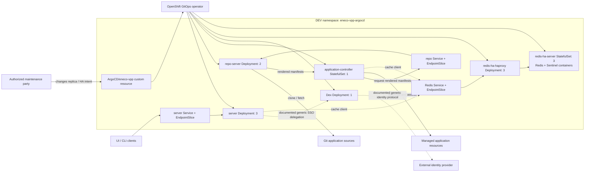
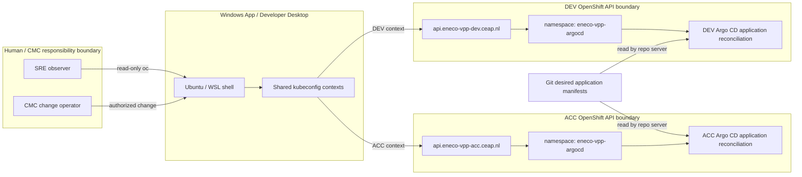
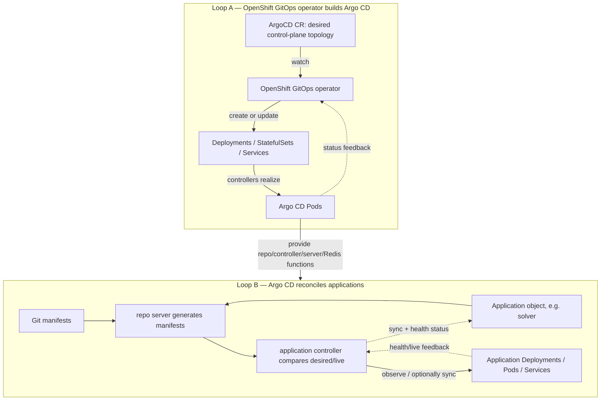
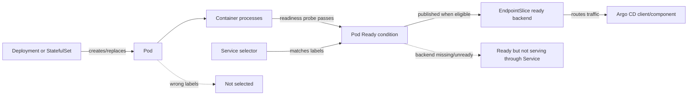
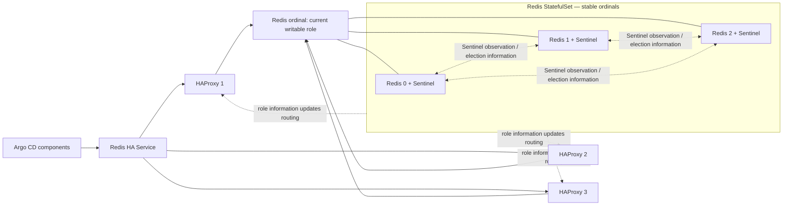

# Argo CD replica increase explained from first principles

This is the conceptual syllabus behind the DEV and Acceptance maintenance. Read the first two-minute orientation before the runbook; use the rest to understand why the runbook asks for every signal.

> **Start here.** Learn the system in this document → use [`argocd-replica-increase-acceptance-runbook.md`](argocd-replica-increase-acceptance-runbook.md) to execute Wednesday's ACC maintenance → record Wednesday evidence in [`maintenance-july-22-records-findings.md`](maintenance-july-22-records-findings.md). The DEV command proof and July 20 ledger are historical evidence and teaching references, not Wednesday's execution route.

## The first two minutes

### The maintenance in one sentence

A **maintenance** is a time-bounded, authorized change with a declared starting state, intended result, observation window, and recovery owner. In this folder, **CMC** means the authorized maintenance party. The local evidence does not provide an expansion of that acronym, so this document does not invent one.

For this maintenance, CMC changes the desired topology of the Argo CD **control plane**; success means the OpenShift GitOps operator realizes that intent, Kubernetes makes the new replicas ready and serving, Argo CD continues to reconcile applications, and the result remains stable through the declared evidence window long enough to reveal delayed failures.

It is not simply “change a number.” One number can be correct while the operator, rollout, scheduler, Service, application controller, or later stability is wrong.

### Three snapshots—never one ambiguous “current state”

| Snapshot | Captured | Topology | What it proves | Reprobe rule |
|---|---|---|---|---|
| **DEV before** | July 20, 10:12–10:17 CEST | controller `1`; server `1`; repo `1`; standalone Redis `1`; Dex `1`; HA off; no Horizontal Pod Autoscaler (HPA; resource kind `HorizontalPodAutoscaler`) | fair preparation baseline | historical; never call it current |
| **DEV observed after** | stable samples through 10:48 CEST; user closure ~10:59 | controller `1`; server `3`; repo `2`; Redis HAProxy `3`; Redis/Sentinel StatefulSet `3`; Dex `1` | live-observed stable DEV result, CMC-correlated | re-query DEV for any present-tense claim |
| **ACC preparation** | July 20, 10:52–10:54 CEST | controller/server/repo/standalone Redis/Dex each effectively `1`; HA off; no Horizontal Pod Autoscaler (HPA; resource kind `HorizontalPodAutoscaler`) | Wednesday's starting preparation snapshot | expires at Wednesday T0 |

The word “current” is banned without environment and timestamp. All three rows are true, but they describe different places or times.

### Observed DEV after-state architecture

This is the connected system that existed in DEV after the change. Counts are the observed Kubernetes topology; Redis role/quorum behavior was not directly proved.



Walk-through: the operator turns one `ArgoCD` custom resource into several Kubernetes workloads. Services and EndpointSlices publish eligible backends; the server and controller use the Redis path; the repo server renders Git content for the controller. Increasing one box changes the traffic, scheduling, cache, and failure shape around the other boxes.

Takeaway: “the replica count increased” is only the first link. The useful proof follows intent → workload revision → Ready Pod → published backend → application outcome → stability.

Misconception killed: three Redis StatefulSet pods prove that three Kubernetes instances exist; they do not, by themselves, prove leader election, Sentinel quorum, or correct failover routing.

### The two loops you must not merge

The following memory sketch separates the two desired-state domains before the detailed architecture appears:

```text
Loop A — builds Argo CD itself
ArgoCD CR -> OpenShift GitOps operator -> Argo CD Deployments/StatefulSets/Services/Pods

Loop B — Argo CD deploys applications
Git -> Application -> repo server + application controller -> application workloads/status
```

- The **`ArgoCD` CR** configures an Argo CD installation. CMC changes this side.
- An **`Application`** tells Argo CD where an application's desired manifests live in Git and what live resources to track.
- `solver` is an `Application` in loop B. It is not the server, repo server, Redis, Dex, or application controller in loop A.

Analogy: two thermostats control two different rooms. Both compare “desired” with “actual,” but they have different sensors and actuators. Calling both reconciliation does not make them one loop.

### The success ladder

The following ladder is the smallest redrawable model for proving this maintenance from identity through time:

```text
identity -> intent -> realized -> serving -> outcome -> time
  API      CR/HPA     workloads      endpoints      Applications    stability
```

The ladder answers six increasingly strong questions:

1. Am I looking at ACC or DEV?
2. What did CMC intend?
3. Did Kubernetes create the intended revision and Ready Pods?
4. Are those Pods actually published as network backends?
5. Did Argo CD's application view remain or return healthy?
6. Did the system remain stable rather than flash green once?

### Two red rules

> A terminal tab title is not environment identity. DEV and ACC can share kubeconfig state. Accept a sample only after the pinned context returns the expected API.

> `solver` is an Argo CD `Application`, not an Argo CD control-plane component. `Synced Progressing` is an application state, not a replica count and not automatically an outage.

## Knowledge contract

After studying this document, a new SRE must be able to **draw** both reconciliation loops, **classify** every observed object into the correct loop, **trace** a replica change from CR to serving backend, **predict** the resource and failure-mode changes by component, **diagnose** desired/updated/ready/EndpointSlice disagreement, **interpret** sync and health as independent axes, **explain** Redis HA without reducing it to a count, and **defend** where the evidence stops. Reject the syllabus if the reader can repeat definitions but cannot solve the unseen scenarios at the end.

## Course map

- [Part I — why Argo CD exists](#part-i--why-argo-cd-exists)
- [Part II — actors and boundaries](#part-ii--the-actors-and-boundaries)
- [Part III — the two reconciliation loops](#part-iii--the-two-reconciliation-loops-in-detail)
- [Part IV — the Argo CD components](#part-iv--what-each-argo-cd-component-does)
- [Part V — Kubernetes concepts](#part-v--kubernetes-concepts-required-for-the-maintenance)
- [Part VI — Redis HA](#part-vi--redis-ha-as-a-system-not-a-replica-number)
- [Part VII — application sync and health](#part-vii--how-to-read-application-status-during-the-maintenance)
- [Part VIII — time and stabilization](#part-viii--time-is-a-system-component)
- [Part IX — false-green failures](#part-ix--what-can-look-successful-while-wrong)
- [Part X — worked diagnosis](#part-x--a-worked-end-to-end-diagnosis)
- [Self-test](#self-test-reconstruct-do-not-memorize) and [evidence ledger](#evidence-ledger-and-go-deeper)

## Part I — why Argo CD exists

### Start with the problem: humans are bad deployment state machines

Suppose a team says, “Solver should run version X with three replicas.” There are two worlds:

- **desired state**: the versioned declaration of what should exist;
- **live state**: the Kubernetes objects and running processes that exist now.

Without a controller, someone must repeatedly compare those worlds and fix drift. GitOps moves the desired declaration into Git and assigns the comparison to software.

Argo CD is that comparison-and-reconciliation system for Kubernetes applications:

1. read the desired manifests from Git;
2. read the live objects from the Kubernetes API;
3. calculate the difference;
4. report `Synced` or `OutOfSync`;
5. when policy/operator action permits, apply the desired state;
6. keep repeating because clusters and Git change over time.

Reconciliation is not a one-time installation. It is an observe → compare → act → observe feedback loop.

### Desired does not mean healthy

Git may perfectly describe a broken workload. Therefore Argo CD exposes two independent questions:

| Axis | Question | What green proves | What green cannot prove |
|---|---|---|---|
| Sync | Does live configuration match Git-desired configuration? | no detected manifest drift | runtime health or end-user success |
| Health | Are tracked resources healthy by Argo CD's rules? | Kubernetes resource health looks acceptable | business transactions or causal attribution |

That is why `Synced Degraded` and `OutOfSync Healthy` are possible.

## Part II — the actors and boundaries

### Visual 1: environment and ownership topology

This diagram answers “who acts through which boundary, and where can identity be confused?”



Walk-through: the namespace name is identical in DEV and ACC, so output shape cannot identify the environment. Kubeconfig is shared state beneath the terminal tabs; the API is the trust boundary. CMC changes objects through authenticated access; the SRE uses the same API read-only to observe.

Takeaway: bind commands to a verified context. A tab name, prompt color, namespace, or healthy output is not identity proof.

Misconception killed: “I am in the ACC tab, therefore these are ACC facts.”

### Control plane versus managed applications

The **Argo CD control plane** is the set of components that provide GitOps. The **managed applications** are the workloads Argo CD observes or deploys. `solver` belongs to the latter.

| Exact object/kind | Desired source | Reconciler | Children/output | Status surface |
|---|---|---|---|---|
| `ArgoCD/eneco-vpp` | CR fields changed by authorized operator/automation | OpenShift GitOps operator | Argo CD Deployments, StatefulSets, Services, Pods | CR phase/conditions + managed workloads |
| `Application/solver` | Git repository/revision/path plus Application spec | Argo CD application controller, using repo server | Solver's Kubernetes resources | sync status, health status, reconciled time |

## Part III — the two reconciliation loops in detail

### Visual 2: two loops over time

This diagram answers “who watches what, and what does each controller write?”



Walk-through: CMC changes loop A. The operator does not deploy Solver from Git; it builds Argo CD. Once Argo CD is functioning, its repo server and application controller operate loop B. A disruption in loop A can delay loop B, but stored Application status may remain green until fresh reconciliation occurs.

Takeaway: a Ready application-controller Pod proves a process passed readiness; it does not prove that the replacement controller completed a fresh application reconciliation.

Misconception killed: “The GitOps operator and Argo CD application controller are the same controller.”

## Part IV — what each Argo CD component does

### Argo CD server

The server exposes the API used by the user interface (UI), command-line interface (CLI), and automation. It handles application management/status, authentication delegation, role-based access control (RBAC), and operations. It is largely stateless.

Why `1→3` matters: multiple server replicas reduce dependence on one server Pod and distribute API/UI handling. What to prove: new revision, three available Pods, three ready service backends, stable restarts/resources, and no application-level sustained regression.

### Repo server

The repo server clones/caches Git repositories and generates Kubernetes manifests using Helm, Kustomize, plugins, or plain YAML.

Why `1→2` matters: a second repo server adds redundancy and manifest-generation capacity, but it also adds Git/cache/process memory/CPU load. What to prove: both new-revision Pods Ready, Service backends present, no out-of-memory (OOM), thread, or manifest-generation symptoms, and controller/application freshness not stalled.

### Application controller

The application controller repeatedly compares Git-desired and live state, calculates sync/health, and may initiate permitted sync actions.

DEV kept one replica but recreated/moved the Pod. Its CPU rose from `24m` to `733m`, then recovered to `109m`. The recreation and CPU spike coincided with reconciliation work, so maintenance-related reconciliation is a plausible hypothesis; the observations do not eliminate an independent application reconciliation as the CPU consumer.

What to prove after recreation: Pod identity/revision/readiness, absence of rising restarts/events, and a post-recreation reconciliation freshness signal when observable. Cached green Applications alone are insufficient.

### Redis

Argo CD uses Redis as a cache for application/controller data; the durable cluster state remains in Kubernetes objects stored by the Kubernetes API in **etcd**, the cluster's strongly consistent key-value database. A standalone Redis Pod is one cache endpoint. Redis HA adds components that tolerate a member failure and route clients to the appropriate Redis role.

DEV did not merely change Redis from one to three. It replaced one Deployment with:

- three HAProxy Pods;
- a three-ordinal Redis StatefulSet;
- two containers per Redis Pod, observed as Redis + Sentinel;
- Services/EndpointSlices tying clients to the new topology.

### Dex

Dex integrates identity providers for single sign-on (SSO). DEV and ACC observed one Dex replica. Argo CD's upstream HA guidance warns that multiple Dex instances can have inconsistent in-memory data, so “increase every component” is not a safe universal rule.

### The OpenShift GitOps operator

The operator is outside the Argo CD instance it manages. It watches the `ArgoCD` CR, applies platform defaults, and creates or updates the component workloads. `status.phase: Available` is its broad health summary, not proof that every replica/revision/backend/application gate has passed.

## Part V — Kubernetes concepts required for the maintenance

### CR and CRD

A **CustomResourceDefinition** teaches Kubernetes a new object type. An **`ArgoCD` custom resource** is one instance of that type. The operator understands it.

An absent replica field is not zero. It means no explicit override is stored at that path. The effective value is revealed by the operator-created workload's `spec.replicas` and status.

### Deployment versus StatefulSet

| Property | Deployment | StatefulSet | This maintenance |
|---|---|---|---|
| Pod identity | interchangeable; replacement name/unique identifier (UID) may change | stable ordinal identity such as `-0`, `-1`, `-2` | server/repo/HAProxy/Dex use Deployment; controller and Redis HA use StatefulSet |
| Update proof | updated/ready/available and ReplicaSet template revision | updated/ready plus currentRevision=updateRevision and ordinals | prevents old Ready Pods masking the intended revision |
| Typical mental model | any free seat | numbered assigned seats | identity explains behavior, not HA by itself |

Observed workload kind is a fact. The generic reason StatefulSet exists—stable identity/order—is documented Kubernetes behavior. The exact historical design decision for each Eneco component is not proven by the observation alone.

### Pod, container, and restart identity

A Pod is the scheduled unit. It can contain multiple containers: the DEV Redis HA Pods showed `2/2` because Redis and Sentinel ran together.

`restartCount` belongs to a container within the current Pod UID. If a failed Deployment Pod is replaced, the new Pod can show zero. If a StatefulSet Pod is recreated with the same name but a new UID, its counter also resets. Therefore the evidence key is `(Pod UID, container name)`, not role name.

### Ready, available, updated, and observed generation

These fields answer different transition questions:

| Field | Question |
|---|---|
| desired / `spec.replicas` | how many does the controller want? |
| current / replicas | how many Pods exist? |
| updated | how many belong to the intended template revision? |
| ready | how many currently pass readiness? |
| available | how many satisfy availability rules long enough to serve? |
| generation vs observedGeneration | has the controller processed the latest desired object version? |
| currentRevision vs updateRevision | has a StatefulSet converged to the intended revision? |

Example: desired `3`, current `3`, ready `3`, updated `1` is not complete. Two old Ready Pods can hide a blocked new revision.

### Visual 3: from workload to serving traffic

This diagram answers “why are Running/Ready Pods not enough?”



Walk-through: the workload creates Pods; containers start; readiness gates whether Kubernetes considers them ready; a Service selector chooses matching labels; EndpointSlice publishes actual backend addresses/conditions. Traffic reaches only the published path.

Takeaway: compare ready Pod UIDs with EndpointSlice target UIDs/conditions and ports. Service existence proves the front door exists, not that every intended backend is behind it.

Misconception killed: “Three Ready server Pods means traffic can reach all three.”

### Node, scheduler, eligibility, request, limit, and measured use

The scheduler chooses a Node for each new Pod. It considers resource **requests** plus constraints such as selectors, affinity/anti-affinity, taints/tolerations, and topology rules.

- **Request**: capacity used for scheduler fit and resource weighting/reservation.
- **Limit**: runtime ceiling; CPU may be throttled, memory excess can lead to out-of-memory (OOM) termination.
- **Measured use**: a sampled observation from Metrics API/`oc adm top`.
- **Allocatable**: node capacity available to Pods after system reservations.
- **Eligible node**: a node satisfying the Pod's placement constraints.
- **Actual node**: where the scheduler placed this particular Pod.

Low measured CPU does not prove a `4Gi` request fits. The scheduler can reject a Pod on a quiet-looking Node because scheduled requests already consume allocatable capacity or because the Node is ineligible.

### Resource delta arithmetic using DEV evidence

For a simple fixed-replica component:

```text
reservation delta = added replicas × per-Pod request
limit delta       = added replicas × per-Pod limit
measured delta    = fresh after-use minus T0 use; never request × replicas
```

Known DEV examples:

- server `1→3`, request `125m/128Mi`: two added replicas reserve `+250m CPU` and `+256Mi`; configured limits add `+1 CPU` and `+512Mi`;
- repo `1→2`, request `250m/256Mi`: one added replica reserves `+250m CPU` and `+256Mi`; configured limits add `+1 CPU` and `+1Gi`;
- known minimum before considering Redis HA: `+500m CPU` request and `+512Mi` memory request.

Do not calculate Redis HA by multiplying the old standalone Redis request. HAProxy and Sentinel add containers with their own effective Pod resources. The full Redis delta requires the actual generated Pod specs for HAProxy and Redis/Sentinel.

## Part VI — Redis HA as a system, not a replica number

### Visual 4: the generic role topology and the observed DEV shape

This diagram answers “which layer detects, elects, and routes?”



Walk-through: Redis members hold cache data/roles; Sentinel processes observe members and coordinate failover information; HAProxy gives clients stable routing; Services and EndpointSlices publish the reachable instances. Kubernetes readiness sees processes, not necessarily data-plane quorum.

Takeaway: the observed six-Pod shape proves topology creation. Functional Redis/Sentinel quorum and exact live role routing require separate read-only evidence; if unavailable, say `REDIS DATA-PLANE QUORUM UNVERIFIED`.

Misconception killed: “Redis changed from one Pod to three Pods, so HA is proven.”

## Part VII — how to read application status during the maintenance

### The sync/health matrix

| State | Valid example | Maintenance interpretation |
|---|---|---|
| `Synced Healthy` | manifests match Git and tracked resources are healthy | good outcome proxy; may still be cached and is not an end-user test |
| `Synced Progressing` | manifests match while a Deployment rolls out | continue; measure duration/freshness/resources; not contradictory |
| `Synced Degraded` | broken runtime matches Git-desired config | strong health failure; sync does not rescue it |
| `OutOfSync Healthy` | live resource works but differs from Git | drift, not automatically outage; compare with T0 |
| `OutOfSync Progressing/Degraded` | drift plus runtime transition/failure | investigate both axes |
| `Unknown` | Argo CD cannot establish an axis | evidence gap; do not render it green |

DEV's `solver` sequence was:

```text
10:17  Synced + Healthy
10:37  Synced + Progressing
10:40  Synced + Healthy
10:44  Synced + Healthy
10:48  Synced + Healthy
```

What this proves: Git/live desired alignment stayed `Synced`; health was temporarily in progress and recovered within about three minutes.

What it does not prove: which Solver resource moved, CMC causation, an outage, fresh controller reconciliation, or end-user transactions. With no application drill-down performed, the correct record is “transient and maintenance-correlated; recovered,” not “CMC broke Solver.”

### Worked July 20 example: green pipeline, Synced, and still broken

After the maintenance, `espmessageproducer-eneco-vpp` and `marketinteraction-eneco-vpp` became `Synced Degraded`. That combination is not contradictory:

```text
release variable missing
  -> pipeline shell substituted an empty value
  -> pipeline still committed image.tag: ""
  -> Helm defaulted the empty tag to chart appVersion: latest
  -> Argo CD correctly synchronized that desired Deployment
  -> ACR had no latest manifest
  -> new Pods entered ImagePullBackOff
  -> Application was Synced because live matched desired
  -> Application was Degraded because the desired Pods could not start
```

The old `0.158.0` ReplicaSets stayed Ready, so this was a failed rollout rather than proof that the existing service had stopped. The Argo CD control plane also remained healthy at its new shape: server `3/3`, repo server `2/2`, Redis HAProxy `3/3`, Redis/Sentinel `3/3`, controller `1/1`, and Dex `1/1`, with all twelve Pods Running and zero restarts.

The evidenced cause of this failed rollout was the upstream fail-open configuration generator. No observed mechanism connected it to the replica increase, and the Argo CD control plane remained healthy throughout the capture. The useful mental rule is: **a green pipeline proves only that the CI engine accepted the configured jobs' final result; it does not prove every nested shell action succeeded or that generated configuration is valid. `Synced` proves that live state matches desired state; it does not prove that desired state references a real, runnable artifact.** Runtime health and image-pull events are the separate proof layer.

For Wednesday, this produces one concrete guard: inspect any pre-existing ACC application degradation before CMC starts, especially `marketinteraction-eneco-vpp`. If it already references `latest` or has `ImagePullBackOff`, record it at T0 and keep it outside the replica-maintenance attribution chain.

## Part VIII — time is a system component

### Five different clocks

1. **Preparation time**: learn the topology and prove access; may be stale by maintenance.
2. **T0**: last fair snapshot immediately before the change.
3. **Convergence time**: operator/workload/scheduler/Service catching up.
4. **Recovery time**: a transient signal returning to healthy/baseline.
5. **Stabilization time**: continued observation after apparent success so slow failures get a chance to appear.

### Visual 5: stabilization state machine

This diagram answers “when may I close?”

```mermaid
stateDiagram-v2
    [*] --> Preparation
    Preparation --> T0: start signal and fresh identity
    T0 --> IntentDetected: authorized change appears
    IntentDetected --> Converging
    Converging --> FailedEvidence: generation lag / Pending / restart / warning
    Converging --> Serving: new revision Ready and backends published
    Serving --> FailedEvidence: EndpointSlice gap
    Serving --> OutcomeChecked
    OutcomeChecked --> FailedEvidence: Degraded / stale reconciliation
    OutcomeChecked --> Stabilizing
    Stabilizing --> FailedEvidence: late restart / resource or app regression
    FailedEvidence --> Converging: recovered; finding preserved
    Stabilizing --> StableObserved: evidence floor + late checkpoint pass
    StableObserved --> CompleteIntended: authoritative intent also matches
```



Walk-through: failure can branch after first readiness, after serving, after application outcome, or during stabilization. Recovery returns to observation but does not delete the finding. Final intent confirmation is separate from technical stability.

Takeaway: one green snapshot is a transition, not a terminal state.

Misconception killed: “Everything was green at 10:35, so the watch could close.” DEV's controller CPU peak and `solver` progression occurred after the first replica convergence.

## Part IX — what can look successful while wrong

| False green | Why it fools people | Discriminating evidence |
|---|---|---|
| right commands, wrong cluster | names/topology exist in both environments | pinned API/context + namespace/CR UID per sample |
| CR says target count | intent only | observed generation + revision-aware workload state |
| `3/3 Ready` | old revision can remain Ready | updated replicas / ReplicaSet or ControllerRevision equality |
| replacement Pod has zero restarts | restart identity reset | append-only Pod UID/container history |
| server Service exists | front door without all backends | EndpointSlice targetRef/ready/ports across samples |
| HAProxy `3/3` | Redis/Sentinel may be partial | full Redis topology matrix; quorum explicitly bounded |
| node CPU is low | scheduler uses requests/eligibility | per-actual-node allocatable/request fit + events/constraints |
| two `top` commands are low | same stale metrics can repeat | advancing timestamps/windows and complete new-Pod coverage |
| visible Applications green | failure may be outside sample | total fleet count/distribution + exceptions |
| controller Ready, Apps still green | stored status can be stale | post-recreation `reconciledAt`/freshness signal |
| no events returned | transient/expired evidence may be gone | append intermediate events; independent conditions/restarts |
| five green minutes | slower failure can appear later | evidence floor + late checkpoint/handoff |

## Part X — a worked end-to-end diagnosis

Scenario:

```text
ACC identity is correct.
CMC intent says server 1→3 and Redis HA enabled.
Server Deployment: desired 3, current 3, updated 1, ready 3, available 3.
HAProxy: 3/3 Ready.
Redis StatefulSet: desired 3, ready 2, currentRevision != updateRevision.
One Redis Pod is Pending with FailedScheduling.
Two server EndpointSlice backends exist.
solver: Synced Progressing.
Node CPU: 18%.
```

Diagnosis from the ladder:

1. **Identity** passes.
2. **Intent** is known.
3. **Realized** fails twice: server new revision is incomplete; Redis is `2/3` and revision-divergent.
4. **Serving** fails: only two server backends exist for three intended replicas.
5. **Outcome** is not yet stable: Solver is still progressing, but that row alone is not the primary failure.
6. **Capacity** is not safe merely because CPU is 18%; `FailedScheduling` requires request/allocatable/eligibility evidence.
7. **Decision**: `CHALLENGE CMC`; `ESCALATE` if the scheduling/health impact persists or worsens. Continue read-only observation; do not declare Redis HA or server completion.

The next probes are workload/ReplicaSet or ControllerRevision ownership and events/Pod describe, followed by Service selector/EndpointSlice target membership and per-node request fit.

## Self-test: reconstruct, do not memorize

Answer before opening the key.

1. A Git commit changes Solver to three replicas while CMC changes `ArgoCD` server replicas to three. Which loop/controller handles each?
2. Sort `solver`, server, repo server, Redis, Dex, and application controller into managed application or Argo CD control plane.
3. The `ArgoCD` CR says server `3`; the Deployment still desires `1`. Who is behind and what must not be called success?
4. Why can HAProxy Pods be interchangeable while Redis ordinals need stable identity?
5. Three server Pods are Ready but only two EndpointSlice backends are ready. Is the server replica increase serving?
6. One Redis process disappears. Which generic layer detects/elects, which stores cache data, and which gives clients a stable route? What remains locally unverified?
7. Node CPU is 20%; a `4Gi`-request Pod is Pending. Which resource concepts explain this?
8. Give valid meanings for `Synced Progressing`, `OutOfSync Healthy`, and `Synced Degraded`.
9. Desired/current/updated/ready/available are `3/3/1/3/3`. What failed?
10. Everything is green throughout the declared observation window and a Pod restarts immediately afterward. What did the window prove?
11. A DEV-labelled tab returns ACC API and healthy objects. Which evidence is rejected and why?
12. The application controller was recreated, but all `Application` rows retain old `reconciledAt` values. What can Ready + green rows not prove?

<details>
<summary>Answer key</summary>

1. The Argo CD application controller handles the `Application`/Git change using repo-generated manifests; the OpenShift GitOps operator handles the `ArgoCD` CR/control-plane change.
2. `solver` is a managed `Application`; server, repo, Redis, Dex, and application controller are control-plane components.
3. The operator loop has not realized the CR intent; inspect operator/CR and Deployment conditions/events. Intent is not success.
4. Deployment Pods can be replaced as interchangeable instances; StatefulSet ordinals provide stable identities/order. Stable identity does not alone prove HA or quorum.
5. No. Ready runtime instances are not all published as Service backends; inspect selector and EndpointSlice target UIDs/conditions/ports.
6. Redis holds cache data/roles; Sentinel observes and coordinates failover; HAProxy provides stable client routing. The exact installed quorum/current role/routing remains unverified without read-only data-plane evidence.
7. Measured use is low, but scheduling uses requests, eligible-node allocatable, and placement constraints. `FailedScheduling` is already hard evidence of a fit/eligibility problem.
8. Synced/Progressing: config matches while rollout converges. OutOfSync/Healthy: live workload healthy but drifted from Git. Synced/Degraded: desired config applied but runtime health bad.
9. Only one Pod belongs to the intended revision; old Ready/available Pods mask incomplete rollout.
10. It proved only that observed interval, not durable stabilization. Preserve the late regression and continue/escalate or hand off explicitly.
11. Reject the entire sample because API identity overrules the tab label; shared kubeconfig caused the context mismatch.
12. It cannot prove the replacement controller completed a fresh reconciliation. Use a freshness signal or `CANNOT VERIFY RECONCILIATION`.

</details>

## Evidence ledger and go deeper

### Local evidence

- `maintenance-july-20-records-findings.md`: DEV before/after chronology, Redis topology, controller resource transient, `solver` progression/recovery, and proof ceiling.
- `maintenance-july-22-records-findings.md`: ACC July 20 preparation topology, restart/resource/node/application baseline, and Wednesday ledger.
- `argocd-openshift-command-probes.md`: command proof and DEV execution semantics.
- `argocd-replica-increase-acceptance-runbook.md`: Wednesday cockpit and decision procedure.

### Primary mechanism sources

- [Argo CD architectural overview](https://argo-cd.readthedocs.io/en/stable/operator-manual/architecture/): server, repo server, and application-controller responsibilities.
- [Argo CD high availability](https://argo-cd.readthedocs.io/en/stable/operator-manual/high_availability/): largely stateless architecture, Redis HA shape, server scaling, and Dex/Redis cautions.
- [Argo CD resource health](https://argo-cd.readthedocs.io/en/stable/operator-manual/health/): health assessment semantics.
- [Red Hat OpenShift GitOps Argo CD CR properties](https://docs.redhat.com/en/documentation/red_hat_openshift_gitops/1.20/html/argo_cd_instance/argo-cd-cr-component-properties): operator CR fields/default surfaces.
- [Kubernetes Deployments](https://kubernetes.io/docs/concepts/workloads/controllers/deployment/) and [StatefulSets](https://kubernetes.io/docs/concepts/workloads/controllers/statefulset/): workload identity and rollout semantics.
- [Kubernetes resource management](https://kubernetes.io/docs/concepts/configuration/manage-resources-containers/): requests, limits, scheduler fit, and runtime enforcement.
- [Kubernetes Services and EndpointSlices](https://kubernetes.io/docs/concepts/services-networking/service/): stable Service abstraction and current backend representation.

Primary docs explain generic mechanisms; live cluster output proves Eneco's installed state at a capture time. Neither proves CMC actor intent or end-user behavior by itself.

### Epistemic debt

- **Observed facts:** the three snapshot cards, DEV transitions, ACC July 20 baseline, and shared-kubeconfig failure.
- **Generic documented mechanisms:** component roles, workload semantics, scheduler request behavior, Services/EndpointSlices, and upstream HA guidance.
- **Inferences:** the controller CPU spike was likely reconciliation load; timing supports but does not prove that cause.
- **Unverified until Wednesday/live drill-down:** CMC ACC intent, ACC T0/post-state, full Redis/Sentinel quorum/routing, metrics freshness, per-eligible-node schedulable headroom, post-recreation controller freshness, and late stability.

Visual coverage: observed DEV after-state topology → Mermaid flowchart; environment ownership and trust boundaries → Mermaid flowchart; two reconciliation feedback loops → Mermaid flowchart; Ready Pod to serving backend path → Mermaid flowchart; Redis, Sentinel, and HAProxy roles → Mermaid flowchart; failure, recovery, and closure over time → Mermaid state machine; redrawable operational proof order → ASCII ladder.

Angles excluded: end-user transaction topology — no business transaction probe or application dependency map was supplied, so Argo CD health is bounded as a control-plane outcome proxy; vendor implementation source code — the maintenance decisions depend on observed OpenShift objects and documented Argo CD mechanisms rather than an unverified internal call graph.
