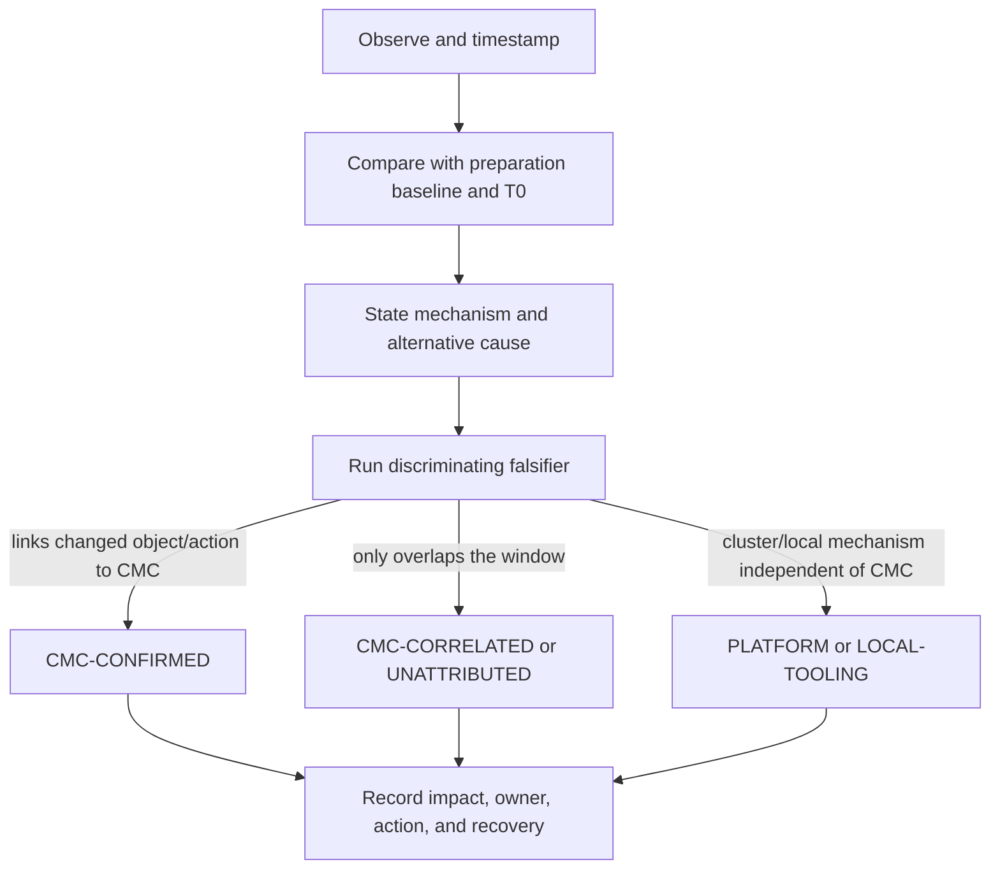

# CMC Argo CD replica maintenance — July 20 evidence and findings

> **Folder route.** Start with [`argocd_replica_increase_explained.md`](argocd_replica_increase_explained.md) → execute Wednesday with [`argocd-replica-increase-acceptance-runbook.md`](argocd-replica-increase-acceptance-runbook.md) → record ACC evidence in [`maintenance-july-22-records-findings.md`](maintenance-july-22-records-findings.md). This file is the closed DEV evidence ledger; do not append ACC observations here.

This is an append-only operational record. Record an observation before its interpretation. Do not label CMC negligent from timing alone.

How to read the operational shorthand:

- **Preparation baseline**: an early verified snapshot used to prepare and teach.
- **T0**: a separate fresh snapshot immediately before CMC acts; it prevents older drift from being blamed on maintenance.
- **Capture ID**: the name of one timestamped evidence bundle, such as `PREP-20260720-1012`.
- **Probe ID**: the command family in `argocd-openshift-command-probes.md` that produced the signal.
- **First/last observed**: the evidence window; this tells a later reviewer whether a condition preceded, overlapped, or followed CMC's action.
- **Attribution**: who or what the evidence supports as the cause. It is a conclusion earned after alternatives are tested, not a synonym for “happened during maintenance.”

## Knowledge contract

After using this record, a new SRE must be able to **trace** a signal to its exact time and probe, **compare** it with T0, **explain** the mechanism without confusing correlation with cause, **diagnose** the next evidence gap, and **defend** an attribution or refusal to attribute. Reject a finding that cannot survive those actions.

Attribution states:

- `CMC-CONFIRMED`: the changed object/action is tied to CMC evidence.
- `CMC-CORRELATED`: observed during CMC's window but causation is not proven.
- `PLATFORM`: OpenShift/cluster mechanism is evidenced independently.
- `LOCAL-TOOLING`: AVD, keyboard, CLI, or Lens issue; not a cluster finding.
- `UNATTRIBUTED`: cause/actor is not yet known.

## First principles: observation is not attribution

The evidence path is deliberately one-way. A time-correlated observation cannot jump directly to blame.

```text
timestamped observation -> baseline delta -> mechanism hypothesis -> falsifier -> impact -> attribution -> action
        fact                  fact             inference           test       fact/infer    bounded       decision
```

The strip keeps evidence states visible. The flowchart below shows how a finding earns—or fails to earn—CMC attribution.



Read downward: the falsifier is the gate. If it cannot distinguish CMC action from a pre-existing, platform, or local cause, the stronger attribution is not allowed.

## Change-intent contract

| Field | Value |
|---|---|
| Cluster | DEV — `https://api.eneco-vpp-dev.ceap.nl:6443` |
| Argo CD instance | `eneco-vpp-argocd/ArgoCD/eneco-vpp` |
| CMC component(s) to scale | Not supplied in advance. Live-observed changes: server, repo server, and Redis topology. Controller was recreated but remains one replica. |
| Intended old→new count | Not supplied in advance. Live-observed: server `1→3`; repo server `1→2`; standalone Redis `1` replaced by three HAProxy pods plus three Redis StatefulSet pods. |
| CMC start/end window | scheduled start 10:30 CEST; new workload ages imply activity began around 10:30. The user declared the maintenance over at approximately 10:59 CEST; exact CMC action timestamps remain unverified. |
| User start signal/time | **Received at live sample `2026-07-20T10:34:48+02:00`; repeated monitoring opened.** |
| User completion signal/time | **Received at approximately `2026-07-20T10:59+02:00`; DEV watch closed.** |
| Contractual CPU/memory threshold | **NOT SUPPLIED** |
| Contractual observation duration | **NOT SUPPLIED**; final verdict is bounded to the observed samples plus the user's completion signal |

The live deltas remain `CMC-CORRELATED` because they match the scheduled window, but actor/change-intent evidence has not promoted them to `CMC-CONFIRMED`. Stabilization and the user's completion signal permit an operational closure verdict; they do not prove who changed each object.

## Preparation baseline: PREP-20260720-1012

Captured live in Windows App → Ubuntu/WSL between `10:12:57` and `10:17:26 CEST`.

| Surface | Observation |
|---|---|
| CR configuration | `ha=false`; server autoscale `false`; no namespace HPA; CR phase `Available`. |
| Deployments | Dex, Redis, repo server, and server each `1/1 Ready`, `1` up-to-date, `1` available. |
| StatefulSet | application controller `1/1 Ready`. |
| Pods | five `1/1 Running`, zero restarts. |
| Host node A | `...westeurope2-vp8fs`: controller + repo; CPU `25%`, memory `62%`. |
| Host node B | `...westeurope3-jpw2d`: server + Redis + Dex; CPU `12%`, memory `50%`. |
| Pod use | controller `24m/1543Mi`; Dex `2m/171Mi`; Redis `2m/26Mi`; repo `1m/139Mi`; server `10m/100Mi`. |
| Node readiness | all nodes `Ready`. |
| Namespace events | no resources returned at capture time. |
| Applications | visible table was predominantly `Synced Healthy`; `opstools-eneco-vpp-agg` and `platform` were already `OutOfSync Healthy`. Preserve these as pre-existing exceptions. |

## Chronological event ledger

| First observed (CEST) | Last observed | Capture/probe | Observation | Attribution | Decision/status |
|---|---|---|---|---|---|
| 09:19 | 09:19 | identity guard | Authenticated session showed DEV API. Token visible in the user's source screenshot was neither transcribed nor stored in these files. | LOCAL-TOOLING | Safe boundary established. |
| 09:45 | 09:50 | discovery | Three Argo CD instances exist; VPP target isolated to `eneco-vpp-argocd/eneco-vpp`. | PLATFORM | Direct target probes selected. |
| 10:12:57 | 10:12:58 | P04 | Four Deployments and one StatefulSet each at one ready replica; no HPA. | UNATTRIBUTED baseline | Preparation baseline captured. |
| 10:13:42 | 10:13:44 | P05/P06 | Five pods Running, zero restarts; live per-container CPU/memory available. | UNATTRIBUTED baseline | Metrics capability proven. |
| 10:14:31 | 10:14:32 | P07 | Hosting nodes at 25%/62% and 12%/50%; all nodes Ready. | PLATFORM baseline | KIV baseline captured. |
| 10:15 | 10:16 | node describe attempt | Node-name transcription/AVD input attempt failed locally; no cluster state changed. | LOCAL-TOOLING | Not a CMC finding; do not use as node-reservation evidence. |
| 10:16:57 | 10:16:57 | P08 | Namespace event list empty at capture time. | UNATTRIBUTED baseline | No active event evidence. |
| 10:17:26 | 10:17:26 | P09 | Visible application table includes two pre-existing `OutOfSync Healthy` entries. | UNATTRIBUTED baseline | Do not attribute them to maintenance. |
| 10:34:48 | 10:34:53 | LIVE-01 / P04-P05 | DEV identity rechecked. Server became `3/3`, repo server `2/2`, Redis became three HAProxy pods plus a `3/3` Redis StatefulSet; controller and Dex remained `1/1`. All observed pods Ready/Running, zero restarts. | CMC-CORRELATED | Continue; Kubernetes replica layer currently converged. |
| 10:34:48 | 10:34:53 | LIVE-01 / P05 | Controller pod was recreated/moved: preparation age `6d19h` on `...westeurope2-vp8fs`; live age about `4m27s` on `...westeurope3-jpw2d`. Replica count remained one. | CMC-CORRELATED | Record topology replacement; watch controller effectiveness and CPU. |
| 10:35:45 | 10:35:48 | LIVE-02 / P06-P08 | Controller CPU `468m` versus `24m` preparation; memory `1072Mi` versus `1543Mi`; no namespace events. | CMC-CORRELATED | Material change from baseline; repeat to determine transient versus sustained. |
| 10:35:47 | 10:35:48 | LIVE-02 / P07 | Worker `...westeurope1-kdq5b` CPU `56%` versus `35%` baseline (`+21pp`); `...westeurope3-jpw2d` `28%` versus `12%` (`+16pp`). | CMC-CORRELATED | Record the deltas and repeat; no contractual delta threshold was supplied. |
| 10:36:45 | 10:36:47 | LIVE-03 / P10 | Server exposes three serving/metrics endpoints; repo and Redis HA endpoints are present. CLI warned legacy Endpoints is deprecated on Kubernetes 1.33. | PLATFORM plus LOCAL-TOOLING warning | Service membership present; use EndpointSlice in a future runbook revision. |
| 10:37:15 | 10:37:15 | LIVE-04 / P09 | Visible application table changed `solver` from preparation `Synced Healthy` to `Synced Progressing`. Pre-existing `opstools-eneco-vpp-agg` and `platform` remained `OutOfSync Healthy`. | CMC-CORRELATED | Application outcome not yet stable; repeat and do not close maintenance. |
| 10:38:46 | 10:38:47 | LIVE-05 / P04-P05 | Replica topology unchanged from LIVE-01; all twelve observed pods remained Ready/Running with zero restarts. | CMC-CORRELATED | Replica/pod layer stable for four minutes; continue resource/outcome watch. |
| 10:39:22 | 10:39:23 | LIVE-06 / P06-P08 | Controller CPU increased again `468m→733m`; memory `1237Mi`; `...westeurope3-jpw2d` CPU reached `40%` (`+28pp` from preparation). No namespace events. | CMC-CORRELATED | Rising but below the controller's 2-CPU limit; continue and repeat. |
| 10:40:15 | 10:40:15 | LIVE-07 / P09 | `solver` returned from `Synced Progressing` to `Synced Healthy`; visible pre-existing exceptions unchanged. | CMC-CORRELATED transient | Application symptom recovered; keep stability window open because controller CPU is still rising. |
| 10:41:16 | 10:41:18 | LIVE-08 / P06-P08 | Controller CPU fell `733m→326m`, memory `830Mi`; `...westeurope3-jpw2d` CPU fell `40%→26%`. Unused-by-Argo worker `...westeurope2-knfwk` rose to `77%`; no namespace events. | Mixed: CMC-CORRELATED controller; UNATTRIBUTED node spike | Controller spike is receding. Do not attribute `knfwk` spike to Argo CD without pod placement evidence. |
| 10:42:10 | 10:42:11 | LIVE-09 / P04-P05 | Scaled topology unchanged; all twelve observed pods Ready/Running with zero restarts at about eleven minutes age. | CMC-CORRELATED | Replica/pod layer continues stable. |
| 10:43:18 | 10:43:20 | LIVE-10 / P06-P08 | Controller CPU `499m`; `...westeurope2-knfwk` fell `77%→41%`; all app-worker CPU values `16–41%`; no namespace events. | Mixed | Non-Argo node spike recovered; controller active but bounded. Continue. |
| 10:44:13 | 10:44:13 | LIVE-11 / P09 | `solver` remained `Synced Healthy`; visible pre-existing OutOfSync rows unchanged. | CMC-CORRELATED stability | Application symptom remains recovered. |
| 10:46:11 | 10:46:12 | LIVE-12 / P06-P08 | Controller CPU fell to `109m` (`24m` baseline; peak `733m`), memory `1247Mi`; maximum app-worker CPU `51%`; no namespace events. | CMC-CORRELATED recovery | Controller/resource spike recovered below request; resource layer stable in this sample. |
| 10:47:39 | 10:47:41 | LIVE-13 / P04-P05 | Scaled topology unchanged at about seventeen minutes age; all twelve observed pods Ready/Running, zero restarts. | CMC-CORRELATED stability | Replica/pod layer satisfies observation window. |
| 10:48:22 | 10:48:22 | LIVE-14 / P09 | `solver` remained `Synced Healthy`; visible pre-existing exception set unchanged. | CMC-CORRELATED stability | Later application sample remained healthy; duration acceptance came from the user completion signal, not a local timer. |
| ~10:57 | ~10:57 | environment recheck | A DEV-labelled terminal tab returned ACC topology after an ACC login changed shared kubeconfig state. The sample was rejected and none of its values were accepted as DEV evidence. | LOCAL-TOOLING | Tab names are not cluster identity; verify the API immediately before every environment block. |
| ~10:59 | ~10:59 | user completion signal | User stated the maintenance is over and redirected work to documentation and ACC readiness. | External completion signal | Close DEV watch; preserve the final technical evidence ceiling below. |

## Preparation findings

### F-001 — DEV preparation topology at 10:12–10:17 CEST was single-replica and not HPA-controlled

- Observation: four Deployments plus one controller StatefulSet are each `1/1`; no HPA exists.
- Mechanism: the effective state is the managed workloads; absent CR replica fields are defaults, not zero.
- Impact: a replica change should appear first in the selected CR/workload desired state, then converge through ready/available pods.
- Falsifier: fresh T0 shows a different count or a new HPA.
- Attribution: `UNATTRIBUTED` baseline.
- Status: superseded by LIVE-01 and the final LIVE-13 topology. The baseline remains historical evidence; no T0 action is still open.

### F-002 — Application controller has the largest per-replica memory reservation

- Observation: controller request is `4Gi` memory; measured use was `1543Mi`. Other components request `128–256Mi`.
- Mechanism: scaling the controller reserves much more schedulable memory than scaling server/repo/Redis/Dex.
- Impact: target component must be confirmed before estimating capacity or judging node headroom.
- Falsifier: CMC targets another component or live template/resources change.
- Attribution: `UNATTRIBUTED` baseline.
- Status: closed by live evidence. The application controller remained one replica; the observed changes were server `1→3`, repo server `1→2`, and standalone Redis → HAProxy `3` plus Redis/Sentinel `3`. The `4Gi` controller reservation remained relevant to node context but was not multiplied by this change.

### F-003 — DEV preparation node memory at 10:13–10:17 CEST was 62% and 50%, with candidate workers ranging 34–66%

- Observation: live node metrics at 10:14 CEST.
- Mechanism: actual use and scheduler reservation differ; a new pod can land on another app worker.
- Impact: follow actual new placement and compare T0 delta; do not extrapolate cluster averages.
- Falsifier: fresh T0/placement differs.
- Attribution: `PLATFORM` baseline.
- Status: closed for the observed maintenance interval. New Pods were followed to their actual nodes; sampled node/application-worker use changed but no unresolved scheduling or node-pressure failure was returned. These are observations, not a locally invented capacity threshold.

### F-004 — Two visible application exceptions predate maintenance

- Observation: `opstools-eneco-vpp-agg` and `platform` were `OutOfSync Healthy` at 10:17 CEST.
- Mechanism: OutOfSync does not automatically mean unhealthy, and pre-existing drift cannot be blamed on the replica change.
- Impact: only new/worsened exceptions can be considered maintenance-correlated.
- Falsifier: complete T0 exception capture shows the state changed before CMC action.
- Attribution: `UNATTRIBUTED` baseline.
- Status: closed for the observed maintenance interval. The same pre-existing `OutOfSync Healthy` exceptions remained unchanged through the later LIVE-14 application sample; they were not promoted to maintenance-caused findings.

### F-005 — Installed `oc` client is substantially older than the server

- Observation: client `4.8.11`; OpenShift server `4.20.16`; Kubernetes `1.33.8`.
- Mechanism: newer resources/output can behave differently with an old client.
- Impact: every documented core command was executed in the actual WSL client; unexecuted variants remain unproven.
- Falsifier: a server-compatible client comparison shows no relevant difference; not performed.
- Attribution: `LOCAL-TOOLING`.
- Status: risk bounded by exact-command execution; support claim not made.

### F-006 — Shifted punctuation through AVD can corrupt complex one-line commands

- Observation: pipes/braces/custom JSONPath input were mistranslated by the remote keyboard path; simple table/yaml commands succeeded.
- Mechanism: local RDP keyboard translation, not OpenShift.
- Impact: the runbook prioritizes robust direct `oc get/top` commands and avoids clever pipelines during the live window.
- Falsifier: alternate paste/input mechanism reproduces exact punctuation; not needed for core proof.
- Attribution: `LOCAL-TOOLING`.
- Status: mitigated; never attribute to CMC.

## Start-gated maintenance ledger

> Gate opened at `10:34:48 CEST` after the user's explicit live-watch instruction. Rows below are append-only.

| Time CEST | Capture ID | Probe ID | Expected state | Observed state | Delta/error/spike | Evidence pointer | Attribution | Decision/owner | Resolution |
|---|---|---|---|---|---|---|---|---|---|
| 10:34:48 | LIVE-01 | P04-P05 | Preparation counts `controller/server/repo/redis/dex = 1/1/1/1/1` | `controller=1`, `server=3`, `repo=2`, Redis HAProxy `3` + Redis server `3`, Dex `1`; all Ready, zero restarts | Multi-component scale and Redis topology replacement already converged at first live sample | live terminal capture | CMC-CORRELATED | continue / on-call | monitoring |
| 10:35:45 | LIVE-02 | P06-P08 | controller `24m/1543Mi`; host nodes `25/62` and `12/50`; no events | controller `468m/1072Mi`; node CPU deltas `+21pp` and `+16pp`; no events | material CPU/delta movement, no supplied limit breached | live terminal capture | CMC-CORRELATED | repeat / on-call | monitoring |
| 10:36:45 | LIVE-03 | P10 | one server/repo/Redis topology | three server endpoints, two repo pod IPs across service ports, Redis HA endpoints present | serving membership matches new topology | live terminal capture | CMC-CORRELATED | continue / on-call | monitoring |
| 10:37:15 | LIVE-04 | P09 | `solver` Synced Healthy | `solver` Synced Progressing | new application-health transition | live terminal capture | CMC-CORRELATED | repeat / on-call | open |
| 10:38:46 | LIVE-05 | P04-P05 | LIVE-01 scaled topology | unchanged; all Ready, zero restarts | no replica/pod regression | live terminal capture | CMC-CORRELATED | continue / on-call | stable layer |
| 10:39:22 | LIVE-06 | P06-P08 | controller `468m`; max watched-node delta `+21pp` | controller `733m`; `...jpw2d` `40%`, `+28pp`; no events | controller/node CPU rising | live terminal capture | CMC-CORRELATED | continue / on-call | monitoring |
| 10:40:15 | LIVE-07 | P09 | `solver` Progressing | `solver` Synced Healthy | recovered application symptom | live terminal capture | CMC-CORRELATED | continue stability / on-call | recovered |
| 10:41:16 | LIVE-08 | P06-P08 | controller `733m`; `...jpw2d` `40%` | controller `326m`; `...jpw2d` `26%`; unrelated-placement node `...knfwk` `77%`; no events | controller trend receding; separate node spike | live terminal capture | mixed | separate causes / on-call | monitoring |
| 10:42:10 | LIVE-09 | P04-P05 | scaled counts converged | unchanged; all Ready, zero restarts | replica/pod stability continues | live terminal capture | CMC-CORRELATED | continue / on-call | stable layer |
| 10:43:18 | LIVE-10 | P06-P08 | `...knfwk` `77%`, controller `326m` | `...knfwk` `41%`, controller `499m`; no events | node spike recovered; controller still fluctuating below limit | live terminal capture | mixed | continue / on-call | improving |
| 10:44:13 | LIVE-11 | P09 | `solver` Healthy after recovery | `solver` remains Healthy | application stability continues | live terminal capture | CMC-CORRELATED | continue / on-call | stable layer |
| 10:46:11 | LIVE-12 | P06-P08 | controller peak `733m`; transient worker peak `77%` | controller `109m`; max app-worker `51%`; no events | resource signals recovered | live terminal capture | mixed | continue / on-call | recovered layer |
| 10:47:39 | LIVE-13 | P04-P05 | converged scaled topology | unchanged; all Ready, zero restarts | later replica/pod sample remained stable | live terminal capture | CMC-CORRELATED | await CMC completion / on-call | stable layer |
| 10:48:22 | LIVE-14 | P09 | recovered application set | `solver` remains Healthy; pre-existing exceptions unchanged | later application sample remained stable | live terminal capture | CMC-CORRELATED | await CMC completion / on-call | stable layer |

## Final operational verdict after the completion signal

The observed change is stable across the available proof layers:

- desired/current/updated/ready/available counts converge to server `3`, repo server `2`, Redis HAProxy `3`, Redis server `3`, controller `1`, and Dex `1`;
- all twelve observed pods are Ready/Running with zero restarts and serving endpoints are present;
- the controller reconciliation CPU peak recovered `733m→109m` without event/restart evidence;
- the unrelated-placement node CPU spike recovered, and no Argo CD pod was observed on that node;
- no namespace events were returned throughout the live samples;
- `solver`'s brief Progressing state recovered and stayed Healthy; pre-existing application exceptions did not worsen.

This supports a **completed and stable across the observed proof layers** verdict. The user supplied the missing completion signal, and the last live samples remained stable. Because no contractual duration was supplied, the verdict is bounded to that observed interval rather than promoted by a local timer.

The wording is deliberately narrower than “CMC proved successful” or “nothing was affected”:

- the observed topology and recovery are facts from the DEV API;
- their timing makes them `CMC-CORRELATED`;
- the evidence does not contain CMC's authoritative old→new change specification or audit identity, so actor intent remains unconfirmed;
- application inspection covered the visible Argo CD inventory, not an independent business-transaction test;
- no DEV data captured after the shared kubeconfig switched to ACC was accepted.

Operational decision: close the DEV watch, carry the transient findings and topology lessons into the ACC runbook, and reopen only if later evidence identifies a regression inside the maintenance window.

## Live findings

### How to read an Argo CD application row during this maintenance

`solver` is **not an Argo CD control-plane component** such as server, repo server, Redis, or application controller. It is the name of one Argo CD `Application` object: a record that points to desired manifests in Git and tracks the Kubernetes resources deployed for the Solver workload.

The two columns answer different questions:

| Column | Question it answers | Meaning in this watch |
|---|---|---|
| Sync status | “Does the live Kubernetes configuration match what Git says should exist?” | `Synced` means Argo CD sees no desired-versus-live manifest drift for that application. |
| Health status | “Are the application's Kubernetes resources operational according to Argo CD's health rules?” | `Healthy` means the tracked resources report healthy; `Progressing` normally means a rollout or resource transition has not finished yet; `Degraded` is a stronger failure signal. |

Therefore, `Synced Progressing` is not a contradiction: Git and the cluster can agree on the desired manifests while a Deployment is still rolling out or waiting to become Ready. In this maintenance, the Argo CD control plane itself was being scaled. A temporary application `Progressing` state is worth recording because control-plane disruption could delay or affect reconciliation—but the row alone cannot prove CMC caused it. We compare it with T0, duration, pod/events, and recovery.

For `solver`, the observed sequence was:

```text
10:17  Synced + Healthy
10:37  Synced + Progressing
10:40  Synced + Healthy
10:44  Synced + Healthy
10:48  Synced + Healthy
```

Interpretation: desired configuration stayed aligned with Git; health briefly entered an in-progress state and recovered in about three minutes. With no namespace event/restart evidence and no application-specific drill-down, the correct conclusion is **transient and maintenance-correlated, not CMC-caused and not a proven outage**.

### F-007 — Redis changed topology, not merely replica count

- First/last observed (CEST): 10:34:48 / 10:48:22.
- Capture/probe: LIVE-01, P04-P05.
- Observation: the old standalone `eneco-vpp-redis` Deployment is gone; `eneco-vpp-redis-ha-haproxy` is `3/3`, and `eneco-vpp-redis-ha-server` StatefulSet is `3/3`. Each Redis pod has `2/2` containers (`redis` and `sentinel`).
- Mechanism: HA Redis adds three data/sentinel pods and three proxy pods, changing failure mode and resource footprint beyond `1→3`.
- Impact: the runbook must monitor both HAProxy and Redis/Sentinel layers and their endpoints; treating this as a simple extra pod would undercount six new pods/sidecars.
- Alternative: the topology could have been created by another actor during the window; actor evidence is not available.
- Falsifier: CMC change record/managed-fields/audit evidence matches this topology conversion.
- Attribution: `CMC-CORRELATED`.
- Status: Kubernetes readiness and the observed application/stability watch closed at LIVE-13/LIVE-14. Residual: Redis/Sentinel logical quorum and failover were not exercised, so HA behavior remains unverified rather than open monitoring work.

### F-008 — Application-controller CPU spike during reconciliation

- First/last observed (CEST): 10:35:47 / 10:46:11.
- Capture/probe: LIVE-02, LIVE-06, and LIVE-12, P06.
- Observation: controller CPU rose `24m→468m→733m`, then recovered to `109m`; memory moved `1543Mi→1072Mi→1237Mi→1247Mi`.
- Mechanism hypothesis: controller recreation and GitOps topology reconciliation temporarily increased work.
- Impact: within the `250m` request but below the `2 CPU` limit? CPU `468m` exceeds the `250m` request but is below the limit; this is allowed runtime use, not CPU pressure by itself.
- Alternative: unrelated application reconciliation load.
- Falsifier result: a later fresh sample returned below the `250m` request without errors/restarts, supporting the transient explanation.
- Attribution: `CMC-CORRELATED`.
- Status: recovered at 10:46; retain as a transient reconciliation finding.

### F-009 — Brief node CPU rises recovered in later samples

- First/last observed (CEST): 10:35:47 / 10:46:12.
- Capture/probe: LIVE-02 and LIVE-06, P07.
- Observation: `...westeurope1-kdq5b` briefly moved `35%→56%`, then fell to `38%`; `...westeurope3-jpw2d` moved `12%→28%→40%`; `...jpw2d` memory was `52%`; no namespace events.
- Mechanism hypothesis: new Redis/server/controller work and placement contributed, but node CPU includes every workload.
- Impact: the visible movement justified repeat sampling; it is not evidence of node failure and no contractual percentage threshold was supplied.
- Alternative: unrelated workloads on the same nodes.
- Falsifier: pod-level deltas and later node samples fall/stabilize or identify another consumer.
- Attribution: `CMC-CORRELATED`.
- Status: recovered to a maximum `51%` app-worker CPU at 10:46; no hard failure evidence.

### F-010 — `solver` briefly changed from Healthy to Progressing, then recovered

- First/last observed (CEST): 10:37:15 / 10:40:15.
- Capture/probe: LIVE-04 and LIVE-07, P09.
- Observation: the `solver` Argo CD Application—not an Argo CD component—was `Synced Healthy` in preparation, became `Synced Progressing`, and returned to `Synced Healthy` three minutes later. `Synced` means Git/live configuration still matched; `Progressing` means one or more tracked resources were still moving toward health.
- Mechanism hypothesis: an application resource is reconciling; Argo CD status alone does not prove the replica maintenance caused it.
- Impact: the application-outcome invariant is not stable; do not close the watch while it remains Progressing or worsens.
- Alternative: an independent solver deployment/change.
- Falsifier result: recovery to Healthy without new namespace events supports a transient interpretation, but does not prove CMC causation.
- Attribution: `CMC-CORRELATED`.
- Status: recovered; retain in the stabilization record.

### F-011 — Legacy Endpoints command emits a Kubernetes 1.33 deprecation warning

- First/last observed (CEST): 10:36:45.
- Capture/probe: LIVE-03, P10.
- Observation: endpoint membership was returned, with warning that `v1 Endpoints` is deprecated and EndpointSlice should be used.
- Mechanism: server version is Kubernetes 1.33 while the installed CLI is old.
- Impact: current evidence remains usable; future runbook should prefer `endpointslices.discovery.k8s.io`.
- Attribution: `PLATFORM`/`LOCAL-TOOLING`, not CMC negligence.
- Status: recorded improvement; non-blocking.

### F-012 — A non-Argo-hosting worker briefly reached 77% CPU

- First/last observed (CEST): 10:41:17 / 10:43.
- Capture/probe: LIVE-08, P05/P07.
- Observation: `eneco-vpp-dev-zggzt-worker-westeurope2-knfwk` rose from `35%` preparation CPU to `77%`; the simultaneous wide-pod sample placed no observed Argo CD pod on that node.
- Mechanism hypothesis: another cluster workload or node-local activity, not direct Argo CD pod consumption.
- Impact: this was a large short-lived rise relative to the node's preparation sample, so it justified repeating the measurement. It is not evidence that CMC's replicas overloaded their destination nodes and it is not a reusable closure threshold.
- Alternative: indirect cluster effects or a rapidly moved pod not captured; no such movement appeared in the pod list.
- Falsifier result: the repeat sample fell to `41%`, and repeated placement still showed no Argo CD pod on that node.
- Attribution: `UNATTRIBUTED`/`PLATFORM`, not CMC-CONFIRMED.
- Status: recovered at 10:43 (`77%→41%`); no Argo placement appeared on that node.

### F-013 — Terminal labels did not isolate DEV from ACC

- First/last observed (CEST): approximately 10:57 / 10:57.
- Observation: after logging in to ACC in another terminal tab, a command issued from the tab labelled DEV returned the old ACC topology.
- Mechanism: `oc login` changes the active context in shared kubeconfig state; a terminal tab's title is presentation, not authentication or context isolation.
- Impact: a plausible-looking, healthy output can belong to the wrong cluster. This is more dangerous than a command failure because it can create a false operational verdict.
- Discriminating falsifier: run `oc whoami --show-server` immediately before accepting a capture; the output must equal the environment's expected API. A different API invalidates the whole capture block.
- Attribution: `LOCAL-TOOLING`; no cluster defect and no CMC negligence is implied.
- Status: contained—the mixed-context sample was rejected. The ACC runbook makes the identity guard mandatory.

### F-014 — Two DEV applications degraded after a bad `:latest` image rollout; no observed causal link to the replica maintenance

- First/last observed (CEST): user report 11:33 / live proof 11:47–11:51.
- Environment identity: `oc whoami --show-server` returned the DEV API, `https://api.eneco-vpp-dev.ceap.nl:6443`.
- Applications: `espmessageproducer-eneco-vpp` and `marketinteraction-eneco-vpp` were both `Synced Degraded`.
- What `Synced Degraded` means here: Argo CD successfully applied the declared configuration, but the pods created by that configuration were unhealthy. `Synced` proves agreement with Git/Helm; it does not prove that the referenced image exists or that the new pod can start.
- Immediate failure mechanism: both new ReplicaSets referenced `vppacra.azurecr.io/eneco-vpp/<application>:latest`. Pod events for both applications returned `ErrImagePull`/`ImagePullBackOff` with registry response `manifest unknown: manifest tagged by "latest" is not found`.
- Before/after comparison:
  - `espmessageproducer`: old ReplicaSet used `0.158.0` and retained `5/5` Ready pods; new ReplicaSet used `latest` and had `0/3` Ready pods.
  - `marketinteraction`: old ReplicaSet used `0.158.0` and retained `2/2` Ready pods; new ReplicaSet used `latest` and had `0/1` Ready pods.
- Shared trigger: both Argo CD Application histories recorded an automated sync around 11:16 from the same `VPP-Configuration` revision `b219de782de8ad12c234fd809b964ca4d11514af`. Each went `Synced → OutOfSync → Synced`, then `Healthy → Progressing → Degraded`. The sync succeeded because the Deployment objects were valid; the subsequent image pull failed because the referenced artifact was absent.
- Upstream generator root cause: live Azure DevOps evidence ties that revision to successful One-For-All build `20260720.1` / build `1723565`. Release group `Release-0.159` lacked variables for both services. The generated Bash treated the unresolved `$(service)` tokens as command substitutions, logged `command not found`, substituted empty strings, wrote `image.tag: ""`, committed, and pushed anyway. Each chart uses `.Values.image.tag | default .Chart.AppVersion`, while `appVersion` is `latest`; the empty tag therefore rendered as `:latest`.
- Maintenance cross-check: the live Argo CD control plane remained fully available—server `3/3`, repo server `2/2`, Redis HAProxy `3/3`, Redis HA server `3/3`, controller `1/1`, Dex `1/1`; all 12 pods were Running/Ready with zero restarts. The maintenance completion record also shows the application controller was not scaled.
- Causal conclusion: the root cause is a fail-open configuration-generation path—missing release variables became empty tags, Helm fell back to nonexistent `latest`, and a green pipeline published the bad desired state. No observed mechanism connects the Argo CD replica increase to that pipeline revision or missing registry artifacts. Argo CD did its normal job by detecting and automatically applying the source change.
- Proof ceiling: live runtime evidence proves the bad rendered tag, failed registry lookup, shared source revision, and healthy Argo CD control plane. Live ADO evidence proves the commit diff, absent variables, command-substitution errors, empty-tag write, and green pipeline result. The correct recovery image tags and end-user transaction behavior remain unverified.
- Impact: the new rollout was blocked, while the older `0.158.0` replicas remained Ready. That shows preserved workload capacity at capture time; it is not a business-transaction test.
- Attribution: `APPLICATION-DELIVERY`, not `CMC-CONFIRMED` and not an Argo CD capacity failure.
- Recovery condition: prove the intended image tags exist, restore valid immutable tags/digests, then observe the new ReplicaSets become Ready and both Applications return to `Synced Healthy`. Prevent recurrence by failing the generator when a release variable is missing/empty and by removing or guarding the chart's fail-open `latest` fallback.
- Status: root cause isolated; remediation remains with the application/configuration owner and was not performed by Codex.

### F-015 — stale Freelens catalog row caused false `Unauthorized` result

- First/last observed (CEST): 12:32–13:04.
- Observation: the initially opened DEV catalog row repeatedly returned `Failed to get /version: Unauthorized`. PowerShell `aliashelp` and `cmctoolsverify` then confirmed the supported CMC bridge. `cmcfreelens dev` selected the live DEV context, verified project `eneco-vpp` on `https://api.eneco-vpp-dev.ceap.nl:6443`, and exported the current context. The catalog contained several rows for the same DEV API; opening the newly synchronized row labelled `file=~\\.kube\\config` loaded the cluster view successfully.
- Mechanism: Freelens identifies catalog entries by their stored kubeconfig source, not only by the human-readable cluster name. Two entries can therefore name the same API while carrying different cached credential material. Refreshing one source does not repair an older row; reconnecting that stale row faithfully repeats `Unauthorized` even though another row has the live context.
- Impact: DEV Freelens monitoring is now connected. The earlier red page was a `LOCAL-TOOLING` false negative, not an OpenShift or Argo CD availability failure. CLI remains authoritative because a GUI catalog label alone cannot prove target identity or freshness.
- Alternative explanation tested: an expired DEV login would make both the PowerShell environment verification and the newly exported row fail. Instead, `cmcfreelens dev` verified the DEV project/API and the fresh row opened the live cluster view, so a general DEV authentication failure is refuted for this capture.
- Discriminating falsifier: open the row generated from the current Windows kubeconfig. Expected for a good export: the DEV cluster view loads. Expected for a stale/invalid source: `/version` remains `Unauthorized`. Those two outcomes were observed on different rows.
- Attribution: `LOCAL-TOOLING/CACHED-CONFIG`, not CMC and not cluster health.
- Recovery/success condition: use the current-context row exported by `cmcfreelens <env>`; remove or ignore older duplicate rows after verifying the fresh row. For ACC on Wednesday, use `ocacc` with a human-pasted login if required, then `cmcfreelens acc`, and prove the opened row's API against the CLI.
- Status: **resolved for DEV**; authenticated cluster view loaded at 13:04 CEST.

### F-016 — PowerShell wrapper and bridge script are version-skewed

- First/last observed (CEST): 13:01–13:02.
- Observation: `cmcfreelens dev` completed the environment-specific selection/export path. Calling `cmcfreelens` with no environment failed with `cmc-avd-test.ps1: no context for -Mode`.
- Mechanism: the installed PowerShell function always appends `-Mode current`, but the installed `cmc-avd-test.ps1` accepts only one positional environment string. The older script interprets `-Mode` as the environment name. This is local wrapper/script version skew.
- Impact: the documented environment-specific command works and was sufficient for DEV. The no-argument convenience form is unreliable on this AVD and must not be the Wednesday path until the toolkit is repaired.
- Discriminating falsifier: `cmcfreelens dev` must select/verify DEV and allow the fresh row to open; bare `cmcfreelens` currently emits the named `-Mode` error. Both outcomes were observed.
- Immediate action and owner: KIV for the AVD toolkit owner—repair/update the local toolkit with the approved installer when convenient, then re-run `aliashelp`, `cmctoolsverify`, and both forms. No repair was necessary or attempted during this maintenance record.
- Status: open local-tooling debt; safe workaround proven as `cmcfreelens <env>`.

## Finding template

### F-NNN — concise, evidence-only title

- First/last observed (CEST):
- Capture ID and probe ID:
- Exact sanitized evidence pointer:
- Observation (before interpretation):
- Mechanism/hypothesis:
- Impact:
- Alternative explanation:
- Discriminating falsifier: action; expected if true; meaningfully different if false.
- Attribution state:
- Immediate action and owner:
- Recovery/success condition:
- Status: open / monitoring / resolved / cannot verify.

## Final handoff state

- Core read-only probes: live-proven and active.
- Preparation baseline and live-start state: preserved separately.
- Host nodes and live CPU/memory: captured; attention deltas under repeat observation.
- Exact advance change intent: not supplied; live-observed deltas recorded.
- Repeated monitoring: closed after the user's completion signal.
- Lens/Freelens: configured at the end through PowerShell. `cmctoolsverify` passed; `cmcfreelens dev` selected/verified DEV and exported the current context; the fresh `file=~\\.kube\\config` row opened the live DEV cluster view. An older duplicate row remained `Unauthorized`. Bare `cmcfreelens` has a wrapper/script `-Mode` version-skew bug, so use the environment-specific form.
- Cluster changes performed by Codex: none.
- Proof ceiling: stable Kubernetes/Argo CD signals were observed; CMC actor identity and business-transaction behavior were not independently proven.

## Self-test

Scenario: node memory rises from `62%` to `74%` during the CMC window, all replicas are Ready, and an unrelated workload was also deployed. What may the ledger say?

Answer: record the timestamped `+12 percentage-point` delta and the concurrent deployment as facts; continue observing and identify pod/node consumers because the cause is ambiguous, not because a local number authorizes a decision. Attribution remains `CMC-CORRELATED` or `UNATTRIBUTED` until a discriminating comparison links the increase to the new Argo CD pod rather than the unrelated workload. Ready replicas do not settle causation.

## Evidence ledger and go deeper

Live evidence comes from the probe/capture rows above. Public sources explain expected platform semantics but do not determine actor causation: [OpenShift `oc adm top`](https://docs.redhat.com/en/documentation/openshift_container_platform/4.15/html/cli_tools/openshift-cli-oc) and [OpenShift GitOps monitoring](https://docs.redhat.com/en/documentation/red_hat_openshift_gitops/1.19/html/observability/monitoring).

Visual coverage: evidence-state progression → ASCII strip; attribution gate and branches → Mermaid flowchart.

Angles excluded: none — time, baseline, mechanism, alternatives, falsification, impact, attribution, ownership, and recovery all affect whether a finding remains useful and fair.
