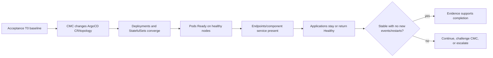

# Acceptance Argo CD replica increase — preparation baseline and findings

> **Folder route.** Start with [`argocd_replica_increase_explained.md`](argocd_replica_increase_explained.md) → execute Wednesday with [`argocd-replica-increase-acceptance-runbook.md`](argocd-replica-increase-acceptance-runbook.md) → record every ACC T0/live/post-change observation in this file. The July 20 ledger is DEV history only.

This is Wednesday's append-only evidence record. It preserves what Acceptance looked like before CMC touches it, so existing restarts, resource use, or application state are not misattributed to the replica maintenance.

Four terms anchor the record:

- **Intent** is what CMC is authorized to change—for example, server replicas from one to three.
- **Reality** is what OpenShift actually created and made Ready.
- **Outcome** is whether Argo CD continued serving and reconciling applications.
- **T0** is the last fresh snapshot immediately before the change. It separates “already true” from “changed during maintenance.”

Do not compress these into one green check. Intent can change while pods fail; pods can be Ready while endpoints are missing; endpoints can exist while applications are still Progressing.

## Knowledge contract

After reading this baseline, a new SRE must be able to **explain** the Acceptance preparation topology captured on July 20, **compare** it with the DEV pre-change state, **predict** which objects should change if CMC repeats the DEV operation, **trace** new pods to nodes, and **diagnose** a desired-versus-ready or application-health gap. Reject any later finding that lacks a fresh Wednesday T0 delta.

## First principles: compare intent, reality, and outcome

The maintenance is only successful when each layer agrees. The Acceptance baseline provides the left-hand side of every comparison.

```text
ACC baseline -> CMC desired change -> workloads -> pods/nodes/resources -> component service -> applications
     now              intent          reality          capacity              usefulness          outcome
```

The strip gives the evidence order. The flowchart below makes the Wednesday decision boundary explicit.



Read left to right: a green CR is only intent; a green pod is only Kubernetes readiness; application outcome and time are still required.

## Acceptance target and access boundary

| Field | Captured value |
|---|---|
| API | `https://api.eneco-vpp-acc.ceap.nl:6443` |
| Namespace | `eneco-vpp-argocd` |
| ArgoCD CR | `ArgoCD/eneco-vpp` |
| Capture | `2026-07-20T10:52:24+02:00` through `10:54:29 CEST` |
| Credential rule | Token was used by the human in the AVD; it is not copied to this file. |
| Maintenance state | Not started; only one-shot baseline probes are authorized. |

### Identity warning: a terminal tab is not a cluster boundary

DEV and ACC terminal tabs can share the same kubeconfig. An `oc login` in one tab can therefore change what the other tab queries. The title “DEV” or “ACC” is only a label drawn by the terminal; the API returned by `oc whoami --show-server` is the identity proof.

Wednesday rule: print and verify `https://api.eneco-vpp-acc.ceap.nl:6443` immediately before every accepted capture block. If the API differs, reject the entire block as `LOCAL-TOOLING`; do not reinterpret or copy its values.

## ACC preparation topology captured July 20, 10:52–10:54 CEST

| Component | Kubernetes workload | Effective replicas at capture | Control/config at capture |
|---|---|---:|---|
| Application controller | StatefulSet `eneco-vpp-application-controller` | `1/1 Ready` | no explicit replica override observed; HA disabled |
| Argo CD server | Deployment `eneco-vpp-server` | `1/1 Ready`, `1` available | server autoscale disabled; no HPA |
| Repo server | Deployment `eneco-vpp-repo-server` | `1/1 Ready`, `1` available | fixed/default effective count |
| Redis | Deployment `eneco-vpp-redis` | `1/1 Ready`, `1` available | standalone Redis, not HA topology |
| Dex | Deployment `eneco-vpp-dex-server` | `1/1 Ready`, `1` available | OpenShift OAuth SSO component |

The **ArgoCD CR** is the custom resource that tells the OpenShift GitOps operator how this Argo CD instance should be built. At capture time, `ha.enabled: false` meant the high-availability Redis layout was not requested. `server.autoscale.enabled: false` plus no **HPA**—Horizontal Pod Autoscaler—meant Kubernetes was not dynamically choosing server replica count from load. Replica fields were absent rather than zero; the operator-managed workloads prove an effective preparation value of one.

## Pod placement and historical restart baseline

| Component pod | Ready | Restarts at preparation capture | Node at preparation capture |
|---|---:|---:|---|
| application-controller-0 | `1/1` | `0` | `...westeurope2-hbwc9` |
| Dex | `1/1` | `1` | `...westeurope2-c27sd` |
| Redis | `1/1` | `0` | `...westeurope1-5w2hs` |
| Repo server | `1/1` | `1` | `...westeurope2-c27sd` |
| Server | `1/1` | `1` | `...westeurope2-c27sd` |

Those three restart counts already exist. A **restart count** says how many times a container has restarted inside the current Pod; it is not automatically an outage. On Wednesday, a new instability claim requires the number to rise beyond this baseline, a new Pod to begin restarting, or another discriminating signal such as readiness failure or error events.

## Resource and node baseline

| Component | Measured CPU | Measured memory | Request / limit from CR |
|---|---:|---:|---|
| Application controller | `13m` | `2140Mi` | request `250m/4Gi`; limit `2 CPU/6Gi` |
| Dex | `1m` | `161Mi` | request `250m/128Mi`; limit `500m/256Mi` |
| Redis | `2m` | `11Mi` | request `250m/128Mi`; limit `500m/256Mi` |
| Repo server | `1m` | `285Mi` | request `250m/256Mi`; limit `1 CPU/1Gi` |
| Server | `7m` | `147Mi` | request `125m/128Mi`; limit `500m/256Mi` |

At the July 20 preparation capture, Argo-hosting nodes were at `7–8%` CPU and `37–52%` memory. Across the six visible app workers, CPU was `7–9%` and memory `36–56%`. No namespace event rows were returned in that sample.

Meaning: Acceptance had **low observed utilization at capture time**. Measured use answers “what was being consumed in that sample”; a resource **request** answers “what capacity the scheduler must reserve”; a **limit** answers “how much the container may consume before throttling or termination rules apply.” `top` proves only the first. Do not call this schedulable headroom. Follow each new pod to its actual node and watch `FailedScheduling`, pressure, and request fit before claiming capacity is safe.

## Application outcome baseline

The visible Acceptance Application inventory at `10:54:02 CEST` was `Synced Healthy`, including `solver`.

> **APPLICATION FLEET BASELINE INCOMPLETE.** The preparation capture did not preserve the total Application count, a complete sync/health distribution, the complete exception set, or `reconciledAt` freshness for every row. “The visible rows were green” is therefore weaker than “the whole fleet was freshly reconciled and green.” Wednesday T0 must fill these fields before any fleet-level before/after claim.

| Required fleet field | July 20 preparation state | Wednesday promotion rule |
|---|---|---|
| total Application count | not preserved | capture exact count at T0 and after the change |
| sync/health distribution | visible rows appeared `Synced Healthy`; complete distribution not preserved | record every state combination and every exception |
| freshness | `reconciledAt` coverage not preserved | capture `reconciledAt`; controller recreation may leave stored green rows stale |
| `solver` | visible as `Synced Healthy` | compare sync, health, and freshness independently |

- `Synced`: live objects match Git-desired manifests.
- `Healthy`: tracked Kubernetes resources are healthy by Argo CD rules.
- `Progressing`: desired manifests may already be Synced while a rollout is still becoming Ready.

`solver` is an application managed by Argo CD, not part of the Argo CD control plane. If it becomes Progressing on Wednesday, record the timing and duration, check whether it recovers, and do not infer CMC causation from the row alone.

### ACC pre-existing configuration risk discovered after the preparation capture

Live ADO history for One-For-All build `20260720.1` proves that the same generator which blanked the two DEV image tags also wrote `image.tag: ""` to `Helm/marketinteraction/acc/values-override.yaml`, because that run had `acc-env=true`. The chart's empty-tag fallback would render `latest`.

This is **repository/pipeline evidence, not ACC runtime evidence**. It does not prove that Acceptance has consumed the revision or that an ACC pod is failing. Before Wednesday's replica maintenance, T0 must capture `marketinteraction-eneco-vpp` sync/health/revision, rendered Deployment image, ReplicaSets, and pod events. If ACC is already degraded, record it as a pre-existing application-delivery condition and do not attribute it to the replica increase.

## Service-routing baseline

At `11:26:32 CEST`, the exact preferred command executed successfully:

```bash
oc -n eneco-vpp-argocd get endpointslices.discovery.k8s.io -o wide
```

It returned one backend address at capture time for Dex, standalone Redis, repo server, and server, plus the applicable metrics slices. This is the July 20 preparation network-backend shape. On Wednesday, compare EndpointSlice membership with the intended new Ready Pod UIDs/addresses; a Ready Pod missing from the relevant slice is not yet serving through that Service.

No IP address from this preparation output is required in the durable runbook; backend identity and count must be refreshed at T0.

## Local-tooling readiness finding

Simple `oc` commands and the EndpointSlice query executed in the ACC AVD. Automated typing corrupted complex shell punctuation used by the proposed context wrapper: `_`, `$()`, `@`, and `|` were altered in separate harmless attempts. The malformed commands failed locally; no cluster object was changed.

Meaning: this is not an ACC or CMC failure. The runbook's `oc --context` design is structurally correct, but a human paste or isolated-kubeconfig execution must prove the exact wrapper in the AVD before it is labeled monitor-ready. Until then, keep the ACC API identity guard explicit and do not claim atomic context binding.

## Expected Wednesday delta if CMC repeats DEV

This is a hypothesis to confirm with CMC, not authorized change intent:

- server `1→3`;
- repo server `1→2`;
- standalone Redis replaced by three HAProxy pods plus a three-member Redis/Sentinel StatefulSet;
- controller and Dex remain one, although the controller may be recreated;
- new endpoints and new cross-node placement appear.

Ask CMC to confirm the exact target before declaring success. A different authorized plan replaces this hypothesis.

## Preparation command proof

The following exact read-only commands executed successfully in the Acceptance AVD tab. The first line is more than a login check: it is the guard that makes every following value belong to ACC.

```bash
oc whoami --show-server
oc -n eneco-vpp-argocd get argocd eneco-vpp
oc -n eneco-vpp-argocd get deployments
oc -n eneco-vpp-argocd get statefulsets
oc -n eneco-vpp-argocd get hpa
oc -n eneco-vpp-argocd get pods -o wide
oc adm top pods -n eneco-vpp-argocd --containers
oc adm top nodes
oc -n eneco-vpp-argocd get events --sort-by=.lastTimestamp
oc -n eneco-vpp-argocd get applications.argoproj.io
oc -n eneco-vpp-argocd get argocd eneco-vpp -o yaml
oc -n eneco-vpp-argocd get endpointslices.discovery.k8s.io -o wide
```

The commands prove the preparation snapshot, not Wednesday's future state. Re-run them at T0 and after the change; never carry today's `1/1` values forward as if they were fresh.

## Wednesday event ledger

| Time CEST | Capture ID | Observation | Delta from T0 | Attribution | Decision/status |
|---|---|---|---|---|---|
| _maintenance not started_ | | | | | |

## Self-test

Scenario: Wednesday's server Deployment says `3/3`, but one new server pod has restarted twice; `solver` remains `Synced Healthy` and node CPU is 20%.

Answer: the desired and current replica count converged, but the new restart delta violates the pod-stability baseline. Low node CPU and a healthy application inventory do not erase component instability. Inspect the pod/events and targeted logs, keep the success verdict open, and compare whether the restart count continues increasing.

## Evidence ledger and go deeper

The values above are live Acceptance observations. Public documentation explains mechanics, not installed behavior: [Red Hat OpenShift GitOps Argo CD instance configuration](https://docs.redhat.com/en/documentation/red_hat_openshift_gitops/1.19/html-single/argo_cd_instance/index) and [OpenShift `oc adm top`](https://docs.redhat.com/en/documentation/openshift_container_platform/4.15/html/cli_tools/openshift-cli-oc).

Visual coverage: baseline-to-outcome sequence → ASCII strip; Wednesday convergence/decision boundary → Mermaid flowchart.

Angles excluded: none — identity, desired configuration, workload realization, pod history, placement, capacity, service endpoints, application outcome, time, and attribution all change the acceptance decision.

Proof ceiling: this baseline is live ACC evidence captured on July 20. It does not prove Wednesday's login freshness, CMC's authorized target counts, future scheduler headroom, or maintenance outcome; the runbook must re-establish each of those at the correct time.
