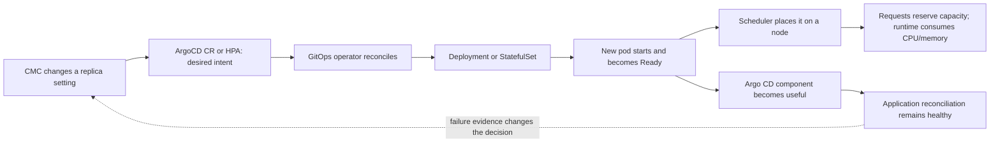

# DEV Argo CD replica maintenance — system, starting point, and outcome

> **Folder route.** Start with [`argocd_replica_increase_explained.md`](argocd_replica_increase_explained.md) → execute Wednesday with [`argocd-replica-increase-acceptance-runbook.md`](argocd-replica-increase-acceptance-runbook.md) → record ACC evidence in [`maintenance-july-22-records-findings.md`](maintenance-july-22-records-findings.md). This file explains the historical DEV rehearsal; it is not Wednesday's live instruction surface.

This DEV teaching reference answers three questions:

1. What did DEV contain before and after the July 20 change?
2. What must change when CMC increases replicas?
3. What would look successful but actually be unhealthy?

> DEV outcome captured through 10:48 CEST, with user closure around 10:59: the maintenance was stable across the observed proof layers. Server converged `1→3`, repo server `1→2`, and standalone Redis became a three-member Redis/Sentinel StatefulSet behind three HAProxy pods. Controller and Dex remained one. See `maintenance-july-20-records-findings.md` for the evidence ceiling: these changes are live-observed and CMC-correlated, while authoritative actor intent was not independently proven.

## Knowledge contract

After reading this document, a new SRE must be able to **explain** the correct DEV Argo CD instance, **trace** declared replicas through ready and useful service, **compare** scheduler reservation with measured use, **predict** where the capacity risk changes by component, and **diagnose** a desired-versus-ready false green. Reject the explanation if the reader still needs oral context for those actions.

## Before the first probe

- Work inside **Windows App → Developer Desktop → Ubuntu-24.04/WSL**.
- The authenticated CLI is the source of truth. Lens/Freelens is only a convenience view and is intentionally deferred until the core proof is complete.
- A terminal tab name is not a cluster boundary. DEV and ACC shells can share kubeconfig; `oc login` in one tab can change the active context used by another. Treat the API line below as the identity proof immediately before every accepted capture block.
- Never print a token with `oc whoami -t`, show raw kubeconfig, paste credentials, or retain a credential-bearing screenshot. Password, token, and MFA steps remain human-only.
- First prove the environment:

> **End-of-task Lens result:** after the CLI proof was complete, PowerShell `cmctoolsverify` proved the installed bridge and `cmcfreelens dev` selected the authenticated DEV context, verified project `eneco-vpp`, and exported that current context to Windows/FreeLens. The old catalog row still returned `Unauthorized`; opening the newly synchronized row labelled `file=~\\.kube\\config` loaded the live DEV cluster view. The cause was a stale cached catalog row, not DEV cluster failure. CLI remains the source of truth, and no token or raw kubeconfig was displayed or copied into this record.

```bash
oc whoami
oc whoami --show-server
oc project -q
oc config current-context
```

The server must be `https://api.eneco-vpp-dev.ceap.nl:6443`. Stop if it is not DEV, the session expired, or the target cannot be identified. This guard later rejected a DEV-labelled tab after an ACC login changed shared kubeconfig state.

## Concept bridge: the nouns you will operate

| Concept | Plain meaning | Why it matters in this maintenance |
|---|---|---|
| Namespace | A Kubernetes boundary that groups related objects. | The Argo CD control plane lives in `eneco-vpp-argocd`; the `eneco-vpp` project you initially see is not the control-plane namespace. |
| `ArgoCD` custom resource (CR) | The operator-facing configuration document for one Argo CD installation. | CMC changes desired intent here or in a managed scaling object; it tells us what Kubernetes is being asked to build. |
| GitOps operator | A controller that continuously turns the CR into Deployments, a StatefulSet, Services, and pods. | A CR edit is only the request. The operator must successfully reconcile it into running workloads. |
| Deployment | Kubernetes keeps a desired number of interchangeable pods. | Server, repo server, Redis, and Dex are Deployments; the table shows desired and available copies. |
| StatefulSet | Kubernetes gives replicas stable identity and order. | The application controller is a StatefulSet because controller identity/sharding can matter. |
| Pod | The actual scheduled runtime unit containing a component container. | CPU, memory, readiness, restarts, and node placement become real here. |
| Node | A worker machine on which a pod runs. | Added replicas reserve and consume capacity on the node selected by the scheduler—not necessarily the node used before maintenance. |
| HPA / autoscale | A controller that changes desired replicas from metrics. | If enabled, HPA desired/current/bounds—not a fixed CR number—control the server count. It was absent/disabled in the 10:12–10:17 DEV preparation capture. |
| HA mode | A packaged high-availability topology, not a synonym for “more than one pod.” | `ha.enabled: false` means the HA bundle is off; CMC can still scale individual components explicitly. |
| T0 | The last fresh snapshot immediately before CMC acts. | Preparation data can age. T0 is the fair before-state used to attribute the maintenance delta. |
| Sync status | Whether an application's live objects match Git-desired objects. | `OutOfSync` is drift, not automatically a service outage. |
| Health status | Argo CD's health assessment of application resources. | A replica change should not create new `Degraded`/unhealthy results, but this still is not end-user testing. |

## The starting point: what existed before the change

Live capture: **20 July 2026, 10:12–10:17 CEST**. This is intentionally historical: it is the left side of the before→after comparison, not a claim about the current topology.

| Fact | DEV preparation value captured at 10:12–10:17 CEST | Evidence meaning |
|---|---|---|
| Cluster | `https://api.eneco-vpp-dev.ceap.nl:6443` | DEV identity guard passed. |
| Argo CD namespace | `eneco-vpp-argocd` | Control-plane namespace; it is not the initially selected `eneco-vpp` application project. |
| ArgoCD custom resource | `ArgoCD/eneco-vpp` | Operator-owned desired configuration. |
| CR API | `argoproj.io/v1beta1` | Installed resource version. |
| CR age | created `2023-04-18` | Long-lived instance, not created for this maintenance. |
| High availability | `spec.ha.enabled: false` | HA mode was disabled in the preparation capture. |
| Server autoscaling | `spec.server.autoscale.enabled: false` | No server HPA control. |
| HPA objects | none in `eneco-vpp-argocd` | Preparation replica counts were not driven by an HPA. |
| Application controller | StatefulSet, `1/1` Ready | One desired and one ready controller replica. |
| Server | Deployment, `1/1` Ready, `1` available | One server replica. |
| Repo server | Deployment, `1/1` Ready, `1` available | One repository replica. |
| Redis | Deployment, `1/1` Ready, `1` available | One cache replica. |
| Dex | Deployment, `1/1` Ready, `1` available | One SSO replica. |
| ApplicationSet controller | no workload observed; CR status `Unknown` | Do not call this “zero replicas configured”; it was not an active workload in the captured baseline. |
| Namespace events | none returned | No event evidence at capture time; absence of events is not historical proof. |
| Component status | controller/repo/server/redis/SSO `Running`; CR phase `Available` | Operator status was green at baseline. |

Important nuance: explicit component replica fields were absent from the captured CR YAML. The **effective preparation value of one** is proven by the managed Deployment/StatefulSet tables. An absent field is not the number zero.

Connect the dots: the CR says no explicit replica override, the operator supplies its default, and the managed workloads show what that default became in this cluster: one desired and ready replica for each active component. During maintenance, a new explicit value may appear in the CR, but the workload and pod views still decide whether that intent became reality.

### DEV preparation resource configuration and measured use at 10:13 CEST

| Component | Request per replica | Limit per replica | Measured use at 10:13 CEST | Node at capture time |
|---|---:|---:|---:|---|
| Application controller | `250m CPU`, `4Gi memory` | `2 CPU`, `6Gi memory` | `24m CPU`, `1543Mi memory` | `...westeurope2-vp8fs` |
| Repo server | `250m CPU`, `256Mi memory` | `1 CPU`, `1Gi memory` | `1m CPU`, `139Mi memory` | `...westeurope2-vp8fs` |
| Server | `125m CPU`, `128Mi memory` | `500m CPU`, `256Mi memory` | `10m CPU`, `100Mi memory` | `...westeurope3-jpw2d` |
| Redis | `250m CPU`, `128Mi memory` | `500m CPU`, `256Mi memory` | `2m CPU`, `26Mi memory` | `...westeurope3-jpw2d` |
| Dex | `250m CPU`, `128Mi memory` | `500m CPU`, `256Mi memory` | `2m CPU`, `171Mi memory` | `...westeurope3-jpw2d` |

Full node names:

- `eneco-vpp-dev-zggzt-worker-westeurope2-vp8fs`: controller and repo server; `25%` CPU and `62%` memory at 10:14 CEST.
- `eneco-vpp-dev-zggzt-worker-westeurope3-jpw2d`: server, Redis, and Dex; `12%` CPU and `50%` memory at 10:14 CEST.

All six app/worker nodes were `Ready`. Their observed CPU/memory percentages were `28/44`, `35/66`, `35/44`, `25/62`, `12/50`, and `24/34`. They are **candidate capacity context, not proven eligible placement**: selectors, affinity, topology spread, taints/tolerations, and scheduler decisions can narrow the set. During scaling, follow the new pod's actual node.

## The smallest correct mental model

The causal chain below is the backbone of every probe. Each arrow is a separate place where a change can stop or become misleading.

```text
change intent -> CR/HPA -> operator -> workload -> pod -> scheduler/node -> component service -> applications
                    desired              ready      placed/capacity       useful              outcome
```

The ASCII strip is the render-independent path. The flowchart below expands the same path and shows the feedback from observed application outcome to the maintenance decision.



Read left to right: each boundary must be evidenced independently; the dotted return path is why a green Kubernetes object can still keep the maintenance open.

Think of it as ordering a new worker for a busy kitchen:

- **Desired replicas** is the staffing plan.
- **Current/updated replicas** means the replacement or new worker has been created.
- **Ready replicas** means Kubernetes' health check says the worker can enter the kitchen.
- **Available replicas** means it has remained usable long enough for the workload controller.
- **Endpoint membership / component outcome** means it is actually serving work.
- **Application health and freshness** means the kitchen is still delivering meals.

Changing the plan is not success. The proof must travel all the way from intent to useful service.

## What one extra replica means

There are three different resource truths. Never merge them:

1. **Reservation:** the scheduler must reserve the pod's CPU and memory requests.
2. **Ceiling:** limits cap or constrain the container; they are not predicted consumption.
3. **Measured use:** `oc adm top` shows sampled runtime consumption; it can change with load and may miss short spikes.

For `+1` replica, the reservation and limit deltas are:

| Component scaled by +1 | Added scheduler reservation | Added configured limit | Actual use prediction |
|---|---:|---:|---|
| Application controller | `+250m CPU`, `+4Gi memory` | `+2 CPU`, `+6Gi memory` | Unknown; measure. |
| Repo server | `+250m CPU`, `+256Mi` | `+1 CPU`, `+1Gi` | Unknown; measure. |
| Server | `+125m CPU`, `+128Mi` | `+500m CPU`, `+256Mi` | Unknown; measure. |
| Redis | `+250m CPU`, `+128Mi` | `+500m CPU`, `+256Mi` | Unknown; measure. |
| Dex | `+250m CPU`, `+128Mi` | `+500m CPU`, `+256Mi` | Unknown; measure. |

For a delta larger than one, multiply the reservation and limit rows by `new replicas − old replicas`. Do **not** multiply the one-time `top` sample and call that expected use: caches, sharding, warm-up, and load redistribution are nonlinear.

## How to decide during the change

| Observation | Meaning | Operator decision |
|---|---|---|
| Desired rises; updated/current follow; ready/available converge; no new warnings; new pod appears on a healthy node | Healthy transition, not yet stabilized | Continue observing. |
| Desired rises but ready/available stay lower | Replica exists only on paper or is still progressing | Inspect pod state, events, rollout, and node placement; challenge CMC if it does not progress. |
| Pod is `Pending` or event says `FailedScheduling` | Eligible capacity/placement problem | Escalate; capture request, constraint, node, and event evidence. |
| Restarts/OOM/probe errors increase | New or existing replica is unstable | Escalate; capture describe/log evidence; do not call success. |
| Node becomes `NotReady` or reports memory/disk/PID pressure | Platform risk can affect unrelated workloads | Escalate immediately. |
| Metrics unavailable | Consumption/spike claim is unknowable | Mark `cannot verify`; use scheduling/conditions/events only, without pretending they measure utilization. |
| Replica layers converge but endpoints or application health/freshness regress | Kubernetes-green, service-red false green | Challenge CMC and keep observation open. |
| First green snapshot occurs | A moment, not a verdict | Continue through stabilization. |

No authoritative Eneco/CMC CPU, memory, or delta threshold was supplied, so no local percentage decides acceptance. Compare each target node with T0 and record the direction and size of change. Treat any pressure condition, eviction, OOM, `FailedScheduling`, `Pending`, `NotReady`, or explicit contract breach as a hard failure signal. Requests must still fit allocatable capacity; sampled percentages cannot prove that fit.

## Start gate and stabilization

Before the user explicitly says the maintenance has started, run only one-shot preparation probes. Do not use `watch`, `-w`, loops, sleeps, or a repeated cadence.

After the recorded start signal:

- capture a fresh T0; do not overwrite this preparation baseline;
- sample replica/pod/event/application state about every 15 seconds;
- sample resource metrics no faster than every 60 seconds;
- after convergence, keep observing through the duration declared in the signed maintenance intent without new restarts, failure events, component regression, or application-health regression.

If no observation duration was supplied, state `STABLE AS OBSERVED — DURATION CONTRACT NOT SUPPLIED` and require an explicit human handoff. Do not turn a locally chosen timer into authorization to close.

## Self-test

Scenario: desired replicas are `3`, updated replicas are `3`, ready replicas are `2`, and the third pod is `Pending`; node CPU looks stable.

Can you explain why this is not success and choose the next two probes before reading the answer?

Answer: the staffing plan and pod creation succeeded, but usable capacity did not. First run [probe 5, the wide pod view](argocd-openshift-command-probes.md#5-bind-replicas-to-pods-and-nodes--prep-once-t0-start-gated-repeat) to bind the Pending pod to placement/state; then run [probe 8, namespace events](argocd-openshift-command-probes.md#8-failure-and-attribution-evidence--prep-once-t0-start-gated-repeat) for `FailedScheduling` or another cause. Stable CPU is irrelevant if the scheduler cannot place the pod. Evidence that would change the diagnosis is the pod scheduling, becoming Ready/Available, no new warning events, and stabilization without node/application regression.

## Challenge defense and evidence ledger

| Claim | Strongest evidence | What would falsify it |
|---|---|---|
| Target is DEV | live server/context commands | server/context differs at T0 |
| Each component had one effective replica at 10:12–10:17 CEST | live Deployment/StatefulSet tables | a fresh T0 shows a different desired/ready count |
| No HPA controlled the namespace at preparation capture | live `get hpa` returned none | an HPA appears before/during change |
| Preparation hosting nodes and sampled use are known | live wide-pod and `adm top` output | rescheduling or fresh metrics differ |
| The DEV maintenance succeeded across the captured proof layers | final CR/workload/Pod/serving/application/resource samples converged; the user declared the maintenance complete | any retained capture shows a layer did not converge, or a later in-window regression contradicts the final record |
| Functional Redis quorum, end-user transactions, and behavior after the captured interval | not evidenced by this watch | an allowed read-only quorum probe, transaction test, or later observation supplies that missing consumer evidence |

This explanation is rejected if a new SRE cannot identify the target, distinguish desired from ready, compute the reservation delta, follow a new pod to its actual node, and diagnose the transfer scenario without oral context.

Visual coverage: render-independent execution path → ASCII strip; reconciliation and outcome feedback → Mermaid flowchart. Decorative screenshots are intentionally excluded because they add no new decision angle.

Angles excluded: none — identity, control intent, reconciliation, placement, capacity, service outcome, time, and failure attribution all change the maintenance decision.

Go deeper: [Red Hat OpenShift GitOps Argo CD instance configuration](https://docs.redhat.com/en/documentation/red_hat_openshift_gitops/1.19/html-single/argo_cd_instance/index), [OpenShift `oc adm top`](https://docs.redhat.com/en/documentation/openshift_container_platform/4.15/html/cli_tools/openshift-cli-oc), and [OpenShift GitOps monitoring](https://docs.redhat.com/en/documentation/red_hat_openshift_gitops/1.19/html/observability/monitoring).
