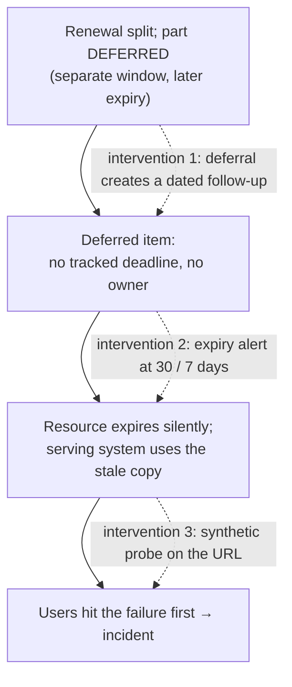

# Postmortem — the apex certificate that "the June renewal" didn't renew

This is the learning companion to the forensic [rca.md](./rca.md). The RCA proves *what happened*; this explains *the pattern to carry forward* so the team never repeats the class of failure — not just this instance. It is blameless: the June rotation was executed correctly and even documented the risk; the failure was a gap in visibility, not a mistake by a person.

## What happened, in one paragraph

Production `vpp.eneco.com` went dark on 21 July with a browser certificate-expiry error. The certificate serving the apex had expired the day before. Five weeks earlier we had renewed "the VPP certificate" — but that was the `*.vpp.eneco.com` **wildcard**, a *different* certificate object serving different hosts. The apex runs on its own object (`p-vpp-eneco-com`) with its own, later expiry, and June deliberately deferred it to a "separate window." That window arrived with nothing staged and no alarm watching it. We restored service in ~10 minutes by reusing a certificate we already had — the June wildcard's name list already covered the apex — so no vendor order was needed.

## Knowledge contract

After reading this, you can:

1. **explain** why renewing the wildcard did not renew the apex — they are separate certificate objects with separate expiries;
2. **draw** the difference between a certificate *object*, its *versions*, and the *versionless binding* a gateway uses;
3. **recognize** the "deferred renewal → hidden deadline" pattern in *any* expiring resource — certificate, secret, token, license — not just TLS;
4. **reject** the three false explanations that slowed this incident;
5. **apply** the four prevention controls that make this class of failure impossible to hit silently;
6. this does **not** make you able to run the production fix blind — pair with [how-to-fix.md](./how-to-fix.md).

## First principles (the smallest true statements)

- A **TLS certificate is valid for a list of names** (its SAN), and browsers validate the hostname against that list. A `*.vpp.eneco.com` wildcard matches exactly one label, so it does **not** cover the bare apex `vpp.eneco.com` — **unless the certificate also lists the apex as a separate SAN entry**, which ours does.
- In Azure a **certificate object** holds many **versions** over time. A consumer (the App Gateway) references the object through a **versionless** link and serves the *latest enabled version*. "Renewing" = importing a new version under the **same object name**.
- Therefore: **two hosts served by two different objects have two independent expiries.** Renewing one object cannot renew the other. This is the whole incident in one sentence.

## Mental model to keep: renewing X ≠ renewing Y

Here is the memory aid — the shape that, if you hold it, prevents the mistake.

```text
"We renewed the VPP certificate in June"  ←  ambiguous until you name the OBJECT

  wildcard-vpp-eneco-com   → serves agg / gurobi / apollo / flex-trade-optimizer   (renewed Jun, exp 30 Dec)
  p-vpp-eneco-com          → serves vpp.eneco.com (apex)                             (DEFERRED,  exp 20 Jul)  ← expired
  vpp-eetpv-com            → serves vpp.prd.eetpv.com                                (exp 29 Nov)

  One gateway. Three objects. Three expiries. Renewing one touches none of the others.
```

Reading it: the trap is linguistic — "the VPP certificate" sounds singular, but the gateway carries three independent certificate objects, each expiring on its own date. The June work renewed the top one and correctly *named* the apex as a separate, later job; the outage happened because that separate job had no owner and no alarm after the fact. The takeaway: **never say "the certificate" — name the object and its host.** That single habit would have made the deferral legible.

## The generalizable pattern: a deferral is a hidden deadline

Strip away TLS and this is a pattern about any expiring thing. Here is where it went wrong and where any of three cheap interventions would have caught it.



Reading it: three independent, cheap controls each break the chain at a different link — a *process* guard (deferrals become tracked), a *config* guard (near-expiry alerting), and an *outcome* guard (synthetic monitoring). None of them requires anyone to remember the deferral. The durable lesson: **when you defer expiring work, you are not postponing it — you are setting a timer that no one is watching. Make something watch it.**

## Reject these three explanations

- **"The user's clock is wrong."** The browser reported the correct date (21 Jul); the certificate genuinely expired 20 Jul. Client-clock errors look identical but are refuted by reading the reported date.
- **"The June renewal succeeded, so the cert is fine."** June renewed a *different object*. "Succeeded" was true and irrelevant to the apex. A green change on object A says nothing about object B.
- **"The ticket links a cert valid to 30-Nov, so the site is fine."** That was a real certificate — on a *different host* (`vpp.prd.eetpv.com`), not the apex. A certificate is only "the served certificate" when its thumbprint matches what the wire presents. The browser was not lying.

## Lessons → actionable insights

The prevention is decided in [adr-001](./adr-001-apex-tls-certificate-lifecycle.md) and detailed in [sre-toil-removal-proposal.md](./sre-toil-removal-proposal.md). In short:

1. **Alert on expiry** for every gateway-bound certificate object (30/7 days) — the single highest-leverage control.
2. **One stable object name per host**; renew by importing a *version*, never a new object. Kills the naming sprawl that hid this.
3. **A deferral is not done until it has a dated follow-up.**
4. **Prefer fewer expiry surfaces**: the apex now rides the wildcard's single expiry rather than its own — evaluate retiring the separate apex object entirely.
5. **The fix material may already be in the vault** — check SAN coverage before assuming a vendor order.

## Durable principle

*Renewing one member of a set is not renewing the set.* Whenever a system holds several independently-expiring credentials behind one friendly name — certificates, secrets, tokens, licenses — name each one and give each its own watcher. A deferral without a watcher is a silent countdown.

## Self-test

1. Why did `agg.vpp.eneco.com` stay up while `vpp.eneco.com` went down, on the same gateway?
2. A teammate says "we renewed the VPP cert in June, this can't be a cert problem." What do you ask them?
3. The certificate that fixed the apex was issued 15 June. Why was it able to fix a 20-July expiry with no vendor involvement?
4. Name the one control that would have turned this outage into a ticket nobody-noticed-yet.

(Answers: 1 — different object/expiry; 2 — *which object*, and does its thumbprint match the wire; 3 — its SAN already listed the apex; 4 — near-expiry alerting.)

## Visual coverage

Visual coverage: object-split → the ASCII "renewing X ≠ Y" aid (memory model of independent objects); failure-pattern → the mermaid flow (where a deferral becomes an outage, plus the three interventions).

Angles excluded: topology redraw — the forensic gateway topology lives in the RCA, not repeated here; runtime request-flow — this is a teaching postmortem, not a request trace.

## Go deeper

- [App Gateway certificates from Key Vault](https://learn.microsoft.com/en-us/azure/application-gateway/key-vault-certs)
- [Key Vault certificate renewal / near-expiry](https://learn.microsoft.com/en-us/azure/key-vault/certificates/overview-renew-certificate)
