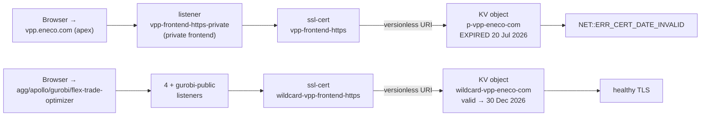
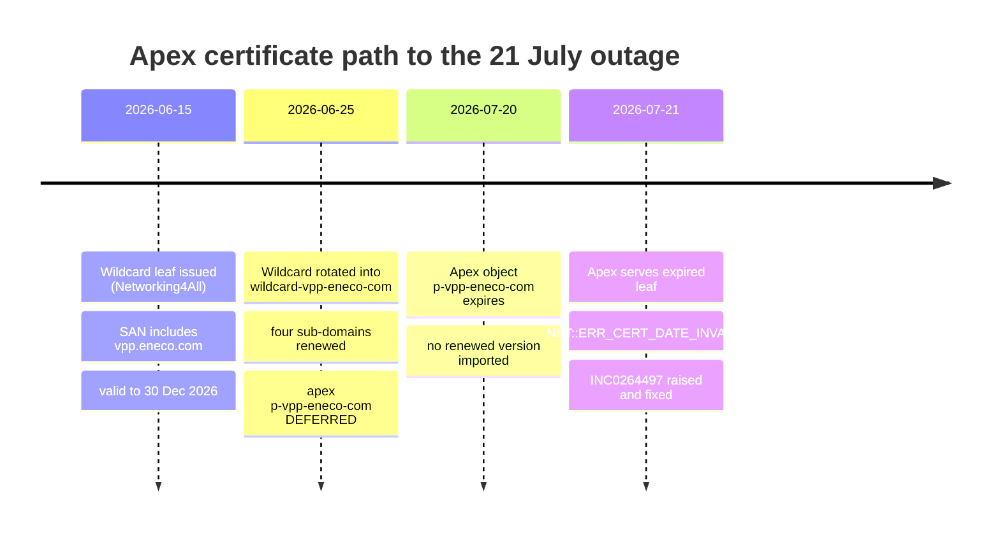

# Holistic RCA — INC0264497: production apex `vpp.eneco.com` served an expired TLS certificate

## Executive summary

The production Virtual Power Plant web UI lives at `https://vpp.eneco.com`. On 21 July 2026 every user hitting it got the browser interstitial **"Your connection isn't private — NET::ERR_CERT_DATE_INVALID"**. The site was not hacked and the application was healthy; the TLS certificate the site presents on the wire had **expired the previous day, 20 July 2026**.

That apex hostname terminates TLS on an Azure **Application Gateway** (`vpp-ag-p`). An Application Gateway does not store certificates itself — it *references* a certificate held in an Azure **Key Vault** (`vpp-appsec-p`) and serves whatever that reference resolves to. The apex listener references a **dedicated** Key Vault object called `p-vpp-eneco-com`, and that object's current certificate expired on 20 July.

Weeks earlier, on 25 June 2026, we rotated a *different* certificate on the same gateway — the `*.vpp.eneco.com` **wildcard** (Key Vault object `wildcard-vpp-eneco-com`), which serves the four sub-domains `agg`, `gurobi`, `apollo`, `flex-trade-optimizer`. That June work **explicitly deferred the apex** to a "separate window" because the apex certificate expired later (20 July) than the wildcard did (1 July). The deferred window then arrived with no renewal staged, and the apex went dark one day after it expired.

The ticket added confusion by noting a certificate "valid until 30-Nov-2026". That is a real certificate — but it is a *different* object on the same gateway (`vpp.prd.eetpv.com`), not the one the apex actually serves. The browser was not lying; the ticket pointed at the wrong certificate.

**The fix used a certificate we already had.** The June-renewed wildcard certificate is valid until 30 December 2026 and — critically — its Subject Alternative Name list already includes the apex name `vpp.eneco.com`, not just `*.vpp.eneco.com`. So we imported that existing, already-trusted certificate as a new version of the apex object `p-vpp-eneco-com` and forced the gateway to re-pull it. No new certificate had to be ordered from the vendor. A TLS handshake to `vpp.eneco.com` from the internal network now returns a certificate valid to 30 December 2026, and the browser error is gone.

**What a future engineer should remember:** on this gateway the apex and the wildcard are *separate certificate objects with separate expiries*. Renewing one does not renew the other. And the deeper problem the incident exposed — the reason "which object serves the apex and when does it expire" was unclear in June — is that the apex certificate has been re-imported under a **new object name almost every renewal**. The Key Vault holds five expired apex objects under five different names — though by thumbprint they collapse to only **two distinct certificates** (the same leaf copied under new names). That naming sprawl, plus the absence of an expiry alert, is what turned a routine renewal into an outage on the internal-facing UI.

**Not yet done:** the fix is a mitigation that leaves the apex served by the wildcard leaf. The forward decision (dedicated apex certificate vs. deliberately folding the apex into the wildcard) and the prevention actions (expiry alerting, object-naming discipline, residue cleanup) are tracked in the sibling ADR and toil-removal proposal.

---


## How to read this RCA

Read top-to-bottom: the Executive summary and Mental model map orient you; the Knowledge Contract states what you will be able to do; L1–L12 climb from business purpose to on-call recognition; the Evidence Ledger and Adversarial review carry the audit trail. Five minutes only → read the Executive summary and L12.

## Table of Contents

- Executive summary · How to read · Mental model map
- RCA Knowledge Contract · Knowledge Domain Map · Backward Derivation · Context Ledger
- L1 Business · L2 Objects · L3 Runtime · L4 Identity · L5 Contract · L6 Delivery · L7 Timeline · L8 Fix · L9 Verification · L10 Lessons · L11 Playbook · L12 On-call
- Evidence Ledger · Adversarial review · Go deeper · Cross-references


## Mental model map


| Level | Plain-language takeaway                                              | Pattern that transfers                                    |
| ----- | -------------------------------------------------------------------- | --------------------------------------------------------- |
| L2/L3 | One gateway carries several independent certificate objects          | Name the object, not "the certificate"                    |
| L4    | Browsers validate the SAN, not the CN                                | A wildcard leaf serves an apex if the apex is a SAN entry |
| L5    | Versionless resolves to latest-by-creation; a disabled latest errors | Import-disabled opens a risk window — enable fast         |
| L6/L7 | A deferral with no watcher is a hidden deadline                      | Alert on the thing that expires                           |
| L8    | Reuse the cert you already hold if its SAN covers the host           | Check SAN before ordering a new cert                      |


## RCA Knowledge Contract

After reading this package, a zero-context reader can:

1. **draw** the path from a browser request for `vpp.eneco.com` to the certificate bytes it receives — browser → App Gateway listener → ssl-cert resource → Key Vault object → leaf certificate;
2. **trace** why the site failed on 21 July even though the June rotation "succeeded" — the apex is a different object that was deferred and then expired;
3. **reproduce** the investigation from cold using the read-only Azure probes in the command playbook (L11);
4. **reject** the two tempting false explanations — "the June rotation broke it" and "the ticket's 30-Nov cert proves the site is fine";
5. **repair or roll back** safely, knowing why reusing the wildcard leaf is valid (SAN coverage) and why there is no rollback here (the prior apex cert is already expired);
6. **decide** what to automate or remove so this class of failure cannot recur silently (expiry alerting, naming discipline, residue cleanup).


## Knowledge Domain Map


| Domain                                                     | Reader capability it supports                                               |
| ---------------------------------------------------------- | --------------------------------------------------------------------------- |
| Business / functional role                                 | Explain why an apex TLS outage blocks the whole VPP UI and who is affected. |
| Runtime topology (App Gateway ↔ Key Vault)                 | Draw the certificate delivery path and the failure boundary.                |
| Certificate identity (CN vs SAN, wildcard vs apex)         | Explain why one leaf can serve both `*.vpp.eneco.com` and the apex.         |
| Key Vault object model (object, versions, versionless URI) | Explain how a rotation propagates — and how a deferral leaves a gap.        |
| Delivery / change history (the June rotation)              | Compare intended scope with what was actually renewed.                      |
| Timeline and latency                                       | Use the 1-July / 20-July / 21-July dates as causal evidence.                |
| Fix mechanism                                              | Connect each repair step to the invariant it restores.                      |
| Verification                                               | Prove the fix on the wire, not on a control-plane exit code.                |
| On-call recognition                                        | Detect the same class in five minutes next time.                            |
| SRE toil removal                                           | Decide what alert / discipline / cleanup removes the recurrence.            |


## Backward derivation from the contract

Each Knowledge Contract capability, traced to the section that makes it true.


| Contract capability                             | Knowledge domain    | Visual / evidence     | Probe                      | Section              |
| ----------------------------------------------- | ------------------- | --------------------- | -------------------------- | -------------------- |
| 1 draw the cert path                            | runtime topology    | L3 flowchart          | listener/ssl-cert list     | L3                   |
| 2 trace why June "success" left the apex broken | delivery history    | L2 table + L6 prose   | June scope table           | L2, L6               |
| 3 reproduce from cold                           | reproduction        | L11 probes            | the three read-only probes | L11, how-to-recreate |
| 4 reject the false explanations                 | evidence discipline | Evidence Ledger + L4  | thumbprint compare         | L4, Evidence Ledger  |
| 5 repair or roll back safely                    | fix mechanism       | L8 table + how-to-fix | import→gate→enable→re-pull | L8, how-to-fix       |
| 6 decide what to automate                       | toil removal        | sre-toil-removal      | expiry-alert evidence      | sre-toil-removal     |


Angles exercised: topology (L3), mechanism-over-time (L7), certificate identity (L4), fix-sequence (L8), decision/triage (L12). Angles excluded: feedback-loop — the failure is open-loop (an expired certificate changes no workload and triggers no state-altering retries); a separate state-machine diagram — the object-version lifecycle is fully carried by the L5 prose plus the L8 table, so redrawing it would repeat, not add.

## Context Ledger

Every term a zero-context reader needs, resolved. Evidence codes are defined in the Evidence Ledger; here the status is stated plainly.


| Term                                   | What it is                                                                                                                                                                                          | Relevance to this incident                                                              | Status                                                                                                         |
| -------------------------------------- | --------------------------------------------------------------------------------------------------------------------------------------------------------------------------------------------------- | --------------------------------------------------------------------------------------- | -------------------------------------------------------------------------------------------------------------- |
| `vpp.eneco.com`                        | Production apex hostname of the Myriad VPP web UI                                                                                                                                                   | The failing host                                                                        | Directly observed (screenshots + wire)                                                                         |
| `NET::ERR_CERT_DATE_INVALID`           | Browser refusal when the served leaf's validity window has passed                                                                                                                                   | The symptom                                                                             | Directly observed                                                                                              |
| Application Gateway `vpp-ag-p`         | Azure L7 load balancer terminating TLS for VPP in production                                                                                                                                        | Holds the listeners + certificate references                                            | Directly observed (control-plane)                                                                              |
| Listener `vpp-frontend-https-private`  | The HTTPS listener for host `vpp.eneco.com` on a **private** frontend                                                                                                                               | Why only AVD/internal can reach the apex                                                | Directly observed                                                                                              |
| ssl-cert resource `vpp-frontend-https` | The gateway's named certificate reference for the apex listener                                                                                                                                     | Points at the Key Vault object                                                          | Directly observed                                                                                              |
| Key Vault `vpp-appsec-p`               | Production VPP certificate vault (firewalled, default-deny)                                                                                                                                         | Stores every certificate object                                                         | Directly observed                                                                                              |
| Object `p-vpp-eneco-com`               | The **apex** certificate object; expired 20 Jul 2026                                                                                                                                                | The root-cause object                                                                   | Directly observed (portal + data-plane)                                                                        |
| Object `wildcard-vpp-eneco-com`        | The `*.vpp.eneco.com` wildcard; renewed 25 Jun, valid to 30 Dec 2026; SAN includes the apex                                                                                                         | The certificate reused for the fix                                                      | Directly observed                                                                                              |
| Object `vpp-eetpv-com`                 | Cert for `vpp.prd.eetpv.com`, valid to 29 Nov 2026                                                                                                                                                  | The likely "30-Nov" cert the ticket confused with the apex                              | Object directly observed; the ticket-match is an inference (nearest expiry; ticket said 30-Nov vs cert 29-Nov) |
| SAN (Subject Alternative Name)         | The list of names a certificate is valid for; browsers validate against it, not the CN                                                                                                              | Why the wildcard leaf can serve the apex                                                | Provider docs + local openssl                                                                                  |
| Versionless secret URI                 | A Key Vault reference with no version GUID; resolves to the latest **version by creation** — NOT the latest *enabled* one; a disabled latest version errors (`403 SecretDisabled`) with no fallback | How the gateway auto-picks a new version — and why the import-disabled window is a risk | Provider docs + June data-plane read                                                                           |
| Networking4All                         | External CA/vendor that issues these certificates (delivered via Zivver → 1Password)                                                                                                                | Who to ask if a *new* cert is ever required                                             | Inferred from June runbook                                                                                     |


---


## L1 — Business — why `vpp.eneco.com` exists

`vpp.eneco.com` is the front door to the Myriad Virtual Power Plant UI in production. When its TLS certificate is invalid, **every** modern browser hard-blocks the page before any application code runs, so the entire UI is unreachable regardless of backend health. This is why a single expired certificate escalated to a P1/major incident: the blast radius is "the whole product's web entry point," not one feature. A scope note that matters for *who* was affected: the apex listener is on a **private frontend** and `vpp.eneco.com` does not resolve in public DNS (confirmed this session), so the impacted population is users on the internal/AVD/VPN path — operators and any customers who reach the UI that way — not arbitrary internet visitors.

The four sub-domains (`agg`, `gurobi`, `apollo`, `flex-trade-optimizer`) are separate functional surfaces of the same platform and, crucially for this incident, ride a **separate certificate** — so they stayed up while the apex was down.

## L2 — The certificate objects in play (the repo/artifact system for this incident)

There is no application code defect here; the "artifacts" are certificate objects and gateway references. The critical rigor is which named object serves which host. The June rotation work (in `antecedents/2026_06_24_renewal_vpp_tls_certificates/`) established the naming trap in one sentence: the Key Vault **object** name is not the gateway **ssl-cert** name is not the **host**.


| Host                                           | Gateway ssl-cert resource     | → Key Vault object       | Expiry                       | Renewed in June?  |
| ---------------------------------------------- | ----------------------------- | ------------------------ | ---------------------------- | ----------------- |
| `vpp.eneco.com` (apex)                         | `vpp-frontend-https`          | `p-vpp-eneco-com`        | **20 Jul 2026** → now 30 Dec | **No — deferred** |
| `agg`/`gurobi`/`apollo`/`flex-trade-optimizer` | `wildcard-vpp-frontend-https` | `wildcard-vpp-eneco-com` | 30 Dec 2026                  | Yes (25 Jun)      |
| `vpp.prd.eetpv.com`                            | `vpp-prd-eetpv-com`           | `vpp-eetpv-com`          | 29 Nov 2026                  | No (separate)     |


The reusable handle: **one Application Gateway can carry several independent certificate objects, each with its own expiry.** "We renewed the VPP certificate in June" is ambiguous until you name the object.

## L3 — Runtime architecture — the certificate delivery path

Here is the chain a browser request travels, and where it broke. This diagram answers: *what serves the apex, and which link presented the expired bytes?*




Reading it: two independent paths share the same gateway. The apex path (top) terminates on a listener named `vpp-frontend-https-private`; I confirmed this session that `vpp.eneco.com` does not resolve in public DNS (a `dig` from a normal laptop returns nothing), and the listener name plus the June antecedent indicate a private frontend — which is why the reporter could only reach it from an AVD session. That listener points at ssl-cert `vpp-frontend-https`, which resolves through a versionless Key Vault reference to object `p-vpp-eneco-com`. When that object's latest certificate expired on 20 July, the gateway kept serving those now-expired bytes, and the browser refused them. The wildcard path (bottom) is a *parallel, unrelated* chain that was renewed in June and stayed healthy — which is exactly why the four sub-domains never failed. The one mental model to keep: **the failure boundary is a single certificate object, not the gateway and not the product.** The next section shows what that object actually holds.

## L4 — What the object holds (certificate identity)

Browsers validate the hostname against the certificate's **SAN** list, ignoring the legacy CN field. This is the first principle that makes both the failure and the fix comprehensible.

- The **expired apex leaf** (`p-vpp-eneco-com`, thumbprint `8332A22F…54E098`): Subject `CN=vpp.eneco.com`, SAN `vpp.eneco.com`, valid until 20 Jul 2026. A single-host certificate for the apex.
- The **June wildcard leaf** (`wildcard-vpp-eneco-com`, thumbprint `B8202DE2…BDE7`): Subject `CN=*.vpp.eneco.com`, **SAN** `*.vpp.eneco.com, vpp.eneco.com`, valid **15 Jun → 30 Dec 2026** (the PFX's notBefore/notAfter).

The load-bearing fact for the fix: the wildcard's SAN contains the **apex name explicitly**, in addition to the wildcard. A `*.vpp.eneco.com` wildcard alone would *not* match the bare apex (a wildcard matches exactly one label), but because this leaf also lists `vpp.eneco.com` as a SAN entry, it is fully valid for the apex host. That is why we could reuse it.

## L5 — The declarative contract (Key Vault object model)

An Application Gateway ssl-cert resource holds a **versionless** Key Vault secret URI (`…/secrets/p-vpp-eneco-com`, no version GUID). A versionless URI resolves to the **latest version by creation date** — and here is the subtlety that matters for the fix: it does **not** skip back to the latest *enabled* version. If the newest version is disabled, the data-plane fetch returns `403 SecretDisabled` with no fallback — the team observed exactly this failure on this object in June. Rotation therefore means: import a **new version** under the same object name, then **enable it promptly** — because between import-disabled and enable, the newest version is disabled and any gateway re-fetch in that window fails, which can auto-disable the listener. The apex ssl-cert was, and after the fix still is, on the versionless URI, so the object binding never changed. The gateway binding is versionless (directly observed); that the apex certificate *object* is not Terraform-managed is an inference from the June drift-check (which proved it for the wildcard object in the same vault) plus the prod pipeline's `trigger: none`. The gap in this incident was not a broken contract; it was that **no new version was ever imported** for the apex object before its only enabled version expired.

## L6 — Delivery — the June rotation and the deferral

The June change (`antecedents/.../rotation-execution-spec.md`) rotated **only** `wildcard-vpp-eneco-com`, because the wildcard's old version expired first (1 July) and was the urgent one. Its scope table recorded, verbatim: *"Out of scope | apex* `vpp.eneco.com` *(*`p-vpp-eneco-com`*, exp Jul 20 — separate window)."* The apex was correctly identified as a separate object with a later expiry and deliberately postponed. The delivery gap is that the "separate window" was never scheduled or alarmed, so the deferral silently became a deadline nobody was watching.

## L7 — Timeline

This timeline is causal evidence, not the document's spine: it shows the moment the outage became inevitable.




Reading it: the wildcard leaf that ultimately fixed the apex was already in hand on 15 June — it always covered the apex in its SAN. The 25 June rotation renewed the four sub-domains and consciously left the apex for later. The apex then expired on 20 July with nothing staged, and the outage surfaced on 21 July, one day later, exactly matching the browser's "expired in the last day" wording. The takeaway to keep: **the cure existed five weeks before the disease; the failure was purely one of scheduling and visibility, not of missing material.**

## L8 — Fix

The fix reused the June wildcard leaf (which covers the apex via SAN) as a new version of the apex object, then forced the gateway to re-pull. Each step, the plane it closes, and its proof:


| Step                                                 | What changes                                                     | Why it addresses the mechanism                                         | Proof                                                      |
| ---------------------------------------------------- | ---------------------------------------------------------------- | ---------------------------------------------------------------------- | ---------------------------------------------------------- |
| Import June PFX into `p-vpp-eneco-com` (disabled)    | Adds a valid new version to the apex object                      | The object's only enabled version was expired; this stages a valid one | Imported version thumbprint = `B8202DE2…`                  |
| Thumbprint gate                                      | Confirms the vault bytes equal the intended cert before exposure | Prevents enabling a wrong/corrupt import                               | local == vault == `B8202DE2…`                              |
| Enable new version                                   | Makes the versionless URI resolve to the valid cert              | Restores a valid "latest enabled version"                              | versionless now resolves to `B8202DE2…`                    |
| Force gateway re-pull (versioned→versionless toggle) | Makes the gateway fetch the new version immediately              | An unchanged versionless binding only re-pulls on a ~4h poll           | provisioningState `Succeeded`, binding back on versionless |
| Remove operator IP from KV firewall                  | Restores the vault's default-deny baseline                       | The import required a temporary firewall opening                       | firewall back to 6-IP baseline                             |


**What this fix does NOT change:** it does not order a dedicated apex certificate — the apex is now served by the wildcard leaf (valid via SAN). It does not touch the four sub-domains or the `eetpv` host. It does not add any expiry monitoring — that is deliberately left to the follow-up actions. Two residual risks are specific to reusing a *different* leaf (a new public key, not a same-key renewal): any client that **pins** the apex certificate or its public key — a mobile app, a service integration, a synthetic monitor — would fail against the new thumbprint; and the host's HSTS posture was not checked (the outage's clickable "Continue (unsafe)" affordance suggests HSTS was not enforced on this login host, which is itself worth fixing). A lower-mutation recovery also existed and was not taken — see how-to-fix.

## L9 — Verification

Control-plane success (an `az` exit code) proves only that a write was accepted; it does not prove the gateway serves the new bytes. The binding proof is a TLS handshake. From an internal/AVD session:

```text
subject  = CN = *.vpp.eneco.com
notAfter = Dec 30 23:59:59 2026 GMT
sha1     = B8:20:2D:E2:0B:E7:FB:3F:B3:7E:6D:51:41:97:52:82:BF:33:BD:E7
```

The served leaf is now valid to 30 December 2026 and its thumbprint matches the intended wildcard leaf. The apex CN is `*.vpp.eneco.com` — expected, because we reused the wildcard; the browser accepts it because `vpp.eneco.com` is in the SAN. Cross-check of the whole vault (see `proofs/outputs/kv-cert-inventory-20260721.txt`) confirmed the other two gateway-bound certs are valid (wildcard to 30 Dec, `eetpv` to 29 Nov), so no second expiry is imminent. One thing the handshake does **not** prove: that a normal navigation reaches the real VPP login/OAuth page rather than `/forbidden`. `/forbidden` was seen during the outage only after clicking "Continue (unsafe)", so it is most likely the untrusted-channel landing — but an independent cause (a WAF or authorization rule) was not ruled out, so a post-fix load of the login page is a recommended check before the ticket is closed.

## L10 — Lessons

1. **On this gateway the apex and the wildcard are different certificate objects with different expiries.** Renewing the wildcard does not renew the apex. Always name the object, never "the VPP certificate."
2. **A deferral without a scheduled follow-up and an alert is a hidden deadline.** June correctly deferred the apex; the failure was that the deferral was invisible after the fact.
3. **The certificate that fixes a host may already be in the vault.** The wildcard's SAN covered the apex the whole time — verify SAN before assuming a vendor order is needed.
4. **Object-naming sprawl hides expiry.** Five expired apex objects under five names — only two distinct certificates by thumbprint (the same leaf re-imported) — is why "which cert serves the apex" was unclear. One stable object name per host makes expiry legible.
5. **A ticket-linked certificate is not the served certificate until thumbprints match.** The "30-Nov" cert was a real but unrelated object.


## L11 — End-to-end command playbook (recreate this RCA from cold)

Every command is read-only and control-plane; the only mutations are in `how-to-fix.md`. Requires Reader on the prod VPP subscription (`f007df01-…`); the vault reads additionally require the operator IP on the KV firewall (see `how-to-fix.md`).

**Probe 1 — which object serves the apex?**

- **Question:** which certificate does the `vpp.eneco.com` listener actually bind?
- **Why this command:** the gateway's listener→ssl-cert→`keyVaultSecretId` chain is the authoritative binding; the portal or `az` both read it without opening the vault firewall.
- **Fields selected:** host name and the ssl-cert resource id.
- **Command:**

```bash
az network application-gateway http-listener list --gateway-name vpp-ag-p \
  -g mcprd-rg-vpp-p-res --subscription f007df01-9295-491c-b0e9-e3981f2df0b0 \
  --query "[?protocol=='Https'].{host:hostName, cert:sslCertificate.id}" -o tsv
```

- **Expected output / decision rule:** the `vpp.eneco.com` row points at `…/sslCertificates/vpp-frontend-https`; resolve that ssl-cert's `keyVaultSecretId` to get the object (`p-vpp-eneco-com`). If it pointed at `wildcard-vpp-frontend-https`, the cause would be stale-cache, not this object.
- **Principle:** trust the binding chain, not the certificate's name or the ticket.

**Probe 2 — is that object expired?**

- **Question:** what is the served leaf's expiry and thumbprint?
- **Why this command:** the Listener TLS certificates portal blade (or a data-plane KV read) is the source of truth for the object's current validity.
- **Freshness note:** the vault is default-deny; the operator IP must be whitelisted first (see `how-to-fix.md`) or the portal blade used instead.
- **Command (portal-free variant, after firewall open):**

```bash
az keyvault certificate show --vault-name vpp-appsec-p --name p-vpp-eneco-com \
  --query "{expires:attributes.expires, thumb:x509ThumbprintHex, subject:policy.x509CertificateProperties.subject}" -o json
```

- **Expected output / decision rule:** `expires` in the past (`2026-07-20…`) confirms the expiry root cause. A future date would refute it and send you to gateway re-pull latency.
- **Principle:** the object's own attributes are the truth; the browser error is downstream of them.

**Probe 3 — wire verification (the only "done").**

- **Question:** does the apex actually serve a valid leaf now?
- **Why this command:** a live TLS handshake is the sole proof the gateway serves the new bytes; it must run from AVD/internal because the listener is private.
- **Command:**

```bash
echo | openssl s_client -connect vpp.eneco.com:443 -servername vpp.eneco.com 2>/dev/null \
  | openssl x509 -noout -subject -enddate -fingerprint -sha1
```

- **Expected output / decision rule:** `notAfter=Dec 30 … 2026` and thumbprint `B8:20:2D:E2:…:BD:E7` ⇒ fixed. Old date ⇒ re-pull not propagated; re-run the force-refresh.
- **Principle:** verify on the wire, never on an `az` exit code.


## L12 — One-page on-call playbook

- **Symptom:** `vpp.eneco.com` (or any VPP host) shows `NET::ERR_CERT_DATE_INVALID`; app is otherwise healthy.
- **In 5 minutes:** (1) `http-listener list` on `vpp-ag-p` → find the host's ssl-cert → Key Vault object. (2) Check that object's expiry (portal Listener-TLS-certificates blade shows Status/Expiry without opening the firewall). (3) If expired, check whether a valid cert with the right SAN already exists in `vpp-appsec-p` (the wildcard covers the apex).
- **Fix path:** import a valid cert as a new version of the *bound* object → gate thumbprint → enable → force AGW re-pull → verify on the wire from AVD. Full steps in `how-to-fix.md`.
- **Do NOT:** tell users to click "Continue (unsafe)" (it lands on `/forbidden`, still untrusted); do not assume the June wildcard renewal covered the apex; do not trust a ticket-linked cert without a thumbprint match.

---


## Evidence Ledger


| #   | Claim                                                                                                        | Label | Evidence                                                                                                                                                                              |
| --- | ------------------------------------------------------------------------------------------------------------ | ----- | ------------------------------------------------------------------------------------------------------------------------------------------------------------------------------------- |
| 1   | Apex served `NET::ERR_CERT_DATE_INVALID`, browser clock correct (21 Jul 2026)                                | A1    | Screenshots `proofs/screenshots/01`,`02`                                                                                                                                              |
| 2   | Apex listener `vpp-frontend-https-private` binds ssl-cert `vpp-frontend-https` → `…/secrets/p-vpp-eneco-com` | A1    | `az network application-gateway http-listener/ssl-cert list`, `proofs/outputs/agw-listeners.json`,`agw-sslcerts.json`                                                                 |
| 3   | `p-vpp-eneco-com` current cert expired 2026-07-20, thumb `8332A22F…54E098`, CN/SAN `vpp.eneco.com`           | A1    | Portal blade + data-plane read; pre-fix capture retained in `proofs/outputs/apex-cert-prefix-state-20260721.txt` (the fix overwrote this object, so it is no longer re-readable live) |
| 4   | June PFX = `wildcard`, SAN `{*.vpp.eneco.com, vpp.eneco.com}`, valid to 30 Dec 2026, thumb `B8202DE2…`       | A1    | Local `openssl pkcs12` on the antecedent PFX                                                                                                                                          |
| 5   | June rotation renewed only `wildcard-vpp-eneco-com`; apex explicitly deferred (exp Jul 20)                   | A1    | `antecedents/.../rotation-execution-spec.md` scope table                                                                                                                              |
| 6   | Fix imported `B8202DE2…` into `p-vpp-eneco-com`, enabled, forced re-pull; firewall restored                  | A1    | This session's step outputs (import/gate/enable/re-pull/whitelist-off)                                                                                                                |
| 7   | Post-fix wire: `vpp.eneco.com` serves `notAfter Dec 30 2026`, thumb `B8:20:2D:E2:…:BD:E7`                    | A1    | AVD `openssl s_client` handshake, operator-witnessed; transcribed to `proofs/outputs/apex-wire-and-dns-20260721.txt`                                                                  |
| 8   | Other AGW-bound certs valid: wildcard 30 Dec, `vpp-eetpv-com` 29 Nov 2026                                    | A1    | `proofs/outputs/kv-cert-inventory-20260721.txt`                                                                                                                                       |
| 9   | Ticket "valid to 30-Nov" is `vpp-eetpv-com` (`vpp.prd.eetpv.com`), a different object                        | A2    | Inventory shows `vpp-eetpv-com` expires 29 Nov; nearest match to the ticket claim                                                                                                     |
| 10  | `vpp-appsec-p` holds 5 expired `CN=vpp.eneco.com` objects under 5 names (naming sprawl)                      | A1    | `proofs/outputs/kv-cert-inventory-20260721.txt`                                                                                                                                       |
| 11  | Apex object was the served, expired leaf (not merely "inferred to exist")                                    | A1    | Corrects the intake hypothesis; proven by claims 2+3                                                                                                                                  |


**Confidence.** Every load-bearing claim on the causal mechanism and the fix (1–8, 10, 11) is directly observed this session — control-plane, data-plane, or wire — and the artifacts are now retained (the wire proof is an operator-witnessed AVD handshake, transcribed rather than an in-repo screenshot; the pre-fix apex state is retained because the fix overwrote the live object). The one inference on the causal periphery is claim 9 (which object the ticket's "30-Nov" cert refers to); it does not affect the root cause or the fix. Confidence in the root cause and the delivered fix: **high**. Two things remain unverified and would lower it: (a) that a normal navigation reaches the real login page rather than `/forbidden` (a valid cert alone does not prove this — recommended before ticket closure); (b) that no client pins the old apex certificate (a leaf swap breaks pins). What would most quickly falsify the fix: a later report that the wire reverted to the old leaf — not observed.

**Go deeper (official docs).** Application Gateway certificate-from-Key-Vault behaviour and the versionless-URI refresh semantics: [https://learn.microsoft.com/en-us/azure/application-gateway/key-vault-certs](https://learn.microsoft.com/en-us/azure/application-gateway/key-vault-certs) and the common-errors guide [https://learn.microsoft.com/en-us/azure/application-gateway/application-gateway-key-vault-common-errors](https://learn.microsoft.com/en-us/azure/application-gateway/application-gateway-key-vault-common-errors).

## Visual coverage note

Visual coverage: topology → L3 flowchart (what serves the apex + failure boundary); mechanism-over-time → L7 timeline (when the outage became inevitable); identity/data → L4 prose + L2 table (why one leaf serves both names); fix-sequence → L8 table (the ordered repair and each plane it closes); decision/triage → L12 (5-minute recognition next time). Angles excluded: feedback-loop — the failure is open-loop (an expired cert does not change the workload or trigger retries that alter state); state-machine diagram — the object-version lifecycle is fully carried by the L5 prose + L8 table, so a separate state diagram would redraw the same idea.

## Adversarial review (Phase 5 gate)

This RCA was challenged by two independent typed reviewers on non-overlapping lanes before `status: complete`. Full receipts: `socrates-rca-review.md` (epistemic) and `demoledor-rca-review.md` (technical) in `.ai/tasks/2026-07-21-002_vpp-eneco-com-cert-date-invalid-inc0264497/reviews/`. Both confirmed the root cause and the delivered fix are sound; every finding is dispositioned below.


| #     | Reviewer  | Finding                                                                                                                                  | Disposition                                                                              |
| ----- | --------- | ---------------------------------------------------------------------------------------------------------------------------------------- | ---------------------------------------------------------------------------------------- |
| D1    | technical | HIGH: "versionless → latest *enabled* version" is wrong; it is latest *by creation*, and a disabled latest errors `403` with no fallback | ACCEPTED — corrected in L5 + Context Ledger; import-disabled window now named            |
| F1    | epistemic | HIGH: wire proof (the "done" gate) not retained as an artifact                                                                           | ACCEPTED — persisted to `apex-wire-and-dns-20260721.txt`; Claim 7 + confidence corrected |
| F2    | epistemic | HIGH: pre-fix apex state observed but not retained; the fix overwrote the object                                                         | ACCEPTED — persisted to `apex-cert-prefix-state-20260721.txt`; recreate doc warned       |
| D2    | technical | MED: "done" proves a valid leaf, not that the app is usable (`/forbidden` not re-checked)                                                | ACCEPTED — added as recommended pre-closure check (L9, how-to-fix); flagged not-yet-done |
| D3    | technical | MED: a lower-mutation recovery (repoint apex ssl-cert to the wildcard object) was not enumerated                                         | ACCEPTED — added to how-to-fix as the safer alternative; trade-off noted                 |
| D4    | technical | MED: leaf swap breaks any client pinning the apex cert/SPKI                                                                              | ACCEPTED — residual risk (L8, how-to-fix); confirm-with-app-team                         |
| D5    | technical | MED: HSTS posture unexamined                                                                                                             | ACCEPTED — residual risk + toil-removal                                                  |
| F3    | epistemic | MED: blast-radius incoherence — "customers" vs private frontend                                                                          | ACCEPTED — reconciled to internal/AVD audience                                           |
| F4    | epistemic | MED: "re-created every renewal" contradicted by duplicate thumbprints                                                                    | ACCEPTED — "5 objects, 2 distinct leaves; re-imported" (Exec, L10, ADR, postmortem)      |
| F5    | epistemic | LOW: "eight expired" is seven                                                                                                            | ACCEPTED — corrected + P3 de-duplicated                                                  |
| F6/D6 | both      | LOW: private-frontend / not-Terraform-managed inferred, not probed for the apex                                                          | ACCEPTED — relabelled inference; DNS-non-resolution kept as observed                     |
| F7    | epistemic | LOW: firewall baseline / step outputs not retained                                                                                       | ACCEPTED — persisted to `kv-firewall-state-20260721.txt`                                 |
| F8    | epistemic | LOW: eetpv ledger row conflates "object exists" with "is the ticket's cert"                                                              | ACCEPTED — hedged                                                                        |
| D7    | technical | LOW: "15-Jun issued" unsourced; pre-fix thumb non-reproducible                                                                           | ACCEPTED — cited the PFX notBefore (L4); pre-fix thumb persisted                         |
| D8    | technical | LOW: old expired apex version left enabled; compounds D1 for future rotations                                                            | ACCEPTED — cleanup recorded in toil-removal                                              |


**Attacks that failed (credited):** SAN validity for the bare apex (exact `dNSName` SAN match, RFC 9525); the core diagnosis; the force-re-pull mechanism (Microsoft-doc + wire-verified); the thumbprint gate; and every load-bearing identifier, thumbprint, date, object, and subscription — all reconciled cleanly across this RCA, the inventory, and the June evidence.

## Mutation log

- 2026-07-21 — fix applied: imported the June wildcard leaf into `p-vpp-eneco-com`, forced App Gateway re-pull, restored the KV firewall to its 6-IP baseline. Evidence retained in `proofs/outputs/`.
- 2026-07-21 — external adversarial review dispatched: `socrates-rca-review.md` (epistemic lane) and `demoledor-rca-review.md` (technical lane), under `.ai/tasks/2026-07-21-002_vpp-eneco-com-cert-date-invalid-inc0264497/reviews/`. All 16 findings are dispositioned in the Adversarial review section above.

## Go deeper

- [App Gateway certificates from Key Vault](https://learn.microsoft.com/en-us/azure/application-gateway/key-vault-certs) — versionless refresh semantics.
- [App Gateway ↔ Key Vault common errors](https://learn.microsoft.com/en-us/azure/application-gateway/application-gateway-key-vault-common-errors) — the force-re-pull "Resolution E".
- [Key Vault certificate renewal / near-expiry](https://learn.microsoft.com/en-us/azure/key-vault/certificates/overview-renew-certificate).
- SAN / wildcard hostname matching: [RFC 9525](https://www.rfc-editor.org/rfc/rfc9525) (supersedes RFC 6125).


## Cross-references

- Repair steps and rollback boundary: [how-to-fix.md](./how-to-fix.md)
- Cold replay of this investigation: [how-to-recreate-this-rca.md](./how-to-recreate-this-rca.md)
- Prevention (alerting, naming, cleanup): [sre-toil-removal-proposal.md](./sre-toil-removal-proposal.md)
- Forward decision on apex certificate strategy: [adr-001-apex-tls-certificate-lifecycle.md](./adr-001-apex-tls-certificate-lifecycle.md)
- June antecedent: [../antecedents/2026_06_24_renewal_vpp_tls_certificates/](../antecedents/2026_06_24_renewal_vpp_tls_certificates/)

