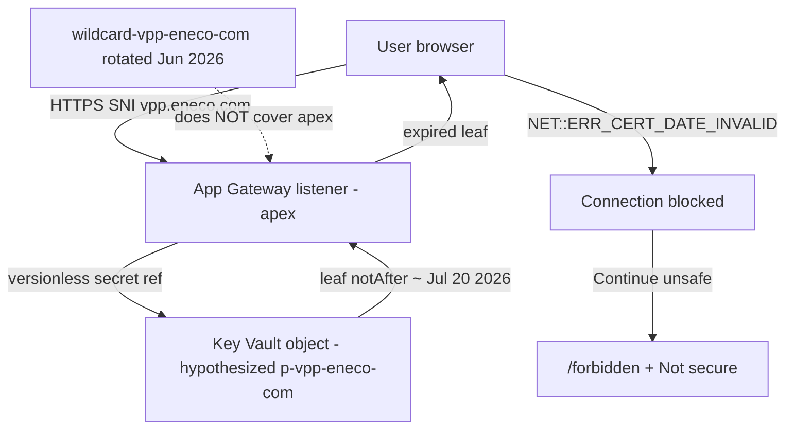

# INC0264497 — vpp.eneco.com connection isn't private — Slack intake

## Derivation header

| Field | Value |
|-------|-------|
| `template_id` | `slack-intake.template.md` |
| `template_version` | `2.0.0` |
| `template_path` | `std/skills/10_employer/eneco/eneco-oncall-intake-slack/assets/slack-intake.template.md` |
| `instance_id` | `2026_07_21_001_vpp_eneco_com_cert_date_invalid_inc0264497` |
| `filed_date` | `2026-07-21` |
| `picked_up_date` | `2026-07-21` |
| `produced_by` | `eneco-oncall-intake-slack` |
| `consumed_by` | `eneco-sre` — assembles `sre-intake.md` beside this file |
| `live-outage` | `enrich async` — P2 High, active user impact on apex `vpp.eneco.com` |

## Instance manifest

| Key | Value | Provenance |
|-----|-------|-----------|
| `INCIDENT_TITLE` | Eneco EET - VPP - Your connection isn't private (vpp.eneco.com) | Known — ServiceNow title |
| `INSTANCE_ID` | `2026_07_21_001_vpp_eneco_com_cert_date_invalid_inc0264497` | Known — scaffold |
| `ORIGIN` | ServiceNow incident (not Slack Lists) | Known — ticket URL |
| `ORIGIN_URL` | https://eneco.service-now.com/esc?id=ticket&sys_id=246b4c90c3d20b10478b409dc0013146&table=incident&view=ess | Known |
| `RECORD_ID` | `INC0264497` | Known |
| `SYS_ID` | `246b4c90c3d20b10478b409dc0013146` | Known — URL |
| `INTAKE_CHANNEL` | ServiceNow + CMC OC / CAM Teams (Slack Lists N/A) | Known — work notes |
| `DISCUSSION_THREAD` | N/A — ServiceNow activity feed harvested from pasted notes + screenshots (not a Slack companion thread) | Known — origin shape |
| `FILER` | Unknown[blocked] — end-user / CMC OC reporter not identified in pasted notes | Unknown → resolve reporter from ServiceNow "Caller" / CMC OC contact |
| `ON_CALL` | Alex Torres (VPP Platform Foundations) | Known — Additional comments |
| `SURFACE` (proposed) | `tls-cert` / Application Gateway + Key Vault (prod apex) | proposed — eneco-sre confirms |
| `ENVIRONMENTS` | Production apex `vpp.eneco.com` (user-facing Myriad VPP UI) | Known — screenshots |
| `HOSTNAME` | `vpp.eneco.com` | Known — screenshots + title |
| `BROWSER_ERROR` | `NET::ERR_CERT_DATE_INVALID` | Known — screenshots 01/02 |
| `BROWSER_CLOCK` | Tuesday, July 21, 2026 | Known — Chrome Advanced text |
| `SERVICENOW_LINKED_CERT_CLAIM` | Valid May 2026 → 30-Nov-2026 | Known — Conclusion Integration work note (object identity unverified) |
| `PRIORITY` | 2 - High | Known — ServiceNow sidebar |
| `ROUTING_WIKI` | https://conclusioncritical.atlassian.net/wiki/spaces/ENECO1/pages/6735134721/VPP+Incident+Intake+On-call+Routing | Known — work note |
| `KV_APEX_OBJECT` (hypothesized) | `p-vpp-eneco-com` in prod Key Vault `vpp-appsec-p` | Inferred — eng-log June rotation marked apex out of scope with exp Jul 20 |
| `AGW_WILDCARD_OBJECT` | `wildcard-vpp-eneco-com` (separate from apex) | Known — June rotation evidence; serves `agg`/`gurobi`/`apollo`/`flex-trade-optimizer`, not apex |
| `AGW_NAME` (apex listener) | Unknown[blocked] | Unknown → `az network application-gateway list` / portal listeners for host `vpp.eneco.com` from AVD |

## Input

### Problem explanation

End users cannot open the production VPP web UI at `https://vpp.eneco.com`. Chrome/Edge refuse the TLS session with `NET::ERR_CERT_DATE_INVALID`. Advanced detail says the server **could not prove it is `vpp.eneco.com`** because its **security certificate expired in the last day**, with the client clock set to **Tuesday, July 21, 2026**.

That is a **leaf-certificate validity** failure on the TLS handshake — not an application bug and not primarily an RBAC bug. Proceeding past the warning ("Continue … unsafe") does not restore a healthy session: the operator hit a loop, then landed on `/forbidden` ("Missing permissions…") while the browser chrome still showed **Not secure** / struck-through `https`. So the "Continue" path is unsafe and does not clear the outage; it only exposes a second symptom (auth/role page) on an already-untrusted channel.

ServiceNow notes that a certificate **linked in the ticket** is valid **May 2026 → 30-Nov-2026**, which conflicts with Chrome's "expired in the last day" reading. The discriminating explanation is almost certainly **wrong object linked in the ticket** (or a different cert in the chain) versus **the leaf actually served** on the apex listener — not that Chrome invents expiry.

Engineering-log precedent from the June 2026 prod wildcard rotation is decisive for hypothesis ranking: that work rotated `wildcard-vpp-eneco-com` for four subdomains and explicitly marked **apex `vpp.eneco.com` (`p-vpp-eneco-com`, exp Jul 20) as a separate window / out of scope**. Today is **2026-07-21** — one day after that documented apex expiry. That matches Chrome's wording without needing a clock skew story.



### Original request (verbatim harvest)

ServiceNow INC0264497 — no Slack Lists companion thread. Harvest = pasted activity + four screenshots in `proofs/screenshots/`.

```text
Title: Eneco EET - VPP - Your connection isn't private (vpp.eneco.com)
Number: INC0264497
Priority: 2 - High
State: In Progress

Alex Torres (Additional comments):
I've been assigned to investigate this issue. Currently, troubleshooting it and
checking whether it's in our end. I'll post updates in ~30 minutes or so.

Conclusion Integration (Work notes):
- VPP Platform Foundations Team needs to be involved (routing wiki linked).
- Certificate linked in ServiceNow valid May 2026 until 30-Nov-2026; unclear why
  reported expired on 21-Jul-2026.
- Advanced → Proceed workaround does not work (loop); later a different message.
- CMC OC → CMC Energy Integration EET investigating; CAM Teams informed.
- Major incident state automatically set to accepted; INC0264497 Created.
```

Screenshots: `01` optimizations privacy error; `02` Advanced + OAuth `/home#code=…`; `03` `/forbidden` after Continue; `04` ServiceNow activity UI.

### Known state from evidence

- Apex hostname `vpp.eneco.com` fails TLS with `NET::ERR_CERT_DATE_INVALID` (Known — screenshots).
- Chrome Advanced: expired **in the last day**; client clock **2026-07-21** (Known).
- Continue-unsafe → `/forbidden` + still Not secure (Known — screenshot 03).
- ServiceNow-linked cert claim May→30-Nov-2026 conflicts with browser leaf (Known claim; object identity Unknown).
- Public DNS / openssl from this laptop: `nodename nor servname provided` — hostname not publicly resolvable (Known — 2026-07-21 probe; matches June note that VPP listeners are private / AVD-required).
- June rotation: apex `p-vpp-eneco-com` exp Jul 20, out of scope of wildcard work (Known — `antecedents/2026_06_24_renewal_vpp_tls_certificates/rotation-execution-spec.md`).

## Recurrence / related requests

filer unresolved → team-wide topic-recurrence trace only; re-run reporter sweep once ServiceNow Caller / CMC OC id resolves.

| When | What | Source |
|------|------|--------|
| 2026-06-24/25 | Prod `*.vpp.eneco.com` wildcard rotation; apex explicitly out of scope, `p-vpp-eneco-com` exp Jul 20 | `antecedents/2026_06_24_renewal_vpp_tls_certificates/` |
| 2026-07-21 | INC0264497 apex privacy error / cert date invalid | ServiceNow + screenshots |

## Mandatory context

### Environmental context

| Item | Value | Tag |
|------|-------|-----|
| Host | `vpp.eneco.com` (apex UI) | Known |
| Likely TLS front | Azure Application Gateway (prod) | Inferred — June TLS docs |
| Likely KV | `vpp-appsec-p` | Inferred — June TLS docs |
| Likely KV object (apex) | `p-vpp-eneco-com` | Inferred — June scope table |
| Wildcard object (NOT this symptom if rotation stuck) | `wildcard-vpp-eneco-com` | Known — separate |
| Access path for wire proof | AVD / internal network | Known — June PC4 + today's DNS fail |

**Repos to read** — via `eneco-context-repos`:

| Repo (git URL) | Role | Question it answers |
|----------------|------|---------------------|
| https://dev.azure.com/enecomanagedcloud/Myriad%20-%20VPP/_git/VPP%20-%20Infrastructure | Prod AGW / Key Vault TLS refs | Which AGW ssl-certificate / secret URI binds apex `vpp.eneco.com`? |
| Unknown[blocked] — frontend GitOps repo for `vpp.eneco.com` host rules | App host routing | Confirm apex is AGW-terminated vs another edge |

### Context to fetch — six sources

| # | Source | Skill (proven) | Why required (this issue) | Status |
|---|--------|----------------|---------------------------|--------|
| ① | Myriad Platform Slack | `eneco-context-slack` | Parallel chatter / duplicate filings for same apex outage | ⬜ Unknown[blocked] — origin is ServiceNow; search `#myriad-platform` / `#team-platform` for `vpp.eneco.com` / INC0264497 |
| ② | Trade Platform team channel | `eneco-context-slack` | Undocumented apex vs wildcard split, Networking4All handoffs | ⬜ Unknown[blocked] — same Slack harvest pending |
| ③ | ADO repos / git URLs | `eneco-context-repos` | AGW listener + KV secret URI for apex | ⬜ Unknown[blocked] — clone/browse VPP Infrastructure AGW TLS config |
| ④ | Obsidian work-eneco | `2ndbrain-obsidian` | Prior TLS / Networking4All notes | ⬜ Unknown[blocked] — search vault for `p-vpp-eneco-com` / apex TLS |
| ⑤ | engineering-log | filesystem `rg` | June apex expiry + rotation mechanism | ✅ cited — `antecedents/2026_06_24_renewal_vpp_tls_certificates/` |
| ⑥ | Wiki / runbooks / first-principles | `eneco-context-docs` + Microsoft Learn | AGW Key Vault cert refresh semantics; VPP incident routing | ✅ partial — routing wiki URL in ticket; MS Learn AGW+KV refresh still to fetch for citation strength |

**Obsidian links (source ④):** Unknown[blocked] — run `2ndbrain-obsidian` search for `p-vpp-eneco-com`, `vpp.eneco.com` TLS, Networking4All.

**engineering-log precedent (source ⑤):** [2026_06_24_renewal_vpp_tls_certificates](./antecedents/2026_06_24_renewal_vpp_tls_certificates/) — especially `rotation-execution-spec.md` (apex out of scope, exp Jul 20) and `how-the-vpp-tls-rotation-works.md`.

### Environments — connection routing

| Environment | How to connect (via the skill) | Note |
|-------------|-------------------------------|------|
| Production (wire TLS proof) | `eneco-tools-connect-mc-environments` → AVD / internal path | Public laptop DNS fails for `vpp.eneco.com` |
| Production (control plane) | Azure portal / `az` against prod subscription holding `vpp-appsec-p` / AGW | Confirm subscription id before mutate |

### Skills to use

| Skill (proven) | Phase | Why |
|----------------|-------|-----|
| `eneco-oncall-intake-slack` | intake (this file) | Four-predicate hand-off |
| `eneco-sre` | troubleshoot | Classify surface, assemble `sre-intake.md`, drive fix |
| `eneco-tools-connect-mc-environments` | probe | AVD/internal connect for openssl handshake |
| `eneco-context-repos` | harvest | Locate AGW/KV IaC for apex |
| `eneco-context-docs` | harvest | MS Learn AGW Key Vault certificate | 
| `2ndbrain-obsidian` | harvest | Prior apex TLS notes |
| no dedicated skill for Networking4All ordering | — | eneco-sre routes; human gate for vendor cert issuance |

### Tools / CLI(s)

| Tool | Version (probed 2026-07-21) or status | Fallback | Use |
|------|-------------------------------------|----------|-----|
| `openssl` | present (local); wire probe blocked without DNS | AVD openssl | Leaf `notAfter` / fingerprint |
| `az` | Unknown — probe at investigation | Portal | KV cert show + AGW ssl-certificates |
| `dig`/`nslookup` | local: NXDOMAIN/unresolvable for apex | AVD DNS | Confirm resolution path |
| browser DevTools | screenshots only | — | Confirm error code / URL path |

## Mechanism (cited)

**Causal chain (hypothesis):**

1. Apex UI terminates TLS on App Gateway using a **dedicated** Key Vault certificate object (not the June `wildcard-vpp-eneco-com`). `(Inferred)` — June rotation-execution-spec: *"Out of scope \| apex `vpp.eneco.com` (`p-vpp-eneco-com`, exp Jul 20 — separate window)"* — [rotation-execution-spec.md](./antecedents/2026_06_24_renewal_vpp_tls_certificates/rotation-execution-spec.md).
2. That apex leaf's `notAfter` fell on **~2026-07-20**. `(Inferred)` — same citation + Chrome "expired in the last day" on 2026-07-21 `(Known — screenshot 02)`.
3. Browser rejects handshake → `NET::ERR_CERT_DATE_INVALID`. `(Known — screenshots)`.
4. ServiceNow's May→30-Nov-2026 linked cert is a **different object or metadata artifact**, so it does not falsify the browser leaf. `(Assumed)` — object id of ServiceNow attachment Unknown — fetch ticket attachments / linked cert details.
5. "Continue unsafe" does not replace the leaf; session continues untrusted → app shows `/forbidden` (auth/permission surface) while TLS warning persists. `(Known — screenshot 03)` for symptom; `(Inferred)` for auth redirect mechanism.

**Authoritative citation still needed for P2 full ✓:** Microsoft Learn — Application Gateway certificates from Key Vault (versionless secret URI + refresh behavior). Marked Unknown — fetch during enrich. Mechanism is **not** a symptom restatement: it names apex-vs-wildcard split + dated expiry from prior runbook.

```text
Networking4All / CA
        │ issues leaf for apex (p-vpp-eneco-com)
        ▼
Key Vault vpp-appsec-p
        │ versionless URI
        ▼
App Gateway apex listener ──TLS──► Browser
        │
        └── if notAfter < now → ERR_CERT_DATE_INVALID
```

## Claims to verify

| # | Claim | Tag | Falsifier / probe (resolved ids) |
|---|-------|-----|----------------------------------|
| 1 | Served leaf for SNI `vpp.eneco.com` has `notAfter` ≈ 2026-07-20 | Inferred | From AVD: `echo \| openssl s_client -connect vpp.eneco.com:443 -servername vpp.eneco.com 2>/dev/null \| openssl x509 -noout -dates -fingerprint -subject -ext subjectAltName` |
| 2 | Apex uses KV object `p-vpp-eneco-com` in `vpp-appsec-p` | Inferred | `az keyvault certificate show --vault-name vpp-appsec-p --name p-vpp-eneco-com --query "{exp:attributes.expires,subject:policy.x509_props.subject,san:policy.x509_props.subject_alternative_names}"` |
| 3 | AGW ssl-certificate secret id for apex listener points at that object (versionless) | Unknown | Portal/AGW listeners for host `vpp.eneco.com` → sslCertificate → Key Vault secret id |
| 4 | ServiceNow-linked May→30-Nov cert is a different thumbprint than the served leaf | Assumed | Compare ServiceNow attachment thumbprint to openssl fingerprint from claim 1 |
| 5 | Wildcard hosts (`agg`/`gurobi`/`apollo`/`flex-trade-optimizer`) still show Dec 30 2026 | Inferred | Same openssl loop as June Step 7 from AVD |
| 6 | Client clock skew is not the cause | Known | Chrome reports clock Tue Jul 21 2026; matches investigator date |

## Confidence assessment

- **Ledger:** 6 Known · 5 Inferred · 2 Assumed · 4 Unknown (blocker ids)
- **Route-changing unknown:** exact leaf `notAfter` + KV/AGW binding for apex (proves or kills the Jul-20 apex-object hypothesis)
- **Resolved by:** AVD openssl + `az keyvault certificate show` on `p-vpp-eneco-com` + AGW listener ssl-cert URI
- **Confidence:** Moderate — load-bearing mechanism is cited from eng-log + browser evidence, but wire proof and AGW binding are still Unknown; reply deferred

## Human-decision gates

- **Severity:** P2 High / major-incident accepted — treat as production user-facing outage until wire shows valid leaf.
- **Do not** tell users "Continue to site (unsafe)" as a fix — already failed; leaves Not secure + `/forbidden`.
- **Mutation gate:** importing/enabling a new apex cert in `vpp-appsec-p` and forcing AGW re-pull is a **prod TLS change** — requires on-call + change awareness; follow June hardened pattern (import disabled → thumbprint gate → enable → force re-pull → wire verify).
- **Vendor gate:** if no renewed apex PFX exists, escalate to Networking4All / certificate owner for `vpp.eneco.com` (distinct from `*.vpp.eneco.com` wildcard).
- **Definition of done (observable):** browser to `https://vpp.eneco.com` shows secure padlock (no `ERR_CERT_DATE_INVALID`); AVD openssl shows `notAfter` in the future and expected new thumbprint; `/forbidden` only if truly unauthorized — not as a side effect of bypassing TLS warnings.
- **Filer resolved-condition:** not stated verbatim in harvest — use DoD above until Caller clarifies.

## Handoff self-check (four-predicate)

| Predicate | State | Note |
|-----------|-------|------|
| P1 Identity ledger (resolved ids) | ✓ | INC0264497, sys_id, hostname, error code Known; apex KV name Inferred with probe |
| P2 Mechanism + authoritative citation | PARTIAL | Eng-log apex/Jul-20 citation + browser evidence; MS Learn AGW+KV refresh doc still Unknown |
| P3 Probe candidates (resolved ids) | ✓ | openssl/az commands use concrete host + hypothesized object names; AGW name still Unknown row |
| P4 Human-decision gates | ✓ | No Continue-unsafe; prod mutation + vendor gates; observable DoD |

**Verdict:** PARTIAL — ready for `eneco-sre` with `live-outage: enrich async`. First enrich action: AVD wire proof + confirm/kill `p-vpp-eneco-com` binding.

## Attachments & evidence

| Path | What |
|------|------|
| `requirements.md` | Verbatim ServiceNow harvest |
| `proofs/screenshots/01-err-cert-date-invalid-optimizations.png` | Privacy error on `/optimizations` |
| `proofs/screenshots/02-err-cert-date-invalid-advanced-home-oauth.png` | Advanced + expired-last-day |
| `proofs/screenshots/03-forbidden-after-continue-unsafe.png` | `/forbidden` after Continue |
| `proofs/screenshots/04-servicenow-inc0264497-activity.png` | Ticket UI |
| `antecedents/2026_06_24_renewal_vpp_tls_certificates/` | Prior wildcard rotation; apex out of scope |

## Blast radius

- User-facing production Myriad VPP UI (`vpp.eneco.com`) — login/optimizations paths affected.
- Subdomain wildcard services may be healthy if June rotation stuck — verify separately; do not assume apex fix rotates them or vice versa.

## Definition of done

Browser trust restored for `https://vpp.eneco.com` without Continue-unsafe; openssl leaf validity future-dated; ServiceNow conflict explained (different object vs served leaf) in the resolution note.
