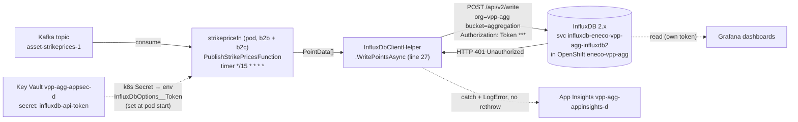
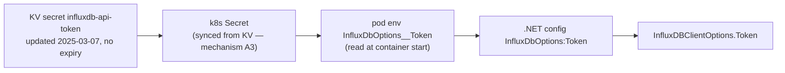

# InfluxDB, and this `unauthorized` incident — from first principles

> **Incident:** `Rec0BJKDCC4CT` — VPPAL `PublishStrikePricesFunction` on **dev-mc** cannot write to InfluxDB (`UnauthorizedException`, HTTP 401).
> **Audience:** you (or an agent) with zero prior InfluxDB knowledge. After this you will understand *what InfluxDB is*, *how it is wired into VPP Aggregation*, and *what is actually failing here* — grounded in live probes, not memory.
> **Evidence base:** `../../../../../../.ai/tasks/2026-07-21-004_vpp-agg-influxdb-unauthorized-devmc/context/01-live-evidence.md`. Labels: **A1** = witnessed (command/file:line), **A2** = inferred, **A3** = blocked/unverified.
> **Reviewed:** 4 independent cross-family adversarial reviewers (omp/GPT-5.6 via Herdr) audited an earlier draft for technical correctness, evidence rigour, completeness, and fix soundness; their findings are folded in (receipts: `../../../../../../.ai/tasks/2026-07-21-004_vpp-agg-influxdb-unauthorized-devmc/adversarial/review-receipts.md`).

## 0. The one-sentence answer

InfluxDB is **rejecting the write credential** the function presents, so it returns **HTTP 401**. The **leading hypothesis (A2)** is that the stored write token is **no longer a valid token in the live InfluxDB instance** — deleted/regenerated, or the org/user/instance was re-initialised. But 401 alone does **not** prove that: a **corrupted or stale-synced token value** (whitespace/encoding/old Kubernetes Secret) and a **mis-scoped token** remain live alternatives until two in-AVD checks run. What it is **not**: an "expired token" (InfluxDB 2.x tokens don't expire by default). And the **first action is to verify the credential chain, not to mint a new token.**

Everything below builds the understanding to trust — and to *bound* — that sentence.

## Glossary (read first if any term is new)

| Term | In this incident |
|------|------------------|
| **VPPAL / VPP Aggregation Layer** | Eneco VPP subsystem that ingests device telemetry/scheduling and publishes derived values (e.g. strike prices). Runs as containers on OpenShift. |
| **MC / dev-mc** | "Managed Cloud", Eneco's Azure estate; `dev-mc` = the development Managed-Cloud environment (VPP sub `839af51e…`). |
| **AVD** | Azure Virtual Desktop — the only place MC OpenShift (`oc`) access is allowed. An agent on a laptop **cannot** run `oc` against MC. |
| **CMC** | The tooling/access request path (ServiceNow `RITM…`) that grants MC OpenShift pod-exec/port-forward. |
| **OpenShift / `oc`** | The Kubernetes distro MC runs on; `oc` is its CLI. dev/acc/prd are OpenShift (manual ArgoCD sync), reachable only via AVD. |
| **KV / RG** | Azure **Key Vault** (secret store) / **Resource Group**. Here KV = `vpp-agg-appsec-d`, RG = `mcdta-rg-vpp-agg-d-res`. |
| **App Insights / App Config** | Azure Application Insights (telemetry/exceptions) / Azure App Configuration (key-values). Both here are private-endpoint. |
| **b2b / b2c** | Two deployment variants of `strikepricefn` (business-to-business / -consumer) — **both** must be considered. |
| **InfluxDB / Grafana** | Time-series database (the write target) / dashboard tool (the read consumer). |
| **Kafka topic `asset-strikeprices-1`** | The input event stream the function consumes each tick; source of the strike prices. Not part of the failure. |
| **org / bucket / token** | InfluxDB 2.x's tenancy / data container / API credential. Here org=`vpp-agg`, bucket=`aggregation`. |

---

## Part 1 — What InfluxDB is (first principles)

### 1.1 The problem a time-series database solves

Ordinary databases (SQL, Cosmos) answer "what is the *current* state of entity X?" A **time-series database (TSDB)** is built for a different shape: a firehose of *timestamped measurements* — "at 12:15:00 device 42's strike price was €0.87; at 12:15:01 …". The workload is **write-heavy/append-only**, **queried by time-range + aggregation**, and **naturally expiring** (retention/downsampling). Forcing this into SQL/Cosmos is slow and expensive; a TSDB indexes it for exactly these patterns. That is *why* VPP Aggregation chose one (Part 2).

### 1.2 The InfluxDB data model

| Concept | Analogy | Notes |
|---------|---------|-------|
| **Measurement** | a SQL table | e.g. `strikeprice` |
| **Tag** | indexed column | strings only; filter/group (`market`, `device`) |
| **Field** | unindexed column | the actual values (`price`) |
| **Point** | one row | measurement + tags + fields + timestamp |
| **Timestamp** | the primary axis | every point has one |

The exact wire format a writer POSTs is **Line Protocol**: `measurement,tagkey=val,tagkey=val fieldkey=val,fieldkey=val timestamp` — **no space** between measurement and tags, **exactly one** space before the field set, and one before the timestamp:

```text
strikeprice,market=mFRR,device=42 price=0.87,valid=true 1750000000000000000
```

*(Conceptually that decomposes into `measurement | tag-set | field-set | timestamp`, but the four parts are joined by the comma/space rules above, not by columns — a payload with stray spaces is rejected.)* The C# client builds this for you from `PointData` objects, which is what `WritePointsAsync` does (Part 3).

### 1.3 InfluxDB 1.x vs 2.x — and why it matters here

| | InfluxDB **1.x** | InfluxDB **2.x** (what we run) |
|---|---|---|
| Container of data | `database` + `retention policy` | **`bucket`** |
| Tenancy | none | **`organization` (org)** |
| Auth | username/password (optional) | **API token** (bearer) |
| Write API | `POST /write?db=` | `POST /api/v2/write?org=&bucket=` |

**How we know it's 2.x:** the failing stack calls `WriteService.PostWriteAsync(String org, String bucket, …)`; the client is `new InfluxDBClient(Host){ Bucket, Org, Token }`; the service is `…influxdb**2**`. `A1`

### 1.4 InfluxDB 2.x authentication — the crux

In 2.x, **every *protected* API call** (including `/api/v2/write`; some health/setup endpoints are unauthenticated) must carry a token:

```text
POST /api/v2/write?org=vpp-agg&bucket=aggregation
Authorization: Token <API_TOKEN>
<line protocol body>
```

Four properties decide this incident:

1. **A token is a random opaque string minted *inside* an InfluxDB instance.** It only means something to the instance/metadata that created it. Delete it, deactivate its owner, or reset the org/user/instance metadata → the same string stops authenticating.
2. **Tokens carry *scopes*** — "all-access", or "write to bucket `aggregation` in org `vpp-agg`". A token can be valid but under-privileged, or scoped to a bucket ID that no longer exists.
3. **Tokens do NOT expire by default.** In self-managed InfluxDB 2.x (OSS), an API token is valid until it is **deleted** or its owner is deactivated — there is no built-in expiry clock. *(Nuance: InfluxDB Cloud and newer builds offer **optional** expiry, but that must be set explicitly; our KV secret has no expiry either.)* This is what makes "the token expired" the wrong frame.
4. **401 vs 403 — read them precisely:**

| HTTP | Meaning | In InfluxDB 2.x |
|------|---------|-----------------|
| **401 Unauthorized** | *authentication* failed | the presented token was **not accepted as a valid credential** — it is **missing, malformed, unknown, or its authorization/owner was deactivated** |
| **403 Forbidden** | *authorisation* failed | the token **is** accepted but **lacks permission** for this org/bucket |

**Important nuance for the *write* endpoint (`POST /api/v2/write`):** InfluxDB 2.x returns **401** not only for a missing/malformed/unknown token but *also* for a **valid token that lacks write permission** to the org/bucket — it does **not** use 403 for insufficient write-scope here ([InfluxData write-API docs](https://docs.influxdata.com/influxdb/v2/api/write-data/)). So our 401 narrows the cause to *the credential* (unknown/deleted **or** corrupted/stale-delivered **or** deactivated **or under-scoped**) but does **not**, on its own, distinguish "unknown token" from "known but can't write here." The only way to tell them apart is to inspect the token's permissions (`influx auth list`) and test the exact bytes — the in-AVD token check plus the credential-chain byte check (§3.4).

---

## Part 2 — How InfluxDB fits into VPP Aggregation (the real system)

### 2.1 Why it exists at all — ADR AL010

InfluxDB here is a **functional-monitoring Proof of Concept** (ADR AL010, Dec 2024; Johnson Lobo was a decider). `A1` VPP Core monitors *pool*-level data; there was **no** device-level monitoring for VPPAL, so the team chose **self-managed InfluxDB → Grafana** for device-level dashboards. The ADR states an accepted risk verbatim: *"If the InfluxDb is down … we could lose the functional data … we accept this risk … rather than hindering the operational performance."*

**Consequence for triage:** InfluxDB here is a **monitoring side-channel**, not the trading hot path. A 401 on writes degrades **dashboards**; it does **not** stop strike-price trading. That sets severity.

### 2.2 The actual write path (verified)

This diagram answers *what talks to what on the write path, and exactly where the 401 lands*. Follow the solid arrows from the Kafka trigger down to the InfluxDB rejection, and note the dotted credential feed from Key Vault:



Reading the diagram (all `A1` unless noted):

- **Trigger:** `strikepricefn` is a containerised Azure Functions worker in **OpenShift** `eneco-vpp-agg` (no Azure Function App exists in the RG). It fires on a **15-minute timer**, the exact cadence of the App Insights failures. It has **two variants: `b2b` and `b2c`.**
- **Target:** InfluxDB **2.x**, in-cluster `http://influxdb-eneco-vpp-agg-influxdb2`, **org `vpp-agg`**, **bucket `aggregation`**.
- **Credential:** the write **token** comes from KV secret **`influxdb-api-token`** → a Kubernetes Secret → the pod env var **`InfluxDbOptions__Token`**.
- **Reader:** Grafana reads with its *own* separate token (`grafana-…-datasource-api-token`). A **writer-token-only** failure does not directly invalidate Grafana — **but** its dashboards are still affected (they show no fresh `aggregation` data), and a broader **org/instance reset** *would* also hit Grafana. So the read path is part of the blast-radius check, not "unaffected".

### 2.3 Where the token lives, and how it reaches the code

This diagram answers *how the token travels from storage into the running process* — the four-hop chain you must reason about before rotating anything, because each hop is a place the credential can go wrong:



- `Program.cs` builds config from the default Functions providers (**environment variables**); it does **not** call `AddAzureAppConfiguration`. So `InfluxDbOptions:Token` is an **env var**, fixed **at container start**. `A1`
- `InfluxDbOptionsValidator` **fails startup if `Token` is empty**. The pod is *running* and only fails at *write time*, so the token is **non-empty** — but "non-empty" is **not** "byte-correct". `A1`
- **Two consequences:** (a) changing the KV secret has no effect until the pod restarts *and* the Kubernetes Secret it reads has actually been re-synced (the KV→Secret mechanism — CSI SecretProviderClass vs ESO — is **`A3 [blocked: AVD/oc]`**); (b) a wrong/whitespace/stale value that *is* non-empty would pass validation and still 401. Both are why §3.4 checks the chain first.

---

## Part 3 — What is actually failing (walk the evidence)

### 3.1 The symptom, precisely

Live App Insights query on `vpp-agg-appinsights-d` (2026-07-21): **12 exceptions, 12:15:01Z → 13:00:02Z**, every 15 minutes, all identical `InfluxDB.Client.Core.Exceptions.UnauthorizedException: unauthorized access` (HTTP 401), ending at `InfluxDbClientHelper.WritePointsAsync … InfluxDbClientHelper.cs:line 27`, from `PublishStrikePricesFunction` / role `strikepricefn`. `A1` (Intake said `PublishStrikePriceFunction`; live name is plural.)

### 3.2 The code at `InfluxDbClientHelper.cs:27` — and a subtlety

```csharp
public async Task WritePointsAsync(IEnumerable<PointData> pointsData, CancellationToken ct)
{
    try { await _writeApiAsync.WritePointsAsync(pointsData.ToArray(), cancellationToken: ct); } // line 27 → 401
    catch (Exception exception)
    {
        logger.LogError(exception, "\nCould not export data to InfluxDb due to exception"); // caught, logged, NOT rethrown
    }
}
```

Line 27 is where the client POSTs the write and InfluxDB rejects the token. The exception is **caught and only logged** — not rethrown. So each run **silently drops its strike-price points** and completes normally. Blast radius = **missing monitoring data in Grafana**, not a crashed function or blocked trading. `A1`

### 3.3 Why the filer's "the api-token is expired" is the wrong frame

1. **InfluxDB 2.x tokens don't expire by default** (§1.4). No clock to trip.
2. KV secret `influxdb-api-token` is **`Enabled=True`, `Expiry=none`**, value **unchanged since 2025-03-07 (>16 months)**. `A1` A static, unexpiring, enabled secret cannot "just expire".
3. If the token were *empty*, the pod would **fail startup validation**, not run-then-401. `A1`
4. The failure is **401** — and on the write endpoint that means the credential was rejected as unknown **or** as lacking write permission (§1.4); either way it is a credential-identity/permission problem, not an expiry. `A1`

So "expired" is out. What remains is *why the presented credential is rejected* — the next two sections.

### 3.4 Leading hypothesis — and the check that must come first

**Leading hypothesis (`A2`):** the token in `influxdb-api-token` (static since 2025-03-07) **is no longer a valid token in the current InfluxDB instance** — deleted/regenerated, or the org/user/instance was re-initialised, orphaning it → 401.

Two things keep this **A2, not fact**:

- **The onset is not telemetry-confirmed.** Live telemetry proves failures only on 2026-07-21; the "> 1 month" duration is the **filer's statement + a 2026-07-07 screenshot** (App Insights retention aged out older rows) — `A2`, not `A1`. The premise "a static credential started failing, so the *server* changed" only holds **if the exact stored credential ever wrote successfully**. If it was invalid from first injection, or a stale Kubernetes Secret was pushed, no server-side change is required. **Resolve by finding the *last successful write*** (longer-retention Log Analytics/OpenShift logs, or Grafana's last fresh `aggregation` point per variant).
- **The credential chain is unverified.** "Non-empty" ≠ "byte-correct at the pod" (§2.3).

**Therefore the FIRST diagnostic step is not "mint a new token" — it is to check the credential chain (no value ever printed):**

1. Compare **length + a one-way hash** of the token at three points: KV `influxdb-api-token`, the Kubernetes Secret, and the running pod's env. A mismatch ⇒ the fault is **secret delivery/sync**, and rotating the InfluxDB token would *not* fix it.
2. Inspect for a **trailing newline / whitespace / encoding** difference (a classic cause of "non-empty but rejected").
3. Test the **exact pod-supplied token** against InfluxDB (`/api/v2/write` dry write, or `influx auth list`). Then branch (§4).

### 3.5 Ranked competing hypotheses (do not mark "ruled out" until the probe runs)

| # | Hypothesis | Rank | Evidence for/against | Discriminating probe |
|---|-----------|------|----------------------|----------------------|
| H1 | Stored token deleted/regenerated in InfluxDB (orphaned) | **Leading (A2)** | KV static since 2025-03; onset reported server-side | `influx auth list` in-AVD: is the pod's token present/active? |
| H2 | Token value corrupted / stale Kubernetes Secret (byte mismatch, whitespace) | **High (A2)** | validator only checks non-empty; KV→Secret sync `A3` | length+hash parity KV vs Secret vs pod env (§3.4) |
| H3 | org `vpp-agg` or bucket `aggregation` deleted/re-created (token valid but target gone) | Medium (A2) | related ticket touched collections; would often be 404/403 not 401, but a re-init resets tokens too | in-AVD: `influx org list` / `influx bucket list` |
| H4 | Token valid but **mis-scoped** (no write to `aggregation`) | **Medium (A2)** | on the write endpoint 401 *also* covers insufficient permission, so it does NOT exclude this | token permissions in `influx auth list`; a known write-scoped token succeeds |
| H5 | Admin/API-token confusion (wrong secret wired) | Low | separate `influxdb-admin-token` exists | compare which secret the pod env resolves to |
| H6 | InfluxDB pod down / DNS / network to the service | **Very low** | we received an HTTP **401** — the service answered | (only if H1-H5 fail) pod health, DNS |
| H7 | Timestamp precision / clock error | Very low | server rejected at auth, before parsing the body | n/a unless auth passes |

### 3.6 Blast-radius matrix (who else writes with this token)

`strikepricefn` is one writer; the KV secret `influxdb-api-token` is likely **shared** by other VPPAL InfluxDB writers. Only `strikepricefn` was visible in the retained App Insights window, so the rest is **`A3`** — enumerate it in-AVD before/after the fix, and **do not assume both strike-price variants failed** from one role's telemetry.

| Writer / consumer | Variant | Uses `influxdb-api-token`? | Last success | Currently 401? | Action |
|-------------------|---------|---------------------------|--------------|----------------|--------|
| `strikepricefn` | **b2b** | expected (verify) | A3 | A3 (role telemetry not split) | roll after fix, verify per variant |
| `strikepricefn` | **b2c** | expected (verify) | A3 | A3 | roll after fix, verify per variant |
| telemetry / data-ingestion fns | — | **A3 — verify** | A3 | A3 | include if they share the secret |
| Grafana (reader) | — | **no** (separate read token) | — | dashboards stale (no writes) | check read token + a query after fix |

### 3.7 What is still unproven (needs in-AVD `oc` — cannot run from a laptop) — `A3 [blocked: AVD/oc]`

- Whether org `vpp-agg` + bucket `aggregation` exist and whether the pod's token is a known/active/write-scoped token there.
- The exact credential bytes at KV vs Kubernetes Secret vs pod env (H2).
- The KV→Kubernetes-Secret **sync mechanism** (CSI SecretProviderClass vs ESO) and the exact Secret/key name.
- Which **other** writers/variants also 401 (§3.6).

The fix's first steps (§4) are exactly these probes.

---

## Part 4 — What the fix must therefore be (shape only; full runbook = the how-to-fix doc)

> The complete, step-by-step runbook (exact AVD entry, `oc` commands, safe secret handling, decision tree) is the sibling **[how-to-fix / feynman](./how-to-fix.md)** deliverable. This section is the *shape* and the safety rails.
>
> **You still need (not obtainable from this doc):** AVD access to MC OpenShift; `oc` rights (pod-exec/port-forward) in `eneco-vpp-agg` for your identity (CMC `RITM0191780` — verify it applies to *you*); KV write rights on `vpp-agg-appsec-d`; the exact live deployment names for b2b/b2c; and the owner of the KV→Secret sync mechanism.

Because the fault is a **rejected write credential** delivered as a **start-time env var**, the fix has a fixed, safety-gated shape:

0. **Check the credential chain FIRST (§3.4)** — length+hash parity KV vs Kubernetes Secret vs pod env, and whitespace/encoding. *Byte mismatch → the fix is repairing secret delivery, NOT minting a token.*
1. **In-AVD InfluxDB probe** (`oc port-forward` to `influxdb-eneco-vpp-agg-influxdb2`; authenticate with `influxdb-admin-token`/`-password`): confirm org `vpp-agg` + bucket `aggregation` exist; `influx auth list` — is the pod's exact token present/active/write-scoped? This decides H1–H5.
2. **Branch on the result:**
   - **Token unknown/inactive (H1):** mint a **new, named, write-only** token scoped to org `vpp-agg` / bucket `aggregation`. *(Create side-by-side; do not revoke the old one yet.)*
   - **Byte mismatch (H2):** repair the KV→Secret delivery; re-test before minting anything.
   - **org/bucket ABSENT (H3): HALT and escalate.** This is stateful recovery (IDs, retention, dashboards, possible data loss) — **not** part of a token fix. Capture instance/PV/org/bucket inventory + change history and get Aggregation + Platform authorization for a *separate* plan. **Do NOT delete/recreate an org, bucket, collection, user, or the instance** (that is the *other* ticket's action — do not import it here).
3. **Store the new token in KV `vpp-agg-appsec-d/influxdb-api-token`** — never echo it into Slack/logs/history. Credential change → coordinate Aggregation + Platform.
4. **Propagate, then restart — in that order, proven:** force/await the KV→Kubernetes-Secret reconcile (CSI rotation / ESO refresh), and **prove the Secret changed** (metadata + hash, no value printed) *before* rolling. Then `oc rollout restart` **only the confirmed consumers** — **b2b and b2c**, plus any other writer §3.6 shows sharing the secret — **one at a time**, checking `oc rollout status` + a healthy new pod before the next. *(A restart alone can reload the OLD token if the Secret wasn't re-synced — the #1 silent non-fix.)*
5. **Verify by EFFECT, per variant — not by exit code:**
   - the **newly minted write-only token** (not admin, not Grafana) writes a uniquely-timestamped point to org `vpp-agg`/bucket `aggregation` and reads it back;
   - after each rollout, a scheduled invocation that **actually writes points** runs *after* the new pod's start time with **no** new `UnauthorizedException` — verified **per pod** via `cloud_RoleInstance` (both b2b and b2c share `cloud_RoleName=strikepricefn`, so a role-level check can't tell them apart, and an empty-data window gives no write *and* no error);
   - Grafana shows a **fresh timestamp for the `aggregation` measurement per affected writer** (corroboration only — a fresh point from another writer does not count).
   - Only after all consumer gates pass, revoke the old token **by confirmed token ID**.

### Credential roles — least privilege (do not mix these)

| Secret | Role | Rule in this fix |
|--------|------|------------------|
| `influxdb-api-token` | VPPAL **write** token | the ONLY secret you replace; write-only scope; create-before-revoke |
| `influxdb-admin-token` / `-password` | InfluxDB **admin** | use ONLY to inspect/mint; NEVER copy into `influxdb-api-token` |
| `grafana-…-datasource-api-token` | Grafana **read** | leave untouched |

---

## Evidence ledger

| # | Claim | Label |
|---|-------|-------|
| 1 | 401 InfluxDB writes live today (12×, 12:15–13:00Z, every 15 min), `strikepricefn`/`PublishStrikePricesFunction`, at `InfluxDbClientHelper.cs:27` | A1 |
| 2 | System is InfluxDB **2.x** (org/bucket/token API; svc `…influxdb2`) | A1 |
| 3 | `strikepricefn` is a container in OpenShift (no Azure Function App in the RG); has b2b + b2c variants | A1 |
| 4 | Target: host `influxdb-eneco-vpp-agg-influxdb2`, org `vpp-agg`, bucket `aggregation`; input topic `…asset-strikeprices-1` | A1 |
| 5 | Token source: KV `influxdb-api-token` → env `InfluxDbOptions__Token`; config is env-based (no App Config) | A1 |
| 6 | KV→Kubernetes-Secret sync mechanism (CSI vs ESO) and exact bytes at the pod | A3 [blocked: AVD/oc] |
| 7 | `influxdb-api-token` Enabled, no expiry, unchanged since 2025-03-07 | A1 |
| 8 | Write helper catches+logs the 401, no rethrow → silent data loss, function completes | A1 |
| 9 | On the InfluxDB 2.x write endpoint, 401 = token missing/invalid/unknown/inactivated **or a valid token lacking write permission** to the org/bucket (403 is not used for write-scope here) | A1 (vendor docs) |
| 10 | InfluxDB 2.x OSS tokens do not expire by default (the `expires` field is optional) — per [InfluxData docs](https://docs.influxdata.com/influxdb/v2/admin/tokens/); whether THIS token has an explicit expiry set is unverified until `influx auth list` | vendor-doc / A2 (this instance) |
| 11 | Leading cause: stored token orphaned by an InfluxDB-side reset/regeneration | A2 |
| 12 | Alternatives still open: corrupted/stale-synced token bytes (H2), org/bucket deleted (H3), mis-scope (H4) | A2 / A3 |
| 13 | ">1 month" onset (filer + 2026-07-07 screenshot; not telemetry) | A2 |
| 14 | Possible link to `Rec0BGG7SPERE` (delete/recreate collection, dev-mc/acc, datatype mismatch — from the intake corpus); connection unproven | A2 |
| 15 | InfluxDB-internal token/org/bucket state; other writers' blast radius | A3 [blocked: AVD/oc] |

```text
Visual coverage: write-path topology / where-the-401-lands → §2.2 flowchart (Kafka → function → InfluxDB, the rejected arrow); credential chain of custody → §2.3 flowchart (KV → k8s Secret → pod env, fixed at start).
Angles excluded: no timeline diagram because the failure is a static-state condition — a stored credential that InfluxDB either accepts or rejects, unchanged since 2025-03-07 — with no evolution to plot (the incident dates sit in the evidence ledger); no feedback-loop diagram because the write path is open-loop — a failed write is caught-and-logged at InfluxDbClientHelper.cs:27 with no retry and no effect on the pod or on Kafka, so there is no loop to draw.
```

## Self-test (you understand this if you can answer)

1. On the InfluxDB 2.x *write* endpoint, what does a 401 include that surprises people, and what does it therefore *not* let you conclude? *(It includes a valid token that simply lacks write permission to the org/bucket — 403 is not used for write-scope here. So 401 narrows the cause to the credential but does NOT distinguish unknown/deleted vs corrupted/stale-delivered vs deactivated vs under-scoped — that needs `influx auth list` + the byte-parity check.)*
2. The KV secret hasn't changed since March 2025. Why does that point to a server-side change *only if* one extra fact holds? *(Only if that exact stored credential ever wrote successfully; if it was invalid-from-injection or a stale Secret was pushed, no server change is needed — so find the last successful write.)*
3. After you put a new token in Key Vault, name the two things that must both be true before writes recover. *(The Kubernetes Secret must actually re-sync to the new value, AND the pod must restart to re-read the env var — restart alone can reload the old token.)*
4. When would minting a new InfluxDB token be the *wrong* first move? *(When the credential chain shows a byte mismatch (H2) or the org/bucket is missing (H3) — then you're fixing secret delivery or escalating a stateful recovery, not rotating a token.)*
5. Trading is fine but Grafana is stale — what is InfluxDB responsible for here, and why is "Grafana unaffected" too strong? *(Monitoring only — ADR AL010 side-channel; but Grafana dashboards ARE affected because the writes are missing, and an org/instance reset could hit its read token too.)*
