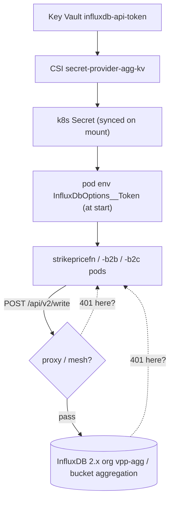
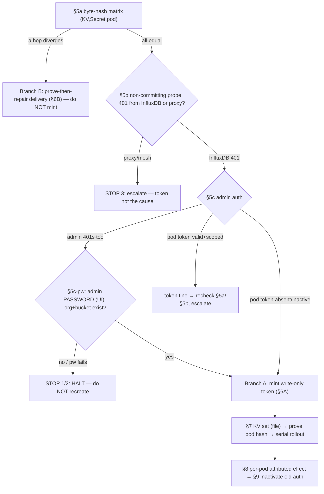

# RUNBOOK: `PublishStrikePricesFunction` cannot write to InfluxDB (401), dev-mc

## 0. How to use this runbook

**You** are the on-call operator, in **one AVD WSL shell** where both `oc` (logged into MC OpenShift dev) and `az` (dev-mc) work. Each step below is: **why** (the mechanism, so you understand it) → **command** (paste it) → **read the output** → **decide** (the branch). You are the judgment at every diamond — the runbook makes the choice obvious, it does not hide it. Run everything in the **same shell** so variables carry between steps.

**Prime directive — fail closed.** Paste this once at the top. It hardens the shell (secrets out of history, strict errors) and installs a cleanup trap so a mistake never leaves a token, an open firewall, or a tunnel behind:

```bash
set -Eeuo pipefail; set +o history 2>/dev/null || true; set +x; umask 077   # +x keeps expanded secrets out of any stderr trace
SUB=839af51e-c8dd-4bd2-944b-a7799eb2e1e4; DEV_API=https://api.eneco-vpp-dev.ceap.nl:6443
NS=eneco-vpp-agg; KV=vpp-agg-appsec-d; APPID=9ccf7dac-2934-4dd6-9a98-4058000c1178
KV_RULE_ADDED=0; KV_MUTATED=0; PF_PID=""; OLDTOK=""; ADDED_IP=""; NEWF=""
cleanup() { local rc=$?
  [ -n "$PF_PID" ] && { kill "$PF_PID" 2>/dev/null; wait "$PF_PID" 2>/dev/null; } || true
  [ "$KV_MUTATED" = "1" ] && [ -s "$OLDTOK" ] && az keyvault secret set --subscription "$SUB" --vault-name "$KV" --name influxdb-api-token --file "$OLDTOK" -o none 2>/dev/null || true
  [ "$KV_RULE_ADDED" = "1" ] && az keyvault network-rule remove --subscription "$SUB" --name "$KV" --ip-address "$ADDED_IP" -o none 2>/dev/null || true
  [ -n "$OLDTOK" ] && rm -f "$OLDTOK" 2>/dev/null || true
  [ -n "$NEWF" ] && rm -f "$NEWF" 2>/dev/null || true
  unset INFLUX_TOKEN NEW_TOKEN 2>/dev/null || true
  return $rc; }
trap cleanup EXIT
# every oc MUTATION goes through ocx: it re-asserts you are still on dev before acting (contexts can drift)
ocx() { [ "$(oc whoami --show-server 2>/dev/null)" = "$DEV_API" ] || { echo "NOT on dev-mc — refusing"; return 1; }; oc -n "$NS" "$@"; }
# run influx INSIDE the InfluxDB pod with the token via STDIN (never in argv/env-on-argv):
influx_exec() { printf '%s\n' "$INFLUX_TOKEN" | ocx exec -i "$INFLUXPOD" -- sh -c 'IFS= read -r INFLUX_TOKEN; export INFLUX_TOKEN; exec influx "$@"' sh "$@"; }   # routed through ocx: re-asserts dev before every influx call
```

**What you are fixing:** InfluxDB refuses (HTTP 401) every write from the strike-price functions. You will find the *specific* faulty link and repair only that — without rotating a credential that was never the fault, restarting before the secret re-syncs, recreating data-bearing objects, or declaring "fixed" on a signal that can't see the second variant.

**Companion documents (read for depth — not required to execute):**
- Why / first principles: [`explanation.md`](./explanation.md) · Full RCA: [`rca.md`](./rca.md)
- Probed evidence ledger: [`../../../../../../.ai/tasks/2026-07-21-004_vpp-agg-influxdb-unauthorized-devmc/context/01-live-evidence.md`](../../../../../../.ai/tasks/2026-07-21-004_vpp-agg-influxdb-unauthorized-devmc/context/01-live-evidence.md)

**HARD STOP conditions (halt; escalate §11):** (1) org `vpp-agg` or bucket `aggregation` missing → data-loss recovery, not a token fix. (2) You can authenticate with neither the admin token nor the admin password. (3) The 401 comes from a proxy/mesh, not InfluxDB. (4) Any §2 assertion fails. (5) A hash mismatch persists after one extra rollout, or any writer can't be shown a post-rollout success.

**Never:** print a token to stdout/file/history; put a token in a command argument (`--value`, `--token`, `-H "Authorization:…"` in argv) — use stdin, `--file`, or the `influx_exec` helper; reuse the admin token as the app write token; **delete** an authorization (use reversible `inactive`); recreate an org/bucket/collection/user; touch acc or prd.

## Knowledge Contract

After this runbook you can: **draw** the token's chain of custody and the four places a 401 is born; **trace** a refused write to the faulty link before touching any link; **diagnose** among orphaned-token / stale-delivery / missing-org-bucket / proxy; **reject** the rotate-first and restart-first reflexes and the recreate-the-bucket trap; **verify** recovery per pod by an attributed observed effect, not a false-passing "no error"; and **defend** the HALT decision when the admin credential is dead or the org/bucket is gone.

## 1. Identifiers (everything, verbatim)

| Thing | Value |
|-------|-------|
| Subscription (dev-mc VPP) | `839af51e-c8dd-4bd2-944b-a7799eb2e1e4` (`$SUB`) · RG `mcdta-rg-vpp-agg-d-res` |
| App Insights | `vpp-agg-appinsights-d`, appId `9ccf7dac-2934-4dd6-9a98-4058000c1178` (`$APPID`) |
| Key Vault | `vpp-agg-appsec-d` (`$KV`); Deny-by-default firewall; access-policy model |
| KV secrets | write: `influxdb-api-token` · admin: `influxdb-admin-token` / `influxdb-admin-password` · Grafana read (never touch): `grafana-influxdb-v2-influxql-datasource-api-token` |
| OpenShift dev / namespace | `https://api.eneco-vpp-dev.ceap.nl:6443` (`$DEV_API`) / `eneco-vpp-agg` (`$NS`) |
| InfluxDB service / org / bucket | `influxdb-eneco-vpp-agg-influxdb2` (:80→local :8086) / `vpp-agg` / `aggregation` |
| CSI secret sync | SecretProviderClass `secret-provider-agg-kv` (`secrets-store.csi.k8s.io`, mount `/mnt/secrets-store`), ArgoCD app `secretprovider` |
| App config → pod env | `InfluxDbOptions:Token` → env `InfluxDbOptions__Token` (read at container **start** only) |
| Known strike-price writers (share token + role `strikepricefn`) | ArgoCD apps `strikepricefn`, `strikepricefn-b2b`, `strikepricefn-b2c` |
| Other writer that sets the same InfluxDbOptions | `telemetryingestionfn` (+`-b2b`/`-b2c`); possibly `telemetryaggregationfn`, `dataingestionfn` — §4 discovers the real set |
| In-AVD login | `ocdev` → paste `oc login --token=… --server=$DEV_API` at the hidden prompt; `oc` at `/usr/local/bin/oc`; **no `influx` CLI on the host** (runs via `oc exec`) |

## Mental model 1 — where a 401 can come from

Hold this before running anything; it is why §5 checks the links in this order.



The token crosses four hops (KV → CSI → k8s Secret → pod env), then a possible proxy, before InfluxDB. A 401 can be born from a bad copy at any hop, at a proxy, or at InfluxDB itself. **First principle: a client-side `UnauthorizedException` names the HTTP code, not its source** — so prove *which* link refuses before you change any link. That single rule is the whole safety story: §5a checks the copies, §5b checks the proxy, §5c checks InfluxDB, and only then does §7 mutate.

## Mental model 2 — which finding routes to which repair

This is the same system seen from the *decision* angle: each diamond is a §5 probe **you** run and read; each terminal is a repair branch or a labelled STOP.



**Read it:** no path reaches §7 — the first mutation — without first passing the byte-hash matrix, the proxy check, and the auth check. Every terminal is a concrete action or a labelled STOP; there are no dead ends. Keep this: *diagnosis → smallest reversible repair → verify → reversible disable*, never rotate-first.

---

## 2. Preflight — pin the environment and prove access (each check exits on failure)

**Why:** the namespace and workload names are identical on dev/acc/prd, and a shared `az` default can drift — so "I think I'm on dev" is not enough; assert it, or you could mutate the wrong environment.

```bash
az account set --subscription "$SUB"
[ "$(az account show --query id -o tsv)" = "$SUB" ] || { echo "WRONG SUB; STOP"; exit 1; }
oc whoami --show-server | grep -qx "$DEV_API" || { echo "NOT dev-mc — run ocdev; STOP"; exit 1; }
oc get ns "$NS" -o name >/dev/null && oc project "$NS" >/dev/null
# OpenShift RBAC you will need (request CMC RITM0191780 if any is 'no'):
for c in "get pods" "list pods" "get deploy" "list deploy" "watch deploy" "get secret" "get secretproviderclass" \
         "list secretproviderclasspodstatuses" "get services" "create pods/exec" "create pods/portforward" "patch deploy"; do
  oc auth can-i $c -n "$NS" >/dev/null || { echo "MISSING oc perm: $c; STOP"; exit 1; }
done
# Azure data-plane you will need (App Insights read, KV get/set, firewall rule): probe get; set/network-rule are exercised live in §2b/§7.
az extension add -n application-insights -y >/dev/null 2>&1 || true
# reach KV; if firewalled, add THIS host's IP (only if absent) and record ownership for the trap
if ! az keyvault secret show --subscription "$SUB" --vault-name "$KV" --name influxdb-api-token --query attributes.enabled -o tsv 2>/dev/null; then
  ADDED_IP=$(curl -s https://api.ipify.org)
  az keyvault network-rule list --subscription "$SUB" --name "$KV" --query "ipRules[].value" -o tsv | grep -qx "$ADDED_IP/32" \
    || { az keyvault network-rule add --subscription "$SUB" --name "$KV" --ip-address "$ADDED_IP" -o none; KV_RULE_ADDED=1; sleep 25; }
  az keyvault secret show --subscription "$SUB" --vault-name "$KV" --name influxdb-api-token --query attributes.enabled -o tsv \
    || { echo "KV still unreachable; STOP"; exit 1; }
fi
```

## 3. Baseline — is the fault live, and is the workload even running?

**Why:** you must not rotate a credential to "fix" a symptom that isn't currently happening, and a run that emits *no* row is not the same as a run that *succeeded*. Count **invocations** (from `requests`) separately from **unauthorized** (from `exceptions`):

```bash
az monitor app-insights query --subscription "$SUB" --app "$APPID" --analytics-query \
"union withsource=Src requests, exceptions | where timestamp > ago(45m) and cloud_RoleName=='strikepricefn'
 | summarize invocations=countif(Src=='requests'), unauthorized=countif(Src=='exceptions' and (outerMessage has 'InfluxDb' or outerMessage has 'Unauthorized')) by cloud_RoleInstance" -o table
```

**Decide:** `unauthorized>0` on any instance → fault live, continue. Zero unauthorized with `invocations>0` → it may already be fixed; verify with §8 and close. Both zero → widen to `ago(1d)`; still nothing → **not reproducing** — do not mutate; watch one future scheduled run (§8 method) or escalate "not reproducible" (§11).

## 4. Discover the exact objects (structural, cardinality-checked)

**Why:** every later step (hash, roll, verify, revoke) must act on the *authoritative* secret and the *complete* writer set — a guessed set means a missed writer keeps 401ing, or a revoke breaks it. Select structurally (the real env→secret linkage), not by string-match, and demand exactly one secret mapping:

```bash
read -r K8S_SECRET SECRET_KEY < <(oc -n "$NS" get secretproviderclass secret-provider-agg-kv -o json | jq -er '
  [.spec.secretObjects[]? as $so | $so.data[]? | select(.objectName=="influxdb-api-token") | [$so.secretName,.key]]
  | if length==1 then .[0]|@tsv else error("expected exactly one influxdb-api-token secret mapping") end') || { echo "STOP: secret mapping"; exit 1; }

# every Deployment whose pod env InfluxDbOptions__Token comes from that secret (structural, not string-match)
mapfile -t WRITERS < <(oc -n "$NS" get deploy -o json | jq -r --arg s "$K8S_SECRET" '
  .items[] | select(any(.spec.template.spec.containers[]?; any(.env[]?; .name=="InfluxDbOptions__Token" and .valueFrom.secretKeyRef.name==$s))) | .metadata.name' | sort -u)
printf 'WRITERS to roll/verify/rotate:\n'; printf '  %s\n' "${WRITERS[@]}"
# sanity: the known strike-price trio must be present; also check for other InfluxDB-writing kinds you must handle by hand
for w in strikepricefn strikepricefn-b2b strikepricefn-b2c; do printf '%s\n' "${WRITERS[@]}" | grep -qx "$w" || echo "WARNING: expected writer '$w' NOT in the set — confirm it is intentionally absent before you revoke in §9"; done
printf '%s\n' "${WRITERS[@]}" | grep -qx strikepricefn || { echo "strikepricefn missing from writer set — investigate; STOP"; exit 1; }
echo "ALSO check non-Deployment writers (CronJob/StatefulSet/Job) that mount $K8S_SECRET:"
oc -n "$NS" get cronjob,statefulset,job -o json | jq -r --arg s "$K8S_SECRET" '.items[]|select([..|strings]|any(.==$s or .=="InfluxDbOptions__Token"))|"\(.kind)/\(.metadata.name)"'

# the single Ready InfluxDB pod
mapfile -t IPODS < <(oc -n "$NS" get pods -o json | jq -r '.items[]|select(.metadata.name|test("influxdb"))|select(.status.phase=="Running")|select(any(.status.containerStatuses[]?;.ready))|.metadata.name')
[ "${#IPODS[@]}" -eq 1 ] || { echo "expected exactly 1 Ready influxdb pod, got ${#IPODS[@]}; STOP"; exit 1; }
INFLUXPOD="${IPODS[0]}"
```

If the CronJob/StatefulSet/Job line prints anything, add those to your mental roll/verify/revoke list and handle them with the kind-appropriate restart (a CronJob has no rollout — its next scheduled run picks up the new token; a StatefulSet uses `rollout restart` too).

## 5. Diagnose (cheap, safe, no writes, no token in argv)

### 5a. Byte-hash matrix — which hop diverges? (first principle: non-empty ≠ correct)

**Why:** the pod's token is non-empty (the app validates that at start), but a stale synced Secret or a trailing newline 401s identically. Hash each copy **byte-exactly** (no `tr -d '\n'` — that would erase the very corruption you're hunting):

```bash
POD_HASH=$(oc -n "$NS" exec deploy/strikepricefn -- sh -c 'printf "%s" "$InfluxDbOptions__Token" | sha256sum' | awk '{print $1}')
KS_HASH=$(oc -n "$NS" get secret "$K8S_SECRET" -o json | jq -rje --arg k "$SECRET_KEY" '.data[$k] // error("key missing")' | base64 -d | sha256sum | awk '{print $1}')
KV_HASH=$(az keyvault secret show --subscription "$SUB" --vault-name "$KV" --name influxdb-api-token -o json | jq -rje '.value // error("no value")' | sha256sum | awk '{print $1}')
echo "POD=$POD_HASH  K8S=$KS_HASH  KV=$KV_HASH"
```

**Decide:** all three equal → the same token reaches the pod intact → §5b. **Any pair differs** → a delivery hop is corrupt → **Branch B (§6B)**. Note *which* hop: `KV≠K8S` = the CSI sync is stale/wrong; `K8S≠POD` = the pod predates the last sync (a rollout fixes it). Do **not** assume KV is the good copy — §6B tests which copy the server accepts.

### 5b. Non-committing 401-origin probe (a read, never a write)

**Why:** the C# client throws `UnauthorizedException` on *any* 401; a proxy/mesh in front of InfluxDB would 401 identically. A **read** (`GET /buckets`) tests auth without storing a point, and the response headers reveal who answered:

```bash
oc -n "$NS" exec deploy/strikepricefn -- sh -c '
  b=/tmp/b.$$; h=/tmp/h.$$
  printf "Authorization: Token %s\n" "$InfluxDbOptions__Token" | curl -sS -o "$b" -w "%{http_code}\n" -D "$h" -H @- "http://influxdb-eneco-vpp-agg-influxdb2/api/v2/buckets?org=vpp-agg&limit=1"
  rc=$?; echo "---HEADERS---"; cat "$h" 2>/dev/null; rm -f "$b" "$h"; exit "$rc"'
```

**Decide by status + headers:** `200` → the pod token authenticates and can *read* — but the **write** endpoint can still 401 on write-scope, so go to §5c and inspect the token's *permissions*; do not conclude "token fine" yet. `401` with InfluxDB headers (no `Server: envoy`/`oauth2-proxy`, no HTML challenge) → InfluxDB refused it → §5c. `401` with a proxy/mesh `Server` header or HTML challenge → **STOP 3**. Anything else → capture and **STOP**.

### 5c. Inspect InfluxDB — admin auth via stdin, and the dead-admin branch

**Why:** decide among "token orphaned", "org/bucket gone", "token fine". The token flows via **stdin** into `influx_exec` (never argv/env-on-argv). If the admin token *also* 401s, that is the strongest signal the whole instance/org was re-initialised:

```bash
INFLUX_TOKEN=$(az keyvault secret show --subscription "$SUB" --vault-name "$KV" --name influxdb-admin-token --query value -o tsv)
if ! ORG_JSON=$(influx_exec org list --host http://localhost:8086 --json 2>/tmp/e.$$); then
  echo "admin TOKEN failed ($(cat /tmp/e.$$)) — instance likely re-initialised → §5c-pw"; rm -f /tmp/e.$$
elif ! printf '%s' "$ORG_JSON" | jq -e 'type=="array"' >/dev/null; then echo "unexpected org JSON; STOP"; exit 1
else rm -f /tmp/e.$$
  ORGID=$(printf '%s' "$ORG_JSON" | jq -r '.[]|select(.name=="vpp-agg").id'); [ -n "$ORGID" ] || { echo "org vpp-agg gone; STOP 1"; exit 1; }
  BUCKETID=$(influx_exec bucket list --host http://localhost:8086 --org vpp-agg --json | jq -r '.[]|select(.name=="aggregation").id'); [ -n "$BUCKETID" ] || { echo "bucket gone; STOP 1"; exit 1; }
  # match the pod's token to ONE authorization ID by hash (sha256 outside jq — jq has no @sha256)
  OLD_AUTH_ID=$(influx_exec auth list --host http://localhost:8086 --json | jq -r '.[]|select((.token?//"")!="")|[.id,(.token|@base64)]|@tsv' \
    | while IFS=$'\t' read -r id b64; do if [ "$(printf %s "$b64" | base64 -d | sha256sum | awk '{print $1}')" = "$POD_HASH" ]; then printf '%s\n' "$id"; fi; done) || true
  case "$OLD_AUTH_ID" in ""|*$'\n'*) echo "old auth not uniquely identifiable — will NOT revoke in §9"; OLD_AUTH_ID="";; esac
fi
```

> Newer InfluxDB stores tokens hashed, so `auth list` may omit the token value — then `OLD_AUTH_ID` stays empty and §9 leaves the old token in place (safe). Never guess the old auth by its description.

**§5c-pw — admin token dead (this branch needs YOU at the InfluxDB UI):**

```bash
ocx port-forward svc/influxdb-eneco-vpp-agg-influxdb2 8086:80 >/tmp/pf.log 2>&1 & PF_PID=$!
sleep 3; kill -0 "$PF_PID" 2>/dev/null && curl -sf http://localhost:8086/health >/dev/null || { echo "port-forward/InfluxDB not reachable on :8086; STOP"; exit 1; }
# copy the admin password to the Windows clipboard (never printed), paste into the UI at http://localhost:8086 (user 'admin'), then clear the clipboard:
az keyvault secret show --subscription "$SUB" --vault-name "$KV" --name influxdb-admin-password --query value -o tsv | tr -d '\n' | clip.exe
# ... paste + log in ... then:  printf '' | clip.exe
```

In the UI: confirm org `vpp-agg` + bucket `aggregation` exist. If yes → create a **write-only** token for bucket `aggregation`, **and** (so §8 can query) create/read an all-access admin token; capture the write token with `read -rs NEW_TOKEN` and set `INFLUX_TOKEN` to the working admin token, then go to §7. If the password fails, or org/bucket are gone → **STOP 1/2**.

**Branch decision:** admin works + pod token absent/inactive → §6A. admin works + pod token present & write-scoped → **STOP 3-adjacent** (token fine; recheck §5a/§5b, escalate). admin dead + password works → §5c-pw → §7. admin dead + password fails → STOP 2.

## 6. Repair — exactly one branch (you chose it in §5)

### Branch A — mint a new write-only token (orphaned/inactive; admin works)

```bash
NEW_JSON=$(influx_exec auth create --host http://localhost:8086 --org vpp-agg \
  --description "vpp-agg write token rotated Rec0BJKDCC4CT" --write-bucket "$BUCKETID" --json)
NEW_TOKEN=$(printf '%s' "$NEW_JSON" | jq -r '.token'); NEW_AUTH_ID=$(printf '%s' "$NEW_JSON" | jq -r '.id'); NEW_JSON=
[ -n "$NEW_TOKEN" ] && [ -n "$NEW_AUTH_ID" ] || { echo "create failed; STOP"; exit 1; }
# proof-before-promotion: the new token can actually write its bucket (tagged so §8 excludes it)
printf '%s\n' "$NEW_TOKEN" | ocx exec -i "$INFLUXPOD" -- sh -c 'IFS= read -r T; INFLUX_TOKEN="$T" influx write --host http://localhost:8086 --org vpp-agg --bucket aggregation "runbook_probe,run=Rec0BJKDCC4CT verify=1"' \
  && echo "new token writes OK" || { echo "new token cannot write — do NOT promote; STOP"; exit 1; }
```

### Branch B — prove-then-repair delivery (a hop diverged; do NOT mint)

**Why:** a mismatch does not tell you which copy is *good*. Test each candidate copy against InfluxDB via a read, then repair toward the accepted one:

```bash
# test the POD's current token (from §5b it already 401s) vs the KV copy: read KV, try it as a read
KVTOK=$(az keyvault secret show --subscription "$SUB" --vault-name "$KV" --name influxdb-api-token --query value -o tsv)
printf 'Authorization: Token %s\n' "$KVTOK" | oc -n "$NS" exec -i "$INFLUXPOD" -- sh -c 'cat > /tmp/hh; curl -sS -o /dev/null -w "%{http_code}\n" -H @/tmp/hh "http://localhost:8086/api/v2/buckets?org=vpp-agg&limit=1"; rm -f /tmp/hh'; KVTOK=
```
`200` → the KV copy is good; the pod/Secret is stale → set `NEW_KV_HASH="$KV_HASH"` and run **only** §7's rollout+prove loop (do **not** run §7's checkpoint/`secret set` sub-block — KV is already correct), then §8. `401` from InfluxDB → the KV copy is *also* bad → this is not pure delivery; go to §6A (mint). If neither copy is accepted and the admin path works, mint (§6A). If nothing converges → capture `oc -n "$NS" get secretproviderclasspodstatus -o wide` and **escalate** to the `secretprovider` (Platform) owner.

### Branch C — HALT: org/bucket gone or no auth possible (STOP 1/2). Escalate; never recreate.

## 7. Apply (Branch A / §5c-pw) — update, roll serially, prove each pod, with rollback

**Why the order:** the token is an env var fixed at container start; the CSI Secret re-syncs on pod *mount*. So you update KV, then a rollout both re-mounts (syncing the Secret) and restarts (re-reading the env). You then **prove** each new pod carries the new bytes — a restart alone can race the sync and reload the old token.

```bash
# checkpoint for rollback (download by --id into a mode-600 file — never the token in argv)
OLD_KV_VER=$(az keyvault secret show --subscription "$SUB" --vault-name "$KV" --name influxdb-api-token --query id -o tsv)
OLDTOK=$(mktemp); az keyvault secret download --subscription "$SUB" --id "$OLD_KV_VER" --file "$OLDTOK" --overwrite -o none
# promote the new token from a mode-600 file (never --value)
NEWF=$(mktemp); printf '%s' "$NEW_TOKEN" > "$NEWF"
az keyvault secret set --subscription "$SUB" --vault-name "$KV" --name influxdb-api-token --file "$NEWF" -o none; rm -f "$NEWF"; KV_MUTATED=1
NEW_KV_HASH=$(az keyvault secret show --subscription "$SUB" --vault-name "$KV" --name influxdb-api-token -o json | jq -rje '.value' | sha256sum | awk '{print $1}')

for d in "${WRITERS[@]}"; do
  ocx rollout restart deploy/"$d"
  ocx rollout status deploy/"$d" --timeout=180s || { echo "rollout FAILED for $d — the EXIT trap will restore KV; escalate"; exit 1; }
  H=$(oc -n "$NS" exec deploy/"$d" -- sh -c 'printf "%s" "$InfluxDbOptions__Token" | sha256sum' | awk '{print $1}')
  if [ "$H" != "$NEW_KV_HASH" ]; then
    ocx rollout restart deploy/"$d"; ocx rollout status deploy/"$d" --timeout=180s
    H=$(oc -n "$NS" exec deploy/"$d" -- sh -c 'printf "%s" "$InfluxDbOptions__Token" | sha256sum' | awk '{print $1}')
    [ "$H" = "$NEW_KV_HASH" ] || { echo "STOP 5: $d still old after 2 rollouts — CSI not syncing; capture secretproviderclasspodstatus; escalate"; exit 1; }
  fi
  echo "$d: on new token"
done
```

The trap restores KV automatically on any non-zero exit while `KV_MUTATED=1`. If you must abandon after a partial roll, also `influx_exec auth inactive --id "$NEW_AUTH_ID"` once no pod uses it.

## 8. Verify by EFFECT — per writer, attributed, since rollout (you read each result)

**Why:** "no 401" is not proof — a run with no data emits neither a write nor an error, and both variants share `cloud_RoleName=strikepricefn`, so a role-level check can't tell them apart. Count **invocations** (positive signal) vs **unauthorized**, per **new pod**; and confirm real data landed (excluding your probe). Treat an empty result as **UNKNOWN, wait for the next 15-min tick** — never as success.

```bash
SINCE=$(date -u +%Y-%m-%dT%H:%M:%SZ -d '-10 min')
for d in "${WRITERS[@]}"; do
  SEL=$(oc -n "$NS" get deploy "$d" -o json | jq -r '.spec.selector.matchLabels|to_entries|map("\(.key)=\(.value)")|join(",")')
  mapfile -t PODS < <(oc -n "$NS" get pods -l "$SEL" -o json | jq -r '.items[]|select(.metadata.deletionTimestamp==null)|select(.status.phase=="Running")|select(any(.status.conditions[]?;.type=="Ready" and .status=="True"))|.metadata.name')
  [ "${#PODS[@]}" -ge 1 ] || { echo "$d: NO Ready pod — result is UNKNOWN, not green; wait one 15-min tick and re-run §8; do NOT proceed to §9"; continue; }
  for p in "${PODS[@]}"; do echo "== $d / $p =="
    az monitor app-insights query --subscription "$SUB" --app "$APPID" --analytics-query \
"union withsource=Src requests, exceptions | where timestamp > datetime($SINCE) and cloud_RoleInstance=='$p'
 | summarize invocations=countif(Src=='requests'), unauthorized=countif(Src=='exceptions' and (outerMessage has 'InfluxDb' or outerMessage has 'Unauthorized'))" -o table
  done
done
# real (non-probe) data landed after the fix
influx_exec query --host http://localhost:8086 --org vpp-agg \
 'from(bucket:"aggregation") |> range(start:-15m) |> filter(fn:(r)=> r._measurement != "runbook_probe") |> group() |> last(column:"_time") |> keep(columns:["_time"])'
```

**Close only when, for EVERY writer pod:** `invocations>0` (it actually ran a schedule after the rollout) **and** `unauthorized==0`, **and** the bucket shows a fresh non-probe point. Any pod with `invocations==0` → not yet exercised → wait one 15-min tick and re-run; any `unauthorized>0` → not fixed (re-diagnose).

## 9. Finish — reversibly disable the old token, then clean up

**Why reversible:** `influx auth delete` is irreversible; `inactive` can be undone with `auth active`. Only disable the old token once **you have confirmed every writer green (§8)** and `OLD_AUTH_ID` was uniquely identified:

```bash
if [ -n "${OLD_AUTH_ID:-}" ]; then
  influx_exec auth inactive --host http://localhost:8086 --id "$OLD_AUTH_ID"
  echo "old auth $OLD_AUTH_ID INACTIVE (reverse with 'influx auth active --id'); permanent delete is a later, authorized, post-soak action."
else echo "OLD_AUTH_ID unknown — left the old token active; hand to Aggregation for a soak-based cleanup."; fi
KV_MUTATED=0   # success — do not let the trap roll back
cleanup; trap - EXIT   # run cleanup now (removes firewall rule, kills port-forward) instead of waiting for the shell to exit
```

## 10. Boundaries
Never recreates an org/bucket/collection/user/instance (STOP 1); never touches admin/Grafana tokens except to read the admin credential for inspection; never `delete`s an auth in this fix (uses `inactive`). Severity is monitoring-only per ADR AL010 **only if** nothing automated (an alert, an SLA/billing/regulatory report) reads the `aggregation` bucket — see [`rca.md`](./rca.md) L1; confirm that separately before ranking severity low.

## 11. Escalation (every STOP routes here)
Escalate to the **VPP Aggregation team + Platform** (shared-credential change) in Slack **`#myriad-platform`** (channel `C063SNM8PK5` — the Aggregation team has no dedicated channel), and update Slack-Lists ticket **`Rec0BJKDCC4CT`** ([record](https://grid-eneco.enterprise.slack.com/lists/T039G7V20/F0ACUPDV7HU?record_id=Rec0BJKDCC4CT); filer Johnson Lobo, prior SME Nuno Alves Pereira). Resolve the current `trade-platform` on-call from the latest Rootly card. Message: the STOP hit, the §5 branch reached, `${WRITERS[@]}`, and the hashes/IDs — **never the token values**.

## Evidence ledger + coverage

| Claim | Status | Source |
|-------|--------|--------|
| Token: KV `influxdb-api-token` → CSI `secret-provider-agg-kv` → k8s Secret → env at start | observed (GitOps) + verified §4/§5a | GitOps siteregistry/telemetry values; `Program.cs` env-based |
| `influxdb-api-token` enabled, no expiry, static since 2025-03-07 | observed | `az keyvault secret list` |
| InfluxDB 2.x tokens don't expire by default (optional `expires`) | vendor docs | InfluxData (Go deeper) |
| 3 strike-price writers + `telemetryingestionfn` set the same InfluxDbOptions; full set discovered §4 | observed + runtime | GitOps `agg-argocd-application/values.dev.yaml`, `telemetryingestionfn/dev/values.yaml` |
| Live token/org/bucket state; exact k8s Secret name; proxy presence; the old-auth ID | discovered at runtime | §4, §5 |

```text
Visual coverage: chain-of-custody / 401-origin → mental-model-1 flowchart (which of the four links refuses the write); diagnosis→repair routing → mental-model-2 flowchart (which §5 finding maps to which repair or STOP, and that no path mutates before diagnosis).
Angles excluded: no timeline diagram because every step acts on CURRENT live state (probed fresh §2–§5), not a sequence of past events — the only ordering that matters is the numbered procedure; no feedback-loop diagram because the write path is open-loop — a failed write is caught-and-logged at InfluxDbClientHelper.cs:27 with no retry and no effect on the pod or on Kafka, so there is no loop to draw.
```

## Go deeper (official docs)
- InfluxData — [Manage API tokens (OSS v2)](https://docs.influxdata.com/influxdb/v2/admin/tokens/), [Create a token](https://docs.influxdata.com/influxdb/v2/admin/tokens/create-token/), [`influx auth inactive`](https://docs.influxdata.com/influxdb/v2/reference/cli/influx/auth/inactive/), [Write via the API](https://docs.influxdata.com/influxdb/v2/write-data/developer-tools/api/).
- Azure — [`az keyvault secret set --file` / `secret download --id --file`](https://learn.microsoft.com/cli/azure/keyvault/secret), [Key Vault CSI driver + secret rotation](https://learn.microsoft.com/azure/aks/csi-secrets-store-driver).

## Challenge defense

| Challenge | Answer |
|-----------|--------|
| "Why one shell, not az-then-oc in two terminals?" | Two planes can't share `$INFLUX_TOKEN`/`$NEW_TOKEN`/the writer list, forcing a hand copy of a secret. `az` works from the AVD WSL, so one fail-closed shell owns everything. |
| "Why not rotate first?" | A hop mismatch (§5a) or a proxy 401 (§5b) means the token was never the fault. |
| "Why not just restart?" | A restart before CSI re-syncs reloads the OLD token; §7 proves each pod's hash equals the new KV hash. |
| "No 401 for a while — fixed?" | Only if each writer's new pod shows `invocations>0` and `unauthorized==0`; empty = UNKNOWN, wait a tick. |
| "Admin token 401s too?" | Instance re-init — use the admin password UI; if org/bucket gone, HALT. |
| "Just delete the old token / recreate the bucket." | Delete is irreversible (use `inactive`); recreating a bucket loses history (data loss). Both out of scope. |

## Self-test
1. §5a shows `KV==K8S != POD`. Branch and why is minting wrong? *(Branch B — the pod predates the sync; the KV token is fine; a rollout re-mounts CSI and fixes the pod. Minting rotates a good token.)*
2. `az account show` id ≠ `$SUB`. What does §2 do? *(Exits — fail-closed; STOP 4, you are not in dev-mc.)*
3. §8 shows `invocations==0, unauthorized==0` for `strikepricefn-b2c`. Done? *(No — no scheduled run yet; UNKNOWN. Wait one 15-min tick and re-check before §9.)*
4. `auth list` returned tokens as hashes, so `OLD_AUTH_ID` is empty. What does §9 do? *(Leaves the old token active, escalates for a soak-based cleanup — never guesses an ID to revoke.)*
