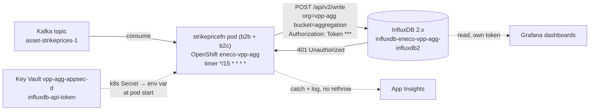
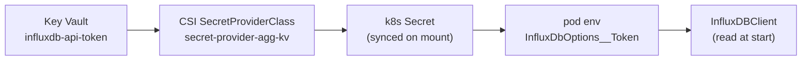

# Holistic RCA — VPP Aggregation `PublishStrikePricesFunction` cannot write to InfluxDB (401), dev-mc

> Companion teaching doc: [`explanation.md`](./explanation.md) (InfluxDB from first principles). Fix runbook: [`how-to-fix.md`](./how-to-fix.md). Evidence ledger: [`../../../../../../.ai/tasks/2026-07-21-004_vpp-agg-influxdb-unauthorized-devmc/context/01-live-evidence.md`](../../../../../../.ai/tasks/2026-07-21-004_vpp-agg-influxdb-unauthorized-devmc/context/01-live-evidence.md).
> Audit codes (A1 witnessed / A2 inferred / A3 blocked) live in the **Evidence Ledger** only; the narrative states status in plain words.

## Executive summary

Every 15 minutes, a small monitoring function called `PublishStrikePricesFunction` — one of Eneco VPP's Aggregation-Layer workers running as a container on the dev Managed-Cloud OpenShift cluster — tries to copy the strike-price points it just computed into **InfluxDB**, a self-managed time-series database that exists purely to feed Grafana dashboards (decided as a proof-of-concept in Dec 2024). Since roughly a month ago (reported by the filer; the live telemetry only proves *today*), every one of those writes is rejected by InfluxDB with **HTTP 401 Unauthorized**.

The visible symptom is an exception in Application Insights: `InfluxDB.Client.Core.Exceptions.UnauthorizedException: unauthorized access`. The filer's theory was that "the API token expired." That theory is almost certainly wrong for a first-principles reason: **InfluxDB 2.x API tokens do not expire by default**, and the live Key Vault secret that holds the token is enabled, has no expiry set, and has not been touched since March 2025.

What a 401 actually tells us is narrower and more useful: **InfluxDB is refusing to accept the presented credential as valid authentication** — the token is missing, malformed, or unknown to the instance (as opposed to a *403*, which would mean "I know you but you can't write here"). Because the stored token value has been static for over a year while the failures reportedly started recently, the change is on the **InfluxDB side** (or in how the token reaches the pod), not in the Key Vault secret. The single most likely cause is that the InfluxDB instance's token was **deleted or regenerated**, or its org/user was **re-initialised**, leaving the stored token orphaned — but a **corrupted/stale copy of the token reaching the pod** and a **deleted org/bucket** are real alternatives that must be ruled out before acting.

**Operational impact is low and bounded:** the write helper catches the error and only logs it (it does not crash the function or block trading), so the effect is **missing data in the Grafana monitoring dashboards**, not a trading or customer outage. This matches the proof-of-concept's explicitly accepted risk ("if InfluxDB is down we could lose the functional data").

**Why this is not yet closed:** the decisive checks — is the stored token actually valid inside the live InfluxDB instance, and do the org/bucket still exist — live *inside* the InfluxDB pod, which is only reachable through the Azure Virtual Desktop (`oc`), which an agent on a laptop cannot run. Those steps are handed to a human in the fix runbook.

**Why the proposed fix is the right one:** the fault is a rejected write credential delivered to the pod as a start-time environment variable. So the fix must (1) first check whether the token is even reaching the pod intact, (2) if it is, mint a fresh write-scoped token inside InfluxDB, (3) store it in Key Vault, (4) force the Kubernetes secret to re-sync and *then* restart the consumer pods (b2b and b2c) so they re-read it, and (5) prove recovery by watching a real scheduled run succeed — never by a return code. Recreating the org/bucket is explicitly out of scope (that is a data-loss operation, and a different ticket's action).

**What a future engineer should remember:** a 401 from InfluxDB is a *credential-identity* problem, not an expiry; a static secret that starts failing means something changed on the server or in delivery; and always verify the credential actually reaches the workload before rotating it.

## Context Ledger

Zero-context reader test: read this table first and the rest of the RCA is legible.

| Term | Meaning in this incident | Source of truth |
|------|--------------------------|-----------------|
| VPPAL / Aggregation Layer | Eneco VPP subsystem ingesting device telemetry/scheduling and publishing derived values (strike prices). Runs as containers on OpenShift. | repo `Eneco.Vpp.Aggregation` |
| `PublishStrikePricesFunction` / role `strikepricefn` | The failing timer-triggered Azure Functions worker (fires every 15 min) that writes strike-price points to InfluxDB. Has **b2b + b2c** deployment variants. | App Insights; GitOps values |
| InfluxDB (2.x) | Self-managed time-series database (org/bucket/token model) for VPPAL functional monitoring. In-cluster service `influxdb-eneco-vpp-agg-influxdb2`. | ADR AL010; stack trace |
| org `vpp-agg` / bucket `aggregation` | InfluxDB tenancy + data container the function writes to. | GitOps `strikepricefn/dev/values.yaml` |
| Kafka topic `asset-strikeprices-1` | The input event stream the function consumes each 15-min tick; source of the strike prices. Not part of the failure. | GitOps `strikepricefn/dev/values.yaml` |
| Grafana | Dashboard tool that *reads* InfluxDB with its own separate token. | ADR AL010 |
| dev-mc / MC | Development Managed-Cloud (Azure sub `839af51e…`). MC = Eneco's managed Azure estate. | `az account` |
| Key Vault `vpp-agg-appsec-d` | App-secret store holding `influxdb-api-token` (write), `influxdb-admin-token`/`-password`, Grafana read token. Private-endpoint + IP-deny firewall, access-policy model. | `az keyvault` |
| App Config `vpp-agg-applicationconfig-d` | Azure App Configuration (private-endpoint). **Not** the config source for the token here. | `az appconfig` |
| AVD | Azure Virtual Desktop — the only place MC OpenShift `oc` access is allowed; an off-AVD agent cannot run `oc`. | eneco-sre boundary ref |
| `Rec0BGG7SPERE` | A prior related ticket: Johnson deleting/recreating an InfluxDB collection on dev-mc/acc (datatype mismatch). Different failure mode; shared surface. | intake `requirements.md` |

## RCA Knowledge Contract

After reading this package a zero-context on-call engineer can: **draw** the write path and its trust boundary; **trace** how a timer tick becomes a 401; **reproduce** the investigation (Azure probes here; InfluxDB probes in-AVD); **reject** the "expired token" and "just restart it" explanations; **repair** it safely (byte-check → mint → re-sync → restart → verify) with the org/bucket-loss stop-gate; and **decide** which recurring toil to remove (token/secret drift detection).

### Knowledge domain map

| Domain | Reader capability | Where |
|--------|-------------------|-------|
| Business/functional role | why a 401 here is monitoring-only, not trading | L1 |
| Repo/artifact system | who can change the outcome (code, GitOps, IaC) | L2 |
| Runtime topology | draw the pod → InfluxDB → KV boundary | L3 |
| Application/data flow | how the write is built and where it fails | L4 |
| Declarative infra | what the KV secret + GitOps values declare | L5 |
| Delivery | how the token reaches the running pod | L6 |
| Timeline | what's proven when vs. reported | L7 |
| Fix mechanism | which invariant each step restores | L8 |
| Verification | prove recovery by effect | L9 |
| On-call recognition | spot this class in 5 min | L12 |

---

## L1 — Business: why this system exists

InfluxDB in the Aggregation Layer is not part of trading. It is a **functional-monitoring proof-of-concept** chosen in Dec 2024 (ADR AL010) to give VPPAL device-level Grafana dashboards it never had. The provider documentation and the ADR both frame it as best-effort: the ADR literally accepts that "if the InfluxDb is down … we could lose the functional data." So the people blocked by this incident are **engineers looking at monitoring dashboards**, not customers or the balancing markets. This is the single most important framing for triage: the 401 is annoying, not urgent — *provided* nothing automated (an alert rule, an SLA/billing/regulatory report) also reads the `aggregation` bucket. That assumption comes from the ADR, not a probe; confirm no non-human consumer depends on this data before finally ranking severity low.

**Keep this:** identify what a failing dependency is *for* before you rank its severity. A side-channel PoC failing looks identical in the logs to a core dependency failing — the architecture, not the stack trace, tells you which it is.

## L2 — Repo system: who can change the outcome

Four artifacts own the outcome. The reader needs this table to know where a fix would land.

| Repo / artifact | Role | Incident relevance |
|-----------------|------|--------------------|
| `Eneco.Vpp.Aggregation` (`Common/Shared.Infrastructure/InfluxDb/…`, `Functions/StrikePrices/StrikePriceGenerator/`) | The C# write client + the function | Defines *how* the token is used and that failures are swallowed |
| `Eneco.Vpp.Aggregation.GitOps` (`Helm/strikepricefn/{dev,acc,prod}/`) | Deployment values (host/org/bucket, timer, image) | Declares the InfluxDB target and the b2b/b2c variants; the token is injected here (not in plain values) |
| Azure Key Vault `vpp-agg-appsec-d` | Secret store | Holds `influxdb-api-token` — the credential under suspicion |
| The InfluxDB 2.x instance (in OpenShift) | The server rejecting the write | Owns the actual token/org/bucket state — the AVD-blocked truth surface |

**Keep this:** the credential has a *chain of custody* across three owners (KV → GitOps/Kubernetes → the running pod) plus the server that validates it. The bug can live in any link, so the repo map is also the suspect list.

## L3 — Runtime architecture: the write path and its trust boundary

The question this section answers: *what talks to what, and where exactly is the request refused?*



Reading the picture: the pod is a **client** of InfluxDB; the credential travels the dotted line from Key Vault, is baked into the pod's environment **when the container starts**, and is presented on every write. The failure point is the solid red arrow — InfluxDB answers the write with **401**. Two consequences follow directly from the shape: (1) because the token is fixed at container start, changing Key Vault does nothing until the pod restarts *and* the Kubernetes secret it reads has re-synced; (2) because we *received* a 401 (not a timeout), the network path and the InfluxDB process are up — this is an authentication refusal, not an outage.

**Keep this:** a 401 is proof *a* server answered — which demotes "InfluxDB is down" and "DNS/network broke" to the bottom of the list. But the C# client throws `UnauthorizedException` on *any* 401, so confirm the refusal came from **InfluxDB** and not an OpenShift oauth-proxy or a service-mesh authz sidecar in front of it before you touch the token (the fix runbook's Step 0b does this).

## L4 — Application/data flow: how a timer tick becomes a 401

The failing code is four lines. This matters because it changes the impact class.

```csharp
// Shared.Infrastructure/InfluxDb/Client/InfluxDbClientHelper.cs
try { await _writeApiAsync.WritePointsAsync(points, cancellationToken: ct); } // 401 raised here (line 27)
catch (Exception exception)
{
    logger.LogError(exception, "\nCould not export data to InfluxDb due to exception"); // caught, logged, NOT rethrown
}
```

The client is a standard InfluxDB 2.x client built from four options — host, bucket, org, token — and the options validator **fails startup if the token is empty**. So the running pod *has* a token; it is just being rejected. And because the write helper **catches the exception and only logs it**, the 15-minute run finishes "successfully" while silently dropping its points. That is why trading is unaffected and only Grafana notices.

**Keep this:** a swallowed exception converts a hard failure into silent data loss. The absence of a crash is not the absence of a problem — read the exception telemetry, not just the pod health.

## L5 — Declarative contract: what the config says should exist

The live evidence, read straight from the deployment values and the vault:

| Declared thing | Value | Where |
|----------------|-------|-------|
| InfluxDB host | `http://influxdb-eneco-vpp-agg-influxdb2` | GitOps `strikepricefn/dev/values.yaml` |
| bucket / org | `aggregation` / `vpp-agg` | same |
| timer | `*/15 * * * *` | same (matches the observed cadence) |
| token | **not in values.yaml** — injected from KV `influxdb-api-token` | GitOps + KV |
| `influxdb-api-token` | enabled, **no expiry**, last updated **2025-03-07** | `az keyvault secret list` |

The contract is coherent — host/org/bucket are declared, the token is stored — which is exactly why the failure is puzzling until you separate "declared" from "valid at the server."

**Keep this:** a declarative config can be perfectly valid and the system still fail, because the config declares a *reference* to a credential whose validity lives in another system.

## L6 — Delivery: how the token reaches the running pod

The token's chain of custody — four hops from Key Vault into the running process — is the map to hold before reasoning about a delivery fault:



Reading it: the token is *copied* along four hops, and the env var is fixed at container **start** — so a Key Vault change only reaches the app after the Kubernetes Secret re-syncs **and** the pod restarts. That single fact is why the fix (L8) is ordered update-KV → prove-sync → restart, and why "just restart it" reloads the old token.

The function's `Program.cs` builds configuration from the default Azure Functions providers (**environment variables**); it does **not** use Azure App Configuration. So `InfluxDbOptions:Token` is an **environment variable**, and the token in Key Vault reaches it as: **KV secret → a Kubernetes Secret (synced by CSI SecretProviderClass or External Secrets — unconfirmed) → the pod's env at container start.** The exact sync mechanism is not in the GitOps repo's per-service values, so it is one of the things a human must confirm in-AVD.

This delivery shape produces two of our live hypotheses: the token could be **orphaned at the server** (valid transport, dead credential) *or* the transported bytes could be **stale/corrupted** (a wrong or old Kubernetes secret, trailing whitespace) — both present as 401, and only a byte-level comparison at the pod distinguishes them.

**Keep this:** "the secret is in Key Vault and non-empty" is three hops away from "the correct bytes are in the running process." Verify the last hop before you rotate the first.

## L7 — Timeline: what is proven, and when

| When | Event | Confidence |
|------|-------|------------|
| 2024-12 | ADR AL010 chooses self-managed InfluxDB for VPPAL monitoring | documented |
| 2025-03-07 | `influxdb-api-token` last updated in Key Vault (unchanged since) | live Key Vault metadata |
| ~2026-06 (filer: ">1 month") | 401 failures reportedly begin | **reported only** — not in telemetry |
| 2026-07-07 | Sample 401 exception in the intake screenshot | screenshot |
| 2026-07-21 12:15–13:00 UTC | 12 live 401 failures, every 15 min, `strikepricefn` | live App Insights query |

The timeline is a **support surface, not the spine**: the load-bearing inference is "a static credential (unchanged since 2025-03) started failing recently, so the change is server-side." That inference only holds **if the stored credential ever wrote successfully** — which the retained telemetry cannot prove (it only reaches back to today). Establishing the *last successful write* (longer-retention logs, or Grafana's last fresh point per variant) is the probe that would harden this.

**Keep this:** short telemetry retention can turn "it broke a month ago" into an assumption. Find the last success, not just the first visible failure.

## L8 — Fix: what changes, what doesn't, and why

The full step-by-step runbook is [`how-to-fix.md`](./how-to-fix.md). The *shape*, tied to the mechanism:

| Step | Mechanism it addresses | Invariant it restores | What it does NOT change |
|------|------------------------|-----------------------|--------------------------|
| 0. Byte-check the token chain (KV vs Kubernetes Secret vs pod env, via length+hash — never print it) | distinguishes orphaned-token from stale/corrupt delivery | "the correct token bytes reach the pod" | nothing yet — diagnostic |
| 1. In-AVD InfluxDB probe: org/bucket exist? token present/active/write-scoped? (**if the admin token itself 401s → the instance was likely re-initialised → log in via the admin *password*; if that fails or org/bucket are gone → step 2b**) | identifies which credential hypothesis is true, and handles a dead admin token | knowledge, not state | InfluxDB data |
| 2a. Token unknown → mint a **new write-scoped** token (side-by-side) | replaces the orphaned credential | "a valid write token exists" | admin + Grafana tokens |
| 2b. **org/bucket absent → HALT + escalate** | prevents a token fix from becoming stateful recovery | avoids data loss | must not recreate org/bucket/collection |
| 3. Store new token in KV `influxdb-api-token` (never echo) | updates the source of truth | KV holds a valid token | other secrets |
| 4. Force KV→Kubernetes-Secret re-sync, **prove it changed** (hash), then `oc rollout restart` **every workload whose env resolves `influxdb-api-token`** (enumerate in-AVD — b2b + b2c expected, but confirm; a shared secret may feed other writers), one at a time | makes each consumer re-read the new token | "the running pods use the valid token" | code, image |
| 5. Verify by a real scheduled run succeeding + fresh Grafana point per variant | proves convergence, not just exit-0 | "writes are accepted again" | — |

**What this fix does NOT change / out of scope:** the InfluxDB PoC's monitoring-only status; the delete/recreate-collection action from ticket `Rec0BGG7SPERE` (that is a *different* incident's fix — do not import it); the Grafana read token.

**Keep this:** the "just restart it" reflex fails here — a restart before the Kubernetes secret re-syncs reloads the **old** token. Order matters: update → prove sync → restart.

## L9 — Verification: prove the fix by effect

A fix is closed only when the *scheduled* path recovers, not when a command returns 0. Three independent, non-false-passable signals:

1. the **newly minted write token** (not admin, not Grafana) writes a uniquely-timestamped point and reads it back;
2. after each rollout, a **scheduled invocation that actually writes points** runs *after* the new pod's start time with **no** new `UnauthorizedException` — verified **per pod** via `cloud_RoleInstance` (both b2b and b2c share `cloud_RoleName=strikepricefn`, so a role-level "no 401" cannot tell them apart, and an empty-data window produces no write *and* no error → not proof); confirm a fresh point actually landed in the `aggregation` bucket;
3. Grafana shows a **fresh timestamp for the `aggregation` measurement per affected writer** (corroboration only).

A single "no 401 for a while" can false-pass (the timer may not have fired yet); a manual 204 only proves the manual client's token. Both must be paired with a real scheduled success.

## L10 — Lessons

- **A 401 is an identity fact, not an expiry fact.** InfluxDB 2.x OSS tokens do not expire; treat "unauthorized" as deleted/rotated/mis-delivered credential, and check the server's token list, not a clock.
- **Verify the credential reaches the workload before rotating it.** Non-empty in Key Vault ≠ correct bytes in the pod; a stale Kubernetes secret 401s identically to an orphaned token.
- **Swallowed write errors = silent data loss.** The healthiest-looking pod can be dropping every point; monitor the exception, not the liveness probe.
- **Short telemetry retention hides onset.** "Started a month ago" was unverifiable here; find the last *success*.

## L11 — Reproduce this investigation from cold

The Azure-plane probes below are runnable by any authenticated engineer; the InfluxDB-plane probes are in-AVD (see `how-to-fix.md`). Each probe is a question.

**Question: is the 401 still happening, and on what cadence?**
Why this surface: App Insights is the authoritative exception store for the containerised function; the InfluxDB pod logs are AVD-gated. Fields: timestamp, operation, type, message.

```bash
az account set --subscription 839af51e-c8dd-4bd2-944b-a7799eb2e1e4
az monitor app-insights query --app 9ccf7dac-2934-4dd6-9a98-4058000c1178 \
  --analytics-query "exceptions | where timestamp > ago(2d) | where innermostMessage has 'unauthorized' or outerMessage has 'InfluxDb' | summarize count() by bin(timestamp,15m), operation_Name | order by timestamp desc"
```

Expected: **non-zero** rows on a ~15-minute cadence for `PublishStrikePricesFunction`. Note: the `outerMessage has 'InfluxDb'` clause is the one that actually matched the live 12 exceptions — `innermostMessage` was empty in the captured data, so do not rely on it alone. Decision rule: recent rows ⇒ still active ⇒ proceed; **zero rows ⇒ either genuine recovery *or* a filter mismatch — cross-check by widening the filter (`type has 'RpcException' and outerMessage has 'Unauthorized'`) before concluding "recovered."** Principle: use the platform's exception store as the liveness oracle when the process logs are unreachable — but confirm your filter matches the real telemetry shape first.

**Question: is the token secret expired / recently changed?** (the freshness probe is the `az account set` above — always pin the subscription first)
Why this surface: Key Vault is the source of truth for the credential; the metadata answers "expired?" without ever reading the value.

```bash
az keyvault secret list --vault-name vpp-agg-appsec-d \
  --query "[?contains(name,'influx')].{name:name,enabled:attributes.enabled,updated:attributes.updated,exp:attributes.expires}" -o table
```

Expected: `influxdb-api-token` enabled, `exp` empty, `updated` long ago. Decision rule: no expiry + old + enabled ⇒ reject the "expired" theory ⇒ pivot to the server-side/delivery hypotheses. Principle: read credential *metadata* to test expiry claims; never print the value.

> Reaching this firewalled vault requires the MC connect flow (MC SP login + adding your IP to the vault firewall) — see `how-to-fix.md`. The vault denied the read as `ForbiddenByFirewall` until the IP was whitelisted, then reverted.

**Question: what does the deployed function actually target, and how does it get the token?**
Why this surface: the GitOps values + `Program.cs` are the authority for host/org/bucket and the config source.

```bash
grep -R "InfluxDbOptions__" Eneco.Vpp.Aggregation.GitOps/Helm/strikepricefn/dev/values.yaml
grep -n "AddAzureAppConfiguration\|ConfigureAppConfiguration" \
  Eneco.Vpp.Aggregation/Functions/StrikePrices/StrikePriceGenerator/Program.cs
```

Expected: host/org/bucket present, token absent (injected); no App Configuration call ⇒ token is an env var. Decision rule: env-var delivery ⇒ a KV change needs a pod restart to take effect. Principle: read the config builder to know whether config refreshes live or only at start.

## L12 — On-call one-pager (5-minute recognition)

| | |
|---|---|
| **Signal** | App Insights `UnauthorizedException: unauthorized access` from an Aggregation function writing to InfluxDB (401) |
| **First read** | Is trading affected? **No** — InfluxDB is monitoring-only (PoC). Severity: low. |
| **Reject immediately** | "Token expired" (2.x tokens don't expire; KV secret has no expiry) and "just restart the pod" (reloads the old token if the secret didn't re-sync) |
| **Confirm (Azure plane, you can run)** | 401 still firing (App Insights, 15-min cadence); `influxdb-api-token` enabled/no-expiry/old |
| **Decide (InfluxDB plane, in-AVD)** | Byte-check token chain → `influx auth list` + `influx org/bucket list` → mint write token OR repair delivery OR **HALT** if org/bucket gone |
| **Fix** | new token → KV → prove Kubernetes secret re-synced → `oc rollout restart` b2b+b2c → watch a scheduled run succeed |
| **Never** | recreate the org/bucket/collection; reuse the admin token as the writer; paste any token into Slack/logs |
| **Escalate to** | Aggregation team + Platform (credential change) |

---

## Evidence Ledger

| # | Claim | Label | Source |
|---|-------|-------|--------|
| E1 | 401 InfluxDB writes live 2026-07-21 (12×, 15-min cadence), `strikepricefn` | A1 | `az monitor app-insights query` |
| E2 | Stack ends at `InfluxDbClientHelper.cs:27`; write API is 2.x (org/bucket/token) | A1 | App Insights outerMessage; stack |
| E3 | No `Microsoft.Web/sites` in the RG (observed); therefore OpenShift-hosted (inferred, corroborated by the GitOps Helm charts) | A1 + A2 | `az resource list -g mcdta-rg-vpp-agg-d-res` + GitOps |
| E4 | `influxdb-api-token` enabled, no expiry, updated 2025-03-07 | A1 | `az keyvault secret list` |
| E5 | Host/org/bucket = `…influxdb2`/`vpp-agg`/`aggregation`; timer `*/15`; token not in values | A1 | GitOps `strikepricefn/dev/values.yaml` |
| E5b | b2b + b2c variants exist (which one 401s is not distinguishable in telemetry — A3) | A1 (existence) / A3 (per-variant status) | GitOps `strikepricefn/{dev,acc,prod}/values.b2b.yaml`, `…/values.b2c.yaml` |
| E6 | Config source is env vars (no App Configuration) | A1 | `Program.cs` |
| E7 | Write helper catches+logs, no rethrow → silent data loss | A1 | `InfluxDbClientHelper.cs:23–33` (throw at :27) |
| E8a | Observed HTTP status is 401 | A1 | App Insights error code |
| E8b | On the 2.x write endpoint 401 = token missing/invalid/unknown/inactivated **or a valid token lacking write permission** (403 is not used for write-scope), and 2.x tokens don't expire by default — product behaviour, the specific cause not probed on this instance (resolved by `influx auth list`) | A2 (this instance) / vendor docs | [InfluxData write-data API](https://docs.influxdata.com/influxdb/v2/api/write-data/), [tokens](https://docs.influxdata.com/influxdb/v2/admin/tokens/) |
| E9 | Leading hypothesis (root-cause candidate): stored write token orphaned by an InfluxDB-side reset/regeneration | A2 | inference from E4+E8+onset |
| E9b | Alternative 401 sources under-ruled-out until in-AVD: a proxy/service-mesh in front of InfluxDB (client throws on any 401), and the admin token also being orphaned (blocks the inspect step) | A2/A3 | how-to-fix Step 0b/Step 1 |
| E10 | Alternatives open: stale/corrupt token delivery (byte mismatch), deleted org/bucket, mis-scope | A2/A3 | E6 (sync unverified) |
| E11 | Onset ">1 month" | A2 | filer + 2026-07-07 screenshot (not telemetry) |
| E12 | InfluxDB-internal token/org/bucket state; KV→pod byte parity; other-writer blast radius | A3 [blocked: AVD/oc] | requires `oc`/`influx` |

**Confidence:** the *mechanism class* (a rejected write credential with bounded, monitoring-only impact) is well evidenced and directly witnessed. The *specific* cause among the credential hypotheses is an open inference until the AVD-blocked probe runs — the fix runbook's Step 0–1 are exactly those probes, so this RCA ships `complete` on the mechanism class while the leading hypothesis stays explicitly a hypothesis. Four discoveries would each re-route the fix, in rough order of likelihood: a **byte mismatch** in the Key Vault → Secret → pod chain (flips from *rotate token* to *repair delivery*); the stored token having **never written successfully** (then no server-side change happened — invalid-from-injection); a **proxy/service-mesh** issuing the 401 rather than InfluxDB (takes the token path off-course entirely); or **org `vpp-agg`/bucket `aggregation` being gone** (flips from *rotate* to *escalate stateful recovery* — do not recreate).
