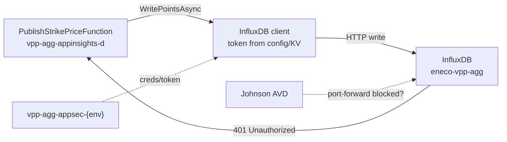

# Rec0BJKDCC4CT — VPP agg InfluxDB unauthorized (dev-mc) — Slack intake

## Derivation header

| Field | Value |
|-------|-------|
| `template_id` | `slack-intake.template.md` |
| `template_version` | `2.0.0` |
| `template_path` | `std/skills/10_employer/eneco/eneco-oncall-intake-slack/assets/slack-intake.template.md` |
| `instance_id` | `2026_07_21_002_johnson_vpp_agg_influxdb_unauthorized_devmc` |
| `filed_date` | `2026-07-21` (Lists pickup); symptom observed in App Insights from `2026-07-07` |
| `picked_up_date` | `2026-07-21` |
| `produced_by` | `eneco-oncall-intake-slack` |
| `consumed_by` | `eneco-sre` — assembles `sre-intake.md` beside this file |

## Instance manifest

| Key | Value | Provenance |
|-----|-------|-----------|
| `INCIDENT_TITLE` | VPPAL / Aggregation workloads on dev-mc cannot export to InfluxDB (Unauthorized) | Known — Johnson filing |
| `INSTANCE_ID` | `2026_07_21_002_johnson_vpp_agg_influxdb_unauthorized_devmc` | Known — scaffold |
| `ORIGIN` | Slack Lists | Known |
| `ORIGIN_URL` | https://grid-eneco.enterprise.slack.com/lists/T039G7V20/F0ACUPDV7HU?record_id=Rec0BJKDCC4CT | Known |
| `RECORD_ID` | `Rec0BJKDCC4CT` | Known |
| `RELATED_RECORD_ID` | `Rec0BGG7SPERE` | Known — Johnson cross-link |
| `INTAKE_CHANNEL` | Slack Lists `F0ACUPDV7HU` / companion thread Unknown[blocked] — harvest from pasted thread + prior-ticket summary; re-read live thread with `eneco-context-slack` | Partial |
| `FILER` | Johnson Lobo | Known — filing |
| `PRIOR_SME` | Nuno Alves Pereira (access + credentials guidance on Rec0BGG7SPERE) | Known — related ticket |
| `ON_CALL` | Platform / VPP Foundations (intake author) | Known — session |
| `SURFACE` (proposed) | `influxdb` + OpenShift `eneco-vpp-agg` + Function App secrets (`PublishStrikePriceFunction`) | proposed |
| `ENVIRONMENTS` | **dev-mc** (current); ACC/PROD context only from related ticket | Known |
| `SUBSCRIPTION` | `839af51e-c8dd-4bd2-944b-a7799eb2e1e4` | Known — App Insights URL |
| `RG` | `mcdta-rg-vpp-agg-d-res` | Known |
| `APP_INSIGHTS` | `vpp-agg-appinsights-d` | Known |
| `OC_NAMESPACE` | `eneco-vpp-agg` | Known — Nuno |
| `INFLUX_SVC` | `influxdb-eneco-vpp-agg-influxdb2` | Known — Nuno |
| `APPSEC_VAULT_PATTERN` | `vpp-agg-appsec-{env}` | Known — Nuno; exact `env` suffix Unknown — probe |
| `CMC_RITM` | `RITM0191780` | Known — access request |

## Input

### Problem explanation

Aggregation (VPPAL) workloads on **dev-mc** fail when exporting telemetry/points to **InfluxDB**. App Insights on `vpp-agg-appinsights-d` shows `PublishStrikePriceFunction` throwing `InfluxDB.Client.Core.Exceptions.UnauthorizedException: unauthorized access` (HTTP 401) from `InfluxDbClientHelper.WritePointsAsync` (`InfluxDbClientHelper.cs:27`). Johnson reports the issue has existed for **more than a month** and was noticed when investigating; he believes the **API token expired** and wants a new one created, but cannot port-forward or browse aggregation workloads from AVD / OpenShift.

A related Lists ticket (`Rec0BGG7SPERE`) covered ACC InfluxDB **login / port-forward / delete-recreate collection** after a **datatype mismatch** across DEV_MC/ACC/PROD. Nuno restored **pod-exec + port-forward** via CMC **RITM0191780**, pointed credentials to **`vpp-agg-appsec-{env}`** (old `int` secrets dead), and noted ArgoCD auto-sync already disabled on dev/acc. That ticket is **not the same failure mode** (schema/collection vs 401 Unauthorized) but shares the same access path and credential store — reuse that knowledge; do not assume the collection-delete fix applies here.

### Original request (verbatim harvest)

Full corpus: [requirements.md](./requirements.md). Lists record bodies are not API-readable; companion thread must be re-read live (`H-THREAD-1`).

Current ask (Johnson, Rec0BJKDCC4CT):

> VPPAL workloads on dev-mc env can't export the data to influxdb … issue is there for more than a month … just noticed it today. … api-token is expired and we want to create new one. i can't do it myself because i can't port forward … we don't have access to aggregation project on openshift … Nuno … RITM0191780 … related Rec0BGG7SPERE

### Known state from evidence

- 401 Unauthorized on InfluxDB write from `PublishStrikePriceFunction` (Known — App Insights screenshot + stack).
- Sample exception timestamp ≈ 2026-07-07T05:30:01.310Z (Known — portal URL).
- Namespace `eneco-vpp-agg`, service `influxdb-eneco-vpp-agg-influxdb2`, port-forward `8086:80` (Known — Nuno, related ticket).
- Creds in `vpp-agg-appsec-{env}`; old `int` secrets invalid (Known — Nuno).
- RITM0191780 intended to grant agg pod-exec/port-forward all envs (Known — Nuno claim; **verify for Johnson’s identity today**).
- Auto-sync disabled on dev/acc ArgoCD for this app (Known — Nuno as of related ticket; re-verify before destructive ops).
- Duration “>1 month” (Inferred — filer statement; corroborate with App Insights time range).

## Recurrence / related requests

| When | Record | What | Relevance |
|------|--------|------|-----------|
| Jul 2026 | `Rec0BGG7SPERE` | ACC InfluxDB access + datatype/collection recreate | Same filer, same InfluxDB/agg surface; access/credential path |
| Jul 2026 | `Rec0BJKDCC4CT` | Unauthorized write / token rotation ask | **This** ticket |
| ~3 months before Rec0BGG7SPERE | OpenShift restructure | Narrowed OC permissions | Explains lost port-forward |

Filer-specific history beyond these two records: Unknown[blocked] — `eneco-context-slack` `from:` Johnson on InfluxDB/agg.

## Mandatory context

### Environmental context

| Item | Value |
|------|-------|
| Target env | dev-mc |
| Subscription | `839af51e-c8dd-4bd2-944b-a7799eb2e1e4` |
| Workload signal | Azure Function `PublishStrikePriceFunction` → InfluxDB |
| Data plane | OpenShift `eneco-vpp-agg` / InfluxDB2 service |

**Repos to read** — via `eneco-context-repos`:

| Repo (git URL) | Role | Question it answers |
|----------------|------|---------------------|
| Unknown[blocked] — Aggregation / Shared.Infrastructure repo holding `InfluxDbClientHelper.cs` | Token/config wiring | Which setting name / KV secret feeds the write token? |
| Unknown[blocked] — GitOps for `eneco-vpp-agg` InfluxDB | Helm/Argo | How tokens are injected into workloads |

### Context to fetch — six sources

| # | Source | Skill | Why | Status |
|---|--------|-------|-----|--------|
| ① | Slack Lists + companion threads | `eneco-context-slack` | Live thread for Rec0BJKDCC4CT + Rec0BGG7SPERE | ⬜ re-read live |
| ② | `#team-platform` / agg channels | `eneco-context-slack` | Undocumented token rotation practice | ⬜ |
| ③ | ADO agg / Shared.Infrastructure | `eneco-context-repos` | Config key for Influx token | ⬜ |
| ④ | Obsidian | `2ndbrain-obsidian` | Prior InfluxDB / RITM notes | ⬜ |
| ⑤ | engineering-log | `rg` | Prior agg InfluxDB incidents | ⬜ scan |
| ⑥ | Wiki / MS Learn / Influx docs | `eneco-context-docs` | Token create / API write auth | ⬜ |

**engineering-log precedent:** none linked yet — search `influxdb` / `eneco-vpp-agg` / `PublishStrikePrice`.

### Environments — connection routing

| Environment | How to connect | Note |
|-------------|----------------|------|
| dev-mc OpenShift | `eneco-tools-connect-mc-environments` then `oc project eneco-vpp-agg` | Verify RITM0191780 for current user |
| InfluxDB UI/API | `oc port-forward -n eneco-vpp-agg svc/influxdb-eneco-vpp-agg-influxdb2 8086:80` | From Nuno; then localhost:8086 |
| Azure | Portal / `az` on sub `839af51e-…` | App Insights + Function + Key Vault |

### Skills to use

| Skill | Phase | Why |
|-------|-------|-----|
| `eneco-oncall-intake-slack` | intake | This file |
| `eneco-sre` | troubleshoot | Classify + fix path |
| `eneco-tools-connect-mc-environments` | probe | Connect to dev-mc |
| `eneco-context-slack` | harvest | Live threads |
| `eneco-context-repos` | harvest | Token wiring in code |
| no dedicated InfluxDB skill | — | eneco-sre routes; use `oc` + Influx UI/API |

### Tools / CLI(s)

| Tool | Status | Fallback | Use |
|------|--------|----------|-----|
| `oc` | Unknown — probe | Portal OpenShift console | port-forward / exec |
| `az` | Unknown — probe | Portal | App Insights, KV, Function settings |
| browser → App Insights | Screenshot present | Kusto query | Confirm ongoing 401s |
| curl → localhost:8086 | After port-forward | Influx UI | Token/write test |

## Mechanism (cited)

**Stated mechanism (Assumed — filer):** InfluxDB API token expired → write API returns 401 → Function wraps as `UnauthorizedException`.

**Supported mechanism chain:**

1. Function invokes Influx write client with configured org/bucket/token. `(Known — stack / InfluxDbClientHelper.cs:27)`
2. InfluxDB rejects request as unauthorized. `(Known — exception type + HttpRequestException Unauthorized)`
3. Token/credential material is expected in `vpp-agg-appsec-{env}`; historical `int` secrets are stale. `(Known — Nuno on Rec0BGG7SPERE)`
4. Whether the token is *expired* vs *wrong scope* vs *not the secret the Function mounts* is **Unknown** until vault + Function config comparison. `(Unknown — primary enrich probe)`

Do not overstate expiry without comparing InfluxDB token list to the mounted secret.

## Claims to verify

| # | Claim | Tag | Falsifier / probe |
|---|-------|-----|-------------------|
| 1 | Writes still fail with 401 on dev-mc today | Assumed | App Insights query last 24–48h for `UnauthorizedException` / `PublishStrikePriceFunction` |
| 2 | API token used by the Function is expired or invalid | Assumed (filer) | Decode which secret → compare to InfluxDB tokens; test write with that token |
| 3 | Johnson still cannot port-forward despite RITM0191780 | Assumed | `oc auth can-i create pods/portforward -n eneco-vpp-agg` as Johnson / platform |
| 4 | Exact appsec vault name for dev-mc matches `vpp-agg-appsec-dev` (or similar) | Inferred | `az keyvault list` / naming convention probe |
| 5 | Auto-sync still disabled on dev ArgoCD app | Assumed (stale from related ticket) | ArgoCD UI/CLI for agg InfluxDB app |

## Confidence assessment

- **Ledger:** 8 Known · 3 Inferred · 4 Assumed · 5 Unknown
- **Route-changing unknown:** which credential the Function actually presents, and whether it is expired vs wrong — decides “create new token” vs “fix secret wiring” vs “RBAC only”
- **Resolved by:** connect → port-forward → vault secret identity → Function app setting → test write
- **Confidence:** Moderate — symptom Known; root cause Assumed; reply deferred

## Human-decision gates

- Token/secret rotation: Aggregation owner + Platform; no secrets in Slack.
- Scope: **dev-mc** unless Johnson expands.
- Destructive Influx collection delete/recreate: only if schema errors appear — **not** the default fix for 401.
- DoD: successful Influx write from VPPAL path on dev-mc; Johnson can operate via documented port-forward + vault creds.

## Handoff self-check (four-predicate)

| Predicate | State | Note |
|-----------|-------|------|
| P1 Identity | ✓ | Rec IDs, sub, RG, App Insights, namespace, svc Known |
| P2 Mechanism + citation | PARTIAL | 401 path Known; “expired token” Assumed — Influx/KV docs + live token list pending |
| P3 Probes | ✓ | Concrete `oc`/App Insights/az probes; vault name has Unknown row |
| P4 Gates | ✓ | Secret handling, scope, no collection-delete by default |

**Verdict:** PARTIAL — ready for `eneco-sre`. First actions: verify OC access + identify Function’s Influx token secret + test write.

## Attachments & evidence

| Path | What |
|------|------|
| [requirements.md](./requirements.md) | Full consolidated corpus (both tickets) |
| `proofs/screenshots/01-appinsights-publishstrikeprice-influxdb-unauthorized.png` | App Insights exception |

## Prior-incident deep links

- Related Lists: https://grid-eneco.enterprise.slack.com/lists/T039G7V20/F0ACUPDV7HU?record_id=Rec0BGG7SPERE
- CMC: RITM0191780
