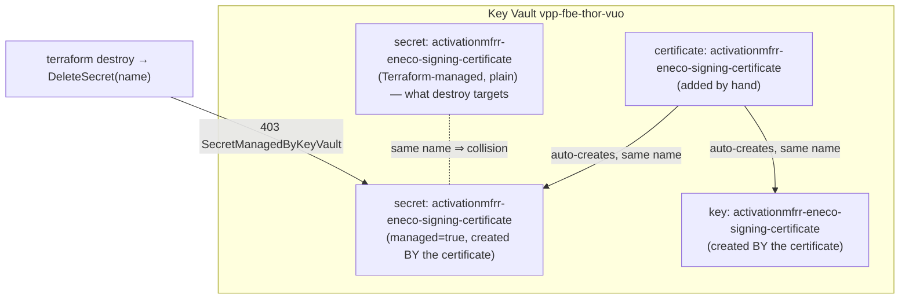

# How an FBE refused to die — two failures, from first principles

**Topic:** why deleting the Feature Branch Environment `thor` failed twice, for two unrelated reasons.
**Mastery level:** you should be able to teach both failure mechanisms at a whiteboard and recognize their *class* in any Azure + IaC + pipeline stack — not just this incident.

**Audience & scope.** Written for an engineer who knows Azure and Terraform exist but has never debugged a Key Vault certificate/secret collision or a non-idempotent teardown pipeline. Scope: the two *mechanisms*. The step-by-step remediation lives in `quick-fix.md`; the full evidence chain in `rca.md`.

---

## Knowledge Contract

After reading this, you will be able to:

1. **draw** the three objects Azure Key Vault creates when you import one certificate, and explain why they share a name;
2. **explain** why a Terraform-managed *secret* becomes undeletable the moment a same-named *certificate* is imported beside it;
3. **trace** the second, different failure — why a *re-run* of the same delete pipeline died at an earlier stage than the first run;
4. **diagnose** which of the two failures you are looking at from a single error string;
5. **reject** two plausible-but-wrong fixes (blind re-run; "run only the last stage") and say *why* each fails;
6. **defend** the claim "the first blocker can never recur" against an expert who asks "how do you actually know?";
7. **transfer** both mechanisms to a nearby case that is not about Key Vault or App Configuration.

This document does **not** make you an expert in ArgoCD/GitOps FBE rendering — that is a different surface; here the FBE is only the thing being torn down.

---

## TL;DR picture

One environment, two independent ways to get stuck. Hold this before the details.

```text
 thor teardown
 ┌──────────────────────────────────────────────────────────────┐
 │ RUN 1  destroy most infra ──▶ hit Key Vault ──▶ 403           │
 │        cause: a hand-added CERTIFICATE "captured" a            │
 │              Terraform-managed SECRET of the same name         │
 │                                                                │
 │   (engineer deletes the certificate by hand) ✅                │
 │                                                                │
 │ RUN 2  fails MUCH earlier, different stage                     │
 │        cause: App Config store already gone ⇒ name lookup      │
 │              returns "" ⇒  az appconfig feature list -n  ❌     │
 └──────────────────────────────────────────────────────────────┘
 Two bugs. The second was hiding behind the first.
```

The single most important idea: **fixing the first failure revealed a second, structurally different one.** They look related (both block `thor`'s deletion) but share no mechanism. Keep them apart in your head — conflating them is how people "fix" this incident and stay stuck.

---

## First-principles ladder

Climb these in order; everything later follows from them.

| Rung | Statement |
|---|---|
| **Term** | An Azure Key Vault holds three *kinds* of object: **secrets**, **keys**, and **certificates**. |
| **Primitive** | A certificate is not a fourth, standalone thing. Importing a certificate named `X` makes Key Vault **also** materialize a *secret* `X` (holding the PFX/private material) and a *key* `X`. One command, three addressable objects, one shared name. |
| **Invariant** | The secret `X` created *by* a certificate is **owned by that certificate**. Key Vault marks it `managed=true`. You may read it, but you may **not** delete it through the secret API — only by deleting the certificate. |
| **Mechanism** | If something else (Terraform) already manages a *plain* secret named `X`, and a certificate `X` is then imported, the certificate's backing secret occupies the same name. Terraform's `DeleteSecret X` now targets a certificate-owned secret. |
| **Consequence** | Azure rejects the delete: `403 … Operation "delete" is not allowed on this secret, since it is associated with a certificate … SecretManagedByKeyVault`. Terraform cannot complete `destroy`. |
| **Failure** | A teardown that worked for every *other* secret dies on this one. |
| **Defense** | Delete the **certificate** (which removes its backing secret), then destroy proceeds. Prove it worked by confirming the vault has **no certificates** and **no managed secrets** left. |

The second failure has its own short ladder:

| Rung | Statement |
|---|---|
| **Primitive** | The delete pipeline **resolves a resource's name at runtime**, then **uses** that name in a later command. |
| **Invariant** | "Resolve-then-use" is only safe while the resource exists. If the lookup can return empty, every later use must tolerate empty. |
| **Mechanism** | Run 1 destroyed the App Configuration store. On re-run, `az appconfig list … contains(name,'thor')` returns `""`. The pipeline feeds `""` into `az appconfig feature list -n ""`. |
| **Consequence** | The Azure CLI rejects the empty argument: `argument --name/-n: expected one argument`. The stage fails *before* the teardown stage runs. |
| **Failure** | The pipeline is **non-idempotent**: it cannot survive its own partial completion. |
| **Defense** | Make the stage a no-op-success when the lookup is empty (there is nothing left to clean), so a re-run can reach the teardown stage. |

---

## System map — the three objects with one name

Before the failure, you must *see* why one import becomes three objects. This diagram answers: "what does importing a certificate actually create, and which object does Terraform fight with?"



**Reading it:** the left intent was simple — Terraform created one *plain* secret (top box) and expects to delete it on teardown. Then someone imported a *certificate* of the same name (middle box). Key Vault, by its own rules, spawned a managed **secret** and a **key** alongside it (the two boxes the certificate points to). Now there are *two* notions of the secret `activationmfrr-eneco-signing-certificate`, and the certificate-owned one wins the name. When `terraform destroy` calls `DeleteSecret` on that name, it hits the **managed** secret and Azure refuses — that is the dotted collision and the red arrow. **Takeaway to keep:** a certificate is a *trinity* sharing one name; managing a plain secret with a name a certificate might later take is a latent collision. This is the structural cause behind the first run's death.

---

## Mechanism over time — why run 1 died deep and run 2 died early

A diagram of *what exists* cannot explain *why the second run looked different*. For that we need time. This sequence answers: "in what order did things happen, and why did the same pipeline fail at two different places?"

```mermaid
sequenceDiagram
    participant Eng as Engineer
    participant Pipe as Delete pipeline
    participant TF as terraform destroy
    participant KV as Key Vault
    participant AC as App Config store

    Note over Pipe: RUN 1 (build 1683298)
    Pipe->>AC: destroy app-config entries ✅
    Pipe->>TF: destroy infra
    TF->>KV: DeleteSecret(activationmfrr…)
    KV-->>TF: 403 SecretManagedByKeyVault ❌
    Note over TF: dies AFTER most infra gone;<br/>App Config already destroyed

    Eng->>KV: delete the certificate by hand ✅
    Note over KV: managed secret + key vanish with it

    Note over Pipe: RUN 2 (build 1683370)
    Pipe->>AC: resolve store name → "" (store already gone)
    Pipe->>AC: az appconfig feature list -n "" ❌
    Note over Pipe: dies EARLY, never reaches terraform
```

**Reading it:** in run 1 the pipeline got all the way down to the Key Vault before the 403 — by then the App Configuration store and most resources were already destroyed. The engineer then correctly removed the certificate (so its managed secret and key disappeared with it — that is *why* the first blocker is now permanently gone). But run 2 starts from the top again, and the very first thing the App-Config stage does is *look up the store it intends to clean*. That store no longer exists, so the lookup returns an empty string, which is fed straight into `az appconfig feature list -n ""` — and the run dies there, long before Terraform. **Takeaway to keep:** the second failure is a direct *consequence* of the first run's partial success. The earlier-stage death is the signature of a non-idempotent pipeline meeting its own leftovers. This connects the two ladders: the trinity bug caused the partial teardown; the partial teardown exposed the idempotency bug.

---

## Local mental model (redraw this from memory)

If you remember nothing else, remember this compression:

```text
KV CERTIFICATE = { cert , key , secret }   ← one import, one name, three objects
                          └ managed secret  ← you can't delete it as a secret;
                                              delete the CERTIFICATE instead

NON-IDEMPOTENT TEARDOWN:
   resolve(name) ──▶ use(name)
        │
        └ if resource already gone ⇒ name = ""  ⇒  use("") explodes
   fix: when name == "", skip (nothing to clean) and keep going
```

The top half is the first failure; the bottom half is the second. Two index cards, not one.

---

## Diagnosis ladder — which failure am I looking at?

When you inherit a stuck FBE, this decides your path from the *error string alone*. It answers: "given one failure message, what is the mechanism and the fix?"

```text
Read the FAILING STAGE in the build timeline
│
├─ "DeleteSecret … SecretManagedByKeyVault" (in terraform destroy)
│      → FIRST failure: a certificate captured a TF secret
│      → fix: delete the CERTIFICATE; confirm `certificate list` empty; re-run
│
├─ "argument --name/-n: expected one argument" (App Config stage)
│      → SECOND failure: empty name from a resolve-then-use on a gone resource
│      → fix: guard the stage to skip on empty; re-run reaches teardown
│
└─ slot still shows "assigned" but resources mostly gone
       → teardown never reached the "Release environment" step
       → success = the slot-tracking table row = "unused", NOT a green build
```

**Reading it:** the failing *stage* and the *exact CLI error* are enough to separate the two mechanisms — you never have to guess. The third branch is the trap that makes people think the FBE is fine when it is not: the resources can be gone while the slot is still marked taken, because the step that frees the slot lives at the very end of the teardown the pipeline never reached. **Takeaway:** diagnose by *stage + error string*, and verify by *state* (the table), not by *exit code*.

---

## Anti-patterns (and the mechanism that makes each fail)

| Tempting move | Why it fails (mechanism) |
|---|---|
| **Blindly re-run the whole delete pipeline** | The App-Config stage resolves the (now-deleted) store name to empty and dies on `feature list -n ""` every time. The pipeline cannot survive its own partial completion. |
| **"Run only the last stage" (DestroyInfra)** in Azure DevOps | That stage has no explicit `dependsOn`, so it implicitly depends on the stage before it, and its job condition is `succeeded()`. Deselecting the earlier stage marks it *Skipped*; *Skipped ≠ Succeeded*, so the last stage **cascade-skips**. The run goes green and changes nothing. |
| **Delete the colliding *secret* to unblock Terraform** | You can't — that is the whole 403. Azure only lets you remove a certificate-owned secret by deleting the **certificate**. |
| **Trust the green pipeline as "done"** | The slot-release step is conditional on the prior steps succeeding; a partial success can leave the slot marked `used`. Green build, stuck slot. |

Each row is a real branch someone takes under time pressure. Knowing the *mechanism* is what lets you reject it in the moment instead of trying it and waiting 20 minutes to fail.

---

## Evidence ledger

The narrative above states things as facts; here is how each is known, so you can audit rather than trust.

| Claim | How it is known | Confidence |
|---|---|---|
| Run 1 died on `DeleteSecret … SecretManagedByKeyVault` | The build log and the filed error text show it verbatim | FACT (observed) |
| The colliding secret is Terraform-managed (copied from a shared vault) | The FBE Terraform `key-vault.tf`/`locals.tf`/`data.tf` define it as a copied secret | FACT (source) |
| The certificate was *manually* added | The owner stated it; the 403 semantics require a certificate to exist | INFER (owner statement + Azure behavior) — does not affect the fix |
| The certificate and its managed secret are now gone | A live Key Vault check found no certificates and no managed secrets | FACT (live probe) |
| Run 2 died on `az appconfig feature list -n ""` | The second build's timeline and task log show the empty-argument error | FACT (observed) |
| The empty name comes from the deleted store | The pipeline resolves the name by listing App Config stores; a live check found no `thor` store | FACT (source + live probe) |
| The slot stays "assigned" because teardown never released it | The release step is the last step of the stage that never completed | FACT (pipeline source) |

The one inference on the causal path — that the certificate was added *by hand* rather than by some automation — does **not** change the remedy, because the remedy depends only on the certificate now being **absent**, which is directly verified.

---

## Challenge-defense

**"How do you know the first failure can't happen again?"** Because the 403 requires a certificate to own a secret of that name, and a live check of `vpp-fbe-thor-vuo` shows **zero certificates** and **zero managed (certificate-owned) secrets**. With no certificate present, no secret can be captured. If a certificate were re-imported, the risk returns — that is the falsifier.

**"Isn't the second failure just the first one again?"** No. The first is a *data-plane* refusal inside Terraform's Key Vault delete (403). The second is a *CLI argument* error in a pre-Terraform App-Config stage, caused by an empty name. Different stage, different tool, different mechanism. They only share a victim (`thor`).

**"What would disprove the empty-name theory?"** If the App Configuration store still existed (a non-empty `az appconfig list … contains(name,'thor')`), the name would not be empty and the theory would be wrong. The live check returned nothing, so the theory stands.

**"Where does the abstraction leak?"** "FBE resources are independent" leaks: the FBE *copies* its secrets from a **shared** source Key Vault and tracks its slot in a **shared** table. A mental model that treats `thor` as fully self-contained will mishandle those shared surfaces (e.g. never delete the shared source vault; only *update* the shared table).

---

## Self-test (reconstruct the reasoning, don't recall trivia)

1. Draw, from memory, the objects Key Vault creates when you import one certificate, and circle the one Terraform tries (and fails) to delete. *Success: three boxes, one name, the managed secret circled.*
2. A teammate says "just delete the secret and re-run." Explain in two sentences why that cannot work and what to delete instead.
3. The first run fails ~25 minutes in; the re-run fails in ~3 minutes at an *earlier* stage. Explain why an earlier-stage failure is evidence that the **first** problem was actually fixed.
4. You are handed a green delete pipeline but the slot still shows "assigned." What single piece of state do you check to decide if the teardown truly finished, and why is the green build not enough?
5. **Transfer:** a different pipeline runs `terraform destroy` and then `kubectl delete ns $(resolve_namespace)`. The namespace was already deleted in a prior partial run. Predict the failure, name its class, and give the one-line guard that fixes it. *Success: empty `$(resolve_namespace)` → `kubectl delete ns ""` (or deletes nothing/errors); class = non-idempotent resolve-then-use; guard = skip when the resolved value is empty.*

---

## Durable principles (carry these to the next incident)

1. **A Key Vault certificate is three objects with one name.** Never let IaC manage a plain secret whose name a certificate might later claim; if a certificate-owned secret blocks you, delete the *certificate*.
2. **Resolve-then-use is non-idempotent unless "use" tolerates empty.** Any teardown that looks up a resource it is about to remove must survive that resource already being gone.
3. **A partial failure plants the next failure.** After any teardown dies midway, expect the *next* run to fail somewhere *earlier* — that is a signature, not a coincidence.
4. **Verify by state, not by exit code.** The success signal is the resource/slot reaching its terminal state, not a green checkmark — especially when the finishing step is conditional.
5. **Diagnose by stage + error string before touching anything.** The failing stage and the literal CLI/API error usually name the mechanism for free.

_Source RCA: `rca.md`. Remediation: `quick-fix.md`. Evidence probes & adversarial review: `.ai/tasks/2026-06-22-008_fbe-failed-deletion/`._
