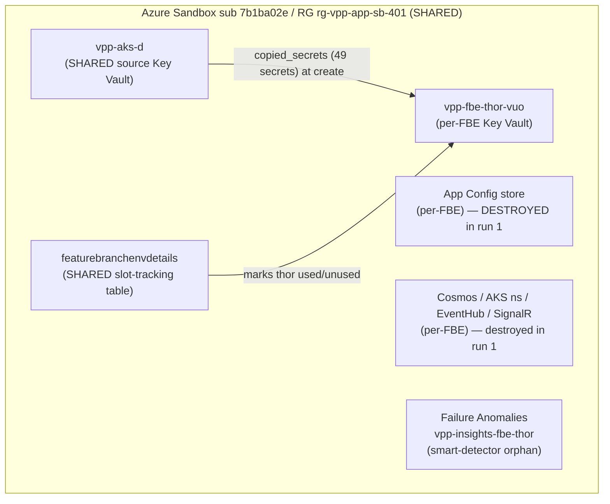

# RCA — Feature Branch Environment `thor` could not be deleted

> Holistic root-cause analysis for the **next on-call engineer who has never torn down an FBE before**. After reading it you can draw the FBE delete path, explain both failures from first principles, reproduce every probe, reject the obvious-but-wrong fixes, and un-stick the slot safely.
>
> **Status:** analysis complete and independently reviewed by three typed adversaries; the **incident remains open** until the fix is executed and the witness signal (L9) confirms the slot is freed. The remediation is in the companion [quick-fix.md](./quick-fix.md).

---

## Executive summary

A **Feature Branch Environment (FBE)** is a short-lived, full copy of the Myriad VPP stack that an engineer spins up from a feature branch to test, then tears down. Each FBE gets its own Azure resources in the Sandbox subscription — a Key Vault, an App Configuration store, Cosmos DBs, an AKS namespace — provisioned by Terraform and driven by an Azure DevOps "Feature Branch Environment - Delete" pipeline. Tiago tried to delete his FBE, slot **`thor`**, and it got stuck.

It got stuck for **two different reasons, one after the other**:

1. **First run** — Terraform `destroy` reached the Key Vault and tried to delete a secret called `activationmfrr-eneco-signing-certificate`. Azure refused with a 403: *"this secret is associated with a certificate; delete the certificate instead."* A **certificate** of that exact name had been added into the FBE's Key Vault outside Terraform (the owner reports adding it manually). The key fact: in Azure Key Vault, creating a certificate silently also creates a *secret* of the same name to hold its private key — and that auto-created secret "captured" the one Terraform thought it owned. Terraform can delete a normal secret; it cannot delete a certificate's backing secret. The destroy died there, after most of the infrastructure was already gone.

2. **Second run** — Tiago correctly deleted that certificate by hand, then re-ran the pipeline. This time it failed much earlier, at a completely different step. The first run had **already destroyed the App Configuration store**. On the re-run, the pipeline's setup stage looks up the store's name with `az appconfig list … contains(name,'thor')`, found nothing, and passed an **empty name** to a later task that runs `az appconfig feature list -n <empty>`. The Azure CLI rejected the empty argument and the stage failed — before the pipeline ever reached the Terraform stage again. The delete pipeline is **not idempotent**: once a stage's target is gone, re-running the whole pipeline breaks on the now-missing resource.

**Current state (verified live on 2026-06-22):** the certificate and its backing secret are **gone** — the original 403 cannot recur while no certificate is re-imported. `thor` is ~90% torn down; only its Key Vault (`vpp-fbe-thor-vuo`) and a leftover App-Insights smart-detector alert remain. The slot still shows **"assigned to Tiago"** purely because the first run never reached the pipeline's final *"Release environment"* step, which is what marks the slot free. The Terraform state confirms the shape: the infra state `terraform.thor` is **full (313 KB)** while the App-Config state `thor.appconfig.tfstate` is **already empty (184 B)**.

**Why the fix is what it is:** the only path that both finishes the teardown *and* releases the slot is the pipeline's `DestroyInfra` stage (terraform destroy → delete leftovers → release the slot). To reach it on a re-run, the App-Config stage must stop hard-failing on a missing store. So the fix is a small **idempotency guard** (skip App-Config cleanup when the store is already gone — safe here because that state is already empty) plus a re-run — not a blind retry, and **not** the tempting "run only DestroyInfra" shortcut, which Azure DevOps silently skips (L8).

**Not yet verified:** that the guard + re-run completes end-to-end. It requires a pipeline change the team merges, then a run whose success must be witnessed by the slot showing `unused` (not by a green checkmark). Remediation + a deterministic break-glass are in [quick-fix.md](./quick-fix.md).

---

## Context Ledger

A zero-context reader needs these terms before the levels make sense. Every term was resolved from a source; none is assumed.

| Term | What it is | Where it lives / how resolved | Why it matters |
|---|---|---|---|
| **FBE (Feature Branch Environment)** | Ephemeral full-stack environment per feature branch, in Sandbox | `azure-pipeline-fbe-del.yml`; `terraform/fbe/` | The thing being deleted |
| **Slot `thor`** | One of a fixed pool of FBE names (`afi`…`thor`…`voltex`) | pipeline `parameters.environment` enum | Identifies this incident's environment |
| **`vpp-fbe-thor-vuo`** | The FBE's per-slot Key Vault (`vuo` = random suffix) | `az keyvault show`; `key-vault.tf` | Where the 403 happened |
| **`activationmfrr-eneco-signing-certificate`** | A signing entry for the activation-mFRR (manual Frequency Restoration Reserve) flow | `locals.tf:110` (as a *secret*); KV (as a manual *cert*) | The object whose two identities collided |
| **App Configuration store** | Azure App Config holding the FBE's feature flags + config | `app-config.tf`; pipeline Preparation stage | Its absence broke the second run |
| **`featurebranchenvdetails`** | Azure Storage **table** (in storage account **`featurebranchdeployment`**) tracking which slot is `used`/`unused` and by whom | pipeline `:75-94`, `:319-358` | Why `thor` still shows "assigned" |
| **`vpp-aks-d`** | The **shared** Sandbox Key Vault that FBE secrets are copied *from* | `data.tf:42-45` | Source of the 49 copied secrets; a hidden cross-FBE dependency |
| **`tfstatevpp` / `tfstate`** | Storage account/container holding Terraform backend state blobs | `azure-pipeline-fbe-del.yml:285-287` | `terraform.thor` (infra) + `thor.appconfig.tfstate` (app-config) |
| **DestroyInfra / DestroyAppConfiguration** | Stages of the delete pipeline | `azure-pipeline-fbe-del.yml` | The two failure sites |

---

## Knowledge Domain Map

| Domain | Capability it gives the reader |
|---|---|
| FBE business role | Why a stuck slot blocks an engineer and wastes Sandbox resources |
| Repo system | Which repos own the pipeline, the Terraform, and the shared template |
| Runtime topology | Which Azure resources an FBE owns and which it shares |
| Code/data flow | How `copied_secrets` and the App-Config feature-list task behave |
| Delivery pipeline | The stage order, the implicit dependencies, and the idempotency gap |
| Timeline | The two builds + the manual cert deletion between them |
| Fix mechanism | Why the guard + re-run is correct and the shortcut is not |
| Verification | The witness signal that proves the slot is actually freed |
| On-call recognition | How to spot "cert captured a secret" and "non-idempotent destroy" next time |

---

## L1 — Business — why FBEs exist

Myriad VPP engineers test a feature branch against a realistic, isolated copy of the platform before merging. An **FBE** is that copy: a named slot (`thor`) backed by its own Azure resources in the **Sandbox** subscription. Slots are a **finite pool** — when one is stuck `used`, it is unavailable to the next engineer, and its undeleted resources keep costing money and cluttering the shared resource group. So "delete my FBE" returns a scarce slot to the pool. Tiago explicitly said he does **not** want to keep `thor`, yet it remained assigned to him — the business symptom this RCA closes.

## L2 — Repo system

Three repositories cooperate to delete an FBE. Knowing which is which tells you where any fix must land.

| Repo | Role in deletion | Key artifact | Incident relevance |
|---|---|---|---|
| **Myriad - VPP** | Owns the delete pipeline | `azure-pipeline-fbe-del.yml` (runs on `development`) | Both failures surfaced here; the idempotency guard lands here |
| **VPP - Infrastructure** | Owns the FBE Terraform | `terraform/fbe/*.tf` | Defines the secret that got captured |
| **Eneco.Pipelines** | Owns the shared App-Config template | `azure-appconfiguration/sandbox.template.yml` | Runs the `az appconfig feature list` that failed on the empty name |

The handoff: the **Myriad - VPP** pipeline checks out **VPP - Infrastructure** for the Terraform and references the **Eneco.Pipelines** template (pinned at tag `azure-appconfiguration-sandbox.template.yml-v0.1.0`) for the App-Config stage. A fix can be local to the pipeline (preferred — small blast radius) or in the shared template (affects create + destroy across all slots).

## L3 — Runtime architecture

An FBE owns most of its resources but **shares** a couple — and that distinction is the hidden trap in the second failure and in any manual fix.



**Reading the diagram:** everything in the box is in **one shared resource group** (`rg-vpp-app-sb-401`). The per-FBE resources (KV, App Config, Cosmos, …) belong to `thor` alone. But two resources are **shared across all slots**: `vpp-aks-d`, the source Key Vault that `thor`'s secrets were copied from at creation, and `featurebranchenvdetails`, the table that records which slots are taken. The failure boundary is therefore **not** "just thor's resources" — anything that reads the shared KV or writes the shared table couples `thor`'s teardown to global state. Keep this model: **per-FBE resources are destroyable freely; shared resources must only be read/updated, never deleted.**

The live resource scan on 2026-06-22 found only `vpp-fbe-thor-vuo` and the smart-detector alert still carrying `thor` in their name — everything else `thor` owned is already gone.

## L4 — Application / data flow: the two mechanisms

### Mechanism 1 — a certificate that captured a secret

The FBE Terraform copies a fixed list of secrets from the shared `vpp-aks-d` into the per-FBE Key Vault:

```hcl
# data.tf — read the source secrets from the SHARED vault
data "azurerm_key_vault_secret" "sandbox_kv_secrets" {
  for_each     = toset(local.secrets_to_copy)   # locals.tf:64-118 (49 entries, incl. :110)
  name         = each.value
  key_vault_id = data.azurerm_key_vault.sandbox_kv.id   # vpp-aks-d
}

# key-vault.tf — create them as SECRETS in the per-FBE vault
resource "azurerm_key_vault_secret" "copied_secrets" {
  for_each     = data.azurerm_key_vault_secret.sandbox_kv_secrets
  name         = each.key                       # "activationmfrr-eneco-signing-certificate"
  value        = each.value.value
  key_vault_id = module.key_vault.key_vault_id
}
```

So Terraform owns `activationmfrr-eneco-signing-certificate` as a **plain secret**. Separately, a **certificate** of the same name was added into `vpp-fbe-thor-vuo` outside Terraform (the owner reports doing this by hand; an automated add is not strictly ruled out, but — as shown in L8 — the fix does not depend on how it arrived). The first-principles fact that makes this fatal: **an Azure Key Vault certificate is a composite of three same-named objects — a cert, a key, and a secret** (the secret holds the PFX/private material). Adding the cert created a *secret* `activationmfrr-eneco-signing-certificate` that is now **managed by the certificate**. When Terraform's `destroy` called `DeleteSecret` on it, Azure returned 403 `SecretManagedByKeyVault`: you may not delete a certificate's backing secret directly — you must delete the certificate. Terraform has no knowledge of the certificate, so it cannot; the destroy aborts.

### Mechanism 2 — a lookup that returned nothing

The delete pipeline's first stage discovers the FBE's resource names dynamically:

```bash
# azure-pipeline-fbe-del.yml — Preparation/DetermineEnvironment (:99/:103)
appconfig=$(az appconfig list --resource-group $(azureResourceGroup) \
  --query "[?contains(name, '$env')].name" -o tsv)
echo "##vso[task.setvariable variable=appconfig;isOutput=true]$appconfig"
```

After run 1 destroyed the App Configuration store, this query returns **empty**. The `DestroyAppConfiguration` stage passes that empty value into the shared template, whose task runs:

```text
# Eneco.Pipelines/azure-appconfiguration/sandbox.template.yml:118-124
az appconfig feature list -n ${{ parameters.appConfigurationName }} -o yaml | Out-File ...
#  ->  az appconfig feature list -n        (no value)
#  ->  ERROR: argument --name/-n: expected one argument   -> exit 1
```

The stage fails **before** the pipeline reaches `DestroyInfra` again. The pipeline assumed every resource it cleans up still exists — true on the first run, false on any re-run after a partial teardown.

## L5 — IaC / declarative contract

The Terraform `fbe` module declares the per-FBE resources. Two clauses matter:

- `key-vault.tf` provisions `vpp-fbe-thor-vuo` with soft-delete + purge-protection from variables; live state shows **soft-delete ON (7 days), purge protection OFF**. Consequence: when the KV is finally destroyed it becomes *recoverable* for 7 days, and the name is **not reusable** until purged.
- `locals.tf:64-118` lists **49** secrets to copy, including the two activation-mFRR signing entries (`:109-112`). A comment at `:114-117` confirms the team deliberately stores some certificates *as secrets* "due to Terraform limitations" — the module's design intent is **secret, not certificate**. The manually-added certificate violated that intent.

The declarative contract never mentioned a *certificate* object — which is exactly why one added outside Terraform is invisible to `terraform destroy` and breaks it.

## L6 — Pipeline / delivery

The "Feature Branch Environment - Delete" pipeline runs five stages in order:

| # | Stage | What it does | Run 1 | Run 2 |
|---|---|---|---|---|
| 1 | Preparation | Validate owner via the table; resolve KV/ADX/AppConfig names | ✅ | ✅ (AppConfig name now empty) |
| 2 | KubernetesCleanup | Helm uninstall + delete namespace + remove monitoring file | ✅ | — |
| 3 | DestroyAppConfiguration | Terraform-destroy the App-Config entries (reads feature flags first) | ✅ (store existed) | ❌ empty `-n` → exit 1 |
| 4 | DestroyInfra | `terraform destroy` → delete leftover `thor` resources → **release slot in the table** | ❌ secret 403 | not reached |
| 5 | Slacknotify | Post "environment terminated" | skipped | skipped |

Two structural facts drive the fix:

- **`DestroyInfra` is self-contained for its inputs** — it uses the compile-time `environment=thor` parameter and static variables, *not* the Preparation stage's output variables. So in principle it does not need Preparation's lookups.
- **…but it has no explicit `dependsOn` and no stage-level `condition`**, so Azure DevOps applies the *default stage condition* `succeeded()` against its implicit predecessor, `DestroyAppConfiguration`. (The `condition: succeeded()` at `:193` is on the **job**, a separate guard — it is never even reached in the stage-selection scenario.) This is the trap that kills the "just run DestroyInfra" shortcut (L8).

The slot is freed only by `DestroyInfra`'s last step, *"Release environment in the Storage table"* (`:319-358`, the `az storage entity replace … active='unused'` at `:354`), which clears `createdby`. Run 1 never reached it — so `thor` stayed assigned.

## L7 — Timeline

| When (UTC, 2026-06-18) | Event | Evidence |
|---|---|---|
| 07:05:30 → 07:36:38 (31m) | Build **1683298** (delete, `thor`): stages 1–3 pass, **DestroyInfra fails** on `DeleteSecret` 403 `SecretManagedByKeyVault` | ADO build show + screenshots + `raw-requirements.md:21` |
| 07:12:16 | (within run 1) `thor.appconfig.tfstate` written at **184 B** — App-Config state destroyed | state-blob inspection |
| between runs | Tiago **manually deletes** the certificate | `raw-requirements.md:7` |
| 07:39:41 → 07:43:23 (3m42s) | Build **1683370** (delete, `thor`): **DestroyAppConfiguration fails** — `az appconfig feature list -n` empty arg | ADO build show + timeline + log 29 |
| EOD 06-18 | Tiago gets the Slack "still assigned?" prompt; replies he does not want to keep it | `raw-requirements.md:9` |
| 2026-06-22 | On-call triage: live probes confirm cert+secret gone, KV + smart-detector remain, slot still `used`, infra state full / appconfig state empty | this RCA's probes |

Time is evidence here, not the spine: the **order** (destroy-most → fail-on-cert → manual-delete → fail-on-missing-appconfig) is what proves the two failures are independent.

## L8 — Fix

**Goal:** finish the teardown *and* release the slot. Only `DestroyInfra` does both, so the fix must let a re-run reach `DestroyInfra`.

**The tempting shortcut that does NOT work:** "re-run with *Stages to run → DestroyInfra only*." `DestroyInfra` has no explicit `dependsOn` and no stage-level `condition`, so Azure DevOps applies the default stage condition `succeeded()`; the deselected predecessor `DestroyAppConfiguration` is marked *Skipped*, and *Skipped ≠ Succeeded* → `DestroyInfra` is **also skipped**. The run goes green and changes nothing — a silent no-op. (This is an explicit inversion of my own first hypothesis; an adversarial review proved it wrong before it shipped, and located the cascade at the *stage* level, not the job-level `condition` at `:193`.)

**The correct fix — make the pipeline idempotent, then re-run:**

| Step | What changes | Why it addresses the mechanism | How to prove it |
|---|---|---|---|
| 1 | In `DestroyAppConfiguration`, skip cleanly when the resolved AppConfig name is empty — at the **job** level (`condition: ne(variables['appconfig'], '')`, the value pulled via the existing `stageDependencies` pattern), or a one-line bash `exit 0` guard | The store is already gone and its Terraform state is already empty (184 B), so there is nothing to clean — turn the hard failure into a no-op **success** | Re-run reaches `DestroyInfra` |
| 2 | Give `DestroyInfra` an explicit `dependsOn` + `condition: in(dependencies.DestroyAppConfiguration.result, 'Succeeded','Skipped')` | Prevents the cascade-skip the shortcut hit | `DestroyInfra` runs |
| 3 | Re-run the full pipeline for `thor` (`bypassEnvironmentOwnerValidation=true` if not the original owner) | `terraform destroy` now succeeds (cert gone) → leftovers deleted → slot released | Witness signal in L9 |

Skipping the App-Config stage is safe and does not orphan any Terraform state: the App-Config state `thor.appconfig.tfstate` is already **empty (184 B, destroyed in run 1 at 07:12)**, so there is nothing left for that stage to destroy. The App Configuration *store resource* itself lives in the **infra** state `terraform.thor` (via `app-config.tf`); `DestroyInfra`'s `terraform destroy` handles its already-deleted state gracefully (a 404 on refresh removes it from state).

Run these checks before re-running (the 403 claim is point-in-time, and the destroy reads shared surfaces): immediately re-confirm no certificate exists in `vpp-fbe-thor-vuo` (`az keyvault certificate list` empty), and note that `terraform destroy` reads the 49 secrets from shared `vpp-aks-d` plus a shared `terraform_remote_state.platform_shared` at plan time — run 1 proved the pipeline SP can read both, so run the destroy **from the pipeline**, not a laptop.

**What this fix does NOT change:** the leftover App-Insights smart-detector alert (`Failure Anomalies - vpp-insights-fbe-thor`) is deliberately excluded from the pipeline's cleanup (`grep -v smartDetectorAlertRules`, `:301`); it is a harmless orphan, deletable manually. The KV will soft-delete (7-day window); if the `thor` slot will be reused sooner, run `az keyvault purge --name vpp-fbe-thor-vuo`.

Full step-by-step remediation, the corrected ADO guard syntax, and a deterministic break-glass path are in [quick-fix.md](./quick-fix.md).

## L9 — Verification

A green pipeline is **not** proof — the *"Release environment"* step is conditioned on `succeeded()` and is skipped if any earlier step in `DestroyInfra` exits non-zero. The real success signal is the slot-tracking table (reading it needs `Storage Table Data Reader` on `featurebranchdeployment`):

1. **Slot freed (the actual goal):** the `featurebranchenvdetails` row for `env='thor'` shows `active='unused'` and an empty `createdby`.
2. **KV gone:** `az keyvault show --name vpp-fbe-thor-vuo` returns NotFound (purge if the slot will be reused within 7 days).
3. **No leftovers:** `az resource list -g rg-vpp-app-sb-401 --query "[?contains(name,'thor')]"` returns at most the smart-detector alert.

That the original 403 cannot recur was verified at triage time — the vault has **no certificates** and **no certificate-backed (managed) secrets**, so nothing can capture a Terraform-managed secret. Because that is point-in-time, re-confirm it immediately before the re-run (L8 pre-flight).

**Reproducibility limitation:** the fix itself (a pipeline change + a destroy re-run) is an operator action behind Azure DevOps and a one-way-door destroy; it could not be executed or witnessed during this investigation. This RCA therefore stops at the witness criteria above; the incident closes when an operator runs the fix and signal (1) reads `unused`.

## L10 — Lessons

1. **A Key Vault certificate is three objects with one name.** Importing a certificate creates a same-named secret and key. Any IaC that manages a *secret* of that name will then fail to delete it (`SecretManagedByKeyVault`). If a certificate of the same name as a managed secret exists in the vault — **however it got there** — you must delete the **certificate**, not the secret, to clean up.
2. **Partial-teardown destroy pipelines must be idempotent.** A delete pipeline that hard-fails when a resource it expected is already gone cannot recover from its own partial failure. Resolve-then-use steps must tolerate an empty result.
3. **"Green build" is not "slot freed."** The witnessable success signal is the slot-tracking table row, not the pipeline checkmark — because the release step is conditional.
4. **Stage-selection re-runs are not free.** A stage with an implicit predecessor and the default `succeeded()` condition cascade-skips when you deselect that predecessor. Verify ADO stage semantics before recommending "run only stage X."
5. **A partial failure plants the next failure.** After a teardown dies midway, expect the next run to fail *earlier* — at the first stage whose target the partial run already removed.

## L11 — Command playbook (reproduce this RCA from cold)

All probes are read-only.

**Prerequisites:** the `azure-devops` CLI extension for the build probes (`az extension add --name azure-devops`); `Storage Table Data Reader` on `featurebranchdeployment` for the slot-state probe; `Storage Blob Data Reader` on `tfstatevpp` for the state-blob probe.

### Step 1 — point at the Sandbox subscription

**Question:** Am I in the subscription that hosts the FBE? · **Why:** every FBE resource lives in one sub; the default `az` sub is usually wrong. · **Decision rule:** if the name is not the Sandbox sub, stop and set it.

```bash
az account set --subscription 7b1ba02e-bac6-4c45-83a0-7f0d3104922e
az account show --query name -o tsv      # expect: Eneco Cloud Foundation - Sandbox-Development-Test
```

### Step 2 — confirm the original blocker is gone

**Question:** Does the KV still exist, and is the capturing certificate really gone? · **Why:** the cert/secret state decides whether the 403 can recur. · **Decision rule:** `certificate list` empty and no `[?managed]` secret ⇒ the 403 class is dead.

```bash
az keyvault show --name vpp-fbe-thor-vuo --query "{rg:resourceGroup,softDelete:properties.enableSoftDelete}" -o json
az keyvault certificate list --vault-name vpp-fbe-thor-vuo -o tsv            # expect: empty
az keyvault secret list --vault-name vpp-fbe-thor-vuo --query "[?managed].name" -o tsv   # expect: empty
```
**Principle:** prove the failure mechanism is impossible *now* before recommending any re-run.

### Step 3 — locate the second failure

**Question:** Why did the re-run fail, and where? · **Why:** the ADO timeline names the failing stage/task; the log gives the exact CLI error. · **Decision rule:** a failure in `DestroyAppConfiguration`/"Get Feature Flags" with an empty `-n` is the idempotency bug, not the cert bug.

```bash
ORG=https://dev.azure.com/enecomanagedcloud; PROJ="Myriad - VPP"
az pipelines build show --id 1683370 --org "$ORG" --project "$PROJ" --query "{result:result,def:definition.name}" -o json
az devops invoke --org "$ORG" --area build --resource timeline \
  --route-parameters project="$PROJ" buildId=1683370 --api-version 7.1   # find result=='failed' records
```
**Principle:** read the build **timeline**, not just the summary — it pinpoints the failing task, separating the two failure classes.

### Step 4 — confirm what remains (resources + state)

**Question:** What `thor` resources and Terraform state remain? · **Why:** confirms the teardown is partial and shows what a re-run must finish, and whether the App-Config state is safe to skip. · **Decision rule:** only KV + smart-detector remaining, infra state full, appconfig state ~184 B ⇒ a single successful `DestroyInfra` finishes the job and skipping App-Config strands nothing.

```bash
az resource list -g rg-vpp-app-sb-401 --query "[?contains(name,'thor')].{n:name,t:type}" -o table
az storage blob list --account-name tfstatevpp --container-name tfstate --auth-mode login \
  --query "[?contains(name,'thor')].{name:name,bytes:properties.contentLength}" -o table
```
**Principle:** state size is a cheap proxy for "destroyed vs full" — an empty Terraform state is ~180 B.

## L12 — One-page on-call playbook

**Pattern:** "FBE delete pipeline failed / slot stuck assigned."

1. **Read the failing build's timeline** (`az devops invoke … timeline`). Which stage?
2. **`DestroyInfra` + `SecretManagedByKeyVault` 403** → a certificate of the same name captured a Terraform-managed secret. Fix: delete the **certificate** (`az keyvault certificate delete`), confirm `certificate list` empty, then re-run.
3. **`DestroyAppConfiguration` + `argument --name/-n: expected one argument`** → the App-Config store was already destroyed in a prior partial run → empty name. Fix: the idempotency guard (skip when empty) + full re-run. Do **not** "run DestroyInfra only" (cascade-skips).
4. **Slot still `used`?** The run never reached *"Release environment"*. Witness success by the `featurebranchenvdetails` row = `unused`, not by a green build.
5. **After teardown:** `az keyvault purge --name vpp-fbe-<slot>-<suffix>` if the slot will be reused within 7 days; delete the orphan smart-detector alert if it bothers monitoring.

---

## Evidence Ledger

| # | Claim | Status | Source (replayable) |
|---|---|---|---|
| E1 | Run 1 failed at DestroyInfra on `DeleteSecret` 403 `SecretManagedByKeyVault` | A1 FACT | `raw-requirements.md:21`; ADO build 1683298; screenshots |
| E2 | The secret is Terraform-managed via `copied_secrets` (49-entry list from `vpp-aks-d`) | A1 FACT | `key-vault.tf:26-32`, `locals.tf:64-118` (`:110`), `data.tf:42-51` |
| E3 | A certificate of that name was added outside Terraform, by hand | A2 INFER (owner statement + 403 semantics; automated add not ruled out) | `raw-requirements.md:5`; Azure KV cert/secret composition |
| E4 | Cert + backing secret now absent; no managed secrets; no certs | A1 FACT | `az keyvault certificate show/list/list-deleted`=NotFound/`[]`/`[]`; `secret [?managed]`=`[]` |
| E5 | Run 2 failed at DestroyAppConfiguration → `az appconfig feature list -n` empty | A1 FACT | ADO build 1683370 timeline + log 29; template `sandbox.template.yml:118-124` |
| E6a | No `thor` App Configuration store exists today | A1 FACT | `az appconfig list … contains(name,'thor')` → empty |
| E6b | The store + its app-config state were destroyed in run 1 | A1 FACT | `thor.appconfig.tfstate` = 184 B (empty) written 07:12 during run 1; store absent today |
| E7 | Slot still assigned because run 1 never reached "Release environment" | A1 FACT | `azure-pipeline-fbe-del.yml:319-358` (`:354`); run 1 stopped at DestroyInfra |
| E8 | "DestroyInfra only" stage-selection cascade-skips | A2 INFER (ADO stage-level default `succeeded()` vs Skipped predecessor) | `azure-pipeline-fbe-del.yml:187-193`; sre-maniac + socrates reviews |
| E9 | KV soft-delete ON (7d), purge protection OFF | A1 FACT | `az keyvault show` |
| E10 | Infra state full, app-config state empty | A1 FACT | `terraform.thor` = 313 KB @07:36; `thor.appconfig.tfstate` = 184 B @07:12 |

**Confidence:** high on the mechanism and current state (E1, E2, E4–E7, E9, E10 directly observed). The one inference on the causal path — that the colliding certificate was added *by hand* (E3) — does not change the fix, which depends only on the certificate now being **absent** (E4, verified). The fix's end-to-end success is **not yet verified** and is the fastest thing that would lower confidence; it requires a pipeline change + a witnessed run.

---

## Slack explanation (paste-ready)

> **Re: FBE `thor` stuck deletion** 👋
>
> Figured out why `thor` won't delete — it actually hit **two separate problems**, which is why the second run looked different from the first.
>
> 1. **First run** failed because a **certificate of the same name** as a Terraform-managed secret (`activationmfrr-eneco-signing-certificate`) appeared in the FBE's Key Vault (`vpp-fbe-thor-vuo`). In Key Vault a certificate secretly also creates a *secret* of the same name, and Terraform can't delete a cert-backed secret → `403 SecretManagedByKeyVault`. You already fixed this by deleting the certificate — I confirmed it's gone (no certs left in the vault), so that error can't come back.
> 2. **Second run** failed earlier and for a different reason: the first run had already deleted the App Configuration store, so the pipeline looked up its name, got nothing, and ran `az appconfig feature list -n` with an empty name → it errored out before even reaching the Terraform-destroy stage. The **delete pipeline isn't idempotent** — re-running it after a partial teardown breaks on the now-missing resource.
>
> **Where it stands:** `thor` is ~90% torn down (only the Key Vault + a leftover alert remain), and it still shows assigned to you only because the first run never reached the pipeline's "Release environment" step.
>
> **To unblock:** ⚠️ don't just re-run the whole pipeline (fails again on the missing App Config), and don't try "run only DestroyInfra" (Azure DevOps silently skips it). The clean fix is a tiny pipeline guard so the App-Config stage *skips* when the store is already gone, then a normal re-run — that reaches DestroyInfra, finishes the destroy, and frees the slot. I confirmed the App-Config Terraform state is already empty, so skipping it is safe. Details + a deterministic break-glass in the `quick-fix.md` I wrote up. Happy to open the PR.
>
> **Heads-up:** success = the slot showing `unused` in the tracking table, *not* a green build (the release step is conditional). And the KV soft-deletes for 7 days, so we should `az keyvault purge` it if `thor` gets reused soon.

---

## Mutation log

| Change | Driven by |
|---|---|
| Corrected "44 secrets" → 49 (`locals.tf:64-118`) | socrates C1 (independently re-counted) |
| Qualified "manually added" as inference; reframed L10/L12 lessons to certificate-name-collision (not manual-add) | socrates C2 / C7 |
| Split E6 into live-absence (E6a) + destroyed-in-run-1 (E6b); added state-blob evidence (E10) | socrates C3 + el-demoledor V1/V2T |
| Clarified cascade-skip is the stage-level default condition, not the job `condition:` | socrates C5 |
| Added `featurebranchdeployment` account to Context Ledger | socrates C6 |
| Resolved the stranded-appconfig-state blocker with blob evidence (184 B empty) | el-demoledor V1 |
| Added pre-flight (cert re-check; shared-KV/remote-state read; run-from-pipeline) | el-demoledor V3/V4 |
| Added `az extension add --name azure-devops` + Storage RBAC prerequisites to L11 | el-demoledor V5/V6 |
| Break-glass state-blob cleanup added in quick-fix.md | el-demoledor V7 |

_Reviewed by `sre-maniac`, `socrates-contrarian`, `el-demoledor` (all PROCEED-WITH-CHANGES; changes absorbed above). Companion: [quick-fix.md](./quick-fix.md), [how-to-feynman.md](./how-to-feynman.md). Receipts in `.ai/tasks/2026-06-22-008_fbe-failed-deletion/adversarial/`._
