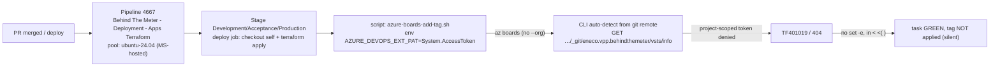

# Context — BTM PR work-item auto-tagging fails with TF401019

## TL;DR

The `Eneco.Vpp.BehindTheMeter` deployment pipeline has a step that auto-tags the
ADO work item on a PR with `DEV`/`ACC`/`PRD` when it deploys. That step calls the
Azure DevOps CLI (`az boards`). Because the calls omit `--organization`/`--project`,
the CLI **auto-detects context from the local git remote**, which issues
`GET …/_git/eneco.vpp.behindthemeter/vsts/info`. The pipeline's **project-scoped
job token** (`enforceJobAuthScope=true`) is denied on that call → **`TF401019 … 404`**.
The script has no `set -e` and the failure is inside a `< <(…)` process substitution,
so the task goes **green while the tag is silently never applied**.

The fix is **one line per call**: pass `--organization "$(System.CollectionUri)" --project "$(System.TeamProject)" --detect false`. It stays on the Microsoft-hosted
agent, needs no second runner, no job split, and no ADO permission change.

## Context Ledger (zero-context reader)

| Term | Definition | Artifact | Relevance to THIS incident |
|------|-----------|----------|----------------------------|
| **BTM** | Behind-The-Meter — energy assets behind the customer's meter. Here it names the team/area `Team BtM` and the repo `Eneco.Vpp.BehindTheMeter`. | repo `Eneco.Vpp.BehindTheMeter`; area `Myriad - VPP\Team BtM` (AreaId 6393) | The pipeline + work items being tagged belong to BTM |
| **VPP** | Virtual Power Plant — Eneco's energy-trading platform. | ADO project `Myriad - VPP` | Parent project of the repo and work items |
| **ADO** | Azure DevOps — repos + pipelines + boards, org `enecomanagedcloud`. | dev.azure.com/enecomanagedcloud | Hosts everything in this incident |
| **TF401019** | ADO error: "The Git repository with name or identifier X does not exist or you do not have permissions … 404". A documented **404-masks-403** (permission/scope denial), not a deleted repo. | build 1663945 log 43 | The reported "git error" |
| **`az boards`** | Azure DevOps CLI (the `azure-devops` az extension) for Boards/work-item operations. | `azure-pipelines/steps/azure-boards-add-tag.sh` | The command that emits TF401019 |
| **Auto-detection** | When `--organization`/`--project` are omitted, the CLI reads `git remote origin` and calls `/_git/<repo>/vsts/info` to resolve org/project/repo. | `az --debug` trace | The exact failing call |
| **`enforceJobAuthScope`** | Project pipeline setting "Limit job authorization scope to current project" — the build job token is project-scoped, not collection-scoped. | project generalSettings = `true` | The scope gate that denies the detection call |
| **`System.AccessToken`** | The pipeline job's OAuth token = the project Build Service identity. Scope set by `enforceJobAuthScope`; **independent of the agent pool**. | YAML `env: AZURE_DEVOPS_EXT_PAT: $(System.AccessToken)` | Auth used by `az boards`; identity does not change with pool |
| **`sre-managed-linux`** | A self-hosted ADO agent pool ("Core Platform / SRE Azure runner"). | PR 178802 (.B2B) `pool: sre-managed-linux` | The sibling team's workaround pool |
| **Microsoft-hosted pool** | `vmImage: ubuntu-24.04`, agents named "Azure Pipelines N". | pipeline 4667 default pool | Where the failing pipeline runs |
| **Agg team** | Aggregation team — runs the same tagging pattern in `.B2B`. | PR 178802 | Source of the "switch runner" workaround |

## System overview

## Evidence ledger

| # | Claim | Label | Evidence |
|---|-------|-------|----------|
| E1 | Error is `TF401019 … eneco.vpp.behindthemeter … 404` in the tagging step | A1 | build 1663945, log 43: `ERROR: TF401019: The Git repository with name or identifier eneco.vpp.behindthemeter does not exist or you do not have permissions … 404` |
| E2 | Failing step runs `exec ./azure-pipelines/steps/azure-boards-add-tag.sh` and is marked **succeeded** despite the error | A1 | log 43 shows error then `##[section]Finishing: Add DEV tag in ADO`; timeline record result=`succeeded` |
| E3 | The script's first network call is `az boards query` (inside `done < <(…)`); only git op is local `git log` | A1 | repo file `azure-pipelines/steps/azure-boards-add-tag.sh` @ main |
| E4 | Only `az boards query` (not work-item show/update) auto-detects from the git remote when `--org/--project` omitted **and the per-remote cache is cold**; it calls `/_git/eneco.vpp.behindthemeter/vsts/info`. MS-hosted agents are ephemeral → cache always cold → fires every run | A1 | live `az boards query --debug` → `GET …/myriad%20-%20vpp/_git/eneco.vpp.behindthemeter/vsts/info` (lowercased id == E1 byte-for-byte); warm-cache re-run → 0 calls; `--detect false` → 0 calls; `az boards work-item show --debug` → no `/vsts/info` |
| E5 | `--organization/--project/--detect false` removes that call entirely | A1 | local `az boards query --org … --project … --detect false --debug`: only `/_apis/projects`, no `/vsts/info` |
| E6 | Project enforces job-auth scope | A1 | `generalSettings`: `enforceJobAuthScope=true`, `enforceReferencedRepoScopedToken=false` |
| E7 | Job token identity is the project Build Service identity, independent of agent pool | A1 | Microsoft Learn (access-tokens; new-service-connection roadmap) — see `.ai/tasks/.../context/ado-auth-scope-docs.md` |
| E8 | YAML passes `AZURE_DEVOPS_EXT_PAT: $(System.AccessToken)` and runs on `vmImage: ubuntu-24.04` (MS-hosted) | A1 | `deploy-terraform.pipeline.yml` @ main, lines 17-18, 63-66, 100-103, 137-140 |
| E9 | Sibling fix PR 178802 (.B2B) only moved tagging into a separate `job` with `pool: sre-managed-linux` | A1 | PR 178802 diff on `deploy-terraform.pipeline.yml` (single file, edit) |
| E10 | Work items tagged (AreaId 6393) are all in `Myriad - VPP\Team BtM` (same project) | A1 | `az boards work-item show` for 407582/407712/408284 → `project: Myriad - VPP`, `area: Myriad - VPP\Team BtM` |
| E11 | Build 1663945 currently inProgress at the PRD approval gate; Dev/Acc tagging tasks "succeeded" on MS-hosted pool with the error present | A1 | `az pipelines runs show` + timeline records |
| E12 | Exact denial reason for the same-project `/vsts/info` while `checkout: self` succeeds | A2 | INFER: detection performs collection-level resolution (`/_apis/projects` + `/_git/.../vsts/info`) the project-scoped token is denied; definitive confirmation = pipeline `system.debug=true` trace. Not load-bearing — the fix removes the call. |
| E13 | Onset window (when tagging first broke) | A1 | bisected pipeline 4667 `Add DEV tag` logs: 2026-04-15 (build 1608485) TF401019 **absent** (worked); 2026-04-25 (build 1621832) TF401019 **present** (broken), and every build since. No code change (E3 + YAML last changed 2025-05-19) → external trigger; sibling Agg pipeline broke same window (fix PR 178802 merged 2026-05-26) → org-level change |
| E14 | `az boards work-item show/update` reject `--project` | A1 | `az boards work-item show --org … --project "Myriad - VPP" --id 426514` → `ERROR: unrecognized arguments: --project`; without it → `System.Tags='ACC; DEV; PRD'`. (Only `az boards query` takes `--project`.) |
| E15 | Original script silently clobbers existing tags (latent) | A1/A2 | `az boards query` flat result returns no `System.Tags` (JSON `fields:{System.Id}` only) → original `read -r id tags` always got `tags=""` → wrote `System.Tags=; $TAG`, replacing existing tags. Harmless only because BtM items carry no other tags. Hardened script reads+unions. |
| E16 | Exact onset date + which trigger (setting enablement vs agent image bump) | A3 | UNVERIFIED[blocked]: needs org **Pipelines/Repository audit log** (portal); or finer build bisection 04-15→04-25 |

## Access note

All ADO evidence gathered read-only via the `azure-devops` az extension as
`Alex.Torres@eneco.com`. (`az rest --resource <ADO-GUID>` hits AADSTS50078 MFA-expired;
the extension path is unaffected.) No ADO mutations were performed.
