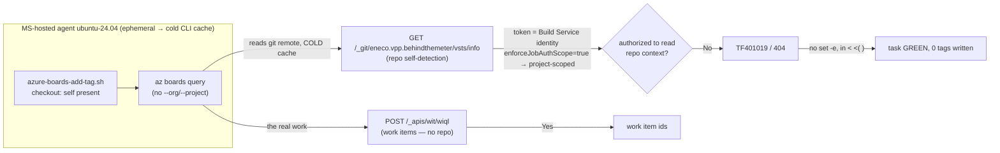
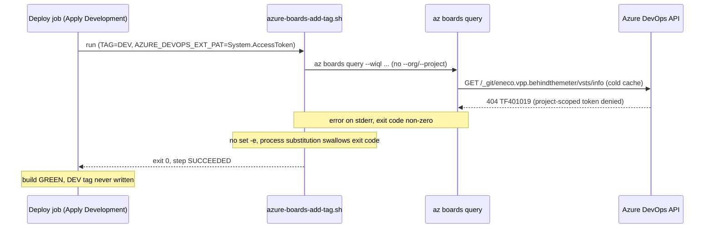
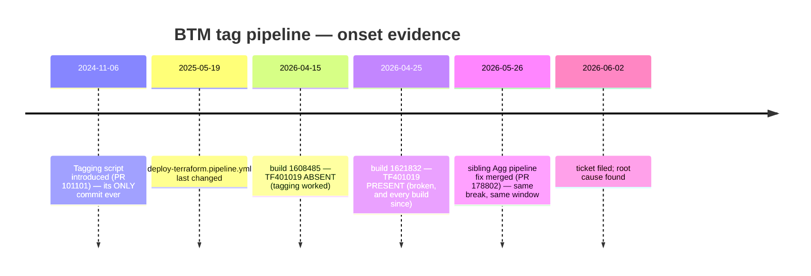

# Why the BTM PR auto-tagging "git error" happened — and how to fix it for one line

## Audience and scope

For Mr. Alex (and the next on-call engineer). Goal: you finish able to **explain,
draw, reproduce, and defend** this diagnosis yourself — not just copy a command.
In scope: the exact failure mechanism, why the sibling team's "switch the runner"
fix is a mask, and the one-line root-cause fix. Out of scope: how Azure Boards
work items are modelled, and TenneT market mechanics.

## Knowledge Contract

After reading this you will be able to:

1. **Draw** the path from a `git remote` URL to the `TF401019 / 404` and to a
   green build with a missing tag.
2. **Explain why** a *Boards* command (`az boards`) emits a *git-repository*
   error, even though tagging never reads the repo.
3. **Trace** why the build is **green** while the tag was **never applied**.
4. **Predict** what changes if you (a) switch the agent pool, (b) add
   `--org/--project`, (c) add `--detect false`, (d) warm the CLI cache.
5. **Reject** the false fix ("move it to the Core Platform runner") with a
   mechanism, not an opinion.
6. **Defend** the diagnosis against "maybe the repo permission is just missing"
   and name the one probe that would change my mind.
7. **Reproduce** the failing call on your laptop in two read-only commands.

This document does **not** teach you the exact internal ACL that distinguishes a
checkout credential from the CLI's API token — that remains an open INFER, named
at the end.

## TL;DR picture

```text
git remote (origin) ─▶ az boards query (no --org, COLD cache)
                         └─▶ GET .../_git/eneco.vpp.behindthemeter/vsts/info   ← repo self-detection
                               └─▶ project-scoped job token DENIED (enforceJobAuthScope=true)
                                     └─▶ TF401019 / 404
                                           └─▶ error swallowed (no set -e, inside  done < <( ) )
                                                 └─▶ task = GREEN, tag never written
FIX: az boards query --organization … --project … --detect false   ← the /vsts/info call disappears
```

This single ASCII chain is the spine. Everything below proves one link of it.

## First-principles ladder

Climb in order; each rung is the smallest true statement the next one needs.

| Rung | Statement |
|------|-----------|
| **Term** | `az boards` is the Azure DevOps CLI for *work items* (Boards), not for git. |
| **Primitive** | To call any ADO API the CLI needs an **organization + project context**. If you don't pass `--organization/--project`, it **auto-detects** them. |
| **How it auto-detects** | It reads your checkout's `git config remote.origin.url`, then calls `GET <org>/<project>/_git/<repo>/vsts/info` to resolve which org/project/repo that remote is. The answer is cached in `~/.azure/azuredevops/cache/remotes.json`. |
| **Invariant** | A *pipeline* job runs under the **Build Service identity** (`System.AccessToken`). With the project setting **`enforceJobAuthScope=true`**, that token is **project-scoped**. The identity is a property of the **project**, *not the agent pool*. |
| **Mechanism** | On an **ephemeral Microsoft-hosted agent the cache is always cold**, so `az boards query` (which omits `--org`) issues the `/vsts/info` call on *every* run. The project-scoped token is denied that repository-context read → **`TF401019`** (ADO's "404 that really means 403"). |
| **Consequence** | The query errors; but the script has **no `set -e`** and runs the query inside `done < <( … )`, so the non-zero exit is **swallowed**. The task exits 0 → **green build, tag never applied**. |
| **Failure (invariant violated)** | The script assumed "CLI auto-detection is free." Under `enforceJobAuthScope`, repo self-detection is *not* free — it's a privileged read the job token lacks. |
| **Defense / repair** | Pass `--organization/--project/--detect false` so the CLI **never resolves the repo** — there is no `/vsts/info` call to deny. |

Notice the surprise the ladder removes: the error names a **git repository**, yet
the tagging logic never touches one. The repo only appears because the CLI tried
to *figure out where it was* — pure context plumbing, not a data dependency.

## System map (topology — "what exists and how is it wired")

Its job: show that the only thing reaching for the repo is the CLI's
self-detection, and that the token's scope is set by the *project*, not the pool.



Read it twice: `/vsts/info` is a *side path* the CLI takes only to learn context;
`wiql`/`workItems` (the actual tagging) never name the repo.

## Mechanism over time (sequence — "what happens first, and what changes next")

Its job: make the ordering testable. The error appears **before** any tagging,
which is why no "Adding tag…" line is ever printed.



Delete this diagram and you lose the ability to **predict** that the build is
green and that there is no partial tagging — that prediction is the whole
"silent failure" insight.

## The local mental model (redraw this from memory)

```text
   no --org/--project        explicit --org --project --detect false
   ─────────────────         ───────────────────────────────────────
   read git remote           (skip — context is given)
        │                            │
   COLD cache? ── yes ──▶ /vsts/info  │  (no /vsts/info call exists)
        │                    │        │
        │                  DENY 403   │
        │                    │        ▼
        ▼                  TF401019   wiql → ids → tag (union)
   warm cache → skip
```

This four-box ladder is the entire decision surface: detection happens only on a
cold cache with no explicit context; explicit context + `--detect false` removes
the branch that can fail.

## Worked example and counterexample (proof by reproduction)

**Example (the bug), run read-only on a laptop whose CLI cache is cold:**

```bash
az boards query --debug \
  --wiql "SELECT [System.Id] FROM workitems WHERE [System.AreaId]=6393" 2>&1 | grep vsts/info
# DEBUG: GET https://…/myriad%20-%20vpp/_git/eneco.vpp.behindthemeter/vsts/info
```

The lowercased `eneco.vpp.behindthemeter` is **byte-for-byte** the string in the
pipeline's `TF401019`. That is the link from "Boards command" to "git-repo error."

**Counterexample (the fix), same machine:**

```bash
az boards query --organization "https://dev.azure.com/enecomanagedcloud/" \
  --project "Myriad - VPP" --detect false --debug \
  --wiql "SELECT [System.Id] FROM workitems WHERE [System.AreaId]=6393" 2>&1 | grep -c vsts/info
# 0
```

Zero `/vsts/info` calls. The failing request structurally cannot occur, so the
`TF401019` cannot occur — regardless of the token's repo permissions.

**Counterexample 2 (why "it works on my machine" lies):** run the buggy command
**twice**. The first cold run hits `/vsts/info`; the second is warm
(`~/.azure/azuredevops/cache/remotes.json`) and skips it. A laptop hides the bug
after one run; an **ephemeral CI agent is permanently cold**, so it fails every
time. This is why the pipeline fails but a quick local test might not.

## Failure modes / anti-patterns (each with its mechanism)

| Shortcut that looks right | Why it fails (mechanism) |
|---------------------------|--------------------------|
| **"Switch the job to the Core Platform `sre-managed-linux` runner."** | The git-auth identity is the **project Build Service identity**, fixed by `enforceJobAuthScope`, **independent of the pool**. Switching pools doesn't change *what* is denied. It only appears to work because that self-hosted image ships a **different `az`/extension version** that may not do cold-cache `/vsts/info` detection, **or** carries a broad cached credential. It masks the cause and costs a second runner + a split job. *(This is INFER — see the open question.)* |
| **"Grant the Build Service `Read` on the repo / disable `enforceJobAuthScope`."** | Works, but loosens security to satisfy a *context-plumbing* call the script doesn't actually need. Once detection is off, no repo read happens at all. |
| **"Add `--project` to every `az boards` call."** | `az boards work-item show/update` **reject** `--project` (`unrecognized arguments`) — work items are org-global by id. Only `az boards query` takes `--project`. |
| **"Add `set -euo pipefail` and ship."** | The tagging step has **no `continueOnError`**, so a naive `set -e` turns a transient WIT 5xx — or any future cross-project item — into a **failed deployment** for a *cosmetic* tag. Fix: loud **and** non-blocking (`SucceededWithIssues`). |
| **"The query returns the tags, just reuse them."** | A flat `az boards query` returns **only `System.Id`** (no `System.Tags`). The original read got `tags=""` and wrote `System.Tags=; DEV`, **replacing** the tag list. Harmless only because BtM items carry no other tags. Correct: read each item's tags and write the **union**. |

## Timeline (when the evidence appeared)

Its job: prove "no code changed," so the trigger must be external.



Between 2026-04-15 and 04-25 the tag stopped applying with **no BTM change** →
an org/platform trigger (most likely `enforceJobAuthScope` being enabled, or an
`ubuntu-24.04` agent `az`/extension bump). The sibling team breaking in the same
window is strong corroboration of an org-level cause.

## Evidence ledger (FACT / INFER / UNVERIFIED)

| Claim | Status | How I know |
|-------|--------|-----------|
| Error = `TF401019 … eneco.vpp.behindthemeter … 404` in the tag step | **FACT** | build 1663945, log 43 |
| The failing call is `az boards query`'s `/vsts/info` repo self-detection | **FACT** | live `az boards query --debug`; the lowercased repo id matches the error string |
| `--org/--project/--detect false` removes the call | **FACT** | live `--debug`: 0 `/vsts/info` calls |
| `az boards work-item show/update` never call `/vsts/info` | **FACT** | live `--debug`: only `/_apis/wit/...` |
| `enforceJobAuthScope=true` on the project | **FACT** | pipeline generalSettings API |
| Build Service identity is pool-independent | **FACT** | Microsoft Learn (access-tokens; service-connection roadmap) |
| Onset 2026-04-15 → 04-25, no code change | **FACT** | build-log bisection + git history |
| The original script clobbers existing tags | **FACT/INFER** | query returns no `System.Tags`; PATCH `add` on `System.Tags` replaces the field |
| Sibling pool-switch "works" because of a different az/ext version or cached cred | **INFER** | not probed; falsifier = inspect `az`/ext version on `sre-managed-linux` |
| The exact ACL that denies same-project `/vsts/info` while `checkout: self` succeeds | **UNVERIFIED** | needs an in-pipeline `system.debug=true` trace + the Build Service repo ACL |

## Challenge-defense (survive an expert reviewer)

| Challenge | Defense |
|-----------|---------|
| "How is this *cause*, not correlation?" | I removed the suspected cause in isolation (`--detect false`) and the `/vsts/info` call disappeared (FACT). The error string is byte-identical to the detection URL's repo id. |
| "Maybe the token simply lacks repo access, so the fix only relocates the denial." | After `--detect false`, **no remaining call names the repo** (`--debug`: only `wiql` + `workItems`). The fix doesn't move the denial; it deletes the only repo-scoped call. |
| "What would change your mind?" | An in-pipeline `system.debug=true` trace showing `TF401019` emitted by a request **other than** `/vsts/info` (e.g. a `/_apis/git/...` call that survives `--detect false`). Then the fix would be wrong and the route becomes a permission grant. |
| "Why did it pass on someone's laptop?" | CLI cache: cold first run calls `/vsts/info`, warm runs skip it. CI agents are permanently cold. |
| "Why not just switch runners like the other team?" | Identity is pool-independent (FACT); the pool can only mask via env/version differences (INFER). It costs a runner + a job split and leaves the cause in place. |

## Self-test (answers below)

1. A *Boards* command emits a *git-repository* 404. In one sentence, why?
2. The build is green but the tag is missing. Name the two script properties
   that together produce "silent green."
3. You add `--organization/--project` but **not** `--detect false`, and it works
   in CI. Is that robust? Why or why not?
4. Why does the same `System.AccessToken` succeed for `checkout: self` but get
   `TF401019` on `/vsts/info`? What is your confidence label?
5. The sibling team fixed it by switching to `sre-managed-linux`. Give the
   mechanism by which that *could* work and the probe that would confirm it.

<details><summary>Answers</summary>

1. Because `az boards query` auto-detects context from the git remote by calling
   `/_git/<repo>/vsts/info`; the project-scoped job token is denied that read →
   `TF401019`. The tagging logic itself never touches the repo.
2. (a) no `set -e`; (b) the query runs inside `done < <( … )` (a process
   substitution), so its non-zero exit never propagates → the step exits 0.
3. Partly. Explicit `--org/--project` flags do suppress detection (FACT), but
   the *robust, deterministic* switch is `--detect false`; relying on flags-only
   is more fragile than turning detection off outright. Prefer `--detect false`.
4. **UNVERIFIED.** `checkout: self` uses the agent-injected repo-scoped checkout
   credential; the CLI reaches `/vsts/info` as a generic API caller using
   `System.AccessToken`, which `enforceJobAuthScope` denies the repo-context
   read. The exact distinguishing ACL needs an in-pipeline `--debug` trace.
5. A different `az`/azure-devops-extension version on that image may not perform
   the cold-cache `/vsts/info` detection, **or** the self-hosted agent holds a
   broad cached credential. Probe: `az version` / `az extension show --name
   azure-devops` on an `sre-managed-linux` agent (INFER until then).

</details>

## Durable principles (carry these to the next incident)

1. **A green step is not a realized effect.** A script that swallows exit codes
   (no `set -e`, or work inside `< <( )`/pipes) can succeed while doing nothing.
   Verify the *effect* (the tag), never the *status*.
2. **CLI convenience features have permissions.** "Auto-detect my context" is a
   privileged read. Under scoped tokens, make context **explicit** and turn
   auto-detection **off** in automation.
3. **Identity ≠ machine.** A pipeline's auth identity is set by project/scope,
   not by the agent pool. "Switch the runner" rarely fixes an auth/scope denial —
   it relocates the symptom.
4. **Date the onset before theorizing the cause.** Bisecting build logs turned
   "weeks or months ago" into "2026-04-15 → 04-25, no code change," which by
   itself proves the trigger was external.
5. **Cosmetic post-steps must be loud but non-blocking.** Use ADO
   `SucceededWithIssues`, not a bare `set -e`, so a tag failure is visible yet
   never fails a deployment.
