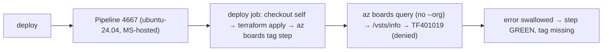

# Holistic RCA — BTM PR auto-tagging "git error" (TF401019)

> Deep teaching companion: [`feynman-explanation.md`](./feynman-explanation.md).
> Full evidence ledger + probes: [`context.md`](./context.md).
> Fix + script + PR text: [`fix.md`](./fix.md) and
> [`azure-boards-add-tag.fixed.sh`](./azure-boards-add-tag.fixed.sh).
>
> **STATUS:** root cause proven (A1); fix authored + locally validated; **not yet applied
> to the repo and not yet verified in the live pipeline** (applying = a PR, awaiting go-ahead).

## Context Ledger (zero-context reader)

| Term | Meaning | Relevance |
|------|---------|-----------|
| **BTM / Team BtM** | "Behind-The-Meter" team; repo `Eneco.Vpp.BehindTheMeter`; board area `Myriad - VPP\Team BtM` (AreaId 6393) | Owns the pipeline + the work items being tagged |
| **PR auto-tagging** | A pipeline step that stamps `DEV`/`ACC`/`PRD` on the work item linked to a PR once it deploys to that environment | The thing that "broke" |
| **`az boards`** | Azure DevOps CLI for work items (Boards) | Emits the error |
| **auto-detection / `/vsts/info`** | When `--org/--project` are omitted, the CLI resolves context from the git remote via `GET …/_git/<repo>/vsts/info` | The failing call |
| **`enforceJobAuthScope`** | Project setting: pipeline job token is project-scoped, not collection-scoped | The gate that denies the call |
| **`System.AccessToken`** | The job's OAuth token = project Build Service identity; pool-independent | The denied identity |
| **TF401019** | ADO "repo does not exist OR you lack permission … 404" — a 404-masks-403 | The reported "git error" |

## L1 — Business — Why BTM PR auto-tagging exists

The BTM team tracks each user story's delivery on the Azure Boards. The pipeline
auto-stamps `DEV`/`ACC`/`PRD` on a work item when its change reaches that
environment, so the board shows "how far has this shipped" without manual tagging
(A2, from the script's intent + step names `Add DEV/ACC/PRD tag in ADO`). It is
**cosmetic but operationally useful** board hygiene; failure does not break a
deployment, only the team's release-visibility signal. Priority was low ("I can
wait a couple of days" — intake). **Who is blocked:** the BTM team's board
accuracy, and any reporting that filters by environment tag.

## L2 — Repo system

- `Eneco.Vpp.BehindTheMeter` — id `718866fa-75c4-48d9-af82-9cf23a3d5b8c`, project
  `Myriad - VPP`, default branch `main`. Holds pipeline 4667 + the tag script. **(A1)**
- `Eneco.Vpp.BehindTheMeter.B2B` — id `5bb311ec-…`. The **sibling** repo whose
  identical break the Agg team "fixed" by switching pools (PR 178802). **(A1)**
- The work items live in the **same** project (`Myriad - VPP\Team BtM`, AreaId 6393) —
  no cross-project access is needed. **(A1: `az boards work-item show` on 407582/…)**

## L3 — Runtime architecture

Pipeline **"Behind The Meter - Deployment - Apps Terraform"** (defId 4667), entry
`azure-pipelines/deploy-terraform.pipeline.yml`, default pool **`vmImage: ubuntu-24.04`**
(Microsoft-hosted, ephemeral). Stages: `Build → Development → Acceptance → Production`,
each a `deployment` job (`runOnce`) targeting environments `btm-{development,acceptance,
production}`. Inside each deploy job: `checkout: self` → `terraform apply` → **`- script:
azure-boards-add-tag.sh`** with `env: AZURE_DEVOPS_EXT_PAT: $(System.AccessToken)`, `TAG:
DEV|ACC|PRD`, and **no `continueOnError`**. **(A1: YAML @ main, lines 17, 44-141)**



## L4 — Application code flow

`azure-pipelines/steps/azure-boards-add-tag.sh` (A1, @ main):

1. `work_items = git log … | grep 'Related work items:' | grep -Po '\d+'` (local; no auth).
2. Build a WIQL `SELECT … WHERE System.AreaId = 6393 AND System.Tags NOT CONTAINS '$TAG'
   AND System.Id IN ($work_items)`.
3. `done < <(az boards query --wiql "$query" --output table | tail -n +3)` — **the first
   network call**; `az boards query` omits `--org/--project`.
4. Per row: `az boards work-item update --field "System.Tags=$tags; $TAG"`.

The failing call is **step 3** (`az boards query`). Steps 1, 2, 4 never reach the repo.
(See [`feynman-explanation.md`](./feynman-explanation.md) for the mechanism.)

## L5 — IaC / state / Azure — the three truths

There is no Terraform for the tagging itself; the load-bearing "truth" is an **ADO
project setting**:

| Truth | Value | Source |
|-------|-------|--------|
| What the YAML says runs | `az boards` under `System.AccessToken` on ubuntu-24.04 | YAML (A1) |
| What the project enforces | **`enforceJobAuthScope=true`** (job token project-scoped); `enforceReferencedRepoScopedToken=false` | generalSettings API (A1) |
| What actually happens | `az boards query` cold-cache `/vsts/info` repo read → **denied** → TF401019 | live `--debug` + build log (A1) |

The divergence is between "the script assumes context auto-detection is free" and "the
project scopes the token so the repo-context read is not free."

## L6 — The pipeline and how it actually runs

The azure-devops CLI, given no `--org/--project`, resolves context from
`git config remote.origin.url` by calling `GET <org>/<project>/_git/<repo>/vsts/info`,
caching the result in `~/.azure/azuredevops/cache/remotes.json`. **A Microsoft-hosted
agent is ephemeral, so the cache is always cold** → the call fires every run **(A1: cold
vs warm `--debug` probes)**. Under `enforceJobAuthScope=true`, the project-scoped Build
Service token is denied that repository-context read → **`TF401019/404`** (the lowercased
`eneco.vpp.behindthemeter` in the error is byte-identical to the detection URL — A1). The
script has **no `set -e`** and runs the query inside `done < <( … )`, so the non-zero exit
is swallowed → the step is **GREEN, zero tags written** (A1: build 1663945 log 43 shows
the error then `Finishing … succeeded`).

## L7 — Timeline

| When | Event | Label |
|------|-------|-------|
| 2024-11-06 | Tag script introduced (PR 101101) — its only commit ever | A1 |
| 2025-05-19 | `deploy-terraform.pipeline.yml` last changed | A1 |
| **2026-04-15** | build 1608485 — TF401019 **absent** (worked) | A1 |
| **2026-04-25** | build 1621832 — TF401019 **present** (broken; every build since) | A1 |
| 2026-05-26 | sibling Agg fix merged (PR 178802) — same break, same window | A1 |
| 2026-06-02 | ticket filed; build 1663945 parked at PRD approval gate | A1 |

No BTM code changed in the onset window → **external/org-level trigger** (most likely
`enforceJobAuthScope` enablement or an ubuntu-24.04 `az`/extension bump). Exact date/trigger
needs the org **audit log** (A3).

## L8 — Fix

**Root cause:** `az boards query` auto-detects the repo (cold-cache `/vsts/info`) and the
project-scoped token is denied. **Fix:** pass `--organization/--project/--detect false` to
`az boards query` so detection — and the failing call — never happens.

- **Minimal (1 line):** add the three flags to the `az boards query` line only.
- **Recommended (hardened script):** + tag **union** (no clobber) + **loud-but-non-blocking**
  failure (`SucceededWithIssues`, since the step has no `continueOnError`).
- **Rejected:** the sibling "switch to `sre-managed-linux`" — the auth identity is
  pool-independent (A1 docs); the pool only masks the cause (A2) and costs a runner + a
  job split (the user's stated concern).

Full diff, script, option matrix, and PR text: [`fix.md`](./fix.md).

## L9 — Verification

1. Run the deploy pipeline on a PR referencing a `Team BtM` work item; the `Add DEV tag`
   log shows `Work item <id>: … -> 'DEV'` and **no TF401019**.
2. **Assert the realized tag** (not just green): `az boards work-item show --org … --detect
   false --id <id> --query "fields.\"System.Tags\""` contains `DEV` **and** the item's prior
   tags (proves union, not clobber).
3. One `system.debug: true` run shows the `/vsts/info` call vanish post-fix — this promotes
   the one remaining INFER (exact ACL) to FACT.
4. Local read-only repro of bug vs fix via `--debug | grep vsts/info` (see fix.md).

Script pre-validated: `shellcheck` clean, `bash -n` clean, read-only dry-run correct
(item 426514 → SKIP since it has DEV; tagless item → clean `DEV`). **(A1, this session)**

## L10 — Lessons

1. **Green ≠ realized.** Error-swallowing scripts (no `set -e`; work inside `< <( )`/pipes)
   succeed while doing nothing. Verify the effect, not the status. *(See LL candidate.)*
2. **CLI auto-detection is a privileged read.** Make org/project explicit and
   `--detect false` in automation under scoped tokens.
3. **Identity ≠ agent pool.** Pipeline auth identity is set by project/scope; "switch the
   runner" relocates, not fixes, an auth/scope denial.
4. **Date the onset first.** Build-log bisection turned "weeks/months ago" into a 10-day
   window with no code change → proved an external trigger.
5. **Cosmetic post-steps: loud but non-blocking** (`SucceededWithIssues`), never bare `set -e`.

## L11 — End-to-end command playbook (reproduce from cold)

```bash
ORG=https://dev.azure.com/enecomanagedcloud; PROJ="Myriad - VPP"
# 1. The failing build's tag-step log (the TF401019):
az devops invoke --org "$ORG" --area build --resource timeline \
  --route-parameters project="$PROJ" buildId=1663945 --api-version 7.1 \
  --query "records[?name=='Add DEV tag in ADO'].log.id | [0]" -o tsv
az devops invoke --org "$ORG" --area build --resource logs \
  --route-parameters project="$PROJ" buildId=1663945 logId=43 --api-version 7.1

# 2. The project scope setting:
az devops invoke --org "$ORG" --area build --resource generalSettings \
  --route-parameters project="$PROJ" --api-version 7.1 \
  --query "{jobScope:enforceJobAuthScope, repoScope:enforceReferencedRepoScopedToken}"

# 3. Reproduce the failing call locally (cold cache), then prove the fix:
az boards query --debug --wiql "SELECT [System.Id] FROM workitems WHERE [System.AreaId]=6393" 2>&1 | grep vsts/info
az boards query --org "$ORG" --project "$PROJ" --detect false --debug \
  --wiql "SELECT [System.Id] FROM workitems WHERE [System.AreaId]=6393" 2>&1 | grep -c vsts/info   # → 0

# 4. Onset bisection (worked 04-15, broken 04-25):
for d in 2026-04-15 2026-04-25; do
  bid=$(az devops invoke --org "$ORG" --area build --resource builds --route-parameters project="$PROJ" \
        --query-parameters definitions=4667 "maxTime=${d}T00:00:00Z" '$top=1' queryOrder=finishTimeDescending resultFilter=succeeded \
        --api-version 7.1 --query "value[0].id" -o tsv)
  lid=$(az devops invoke --org "$ORG" --area build --resource timeline --route-parameters project="$PROJ" buildId="$bid" \
        --api-version 7.1 --query "records[?name=='Add DEV tag in ADO'].log.id | [0]" -o tsv)
  echo "$d build=$bid TF401019=$(az devops invoke --org "$ORG" --area build --resource logs \
        --route-parameters project="$PROJ" buildId="$bid" logId="$lid" --api-version 7.1 -o json | grep -c TF401019)"
done
```

## L12 — One-page on-call playbook

```text
SYMPTOM: ADO pipeline step running `az boards`/`az repos` prints
         "TF401019: The Git repository … does not exist or you do not have permissions … 404"
         (often a GREEN step — the tag/effect silently never happened).

5-MIN TRIAGE
  1. Is the repo really gone?  az repos show --repository <repo>  → exists? then it's PERMISSION, not missing.
  2. Grep the step log for the lowercased repo id in the TF401019 string.
  3. Is the failing command an `az boards`/`az repos` call WITHOUT --organization/--project?  → almost certainly
     git-remote auto-detection ( GET /_git/<repo>/vsts/info ) denied by enforceJobAuthScope.
  4. Confirm: az devops invoke build generalSettings → enforceJobAuthScope == true?

FIX (cheapest first)
  • Add  --organization "$(System.CollectionUri)" --project "$(System.TeamProject)" --detect false
    to the `az boards query` call.  (work-item show/update take --org only, NOT --project.)
  • Do NOT "switch the runner" — identity is pool-independent; that only masks it.

VERIFY
  • Step log shows the tag line + no TF401019.
  • az boards work-item show … --query fields.System.Tags  → tag present AND prior tags kept.

GOTCHA
  • The step can be GREEN while failing (no set -e + query inside `done < <( )`). Check the TAG, not the status.
```
