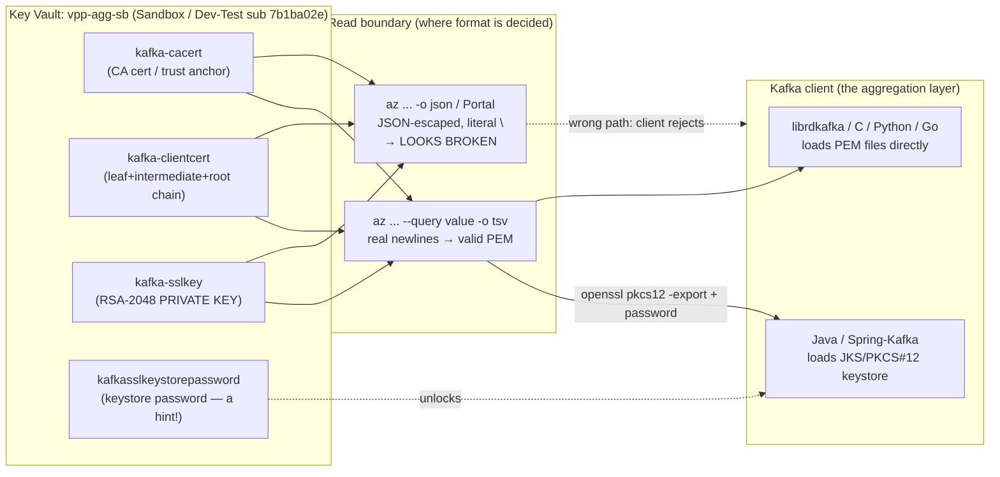
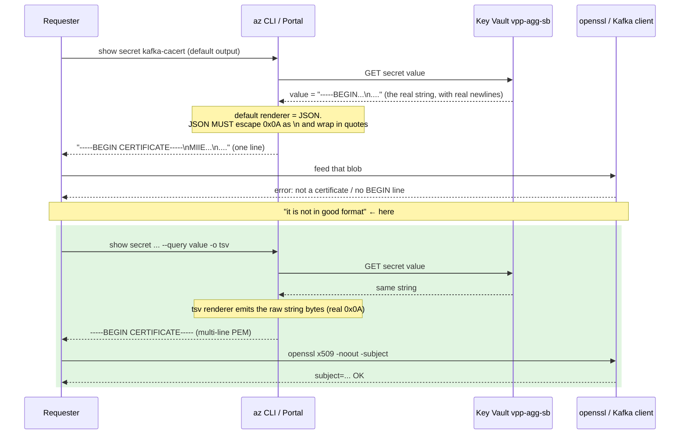
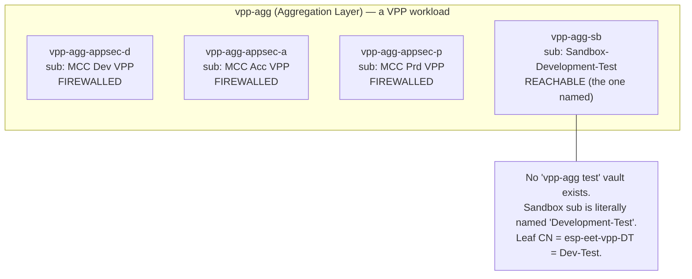
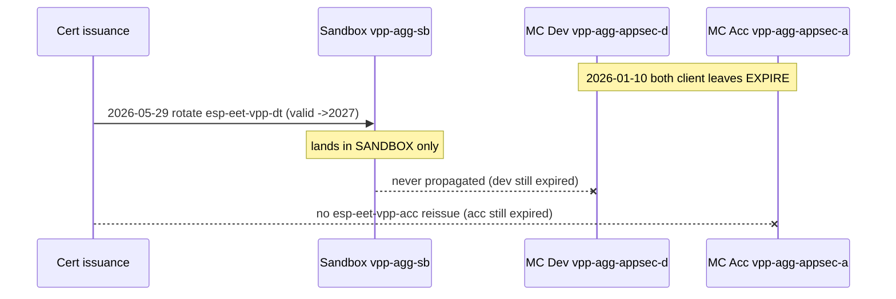

# The Kafka Cert That "Wasn't in Good Format" (and why it actually was)

> On-call request, #Myriad-platform: *"Can you provide us the Kafka certificate for dev and test.
> We tried to read the PEM content from key vault. it looks like it is not in good format.
> Keyvault: `vpp-agg-sb`. Keys: `kafka-cacert`, `kafka-clientcert`, `kafka-sslkey`."*

This document is built **backward from mastery**: after reading it you should be able to handle the
next "the cert from Key Vault is broken" ticket in five minutes, *and* know when the real answer is
"don't hand a private key over Slack."

---

## 0. Knowledge Contract

After reading this, you will be able to:

1. **Draw** the path a Kafka TLS secret takes from Azure Key Vault to a Kafka client, and name where
   the "format" can change shape.
2. **Explain why** the PEM "looked broken" — the precise mechanism by which `az ... -o json` and the
   Azure Portal mangle a valid PEM, and why `-o tsv` does not.
3. **Trace** how I proved the stored material is actually valid (CA → chain → leaf → private-key
   pairing) using `openssl`, and reproduce each command.
4. **Diagnose** the dev/test environment topology — why `vpp-agg-sb` (Sandbox) is the dev-test vault,
   and when you'd instead need the firewall-restricted `vpp-agg-appsec-d`.
5. **Reject** three plausible-but-wrong explanations (base64, expired cert, KV stored it wrong) with
   the evidence that kills each.
6. **Defend** the decision to deliver PEM, and adapt it when the consumer is Java (PKCS#12 keystore).
7. **Argue** why "please send me the Kafka cert over Slack" is a secret-handling anti-pattern, and
   state the correct self-serve resolution.

This document does **not** make you able to administer the upstream PKI (DigiCert / Trust Provider
B.V. issuance) or rotate the cert in the issuing system — only to retrieve, validate, and reason
about what's in Key Vault.

---

## 1. TL;DR picture

```text
        WHAT THE REQUESTER SAW                      WHAT IS ACTUALLY STORED
   (az ... --query value -o json, or Portal)        (az ... --query value -o tsv)

   "-----BEGIN CERTIFICATE-----\nMIIE...\n...."      -----BEGIN CERTIFICATE-----
    ^ quotes      ^ literal backslash-n, ONE LINE     MIIEsjCCA5qg...
                                                      -----END CERTIFICATE-----
        looks corrupt  ───────────────────────────►   valid PEM, parses in openssl
```

**The bytes in Key Vault are a correct, in-date, matched PEM set. The "corruption" is added by the
read tool, not by the storage.** The fix is a retrieval flag, not a re-upload.

One sentence to remember: **Key Vault stores an opaque string; `-o json` shows you that string
*inside a JSON envelope*, `-o tsv` shows you the string itself.**

---

## 2. First-principles ladder

Climb these in order; each rung is the smallest true statement the next depends on.

| Rung | Statement |
|------|-----------|
| **Term: PEM** | A text encoding: `-----BEGIN X-----`, base64 of the DER bytes, `-----END X-----`, separated by **real newline characters** (`0x0A`). The newlines are structural, not decoration. |
| **Term: the 3 objects** | `kafka-cacert` = the **CA certificate** (trust anchor used to verify the *broker*). `kafka-clientcert` = **this client's** certificate (its identity to the broker), here a full chain. `kafka-sslkey` = the client's **private key** (proves it owns that identity). Cert = public; key = secret. |
| **Primitive: a KV secret is just a string** | Azure Key Vault `secret` stores an arbitrary UTF-8 **string value** plus metadata (`contentType`, `enabled`, version). It does not know or care that the string is a PEM. |
| **Primitive: a transport re-encodes** | Any tool that *returns* the string chooses an output encoding. JSON output must escape newlines as the two characters `\` + `n` and wrap the value in quotes. TSV/raw output emits the bytes as-is. |
| **Invariant** | A PEM is valid **iff** its base64 body decodes to the DER the armor claims **and** the line structure is intact. Replace real `0x0A` newlines with the literal text `\n` and you no longer have PEM — you have a single line that base64/openssl reject. |
| **Mechanism** | The requester read the secret through a path that preserved JSON escaping (CLI default `-o json`, or the Portal's single-line field). The escaping is what they saw as "not in good format." |
| **Consequence** | `openssl`/`librdkafka`/`keytool` refuse the escaped blob (it doesn't start with `-----BEGIN`, or it's one line) → "bad format." |
| **Failure surface** | The failure is at the **read boundary**, not the storage boundary. |
| **Defense** | Re-read with `-o tsv` (or `--file`), then prove validity with `openssl`. |

> **Why "string, not cert" is load-bearing:** if you believe Key Vault "stores a certificate," you'll
> go hunting for a corrupt upload or a wrong `contentType`. It stores a *string*; the only question is
> how you turned that string back into bytes. Delete this rung and you chase the wrong layer.

---

## 3. System map — where the secret lives and who consumes it



**Job of this diagram:** separate the three layers people conflate — *storage* (KV), *read* (the
format-deciding boundary), *consumer* (PEM vs keystore). The bug lives entirely in the middle box.

ASCII version to keep in your head:

```text
  Key Vault string  ──►  [ read encoding ]  ──►  Kafka client
     (opaque)              json = broken           PEM (librdkafka)
                           tsv  = good             keystore (Java)
                              ▲
                     the ONLY thing that changed
```

---

## 4. Mechanism over time — the read path, step by step



**Job:** force *time and ordering* into the explanation. The same KV value produces two different
artifacts depending solely on the renderer chosen at read time. That ordering is what makes the cause
testable rather than a guess.

Reproduce the contrast yourself (CA cert is public, safe to print):

```bash
az account set --subscription 7b1ba02e-bac6-4c45-83a0-7f0d3104922e   # Sandbox / Dev-Test
# BROKEN view:
az keyvault secret show --vault-name vpp-agg-sb --name kafka-cacert --query value -o json | head -c 120
#   "-----BEGIN CERTIFICATE-----\nMIIEsjCCA5q..."
# GOOD view:
az keyvault secret show --vault-name vpp-agg-sb --name kafka-cacert --query value -o tsv | head -3
#   -----BEGIN CERTIFICATE-----
#   MIIEsjCCA5qg...
```

---

## 5. How I proved the stored material is genuinely valid

Three independent properties make a client-cert set "good": **the certs parse**, **the chain is
trusted**, and **the private key actually matches the cert**. I checked all three.

```bash
# 1. CA cert parses and is in-date
openssl x509 -in kafka-cacert.pem -noout -subject -issuer -dates
#   subject= CN=Trust Provider B.V. TLS RSA CA G1 ; issuer= DigiCert Global Root G2
#   notBefore=2017-11-02 ; notAfter=2027-11-02   ✔ in-date

# 2. Client cert is a 3-cert chain; leaf identity = the dev-test broker client
openssl x509 -in kafka-clientcert-leaf.pem -noout -subject -dates
#   subject= CN=esp-eet-vpp-dt.streaming.eneco.com   ← "vpp-dt" = VPP Dev-Test
#   notBefore=2025-12-09 ; notAfter=2027-01-09        ✔ in-date

# 3. The private key PAIRS with the leaf cert (compare PUBLIC keys only — never print the key)
diff <(openssl pkey -in kafka-sslkey.pem -pubout) \
     <(openssl x509 -in kafka-clientcert-leaf.pem -noout -pubkey) && echo "KEY MATCHES CERT"

# 4. The chain verifies up to the CA
openssl verify -CAfile kafka-cacert.pem kafka-clientcert-leaf.pem   #  => OK
```

**Why the key↔cert pairing matters (the rung people skip):** a cert and a key can both be individually
valid yet belong to *different* identities. If they don't pair, the TLS handshake fails with a
confusing "key values mismatch" at connect time, long after "the files looked fine." Comparing the
**public** halves (`-pubout` vs `-pubkey`) proves the pairing without ever exposing the private key.

```text
   private key  ──derive──►  PUBLIC key  ═══ must be byte-identical ═══  PUBLIC key  ◄──extract── leaf cert
        (secret, never printed)                                                   (public)
```

---

## 6. The environment topology — what "dev and test" really means here

The requester said "dev and test … MC Dev and MC Test environments." That phrase is **ambiguous**,
and resolving it is half the ticket. Evidence (Azure Resource Graph + the cert's own CN):



Reasoning chain (so you can defend it):

- **FACT:** the only `vpp-agg` vaults are `appsec-{d,a,p}` + `sb` + bootstrap vaults. There is **no
  `test`** vault. (`az graph query` over all subscriptions.)
- **FACT:** `vpp-agg-sb` is in the subscription literally named `Eneco Cloud Foundation -
  Sandbox-Development-Test`.
- **FACT:** the delivered client cert's leaf CN is `esp-eet-vpp-**dt**.streaming.eneco.com` →
  `dt` = **D**ev-**T**est.
- **INFER:** therefore the `vpp-agg-sb` set *is* the dev-test Kafka client identity — one cert serving
  dev+test — which is exactly the vault the requester named.
- **OPEN (don't assume):** if they actually need the **MC Dev runtime** client cert, that's a
  *different* CN inside the firewalled `vpp-agg-appsec-d`, reachable only via the MC service-principal
  login + IP whitelist (`eneco-tools-connect-mc-environments`). Confirm before doing that escalation.

ASCII decision ladder for the next ticket:

```text
"Need the dev/test Kafka cert"
   │
   ├─ Vault named is vpp-agg-sb?            → Sandbox/Dev-Test set (reachable, az login as yourself)
   │
   ├─ They say "MC Dev RUNTIME" / a broker  → vpp-agg-appsec-d (FIREWALLED)
   │     in MCC-Dev-VPP specifically            → needs MC SP login + whitelist, then whitelist-OFF
   │
   └─ Unsure?  → read the leaf CN. CN tells you the environment (vpp-dt vs vpp-d).
```

---

## 6b. Plot twist — the runtime certs are EXPIRED (the real problem)

The format issue is real but **secondary**. When you pull the certs from the *actual MC runtime
vaults* (not just the sandbox the requester named), the headline changes:

```text
  esp-eet-vpp-dt  (Sandbox  vpp-agg-sb)        notAfter 2027-01-09   ✅ VALID  (rotated 2026-05-29)
  esp-eet-vpp-dt  (MC Dev   vpp-agg-appsec-d)  notAfter 2026-01-10   ❌ EXPIRED
  esp-eet-vpp-acc (MC Acc   vpp-agg-appsec-a)  notAfter 2026-01-10   ❌ EXPIRED
                                                          ▲
                              same day — a calendar-expiry, not a one-off
```

**Mechanism:** a rotation on 2026-05-29 produced a valid `esp-eet-vpp-dt` cert, but it was written
**only to the sandbox vault** and never propagated to the MC Dev runtime vault. For acc
(`esp-eet-vpp-acc`) there is **no valid replacement anywhere reachable** — it needs re-issuance.



**Why the "format" symptom and the "expiry" cause coexist:** the requester looked at a vault, saw a
JSON-escaped or base64-wrapped blob, and reported "bad format." That's a true observation — but even
after you fix the encoding, the dev/acc certs are *dead*. Anchor on expiry: `openssl x509 -enddate`
+ `-checkend` is the check that would have caught the real issue immediately. This is the LL-006
credential-expiry class again — the durable fix is an expiry alarm + automated rotation **and
propagation**, not another manual retrieval. (See `cross-environment-findings.md` for the full table
and recommended actions.)

## 7. Counterexamples — three wrong explanations and the evidence that kills each

| Wrong explanation | Why it's tempting | Killing evidence (FACT) |
|---|---|---|
| "It's **base64-encoded** / double-encoded, just decode it." | The PEM body *is* base64, so people assume the whole value is. | Raw `-o tsv` bytes begin `-----BEGIN`, not base64 of a PEM; `file` reports "PEM certificate"; no decode step needed. Re-checked on all 3 secrets. |
| "The cert is **expired/rotated badly**, that's why it's broken." | The secrets were updated 2026-05-29 (4 days prior). | `openssl ... -dates`: CA →2027, leaf →2027-01-09. All in-date on 2026-06-02. Expiry produces a *handshake* failure, not a *parse* failure. |
| "Key Vault **stored it wrong** (literal `\n`, BOM, CRLF)." | The `-o json` view literally shows `\n`. | Byte probe of the `-o tsv` value: 0 literal `\n`, 0 CRLF, no BOM, real `0x0A` newlines. The `\n` is added by the JSON renderer, not present in storage. |

**Mechanism that unifies all three:** each assumes the *storage* is wrong. The evidence repeatedly
shows storage is fine and the *read encoding* is the variable. Anchor on the read boundary.

---

## 8. The consumer branch — PEM vs Java keystore (don't ship blind)

The same vault holds **`kafkasslkeystorepassword`**. A secret named `...keystorepassword` exists for
exactly one reason: a **Java keystore** workflow.

```text
   Which client consumes the cert?
        │
        ├─ librdkafka / C / Python (confluent-kafka) / Go
        │      ssl.ca.location      = kafka-cacert.pem
        │      ssl.certificate.location = kafka-clientcert.pem
        │      ssl.key.location     = kafka-sslkey.pem        ← PEM is correct as-is
        │
        └─ Java / Spring-Kafka / Kafka Streams
               ssl.keystore.location  = keystore.p12  (leaf+key)   ← needs PKCS#12, NOT raw PEM
               ssl.truststore.location= truststore.p12 (CA)
               ssl.keystore.password  = kafkasslkeystorepassword
```

If the consumer is Java, convert (the PEMs are the inputs; nothing in KV is wrong):

```bash
# keystore (client identity)
openssl pkcs12 -export -in kafka-clientcert.pem -inkey kafka-sslkey.pem \
  -certfile kafka-cacert.pem -name kafka-client -out keystore.p12
# truststore (CA)
keytool -importcert -alias kafka-ca -file kafka-cacert.pem -keystore truststore.p12 -storetype PKCS12
```

**Why not just ship PEM and hope:** a Java client fed a `.pem` as `ssl.keystore.location` throws
`Failed to load SSL keystore … of type JKS/PKCS12` — the PEM never loads. Ask the consumer type
before declaring the ticket done; the keystore-password secret is the tell that Java is in play.

---

## 9. The uncomfortable question — should this be a Slack request at all?

This is the part worth raising with the requester. **`kafka-sslkey` is a private key.** Two of the
three requested objects (`kafka-clientcert`, `kafka-sslkey`) are sensitive; the key is *the* secret.

```text
   Anti-pattern:  human  ──"paste the cert"──►  Slack  ──►  Slack servers / history / search / index
                    │                                         (durable, off-platform, hard to revoke)
                    └─ a PRIVATE KEY now lives in a chat system

   Intended:      app  ──managed identity / RBAC──►  Key Vault  (runtime fetch, key never leaves the boundary)
```

Why it's a smell, mechanistically:

1. **Slack is durable storage you don't control.** A private key pasted into Slack is now in Slack's
   servers, channel history, full-text search, and push notifications. You cannot reliably delete it.
   The whole point of Key Vault is that the secret *doesn't* get copied into systems like that.
2. **The intended access pattern is runtime, not human.** Applications read the secret via their
   managed identity / RBAC at startup. A human needing the raw key by hand signals one of: (a) local
   dev/test against the dev-test broker, (b) a consumer not wired to KV, or (c) the requester lacks
   direct KV access. **Each has a better fix than a Slack hand-off.**
3. **The correct help is self-serve, not extraction.** Since the stored value is valid and the only
   issue was the read method, the right resolution is: give the requester **KV read access (RBAC) on
   `vpp-agg-sb`** + the **`-o tsv` command**, so they pull it themselves and the key never traverses
   Slack.
4. **If the key has already been shared, rotate it.** It travelled through Slack and possibly files;
   combined with the unsettled 2026-05-29 rotation (3 *newer disabled* versions sit in the vault), a
   clean re-rotation is defensible. Dev/test keys still authenticate to dev/test brokers — a real,
   if lower, trust boundary.
5. **If a transfer is truly unavoidable:** use a secret manager / 1Password share or an ephemeral
   secure channel — never plain Slack/email — and delete after use.

**Script for the requester:** *"Happy to help. Two notes: (1) `kafka-sslkey` is a private key — rather
than me pasting it into Slack, let's get you KV read access + the `-o tsv` command so you retrieve it
directly; (2) the value in the vault is actually valid — what you saw was the JSON/Portal view, not a
corrupt secret. If this key's been shared around, we should rotate it."*

---

## 10. Evidence ledger

| # | Claim | Status | Source |
|---|-------|--------|--------|
| 1 | Stored value is valid multi-line PEM (all 3 secrets) | FACT | `-o tsv` bytes; `file` = "PEM certificate"; 0 literal `\n`/CRLF/BOM |
| 2 | `-o json`/Portal renders JSON-escaped, literal `\n`, one line | FACT | `az ... -o json` output captured; 50/87/27 `\n` per secret |
| 3 | CA valid 2017→2027; leaf valid 2025-12-09→2027-01-09 | FACT | `openssl x509 -dates` |
| 4 | Private key (RSA-2048) pairs with leaf cert | FACT | `openssl pkey -pubout` == `openssl x509 -pubkey` |
| 5 | Chain verifies leaf→CA | FACT | `openssl verify -CAfile` → OK |
| 6 | `vpp-agg-sb` is in Sandbox-Development-Test; no `vpp-agg test` vault | FACT | `az graph query` + `az account list` |
| 7 | `vpp-agg-sb` set = dev-test identity | INFER | leaf CN `vpp-dt` + the vault the requester named |
| 8 | MC-Dev runtime cert may differ (vpp-agg-appsec-d, firewalled) | UNVERIFIED | `appsec-d` returned `ForbiddenByFirewall`; not inspected (needs MC SP + whitelist) |
| 9 | A Java/keystore consumer may exist | INFER | sibling `kafkasslkeystorepassword` + a 2023 PKCS12 secret named `test` |
| 10 | 3 newer **disabled** versions per secret from 2026-05-29 | FACT | `az keyvault secret list-versions` (reviewer) |

---

## 11. Challenge-defense (survive an expert reviewer)

| Challenge | Answer |
|---|---|
| "How do you know storage isn't corrupt?" | The `-o tsv` bytes parse in `openssl` and `file` calls them PEM; 0 literal `\n`/CRLF/BOM. The `\n` only appears in the JSON renderer's output. (Evidence 1, 2.) |
| "Maybe the cert is just expired." | `-dates` shows CA→2027, leaf→2027-01. Expiry causes a handshake-time failure, not a parse-time "bad format." (Evidence 3.) |
| "Cert and key could be unrelated." | Public halves are byte-identical (`-pubout` vs `-pubkey`). (Evidence 4.) |
| "What would falsify your root cause?" | A `-o tsv` read that still showed literal `\n` or failed `openssl`, OR a non-zero `grep -F '\n'` on the tsv bytes. Neither occurred. |
| "Where does this explanation leak?" | If the requester's consumer is Java, PEM delivery is necessary-but-not-sufficient (needs PKCS#12). And if they meant the MC-Dev *runtime* cert, the Sandbox cert is the wrong identity. Both flagged, not assumed. |
| "Why is `-o tsv` right and not luck?" | A reviewer re-pulled via `-o tsv` and `diff`'d against the delivered file: byte-identical, BEGIN/END parity, trailing `0x0A`. `--file` is an equally-safe alternative. |

---

## 12. Self-test (answers below)

1. A teammate says "the PEM in Key Vault is corrupt, look — it's all on one line with `\n`." In one
   sentence, what's wrong with that conclusion and what command settles it?
2. You're handed `cert.pem` and `key.pem`. Which **one** command proves they belong together without
   exposing the private key?
3. The vault has `kafka-cacert`, `kafka-clientcert`, `kafka-sslkey`, **and** `kafkasslkeystorepassword`.
   What does the 4th secret tell you about the likely consumer, and what must you produce?
4. The requester says "MC Dev and MC Test." You find only `vpp-agg-sb` (Sandbox) and a firewalled
   `vpp-agg-appsec-d`. How do you decide which to deliver — and what single field disambiguates it?
5. Why is "sure, here's the private key" in a Slack reply the wrong move even for a dev/test cert?

<details>
<summary>Answers</summary>

1. The "one line with `\n`" is the **JSON-rendered** view (`-o json`/Portal), not the stored bytes;
   `az keyvault secret show --query value -o tsv` returns the real multi-line PEM. Storage is fine.
2. `diff <(openssl pkey -in key.pem -pubout) <(openssl x509 -in cert.pem -noout -pubkey)` — compares
   **public** keys; identical ⇒ they pair.
3. A `...keystorepassword` secret ⇒ a **Java/PKCS#12 keystore** consumer is likely; produce
   `keystore.p12` (leaf+key via `openssl pkcs12 -export`) + `truststore.p12` (CA), not just raw PEM.
4. Read the **leaf CN**: `vpp-dt` ⇒ the Sandbox dev-test set (`vpp-agg-sb`) is correct; a `vpp-d`
   runtime CN ⇒ you need the firewalled `vpp-agg-appsec-d` (MC SP login + whitelist). Confirm before
   escalating.
5. A private key pasted into Slack is copied into durable, searchable, off-platform storage you can't
   revoke; the correct resolution is self-serve KV access + `-o tsv` (and rotate if already shared).

</details>

---

## 13. Durable principles

1. **Key Vault stores a string, not a certificate.** "Broken format" is almost always a *read
   encoding* problem, not a storage problem. Re-read with `-o tsv` before you believe corruption.
2. **`-o json` escapes; `-o tsv` is raw.** This single fact resolves most "the secret looks wrong"
   tickets.
3. **Validate a cert set in three moves:** parse + dates, chain verify, key↔cert public-half match.
4. **The CN tells you the environment.** Read it before deciding which vault/identity is correct.
5. **A `keystorepassword` sibling means Java.** Ask the consumer type before shipping PEM.
6. **Don't move private keys through chat.** Make people self-serve from Key Vault; rotate anything
   that leaked into Slack/email/files.

---

### Appendix — exact retrieval used (reproducible from cold)

```bash
az account set --subscription 7b1ba02e-bac6-4c45-83a0-7f0d3104922e   # Sandbox / Dev-Test
KV=vpp-agg-sb
for s in kafka-cacert kafka-clientcert kafka-sslkey; do
  az keyvault secret show --vault-name "$KV" --name "$s" --query value -o tsv > "$s.pem"
done
chmod 600 kafka-sslkey.pem
openssl verify -CAfile kafka-cacert.pem <(openssl x509 -in kafka-clientcert.pem)   # OK
```

*No MC service-principal login and no IP whitelist were needed for the Sandbox vault — so there is no
whitelist to turn off and zero Terraform drift. If you extend this to `vpp-agg-appsec-d`, you MUST
run whitelist-OFF afterward (drift + security).*
