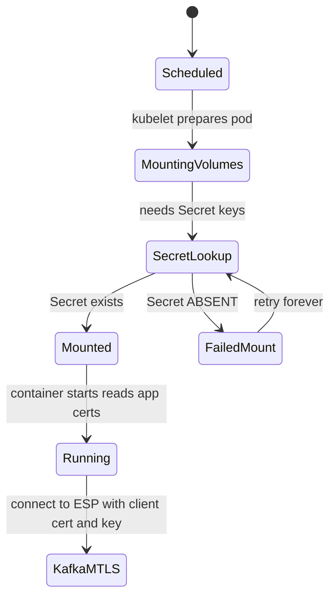

# How I diagnosed the missing `keys` secret — and how you can reproduce it

This is the companion to the [RCA](./rca.md). The RCA records *what happened*. This document teaches *how to think it through yourself*, so next time you don't need me. It is deliberately about **method + mechanism**, with the commands as the *consequence* of the reasoning, not the start of it.

## Knowledge Contract

After this you can, **unaided**:

1. **explain** the difference between a secret being *defined*, *deployed*, and *provisioned* — and why confusing them ends an investigation too early.
2. **draw** the lifecycle of a Secret-as-volume mount and pinpoint where "secret not found" occurs.
3. **predict** what a Helm `{{- if … }} … {{- end }}` with no `else` renders when no branch matches.
4. **run** the three-truths check (git vs cloud vs runtime) to localize any provisioning bug.
5. **reproduce** this exact diagnosis from cold using read-only probes, and know *why* each probe is the next question.
6. **transfer** the method to a different "secret not found" (a near-case at the end).

It does **not** teach ESP certificate issuance (owner-gated) — only how to locate and reason about the provisioning gap.

## The mental trap this incident sets (and how to not fall in)

Most people, told "secret `keys` is missing," do this:

```text
grep the repo for "keys"  ->  find common/templates/secret.yaml  ->  "ah, it's defined here"  ->  STOP.
```

That is the trap. **"Defined" is not "deployed" is not "provisioned."** Three different questions:

```text
DEFINED    : does some YAML/template describe this object?         (grep finds this)
DEPLOYED   : does a pipeline / GitOps actually apply that YAML?    (you must check CD)
PROVISIONED: at runtime, what created the live object, from where? (you must check the cluster + source-of-truth)
```

In this incident `keys` is **defined** (a Helm template), **deployed in MC but not in Sandbox** (MC's GitOps path installs the `common` chart; Sandbox's legacy pipeline doesn't), and in Sandbox was **provisioned only by a human** (`kubectl create`). If you stop at "defined" — or worse, run one string search, get 0 hits, and conclude "dead code" — you miss that the *same chart* deploys fine elsewhere. The whole skill is *refusing to stop at "defined," and checking which deploy path serves the failing environment.*

## First-principles ladder

```text
Secret      : a namespaced bag of base64 key→value items in Kubernetes.
Volume mount: a pod can ask for a Secret to appear as files in a directory.
Invariant   : the kubelet must FIND that Secret before the pod starts. Missing Secret = the
              pod cannot mount = it never becomes Ready. It WAITS (retries), it does not crash.
Helm        : renders templates to objects. `{{- if A }}…{{- else if B }}…{{- end }}` with NO
              `{{- else }}` produces NOTHING when neither A nor B is true.
Provider    : a controller (CSI SecretProviderClass, or External Secrets Operator) that
              MATERIALIZES a Secret from a source of truth (Key Vault) — so the Secret exists
              without a human, in every environment, and tracks the source.
Failure here: `keys` is defined in the `common` chart; MC's GitOps path installs it (so keys renders),
              but Sandbox's legacy pipeline never installs `common` → in Sandbox keys exists only where a human made it.
```

Read that twice. If you can recite it, you can predict this failure in any chart that hard-codes a secret behind environment conditionals.

## Where exactly the failure happens (draw this)



> **Cognitive job:** show the failure is *before* the container runs. That's why the app has no error logs and "nothing is failing in the namespace" can be true while pods are stuck — the symptom lives in the kubelet, not the app.

## The three-truths method (your localization tool)

When something "should exist but doesn't," compare three independent truths. Where they disagree is the bug.

```text
            ┌─────────────────────────────┐
            │  TRUTH 1: GIT (intended)     │  "what does the chart/IaC SAY should exist?"
            └─────────────┬───────────────┘
                          │ compare
            ┌─────────────▼───────────────┐
            │  TRUTH 2: CLOUD (source)     │  "what does Azure / Key Vault actually HOLD?"
            └─────────────┬───────────────┘
                          │ compare
            ┌─────────────▼───────────────┐
            │  TRUTH 3: RUNTIME (live)     │  "what is actually IN the cluster, and who made it?"
            └─────────────────────────────┘
```

For this incident:
- **Truth 1 (git):** `keys` is defined inline in the `common` chart; that chart is published to OCI and deployed in **MC** via GitOps (`container.env=DevMC`), but Sandbox's legacy pipeline never installs it.
- **Truth 2 (cloud):** the correct Kafka certs sit in KV `vpp-agg-sb`.
- **Truth 3 (runtime):** `keys` exists but was hand-made (no `ownerReferences`), and the CSI provider that *could* make it excludes it.

The disagreement — "cloud has the certs; MC's deploy path installs the chart but Sandbox's doesn't; runtime needed a human" — *is* the root cause. Three-truths turns a vague "why is it missing?" into a precise "the chart isn't installed by *this* environment's deploy path, and no provider covers it here."

## Reproduce the diagnosis from cold (the reasoning behind each probe)

Each step is a *question*, then the command that answers it. Read the questions; the commands are mechanical.

0. **Step 0 — get read-only Sandbox access** (required before any probe below). Sandbox uses Azure-CLI identity only — no MC service-principal, no IP whitelist. The repeatable way is the **`eneco-tools-connect-mc-environments`** skill (Sandbox path / `mc-connect-sandbox.sh`); the raw equivalent:
   ```bash
   az login --tenant eca36054-49a9-4731-a42f-8400670fc022 --scope "https://management.core.windows.net//.default"   # interactive MFA
   SB=7b1ba02e-bac6-4c45-83a0-7f0d3104922e
   az aks get-credentials --subscription "$SB" -g rg-vpp-app-sb-401 -n vpp-aks01-d --file /tmp/sb.kubeconfig --overwrite-existing
   export KUBECONFIG=/tmp/sb.kubeconfig    # isolated file — don't clobber a shared ~/.kube/config
   ```
   Pass `--subscription`/`--context` explicitly so you don't disturb other work's default sub.

1. **Q: Is the secret really missing, and what consumes it?**
   `kubectl -n vpp-agg get secret keys` + `kubectl -n vpp-agg get pods`. Confirms symptom and blast radius.

2. **Q: Who created the live secret — a controller or a human?** (This splits "never provisioned" from "deleted/drifted".)
   `kubectl -n vpp-agg get secret keys -o json | jq '{created:.metadata.creationTimestamp, owner:.metadata.ownerReferences, labels:.metadata.labels, annotations:.metadata.annotations}'`
   *No `ownerReferences` and no Helm/CSI/Argo labels → not owned by any controller → a human made it.* Use **`ownerReferences`**, NOT `managedFields`, as the discriminator: on this cluster even the CSI-projected `application-secret` has empty `managedFields`, so emptiness proves nothing — but the CSI secret HAS `ownerReferences` and `keys` has none. This single probe is the most informative.

3. **Q: Is there a provider that should make it?**
   `kubectl -n vpp-agg get secretproviderclass -o json | jq '[.items[]|{name:.metadata.name,kv:.spec.parameters.keyvaultName,projects:[.spec.secretObjects[]?.secretName]}]'`
   *Provider exists, projects other secrets, but not `keys`.* Now you know the provider isn't the cause of self-heal — it simply doesn't cover this secret.

4. **Q: Does the source of truth even have the material?**
   `az keyvault secret list --vault-name vpp-agg-sb --subscription $SB -o table | grep -i kafka` then a PUBLIC-cert check: `az keyvault secret show … --name kafka-clientcert -o tsv --query value | openssl x509 -noout -subject -enddate`.
   *Certs present and valid → the fix is "wire them in," not "obtain certs."* (Use `-o tsv`, never `-o json`, or the PEM mangles.)

5. **Q: WHICH deploy path serves THIS environment, and does it deploy the chart that defines `keys`?** (The anti-trap step — and where the first pass went wrong.)
   Check BOTH paths: the legacy in-repo pipeline (`ado-repo-file Eneco.Vpp.Aggregation azure-pipeline/templates/deploy.yaml` → deploys `*fn`+`secretprovider`, gated env vpp-agg/afi, never `common`) AND the GitOps repo (`Eneco.Vpp.Aggregation.GitOps` → `Helm/common/dev/values.yaml` sets `container.env=DevMC`, pulls OCI `common` → deploys `keys` in MC). Confirm Sandbox: `kubectl get secrets | grep release.v1.common` (none) + `kubectl get applications -n argocd` (no app deploys `common`/`keys` to `vpp-agg`) + no `eneco-vpp-agg` ns on the Sandbox cluster.
   **Trap to avoid:** `ado-repo-search "Helm/common"` returns **0 hits** — a *false negative*, because the OCI publish step iterates a glob (`ls azure-pipeline/Helm/`), so the literal string never appears. Don't conclude "dead code" from a string search; check the *consumers* (OCI registry + GitOps repo). The real finding: `common` IS deployed in MC; Sandbox just isn't enrolled in that path.

By step 5 you can state the root cause with evidence, and you never touched a private key or changed anything.

## Anti-patterns and why they fail (reject these under pressure)

| Tempting move | Why it's wrong (mechanism) |
|---------------|----------------------------|
| "Found the template, case closed." | Defined ≠ deployed-here. The chart deploys in MC (GitOps) but not in Sandbox's pipeline — check the deploy path per environment. |
| "Restart the pods / the deployment." | Restart doesn't create a missing Secret; the mount fails again instantly. |
| "ESO/ArgoCD will reconcile it." | ESO is installed and ArgoCD is active here, but neither has an `ExternalSecret`/Application targeting `keys` — they watch other objects. |
| "Delete the secret to test the provider." | There is no provider for `keys` yet; you'd re-break Sandbox and the pods wait forever. |
| "Borrow another team's cert permanently." | Works at mount time but asserts the wrong identity; correct identity (`eet-vpp-dt`) is already in KV. |

## Evidence and confidence (so you know what's solid)

- **FACT (A1):** secret provenance (no `ownerReferences` → manual), SPC contents, KV cert identity+validity, pods Running, `common` deployed in MC via GitOps+OCI but not by Sandbox's pipeline — all directly observed (see RCA evidence ledger).
- **INFER (A2):** "previous cert expired ~6 months ago" (from Johnson's statement + new cert `notBefore`), and the durable-fix feasibility.
- **UNVERIFIED (A3):** whether a `keys` secret ever existed in Sandbox before 2026-06-01 (never-created vs created-then-lost can't be distinguished now). The earlier "who installs `common`?" residual was RESOLVED: `Eneco.Vpp.Aggregation.GitOps` deploys it to MC (`eneco-vpp-agg`), not Sandbox.

## Self-test (answers below)

1. You see `keys` with no `ownerReferences` and no Helm/CSI labels (its `managedFields` is also empty). Which field is the valid provenance discriminator here, and why is `managedFields` a trap?
2. The certs are in Key Vault and CSI runs in the cluster. Give the one-line reason `keys` was still missing.
3. A colleague restarts the deployment to fix a missing-secret mount error. Predict the result and explain the mechanism.
4. You're asked to make the fix durable. Which KV-vs-chart mismatch must you design around, and what are the two clean options?

<details><summary>Answers</summary>

1. Use **`ownerReferences`** (absent → no controller owns it → hand-made; corroborated by no Helm/CSI labels + the reporter's statement). `managedFields` is a trap: on this cluster the CSI-projected `application-secret` also has empty `managedFields`, so emptiness proves nothing. Conclusion: `keys` is unmanaged and will drift.
2. The CSI `SecretProviderClass` doesn't list `keys` in its `secretObjects`, so the provider never projects it even though the source material exists.
3. The pod re-enters `FailedMount` immediately — restart doesn't create the Secret; the mount precondition is still unmet, so it waits again (no crash, just not Ready).
4. The chart's `keys` needs a `ssl-key.pfx` (PKCS#12) but KV holds a PEM key; design around it by either storing/assembling the `.pfx` (option a) or changing the app to use the PEM key and dropping the pfx (option b).
</details>

## Transfer test (prove you can adapt the method)

> Different case: a `flex-trade-optimizer` pod fails with `secret 'fto-db' not found`, but this app **is** ArgoCD-managed and the team uses External Secrets Operator. Walk the same method: which probe order changes, and which truth most likely holds the bug?

*Expected reasoning:* still run provenance first (`get secret -o json` → is there an ESO owner / `ExternalSecret`?). Because ESO is in play, Truth-1 shifts from "Helm chart" to "is there an `ExternalSecret` CR and a healthy `SecretStore`?" The likely bug is Truth-1↔Truth-3 (the `ExternalSecret`/`SecretStore` mis-points or lacks KV access) rather than "dead chart." The *method* (define→deploy→provision, three-truths, provenance-first) is unchanged; only which truth carries the defect moves.

## Durable principles (carry these to the next incident)

- **Always ask "what *deploys* this?" not just "what *defines* it?"**
- **Provenance-first via `ownerReferences`** (not `managedFields`): owner-absence + no controller labels tells you human-vs-controller before anything else.
- **Three-truths (git/cloud/runtime) localizes provisioning bugs in three probes.**
- **A missing volume-mounted Secret waits forever — it is a precondition failure, not a crash.**
- **One secret outside the provider is where the next outage hides.**
